Brief Introduction to R and Descriptive Analysis of the Dataset
================

-   [1 Introduction](#1-introduction)
-   [2 Descriptive Analysis of the
    portfolio](#2-descriptive-analysis-of-the-portfolio)
    -   [2.1 PolicyID](#21-policyid)
    -   [2.2 Exposure in month](#22-exposure-in-month)
    -   [2.3 Number of claim : ClaimNb](#23-number-of-claim--claimnb)
    -   [2.4 Power](#24-power)
    -   [2.5 CarAge](#25-carage)
    -   [2.6 DriverAge](#26-driverage)
    -   [2.7 Brand](#27-brand)
    -   [2.8 Gas](#28-gas)
    -   [2.9 Region](#29-region)
    -   [2.10 Density](#210-density)
-   [3 Interactions](#3-interactions)
    -   [3.1 Fuel and Car Age](#31-fuel-and-car-age)
    -   [3.2 Fuel and Driver Age](#32-fuel-and-driver-age)
-   [4 Useful Links](#4-useful-links)

``` r
options(encoding = 'UTF-8')
#Loading all the necessary packages
if (!require("xts")) install.packages("xts")
if (!require("CASdatasets")) install.packages("CASdatasets", repos = "http://cas.uqam.ca/pub/", type="source")
if (!require("caret")) install.packages("caret")
if (!require("ggplot2")) install.packages("ggplot2")
if (!require("mgcv")) install.packages("mgcv")
if (!require("dplyr")) install.packages("dplyr")
if (!require("gridExtra")) install.packages("gridExtra")
if (!require("visreg")) install.packages("visreg")
if (!require("MASS")) install.packages("MASS")
if (!require("plotrix")) install.packages("plotrix")
if (!require("rgeos")) install.packages("rgeos", type="source")
if (!require("rgdal")) install.packages("rgdal", type="source")
if (!require("xtable")) install.packages("xtable")
if (!require("maptools")) install.packages("maptools")
if (!require("scales")) install.packages("scales")
if (!require("broom")) install.packages("broom")
if (!require("stringi")) install.packages("stringi")


require("CASdatasets")
require("ggplot2")
require("mgcv")
require("caret")
require("gridExtra")
require("dplyr")
require("visreg")
require("MASS")
require("plotrix")
require("rgdal")
require("rgeos")
require("xtable")
require("maptools")
require("scales")
require("broom")
require("stringi")
```

# 1 Introduction

``` r
## Loading the dataset
require("CASdatasets")
data("freMTPLfreq")

# 'Keep it simple' Old style : freMTPLfreq = subset(freMTPLfreq,
# Exposure<=1 & Exposure >= 0 & CarAge<=25) With tidyverse (dplyr in fact)
# See cheatsheet
# https://github.com/rstudio/cheatsheets/blob/main/data-transformation.pdf
dataset = freMTPLfreq %>%
    filter(Exposure <= 1 & Exposure >= 0 & CarAge <= 25)

saveRDS(dataset, file = "../dataset.Rds")
# To load the dataset, uncomment the following line dataset = readRDS(file
# = '../dataset.Rds')
```

A good idea is to check whether the dataset has been loaded correctly.
To do this, the following tools can be used:

-   *head* allows to visualize the first 6 lines of the dataset.

``` r
head(dataset)
```

    ##   PolicyID ClaimNb Exposure Power CarAge DriverAge
    ## 1        1       0     0.09     g      0        46
    ## 2        2       0     0.84     g      0        46
    ## 3        3       0     0.52     f      2        38
    ## 4        4       0     0.45     f      2        38
    ## 5        5       0     0.15     g      0        41
    ## 6        6       0     0.75     g      0        41
    ##                                Brand     Gas             Region Density
    ## 1 Japanese (except Nissan) or Korean  Diesel          Aquitaine      76
    ## 2 Japanese (except Nissan) or Korean  Diesel          Aquitaine      76
    ## 3 Japanese (except Nissan) or Korean Regular Nord-Pas-de-Calais    3003
    ## 4 Japanese (except Nissan) or Korean Regular Nord-Pas-de-Calais    3003
    ## 5 Japanese (except Nissan) or Korean  Diesel   Pays-de-la-Loire      60
    ## 6 Japanese (except Nissan) or Korean  Diesel   Pays-de-la-Loire      60

-   *str* allows to see the format of the different variables. We will
    typically distinguish numerical variables (real numbers or integers)
    and factors (categorical data).

``` r
str(dataset)
```

    ## 'data.frame':    410864 obs. of  10 variables:
    ##  $ PolicyID : Factor w/ 413169 levels "1","2","3","4",..: 1 2 3 4 5 6 7 8 9 10 ...
    ##  $ ClaimNb  : int  0 0 0 0 0 0 0 0 0 0 ...
    ##  $ Exposure : num  0.09 0.84 0.52 0.45 0.15 0.75 0.81 0.05 0.76 0.34 ...
    ##  $ Power    : Factor w/ 12 levels "d","e","f","g",..: 4 4 3 3 4 4 1 1 1 6 ...
    ##  $ CarAge   : int  0 0 2 2 0 0 1 0 9 0 ...
    ##  $ DriverAge: int  46 46 38 38 41 41 27 27 23 44 ...
    ##  $ Brand    : Factor w/ 7 levels "Fiat","Japanese (except Nissan) or Korean",..: 2 2 2 2 2 2 2 2 1 2 ...
    ##  $ Gas      : Factor w/ 2 levels "Diesel","Regular": 1 1 2 2 1 1 2 2 2 2 ...
    ##  $ Region   : Factor w/ 10 levels "Aquitaine","Basse-Normandie",..: 1 1 8 8 9 9 1 1 8 6 ...
    ##  $ Density  : int  76 76 3003 3003 60 60 695 695 7887 27000 ...

-   *summary* allows to compute for each variable some summary
    statistics.

``` r
summary(dataset)
```

    ##     PolicyID         ClaimNb           Exposure            Power      
    ##  1      :     1   Min.   :0.00000   Min.   :0.002732   f      :95432  
    ##  2      :     1   1st Qu.:0.00000   1st Qu.:0.200000   g      :90663  
    ##  3      :     1   Median :0.00000   Median :0.530000   e      :76784  
    ##  4      :     1   Mean   :0.03925   Mean   :0.559997   d      :67660  
    ##  5      :     1   3rd Qu.:0.00000   3rd Qu.:1.000000   h      :26558  
    ##  6      :     1   Max.   :4.00000   Max.   :1.000000   j      :17978  
    ##  (Other):410858                                        (Other):35789  
    ##      CarAge         DriverAge   
    ##  Min.   : 0.000   Min.   :18.0  
    ##  1st Qu.: 3.000   1st Qu.:34.0  
    ##  Median : 7.000   Median :44.0  
    ##  Mean   : 7.413   Mean   :45.3  
    ##  3rd Qu.:12.000   3rd Qu.:54.0  
    ##  Max.   :25.000   Max.   :99.0  
    ##                                 
    ##                                 Brand             Gas        
    ##  Fiat                              : 16653   Diesel :205299  
    ##  Japanese (except Nissan) or Korean: 79031   Regular:205565  
    ##  Mercedes, Chrysler or BMW         : 19087                   
    ##  Opel, General Motors or Ford      : 37287                   
    ##  other                             :  9738                   
    ##  Renault, Nissan or Citroen        :216684                   
    ##  Volkswagen, Audi, Skoda or Seat   : 32384                   
    ##                 Region          Density     
    ##  Centre            :159426   Min.   :    2  
    ##  Ile-de-France     : 69576   1st Qu.:   67  
    ##  Bretagne          : 41986   Median :  288  
    ##  Pays-de-la-Loire  : 38541   Mean   : 1987  
    ##  Aquitaine         : 31211   3rd Qu.: 1414  
    ##  Nord-Pas-de-Calais: 27111   Max.   :27000  
    ##  (Other)           : 43013

If one needs some *help* on a function, typing a question mark and the
name of the function in the console opens the help file of the function.
For instance,

``` r
?head
```

# 2 Descriptive Analysis of the portfolio

We will now have a descriptive analysis of the portfolio. The different
variables available are *PolicyID, ClaimNb, Exposure, Power, CarAge,
DriverAge, Brand, Gas, Region, Density*.

## 2.1 PolicyID

The variable *PolicyID* related to a unique identifier of the policy. We
can check that every policy appears only once in the dataset

``` r
length(unique(dataset$PolicyID)) == nrow(dataset)
```

    ## [1] TRUE

Another possibility is to check the frequency of each *PolicyID* using
the function *table*. The result is a table that shows for each
*PolicyID* how many lines are in the dataset. We can then use a second
time the function *table* in this result to show the frequency. We
expect to have only **ones** (with possibily zeros), meaning each
*PolicyID* has a unique line.

``` r
table(table(dataset$PolicyID))
```

    ## 
    ##      0      1 
    ##   2305 410864

**To what corresponds the 0 ?** It appears that in this dataset the
variable *PolicyID* is a factor. A factor variable has different
*levels*. It appears that some PolicyID may be missing here (removed
from the dataset ?). It is as if we had a 3-level categorical variable,
for instance, color of a car, which takes three possible values: red,
blue, gray, but in our dataset, we would only have red and blue cars.
Gray would still be a level, but with no observation (i.e. no row)
corresponding to a gray car. To remove unused levels, we can rely on the
function *droplevels*.

## 2.2 Exposure in month

The Exposure reveals the fraction of the year during which the
policyholder is in the portfolio. We can compute the total exposure by
summing the policyholders’ exposures. Here we find 230 082.6 years.

We can show the number of months of exposure on a table. The function
*cut* allows to categorize (bin) a numerical variable. We can specify
where to ‘break’ and give a name to each level using the *labels*
argument. The output is a factor variable.

``` r
table(cut(dataset$Exposure, breaks = seq(from = 0, to = 1, by = 1/12), labels = 1:12))
```

    ## 
    ##      1      2      3      4      5      6      7      8      9     10 
    ##  62633  29216  33452  24213  19463  29565  18835  14438  21518  13653 
    ##     11     12 
    ##  12422 131456

Using the function *prop.table*, it is possible to represent this
information in relative terms show the number of months of exposure on a
table.

``` r
Exposures_prop = prop.table(table(cut(dataset$Exposure, breaks = seq(from = 0,
    to = 1, by = 1/12), labels = 1:12)))
round(Exposures_prop, 4)
```

    ## 
    ##      1      2      3      4      5      6      7      8      9     10 
    ## 0.1524 0.0711 0.0814 0.0589 0.0474 0.0720 0.0458 0.0351 0.0524 0.0332 
    ##     11     12 
    ## 0.0302 0.3200

Alternatively, we can use a barplot !

``` r
ggplot(dataset) + geom_bar(aes(x = cut(Exposure, breaks = seq(from = 0, to = 1,
    by = 1/12), labels = 1:12))) + scale_x_discrete(name = "Number of months") +
    scale_y_continuous(name = "Number of Policies", label = label_number()) +
    ggtitle("Exposure in months")
```


What if we also want to show the percentage on the bars ?

``` r
ggplot(dataset, aes(x = cut(Exposure, breaks = seq(from = 0, to = 1, by = 1/12),
    labels = 1:12), label = scales::percent(prop.table(stat(count)), accuracy = 0.1))) +
    geom_bar() + geom_text(stat = "count", vjust = -0.5, size = 3) + scale_x_discrete(name = "Number of months") +
    scale_y_continuous(name = "Number of Policies", label = label_number()) +
    ggtitle("Exposure in months")
```

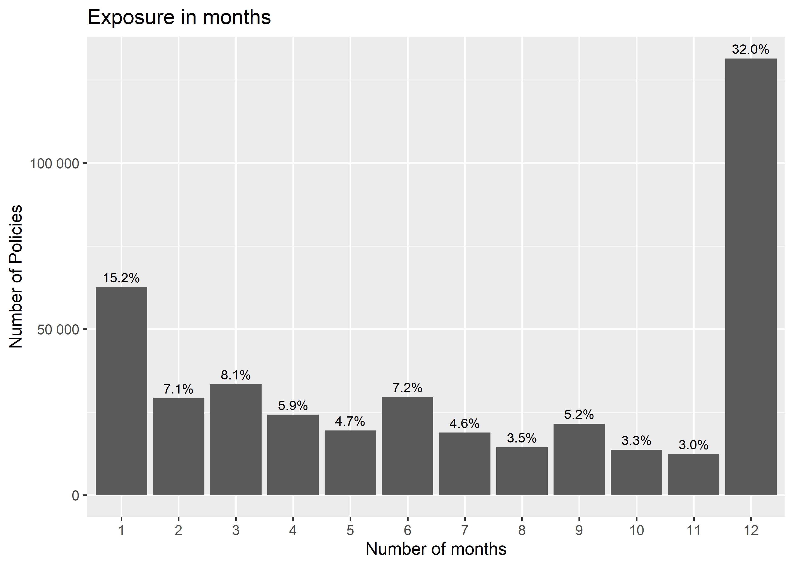

Note that a barplot is used to plot factor variables (categorical
variables). In our case, we categorized the variable Exposure using the
function *cut*. If we do not want to categorize this variable, we should
use a histogram. We can specify the number of bins (= 12) or the
binwidth (= 1/12).

``` r
ggplot(dataset, aes(x=Exposure))+geom_histogram(binwidth =1/12, fill='gray', color='white') +
  scale_x_continuous(name = "Exposure in fraction of years", breaks=seq(0,1,1/12), labels = round(seq(0,1,1/12), 3))+
  scale_y_continuous(name = 'Number of Polices', labels = label_number()) + 
  ggtitle("Exposure in fraction of years")
```

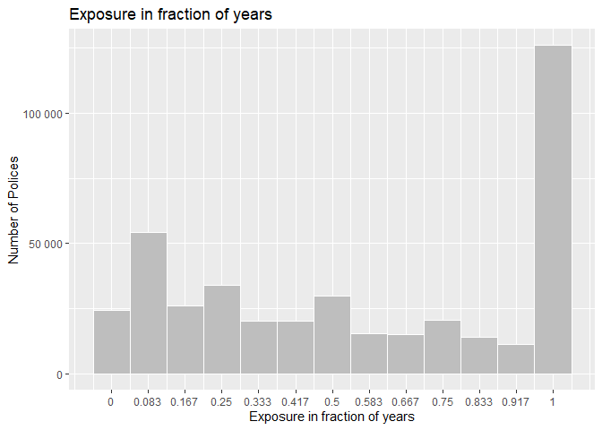<!-- -->

If you are not familiar with ggplot, I could recommend this cheat-sheet:
<https://github.com/rstudio/cheatsheets/blob/main/data-visualization-2.1.pdf>

## 2.3 Number of claim : ClaimNb

``` r
ggplot(dataset, aes(x = ClaimNb)) + geom_bar() + geom_label(stat = "count",
    aes(label = percent(prop.table(after_stat(count)), accuracy = 0.01)), vjust = 0.5) +
    scale_x_continuous(name = "Number of Claims") + scale_y_continuous(name = "Number of Polices",
    labels = label_number()) + ggtitle("Proportion of policies by number of claims")
```

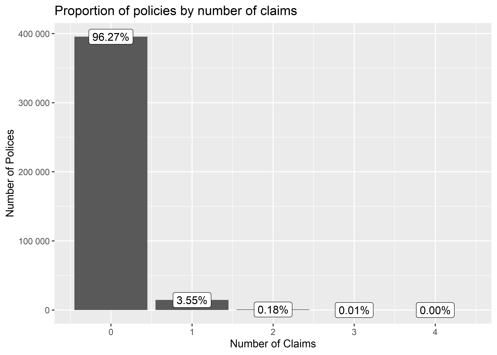

We can compute the average claim frequency in this portfolio, taking
into account the different exposures.

``` r
scales::percent(sum(dataset$ClaimNb)/sum(dataset$Exposure), accuracy = 0.01)
```

Here, we obtain **7.01%**.

Let us now look at the other variables.

## 2.4 Power

The variable *Power* is a categorized variable, related to the power of
the car. The levels of the variable are ordered categorically. We can
see the different **levels** of a **factor** by using the function
*level* in R:

``` r
levels(dataset$Power)
```

    ##  [1] "d" "e" "f" "g" "h" "i" "j" "k" "l" "m" "n" "o"

We can see the number of observations in each level of the variable, by
using the function *table*.

``` r
table(dataset$Power)
```

    ## 
    ##     d     e     f     g     h     i     j     k     l     m     n     o 
    ## 67660 76784 95432 90663 26558 17398 17978  9270  4593  1758  1276  1494

Remember however, that in insurance, exposures may differ from one
policyholder to another. Hence, the table above, does NOT measure the
exposure in each level of the variable *Power*. We can use the functions
*group_by* and *summarise* from package dplyr to give us the exposure in
each level of the variable. Check out the cheatsheet
<https://github.com/rstudio/cheatsheets/blob/main/data-transformation.pdf>

``` r
Power.summary = dataset %>%
    group_by(Power) %>%
    summarise(totalExposure = sum(Exposure), Number.Observations = length(Exposure))
```

We can show this on a plot as well:

``` r
ggplot(Power.summary, aes(x = Power, y = totalExposure, fill = Power, color = Power,
    label = scales::number(totalExposure))) + geom_bar(stat = "identity") +
    geom_text(stat = "identity", vjust = -0.5) + scale_y_continuous(name = "Exposure in years",
    labels = scales::number) + theme(legend.position = "none")
```

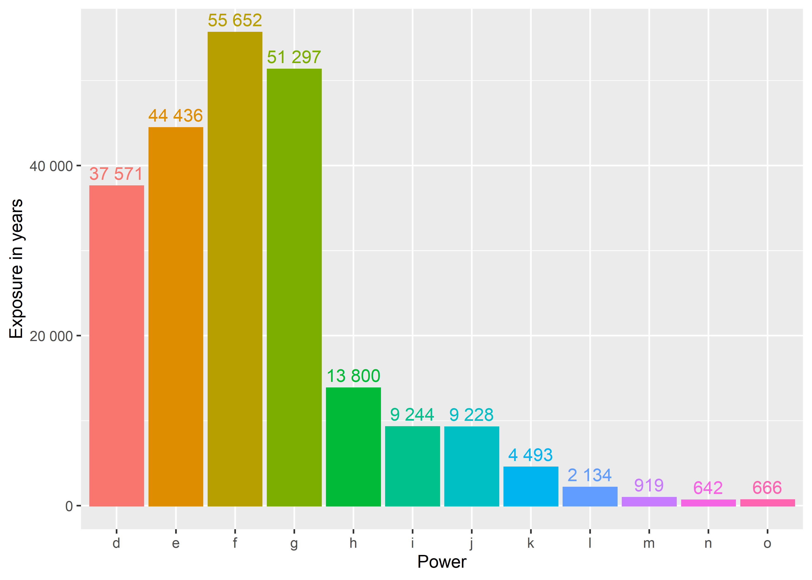

Let us now look at the observed claim frequency in each level

``` r
Power.summary = dataset %>%
    group_by(Power) %>%
    summarise(totalExposure = sum(Exposure), Number.Observations = length(Exposure),
        Number.Claims = sum(ClaimNb), Obs.Claim.Frequency = sum(ClaimNb)/sum(Exposure))
Power.summary
```

We can compute the ratio to the portfolio claim frequency.

``` r
portfolio.cf = sum(dataset$ClaimNb)/sum(dataset$Exposure)
# Can also be written as
portfolio.cf = with(dataset, sum(ClaimNb)/sum(Exposure))

ggplot(Power.summary, aes(x = Power, y = Obs.Claim.Frequency, color = Power,
    fill = Power, label = percent(Obs.Claim.Frequency, accuracy = 0.01))) +
    geom_bar(stat = "identity") + geom_hline(aes(yintercept = portfolio.cf),
    color = "black", size = 2, linetype = "dashed", alpha = 0.33) + geom_label(vjust = -0.21,
    fill = "white", alpha = 0.25) + annotate(geom = "text", x = "m", y = portfolio.cf,
    vjust = -0.5, label = paste("Average claim freq. of portfolio: ", percent(portfolio.cf,
        accuracy = 0.01)), color = "black") + scale_y_continuous(name = "Observed Claim Frequency",
    labels = percent_format(accuracy = 0.01)) + theme(legend.position = "none")
```

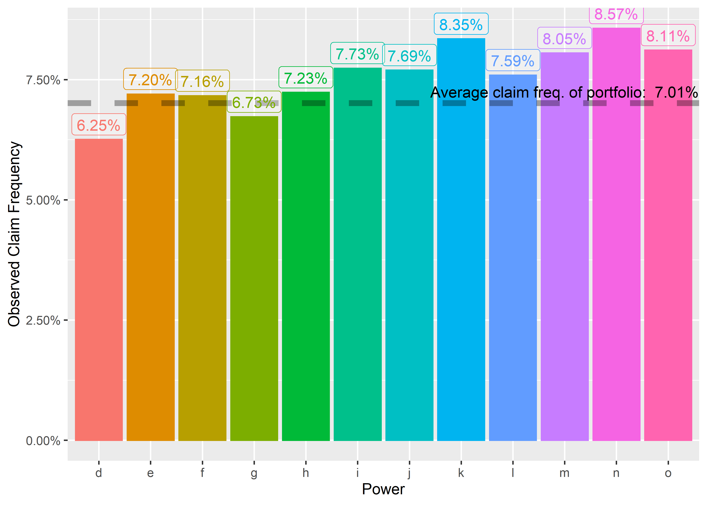

## 2.5 CarAge

The vehicle age, in years. This is the first continuous variable that we
encounter (although it only takes discrete values).

``` r
ggplot(dataset, aes(x = CarAge)) + geom_bar() + scale_x_continuous(name = "Age of the Car",
    breaks = seq(0, 100, 5)) + scale_y_continuous(name = "Number of Polices",
    labels = label_number())
```


Alternatively, we can use a histogram, with a binwidth of 1.

``` r
ggplot(dataset, aes(x = CarAge)) + geom_histogram(binwidth = 1, color = "black",
    fill = "white") + scale_x_continuous(name = "Age of the Car", breaks = seq(0,
    100, 5)) + scale_y_continuous(name = "Number of Polices", labels = label_number())
```

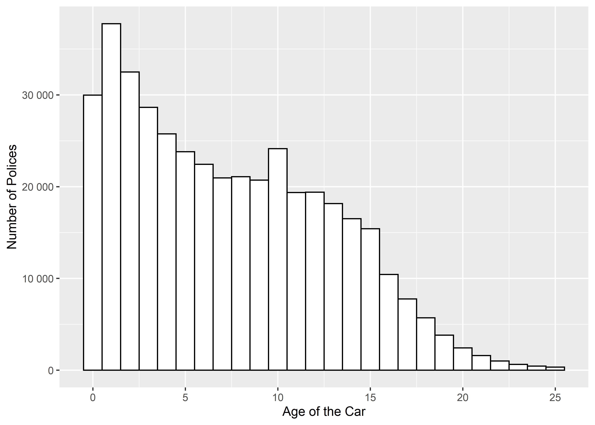

Again, here, the exposures are not considered on the barplot/histogram.
We can use *ddply* to correct this.

``` r
CarAge.summary = dataset %>%
    group_by(CarAge) %>%
    summarise(totalExposure = sum(Exposure), Number.Observations = length(Exposure))
CarAge.summary
```

Then, we can plot the data onto a barplot, as before.

``` r
ggplot(CarAge.summary, aes(x = CarAge, y = totalExposure, fill = factor(CarAge),
    color = factor(CarAge), label = label_number(accuracy = 1)(totalExposure))) +
    geom_bar(stat = "identity") + geom_text(stat = "identity", color = "black",
    hjust = 0.25, vjust = 0.5, angle = 45, check_overlap = TRUE) + scale_x_continuous(breaks = seq(0,
    100, 5)) + scale_y_continuous(name = "Exposure in years", labels = label_number()) +
    theme(legend.position = "none")
```

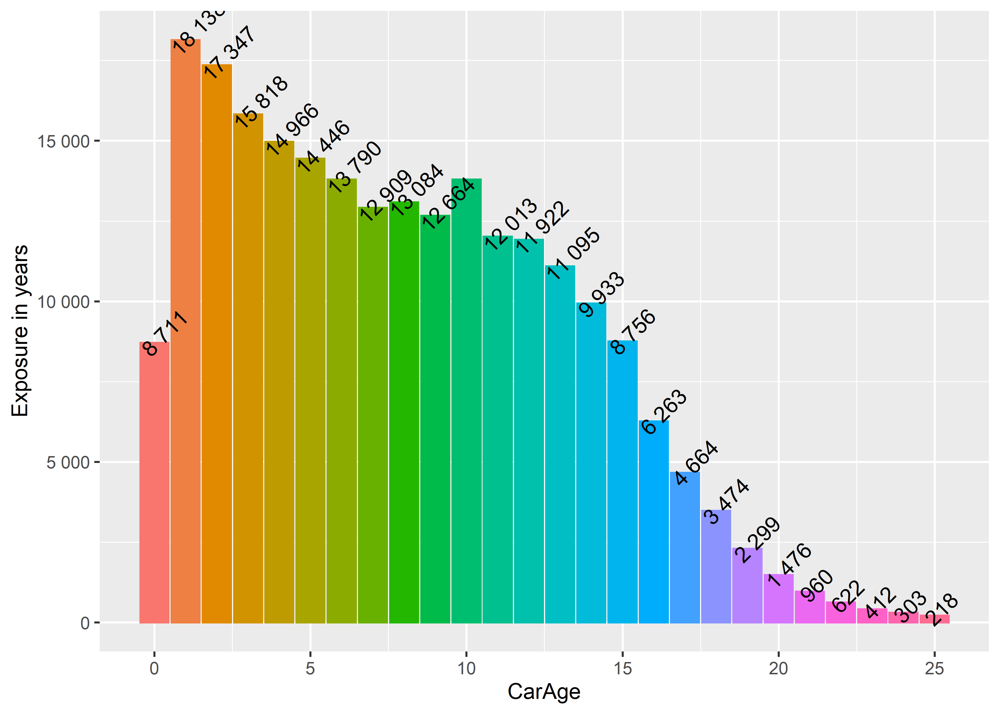

We can see a large difference, specially for new cars, which makes sense
! Indeed, let us look at the Exposure for recent vehicles, using a
boxplot for instance.

``` r
ggplot(dataset[dataset$CarAge < 5, ], aes(x = CarAge, y = Exposure, group = CarAge)) +
    geom_boxplot() + ggtitle("Exposure of recent cars")
```

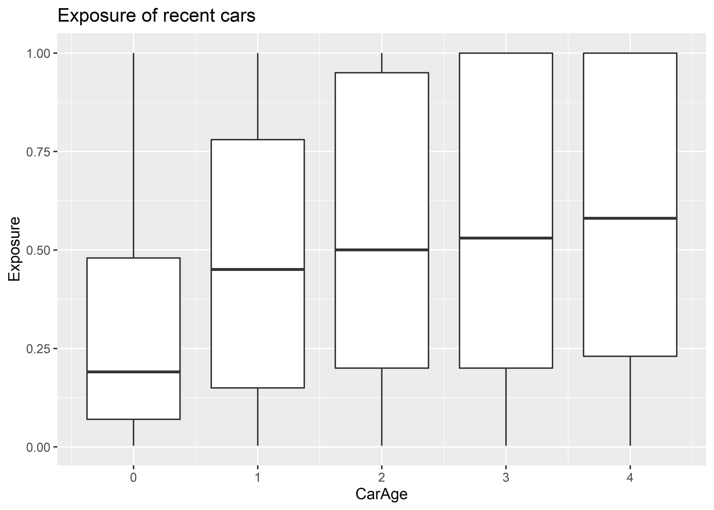

Let us now also compute the claim frequency by age of car,

``` r
CarAge.summary = dataset %>%
    group_by(CarAge) %>%
    summarise(totalExposure = sum(Exposure), Number.Observations = length(Exposure),
        Number.Claims = sum(ClaimNb), Obs.Claim.Freq = sum(ClaimNb)/sum(Exposure))
CarAge.summary
```

and plot it!

``` r
portfolio.cf = with(dataset, sum(ClaimNb)/sum(Exposure))

ggplot(CarAge.summary, aes(x = CarAge, y = Obs.Claim.Freq, label = percent(Obs.Claim.Freq,
    accuracy = 0.01))) + geom_bar(stat = "identity") + geom_hline(yintercept = portfolio.cf,
    color = "black", size = 2, linetype = "dashed", alpha = 0.33) + annotate(geom = "text",
    x = 20, y = portfolio.cf, vjust = -0.5, label = paste("Average claim freq. of portfolio: ",
        percent(portfolio.cf, accuracy = 0.01)), color = "black") + scale_x_continuous(name = "Age of the Car",
    breaks = seq(0, 100, 5)) + scale_y_continuous(name = "Observed Claim Frequency",
    labels = percent_format(accuracy = 0.01)) + theme(legend.position = "none")
```

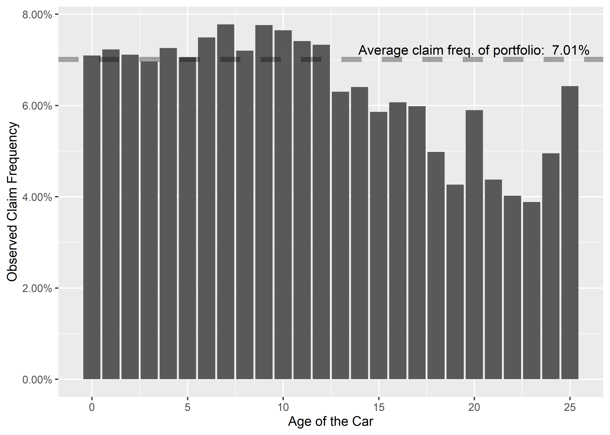

## 2.6 DriverAge

Similarly to the Age of the Car, we can visualize the Age of the
Drivers.

``` r
DriverAge.summary = dataset %>%
    group_by(DriverAge) %>%
    summarise(totalExposure = sum(Exposure), Number.Observations = length(Exposure),
        Number.Claims = sum(ClaimNb), Obs.Claim.Freq = sum(ClaimNb)/sum(Exposure))
head(DriverAge.summary, 9)
```

We can show the Exposures by Age of the Driver

``` r
ggplot(DriverAge.summary, aes(x = DriverAge, y = totalExposure)) + geom_bar(stat = "identity",
    width = 0.8) + scale_y_continuous(name = "Exposure in years", labels = label_number()) +
    scale_x_continuous(name = "Age of the Driver", breaks = seq(10, 150, 10))
```

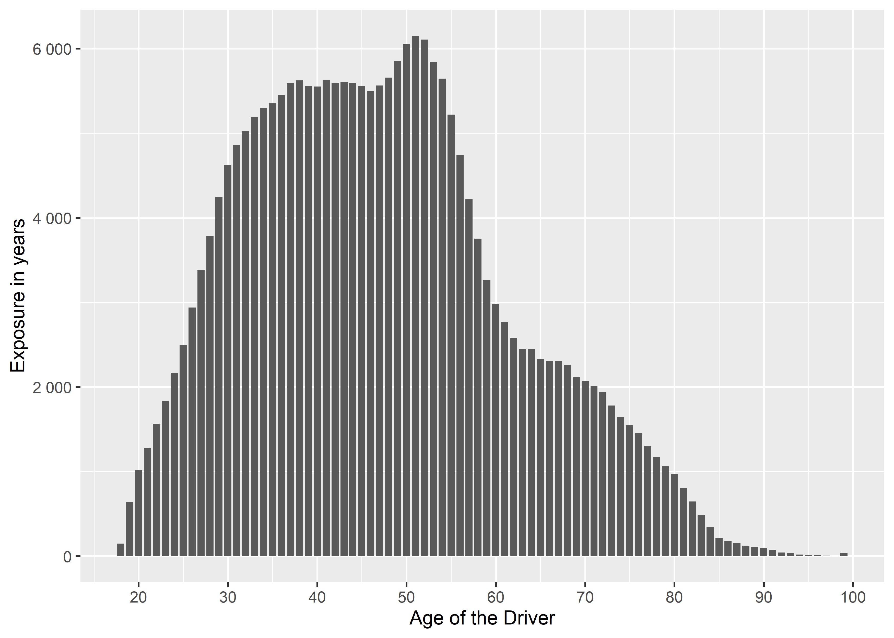

and the observed claim frequency by Age.

``` r
ggplot(DriverAge.summary, aes(x = DriverAge, y = Obs.Claim.Freq)) + geom_line() +
    geom_point() + scale_y_continuous(name = "Observed Claim Frequency", labels = percent,
    breaks = seq(0, 0.5, 0.05)) + scale_x_continuous(name = "Age of the Driver",
    breaks = seq(10, 150, 10))
```

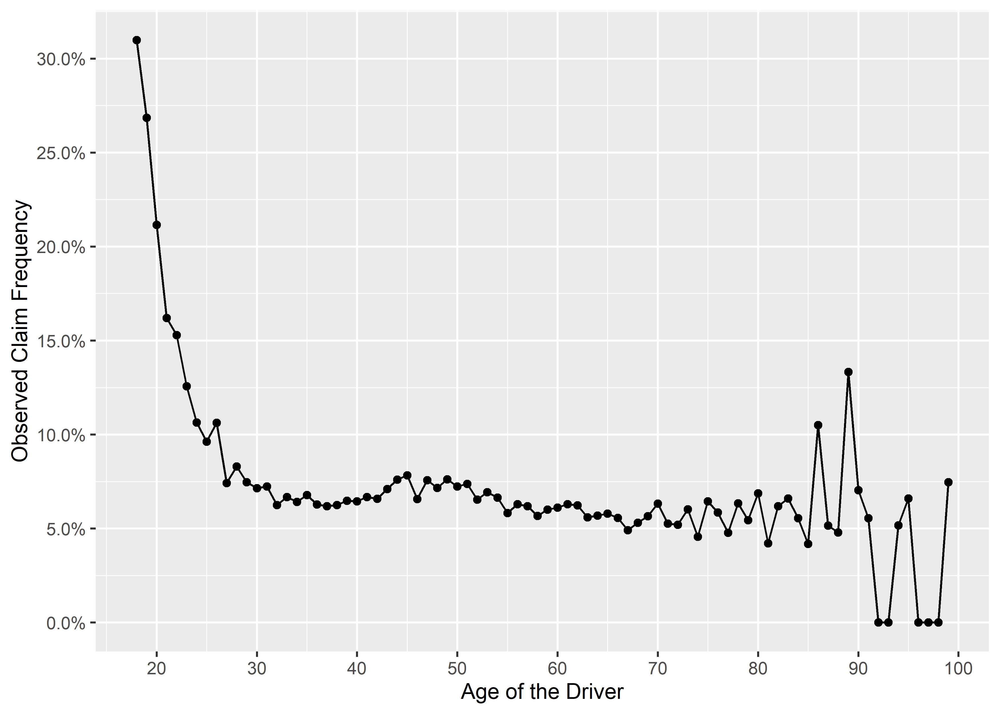

## 2.7 Brand

The variable *Brand* is a categorized variable, related to the brand of
the car. We can see the different *levels* of a *factor* by using the
function **level** in R:

``` r
levels(dataset$Brand)
```

    ## [1] "Fiat"                              
    ## [2] "Japanese (except Nissan) or Korean"
    ## [3] "Mercedes, Chrysler or BMW"         
    ## [4] "Opel, General Motors or Ford"      
    ## [5] "other"                             
    ## [6] "Renault, Nissan or Citroen"        
    ## [7] "Volkswagen, Audi, Skoda or Seat"

``` r
Brand.summary = dataset %>%
    group_by(Brand) %>%
    summarise(totalExposure = sum(Exposure), Number.Observations = length(Exposure),
        Number.Claims = sum(ClaimNb), Obs.Claim.Freq = sum(ClaimNb)/sum(Exposure))

Brand.summary
```

<!-- html table generated in R 4.1.2 by xtable 1.8-4 package -->
<!-- Tue Mar 29 20:05:30 2022 -->
<table border="1">
<tr>
<th>

Brand

</th>
<th>

totalExposure

</th>
<th>

Number.Observations

</th>
<th>

Number.Claims

</th>
<th>

Obs.Claim.Freq

</th>
</tr>
<tr>
<td>

Fiat

</td>
<td align="right">

9464.32

</td>
<td align="right">

16653

</td>
<td align="right">

714

</td>
<td align="right">

0.07544

</td>
</tr>
<tr>
<td>

Japanese (except Nissan) or Korean

</td>
<td align="right">

31228.97

</td>
<td align="right">

79031

</td>
<td align="right">

2078

</td>
<td align="right">

0.06654

</td>
</tr>
<tr>
<td>

Mercedes, Chrysler or BMW

</td>
<td align="right">

10392.17

</td>
<td align="right">

19087

</td>
<td align="right">

828

</td>
<td align="right">

0.07968

</td>
</tr>
<tr>
<td>

Opel, General Motors or Ford

</td>
<td align="right">

21733.56

</td>
<td align="right">

37287

</td>
<td align="right">

1731

</td>
<td align="right">

0.07965

</td>
</tr>
<tr>
<td>

other

</td>
<td align="right">

5676.08

</td>
<td align="right">

9738

</td>
<td align="right">

412

</td>
<td align="right">

0.07259

</td>
</tr>
<tr>
<td>

Renault, Nissan or Citroen

</td>
<td align="right">

133460.24

</td>
<td align="right">

216684

</td>
<td align="right">

8905

</td>
<td align="right">

0.06672

</td>
</tr>
<tr>
<td>

Volkswagen, Audi, Skoda or Seat

</td>
<td align="right">

18127.23

</td>
<td align="right">

32384

</td>
<td align="right">

1459

</td>
<td align="right">

0.08049

</td>
</tr>
</table>

``` r
ggplot(Brand.summary, aes(x = reorder(Brand, totalExposure), y = totalExposure,
    fill = Brand, label = label_number()(totalExposure))) + geom_bar(stat = "identity") +
    coord_flip() + guides(fill = "none") + scale_x_discrete(name = "") + scale_y_continuous("Exposure in years",
    labels = label_number(), expand = c(0.1, 0)) + geom_label()
```

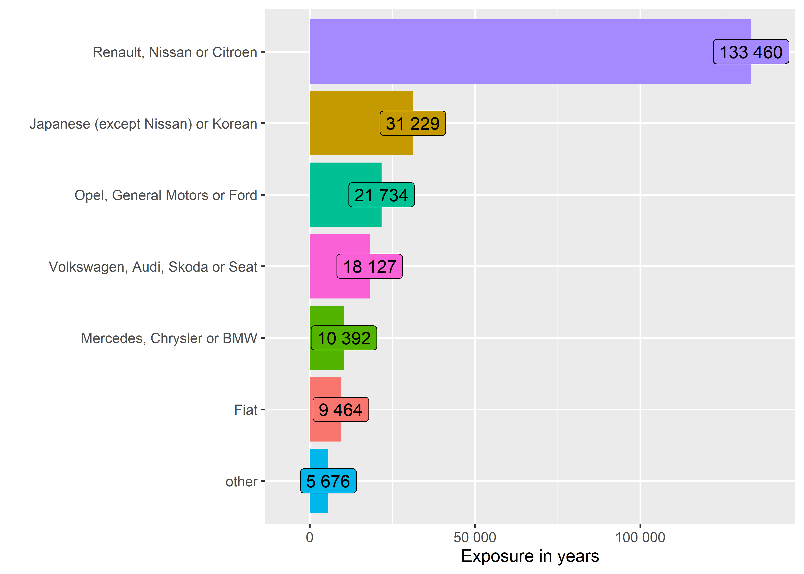

Let us now look at the claim frequency by Brand of the car.

``` r
ggplot(Brand.summary, aes(x = reorder(Brand, Obs.Claim.Freq), y = Obs.Claim.Freq,
    fill = Brand, label = percent(Obs.Claim.Freq, accuracy = 0.1))) + geom_bar(stat = "identity") +
    geom_label(hjust = +1.2) + coord_flip() + guides(fill = "none") + ggtitle("Observed Claim Frequencies by Brand of the car") +
    scale_x_discrete(name = "Brand") + scale_y_continuous("Observed claim Frequency",
    labels = percent)
```

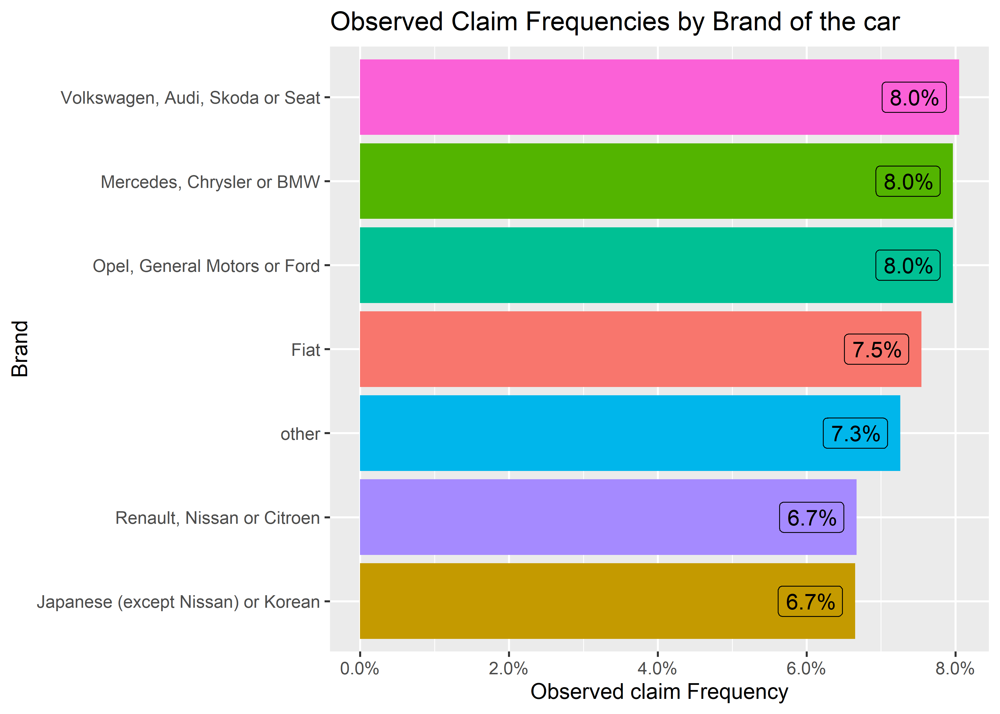

## 2.8 Gas

The variable *Gas* is a categorized variable, related to the fuel of the
car. We can see the different *levels* of a *factor* by using the
function **level** in R:

``` r
levels(dataset$Gas)
```

    ## [1] "Diesel"  "Regular"

``` r
Gas.summary = dataset %>%
    group_by(Gas) %>%
    summarise(totalExposure = sum(Exposure), Number.Observations = length(Exposure),
        Number.Claims = sum(ClaimNb), Obs.Claim.Freq = sum(ClaimNb)/sum(Exposure))
ggplot(Gas.summary, aes(x = Gas, y = totalExposure, fill = Gas, label = number(totalExposure))) +
    geom_bar(stat = "identity") + geom_label() + guides(fill = "none") + scale_x_discrete(name = "Fuel") +
    scale_y_continuous(name = "Total Exposure (in years)", labels = number)
```

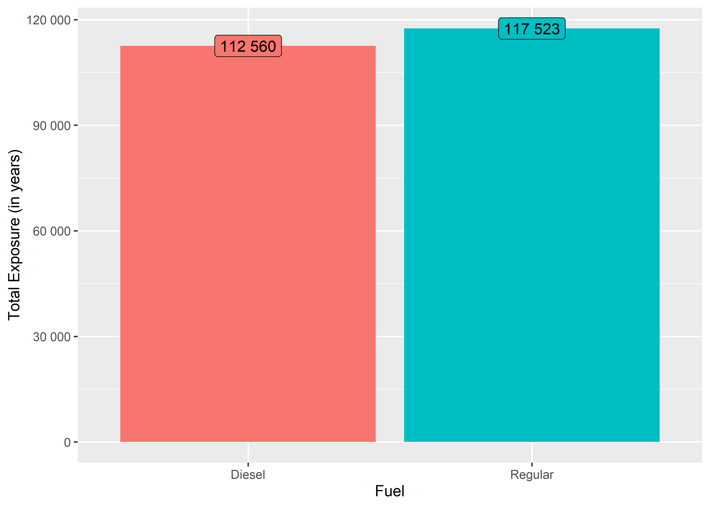

There seems to be a similar amount of Diesel and Regular gas vehicles in
the portfolio. It is generally expected that Diesel have a higher claim
frequency. Does this also hold on our dataset ?

``` r
ggplot(Gas.summary, aes(x = Gas, y = Obs.Claim.Freq, fill = Gas, label = percent(Obs.Claim.Freq))) +
    geom_bar(stat = "identity") + geom_label() + guides(fill = "none") + scale_x_discrete(name = "Fuel") +
    scale_y_continuous("Observed claim Frequency", labels = percent)
```

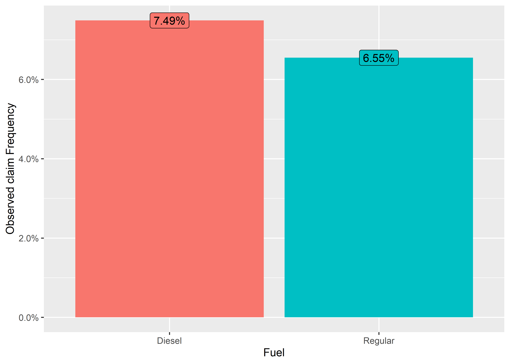

## 2.9 Region

The variable *Region* is a categorized variable, related to the region
of the place of residence. We can see the different *levels* of a
*factor* by using the function **level** in R:

``` r
levels(dataset$Region)
```

    ##  [1] "Aquitaine"          "Basse-Normandie"    "Bretagne"          
    ##  [4] "Centre"             "Haute-Normandie"    "Ile-de-France"     
    ##  [7] "Limousin"           "Nord-Pas-de-Calais" "Pays-de-la-Loire"  
    ## [10] "Poitou-Charentes"

What are the Exposures in each region ? What are the observed claim
frequencies ?

``` r
Region.summary = dataset %>%
    group_by(Region) %>%
    summarize(totalExposure = sum(Exposure), Number.Observations = length(Exposure),
        Number.Claims = sum(ClaimNb), Obs.Claim.Freq = sum(ClaimNb)/sum(Exposure))
Region.summary
```

<!-- html table generated in R 4.1.2 by xtable 1.8-4 package -->
<!-- Tue Mar 29 20:05:32 2022 -->
<table border="1">
<tr>
<th>

Region

</th>
<th>

totalExposure

</th>
<th>

Number.Observations

</th>
<th>

Number.Claims

</th>
<th>

Obs.Claim.Freq

</th>
</tr>
<tr>
<td>

Aquitaine

</td>
<td align="right">

14222.66

</td>
<td align="right">

31211

</td>
<td align="right">

1052

</td>
<td align="right">

0.07397

</td>
</tr>
<tr>
<td>

Basse-Normandie

</td>
<td align="right">

6621.74

</td>
<td align="right">

10848

</td>
<td align="right">

451

</td>
<td align="right">

0.06811

</td>
</tr>
<tr>
<td>

Bretagne

</td>
<td align="right">

27656.64

</td>
<td align="right">

41986

</td>
<td align="right">

1867

</td>
<td align="right">

0.06751

</td>
</tr>
<tr>
<td>

Centre

</td>
<td align="right">

101843.46

</td>
<td align="right">

159426

</td>
<td align="right">

6460

</td>
<td align="right">

0.06343

</td>
</tr>
<tr>
<td>

Haute-Normandie

</td>
<td align="right">

3147.22

</td>
<td align="right">

8726

</td>
<td align="right">

219

</td>
<td align="right">

0.06959

</td>
</tr>
<tr>
<td>

Ile-de-France

</td>
<td align="right">

30016.99

</td>
<td align="right">

69576

</td>
<td align="right">

2575

</td>
<td align="right">

0.08578

</td>
</tr>
<tr>
<td>

Limousin

</td>
<td align="right">

2376.00

</td>
<td align="right">

4539

</td>
<td align="right">

196

</td>
<td align="right">

0.08249

</td>
</tr>
<tr>
<td>

Nord-Pas-de-Calais

</td>
<td align="right">

11346.79

</td>
<td align="right">

27111

</td>
<td align="right">

939

</td>
<td align="right">

0.08275

</td>
</tr>
<tr>
<td>

Pays-de-la-Loire

</td>
<td align="right">

21791.75

</td>
<td align="right">

38541

</td>
<td align="right">

1569

</td>
<td align="right">

0.07200

</td>
</tr>
<tr>
<td>

Poitou-Charentes

</td>
<td align="right">

11059.29

</td>
<td align="right">

18900

</td>
<td align="right">

799

</td>
<td align="right">

0.07225

</td>
</tr>
</table>

We can plot a map with the observed claim frequencies and the total
Exposure. We first need to obtain the shape files (which contain the
borders of each administrative area.)

1.  Download shapefile from <http://www.diva-gis.org/gData>
2.  Extract all the files from the zip files, in a directory called
    shapefiles in your working directory

``` r
area <- rgdal::readOGR("shapefiles/FRA_adm1.shp", use_iconv = TRUE, encoding = "UTF-8")  # From http://www.diva-gis.org/gData
```

    ## OGR data source with driver: ESRI Shapefile 
    ## Source: "C:\Users\Florian\Documents\UCLouvain\Assurance Dommage\SummerSchool\1 - Introduction & Descriptive Analysis\shapefiles\FRA_adm1.shp", layer: "FRA_adm1"
    ## with 22 features
    ## It has 9 fields
    ## Integer64 fields read as strings:  ID_0 ID_1

``` r
# Note that the tidy function will remove the data.
area_tidy = tidy(area)  # package broom

# Plot an 'empty' map
ggplot(area_tidy, aes(x = long, y = lat, group = group)) + geom_polygon(color = "black",
    size = 0.1, fill = "lightgrey") + coord_equal() + theme_minimal()
```

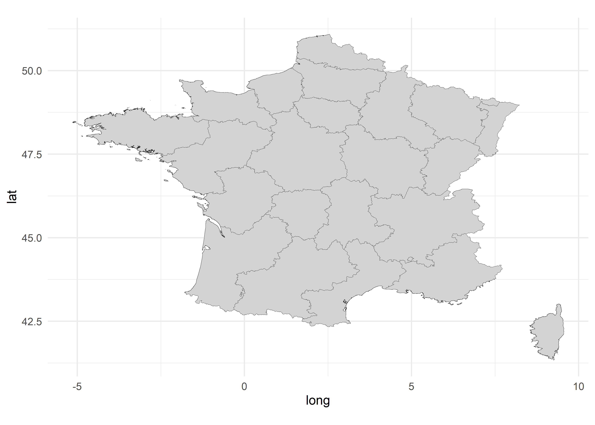

We are now going to include our data into the map

``` r
# First we re-include the data (that disappeared with the tidy function)
area$id <- row.names(area)
area_tidy2 <- area_tidy %>%
    full_join(area@data, by = "id")

# Because of accents ...
area_tidy2$NAME_1 = stri_trans_general(str = area_tidy2$NAME_1, id = "Latin-ASCII")

# Which computed data do we want ?
data_to_add = Region.summary[, c("Region", "totalExposure", "Obs.Claim.Freq")]
# Merge it
area_tidy2 <- area_tidy2 %>%
    full_join(data_to_add, by = c(NAME_1 = "Region"))

# Very important: Do not forget to sort by 'order' variable.  area_tidy2 =
# area_tidy2[order(area_tidy2$order),] Easier with dplyr:
area_tidy2 = area_tidy2 %>%
    arrange(order)
```

``` r
ggplot(area_tidy2, aes(long, lat, group = group, fill = Obs.Claim.Freq)) + ggtitle("Observed Claim Frequencies") +
    geom_polygon(color = "black") + scale_fill_gradient(low = "green", high = "red",
    name = "Obs. Claim Freq.") + xlab("Longitude") + ylab("Latitude") + theme_void()
```

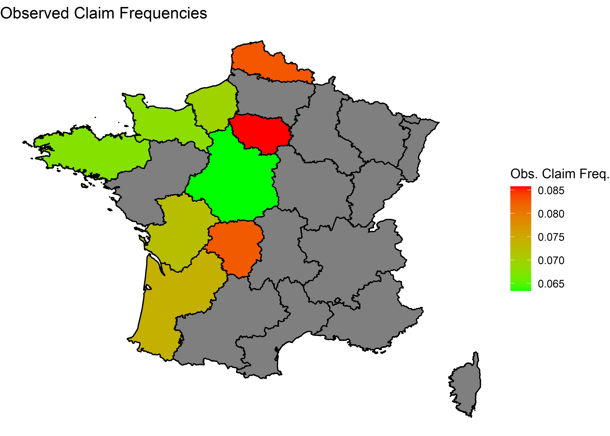

and the exposures (on a log-scale)…

``` r
ggplot(area_tidy2, aes(long, lat, group = group, fill = log(totalExposure))) +
    ggtitle("log Exposures in years") + geom_polygon(color = "black") + scale_fill_gradient(low = "green",
    high = "red", name = "log Exposure") + xlab("Longitude") + ylab("Latitude") +
    theme_void()
```

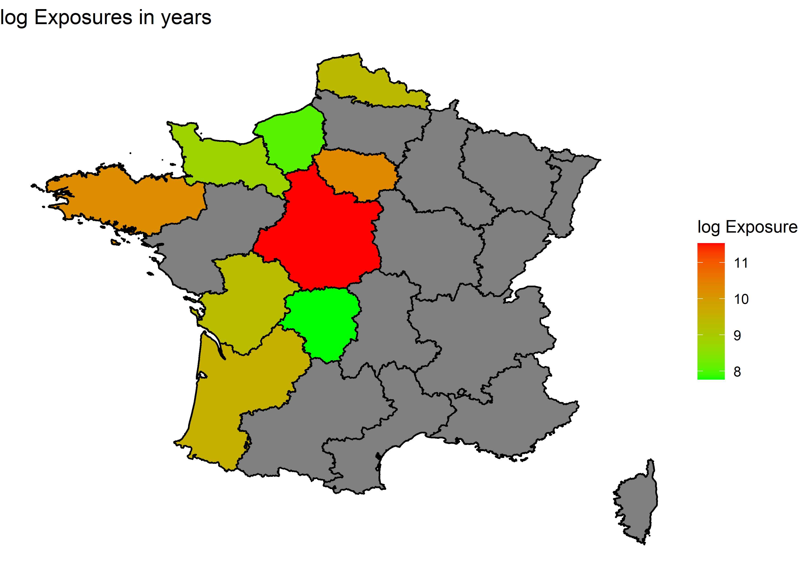

## 2.10 Density

The Density represents here the density of the population at the place
of residence. Let us take a look at the densities in the dataset.

``` r
summary(dataset$Density)
```

    ##    Min. 1st Qu.  Median    Mean 3rd Qu.    Max. 
    ##       2      67     288    1987    1414   27000

``` r
ggplot(dataset, aes(Density)) + geom_histogram(bins = 200)
```


Here, contrary to the age of the driver, or the age of the car, the
density has lots of different values

``` r
length(unique(dataset$Density))
```

We can compute this by using the command above, and we get 1270.

``` r
Density.summary = dataset %>%
    group_by(Density) %>%
    summarise(totalExposure = sum(Exposure), Number.Observations = length(Exposure),
        Number.Claims = sum(ClaimNb), Obs.Claim.Freq = sum(ClaimNb)/sum(Exposure))
head(Density.summary)
```

<!-- html table generated in R 4.1.2 by xtable 1.8-4 package -->
<!-- Tue Mar 29 20:05:40 2022 -->
<table border="1">
<tr>
<th>

Density

</th>
<th>

totalExposure

</th>
<th>

Number.Observations

</th>
<th>

Number.Claims

</th>
<th>

Obs.Claim.Freq

</th>
</tr>
<tr>
<td align="right">

2

</td>
<td align="right">

14.07

</td>
<td align="right">

18

</td>
<td align="right">

1

</td>
<td align="right">

0.07107

</td>
</tr>
<tr>
<td align="right">

3

</td>
<td align="right">

107.92

</td>
<td align="right">

152

</td>
<td align="right">

4

</td>
<td align="right">

0.03707

</td>
</tr>
<tr>
<td align="right">

4

</td>
<td align="right">

39.10

</td>
<td align="right">

65

</td>
<td align="right">

1

</td>
<td align="right">

0.02558

</td>
</tr>
<tr>
<td align="right">

5

</td>
<td align="right">

119.65

</td>
<td align="right">

217

</td>
<td align="right">

12

</td>
<td align="right">

0.10029

</td>
</tr>
<tr>
<td align="right">

6

</td>
<td align="right">

248.92

</td>
<td align="right">

399

</td>
<td align="right">

11

</td>
<td align="right">

0.04419

</td>
</tr>
<tr>
<td align="right">

7

</td>
<td align="right">

378.44

</td>
<td align="right">

580

</td>
<td align="right">

16

</td>
<td align="right">

0.04228

</td>
</tr>
</table>

We can plot the observed claim frequencies…

``` r
ggplot(Density.summary, aes(x = Density, y = Obs.Claim.Freq)) + geom_point()
```

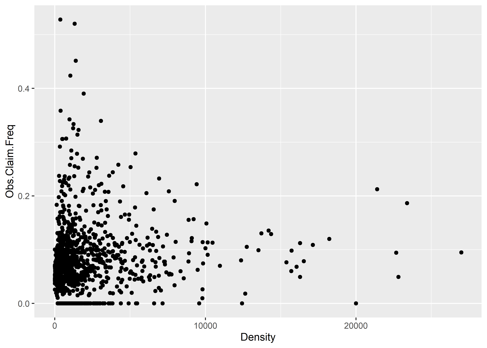

… but realize it is impossible to see a trend. One way out is to
categorize the variable. We will see later (GAM) that it is possible to
estimate a smooth function, which avoid the arbitrary categorization.

We can categorize the variable using the function *cut*.

``` r
dataset$DensityCAT = cut(dataset$Density, breaks = quantile(dataset$Density,
    probs = seq(from = 0, to = 1, by = 0.1)), include.lowest = TRUE)
table(dataset$DensityCAT)
```

    ## 
    ##              [2,28]             (28,51]             (51,91] 
    ##               41494               41173               41330 
    ##            (91,159]           (159,288]           (288,562] 
    ##               40432               41028               41408 
    ##      (562,1.16e+03] (1.16e+03,2.41e+03] (2.41e+03,4.35e+03] 
    ##               40889               41171               42408 
    ##  (4.35e+03,2.7e+04] 
    ##               39531

``` r
levels(dataset$DensityCAT) <- LETTERS[1:10]
```

Then, we can apply the same strategy as above.

``` r
Density.summary = dataset %>%
    group_by(DensityCAT) %>%
    summarise(totalExposure = sum(Exposure), Number.Observations = length(Exposure),
        Number.Claims = sum(ClaimNb), Obs.Claim.Freq = sum(ClaimNb)/sum(Exposure))
Density.summary
```

<!-- html table generated in R 4.1.2 by xtable 1.8-4 package -->
<!-- Tue Mar 29 20:05:41 2022 -->
<table border="1">
<tr>
<th>

DensityCAT

</th>
<th>

totalExposure

</th>
<th>

Number.Observations

</th>
<th>

Number.Claims

</th>
<th>

Obs.Claim.Freq

</th>
</tr>
<tr>
<td>

A

</td>
<td align="right">

26896.70

</td>
<td align="right">

41494

</td>
<td align="right">

1352

</td>
<td align="right">

0.05027

</td>
</tr>
<tr>
<td>

B

</td>
<td align="right">

25866.44

</td>
<td align="right">

41173

</td>
<td align="right">

1471

</td>
<td align="right">

0.05687

</td>
</tr>
<tr>
<td>

C

</td>
<td align="right">

25358.47

</td>
<td align="right">

41330

</td>
<td align="right">

1543

</td>
<td align="right">

0.06085

</td>
</tr>
<tr>
<td>

D

</td>
<td align="right">

24275.29

</td>
<td align="right">

40432

</td>
<td align="right">

1572

</td>
<td align="right">

0.06476

</td>
</tr>
<tr>
<td>

E

</td>
<td align="right">

24299.85

</td>
<td align="right">

41028

</td>
<td align="right">

1584

</td>
<td align="right">

0.06519

</td>
</tr>
<tr>
<td>

F

</td>
<td align="right">

24065.32

</td>
<td align="right">

41408

</td>
<td align="right">

1671

</td>
<td align="right">

0.06944

</td>
</tr>
<tr>
<td>

G

</td>
<td align="right">

22180.06

</td>
<td align="right">

40889

</td>
<td align="right">

1799

</td>
<td align="right">

0.08111

</td>
</tr>
<tr>
<td>

H

</td>
<td align="right">

21230.08

</td>
<td align="right">

41171

</td>
<td align="right">

1799

</td>
<td align="right">

0.08474

</td>
</tr>
<tr>
<td>

I

</td>
<td align="right">

19281.92

</td>
<td align="right">

42408

</td>
<td align="right">

1838

</td>
<td align="right">

0.09532

</td>
</tr>
<tr>
<td>

J

</td>
<td align="right">

16628.45

</td>
<td align="right">

39531

</td>
<td align="right">

1498

</td>
<td align="right">

0.09009

</td>
</tr>
</table>

``` r
ggplot(Density.summary, aes(x = DensityCAT, y = Obs.Claim.Freq, fill = DensityCAT,
    label = percent(Obs.Claim.Freq))) + geom_bar(stat = "identity") + geom_label() +
    guides(fill = "none") + scale_x_discrete(name = "Density") + scale_y_continuous("Observed claim Frequency",
    labels = percent)
```

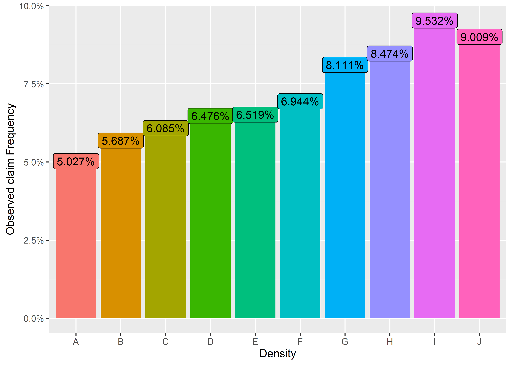

# 3 Interactions

We can of course also dive into some interactions. For instance, we
could analyse the effect of the car Age combined with the Fuel (Gas).

## 3.1 Fuel and Car Age

``` r
CarAge.Fuel.summary = dataset %>% group_by(CarAge, Gas) %>% 
                      summarise(totalExposure = sum(Exposure),
                                Number.Observations = length(Exposure),
                                Number.Claims = sum(ClaimNb),
                                Obs.Claim.Freq = sum(ClaimNb)/sum(Exposure))
```

    ## `summarise()` has grouped output by 'CarAge'. You can override using the
    ## `.groups` argument.

``` r
ggplot(CarAge.Fuel.summary, aes(x=CarAge, 
                                y=Obs.Claim.Freq)) + 
  facet_wrap(~Gas)+
  geom_bar(stat="identity") + 
  scale_x_continuous(name = "Age of the Car", breaks=seq(0,100,5))+
  scale_y_continuous(name = "Observed Claim Frequency", labels = percent_format(accuracy = 0.01))+
  theme(legend.position = 'none')
```

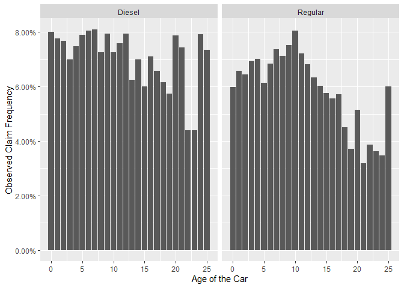<!-- -->

## 3.2 Fuel and Driver Age

We will illustrate another way to show this kind of data, by overlapping
both bars.

``` r
DriverAge.Fuel.summary = dataset %>%
    group_by(DriverAge, Gas) %>%
    summarize(Obs.Claim.Freq = sum(ClaimNb)/sum(Exposure))
```

    ## `summarise()` has grouped output by 'DriverAge'. You can override using
    ## the `.groups` argument.

``` r
ggplot(data = DriverAge.Fuel.summary, aes(x = DriverAge, y = Obs.Claim.Freq,
    fill = Gas, color = Gas, alpha = Gas)) + geom_bar(stat = "identity", position = "identity") +
    scale_x_continuous(name = "Age of the Driver", breaks = seq(0, 100, 5)) +
    scale_y_continuous(name = "Observed Claim Frequency", labels = label_percent()) +
    scale_colour_manual(values = c("lightblue4", "red")) + scale_fill_manual(values = c("lightblue",
    "pink")) + scale_alpha_manual(values = c(0.3, 0.8)) + theme_bw()
```

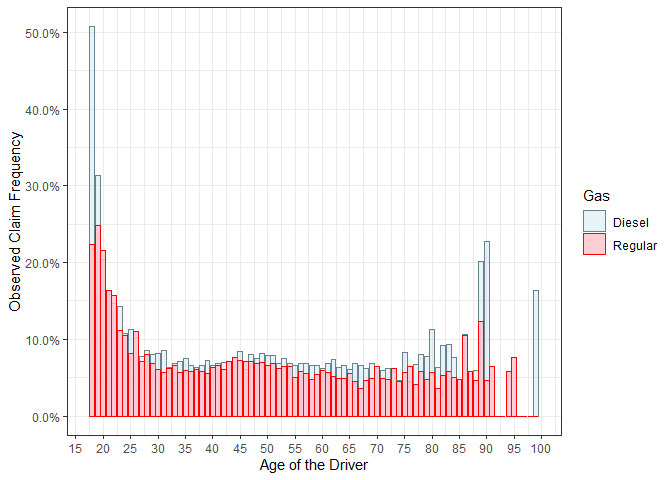<!-- -->

# 4 Useful Links

-   <https://github.com/rstudio/cheatsheets/blob/main/data-transformation.pdf>
-   <https://github.com/rstudio/cheatsheets/blob/main/data-visualization-2.1.pdf>
