Brief Introduction to R and Descriptive Analysis of the Dataset
================

-   [Introduction](#introduction)
-   [Descriptive Analysis of the portfolio](#descriptive-analysis-of-the-portfolio)
    -   [PolicyID](#policyid)
    -   [Exposure in month](#exposure-in-month)
    -   [Number of claim : ClaimNb](#number-of-claim-claimnb)
    -   [Power](#power)
    -   [CarAge](#carage)
    -   [DriverAge](#driverage)
    -   [Brand](#brand)
    -   [Gas](#gas)
    -   [Region](#region)
    -   [Density](#density)

Introduction
============

``` r
## Loading the dataset
require("CASdatasets")
data("freMTPLfreq")

freMTPLfreq = subset(freMTPLfreq, Exposure <= 1 & Exposure >= 0 & CarAge <= 
    25)

set.seed(85)
require("caret")
folds = createDataPartition(freMTPLfreq$ClaimNb, 0.5)
dataset = freMTPLfreq[folds[[1]], ]
```

A good idea is to check whether the dataset has been loaded correctly. To do this, the following tools can be used:

-   *head* allows to visualize the first 6 lines of the dataset.

``` r
head(dataset)
```

    ##   PolicyID ClaimNb Exposure Power CarAge DriverAge
    ## 1        1       0     0.09     g      0        46
    ## 2        2       0     0.84     g      0        46
    ## 4        4       0     0.45     f      2        38
    ## 5        5       0     0.15     g      0        41
    ## 7        7       0     0.81     d      1        27
    ## 9        9       0     0.76     d      9        23
    ##                                Brand     Gas Region Density
    ## 1 Japanese (except Nissan) or Korean  Diesel    R72      76
    ## 2 Japanese (except Nissan) or Korean  Diesel    R72      76
    ## 4 Japanese (except Nissan) or Korean Regular    R31    3003
    ## 5 Japanese (except Nissan) or Korean  Diesel    R52      60
    ## 7 Japanese (except Nissan) or Korean Regular    R72     695
    ## 9                               Fiat Regular    R31    7887

-   *str* allows to see the format of the different variables. We will typically distinguish numerical variables (real numbers or integers) and factors (categorical data).

``` r
str(dataset)
```

    ## 'data.frame':    205432 obs. of  10 variables:
    ##  $ PolicyID : int  1 2 4 5 7 9 10 14 17 18 ...
    ##  $ ClaimNb  : int  0 0 0 0 0 0 0 0 0 0 ...
    ##  $ Exposure : num  0.09 0.84 0.45 0.15 0.81 0.76 0.34 0.19 0.8 0.07 ...
    ##  $ Power    : Factor w/ 12 levels "d","e","f","g",..: 4 4 3 4 1 1 6 2 2 2 ...
    ##  $ CarAge   : int  0 0 2 0 1 9 0 0 0 0 ...
    ##  $ DriverAge: int  46 46 38 41 27 23 44 33 69 69 ...
    ##  $ Brand    : Factor w/ 7 levels "Fiat","Japanese (except Nissan) or Korean",..: 2 2 2 2 2 1 2 2 2 2 ...
    ##  $ Gas      : Factor w/ 2 levels "Diesel","Regular": 1 1 2 1 2 2 2 2 2 2 ...
    ##  $ Region   : Factor w/ 10 levels "R11","R23","R24",..: 9 9 5 6 9 5 1 1 1 1 ...
    ##  $ Density  : int  76 76 3003 60 695 7887 27000 1746 1376 1376 ...

-   *summary* allows to compute for each variable some summary statistics.

``` r
summary(dataset)
```

    ##     PolicyID         ClaimNb           Exposure            Power      
    ##  Min.   :     1   Min.   :0.00000   Min.   :0.002732   f      :47709  
    ##  1st Qu.:102981   1st Qu.:0.00000   1st Qu.:0.200000   g      :45390  
    ##  Median :206768   Median :0.00000   Median :0.530000   e      :38329  
    ##  Mean   :206581   Mean   :0.03914   Mean   :0.559871   d      :33720  
    ##  3rd Qu.:309942   3rd Qu.:0.00000   3rd Qu.:1.000000   h      :13346  
    ##  Max.   :413168   Max.   :4.00000   Max.   :1.000000   j      : 8962  
    ##                                                        (Other):17976  
    ##      CarAge         DriverAge    
    ##  Min.   : 0.000   Min.   :18.00  
    ##  1st Qu.: 3.000   1st Qu.:34.00  
    ##  Median : 7.000   Median :44.00  
    ##  Mean   : 7.417   Mean   :45.29  
    ##  3rd Qu.:12.000   3rd Qu.:54.00  
    ##  Max.   :25.000   Max.   :99.00  
    ##                                  
    ##                                 Brand             Gas        
    ##  Fiat                              :  8341   Diesel :102771  
    ##  Japanese (except Nissan) or Korean: 39413   Regular:102661  
    ##  Mercedes, Chrysler or BMW         :  9651                   
    ##  Opel, General Motors or Ford      : 18638                   
    ##  other                             :  4947                   
    ##  Renault, Nissan or Citroen        :108267                   
    ##  Volkswagen, Audi, Skoda or Seat   : 16175                   
    ##      Region         Density     
    ##  R24    :79767   Min.   :    2  
    ##  R11    :34778   1st Qu.:   67  
    ##  R53    :21032   Median :  287  
    ##  R52    :19321   Mean   : 1982  
    ##  R72    :15506   3rd Qu.: 1408  
    ##  R31    :13576   Max.   :27000  
    ##  (Other):21452

If one needs some *help* on a function, typing a question mark and the name of the function in the console opens the help file of the function. For instance,

``` r
?head
```

Descriptive Analysis of the portfolio
=====================================

We will now have a descriptive analysis of the portfolio. The different variables available are *PolicyID, ClaimNb, Exposure, Power, CarAge, DriverAge, Brand, Gas, Region, Density*.

PolicyID
--------

The variable *PolicyID* related to a unique identifier of the policy. We can check that every policy appears only once in the dataset

``` r
length(unique(dataset$PolicyID)) == nrow(dataset)
```

    ## [1] TRUE

Exposure in month
-----------------

The Exposure reveals the fraction of the year during which the policyholder is in the portfolio. We can compute the total exposure by summing the policyholders' exposures. Here we find 115015.5 years.

We can show the number of months of exposure on a table.

``` r
table(cut(dataset$Exposure, breaks = seq(from = 0, to = 1, by = 1/12), labels = 1:12))
```

    ## 
    ##     1     2     3     4     5     6     7     8     9    10    11    12 
    ## 31393 14729 16610 12040  9793 14680  9447  7248 10714  6838  6066 65874

Using the function *prop.table*, it is possible to represent this information in relative terms show the number of months of exposure on a table.

``` r
round(prop.table(table(cut(dataset$Exposure, breaks = seq(from = 0, to = 1, 
    by = 1/12), labels = 1:12))), 4)
```

    ## 
    ##      1      2      3      4      5      6      7      8      9     10 
    ## 0.1528 0.0717 0.0809 0.0586 0.0477 0.0715 0.0460 0.0353 0.0522 0.0333 
    ##     11     12 
    ## 0.0295 0.3207

Alternatively, we can use a barplot !

``` r
Exposure.summary = cut(dataset$Exposure, breaks = seq(from = 0, to = 1, by = 1/12))
levels(Exposure.summary) = 1:12
ggplot() + geom_bar(aes(x = Exposure.summary)) + xlab("Number of months") + 
    ggtitle("Exposure in months")
```

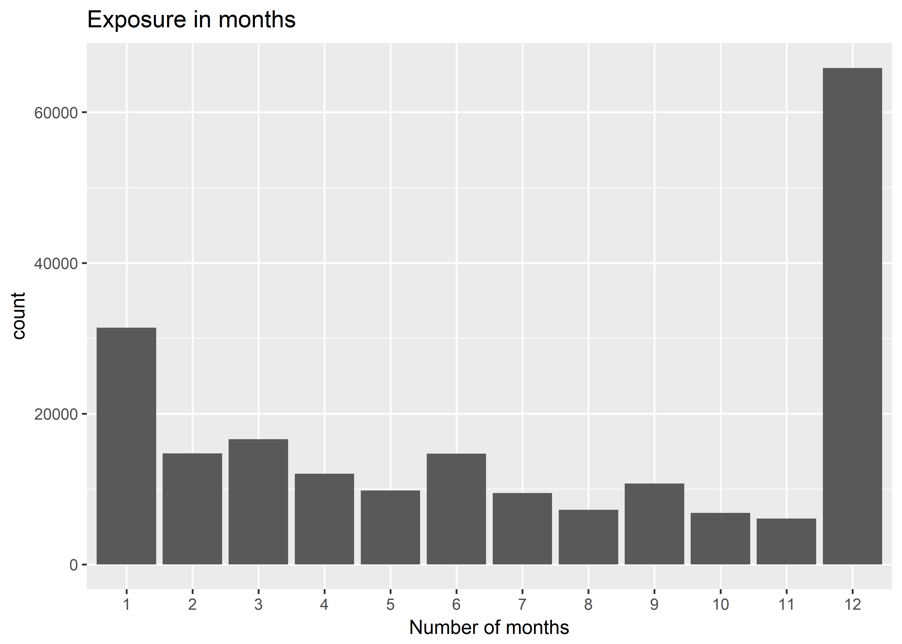

Number of claim : ClaimNb
-------------------------

``` r
ggplot(dataset, aes(x = ClaimNb)) + geom_bar() + geom_text(stat = "count", aes(label = ..count..), 
    vjust = -1) + ylim(c(0, 210000)) + ylab("") + xlab("Number of Claims") + 
    ggtitle("Proportion of policies by number of claims")
```

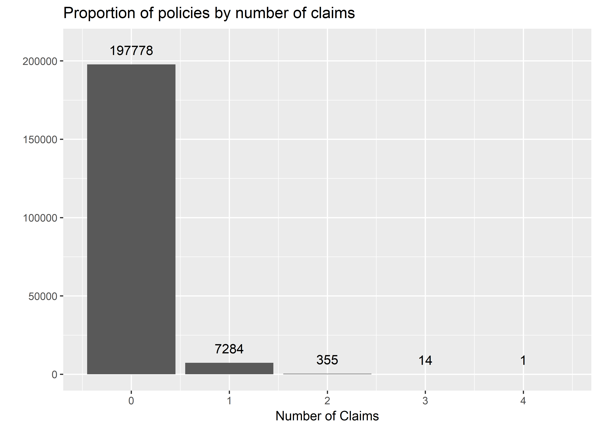

We can compute the average claim frequency in this portfolio, taking into account the different exposures.

``` r
sum(dataset$ClaimNb)/sum(dataset$Exposure)
```

Here, we obtain **0.0699**.

Let us now look at the other variables.

Power
-----

The variable *Power* is a categorized variable, related to the power of the car. The levels of the variable are ordered categorically. We can see the different **levels** of a **factor** by using the function *level* in R:

``` r
levels(dataset$Power)
```

    ##  [1] "d" "e" "f" "g" "h" "i" "j" "k" "l" "m" "n" "o"

We can see the number of observations in each level of the variable, by using the function *table*.

``` r
table(dataset$Power)
```

    ## 
    ##     d     e     f     g     h     i     j     k     l     m     n     o 
    ## 33720 38329 47709 45390 13346  8793  8962  4659  2255   905   624   740

Remember however, that in insurance, exposures may differ from one policyholder to another. Hence, the table above, does NOT measure the exposure in each level of the variable *Power*. We can use the function *ddply* to give us the exposure in each level of the variable.

``` r
require(plyr)
Power.summary = ddply(dataset, .(Power), summarize, totalExposure = sum(Exposure), 
    Number.Observations = length(Exposure))
```

We can show this on a plot as well:

``` r
ggplot(Power.summary, aes(x = Power, y = totalExposure, fill = Power)) + geom_bar(stat = "identity") + 
    ylab("Exposure in years") + geom_text(stat = "identity", aes(label = round(totalExposure, 
    0), color = Power), vjust = -0.5) + guides(fill = FALSE, color = FALSE)
```

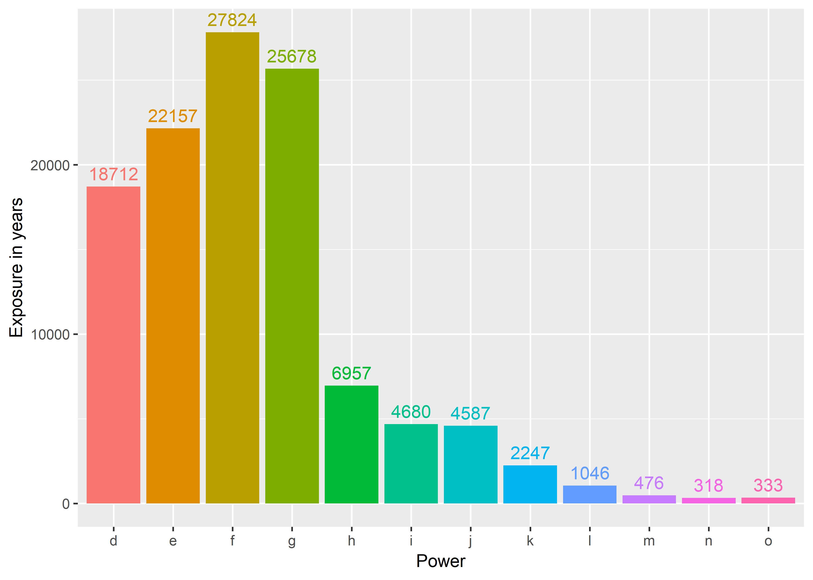

Let us now look at the observed claim frequency in each level

``` r
Power.summary = ddply(dataset, .(Power), summarize, totalExposure = sum(Exposure), 
    Number.Observations = length(Exposure), Number.Claims = sum(ClaimNb), Obs.Claim.Frequency = sum(ClaimNb)/sum(Exposure))
Power.summary
```

<!-- html table generated in R 3.4.3 by xtable 1.8-2 package -->
<!-- Tue Aug 07 08:59:05 2018 -->
<table border="1">
<tr>
<th>
Power
</th>
<th>
totalExposure
</th>
<th>
Number.Observations
</th>
<th>
Number.Claims
</th>
<th>
Obs.Claim.Frequency
</th>
</tr>
<tr>
<td>
d
</td>
<td align="right">
18711.53
</td>
<td align="right">
33720
</td>
<td align="right">
1148
</td>
<td align="right">
0.06135
</td>
</tr>
<tr>
<td>
e
</td>
<td align="right">
22157.35
</td>
<td align="right">
38329
</td>
<td align="right">
1631
</td>
<td align="right">
0.07361
</td>
</tr>
<tr>
<td>
f
</td>
<td align="right">
27823.54
</td>
<td align="right">
47709
</td>
<td align="right">
1998
</td>
<td align="right">
0.07181
</td>
</tr>
<tr>
<td>
g
</td>
<td align="right">
25678.47
</td>
<td align="right">
45390
</td>
<td align="right">
1672
</td>
<td align="right">
0.06511
</td>
</tr>
<tr>
<td>
h
</td>
<td align="right">
6956.80
</td>
<td align="right">
13346
</td>
<td align="right">
505
</td>
<td align="right">
0.07259
</td>
</tr>
<tr>
<td>
i
</td>
<td align="right">
4680.11
</td>
<td align="right">
8793
</td>
<td align="right">
369
</td>
<td align="right">
0.07884
</td>
</tr>
<tr>
<td>
j
</td>
<td align="right">
4587.50
</td>
<td align="right">
8962
</td>
<td align="right">
357
</td>
<td align="right">
0.07782
</td>
</tr>
<tr>
<td>
k
</td>
<td align="right">
2247.44
</td>
<td align="right">
4659
</td>
<td align="right">
188
</td>
<td align="right">
0.08365
</td>
</tr>
<tr>
<td>
l
</td>
<td align="right">
1046.09
</td>
<td align="right">
2255
</td>
<td align="right">
78
</td>
<td align="right">
0.07456
</td>
</tr>
<tr>
<td>
m
</td>
<td align="right">
475.74
</td>
<td align="right">
905
</td>
<td align="right">
37
</td>
<td align="right">
0.07777
</td>
</tr>
<tr>
<td>
n
</td>
<td align="right">
317.64
</td>
<td align="right">
624
</td>
<td align="right">
31
</td>
<td align="right">
0.09760
</td>
</tr>
<tr>
<td>
o
</td>
<td align="right">
333.32
</td>
<td align="right">
740
</td>
<td align="right">
26
</td>
<td align="right">
0.07800
</td>
</tr>
</table>
We can compute the ratio to the portfolio claim frequency.

``` r
portfolio.cf = sum(dataset$ClaimNb)/sum(dataset$Exposure)

ggplot(Power.summary) + geom_bar(stat = "identity", aes(x = Power, y = Obs.Claim.Frequency, 
    fill = Power)) + geom_line(aes(x = as.numeric(Power), y = portfolio.cf), 
    color = "red") + guides(fill = FALSE)
```

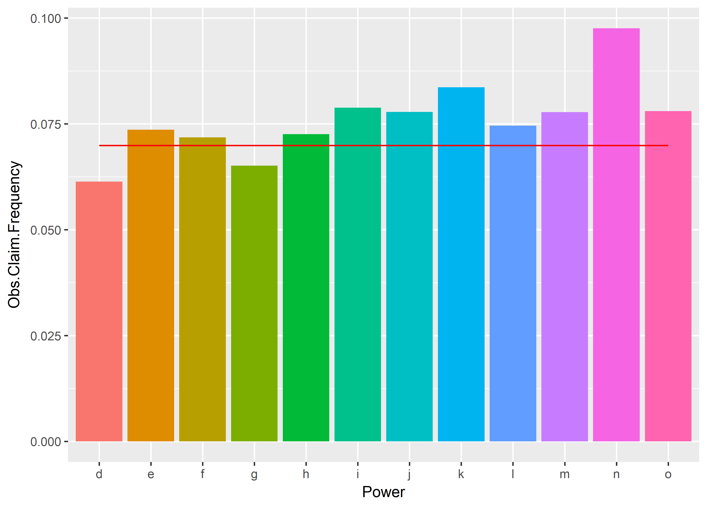

CarAge
------

The vehicle age, in years. This is the first continuous variable that we encounter (although it only takes discrete values).

``` r
ggplot(dataset, aes(x = CarAge)) + geom_bar() + xlab("Age of the Car")
```

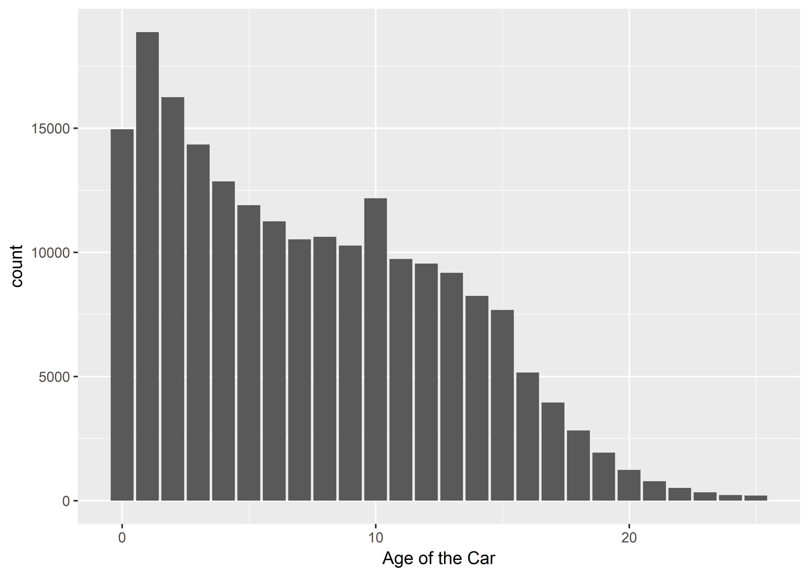 Again, here, the exposures are not considered on the histogram. We can use *ddply* to correct this.

``` r
CarAge.summary = ddply(dataset, .(CarAge), summarize, totalExposure = sum(Exposure), 
    Number.Observations = length(Exposure))
CarAge.summary
```

<!-- html table generated in R 3.4.3 by xtable 1.8-2 package -->
<!-- Tue Aug 07 08:59:08 2018 -->
<table border="1">
<tr>
<th>
CarAge
</th>
<th>
totalExposure
</th>
<th>
Number.Observations
</th>
</tr>
<tr>
<td align="right">
0
</td>
<td align="right">
4346.42
</td>
<td align="right">
14947
</td>
</tr>
<tr>
<td align="right">
1
</td>
<td align="right">
9016.91
</td>
<td align="right">
18863
</td>
</tr>
<tr>
<td align="right">
2
</td>
<td align="right">
8621.68
</td>
<td align="right">
16246
</td>
</tr>
<tr>
<td align="right">
3
</td>
<td align="right">
7902.55
</td>
<td align="right">
14337
</td>
</tr>
<tr>
<td align="right">
4
</td>
<td align="right">
7438.18
</td>
<td align="right">
12851
</td>
</tr>
<tr>
<td align="right">
5
</td>
<td align="right">
7206.40
</td>
<td align="right">
11889
</td>
</tr>
<tr>
<td align="right">
6
</td>
<td align="right">
6920.09
</td>
<td align="right">
11245
</td>
</tr>
<tr>
<td align="right">
7
</td>
<td align="right">
6538.41
</td>
<td align="right">
10516
</td>
</tr>
<tr>
<td align="right">
8
</td>
<td align="right">
6636.01
</td>
<td align="right">
10624
</td>
</tr>
<tr>
<td align="right">
9
</td>
<td align="right">
6319.48
</td>
<td align="right">
10268
</td>
</tr>
<tr>
<td align="right">
10
</td>
<td align="right">
6931.74
</td>
<td align="right">
12168
</td>
</tr>
<tr>
<td align="right">
11
</td>
<td align="right">
6051.96
</td>
<td align="right">
9727
</td>
</tr>
<tr>
<td align="right">
12
</td>
<td align="right">
5819.12
</td>
<td align="right">
9544
</td>
</tr>
<tr>
<td align="right">
13
</td>
<td align="right">
5622.09
</td>
<td align="right">
9169
</td>
</tr>
<tr>
<td align="right">
14
</td>
<td align="right">
4938.09
</td>
<td align="right">
8244
</td>
</tr>
<tr>
<td align="right">
15
</td>
<td align="right">
4349.96
</td>
<td align="right">
7674
</td>
</tr>
<tr>
<td align="right">
16
</td>
<td align="right">
3099.81
</td>
<td align="right">
5156
</td>
</tr>
<tr>
<td align="right">
17
</td>
<td align="right">
2375.68
</td>
<td align="right">
3950
</td>
</tr>
<tr>
<td align="right">
18
</td>
<td align="right">
1713.78
</td>
<td align="right">
2822
</td>
</tr>
<tr>
<td align="right">
19
</td>
<td align="right">
1175.23
</td>
<td align="right">
1931
</td>
</tr>
<tr>
<td align="right">
20
</td>
<td align="right">
732.41
</td>
<td align="right">
1231
</td>
</tr>
<tr>
<td align="right">
21
</td>
<td align="right">
470.92
</td>
<td align="right">
781
</td>
</tr>
<tr>
<td align="right">
22
</td>
<td align="right">
316.97
</td>
<td align="right">
505
</td>
</tr>
<tr>
<td align="right">
23
</td>
<td align="right">
207.92
</td>
<td align="right">
328
</td>
</tr>
<tr>
<td align="right">
24
</td>
<td align="right">
145.56
</td>
<td align="right">
219
</td>
</tr>
<tr>
<td align="right">
25
</td>
<td align="right">
118.17
</td>
<td align="right">
197
</td>
</tr>
</table>
Then, we can plot the data onto a barplot, as before.

``` r
ggplot(CarAge.summary, aes(x = CarAge, y = totalExposure)) + geom_bar(stat = "identity") + 
    ylab("Exposure in years")
```

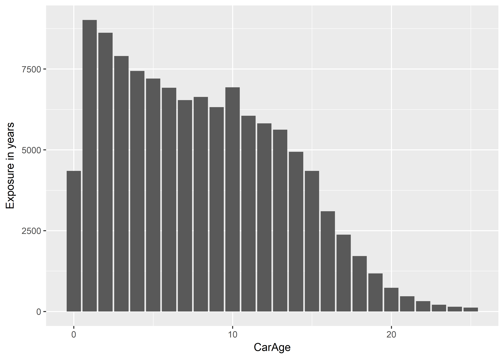

We can see a large difference, specially for new cars, which makes sense ! Indeed, let us look at the Exposure for new vehicles, using a boxplot for instance.

``` r
ggplot(dataset[dataset$CarAge == 0, ], aes(x = "Exposure", y = Exposure)) + 
    geom_boxplot() + ggtitle("Exposure of new cars")
```

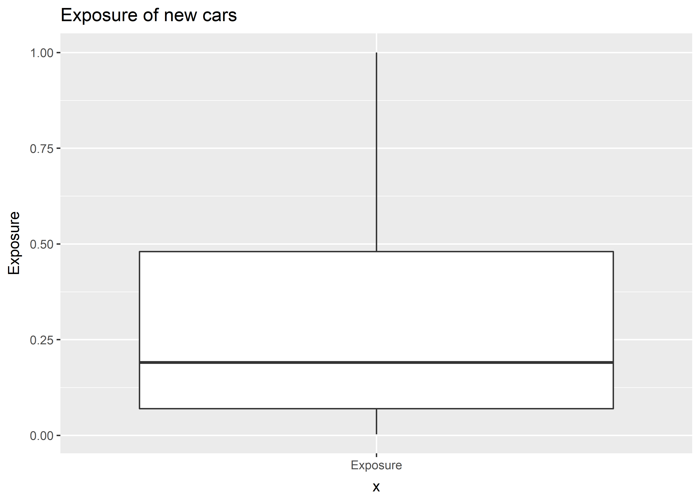

Let us now also compute the claim frequency by age of car,

``` r
CarAge.summary = ddply(dataset, .(CarAge), summarize, totalExposure = sum(Exposure), 
    Number.Observations = length(Exposure), Number.Claims = sum(ClaimNb), Obs.Claim.Freq = sum(ClaimNb)/sum(Exposure))
CarAge.summary
```

<!-- html table generated in R 3.4.3 by xtable 1.8-2 package -->
<!-- Tue Aug 07 08:59:10 2018 -->
<table border="1">
<tr>
<th>
CarAge
</th>
<th>
totalExposure
</th>
<th>
Number.Observations
</th>
<th>
Number.Claims
</th>
<th>
Obs.Claim.Freq
</th>
</tr>
<tr>
<td align="right">
0
</td>
<td align="right">
4346.42
</td>
<td align="right">
14947
</td>
<td align="right">
285
</td>
<td align="right">
0.06557
</td>
</tr>
<tr>
<td align="right">
1
</td>
<td align="right">
9016.91
</td>
<td align="right">
18863
</td>
<td align="right">
653
</td>
<td align="right">
0.07242
</td>
</tr>
<tr>
<td align="right">
2
</td>
<td align="right">
8621.68
</td>
<td align="right">
16246
</td>
<td align="right">
591
</td>
<td align="right">
0.06855
</td>
</tr>
<tr>
<td align="right">
3
</td>
<td align="right">
7902.55
</td>
<td align="right">
14337
</td>
<td align="right">
551
</td>
<td align="right">
0.06972
</td>
</tr>
<tr>
<td align="right">
4
</td>
<td align="right">
7438.18
</td>
<td align="right">
12851
</td>
<td align="right">
528
</td>
<td align="right">
0.07099
</td>
</tr>
<tr>
<td align="right">
5
</td>
<td align="right">
7206.40
</td>
<td align="right">
11889
</td>
<td align="right">
501
</td>
<td align="right">
0.06952
</td>
</tr>
<tr>
<td align="right">
6
</td>
<td align="right">
6920.09
</td>
<td align="right">
11245
</td>
<td align="right">
509
</td>
<td align="right">
0.07355
</td>
</tr>
<tr>
<td align="right">
7
</td>
<td align="right">
6538.41
</td>
<td align="right">
10516
</td>
<td align="right">
502
</td>
<td align="right">
0.07678
</td>
</tr>
<tr>
<td align="right">
8
</td>
<td align="right">
6636.01
</td>
<td align="right">
10624
</td>
<td align="right">
479
</td>
<td align="right">
0.07218
</td>
</tr>
<tr>
<td align="right">
9
</td>
<td align="right">
6319.48
</td>
<td align="right">
10268
</td>
<td align="right">
487
</td>
<td align="right">
0.07706
</td>
</tr>
<tr>
<td align="right">
10
</td>
<td align="right">
6931.74
</td>
<td align="right">
12168
</td>
<td align="right">
527
</td>
<td align="right">
0.07603
</td>
</tr>
<tr>
<td align="right">
11
</td>
<td align="right">
6051.96
</td>
<td align="right">
9727
</td>
<td align="right">
441
</td>
<td align="right">
0.07287
</td>
</tr>
<tr>
<td align="right">
12
</td>
<td align="right">
5819.12
</td>
<td align="right">
9544
</td>
<td align="right">
449
</td>
<td align="right">
0.07716
</td>
</tr>
<tr>
<td align="right">
13
</td>
<td align="right">
5622.09
</td>
<td align="right">
9169
</td>
<td align="right">
369
</td>
<td align="right">
0.06563
</td>
</tr>
<tr>
<td align="right">
14
</td>
<td align="right">
4938.09
</td>
<td align="right">
8244
</td>
<td align="right">
330
</td>
<td align="right">
0.06683
</td>
</tr>
<tr>
<td align="right">
15
</td>
<td align="right">
4349.96
</td>
<td align="right">
7674
</td>
<td align="right">
273
</td>
<td align="right">
0.06276
</td>
</tr>
<tr>
<td align="right">
16
</td>
<td align="right">
3099.81
</td>
<td align="right">
5156
</td>
<td align="right">
197
</td>
<td align="right">
0.06355
</td>
</tr>
<tr>
<td align="right">
17
</td>
<td align="right">
2375.68
</td>
<td align="right">
3950
</td>
<td align="right">
140
</td>
<td align="right">
0.05893
</td>
</tr>
<tr>
<td align="right">
18
</td>
<td align="right">
1713.78
</td>
<td align="right">
2822
</td>
<td align="right">
88
</td>
<td align="right">
0.05135
</td>
</tr>
<tr>
<td align="right">
19
</td>
<td align="right">
1175.23
</td>
<td align="right">
1931
</td>
<td align="right">
48
</td>
<td align="right">
0.04084
</td>
</tr>
<tr>
<td align="right">
20
</td>
<td align="right">
732.41
</td>
<td align="right">
1231
</td>
<td align="right">
39
</td>
<td align="right">
0.05325
</td>
</tr>
<tr>
<td align="right">
21
</td>
<td align="right">
470.92
</td>
<td align="right">
781
</td>
<td align="right">
20
</td>
<td align="right">
0.04247
</td>
</tr>
<tr>
<td align="right">
22
</td>
<td align="right">
316.97
</td>
<td align="right">
505
</td>
<td align="right">
11
</td>
<td align="right">
0.03470
</td>
</tr>
<tr>
<td align="right">
23
</td>
<td align="right">
207.92
</td>
<td align="right">
328
</td>
<td align="right">
6
</td>
<td align="right">
0.02886
</td>
</tr>
<tr>
<td align="right">
24
</td>
<td align="right">
145.56
</td>
<td align="right">
219
</td>
<td align="right">
9
</td>
<td align="right">
0.06183
</td>
</tr>
<tr>
<td align="right">
25
</td>
<td align="right">
118.17
</td>
<td align="right">
197
</td>
<td align="right">
7
</td>
<td align="right">
0.05924
</td>
</tr>
</table>
and plot it!

``` r
ggplot(CarAge.summary, aes(x = CarAge, y = Obs.Claim.Freq)) + geom_point() + 
    ylab("Observed Claim Frequency") + xlab("Age of the Car") + ylim(c(0, 0.08))
```

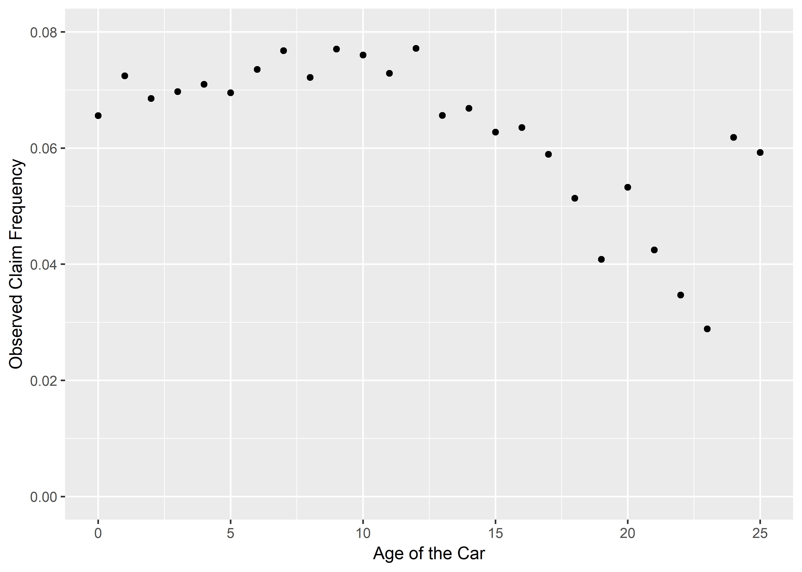

DriverAge
---------

Similarly to the Age of the Car, we can visualize the Age of the Drivers.

``` r
DriverAge.summary = ddply(dataset, .(DriverAge), summarize, totalExposure = sum(Exposure), 
    Number.Observations = length(Exposure), Number.Claims = sum(ClaimNb), Obs.Claim.Freq = sum(ClaimNb)/sum(Exposure))
head(DriverAge.summary, 9)
```

<!-- html table generated in R 3.4.3 by xtable 1.8-2 package -->
<!-- Tue Aug 07 08:59:11 2018 -->
<table border="1">
<tr>
<th>
DriverAge
</th>
<th>
totalExposure
</th>
<th>
Number.Observations
</th>
<th>
Number.Claims
</th>
<th>
Obs.Claim.Freq
</th>
</tr>
<tr>
<td align="right">
18
</td>
<td align="right">
78.37
</td>
<td align="right">
257
</td>
<td align="right">
23
</td>
<td align="right">
0.29347
</td>
</tr>
<tr>
<td align="right">
19
</td>
<td align="right">
314.15
</td>
<td align="right">
811
</td>
<td align="right">
90
</td>
<td align="right">
0.28648
</td>
</tr>
<tr>
<td align="right">
20
</td>
<td align="right">
492.48
</td>
<td align="right">
1213
</td>
<td align="right">
112
</td>
<td align="right">
0.22742
</td>
</tr>
<tr>
<td align="right">
21
</td>
<td align="right">
637.28
</td>
<td align="right">
1528
</td>
<td align="right">
105
</td>
<td align="right">
0.16476
</td>
</tr>
<tr>
<td align="right">
22
</td>
<td align="right">
794.64
</td>
<td align="right">
1822
</td>
<td align="right">
122
</td>
<td align="right">
0.15353
</td>
</tr>
<tr>
<td align="right">
23
</td>
<td align="right">
923.73
</td>
<td align="right">
2074
</td>
<td align="right">
124
</td>
<td align="right">
0.13424
</td>
</tr>
<tr>
<td align="right">
24
</td>
<td align="right">
1073.46
</td>
<td align="right">
2434
</td>
<td align="right">
111
</td>
<td align="right">
0.10340
</td>
</tr>
<tr>
<td align="right">
25
</td>
<td align="right">
1234.65
</td>
<td align="right">
2765
</td>
<td align="right">
114
</td>
<td align="right">
0.09233
</td>
</tr>
<tr>
<td align="right">
26
</td>
<td align="right">
1476.38
</td>
<td align="right">
3240
</td>
<td align="right">
157
</td>
<td align="right">
0.10634
</td>
</tr>
</table>
We can show the Exposures by Age of the Driver

``` r
ggplot(DriverAge.summary, aes(x = DriverAge, y = totalExposure)) + geom_bar(stat = "identity", 
    width = 0.8) + ylab("Exposure in years") + xlab("Age of the Driver")
```

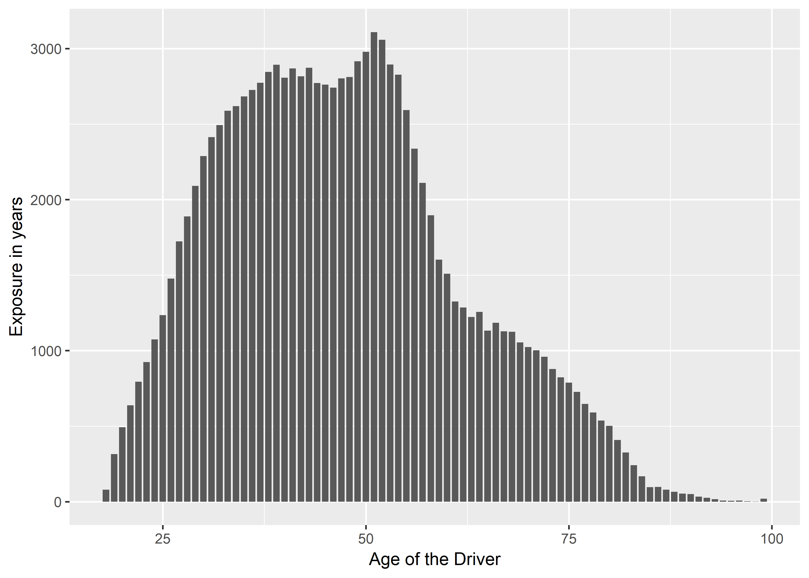

and the observed claim frequency by Age.

``` r
ggplot(DriverAge.summary, aes(x = DriverAge, y = Obs.Claim.Freq)) + geom_point() + 
    ylab("Observed Claim Frequency") + xlab("Age of the Driver")
```


Brand
-----

The variable *Brand* is a categorized variable, related to the brand of the car. We can see the different *levels* of a *factor* by using the function **level** in R:

``` r
levels(dataset$Brand)
```

    ## [1] "Fiat"                              
    ## [2] "Japanese (except Nissan) or Korean"
    ## [3] "Mercedes, Chrysler or BMW"         
    ## [4] "Opel, General Motors or Ford"      
    ## [5] "other"                             
    ## [6] "Renault, Nissan or Citroen"        
    ## [7] "Volkswagen, Audi, Skoda or Seat"

``` r
Brand.summary = ddply(dataset, .(Brand), summarize, totalExposure = sum(Exposure), 
    Number.Observations = length(Exposure), Number.Claims = sum(ClaimNb), Obs.Claim.Freq = sum(ClaimNb)/sum(Exposure))
Brand.summary
```

<!-- html table generated in R 3.4.3 by xtable 1.8-2 package -->
<!-- Tue Aug 07 08:59:14 2018 -->
<table border="1">
<tr>
<th>
Brand
</th>
<th>
totalExposure
</th>
<th>
Number.Observations
</th>
<th>
Number.Claims
</th>
<th>
Obs.Claim.Freq
</th>
</tr>
<tr>
<td>
Fiat
</td>
<td align="right">
4728.26
</td>
<td align="right">
8341
</td>
<td align="right">
357
</td>
<td align="right">
0.07550
</td>
</tr>
<tr>
<td>
Japanese (except Nissan) or Korean
</td>
<td align="right">
15499.62
</td>
<td align="right">
39413
</td>
<td align="right">
993
</td>
<td align="right">
0.06407
</td>
</tr>
<tr>
<td>
Mercedes, Chrysler or BMW
</td>
<td align="right">
5254.51
</td>
<td align="right">
9651
</td>
<td align="right">
416
</td>
<td align="right">
0.07917
</td>
</tr>
<tr>
<td>
Opel, General Motors or Ford
</td>
<td align="right">
10812.52
</td>
<td align="right">
18638
</td>
<td align="right">
847
</td>
<td align="right">
0.07834
</td>
</tr>
<tr>
<td>
other
</td>
<td align="right">
2905.09
</td>
<td align="right">
4947
</td>
<td align="right">
232
</td>
<td align="right">
0.07986
</td>
</tr>
<tr>
<td>
Renault, Nissan or Citroen
</td>
<td align="right">
66756.93
</td>
<td align="right">
108267
</td>
<td align="right">
4446
</td>
<td align="right">
0.06660
</td>
</tr>
<tr>
<td>
Volkswagen, Audi, Skoda or Seat
</td>
<td align="right">
9058.60
</td>
<td align="right">
16175
</td>
<td align="right">
749
</td>
<td align="right">
0.08268
</td>
</tr>
</table>
``` r
require(ggplot2)
ggplot(Brand.summary, aes(x = reorder(Brand, totalExposure), y = totalExposure, 
    fill = Brand)) + geom_bar(stat = "identity") + coord_flip() + guides(fill = FALSE) + 
    xlab("") + ylab("Exposure in years")
```

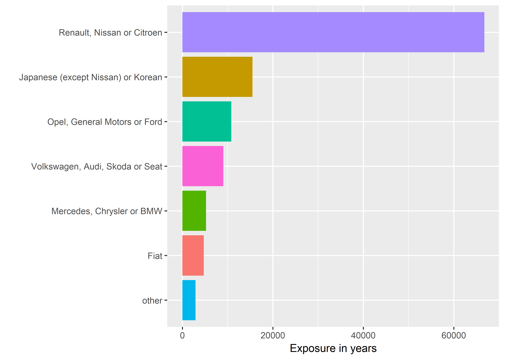

Let us now look at the claim frequency by Brand of the car.

``` r
ggplot(Brand.summary, aes(x = reorder(Brand, Obs.Claim.Freq), y = Obs.Claim.Freq, 
    fill = Brand)) + geom_bar(stat = "identity") + coord_flip() + guides(fill = FALSE) + 
    ggtitle("Observed Claim Frequencies by Brand of the car") + xlab("") + ylab("Observed Claim Frequency")
```

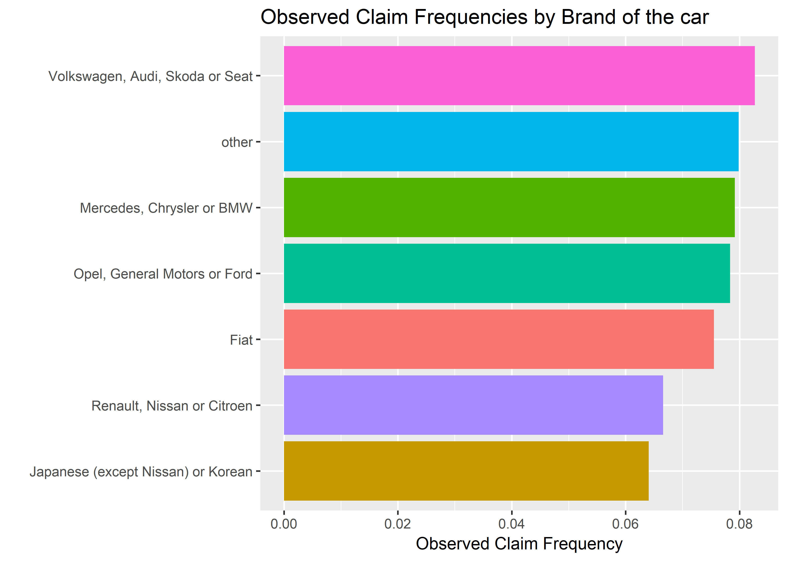

Gas
---

The variable *Gas* is a categorized variable, related to the fuel of the car. We can see the different *levels* of a *factor* by using the function **level** in R:

``` r
levels(dataset$Gas)
```

    ## [1] "Diesel"  "Regular"

``` r
Gas.summary = ddply(dataset, .(Gas), summarize, totalExposure = sum(Exposure), 
    Number.Observations = length(Exposure), Number.Claims = sum(ClaimNb), Obs.Claim.Freq = sum(ClaimNb)/sum(Exposure))
ggplot(Gas.summary, aes(x = Gas, y = totalExposure, fill = Gas)) + geom_bar(stat = "identity") + 
    guides(fill = FALSE)
```

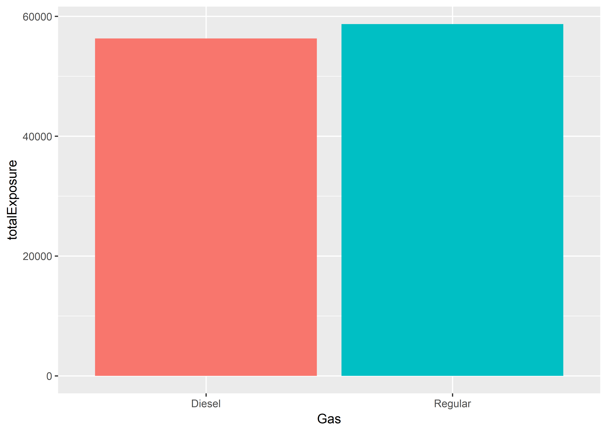

There seems to be a similar amount of Diesel and Regular gas vehicles in the portfolio. It is generally expected that Diesel have a higher claim frequency. Does this also hold on our dataset ?

``` r
ggplot(Gas.summary, aes(x = Gas, y = Obs.Claim.Freq, fill = Gas)) + geom_bar(stat = "identity") + 
    guides(fill = FALSE)
```

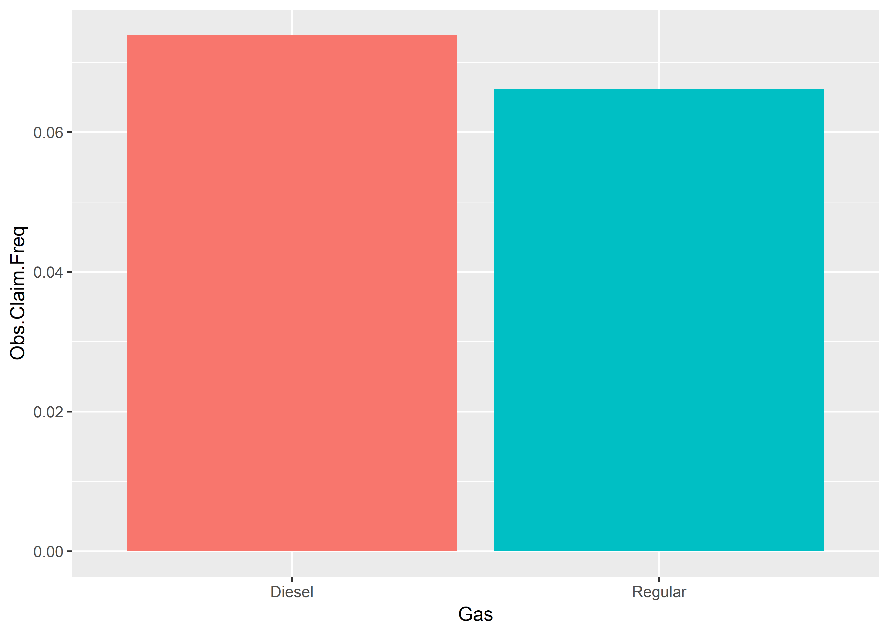

Region
------

The variable *Region* is a categorized variable, related to the region of the place of residence. We can see the different *levels* of a *factor* by using the function **level** in R:

``` r
levels(dataset$Region)
```

    ##  [1] "R11" "R23" "R24" "R25" "R31" "R52" "R53" "R54" "R72" "R74"

What are the Exposures in each region ? What are the observed claim frequencies ?

``` r
Region.summary = ddply(dataset, .(Region), summarize, totalExposure = sum(Exposure), 
    Number.Observations = length(Exposure), Number.Claims = sum(ClaimNb), Obs.Claim.Freq = sum(ClaimNb)/sum(Exposure))
Region.summary
```

<!-- html table generated in R 3.4.3 by xtable 1.8-2 package -->
<!-- Tue Aug 07 08:59:18 2018 -->
<table border="1">
<tr>
<th>
Region
</th>
<th>
totalExposure
</th>
<th>
Number.Observations
</th>
<th>
Number.Claims
</th>
<th>
Obs.Claim.Freq
</th>
</tr>
<tr>
<td>
R11
</td>
<td align="right">
15024.48
</td>
<td align="right">
34778
</td>
<td align="right">
1266
</td>
<td align="right">
0.08426
</td>
</tr>
<tr>
<td>
R23
</td>
<td align="right">
1531.38
</td>
<td align="right">
4275
</td>
<td align="right">
94
</td>
<td align="right">
0.06138
</td>
</tr>
<tr>
<td>
R24
</td>
<td align="right">
50927.07
</td>
<td align="right">
79767
</td>
<td align="right">
3289
</td>
<td align="right">
0.06458
</td>
</tr>
<tr>
<td>
R25
</td>
<td align="right">
3274.99
</td>
<td align="right">
5398
</td>
<td align="right">
227
</td>
<td align="right">
0.06931
</td>
</tr>
<tr>
<td>
R31
</td>
<td align="right">
5676.75
</td>
<td align="right">
13576
</td>
<td align="right">
483
</td>
<td align="right">
0.08508
</td>
</tr>
<tr>
<td>
R52
</td>
<td align="right">
10871.82
</td>
<td align="right">
19321
</td>
<td align="right">
760
</td>
<td align="right">
0.06991
</td>
</tr>
<tr>
<td>
R53
</td>
<td align="right">
13889.48
</td>
<td align="right">
21032
</td>
<td align="right">
928
</td>
<td align="right">
0.06681
</td>
</tr>
<tr>
<td>
R54
</td>
<td align="right">
5573.92
</td>
<td align="right">
9455
</td>
<td align="right">
386
</td>
<td align="right">
0.06925
</td>
</tr>
<tr>
<td>
R72
</td>
<td align="right">
7033.85
</td>
<td align="right">
15506
</td>
<td align="right">
516
</td>
<td align="right">
0.07336
</td>
</tr>
<tr>
<td>
R74
</td>
<td align="right">
1211.77
</td>
<td align="right">
2324
</td>
<td align="right">
91
</td>
<td align="right">
0.07510
</td>
</tr>
</table>
Using the function *twoord.plot* we can easily show both the Exposures and the observed claim frequencies on the same plot.

``` r
twoord.plot(1:10, Region.summary$totalExposure, 1:10, Region.summary$Obs.Claim.Freq, 
    xlab = "Region", rylim = c(0, 0.1), type = c("bar", "p"), xticklab = Region.summary$Region, 
    ylab = "Exposure", rylab = "Observed Claim Frequency")
```

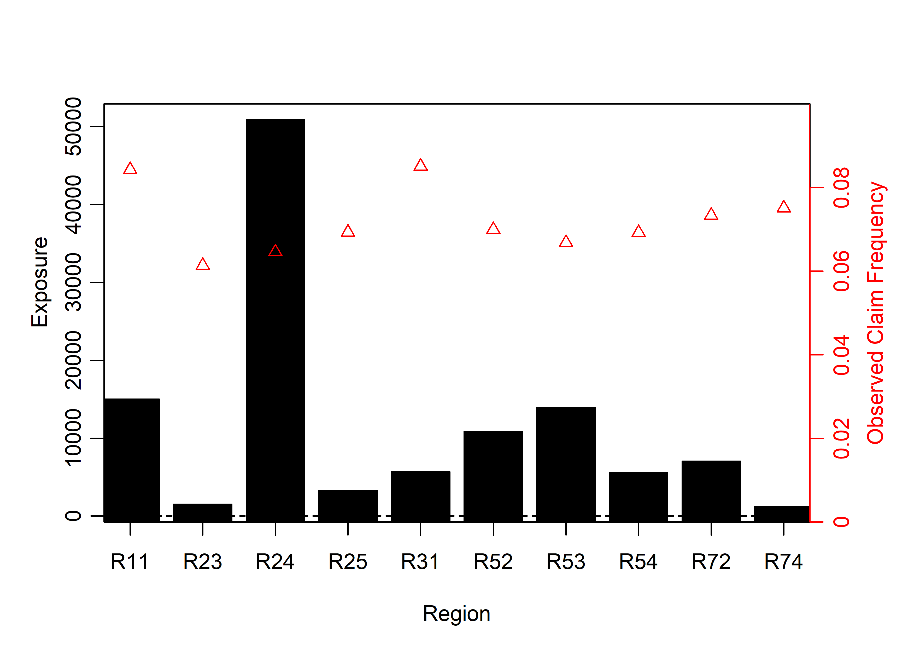

We can plot a map with the observed claim frequencies

``` r
library(maptools)
library(ggplot2)
area <- readShapePoly("shapefiles/FRA_adm2.shp")  # From http://www.diva-gis.org/gData

Region.summary$id = sapply(Region.summary$Region, substr, 2, 3)
area.points = fortify(area, region = "ID_2")

area.points = merge(area.points, Region.summary[, c("id", "totalExposure", "Obs.Claim.Freq")], 
    by.x = "id", by.y = "id", all.x = TRUE)
area.points = area.points[order(area.points$order), ]


ggplot(area.points, aes(long, lat, group = group)) + ggtitle("Observed Claim Frequencies") + 
    geom_polygon(aes(fill = area.points$Obs.Claim.Freq)) + scale_fill_gradient(low = "yellow", 
    high = "red", name = "Obs. Claim Freq.", limits = c(0.061, 0.085)) + xlab("Longitude") + 
    ylab("Latitude")
```

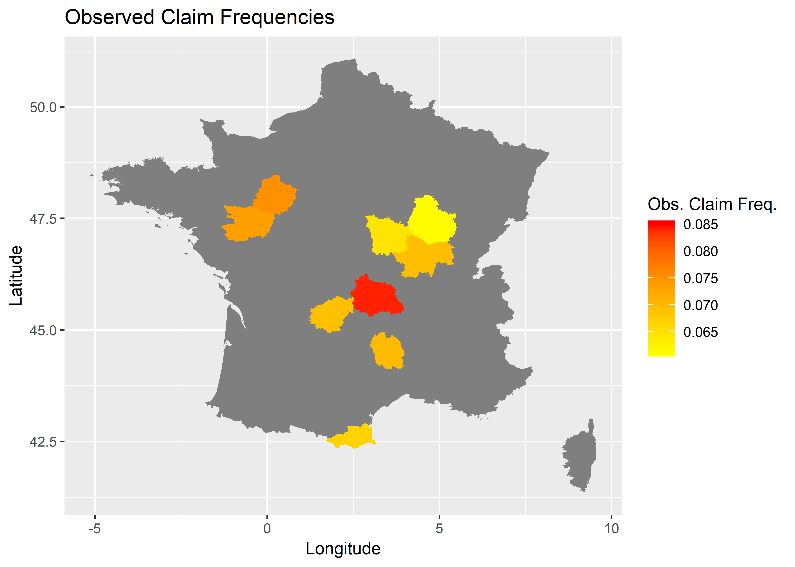

and the exposures (on a log-scale)...

``` r
ggplot(area.points, aes(long, lat, group = group)) + ggtitle("log Exposures in years") + 
    geom_polygon(aes(fill = log(area.points$totalExposure))) + scale_fill_gradient(low = "blue", 
    high = "red", name = "log Exposure") + xlab("Longitude") + ylab("Latitude")
```

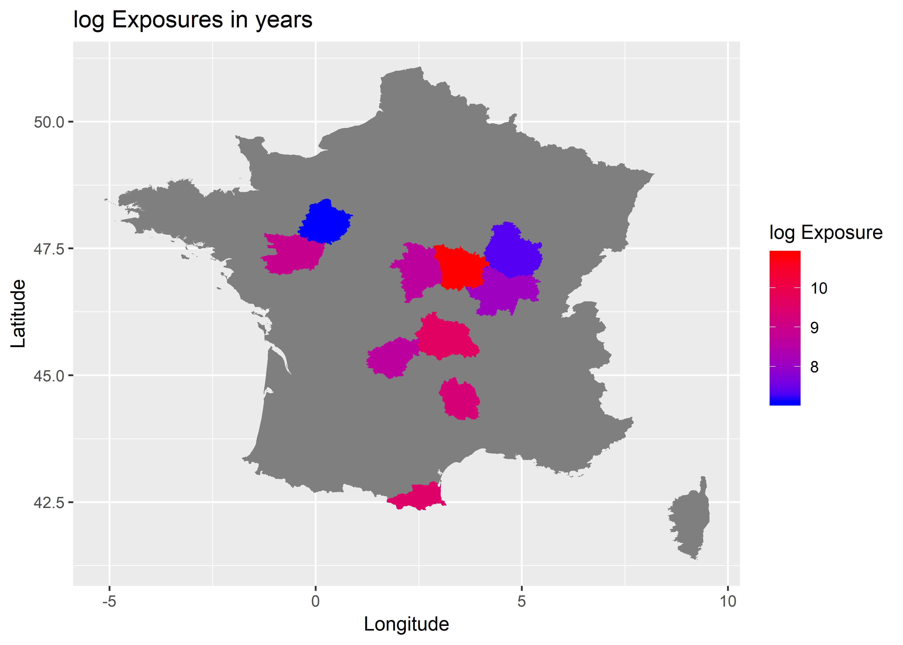

Density
-------

The Density represents here the density of the population at the place of residence. Let us take a look at the densities in the dataset.

``` r
summary(dataset$Density)
```

    ##    Min. 1st Qu.  Median    Mean 3rd Qu.    Max. 
    ##       2      67     287    1982    1408   27000

``` r
ggplot(dataset, aes(Density)) + geom_histogram(bins = 200)
```

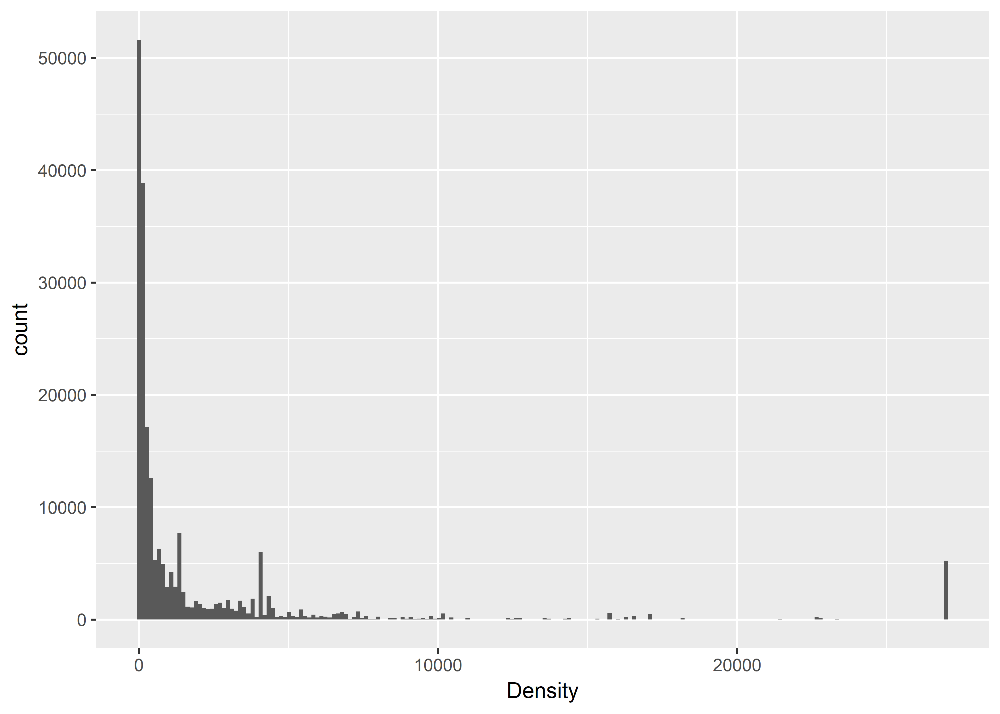

Here, contrary to the age of the driver, or the age of the car, the density has lots of different values

``` r
length(unique(dataset$Density))
```

We can compute this by using the command above, and we get 1267.

``` r
Density.summary = ddply(dataset, .(Density), summarize, totalExposure = sum(Exposure), 
    Number.Observations = length(Exposure), Number.Claims = sum(ClaimNb), Obs.Claim.Freq = sum(ClaimNb)/sum(Exposure))
head(Density.summary)
```

<!-- html table generated in R 3.4.3 by xtable 1.8-2 package -->
<!-- Tue Aug 07 08:59:32 2018 -->
<table border="1">
<tr>
<th>
Density
</th>
<th>
totalExposure
</th>
<th>
Number.Observations
</th>
<th>
Number.Claims
</th>
<th>
Obs.Claim.Freq
</th>
</tr>
<tr>
<td align="right">
2
</td>
<td align="right">
9.07
</td>
<td align="right">
13
</td>
<td align="right">
1
</td>
<td align="right">
0.11025
</td>
</tr>
<tr>
<td align="right">
3
</td>
<td align="right">
58.94
</td>
<td align="right">
81
</td>
<td align="right">
2
</td>
<td align="right">
0.03393
</td>
</tr>
<tr>
<td align="right">
4
</td>
<td align="right">
18.22
</td>
<td align="right">
29
</td>
<td align="right">
1
</td>
<td align="right">
0.05490
</td>
</tr>
<tr>
<td align="right">
5
</td>
<td align="right">
67.99
</td>
<td align="right">
122
</td>
<td align="right">
7
</td>
<td align="right">
0.10295
</td>
</tr>
<tr>
<td align="right">
6
</td>
<td align="right">
131.76
</td>
<td align="right">
207
</td>
<td align="right">
8
</td>
<td align="right">
0.06072
</td>
</tr>
<tr>
<td align="right">
7
</td>
<td align="right">
182.77
</td>
<td align="right">
288
</td>
<td align="right">
7
</td>
<td align="right">
0.03830
</td>
</tr>
</table>
We can plot the observed claim frequencies...

``` r
ggplot(Density.summary, aes(x = Density, y = Obs.Claim.Freq)) + geom_point()
```

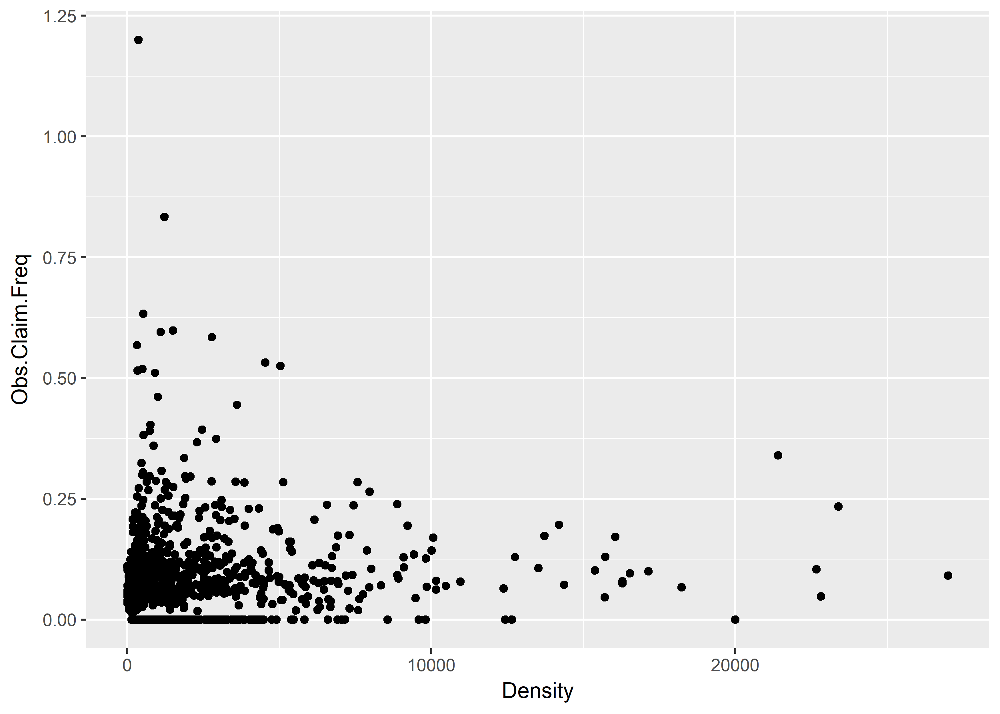

... but realize it is impossible to see a trend. One way out is to categorize the variable. We will see later (GAM) that it is possible to estimate a smooth function, which avoid the arbitrary categorization.

We can categorize the variable using the function *cut*.

``` r
dataset$DensityCAT = cut(dataset$Density, breaks = quantile(dataset$Density, 
    probs = seq(from = 0, to = 1, by = 0.1)), include.lowest = TRUE)
table(dataset$DensityCAT)
```

    ## 
    ##             [2,28]            (28,51]            (51,91] 
    ##              20813              20571              20805 
    ##           (91,158]          (158,287]          (287,554] 
    ##              19986              20584              20508 
    ##     (554,1.16e+03] (1.16e+03,2.4e+03] (2.4e+03,4.35e+03] 
    ##              20571              20541              21290 
    ## (4.35e+03,2.7e+04] 
    ##              19763

``` r
levels(dataset$DensityCAT) <- LETTERS[1:10]
```

Then, we can apply the same strategy as above.

``` r
Density.summary = ddply(dataset, .(DensityCAT), summarize, totalExposure = sum(Exposure), 
    Number.Observations = length(Exposure), Number.Claims = sum(ClaimNb), Obs.Claim.Freq = sum(ClaimNb)/sum(Exposure))
Density.summary
```

<!-- html table generated in R 3.4.3 by xtable 1.8-2 package -->
<!-- Tue Aug 07 08:59:34 2018 -->
<table border="1">
<tr>
<th>
DensityCAT
</th>
<th>
totalExposure
</th>
<th>
Number.Observations
</th>
<th>
Number.Claims
</th>
<th>
Obs.Claim.Freq
</th>
</tr>
<tr>
<td>
A
</td>
<td align="right">
13499.50
</td>
<td align="right">
20813
</td>
<td align="right">
678
</td>
<td align="right">
0.05022
</td>
</tr>
<tr>
<td>
B
</td>
<td align="right">
12959.15
</td>
<td align="right">
20571
</td>
<td align="right">
738
</td>
<td align="right">
0.05695
</td>
</tr>
<tr>
<td>
C
</td>
<td align="right">
12695.77
</td>
<td align="right">
20805
</td>
<td align="right">
769
</td>
<td align="right">
0.06057
</td>
</tr>
<tr>
<td>
D
</td>
<td align="right">
12001.69
</td>
<td align="right">
19986
</td>
<td align="right">
754
</td>
<td align="right">
0.06282
</td>
</tr>
<tr>
<td>
E
</td>
<td align="right">
12166.47
</td>
<td align="right">
20584
</td>
<td align="right">
798
</td>
<td align="right">
0.06559
</td>
</tr>
<tr>
<td>
F
</td>
<td align="right">
11918.67
</td>
<td align="right">
20508
</td>
<td align="right">
845
</td>
<td align="right">
0.07090
</td>
</tr>
<tr>
<td>
G
</td>
<td align="right">
11065.29
</td>
<td align="right">
20571
</td>
<td align="right">
904
</td>
<td align="right">
0.08170
</td>
</tr>
<tr>
<td>
H
</td>
<td align="right">
10670.17
</td>
<td align="right">
20541
</td>
<td align="right">
897
</td>
<td align="right">
0.08407
</td>
</tr>
<tr>
<td>
I
</td>
<td align="right">
9707.02
</td>
<td align="right">
21290
</td>
<td align="right">
922
</td>
<td align="right">
0.09498
</td>
</tr>
<tr>
<td>
J
</td>
<td align="right">
8331.80
</td>
<td align="right">
19763
</td>
<td align="right">
735
</td>
<td align="right">
0.08822
</td>
</tr>
</table>
Using the function *twoord.plot* we can easily show both the Exposures and the observed claim frequencies on the same plot.

``` r
twoord.plot(1:10, Density.summary$totalExposure, 1:10, Density.summary$Obs.Claim.Freq, 
    xlab = "Density (categorized)", lylim = c(0, 15000), rylim = c(0, 0.15), 
    type = c("bar", "p"), xticklab = Density.summary$Density, ylab = "Exposure", 
    rylab = "Observed Claim Frequency", lytickpos = seq(0, 15000, 5000), rytickpos = seq(0, 
        0.15, 0.03))
```


