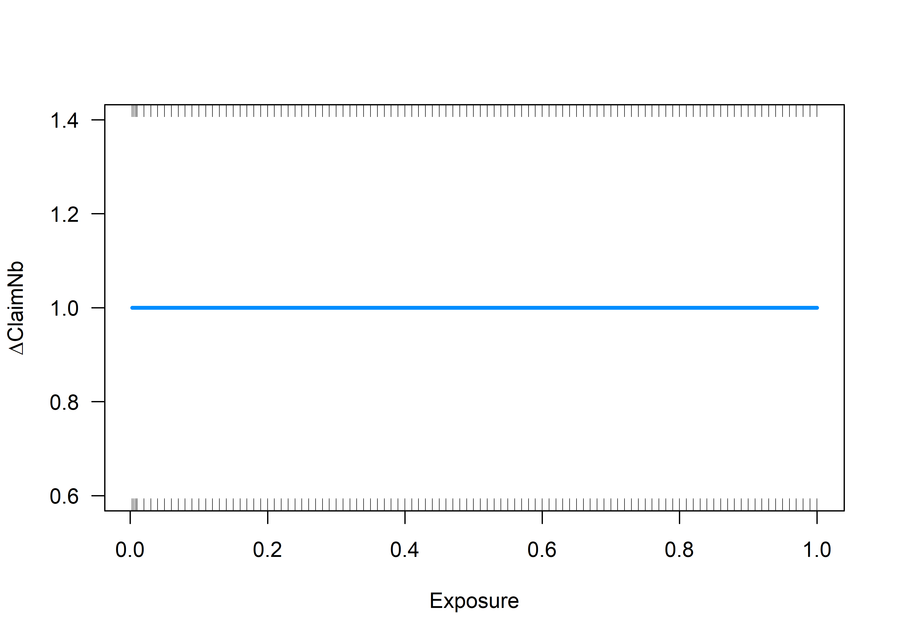
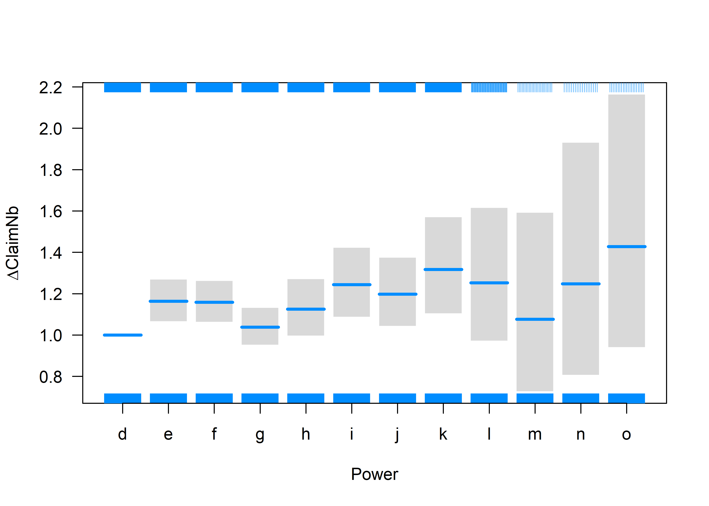
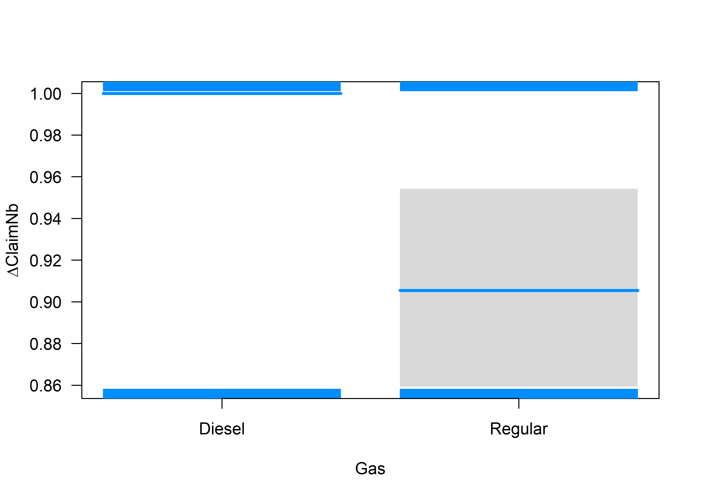
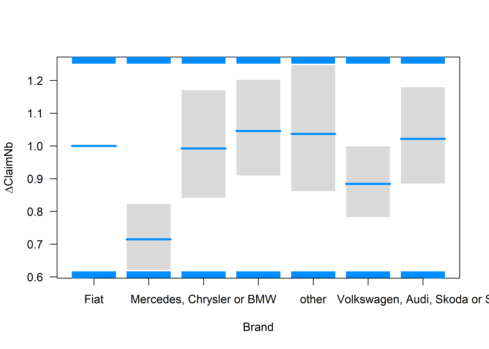
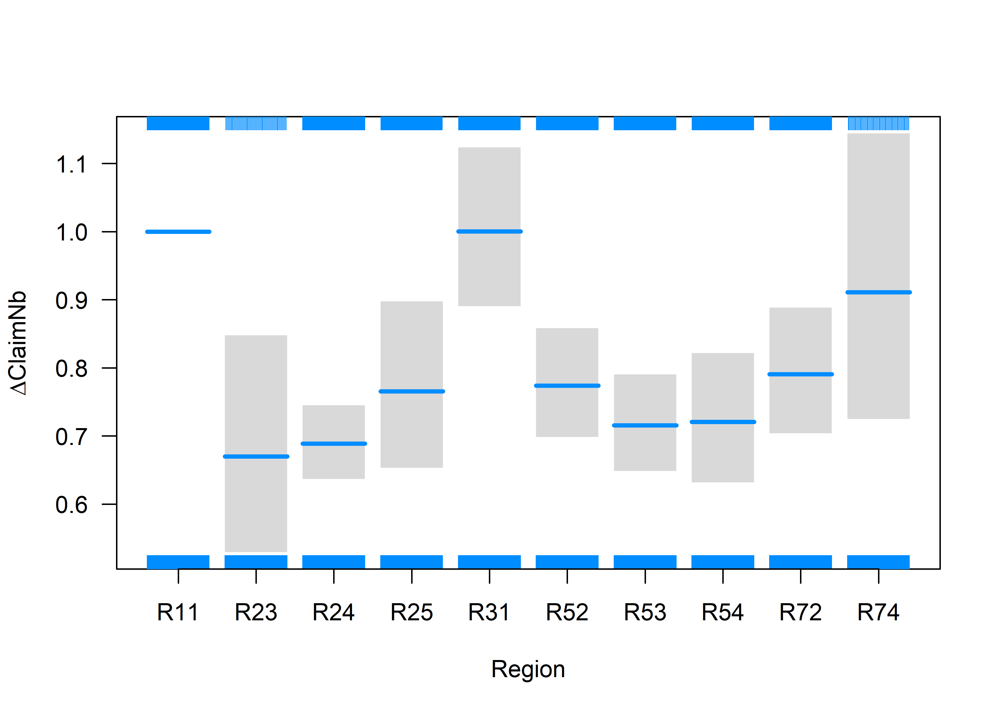
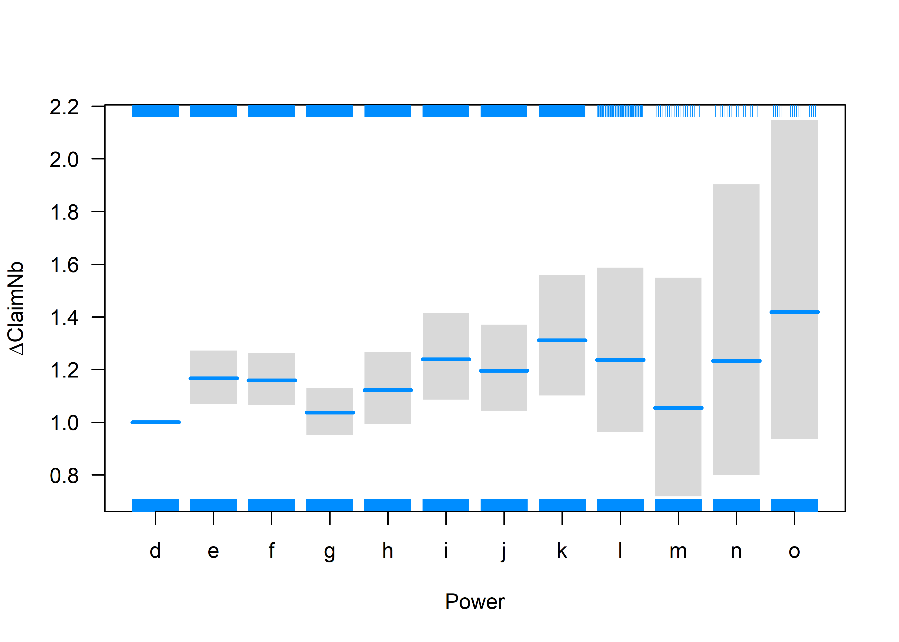
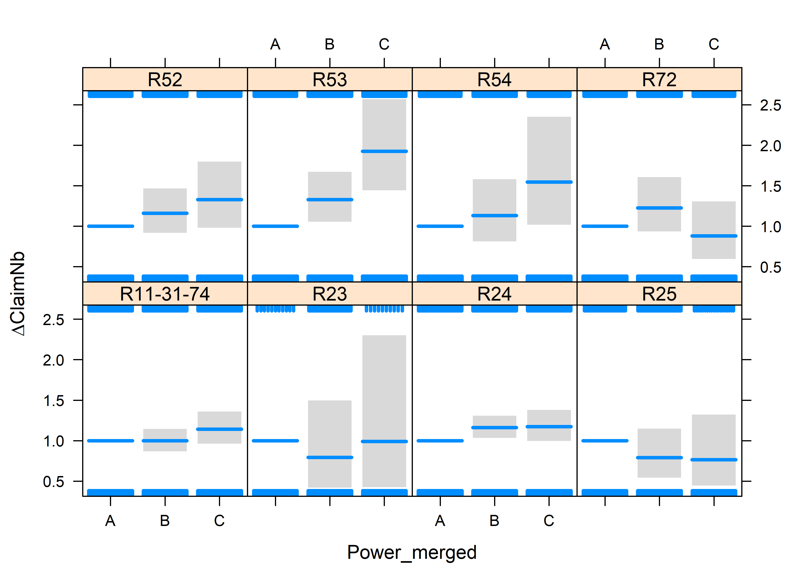
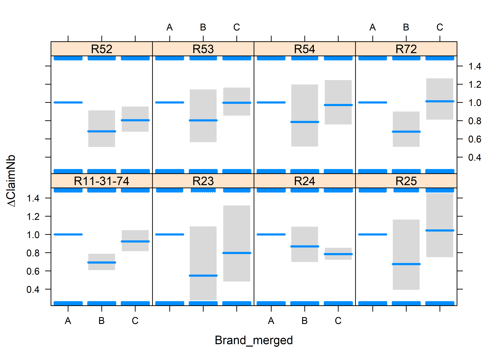
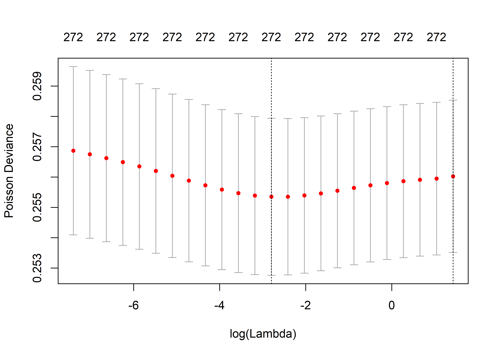

GLM, GLMM and LASSO
================

-   [GLM](#glm)
    -   [Intercept](#intercept)
    -   [All the variables](#all-the-variables)
    -   [Variable : Brand](#variable-brand)
    -   [Variable : Power](#variable-power)
    -   [Variable : Region](#variable-region)
    -   [Interactions ?](#interactions)
    -   [Predictive Power of the models](#predictive-power-of-the-models)
-   [GLMM](#glmm)
    -   [Negative Binomial](#negative-binomial)
    -   [Poisson-LogNormal](#poisson-lognormal)
-   [Elastic Net](#elastic-net)
    -   [LASSO](#lasso)
    -   [Ridge](#ridge)
    -   [Elastic Net](#elastic-net-1)
    -   [Comparison with GLM](#comparison-with-glm)

``` r
options(encoding = 'UTF-8')
#Loading all the necessary packages
if (!require("caret")) install.packages("caret")
if (!require("visreg")) install.packages("visreg")
if (!require("MASS")) install.packages("MASS")
if (!require("lme4")) install.packages("lme4")
if (!require("glmnet")) install.packages("glmnet")


require("caret")
require("visreg")
require("MASS")
require("lme4")
require("glmnet")
```

``` r
## Loading the dataset
# require("CASdatasets")
# data("freMTPLfreq")
# 
# freMTPLfreq = subset(freMTPLfreq, Exposure<=1 & Exposure >= 0 & CarAge<=25)
# 
# set.seed(85)
# folds = createDataPartition(freMTPLfreq$ClaimNb, 0.5)
# dataset = freMTPLfreq[folds[[1]], ]

load("dataset.RData")
```

GLM
===

We are going to model the claim frequencies using a GLM. We will only consider the categorical variables in this part, as we will see later that other tools are available to treat the continuous variables without having to discretize them.

Let us first split out dataset in two parts: a training set and a testing set.

``` r
set.seed(21)
in_training = createDataPartition(dataset$ClaimNb, times = 1, p = 0.8, list=FALSE)
training_set = dataset[in_training,]
testing_set  = dataset[-in_training,]
```

Intercept
---------

The main function is called *glm*. Let us run the function on our dataset.

``` r
m0 = glm(ClaimNb ~ offset(log(Exposure)), 
         data = training_set,
         family=poisson())
summary(m0)
```

    ## 
    ## Call:
    ## glm(formula = ClaimNb ~ offset(log(Exposure)), family = poisson(), 
    ##     data = training_set)
    ## 
    ## Deviance Residuals: 
    ##     Min       1Q   Median       3Q      Max  
    ## -0.3740  -0.3740  -0.2645  -0.1496   6.5426  
    ## 
    ## Coefficients:
    ##             Estimate Std. Error z value Pr(>|z|)    
    ## (Intercept) -2.66013    0.01246  -213.5   <2e-16 ***
    ## ---
    ## Signif. codes:  0 '***' 0.001 '**' 0.01 '*' 0.05 '.' 0.1 ' ' 1
    ## 
    ## (Dispersion parameter for poisson family taken to be 1)
    ## 
    ##     Null deviance: 42075  on 164345  degrees of freedom
    ## Residual deviance: 42075  on 164345  degrees of freedom
    ## AIC: 54521
    ## 
    ## Number of Fisher Scoring iterations: 6

By default, the link function is the log (see help file *?poisson*).

We can find the average claim frequency of the portfolio. The average claim frequency is then given by *e**x**p*(*β*<sub>0</sub>) = *e**x**p*(−2.6601) = 0.0699.

``` r
exp(m0$coefficients)
```

All the variables
-----------------

In this whole session, we will only consider the discrete variables, namely *Power*, *Brand*, *Gas* and *Region*.

Let us include all these variables (without interactions) in the model.

``` r
m1 = glm(ClaimNb ~ offset(log(Exposure)) + Power  + Gas + Brand + Region,
         data = training_set,
         family=poisson(link = log))
summary(m1)
```

    ## 
    ## Call:
    ## glm(formula = ClaimNb ~ offset(log(Exposure)) + Power + Gas + 
    ##     Brand + Region, family = poisson(link = log), data = training_set)
    ## 
    ## Deviance Residuals: 
    ##     Min       1Q   Median       3Q      Max  
    ## -0.5204  -0.3495  -0.2644  -0.1469   6.6165  
    ## 
    ## Coefficients:
    ##                                           Estimate Std. Error z value
    ## (Intercept)                             -2.3471610  0.0764378 -30.707
    ## Powere                                   0.1508835  0.0443083   3.405
    ## Powerf                                   0.1467467  0.0435334   3.371
    ## Powerg                                   0.0375266  0.0438940   0.855
    ## Powerh                                   0.1179388  0.0617924   1.909
    ## Poweri                                   0.2179971  0.0682589   3.194
    ## Powerj                                   0.1804327  0.0701119   2.573
    ## Powerk                                   0.2750396  0.0896405   3.068
    ## Powerl                                   0.2253367  0.1294902   1.740
    ## Powerm                                   0.0733243  0.1995410   0.367
    ## Powern                                   0.2213301  0.2224475   0.995
    ## Powero                                   0.3557142  0.2122389   1.676
    ## GasRegular                              -0.0992720  0.0267054  -3.717
    ## BrandJapanese (except Nissan) or Korean -0.3356622  0.0713745  -4.703
    ## BrandMercedes, Chrysler or BMW          -0.0078477  0.0844304  -0.093
    ## BrandOpel, General Motors or Ford        0.0445679  0.0710981   0.627
    ## Brandother                               0.0360144  0.0941192   0.383
    ## BrandRenault, Nissan or Citroen         -0.1231281  0.0622897  -1.977
    ## BrandVolkswagen, Audi, Skoda or Seat     0.0214018  0.0731078   0.293
    ## RegionR23                               -0.4006216  0.1200341  -3.338
    ## RegionR24                               -0.3729908  0.0400816  -9.306
    ## RegionR25                               -0.2670039  0.0810248  -3.295
    ## RegionR31                                0.0003132  0.0593067   0.005
    ## RegionR52                               -0.2561023  0.0525417  -4.874
    ## RegionR53                               -0.3343147  0.0503412  -6.641
    ## RegionR54                               -0.3278368  0.0671222  -4.884
    ## RegionR72                               -0.2348811  0.0594539  -3.951
    ## RegionR74                               -0.0933579  0.1164587  -0.802
    ##                                         Pr(>|z|)    
    ## (Intercept)                              < 2e-16 ***
    ## Powere                                  0.000661 ***
    ## Powerf                                  0.000749 ***
    ## Powerg                                  0.392587    
    ## Powerh                                  0.056310 .  
    ## Poweri                                  0.001405 ** 
    ## Powerj                                  0.010068 *  
    ## Powerk                                  0.002153 ** 
    ## Powerl                                  0.081827 .  
    ## Powerm                                  0.713272    
    ## Powern                                  0.319747    
    ## Powero                                  0.093737 .  
    ## GasRegular                              0.000201 ***
    ## BrandJapanese (except Nissan) or Korean 2.57e-06 ***
    ## BrandMercedes, Chrysler or BMW          0.925944    
    ## BrandOpel, General Motors or Ford       0.530757    
    ## Brandother                              0.701982    
    ## BrandRenault, Nissan or Citroen         0.048076 *  
    ## BrandVolkswagen, Audi, Skoda or Seat    0.769718    
    ## RegionR23                               0.000845 ***
    ## RegionR24                                < 2e-16 ***
    ## RegionR25                               0.000983 ***
    ## RegionR31                               0.995787    
    ## RegionR52                               1.09e-06 ***
    ## RegionR53                               3.12e-11 ***
    ## RegionR54                               1.04e-06 ***
    ## RegionR72                               7.79e-05 ***
    ## RegionR74                               0.422761    
    ## ---
    ## Signif. codes:  0 '***' 0.001 '**' 0.01 '*' 0.05 '.' 0.1 ' ' 1
    ## 
    ## (Dispersion parameter for poisson family taken to be 1)
    ## 
    ##     Null deviance: 42075  on 164345  degrees of freedom
    ## Residual deviance: 41855  on 164318  degrees of freedom
    ## AIC: 54355
    ## 
    ## Number of Fisher Scoring iterations: 6

Using the function *visreg* from the package of the same name, we can easily see plots related to the effect of the variables.

``` r
visreg(m1, type="contrast", scale="response")
```



We see some levels of some variables appear to be not significantly different from 0. Moreover, it could be that some levels appear to be significantly different from 0, but are not significantly different from each other and could be merged.

If we wish to perform a likelihood ratio test between the full model (*m*<sub>1</sub>) and the model without any explanatory variables (*m*<sub>0</sub>)

``` r
anova(m0, m1, test="Chisq")
```

    ## Analysis of Deviance Table
    ## 
    ## Model 1: ClaimNb ~ offset(log(Exposure))
    ## Model 2: ClaimNb ~ offset(log(Exposure)) + Power + Gas + Brand + Region
    ##   Resid. Df Resid. Dev Df Deviance  Pr(>Chi)    
    ## 1    164345      42075                          
    ## 2    164318      41855 27   219.96 < 2.2e-16 ***
    ## ---
    ## Signif. codes:  0 '***' 0.001 '**' 0.01 '*' 0.05 '.' 0.1 ' ' 1

We can try to merge some of the levels that appear to be not significantly different.

Variable : Brand
----------------

Let's start with the variable Brand.

``` r
training_set$Brand_merged = training_set$Brand
testing_set$Brand_merged = testing_set$Brand

levels(training_set$Brand_merged) <- list("A" = c("Fiat","Mercedes, Chrysler or BMW",
                                                  "Opel, General Motors or Ford",
                                                  "other",
                                                  "Volkswagen, Audi, Skoda or Seat"),
                                          "B" = "Japanese (except Nissan) or Korean",
                                          "C" = "Renault, Nissan or Citroen")

levels(testing_set$Brand_merged) <- list("A" = c("Fiat","Mercedes, Chrysler or BMW",
                                                  "Opel, General Motors or Ford",
                                                  "other",
                                                  "Volkswagen, Audi, Skoda or Seat"),
                                          "B" = "Japanese (except Nissan) or Korean",
                                          "C" = "Renault, Nissan or Citroen")

table(training_set$Brand_merged, useNA = "always")
```

    ## 
    ##     A     B     C  <NA> 
    ## 46232 31528 86586     0

Let us now estimate the new model with these merged levels...

``` r
m2 = glm(ClaimNb ~ offset(log(Exposure)) + Power  + Gas + Brand_merged + Region,
         data = training_set,
         family=poisson(link = log))
summary(m2)
```

    ## 
    ## Call:
    ## glm(formula = ClaimNb ~ offset(log(Exposure)) + Power + Gas + 
    ##     Brand_merged + Region, family = poisson(link = log), data = training_set)
    ## 
    ## Deviance Residuals: 
    ##     Min       1Q   Median       3Q      Max  
    ## -0.5267  -0.3497  -0.2643  -0.1469   6.6153  
    ## 
    ## Coefficients:
    ##                 Estimate Std. Error z value Pr(>|z|)    
    ## (Intercept)   -2.3247389  0.0548475 -42.385  < 2e-16 ***
    ## Powere         0.1539757  0.0440148   3.498 0.000468 ***
    ## Powerf         0.1475823  0.0433983   3.401 0.000672 ***
    ## Powerg         0.0365028  0.0436707   0.836 0.403232    
    ## Powerh         0.1149008  0.0614750   1.869 0.061614 .  
    ## Poweri         0.2143487  0.0675849   3.172 0.001516 ** 
    ## Powerj         0.1791992  0.0695211   2.578 0.009948 ** 
    ## Powerk         0.2705393  0.0888117   3.046 0.002317 ** 
    ## Powerl         0.2126344  0.1272279   1.671 0.094665 .  
    ## Powerm         0.0532458  0.1959535   0.272 0.785832    
    ## Powern         0.2096706  0.2212348   0.948 0.343268    
    ## Powero         0.3494104  0.2118029   1.650 0.099005 .  
    ## GasRegular    -0.0980757  0.0265820  -3.690 0.000225 ***
    ## Brand_mergedB -0.3579007  0.0446963  -8.007 1.17e-15 ***
    ## Brand_mergedC -0.1466244  0.0283091  -5.179 2.23e-07 ***
    ## RegionR23     -0.3997283  0.1200238  -3.330 0.000867 ***
    ## RegionR24     -0.3727639  0.0400776  -9.301  < 2e-16 ***
    ## RegionR25     -0.2674485  0.0810153  -3.301 0.000963 ***
    ## RegionR31      0.0009223  0.0592910   0.016 0.987588    
    ## RegionR52     -0.2557370  0.0525308  -4.868 1.13e-06 ***
    ## RegionR53     -0.3340678  0.0503252  -6.638 3.18e-11 ***
    ## RegionR54     -0.3279237  0.0671113  -4.886 1.03e-06 ***
    ## RegionR72     -0.2339320  0.0594362  -3.936 8.29e-05 ***
    ## RegionR74     -0.0929364  0.1164538  -0.798 0.424839    
    ## ---
    ## Signif. codes:  0 '***' 0.001 '**' 0.01 '*' 0.05 '.' 0.1 ' ' 1
    ## 
    ## (Dispersion parameter for poisson family taken to be 1)
    ## 
    ##     Null deviance: 42075  on 164345  degrees of freedom
    ## Residual deviance: 41856  on 164322  degrees of freedom
    ## AIC: 54347
    ## 
    ## Number of Fisher Scoring iterations: 6

...and perform a likelihood ratio test to compare both models.

``` r
anova(m2, m1, test="Chisq")
```

    ## Analysis of Deviance Table
    ## 
    ## Model 1: ClaimNb ~ offset(log(Exposure)) + Power + Gas + Brand_merged + 
    ##     Region
    ## Model 2: ClaimNb ~ offset(log(Exposure)) + Power + Gas + Brand + Region
    ##   Resid. Df Resid. Dev Df Deviance Pr(>Chi)
    ## 1    164322      41856                     
    ## 2    164318      41855  4  0.77812   0.9414

Variable : Power
----------------

Let us now look at the variable Power.

``` r
visreg(m2, xvar="Power", type="contrast", scale="response")
```



``` r
training_set$Power_merged = training_set$Power
levels(training_set$Power_merged) = list("A"= "d",
                                         "B" = c("e","f", "g", "h"),
                                         "C" = c("i","j", "k", "l", "m", "n", "o"))
testing_set$Power_merged = testing_set$Power
levels(testing_set$Power_merged) = list("A"= "d",
                                         "B" = c("e","f", "g", "h"),
                                         "C" = c("i", "j",  "k", "l", "m", "n", "o"))
m3 = glm(ClaimNb ~ offset(log(Exposure)) + Power_merged  + Gas + Brand_merged + Region,
         data = training_set,
         family=poisson(link = log))
summary(m3)
```

    ## 
    ## Call:
    ## glm(formula = ClaimNb ~ offset(log(Exposure)) + Power_merged + 
    ##     Gas + Brand_merged + Region, family = poisson(link = log), 
    ##     data = training_set)
    ## 
    ## Deviance Residuals: 
    ##     Min       1Q   Median       3Q      Max  
    ## -0.4936  -0.3490  -0.2649  -0.1475   6.6179  
    ## 
    ## Coefficients:
    ##                Estimate Std. Error z value Pr(>|z|)    
    ## (Intercept)   -2.315787   0.054587 -42.424  < 2e-16 ***
    ## Power_mergedB  0.110237   0.037544   2.936 0.003322 ** 
    ## Power_mergedC  0.208648   0.048345   4.316 1.59e-05 ***
    ## GasRegular    -0.107512   0.025986  -4.137 3.51e-05 ***
    ## Brand_mergedB -0.362762   0.044314  -8.186 2.70e-16 ***
    ## Brand_mergedC -0.145596   0.028041  -5.192 2.08e-07 ***
    ## RegionR23     -0.401766   0.120011  -3.348 0.000815 ***
    ## RegionR24     -0.375216   0.040045  -9.370  < 2e-16 ***
    ## RegionR25     -0.270028   0.080995  -3.334 0.000856 ***
    ## RegionR31      0.001981   0.059234   0.033 0.973317    
    ## RegionR52     -0.258219   0.052500  -4.918 8.72e-07 ***
    ## RegionR53     -0.334430   0.050311  -6.647 2.99e-11 ***
    ## RegionR54     -0.331231   0.067091  -4.937 7.93e-07 ***
    ## RegionR72     -0.233870   0.059414  -3.936 8.28e-05 ***
    ## RegionR74     -0.100369   0.116421  -0.862 0.388620    
    ## ---
    ## Signif. codes:  0 '***' 0.001 '**' 0.01 '*' 0.05 '.' 0.1 ' ' 1
    ## 
    ## (Dispersion parameter for poisson family taken to be 1)
    ## 
    ##     Null deviance: 42075  on 164345  degrees of freedom
    ## Residual deviance: 41870  on 164331  degrees of freedom
    ## AIC: 54343
    ## 
    ## Number of Fisher Scoring iterations: 6

``` r
anova(m3, m2, test="Chisq")
```

    ## Analysis of Deviance Table
    ## 
    ## Model 1: ClaimNb ~ offset(log(Exposure)) + Power_merged + Gas + Brand_merged + 
    ##     Region
    ## Model 2: ClaimNb ~ offset(log(Exposure)) + Power + Gas + Brand_merged + 
    ##     Region
    ##   Resid. Df Resid. Dev Df Deviance Pr(>Chi)
    ## 1    164331      41870                     
    ## 2    164322      41856  9   13.832   0.1284

Variable : Region
-----------------

Finally, let's consider the variable Region.

``` r
visreg(m3, xvar="Region", type="contrast", scale="response")
```


``` r
training_set$Region_merged = training_set$Region
levels(training_set$Region_merged)[c(1,5, 10)] ="R11-31-74"

testing_set$Region_merged = testing_set$Region
levels(testing_set$Region_merged)[c(1,5, 10)] ="R11-31-74"


m4 = glm(ClaimNb ~ offset(log(Exposure)) + Power_merged  + Gas + Brand_merged + Region_merged,
         data = training_set,
         family=poisson(link = log))
summary(m4)
```

    ## 
    ## Call:
    ## glm(formula = ClaimNb ~ offset(log(Exposure)) + Power_merged + 
    ##     Gas + Brand_merged + Region_merged, family = poisson(link = log), 
    ##     data = training_set)
    ## 
    ## Deviance Residuals: 
    ##     Min       1Q   Median       3Q      Max  
    ## -0.4917  -0.3490  -0.2648  -0.1475   6.6214  
    ## 
    ## Coefficients:
    ##                  Estimate Std. Error z value Pr(>|z|)    
    ## (Intercept)      -2.32160    0.04987 -46.550  < 2e-16 ***
    ## Power_mergedB     0.11027    0.03752   2.939 0.003294 ** 
    ## Power_mergedC     0.20875    0.04830   4.322 1.55e-05 ***
    ## GasRegular       -0.10695    0.02589  -4.132 3.60e-05 ***
    ## Brand_mergedB    -0.36143    0.04401  -8.212  < 2e-16 ***
    ## Brand_mergedC    -0.14567    0.02804  -5.195 2.05e-07 ***
    ## Region_mergedR23 -0.39643    0.11847  -3.346 0.000819 ***
    ## Region_mergedR24 -0.36969    0.03478 -10.629  < 2e-16 ***
    ## Region_mergedR25 -0.26462    0.07863  -3.365 0.000765 ***
    ## Region_mergedR52 -0.25280    0.04876  -5.184 2.17e-07 ***
    ## Region_mergedR53 -0.32894    0.04629  -7.106 1.19e-12 ***
    ## Region_mergedR54 -0.32579    0.06418  -5.076 3.85e-07 ***
    ## Region_mergedR72 -0.22862    0.05634  -4.058 4.96e-05 ***
    ## ---
    ## Signif. codes:  0 '***' 0.001 '**' 0.01 '*' 0.05 '.' 0.1 ' ' 1
    ## 
    ## (Dispersion parameter for poisson family taken to be 1)
    ## 
    ##     Null deviance: 42075  on 164345  degrees of freedom
    ## Residual deviance: 41871  on 164333  degrees of freedom
    ## AIC: 54340
    ## 
    ## Number of Fisher Scoring iterations: 6

``` r
anova(m4, m3, test="Chisq")
```

    ## Analysis of Deviance Table
    ## 
    ## Model 1: ClaimNb ~ offset(log(Exposure)) + Power_merged + Gas + Brand_merged + 
    ##     Region_merged
    ## Model 2: ClaimNb ~ offset(log(Exposure)) + Power_merged + Gas + Brand_merged + 
    ##     Region
    ##   Resid. Df Resid. Dev Df Deviance Pr(>Chi)
    ## 1    164333      41871                     
    ## 2    164331      41870  2  0.79484   0.6721

Interactions ?
--------------

Let's see if we can add some interactions.

``` r
m5.1 = glm(ClaimNb ~ offset(log(Exposure)) + Power_merged  * Gas + Brand_merged + Region_merged,
         data = training_set,
         family=poisson(link = log))
summary(m5.1)
```

    ## 
    ## Call:
    ## glm(formula = ClaimNb ~ offset(log(Exposure)) + Power_merged * 
    ##     Gas + Brand_merged + Region_merged, family = poisson(link = log), 
    ##     data = training_set)
    ## 
    ## Deviance Residuals: 
    ##     Min       1Q   Median       3Q      Max  
    ## -0.4823  -0.3484  -0.2648  -0.1471   6.6190  
    ## 
    ## Coefficients:
    ##                          Estimate Std. Error z value Pr(>|z|)    
    ## (Intercept)              -2.33108    0.07547 -30.885  < 2e-16 ***
    ## Power_mergedB             0.12541    0.07266   1.726 0.084371 .  
    ## Power_mergedC             0.17973    0.08848   2.031 0.042233 *  
    ## GasRegular               -0.09455    0.07958  -1.188 0.234782    
    ## Brand_mergedB            -0.36028    0.04403  -8.183 2.77e-16 ***
    ## Brand_mergedC            -0.14777    0.02814  -5.252 1.51e-07 ***
    ## Region_mergedR23         -0.39508    0.11849  -3.334 0.000855 ***
    ## Region_mergedR24         -0.36836    0.03483 -10.577  < 2e-16 ***
    ## Region_mergedR25         -0.26272    0.07867  -3.339 0.000840 ***
    ## Region_mergedR52         -0.25169    0.04880  -5.158 2.50e-07 ***
    ## Region_mergedR53         -0.32789    0.04632  -7.079 1.45e-12 ***
    ## Region_mergedR54         -0.32447    0.06421  -5.053 4.34e-07 ***
    ## Region_mergedR72         -0.22814    0.05636  -4.048 5.16e-05 ***
    ## Power_mergedB:GasRegular -0.02584    0.08507  -0.304 0.761282    
    ## Power_mergedC:GasRegular  0.05193    0.10581   0.491 0.623596    
    ## ---
    ## Signif. codes:  0 '***' 0.001 '**' 0.01 '*' 0.05 '.' 0.1 ' ' 1
    ## 
    ## (Dispersion parameter for poisson family taken to be 1)
    ## 
    ##     Null deviance: 42075  on 164345  degrees of freedom
    ## Residual deviance: 41870  on 164331  degrees of freedom
    ## AIC: 54343
    ## 
    ## Number of Fisher Scoring iterations: 6

``` r
anova(m4, m5.1, test="Chisq")
```

    ## Analysis of Deviance Table
    ## 
    ## Model 1: ClaimNb ~ offset(log(Exposure)) + Power_merged + Gas + Brand_merged + 
    ##     Region_merged
    ## Model 2: ClaimNb ~ offset(log(Exposure)) + Power_merged * Gas + Brand_merged + 
    ##     Region_merged
    ##   Resid. Df Resid. Dev Df Deviance Pr(>Chi)
    ## 1    164333      41871                     
    ## 2    164331      41870  2   1.0732   0.5847

Let's try to find other interactions

-   with Power\_merged.

``` r
m5.2 = glm(ClaimNb ~ offset(log(Exposure)) + Power_merged  + Gas +  Power_merged *Brand_merged + Gas+Region_merged,
         data = training_set,
         family=poisson(link = log))
anova(m4, m5.2, test="Chisq")
```

    ## Analysis of Deviance Table
    ## 
    ## Model 1: ClaimNb ~ offset(log(Exposure)) + Power_merged + Gas + Brand_merged + 
    ##     Region_merged
    ## Model 2: ClaimNb ~ offset(log(Exposure)) + Power_merged + Gas + Power_merged * 
    ##     Brand_merged + Gas + Region_merged
    ##   Resid. Df Resid. Dev Df Deviance Pr(>Chi)
    ## 1    164333      41871                     
    ## 2    164329      41864  4   6.6259    0.157

``` r
m5.3 = glm(ClaimNb ~ offset(log(Exposure)) + Power_merged  + Gas +  Brand_merged + Gas + Power_merged *Region_merged,
         data = training_set,
         family=poisson(link = log))
anova(m4, m5.3, test="Chisq")
```

    ## Analysis of Deviance Table
    ## 
    ## Model 1: ClaimNb ~ offset(log(Exposure)) + Power_merged + Gas + Brand_merged + 
    ##     Region_merged
    ## Model 2: ClaimNb ~ offset(log(Exposure)) + Power_merged + Gas + Brand_merged + 
    ##     Gas + Power_merged * Region_merged
    ##   Resid. Df Resid. Dev Df Deviance Pr(>Chi)  
    ## 1    164333      41871                       
    ## 2    164319      41843 14   27.957  0.01442 *
    ## ---
    ## Signif. codes:  0 '***' 0.001 '**' 0.01 '*' 0.05 '.' 0.1 ' ' 1

We will now keep the interaction between Power\_merged and Region\_merged, and try other possibilities.

-   with Gas

``` r
m5.4 = glm(ClaimNb ~ offset(log(Exposure)) + Power_merged   +Brand_merged* Gas +Power_merged*Region_merged,
         data = training_set,
         family=poisson(link = log))
anova(m5.3, m5.4, test="Chisq")
```

    ## Analysis of Deviance Table
    ## 
    ## Model 1: ClaimNb ~ offset(log(Exposure)) + Power_merged + Gas + Brand_merged + 
    ##     Gas + Power_merged * Region_merged
    ## Model 2: ClaimNb ~ offset(log(Exposure)) + Power_merged + Brand_merged * 
    ##     Gas + Power_merged * Region_merged
    ##   Resid. Df Resid. Dev Df Deviance Pr(>Chi)
    ## 1    164319      41843                     
    ## 2    164317      41842  2  0.48166    0.786

``` r
m5.5 = glm(ClaimNb ~ offset(log(Exposure)) + Power_merged*Region_merged + Gas +Brand_merged + Gas+Region_merged* Gas,
         data = training_set,
         family=poisson(link = log))
anova(m5.3, m5.5, test="Chisq")
```

    ## Analysis of Deviance Table
    ## 
    ## Model 1: ClaimNb ~ offset(log(Exposure)) + Power_merged + Gas + Brand_merged + 
    ##     Gas + Power_merged * Region_merged
    ## Model 2: ClaimNb ~ offset(log(Exposure)) + Power_merged * Region_merged + 
    ##     Gas + Brand_merged + Gas + Region_merged * Gas
    ##   Resid. Df Resid. Dev Df Deviance Pr(>Chi)
    ## 1    164319      41843                     
    ## 2    164312      41834  7   9.0177   0.2514

-   with Brand\_merged

``` r
m5.6 = glm(ClaimNb ~ offset(log(Exposure)) + Power_merged  * Region_merged +  Brand_merged + Gas+Region_merged* Brand_merged,
         data = training_set,
         family=poisson(link = log))
anova(m5.3, m5.6, test="Chisq")
```

    ## Analysis of Deviance Table
    ## 
    ## Model 1: ClaimNb ~ offset(log(Exposure)) + Power_merged + Gas + Brand_merged + 
    ##     Gas + Power_merged * Region_merged
    ## Model 2: ClaimNb ~ offset(log(Exposure)) + Power_merged * Region_merged + 
    ##     Brand_merged + Gas + Region_merged * Brand_merged
    ##   Resid. Df Resid. Dev Df Deviance Pr(>Chi)  
    ## 1    164319      41843                       
    ## 2    164305      41820 14    22.59  0.06727 .
    ## ---
    ## Signif. codes:  0 '***' 0.001 '**' 0.01 '*' 0.05 '.' 0.1 ' ' 1

This is in the 'gray zone'. We will keep the interaction.

We can visualize the interaction between Power\_merged and Region\_merged

``` r
visreg(m5.6, xvar="Power_merged", by="Region_merged", scale="response", type="contrast")
```



and between Region\_merged and Brand\_merged

``` r
visreg(m5.6, xvar="Brand_merged", by="Region_merged", scale="response", type="contrast")
```



Predictive Power of the models
------------------------------

Let us now check the predictive power of the various models that we have used up to now. We can use the testing\_set that we have created from the beginning. We can use for instance, the Poisson deviance as a measure (that we wish to minimize).

``` r
results = rep(NA, 7)

results[1] = 2*(sum(dpois(x = testing_set$ClaimNb, lambda = testing_set$ClaimNb,log=TRUE))-
  sum(dpois(x = testing_set$ClaimNb, lambda = predict(m0, newdata=testing_set,  type="response"),log=TRUE)))

results[2] = 2*(sum(dpois(x = testing_set$ClaimNb, lambda = testing_set$ClaimNb,log=TRUE))-
  sum(dpois(x = testing_set$ClaimNb, lambda = predict(m1, newdata=testing_set,  type="response"),log=TRUE)))

results[3] = 2*(sum(dpois(x = testing_set$ClaimNb, lambda = testing_set$ClaimNb,log=TRUE))-
  sum(dpois(x = testing_set$ClaimNb, lambda = predict(m2, newdata=testing_set,  type="response"),log=TRUE)))

results[4] = 2*(sum(dpois(x = testing_set$ClaimNb, lambda = testing_set$ClaimNb,log=TRUE))-
  sum(dpois(x = testing_set$ClaimNb, lambda = predict(m3, newdata=testing_set,  type="response"),log=TRUE)))

results[5] = 2*(sum(dpois(x = testing_set$ClaimNb, lambda = testing_set$ClaimNb,log=TRUE))-
  sum(dpois(x = testing_set$ClaimNb, lambda = predict(m4, newdata=testing_set,  type="response"),log=TRUE)))

results[6] = 2*(sum(dpois(x = testing_set$ClaimNb, lambda = testing_set$ClaimNb,log=TRUE))-
  sum(dpois(x = testing_set$ClaimNb, lambda = predict(m5.3, newdata=testing_set,  type="response"),log=TRUE)))

results[7] = 2*(sum(dpois(x = testing_set$ClaimNb, lambda = testing_set$ClaimNb,log=TRUE))-
  sum(dpois(x = testing_set$ClaimNb, lambda = predict(m5.6, newdata=testing_set,  type="response"),log=TRUE)))

results
```

    ## [1] 10427.02 10415.78 10415.20 10409.17 10410.26 10413.54 10403.56

GLMM
====

We will directly consider the last models from the previous section (GLM), and now consider either a Negative Binomial distribution, or a Poisson-LogNormal distribution. Let us start with the Negative Binomial.

Negative Binomial
-----------------

The function **glm.nb** from package **MASS** allows to perform the Poisson-Gamma distribution.

``` r
m.nb.5.6 = glm.nb(ClaimNb ~ offset(log(Exposure)) +
                    Power_merged  * Region_merged +  Brand_merged + Gas+Region_merged* Brand_merged,
         data = training_set)
summary(m.nb.5.6)
```

    ## 
    ## Call:
    ## glm.nb(formula = ClaimNb ~ offset(log(Exposure)) + Power_merged * 
    ##     Region_merged + Brand_merged + Gas + Region_merged * Brand_merged, 
    ##     data = training_set, init.theta = 0.7664997321, link = log)
    ## 
    ## Deviance Residuals: 
    ##     Min       1Q   Median       3Q      Max  
    ## -0.4731  -0.3454  -0.2616  -0.1464   5.8296  
    ## 
    ## Coefficients:
    ##                                 Estimate Std. Error z value Pr(>|z|)    
    ## (Intercept)                    -2.249155   0.081119 -27.727  < 2e-16 ***
    ## Power_mergedB                  -0.003485   0.073039  -0.048 0.961944    
    ## Power_mergedC                   0.133105   0.091735   1.451 0.146791    
    ## Region_mergedR23               -0.115802   0.351374  -0.330 0.741726    
    ## Region_mergedR24               -0.402165   0.101818  -3.950 7.82e-05 ***
    ## Region_mergedR25               -0.118656   0.230036  -0.516 0.605983    
    ## Region_mergedR52               -0.314817   0.150682  -2.089 0.036683 *  
    ## Region_mergedR53               -0.673201   0.148015  -4.548 5.41e-06 ***
    ## Region_mergedR54               -0.511202   0.197965  -2.582 0.009815 ** 
    ## Region_mergedR72               -0.391684   0.170495  -2.297 0.021600 *  
    ## Brand_mergedB                  -0.374076   0.068820  -5.436 5.46e-08 ***
    ## Brand_mergedC                  -0.078893   0.066393  -1.188 0.234728    
    ## GasRegular                     -0.103539   0.026763  -3.869 0.000109 ***
    ## Power_mergedB:Region_mergedR23 -0.214050   0.339785  -0.630 0.528722    
    ## Power_mergedC:Region_mergedR23 -0.112001   0.448945  -0.249 0.802993    
    ## Power_mergedB:Region_mergedR24  0.154320   0.094948   1.625 0.104097    
    ## Power_mergedC:Region_mergedR24  0.023692   0.125116   0.189 0.849811    
    ## Power_mergedB:Region_mergedR25 -0.249116   0.210516  -1.183 0.236666    
    ## Power_mergedC:Region_mergedR25 -0.416309   0.301592  -1.380 0.167472    
    ## Power_mergedB:Region_mergedR52  0.153353   0.142459   1.076 0.281716    
    ## Power_mergedC:Region_mergedR52  0.147203   0.184111   0.800 0.423982    
    ## Power_mergedB:Region_mergedR53  0.289817   0.140482   2.063 0.039110 *  
    ## Power_mergedC:Region_mergedR53  0.525072   0.177318   2.961 0.003065 ** 
    ## Power_mergedB:Region_mergedR54  0.128545   0.188689   0.681 0.495711    
    ## Power_mergedC:Region_mergedR54  0.301897   0.238588   1.265 0.205748    
    ## Power_mergedB:Region_mergedR72  0.214541   0.159156   1.348 0.177661    
    ## Power_mergedC:Region_mergedR72 -0.261989   0.225569  -1.161 0.245456    
    ## Region_mergedR23:Brand_mergedB -0.230862   0.361744  -0.638 0.523348    
    ## Region_mergedR24:Brand_mergedB  0.227827   0.135069   1.687 0.091653 .  
    ## Region_mergedR25:Brand_mergedB -0.021397   0.291819  -0.073 0.941548    
    ## Region_mergedR52:Brand_mergedB -0.012697   0.166950  -0.076 0.939378    
    ## Region_mergedR53:Brand_mergedB  0.146483   0.197569   0.741 0.458436    
    ## Region_mergedR54:Brand_mergedB  0.126128   0.230735   0.547 0.584629    
    ## Region_mergedR72:Brand_mergedB -0.012282   0.162395  -0.076 0.939713    
    ## Region_mergedR23:Brand_mergedC -0.139325   0.270251  -0.516 0.606176    
    ## Region_mergedR24:Brand_mergedC -0.164751   0.079676  -2.068 0.038661 *  
    ## Region_mergedR25:Brand_mergedC  0.127246   0.186579   0.682 0.495241    
    ## Region_mergedR52:Brand_mergedC -0.137530   0.112317  -1.224 0.220772    
    ## Region_mergedR53:Brand_mergedC  0.075682   0.105063   0.720 0.471308    
    ## Region_mergedR54:Brand_mergedC  0.050779   0.146773   0.346 0.729367    
    ## Region_mergedR72:Brand_mergedC  0.092693   0.134852   0.687 0.491851    
    ## ---
    ## Signif. codes:  0 '***' 0.001 '**' 0.01 '*' 0.05 '.' 0.1 ' ' 1
    ## 
    ## (Dispersion parameter for Negative Binomial(0.7665) family taken to be 1)
    ## 
    ##     Null deviance: 35922  on 164345  degrees of freedom
    ## Residual deviance: 35684  on 164305  degrees of freedom
    ## AIC: 54179
    ## 
    ## Number of Fisher Scoring iterations: 1
    ## 
    ## 
    ##               Theta:  0.7665 
    ##           Std. Err.:  0.0782 
    ## 
    ##  2 x log-likelihood:  -54095.0080

First, let us show that the estimates are close to those found by the Poisson regression.

``` r
cbind(m.nb.5.6$coefficients, m5.6$coefficients)
```

    ##                                        [,1]        [,2]
    ## (Intercept)                    -2.249154667 -2.25813555
    ## Power_mergedB                  -0.003485005 -0.00227773
    ## Power_mergedC                   0.133104542  0.13372191
    ## Region_mergedR23               -0.115801689 -0.10388226
    ## Region_mergedR24               -0.402164799 -0.40242556
    ## Region_mergedR25               -0.118656228 -0.12693471
    ## Region_mergedR52               -0.314816665 -0.31230900
    ## Region_mergedR53               -0.673201128 -0.66963581
    ## Region_mergedR54               -0.511201749 -0.50883315
    ## Region_mergedR72               -0.391684383 -0.38233283
    ## Brand_mergedB                  -0.374076128 -0.36827808
    ## Brand_mergedC                  -0.078892753 -0.07944917
    ## GasRegular                     -0.103539151 -0.10531783
    ## Power_mergedB:Region_mergedR23 -0.214050182 -0.23072690
    ## Power_mergedC:Region_mergedR23 -0.112001103 -0.14352704
    ## Power_mergedB:Region_mergedR24  0.154319550  0.15229833
    ## Power_mergedC:Region_mergedR24  0.023691988  0.02552174
    ## Power_mergedB:Region_mergedR25 -0.249116317 -0.23404895
    ## Power_mergedC:Region_mergedR25 -0.416308737 -0.40053757
    ## Power_mergedB:Region_mergedR52  0.153352953  0.15078880
    ## Power_mergedC:Region_mergedR52  0.147202527  0.15021471
    ## Power_mergedB:Region_mergedR53  0.289817067  0.28574704
    ## Power_mergedC:Region_mergedR53  0.525072410  0.52129287
    ## Power_mergedB:Region_mergedR54  0.128544844  0.12706655
    ## Power_mergedC:Region_mergedR54  0.301896693  0.30275297
    ## Power_mergedB:Region_mergedR72  0.214541041  0.20654156
    ## Power_mergedC:Region_mergedR72 -0.261989199 -0.26087544
    ## Region_mergedR23:Brand_mergedB -0.230862255 -0.23147411
    ## Region_mergedR24:Brand_mergedB  0.227827428  0.22772727
    ## Region_mergedR25:Brand_mergedB -0.021397462 -0.02379198
    ## Region_mergedR52:Brand_mergedB -0.012696791 -0.01453769
    ## Region_mergedR53:Brand_mergedB  0.146482726  0.14811988
    ## Region_mergedR54:Brand_mergedB  0.126128020  0.12636138
    ## Region_mergedR72:Brand_mergedB -0.012281908 -0.01843103
    ## Region_mergedR23:Brand_mergedC -0.139324841 -0.14661322
    ## Region_mergedR24:Brand_mergedC -0.164750924 -0.16258522
    ## Region_mergedR25:Brand_mergedC  0.127245984  0.12253313
    ## Region_mergedR52:Brand_mergedC -0.137530099 -0.13911005
    ## Region_mergedR53:Brand_mergedC  0.075682489  0.07575211
    ## Region_mergedR54:Brand_mergedC  0.050778769  0.04959362
    ## Region_mergedR72:Brand_mergedC  0.092692948  0.09063288

We can however see that the standard errors are larger with the Negative Binomial model than with the Poisson.

``` r
cbind(sqrt(diag(vcov(m.nb.5.6))), sqrt(diag(vcov(m5.6))))
```

    ##                                      [,1]       [,2]
    ## (Intercept)                    0.08111889 0.07820051
    ## Power_mergedB                  0.07303923 0.07065020
    ## Power_mergedC                  0.09173541 0.08858797
    ## Region_mergedR23               0.35137421 0.34199307
    ## Region_mergedR24               0.10181782 0.09849606
    ## Region_mergedR25               0.23003597 0.22222899
    ## Region_mergedR52               0.15068210 0.14595659
    ## Region_mergedR53               0.14801509 0.14384560
    ## Region_mergedR54               0.19796492 0.19238501
    ## Region_mergedR72               0.17049519 0.16522239
    ## Brand_mergedB                  0.06882008 0.06651591
    ## Brand_mergedC                  0.06639306 0.06372908
    ## GasRegular                     0.02676276 0.02591765
    ## Power_mergedB:Region_mergedR23 0.33978456 0.33135935
    ## Power_mergedC:Region_mergedR23 0.44894539 0.43938273
    ## Power_mergedB:Region_mergedR24 0.09494791 0.09211679
    ## Power_mergedC:Region_mergedR24 0.12511604 0.12114903
    ## Power_mergedB:Region_mergedR25 0.21051568 0.20350750
    ## Power_mergedC:Region_mergedR25 0.30159176 0.29200118
    ## Power_mergedB:Region_mergedR52 0.14245884 0.13837852
    ## Power_mergedC:Region_mergedR52 0.18411081 0.17809778
    ## Power_mergedB:Region_mergedR53 0.14048164 0.13677258
    ## Power_mergedC:Region_mergedR53 0.17731831 0.17155777
    ## Power_mergedB:Region_mergedR54 0.18868876 0.18364886
    ## Power_mergedC:Region_mergedR54 0.23858839 0.23094986
    ## Power_mergedB:Region_mergedR72 0.15915618 0.15452549
    ## Power_mergedC:Region_mergedR72 0.22556941 0.21957508
    ## Region_mergedR23:Brand_mergedB 0.36174401 0.35523988
    ## Region_mergedR24:Brand_mergedB 0.13506944 0.13085551
    ## Region_mergedR25:Brand_mergedB 0.29181938 0.28486934
    ## Region_mergedR52:Brand_mergedB 0.16694977 0.16238197
    ## Region_mergedR53:Brand_mergedB 0.19756931 0.19205528
    ## Region_mergedR54:Brand_mergedB 0.23073522 0.22465139
    ## Region_mergedR72:Brand_mergedB 0.16239465 0.15828551
    ## Region_mergedR23:Brand_mergedC 0.27025051 0.26396918
    ## Region_mergedR24:Brand_mergedC 0.07967551 0.07668159
    ## Region_mergedR25:Brand_mergedC 0.18657875 0.18000388
    ## Region_mergedR52:Brand_mergedC 0.11231723 0.10818019
    ## Region_mergedR53:Brand_mergedC 0.10506315 0.10132111
    ## Region_mergedR54:Brand_mergedC 0.14677291 0.14184075
    ## Region_mergedR72:Brand_mergedC 0.13485196 0.13002258

``` r
AIC(m.nb.5.6, m5.6)
```

    ##          df      AIC
    ## m.nb.5.6 42 54179.01
    ## m5.6     41 54345.43

``` r
BIC(m.nb.5.6, m5.6)
```

    ##          df      BIC
    ## m.nb.5.6 42 54599.42
    ## m5.6     41 54755.83

Poisson-LogNormal
-----------------

We can rely on the function *glmer* from the package *lme4*. However, the execution is very slow and time-consuming.

Elastic Net
===========

LASSO
-----

Let us now conclude by using the LASSO. We can use the package *glmnet*.

``` r
ptn=Sys.time()
x = model.matrix(ClaimNb ~ 0 + Power  * Region + Power*Brand + Power*Gas +  Region* Brand + Region* Gas + Brand*Gas,
                 data=training_set)
set.seed(542)
folds = createFolds(training_set$ClaimNb, 5, list=FALSE)

set.seed(58)
m.lasso.0.cv = cv.glmnet(x, y = training_set$ClaimNb, offset = log(training_set$Exposure),
       family = "poisson",
       alpha = 1, #LASSO = 1, Ridge = 0,
       nfolds = 5,
       foldid = folds,
       maxit=10^4,
       nlambda = 25)


ptn_1 = Sys.time() - ptn
ptn_1
```

    ## Time difference of 7.111403 mins

``` r
plot(m.lasso.0.cv)
```


Let us see which variables have a non-zero *β*.

``` r
coef(m.lasso.0.cv, s = "lambda.min")
```

    ## 274 x 1 sparse Matrix of class "dgCMatrix"
    ##                                                                1
    ## (Intercept)                                        -2.4990210081
    ## Powerd                                             -0.1207058330
    ## Powere                                              .           
    ## Powerf                                              .           
    ## Powerg                                              .           
    ## Powerh                                              .           
    ## Poweri                                              .           
    ## Powerj                                              .           
    ## Powerk                                              0.0125360873
    ## Powerl                                              .           
    ## Powerm                                              .           
    ## Powern                                              .           
    ## Powero                                              .           
    ## RegionR23                                          -0.0564454358
    ## RegionR24                                          -0.0444864223
    ## RegionR25                                           .           
    ## RegionR31                                           0.0198094035
    ## RegionR52                                           .           
    ## RegionR53                                          -0.0803874799
    ## RegionR54                                          -0.0837052069
    ## RegionR72                                           .           
    ## RegionR74                                           .           
    ## BrandJapanese (except Nissan) or Korean            -0.0971513257
    ## BrandMercedes, Chrysler or BMW                      .           
    ## BrandOpel, General Motors or Ford                   .           
    ## Brandother                                          .           
    ## BrandRenault, Nissan or Citroen                     .           
    ## BrandVolkswagen, Audi, Skoda or Seat                .           
    ## GasRegular                                         -0.0338186997
    ## Powere:RegionR23                                    .           
    ## Powerf:RegionR23                                    .           
    ## Powerg:RegionR23                                    .           
    ## Powerh:RegionR23                                    .           
    ## Poweri:RegionR23                                    .           
    ## Powerj:RegionR23                                    .           
    ## Powerk:RegionR23                                    .           
    ## Powerl:RegionR23                                    .           
    ## Powerm:RegionR23                                    .           
    ## Powern:RegionR23                                    .           
    ## Powero:RegionR23                                    .           
    ## Powere:RegionR24                                    .           
    ## Powerf:RegionR24                                    .           
    ## Powerg:RegionR24                                    .           
    ## Powerh:RegionR24                                    .           
    ## Poweri:RegionR24                                    0.0254963317
    ## Powerj:RegionR24                                   -0.0618813541
    ## Powerk:RegionR24                                    .           
    ## Powerl:RegionR24                                   -0.2172209224
    ## Powerm:RegionR24                                    .           
    ## Powern:RegionR24                                    0.0268859972
    ## Powero:RegionR24                                    .           
    ## Powere:RegionR25                                    .           
    ## Powerf:RegionR25                                    .           
    ## Powerg:RegionR25                                    .           
    ## Powerh:RegionR25                                    .           
    ## Poweri:RegionR25                                    .           
    ## Powerj:RegionR25                                    .           
    ## Powerk:RegionR25                                   -0.3283614559
    ## Powerl:RegionR25                                    0.1025814593
    ## Powerm:RegionR25                                    .           
    ## Powern:RegionR25                                    .           
    ## Powero:RegionR25                                    .           
    ## Powere:RegionR31                                    .           
    ## Powerf:RegionR31                                    .           
    ## Powerg:RegionR31                                    .           
    ## Powerh:RegionR31                                    .           
    ## Poweri:RegionR31                                    .           
    ## Powerj:RegionR31                                    .           
    ## Powerk:RegionR31                                    0.0774497545
    ## Powerl:RegionR31                                    .           
    ## Powerm:RegionR31                                    .           
    ## Powern:RegionR31                                    .           
    ## Powero:RegionR31                                    .           
    ## Powere:RegionR52                                    .           
    ## Powerf:RegionR52                                    .           
    ## Powerg:RegionR52                                    .           
    ## Powerh:RegionR52                                   -0.0384257305
    ## Poweri:RegionR52                                    .           
    ## Powerj:RegionR52                                    0.0594888540
    ## Powerk:RegionR52                                    .           
    ## Powerl:RegionR52                                    .           
    ## Powerm:RegionR52                                    0.6482172996
    ## Powern:RegionR52                                    .           
    ## Powero:RegionR52                                    1.0181752226
    ## Powere:RegionR53                                    .           
    ## Powerf:RegionR53                                    .           
    ## Powerg:RegionR53                                   -0.1685745537
    ## Powerh:RegionR53                                    .           
    ## Poweri:RegionR53                                    0.1018671988
    ## Powerj:RegionR53                                    0.1559407680
    ## Powerk:RegionR53                                    .           
    ## Powerl:RegionR53                                    .           
    ## Powerm:RegionR53                                    .           
    ## Powern:RegionR53                                    .           
    ## Powero:RegionR53                                    .           
    ## Powere:RegionR54                                    .           
    ## Powerf:RegionR54                                   -0.0173057320
    ## Powerg:RegionR54                                    .           
    ## Powerh:RegionR54                                    .           
    ## Poweri:RegionR54                                    .           
    ## Powerj:RegionR54                                    .           
    ## Powerk:RegionR54                                    .           
    ## Powerl:RegionR54                                    .           
    ## Powerm:RegionR54                                    .           
    ## Powern:RegionR54                                   -0.0258785666
    ## Powero:RegionR54                                    0.3509503556
    ## Powere:RegionR72                                    .           
    ## Powerf:RegionR72                                    .           
    ## Powerg:RegionR72                                    .           
    ## Powerh:RegionR72                                    0.0793821233
    ## Poweri:RegionR72                                   -0.0298804164
    ## Powerj:RegionR72                                   -0.0995440760
    ## Powerk:RegionR72                                    .           
    ## Powerl:RegionR72                                    .           
    ## Powerm:RegionR72                                    .           
    ## Powern:RegionR72                                    .           
    ## Powero:RegionR72                                    .           
    ## Powere:RegionR74                                    0.0812557199
    ## Powerf:RegionR74                                    .           
    ## Powerg:RegionR74                                    .           
    ## Powerh:RegionR74                                    .           
    ## Poweri:RegionR74                                    .           
    ## Powerj:RegionR74                                    .           
    ## Powerk:RegionR74                                    .           
    ## Powerl:RegionR74                                    .           
    ## Powerm:RegionR74                                    .           
    ## Powern:RegionR74                                    1.9355093939
    ## Powero:RegionR74                                    .           
    ## Powere:BrandJapanese (except Nissan) or Korean     -0.0516568151
    ## Powerf:BrandJapanese (except Nissan) or Korean      .           
    ## Powerg:BrandJapanese (except Nissan) or Korean     -0.1285275767
    ## Powerh:BrandJapanese (except Nissan) or Korean      .           
    ## Poweri:BrandJapanese (except Nissan) or Korean      .           
    ## Powerj:BrandJapanese (except Nissan) or Korean      .           
    ## Powerk:BrandJapanese (except Nissan) or Korean      .           
    ## Powerl:BrandJapanese (except Nissan) or Korean      .           
    ## Powerm:BrandJapanese (except Nissan) or Korean      .           
    ## Powern:BrandJapanese (except Nissan) or Korean      .           
    ## Powero:BrandJapanese (except Nissan) or Korean      .           
    ## Powere:BrandMercedes, Chrysler or BMW               0.0696051051
    ## Powerf:BrandMercedes, Chrysler or BMW               0.1847238755
    ## Powerg:BrandMercedes, Chrysler or BMW               .           
    ## Powerh:BrandMercedes, Chrysler or BMW               .           
    ## Poweri:BrandMercedes, Chrysler or BMW               .           
    ## Powerj:BrandMercedes, Chrysler or BMW               .           
    ## Powerk:BrandMercedes, Chrysler or BMW               .           
    ## Powerl:BrandMercedes, Chrysler or BMW               .           
    ## Powerm:BrandMercedes, Chrysler or BMW               .           
    ## Powern:BrandMercedes, Chrysler or BMW               .           
    ## Powero:BrandMercedes, Chrysler or BMW               .           
    ## Powere:BrandOpel, General Motors or Ford            0.0909905189
    ## Powerf:BrandOpel, General Motors or Ford            .           
    ## Powerg:BrandOpel, General Motors or Ford            .           
    ## Powerh:BrandOpel, General Motors or Ford            .           
    ## Poweri:BrandOpel, General Motors or Ford            .           
    ## Powerj:BrandOpel, General Motors or Ford            0.0631828939
    ## Powerk:BrandOpel, General Motors or Ford            .           
    ## Powerl:BrandOpel, General Motors or Ford            .           
    ## Powerm:BrandOpel, General Motors or Ford            .           
    ## Powern:BrandOpel, General Motors or Ford            0.3248165875
    ## Powero:BrandOpel, General Motors or Ford            0.5826305128
    ## Powere:Brandother                                   .           
    ## Powerf:Brandother                                   .           
    ## Powerg:Brandother                                   .           
    ## Powerh:Brandother                                   .           
    ## Poweri:Brandother                                   0.0092088118
    ## Powerj:Brandother                                   0.0518487986
    ## Powerk:Brandother                                   .           
    ## Powerl:Brandother                                   1.2634868511
    ## Powerm:Brandother                                   .           
    ## Powern:Brandother                                   .           
    ## Powero:Brandother                                   0.0766954971
    ## Powere:BrandRenault, Nissan or Citroen              .           
    ## Powerf:BrandRenault, Nissan or Citroen              .           
    ## Powerg:BrandRenault, Nissan or Citroen             -0.0902149007
    ## Powerh:BrandRenault, Nissan or Citroen             -0.0591053898
    ## Poweri:BrandRenault, Nissan or Citroen              0.0000961005
    ## Powerj:BrandRenault, Nissan or Citroen              .           
    ## Powerk:BrandRenault, Nissan or Citroen              .           
    ## Powerl:BrandRenault, Nissan or Citroen              0.4485682190
    ## Powerm:BrandRenault, Nissan or Citroen              .           
    ## Powern:BrandRenault, Nissan or Citroen              .           
    ## Powero:BrandRenault, Nissan or Citroen              .           
    ## Powere:BrandVolkswagen, Audi, Skoda or Seat         0.0246487382
    ## Powerf:BrandVolkswagen, Audi, Skoda or Seat         .           
    ## Powerg:BrandVolkswagen, Audi, Skoda or Seat         0.0383205246
    ## Powerh:BrandVolkswagen, Audi, Skoda or Seat         .           
    ## Poweri:BrandVolkswagen, Audi, Skoda or Seat         .           
    ## Powerj:BrandVolkswagen, Audi, Skoda or Seat         .           
    ## Powerk:BrandVolkswagen, Audi, Skoda or Seat         0.2041706410
    ## Powerl:BrandVolkswagen, Audi, Skoda or Seat         .           
    ## Powerm:BrandVolkswagen, Audi, Skoda or Seat         .           
    ## Powern:BrandVolkswagen, Audi, Skoda or Seat         .           
    ## Powero:BrandVolkswagen, Audi, Skoda or Seat         .           
    ## Powere:GasRegular                                  -0.0342035491
    ## Powerf:GasRegular                                  -0.0193640752
    ## Powerg:GasRegular                                   .           
    ## Powerh:GasRegular                                   .           
    ## Poweri:GasRegular                                   .           
    ## Powerj:GasRegular                                   .           
    ## Powerk:GasRegular                                   .           
    ## Powerl:GasRegular                                   .           
    ## Powerm:GasRegular                                   .           
    ## Powern:GasRegular                                   .           
    ## Powero:GasRegular                                   .           
    ## RegionR23:BrandJapanese (except Nissan) or Korean   .           
    ## RegionR24:BrandJapanese (except Nissan) or Korean   .           
    ## RegionR25:BrandJapanese (except Nissan) or Korean  -0.0152233206
    ## RegionR31:BrandJapanese (except Nissan) or Korean   .           
    ## RegionR52:BrandJapanese (except Nissan) or Korean   .           
    ## RegionR53:BrandJapanese (except Nissan) or Korean   .           
    ## RegionR54:BrandJapanese (except Nissan) or Korean   .           
    ## RegionR72:BrandJapanese (except Nissan) or Korean  -0.1270231614
    ## RegionR74:BrandJapanese (except Nissan) or Korean   .           
    ## RegionR23:BrandMercedes, Chrysler or BMW            .           
    ## RegionR24:BrandMercedes, Chrysler or BMW            .           
    ## RegionR25:BrandMercedes, Chrysler or BMW           -0.0569716145
    ## RegionR31:BrandMercedes, Chrysler or BMW           -0.1817628150
    ## RegionR52:BrandMercedes, Chrysler or BMW            .           
    ## RegionR53:BrandMercedes, Chrysler or BMW            .           
    ## RegionR54:BrandMercedes, Chrysler or BMW            0.2778838698
    ## RegionR72:BrandMercedes, Chrysler or BMW            .           
    ## RegionR74:BrandMercedes, Chrysler or BMW            .           
    ## RegionR23:BrandOpel, General Motors or Ford         .           
    ## RegionR24:BrandOpel, General Motors or Ford         .           
    ## RegionR25:BrandOpel, General Motors or Ford         .           
    ## RegionR31:BrandOpel, General Motors or Ford         0.0155910527
    ## RegionR52:BrandOpel, General Motors or Ford         .           
    ## RegionR53:BrandOpel, General Motors or Ford         .           
    ## RegionR54:BrandOpel, General Motors or Ford        -0.0845253471
    ## RegionR72:BrandOpel, General Motors or Ford         .           
    ## RegionR74:BrandOpel, General Motors or Ford         .           
    ## RegionR23:Brandother                                .           
    ## RegionR24:Brandother                                .           
    ## RegionR25:Brandother                               -0.2618935649
    ## RegionR31:Brandother                                0.4719585324
    ## RegionR52:Brandother                                .           
    ## RegionR53:Brandother                                .           
    ## RegionR54:Brandother                                .           
    ## RegionR72:Brandother                                .           
    ## RegionR74:Brandother                                0.1642722400
    ## RegionR23:BrandRenault, Nissan or Citroen           .           
    ## RegionR24:BrandRenault, Nissan or Citroen          -0.1853248246
    ## RegionR25:BrandRenault, Nissan or Citroen           .           
    ## RegionR31:BrandRenault, Nissan or Citroen           0.0933603949
    ## RegionR52:BrandRenault, Nissan or Citroen           .           
    ## RegionR53:BrandRenault, Nissan or Citroen           .           
    ## RegionR54:BrandRenault, Nissan or Citroen           .           
    ## RegionR72:BrandRenault, Nissan or Citroen           .           
    ## RegionR74:BrandRenault, Nissan or Citroen           .           
    ## RegionR23:BrandVolkswagen, Audi, Skoda or Seat      .           
    ## RegionR24:BrandVolkswagen, Audi, Skoda or Seat      .           
    ## RegionR25:BrandVolkswagen, Audi, Skoda or Seat     -0.1351711811
    ## RegionR31:BrandVolkswagen, Audi, Skoda or Seat      .           
    ## RegionR52:BrandVolkswagen, Audi, Skoda or Seat      0.0751907545
    ## RegionR53:BrandVolkswagen, Audi, Skoda or Seat      .           
    ## RegionR54:BrandVolkswagen, Audi, Skoda or Seat      .           
    ## RegionR72:BrandVolkswagen, Audi, Skoda or Seat      .           
    ## RegionR74:BrandVolkswagen, Audi, Skoda or Seat      .           
    ## RegionR23:GasRegular                                .           
    ## RegionR24:GasRegular                               -0.0119834235
    ## RegionR25:GasRegular                                .           
    ## RegionR31:GasRegular                                0.0739354135
    ## RegionR52:GasRegular                               -0.1661811129
    ## RegionR53:GasRegular                               -0.0119313998
    ## RegionR54:GasRegular                               -0.0060469289
    ## RegionR72:GasRegular                                .           
    ## RegionR74:GasRegular                                .           
    ## BrandJapanese (except Nissan) or Korean:GasRegular  .           
    ## BrandMercedes, Chrysler or BMW:GasRegular           .           
    ## BrandOpel, General Motors or Ford:GasRegular        .           
    ## Brandother:GasRegular                               .           
    ## BrandRenault, Nissan or Citroen:GasRegular          .           
    ## BrandVolkswagen, Audi, Skoda or Seat:GasRegular     .

Ridge
-----

Now Ridge,

``` r
ptn=Sys.time()
set.seed(58)
m.ridge.0.cv = cv.glmnet(x, y = training_set$ClaimNb, offset = log(training_set$Exposure),
       family = "poisson",
       alpha = 0, #LASSO = 1, Ridge = 0,
       nfolds = 5,
       foldid = folds,
       maxit = 10^3,
       nlambda = 25)

ptn_1 = Sys.time() - ptn
ptn_1
```

    ## Time difference of 4.322717 mins

``` r
plot(m.ridge.0.cv)
```



Elastic Net
-----------

Finally, elastic net with *α* = 0.5.

``` r
ptn=Sys.time()
set.seed(58)
m.elasticnet.0.cv = cv.glmnet(x, y = training_set$ClaimNb, offset = log(training_set$Exposure),
       family = "poisson",
       alpha = 0.5, #LASSO = 1, Ridge = 0,
       nfolds = 5,
       foldid = folds,
       maxit = 10^3,
       nlambda = 25)

ptn_1 = Sys.time() - ptn
ptn_1
```

    ## Time difference of 9.748688 hours

``` r
plot(m.elasticnet.0.cv)
```


Comparison with GLM
-------------------

Finally, let us assess the predictive power of the model using our testing\_set.

``` r
x_test = model.matrix(ClaimNb ~ 0 + Power  * Region + Power*Brand + Power*Gas +  Region* Brand + Region* Gas + Brand*Gas,
                 data=testing_set)


2*(sum(dpois(x = testing_set$ClaimNb, lambda = testing_set$ClaimNb,log=TRUE))-
  sum(dpois(x = testing_set$ClaimNb, lambda = predict(m.lasso.0.cv,newx = x_test,newoffset= log(testing_set$Exposure),s = m.lasso.0.cv$lambda.min, type="response"),
            log=TRUE)))
```

    ## [1] 10408.18

``` r
2*(sum(dpois(x = testing_set$ClaimNb, lambda = testing_set$ClaimNb,log=TRUE))-
  sum(dpois(x = testing_set$ClaimNb, lambda = predict(m.ridge.0.cv,newx = x_test,newoffset= log(testing_set$Exposure),s = m.ridge.0.cv$lambda.min, type="response"),
            log=TRUE)))
```

    ## [1] 10411.91

``` r
2*(sum(dpois(x = testing_set$ClaimNb, lambda = testing_set$ClaimNb,log=TRUE))-
  sum(dpois(x = testing_set$ClaimNb, lambda = predict(m.elasticnet.0.cv,newx = x_test,newoffset= log(testing_set$Exposure),s = m.elasticnet.0.cv$lambda.min, type="response"),
            log=TRUE)))
```

    ## [1] 10408.05
