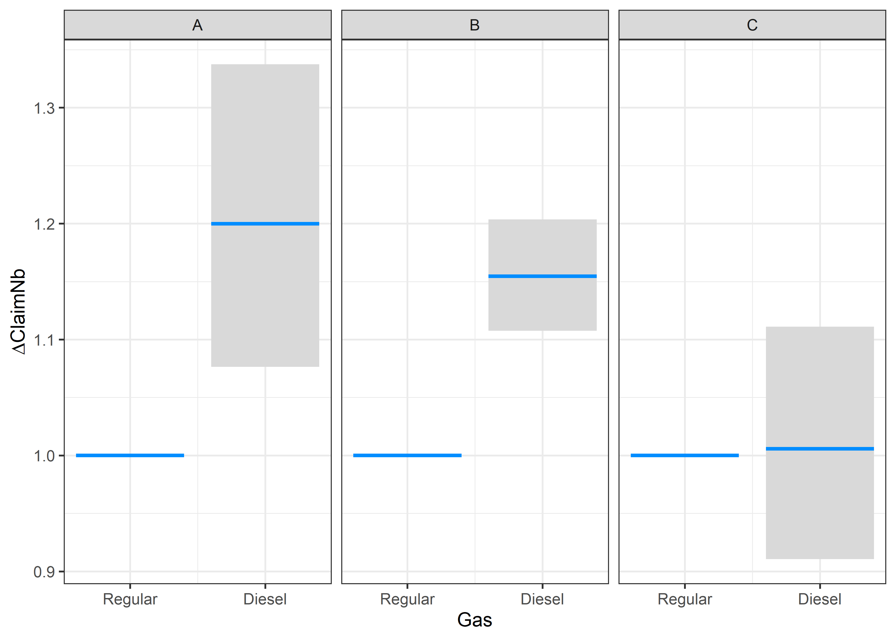

GLM, GLMM and LASSO
================

-   [1 GLM](#1-glm)
    -   [1.1 Data preparation](#11-data-preparation)
        -   [1.1.1 Brand](#111-brand)
        -   [1.1.2 Gas](#112-gas)
        -   [1.1.3 Region](#113-region)
        -   [1.1.4 Power](#114-power)
    -   [1.2 Model](#12-model)
    -   [1.3 Intercept](#13-intercept)
    -   [1.4 All the variables](#14-all-the-variables)
    -   [1.5 Variable : Brand](#15-variable--brand)
    -   [1.6 Variable : Power](#16-variable--power)
    -   [1.7 Variable : Region](#17-variable--region)
    -   [1.8 Interactions ?](#18-interactions-)
    -   [1.9 Predictive Power of the
        models](#19-predictive-power-of-the-models)
-   [2 GLM (including continuous
    variables)](#2-glm-including-continuous-variables)
-   [3 GLMM](#3-glmm)
    -   [3.1 Negative Binomial](#31-negative-binomial)
    -   [3.2 Poisson-LogNormal](#32-poisson-lognormal)
-   [4 Elastic Net](#4-elastic-net)
    -   [4.1 LASSO](#41-lasso)
    -   [4.2 Ridge](#42-ridge)
    -   [4.3 Elastic Net](#43-elastic-net)
    -   [4.4 Comparison with GLM](#44-comparison-with-glm)
-   [5 Useful links](#5-useful-links)

``` r
options(encoding = 'UTF-8')
#Loading all the necessary packages
if (!require("caret")) install.packages("caret")
if (!require("visreg")) install.packages("visreg")
if (!require("MASS")) install.packages("MASS")
if (!require("lme4")) install.packages("lme4")
if (!require("glmnet")) install.packages("glmnet")
if (!require("jtools")) install.packages("jtools")
if (!require("scales")) install.packages("scales")
if (!require("forcats")) install.packages("forcats")
if (!require("stringr")) install.packages("stringr")

require("caret")
require("visreg")
require("MASS")
require("lme4")
require("glmnet")
require("jtools")
require("scales")
require("forcats")
require("stringr")
```

``` r
## Loading the dataset require('CASdatasets') data('freMTPLfreq') freMTPLfreq =
## subset(freMTPLfreq, Exposure<=1 & Exposure >= 0 & CarAge<=25) set.seed(85)
## folds = createDataPartition(freMTPLfreq$ClaimNb, 0.5) dataset =
## freMTPLfreq[folds[[1]], ]

dataset = readRDS("../dataset.RDS")
```

# 1 GLM

## 1.1 Data preparation

An important preliminary step is always data preparation. In our simple
dataset, we only have 10 variables. As a reminder, we have the following
variables.

``` r
str(dataset)
```

    ## 'data.frame':    410864 obs. of  10 variables:
    ##  $ PolicyID : Factor w/ 413169 levels "1","2","3","4",..: 1 2 3 4 5 6 7 8 9 10 ...
    ##  $ ClaimNb  : int  0 0 0 0 0 0 0 0 0 0 ...
    ##  $ Exposure : num  0.09 0.84 0.52 0.45 0.15 0.75 0.81 0.05 0.76 0.34 ...
    ##  $ Power    : Factor w/ 12 levels "d","e","f","g",..: 4 4 3 3 4 4 1 1 1 6 ...
    ##  $ CarAge   : int  0 0 2 2 0 0 1 0 9 0 ...
    ##  $ DriverAge: int  46 46 38 38 41 41 27 27 23 44 ...
    ##  $ Brand    : Factor w/ 7 levels "Fiat","Japanese (except Nissan) or Korean",..: 2 2 2 2 2 2 2 2 1 2 ...
    ##  $ Gas      : Factor w/ 2 levels "Diesel","Regular": 1 1 2 2 1 1 2 2 2 2 ...
    ##  $ Region   : Factor w/ 10 levels "Aquitaine","Basse-Normandie",..: 1 1 8 8 9 9 1 1 8 6 ...
    ##  $ Density  : int  76 76 3003 3003 60 60 695 695 7887 27000 ...

As we see, some variables are considered as integers (int) and others
are considered as factors. For factor variable, an important feature is
the ‘reference level’. R automatically assigns the first category/value
encountered as reference level. This can often be suboptimal, and it is
preferable to have as reference level the category with the most
observation (or largest exposure).

### 1.1.1 Brand

We can see the different levels of a factor variable with the *levels*
function. The first level is the *reference level*.

``` r
levels(dataset$Brand)
```

    ## [1] "Fiat"                               "Japanese (except Nissan) or Korean"
    ## [3] "Mercedes, Chrysler or BMW"          "Opel, General Motors or Ford"      
    ## [5] "other"                              "Renault, Nissan or Citroen"        
    ## [7] "Volkswagen, Audi, Skoda or Seat"

``` r
# table(dataset$Brand)
# or with forcats package ... (see cheatsheet in last section)
dataset$Brand %>% fct_count(sort=TRUE, prop=TRUE)
```

    ## # A tibble: 7 x 3
    ##   f                                       n      p
    ##   <fct>                               <int>  <dbl>
    ## 1 Renault, Nissan or Citroen         216684 0.527 
    ## 2 Japanese (except Nissan) or Korean  79031 0.192 
    ## 3 Opel, General Motors or Ford        37287 0.0908
    ## 4 Volkswagen, Audi, Skoda or Seat     32384 0.0788
    ## 5 Mercedes, Chrysler or BMW           19087 0.0465
    ## 6 Fiat                                16653 0.0405
    ## 7 other                                9738 0.0237

*Renault, Nissan or Citroen* appears to be the most populated level of
variable ‘Brand’. This is why we will set this level as reference level,
using the function relevel, or we can directly use the relevant function
from the forcats package.

``` r
# dataset$Brand = relevel(x = dataset$Brand, ref= "Renault, Nissan or Citroen")
# Easier with forcats

dataset$Brand = dataset$Brand %>% fct_infreq()
levels(dataset$Brand)
```

    ## [1] "Renault, Nissan or Citroen"         "Japanese (except Nissan) or Korean"
    ## [3] "Opel, General Motors or Ford"       "Volkswagen, Audi, Skoda or Seat"   
    ## [5] "Mercedes, Chrysler or BMW"          "Fiat"                              
    ## [7] "other"

### 1.1.2 Gas

``` r
dataset$Gas %>% fct_count(sort=TRUE, prop=TRUE)
```

    ## # A tibble: 2 x 3
    ##   f            n     p
    ##   <fct>    <int> <dbl>
    ## 1 Regular 205565 0.500
    ## 2 Diesel  205299 0.500

We will set Regular as reference level.

``` r
dataset$Gas = dataset$Gas %>% fct_infreq()
levels(dataset$Gas)
```

    ## [1] "Regular" "Diesel"

### 1.1.3 Region

``` r
dataset$Region %>% fct_count(sort=TRUE, prop=TRUE)
```

    ## # A tibble: 10 x 3
    ##    f                       n      p
    ##    <fct>               <int>  <dbl>
    ##  1 Centre             159426 0.388 
    ##  2 Ile-de-France       69576 0.169 
    ##  3 Bretagne            41986 0.102 
    ##  4 Pays-de-la-Loire    38541 0.0938
    ##  5 Aquitaine           31211 0.0760
    ##  6 Nord-Pas-de-Calais  27111 0.0660
    ##  7 Poitou-Charentes    18900 0.0460
    ##  8 Basse-Normandie     10848 0.0264
    ##  9 Haute-Normandie      8726 0.0212
    ## 10 Limousin             4539 0.0110

We will set Regular as reference level.

``` r
dataset$Region = dataset$Region %>% fct_infreq()
levels(dataset$Region)
```

    ##  [1] "Centre"             "Ile-de-France"      "Bretagne"          
    ##  [4] "Pays-de-la-Loire"   "Aquitaine"          "Nord-Pas-de-Calais"
    ##  [7] "Poitou-Charentes"   "Basse-Normandie"    "Haute-Normandie"   
    ## [10] "Limousin"

### 1.1.4 Power

Power is bit of a different factor variable. Indeed, there is some order
between the levels (from lower power to higher power).

``` r
dataset$Power %>% fct_count(sort=TRUE, prop=TRUE)
```

    ## # A tibble: 12 x 3
    ##    f         n       p
    ##    <fct> <int>   <dbl>
    ##  1 f     95432 0.232  
    ##  2 g     90663 0.221  
    ##  3 e     76784 0.187  
    ##  4 d     67660 0.165  
    ##  5 h     26558 0.0646 
    ##  6 j     17978 0.0438 
    ##  7 i     17398 0.0423 
    ##  8 k      9270 0.0226 
    ##  9 l      4593 0.0112 
    ## 10 m      1758 0.00428
    ## 11 o      1494 0.00364
    ## 12 n      1276 0.00311

We will leave ‘d’ as reference level, as it is highly populated and will
allow us to keep it simple to interpret the regression coefficients
(levels are ordered).

``` r
dataset$Power = dataset$Power %>% fct_relevel(sort)
levels(dataset$Power)
```

    ##  [1] "d" "e" "f" "g" "h" "i" "j" "k" "l" "m" "n" "o"

## 1.2 Model

We are going to model the claim frequencies using a GLM. We will only
consider the categorical variables in this part, as we will see later
that other tools are available to treat the continuous variables without
having to discretize them.

Let us first split out dataset in two parts: a training set and a
testing set (this step requires the *caret* package).

``` r
set.seed(21)  # For reproducibility
in_training = createDataPartition(dataset$ClaimNb, times = 1, p = 0.8, list = FALSE)
training_set = dataset[in_training, ]
testing_set = dataset[-in_training, ]
```

## 1.3 Intercept

The main function is called *glm*. Let us run the function on our
training set

``` r
m0 = glm(ClaimNb ~ offset(log(Exposure)), data = training_set, family = poisson())
summary(m0)
```

    ## 
    ## Call:
    ## glm(formula = ClaimNb ~ offset(log(Exposure)), family = poisson(), 
    ##     data = training_set)
    ## 
    ## Deviance Residuals: 
    ##     Min       1Q   Median       3Q      Max  
    ## -0.3748  -0.3748  -0.2651  -0.1499   6.5399  
    ## 
    ## Coefficients:
    ##              Estimate Std. Error z value Pr(>|z|)    
    ## (Intercept) -2.655615   0.008789  -302.1   <2e-16 ***
    ## ---
    ## Signif. codes:  0 '***' 0.001 '**' 0.01 '*' 0.05 '.' 0.1 ' ' 1
    ## 
    ## (Dispersion parameter for poisson family taken to be 1)
    ## 
    ##     Null deviance: 84299  on 328691  degrees of freedom
    ## Residual deviance: 84299  on 328691  degrees of freedom
    ## AIC: 109308
    ## 
    ## Number of Fisher Scoring iterations: 6

By default, the link function is the log (see help file *?poisson*).

We can find the average claim frequency of the portfolio. The average
claim frequency is then given by
")
=
")
= 0.0703.

``` r
exp(m0$coefficients)
```

## 1.4 All the variables

First, we will only consider the discrete variables, namely *Power*,
*Brand*, *Gas* and *Region*.

Let us include all these variables (without interactions) in the model.

``` r
m1 = glm(ClaimNb ~ offset(log(Exposure)) + Power + Gas + Brand + Region, data = training_set,
    family = poisson(link = log))
summary(m1)
```

    ## 
    ## Call:
    ## glm(formula = ClaimNb ~ offset(log(Exposure)) + Power + Gas + 
    ##     Brand + Region, family = poisson(link = log), data = training_set)
    ## 
    ## Deviance Residuals: 
    ##     Min       1Q   Median       3Q      Max  
    ## -0.5085  -0.3498  -0.2662  -0.1481   6.6335  
    ## 
    ## Coefficients:
    ##                                         Estimate Std. Error  z value Pr(>|z|)
    ## (Intercept)                             -2.92738    0.02686 -108.980  < 2e-16
    ## Powere                                   0.08199    0.03121    2.627 0.008622
    ## Powerf                                   0.08333    0.03058    2.725 0.006430
    ## Powerg                                   0.04901    0.03044    1.610 0.107353
    ## Powerh                                   0.08583    0.04350    1.973 0.048475
    ## Poweri                                   0.18977    0.04841    3.920 8.87e-05
    ## Powerj                                   0.18583    0.04873    3.814 0.000137
    ## Powerk                                   0.20036    0.06432    3.115 0.001839
    ## Powerl                                   0.10847    0.09418    1.152 0.249470
    ## Powerm                                   0.24356    0.13330    1.827 0.067683
    ## Powern                                   0.20713    0.15903    1.302 0.192752
    ## Powero                                   0.26127    0.15324    1.705 0.088208
    ## GasDiesel                                0.12636    0.01886    6.700 2.09e-11
    ## BrandJapanese (except Nissan) or Korean -0.19473    0.03059   -6.365 1.95e-10
    ## BrandOpel, General Motors or Ford        0.14284    0.02983    4.788 1.68e-06
    ## BrandVolkswagen, Audi, Skoda or Seat     0.14182    0.03169    4.476 7.62e-06
    ## BrandMercedes, Chrysler or BMW           0.07159    0.04424    1.618 0.105662
    ## BrandFiat                                0.09812    0.04380    2.240 0.025061
    ## Brandother                               0.03085    0.05674    0.544 0.586670
    ## RegionIle-de-France                      0.38849    0.02835   13.702  < 2e-16
    ## RegionBretagne                           0.04931    0.02954    1.670 0.095010
    ## RegionPays-de-la-Loire                   0.15946    0.03129    5.096 3.46e-07
    ## RegionAquitaine                          0.17098    0.03795    4.506 6.62e-06
    ## RegionNord-Pas-de-Calais                 0.31214    0.03946    7.910 2.58e-15
    ## RegionPoitou-Charentes                   0.16466    0.04142    3.975 7.03e-05
    ## RegionBasse-Normandie                    0.11350    0.05389    2.106 0.035185
    ## RegionHaute-Normandie                    0.13236    0.07685    1.722 0.085024
    ## RegionLimousin                           0.41227    0.07692    5.360 8.34e-08
    ##                                            
    ## (Intercept)                             ***
    ## Powere                                  ** 
    ## Powerf                                  ** 
    ## Powerg                                     
    ## Powerh                                  *  
    ## Poweri                                  ***
    ## Powerj                                  ***
    ## Powerk                                  ** 
    ## Powerl                                     
    ## Powerm                                  .  
    ## Powern                                     
    ## Powero                                  .  
    ## GasDiesel                               ***
    ## BrandJapanese (except Nissan) or Korean ***
    ## BrandOpel, General Motors or Ford       ***
    ## BrandVolkswagen, Audi, Skoda or Seat    ***
    ## BrandMercedes, Chrysler or BMW             
    ## BrandFiat                               *  
    ## Brandother                                 
    ## RegionIle-de-France                     ***
    ## RegionBretagne                          .  
    ## RegionPays-de-la-Loire                  ***
    ## RegionAquitaine                         ***
    ## RegionNord-Pas-de-Calais                ***
    ## RegionPoitou-Charentes                  ***
    ## RegionBasse-Normandie                   *  
    ## RegionHaute-Normandie                   .  
    ## RegionLimousin                          ***
    ## ---
    ## Signif. codes:  0 '***' 0.001 '**' 0.01 '*' 0.05 '.' 0.1 ' ' 1
    ## 
    ## (Dispersion parameter for poisson family taken to be 1)
    ## 
    ##     Null deviance: 84299  on 328691  degrees of freedom
    ## Residual deviance: 83916  on 328664  degrees of freedom
    ## AIC: 108979
    ## 
    ## Number of Fisher Scoring iterations: 6

We will use the function *visreg* from package *visreg* to plot the
coefficients, along with their confidence interval.

``` r
visreg(m1, "Power", type="contrast", scale="response", gg=TRUE, rug=FALSE, partial=FALSE) + theme_bw()
```

    ## Warning: You are attempting to transform a contrast. The resulting plot is not
    ## guaranteed to be meaningful.

<!-- -->

``` r
visreg(m1, "Gas", type="contrast", scale="response", gg=TRUE, rug=FALSE, partial=FALSE) + theme_bw()
```

    ## Warning: You are attempting to transform a contrast. The resulting plot is not
    ## guaranteed to be meaningful.

<!-- -->

``` r
visreg(m1, "Region", type="contrast", scale="response", gg=TRUE, rug=FALSE, partial=FALSE) + theme_bw() + 
  theme(axis.text.x = element_text(angle = 90, vjust = 0.5, hjust=1))
```

    ## Warning: You are attempting to transform a contrast. The resulting plot is not
    ## guaranteed to be meaningful.

<!-- -->

``` r
visreg(m1, "Brand", type="contrast", scale="response", gg=TRUE, rug=FALSE, partial=FALSE) + theme_bw() + 
  theme(axis.text.x = element_text(angle = 90, vjust = 0.5, hjust=1))
```

    ## Warning: You are attempting to transform a contrast. The resulting plot is not
    ## guaranteed to be meaningful.

<!-- -->

We see some levels of some variables appear to be not significantly
different from 0 (or 1 on the response scale). Moreover, it could be
that some levels appear to be significantly different from 0, but are
not significantly different from each other and could be merged.

If we wish to perform a likelihood ratio test between the full model
()
and the model without any explanatory variables
()

``` r
anova(m0, m1, test = "Chisq")
```

    ## Analysis of Deviance Table
    ## 
    ## Model 1: ClaimNb ~ offset(log(Exposure))
    ## Model 2: ClaimNb ~ offset(log(Exposure)) + Power + Gas + Brand + Region
    ##   Resid. Df Resid. Dev Df Deviance  Pr(>Chi)    
    ## 1    328691      84299                          
    ## 2    328664      83916 27   382.74 < 2.2e-16 ***
    ## ---
    ## Signif. codes:  0 '***' 0.001 '**' 0.01 '*' 0.05 '.' 0.1 ' ' 1

We can try to merge some of the levels that appear to be not
significantly different.

## 1.5 Variable : Brand

Let’s start with the variable Brand.

``` r
# Old style: training_set$Brand_merged = training_set$Brand
# testing_set$Brand_merged = testing_set$Brand Brand_list_levels = list('A' =
# c('Fiat', 'Mercedes, Chrysler or BMW', 'Opel, General Motors or Ford',
# 'other', 'Volkswagen, Audi, Skoda or Seat'), 'B' = 'Japanese (except Nissan)
# or Korean', 'C' = 'Renault, Nissan or Citroen')
# levels(training_set$Brand_merged) <- Brand_list_levels
# levels(testing_set$Brand_merged) <- Brand_list_levels Better: Use forcats
# with function fct_collapse


training_set$Brand_merged = training_set$Brand %>%
    fct_collapse(A = c("Fiat", "Mercedes, Chrysler or BMW", "Opel, General Motors or Ford",
        "other", "Volkswagen, Audi, Skoda or Seat"))

testing_set$Brand_merged = testing_set$Brand %>%
    fct_collapse(A = c("Fiat", "Mercedes, Chrysler or BMW", "Opel, General Motors or Ford",
        "other", "Volkswagen, Audi, Skoda or Seat"))

training_set$Brand_merged %>%
    fct_count(sort = TRUE, prop = TRUE)
```

    ## # A tibble: 3 x 3
    ##   f                                       n     p
    ##   <fct>                               <int> <dbl>
    ## 1 Renault, Nissan or Citroen         173394 0.528
    ## 2 A                                   92203 0.281
    ## 3 Japanese (except Nissan) or Korean  63095 0.192

Let us now estimate the new model with these merged levels…

``` r
m2 = glm(ClaimNb ~ offset(log(Exposure)) + Power + Gas + Brand_merged + Region, data = training_set,
    family = poisson(link = log))
summary(m2)
```

    ## 
    ## Call:
    ## glm(formula = ClaimNb ~ offset(log(Exposure)) + Power + Gas + 
    ##     Brand_merged + Region, family = poisson(link = log), data = training_set)
    ## 
    ## Deviance Residuals: 
    ##     Min       1Q   Median       3Q      Max  
    ## -0.5093  -0.3506  -0.2662  -0.1480   6.6305  
    ## 
    ## Coefficients:
    ##                                                Estimate Std. Error  z value
    ## (Intercept)                                    -2.92698    0.02673 -109.511
    ## Powere                                          0.08818    0.03101    2.843
    ## Powerf                                          0.08505    0.03050    2.789
    ## Powerg                                          0.04737    0.03029    1.564
    ## Powerh                                          0.07704    0.04330    1.779
    ## Poweri                                          0.17928    0.04796    3.738
    ## Powerj                                          0.17717    0.04832    3.666
    ## Powerk                                          0.18850    0.06378    2.956
    ## Powerl                                          0.08957    0.09278    0.965
    ## Powerm                                          0.20938    0.13060    1.603
    ## Powern                                          0.18597    0.15818    1.176
    ## Powero                                          0.25419    0.15298    1.662
    ## GasDiesel                                       0.12530    0.01879    6.669
    ## Brand_mergedJapanese (except Nissan) or Korean -0.19147    0.03054   -6.270
    ## Brand_mergedA                                   0.11697    0.02009    5.824
    ## RegionIle-de-France                             0.38793    0.02835   13.684
    ## RegionBretagne                                  0.04948    0.02953    1.676
    ## RegionPays-de-la-Loire                          0.15962    0.03129    5.102
    ## RegionAquitaine                                 0.17122    0.03794    4.512
    ## RegionNord-Pas-de-Calais                        0.31337    0.03946    7.942
    ## RegionPoitou-Charentes                          0.16473    0.04142    3.977
    ## RegionBasse-Normandie                           0.11234    0.05388    2.085
    ## RegionHaute-Normandie                           0.13115    0.07685    1.707
    ## RegionLimousin                                  0.41228    0.07692    5.360
    ##                                                Pr(>|z|)    
    ## (Intercept)                                     < 2e-16 ***
    ## Powere                                         0.004465 ** 
    ## Powerf                                         0.005293 ** 
    ## Powerg                                         0.117856    
    ## Powerh                                         0.075194 .  
    ## Poweri                                         0.000186 ***
    ## Powerj                                         0.000246 ***
    ## Powerk                                         0.003121 ** 
    ## Powerl                                         0.334343    
    ## Powerm                                         0.108906    
    ## Powern                                         0.239711    
    ## Powero                                         0.096606 .  
    ## GasDiesel                                      2.57e-11 ***
    ## Brand_mergedJapanese (except Nissan) or Korean 3.62e-10 ***
    ## Brand_mergedA                                  5.76e-09 ***
    ## RegionIle-de-France                             < 2e-16 ***
    ## RegionBretagne                                 0.093825 .  
    ## RegionPays-de-la-Loire                         3.37e-07 ***
    ## RegionAquitaine                                6.41e-06 ***
    ## RegionNord-Pas-de-Calais                       1.99e-15 ***
    ## RegionPoitou-Charentes                         6.96e-05 ***
    ## RegionBasse-Normandie                          0.037085 *  
    ## RegionHaute-Normandie                          0.087875 .  
    ## RegionLimousin                                 8.31e-08 ***
    ## ---
    ## Signif. codes:  0 '***' 0.001 '**' 0.01 '*' 0.05 '.' 0.1 ' ' 1
    ## 
    ## (Dispersion parameter for poisson family taken to be 1)
    ## 
    ##     Null deviance: 84299  on 328691  degrees of freedom
    ## Residual deviance: 83922  on 328668  degrees of freedom
    ## AIC: 108976
    ## 
    ## Number of Fisher Scoring iterations: 6

…and perform a likelihood ratio test to compare both models.

``` r
anova(m2, m1, test = "Chisq")
```

    ## Analysis of Deviance Table
    ## 
    ## Model 1: ClaimNb ~ offset(log(Exposure)) + Power + Gas + Brand_merged + 
    ##     Region
    ## Model 2: ClaimNb ~ offset(log(Exposure)) + Power + Gas + Brand + Region
    ##   Resid. Df Resid. Dev Df Deviance Pr(>Chi)
    ## 1    328668      83922                     
    ## 2    328664      83916  4    5.291   0.2587

## 1.6 Variable : Power

Let us now look at the variable Power.

``` r
visreg(m2, "Power", type = "contrast", scale = "response", gg = TRUE, rug = FALSE,
    partial = FALSE) + theme_bw()
```

    ## Warning: You are attempting to transform a contrast. The resulting plot is not
    ## guaranteed to be meaningful.


``` r
# Old style training_set$Power_merged = training_set$Power Power_list_levels =
# list('A'= 'd', 'B' = c('e','f', 'g', 'h'), 'C' = c('i','j', 'k', 'l', 'm',
# 'n', 'o')) levels(training_set$Power_merged) = Power_list_levels
# testing_set$Power_merged = testing_set$Power levels(testing_set$Power_merged)
# = Power_list_levels Easier with forcats

training_set$Power_merged = training_set$Power %>%
    fct_collapse(A = "d", B = c("e", "f", "g", "h"), C = c("i", "j", "k", "l", "m",
        "n", "o"))

testing_set$Power_merged = testing_set$Power %>%
    fct_collapse(A = "d", B = c("e", "f", "g", "h"), C = c("i", "j", "k", "l", "m",
        "n", "o"))


m3 = glm(ClaimNb ~ offset(log(Exposure)) + Power_merged + Gas + Brand_merged + Region,
    data = training_set, family = poisson(link = log))
summary(m3)
```

    ## 
    ## Call:
    ## glm(formula = ClaimNb ~ offset(log(Exposure)) + Power_merged + 
    ##     Gas + Brand_merged + Region, family = poisson(link = log), 
    ##     data = training_set)
    ## 
    ## Deviance Residuals: 
    ##     Min       1Q   Median       3Q      Max  
    ## -0.4961  -0.3494  -0.2664  -0.1482   6.6321  
    ## 
    ## Coefficients:
    ##                                                Estimate Std. Error  z value
    ## (Intercept)                                    -2.92719    0.02667 -109.746
    ## Power_mergedB                                   0.07304    0.02621    2.787
    ## Power_mergedC                                   0.17611    0.03396    5.186
    ## GasDiesel                                       0.12709    0.01837    6.918
    ## Brand_mergedJapanese (except Nissan) or Korean -0.19518    0.03016   -6.471
    ## Brand_mergedA                                   0.11696    0.01989    5.879
    ## RegionIle-de-France                             0.38892    0.02833   13.729
    ## RegionBretagne                                  0.05035    0.02952    1.706
    ## RegionPays-de-la-Loire                          0.15950    0.03129    5.098
    ## RegionAquitaine                                 0.17242    0.03793    4.545
    ## RegionNord-Pas-de-Calais                        0.31460    0.03944    7.977
    ## RegionPoitou-Charentes                          0.16475    0.04141    3.978
    ## RegionBasse-Normandie                           0.11235    0.05388    2.085
    ## RegionHaute-Normandie                           0.13044    0.07684    1.698
    ## RegionLimousin                                  0.41205    0.07691    5.357
    ##                                                Pr(>|z|)    
    ## (Intercept)                                     < 2e-16 ***
    ## Power_mergedB                                   0.00533 ** 
    ## Power_mergedC                                  2.15e-07 ***
    ## GasDiesel                                      4.57e-12 ***
    ## Brand_mergedJapanese (except Nissan) or Korean 9.71e-11 ***
    ## Brand_mergedA                                  4.12e-09 ***
    ## RegionIle-de-France                             < 2e-16 ***
    ## RegionBretagne                                  0.08809 .  
    ## RegionPays-de-la-Loire                         3.43e-07 ***
    ## RegionAquitaine                                5.48e-06 ***
    ## RegionNord-Pas-de-Calais                       1.50e-15 ***
    ## RegionPoitou-Charentes                         6.94e-05 ***
    ## RegionBasse-Normandie                           0.03703 *  
    ## RegionHaute-Normandie                           0.08958 .  
    ## RegionLimousin                                 8.44e-08 ***
    ## ---
    ## Signif. codes:  0 '***' 0.001 '**' 0.01 '*' 0.05 '.' 0.1 ' ' 1
    ## 
    ## (Dispersion parameter for poisson family taken to be 1)
    ## 
    ##     Null deviance: 84299  on 328691  degrees of freedom
    ## Residual deviance: 83926  on 328677  degrees of freedom
    ## AIC: 108962
    ## 
    ## Number of Fisher Scoring iterations: 6

``` r
anova(m3, m2, test = "Chisq")
```

    ## Analysis of Deviance Table
    ## 
    ## Model 1: ClaimNb ~ offset(log(Exposure)) + Power_merged + Gas + Brand_merged + 
    ##     Region
    ## Model 2: ClaimNb ~ offset(log(Exposure)) + Power + Gas + Brand_merged + 
    ##     Region
    ##   Resid. Df Resid. Dev Df Deviance Pr(>Chi)
    ## 1    328677      83926                     
    ## 2    328668      83922  9   4.2326   0.8954

## 1.7 Variable : Region

Finally, let’s consider the variable Region.

``` r
visreg(m3, "Region", type = "contrast", scale = "response", gg = TRUE, rug = FALSE,
    partial = FALSE) + theme_bw() + theme(axis.text.x = element_text(angle = 90,
    vjust = 0.5, hjust = 1))
```

    ## Warning: You are attempting to transform a contrast. The resulting plot is not
    ## guaranteed to be meaningful.


``` r
# Old style: training_set$Region_merged = training_set$Region
# levels(training_set$Region_merged)[which(levels(training_set$Region) %in%
# c('Ile-de-France', 'Limousin'))] ='IDF-LIMOUSIN' testing_set$Region_merged =
# testing_set$Region
# levels(testing_set$Region_merged)[which(levels(training_set$Region) %in%
# c('Ile-de-France', 'Limousin'))] ='IDF-LIMOUSIN' Better: Use forcats

training_set$Region_merged = training_set$Region %>%
    fct_collapse(`IDF-LIMOUSIN` = c("Ile-de-France", "Limousin"))
testing_set$Region_merged = testing_set$Region %>%
    fct_collapse(`IDF-LIMOUSIN` = c("Ile-de-France", "Limousin"))


m4 = glm(ClaimNb ~ offset(log(Exposure)) + Power_merged + Gas + Brand_merged + Region_merged,
    data = training_set, family = poisson(link = log))
summary(m4)
```

    ## 
    ## Call:
    ## glm(formula = ClaimNb ~ offset(log(Exposure)) + Power_merged + 
    ##     Gas + Brand_merged + Region_merged, family = poisson(link = log), 
    ##     data = training_set)
    ## 
    ## Deviance Residuals: 
    ##     Min       1Q   Median       3Q      Max  
    ## -0.4909  -0.3494  -0.2663  -0.1482   6.6324  
    ## 
    ## Coefficients:
    ##                                                Estimate Std. Error  z value
    ## (Intercept)                                    -2.92724    0.02667 -109.749
    ## Power_mergedB                                   0.07298    0.02621    2.784
    ## Power_mergedC                                   0.17598    0.03396    5.182
    ## GasDiesel                                       0.12732    0.01835    6.937
    ## Brand_mergedJapanese (except Nissan) or Korean -0.19566    0.03012   -6.497
    ## Brand_mergedA                                   0.11694    0.01989    5.878
    ## Region_mergedIDF-LIMOUSIN                       0.39093    0.02747   14.230
    ## Region_mergedBretagne                           0.05037    0.02952    1.706
    ## Region_mergedPays-de-la-Loire                   0.15954    0.03129    5.099
    ## Region_mergedAquitaine                          0.17251    0.03793    4.548
    ## Region_mergedNord-Pas-de-Calais                 0.31468    0.03944    7.979
    ## Region_mergedPoitou-Charentes                   0.16478    0.04141    3.979
    ## Region_mergedBasse-Normandie                    0.11239    0.05388    2.086
    ## Region_mergedHaute-Normandie                    0.13052    0.07684    1.699
    ##                                                Pr(>|z|)    
    ## (Intercept)                                     < 2e-16 ***
    ## Power_mergedB                                   0.00536 ** 
    ## Power_mergedC                                  2.19e-07 ***
    ## GasDiesel                                      4.00e-12 ***
    ## Brand_mergedJapanese (except Nissan) or Korean 8.19e-11 ***
    ## Brand_mergedA                                  4.15e-09 ***
    ## Region_mergedIDF-LIMOUSIN                       < 2e-16 ***
    ## Region_mergedBretagne                           0.08799 .  
    ## Region_mergedPays-de-la-Loire                  3.41e-07 ***
    ## Region_mergedAquitaine                         5.41e-06 ***
    ## Region_mergedNord-Pas-de-Calais                1.47e-15 ***
    ## Region_mergedPoitou-Charentes                  6.92e-05 ***
    ## Region_mergedBasse-Normandie                    0.03697 *  
    ## Region_mergedHaute-Normandie                    0.08938 .  
    ## ---
    ## Signif. codes:  0 '***' 0.001 '**' 0.01 '*' 0.05 '.' 0.1 ' ' 1
    ## 
    ## (Dispersion parameter for poisson family taken to be 1)
    ## 
    ##     Null deviance: 84299  on 328691  degrees of freedom
    ## Residual deviance: 83926  on 328678  degrees of freedom
    ## AIC: 108961
    ## 
    ## Number of Fisher Scoring iterations: 6

``` r
anova(m4, m3, test = "Chisq")
```

    ## Analysis of Deviance Table
    ## 
    ## Model 1: ClaimNb ~ offset(log(Exposure)) + Power_merged + Gas + Brand_merged + 
    ##     Region_merged
    ## Model 2: ClaimNb ~ offset(log(Exposure)) + Power_merged + Gas + Brand_merged + 
    ##     Region
    ##   Resid. Df Resid. Dev Df Deviance Pr(>Chi)
    ## 1    328678      83926                     
    ## 2    328677      83926  1 0.085697   0.7697

## 1.8 Interactions ?

Let’s see if we can add some interactions.

``` r
m5.1 = glm(ClaimNb ~ offset(log(Exposure)) + Power_merged + Gas + Brand_merged +
    Region_merged + Power_merged:Gas, data = training_set, family = poisson(link = log))
summary(m5.1)
```

    ## 
    ## Call:
    ## glm(formula = ClaimNb ~ offset(log(Exposure)) + Power_merged + 
    ##     Gas + Brand_merged + Region_merged + Power_merged:Gas, family = poisson(link = log), 
    ##     data = training_set)
    ## 
    ## Deviance Residuals: 
    ##     Min       1Q   Median       3Q      Max  
    ## -0.4722  -0.3509  -0.2665  -0.1478   6.6373  
    ## 
    ## Coefficients:
    ##                                                Estimate Std. Error  z value
    ## (Intercept)                                    -2.93821    0.02906 -101.112
    ## Power_mergedB                                   0.07388    0.03108    2.377
    ## Power_mergedC                                   0.23728    0.04098    5.790
    ## GasDiesel                                       0.17265    0.05450    3.168
    ## Brand_mergedJapanese (except Nissan) or Korean -0.19079    0.03021   -6.314
    ## Brand_mergedA                                   0.11927    0.01996    5.975
    ## Region_mergedIDF-LIMOUSIN                       0.38722    0.02751   14.074
    ## Region_mergedBretagne                           0.04985    0.02952    1.688
    ## Region_mergedPays-de-la-Loire                   0.15951    0.03129    5.098
    ## Region_mergedAquitaine                          0.17157    0.03793    4.523
    ## Region_mergedNord-Pas-de-Calais                 0.31264    0.03945    7.926
    ## Region_mergedPoitou-Charentes                   0.16452    0.04141    3.973
    ## Region_mergedBasse-Normandie                    0.11322    0.05388    2.101
    ## Region_mergedHaute-Normandie                    0.12990    0.07684    1.691
    ## Power_mergedB:GasDiesel                        -0.02919    0.05851   -0.499
    ## Power_mergedC:GasDiesel                        -0.17203    0.07371   -2.334
    ##                                                Pr(>|z|)    
    ## (Intercept)                                     < 2e-16 ***
    ## Power_mergedB                                   0.01745 *  
    ## Power_mergedC                                  7.06e-09 ***
    ## GasDiesel                                       0.00154 ** 
    ## Brand_mergedJapanese (except Nissan) or Korean 2.71e-10 ***
    ## Brand_mergedA                                  2.30e-09 ***
    ## Region_mergedIDF-LIMOUSIN                       < 2e-16 ***
    ## Region_mergedBretagne                           0.09134 .  
    ## Region_mergedPays-de-la-Loire                  3.43e-07 ***
    ## Region_mergedAquitaine                         6.10e-06 ***
    ## Region_mergedNord-Pas-de-Calais                2.27e-15 ***
    ## Region_mergedPoitou-Charentes                  7.11e-05 ***
    ## Region_mergedBasse-Normandie                    0.03561 *  
    ## Region_mergedHaute-Normandie                    0.09092 .  
    ## Power_mergedB:GasDiesel                         0.61789    
    ## Power_mergedC:GasDiesel                         0.01961 *  
    ## ---
    ## Signif. codes:  0 '***' 0.001 '**' 0.01 '*' 0.05 '.' 0.1 ' ' 1
    ## 
    ## (Dispersion parameter for poisson family taken to be 1)
    ## 
    ##     Null deviance: 84299  on 328691  degrees of freedom
    ## Residual deviance: 83918  on 328676  degrees of freedom
    ## AIC: 108957
    ## 
    ## Number of Fisher Scoring iterations: 6

``` r
anova(m4, m5.1, test = "Chisq")
```

    ## Analysis of Deviance Table
    ## 
    ## Model 1: ClaimNb ~ offset(log(Exposure)) + Power_merged + Gas + Brand_merged + 
    ##     Region_merged
    ## Model 2: ClaimNb ~ offset(log(Exposure)) + Power_merged + Gas + Brand_merged + 
    ##     Region_merged + Power_merged:Gas
    ##   Resid. Df Resid. Dev Df Deviance Pr(>Chi)  
    ## 1    328678      83926                       
    ## 2    328676      83918  2   7.7972  0.02027 *
    ## ---
    ## Signif. codes:  0 '***' 0.001 '**' 0.01 '*' 0.05 '.' 0.1 ' ' 1

Let’s try to find other interactions

-   with Power_merged.

``` r
m5.2 = glm(ClaimNb ~ offset(log(Exposure)) + Power_merged + Gas + Brand_merged +
    Region_merged + Power_merged:Gas + Power_merged:Brand_merged, data = training_set,
    family = poisson(link = log))
anova(m5.1, m5.2, test = "Chisq")
```

    ## Analysis of Deviance Table
    ## 
    ## Model 1: ClaimNb ~ offset(log(Exposure)) + Power_merged + Gas + Brand_merged + 
    ##     Region_merged + Power_merged:Gas
    ## Model 2: ClaimNb ~ offset(log(Exposure)) + Power_merged + Gas + Brand_merged + 
    ##     Region_merged + Power_merged:Gas + Power_merged:Brand_merged
    ##   Resid. Df Resid. Dev Df Deviance Pr(>Chi)  
    ## 1    328676      83918                       
    ## 2    328672      83908  4    10.33  0.03522 *
    ## ---
    ## Signif. codes:  0 '***' 0.001 '**' 0.01 '*' 0.05 '.' 0.1 ' ' 1

``` r
m5.3 = glm(ClaimNb ~ offset(log(Exposure)) + Power_merged  + Gas + Brand_merged + Region_merged + Power_merged:Gas + Power_merged:Brand_merged + Power_merged:Region_merged,
         data = training_set,
         family=poisson(link = log))
anova(m5.2, m5.3, test="Chisq")
```

    ## Analysis of Deviance Table
    ## 
    ## Model 1: ClaimNb ~ offset(log(Exposure)) + Power_merged + Gas + Brand_merged + 
    ##     Region_merged + Power_merged:Gas + Power_merged:Brand_merged
    ## Model 2: ClaimNb ~ offset(log(Exposure)) + Power_merged + Gas + Brand_merged + 
    ##     Region_merged + Power_merged:Gas + Power_merged:Brand_merged + 
    ##     Power_merged:Region_merged
    ##   Resid. Df Resid. Dev Df Deviance Pr(>Chi)
    ## 1    328672      83908                     
    ## 2    328656      83888 16   19.617    0.238

We will now keep the model m5.2 for now and look for other interactions.

-   with Gas

``` r
m5.4 = glm(ClaimNb ~ offset(log(Exposure)) + Power_merged + Gas + Brand_merged +
    Region_merged + Power_merged:Gas + Power_merged:Brand_merged + Gas:Brand_merged,
    data = training_set, family = poisson(link = log))

anova(m5.2, m5.4, test = "Chisq")
```

    ## Analysis of Deviance Table
    ## 
    ## Model 1: ClaimNb ~ offset(log(Exposure)) + Power_merged + Gas + Brand_merged + 
    ##     Region_merged + Power_merged:Gas + Power_merged:Brand_merged
    ## Model 2: ClaimNb ~ offset(log(Exposure)) + Power_merged + Gas + Brand_merged + 
    ##     Region_merged + Power_merged:Gas + Power_merged:Brand_merged + 
    ##     Gas:Brand_merged
    ##   Resid. Df Resid. Dev Df Deviance Pr(>Chi)
    ## 1    328672      83908                     
    ## 2    328670      83907  2  0.41788   0.8114

``` r
m5.5 = glm(ClaimNb ~ offset(log(Exposure)) + Power_merged  + Gas + Brand_merged + Region_merged + Power_merged:Gas + Power_merged:Brand_merged + Gas:Region_merged,
         data = training_set,
         family=poisson(link = log))
anova(m5.2, m5.5, test="Chisq")
```

    ## Analysis of Deviance Table
    ## 
    ## Model 1: ClaimNb ~ offset(log(Exposure)) + Power_merged + Gas + Brand_merged + 
    ##     Region_merged + Power_merged:Gas + Power_merged:Brand_merged
    ## Model 2: ClaimNb ~ offset(log(Exposure)) + Power_merged + Gas + Brand_merged + 
    ##     Region_merged + Power_merged:Gas + Power_merged:Brand_merged + 
    ##     Gas:Region_merged
    ##   Resid. Df Resid. Dev Df Deviance Pr(>Chi)
    ## 1    328672      83908                     
    ## 2    328664      83899  8   8.9251   0.3487

-   with Brand_merged

``` r
m5.6 = glm(ClaimNb ~ offset(log(Exposure)) + Power_merged + Gas + Brand_merged +
    Region_merged + Power_merged:Gas + Power_merged:Brand_merged + Brand_merged:Region_merged,
    data = training_set, family = poisson(link = log))
anova(m5.2, m5.6, test = "Chisq")
```

    ## Analysis of Deviance Table
    ## 
    ## Model 1: ClaimNb ~ offset(log(Exposure)) + Power_merged + Gas + Brand_merged + 
    ##     Region_merged + Power_merged:Gas + Power_merged:Brand_merged
    ## Model 2: ClaimNb ~ offset(log(Exposure)) + Power_merged + Gas + Brand_merged + 
    ##     Region_merged + Power_merged:Gas + Power_merged:Brand_merged + 
    ##     Brand_merged:Region_merged
    ##   Resid. Df Resid. Dev Df Deviance  Pr(>Chi)    
    ## 1    328672      83908                          
    ## 2    328656      83863 16   44.333 0.0001755 ***
    ## ---
    ## Signif. codes:  0 '***' 0.001 '**' 0.01 '*' 0.05 '.' 0.1 ' ' 1

We will keep this interaction.

We can visualize the interaction between Power_merged and Gas

``` r
visreg(m5.6, by = "Power_merged", xvar = "Gas", scale = "response", type = "contrast",
    gg = TRUE, partial = FALSE, rug = FALSE) + theme_bw()
```

    ## Warning: You are attempting to transform a contrast. The resulting plot is not
    ## guaranteed to be meaningful.



and between Power_merged and Brand_merged

``` r
visreg(m5.6, xvar = "Brand_merged", by = "Power_merged", scale = "response", type = "contrast",
    gg = TRUE, partial = FALSE, rug = FALSE) + theme_bw() + theme(axis.text.x = element_text(angle = 90,
    vjust = 0.5, hjust = 1))
```

    ## Warning: You are attempting to transform a contrast. The resulting plot is not
    ## guaranteed to be meaningful.


and between Brand_merged and Region_merged

``` r
visreg(m5.6, by = "Region_merged", xvar = "Brand_merged", scale = "response", type = "contrast",
    gg = TRUE, partial = FALSE, rug = FALSE) + theme_bw() + theme(axis.text.x = element_text(angle = 90,
    vjust = 0.5, hjust = 1))
```

    ## Warning: You are attempting to transform a contrast. The resulting plot is not
    ## guaranteed to be meaningful.


## 1.9 Predictive Power of the models

Let us now check the predictive power of the various models that we have
used up to now. We can use the testing_set that we have created from the
beginning. We can use for instance, the Poisson deviance as a measure
(that we wish to minimize).

``` r
results = rep(NA, 7)

results[1] = 2 * (sum(dpois(x = testing_set$ClaimNb, lambda = testing_set$ClaimNb,
    log = TRUE)) - sum(dpois(x = testing_set$ClaimNb, lambda = predict(m0, newdata = testing_set,
    type = "response"), log = TRUE)))

results[2] = 2 * (sum(dpois(x = testing_set$ClaimNb, lambda = testing_set$ClaimNb,
    log = TRUE)) - sum(dpois(x = testing_set$ClaimNb, lambda = predict(m1, newdata = testing_set,
    type = "response"), log = TRUE)))

results[3] = 2 * (sum(dpois(x = testing_set$ClaimNb, lambda = testing_set$ClaimNb,
    log = TRUE)) - sum(dpois(x = testing_set$ClaimNb, lambda = predict(m2, newdata = testing_set,
    type = "response"), log = TRUE)))

results[4] = 2 * (sum(dpois(x = testing_set$ClaimNb, lambda = testing_set$ClaimNb,
    log = TRUE)) - sum(dpois(x = testing_set$ClaimNb, lambda = predict(m3, newdata = testing_set,
    type = "response"), log = TRUE)))

results[5] = 2 * (sum(dpois(x = testing_set$ClaimNb, lambda = testing_set$ClaimNb,
    log = TRUE)) - sum(dpois(x = testing_set$ClaimNb, lambda = predict(m4, newdata = testing_set,
    type = "response"), log = TRUE)))

results[6] = 2 * (sum(dpois(x = testing_set$ClaimNb, lambda = testing_set$ClaimNb,
    log = TRUE)) - sum(dpois(x = testing_set$ClaimNb, lambda = predict(m5.2, newdata = testing_set,
    type = "response"), log = TRUE)))

results[7] = 2 * (sum(dpois(x = testing_set$ClaimNb, lambda = testing_set$ClaimNb,
    log = TRUE)) - sum(dpois(x = testing_set$ClaimNb, lambda = predict(m5.6, newdata = testing_set,
    type = "response"), log = TRUE)))

results
```

    ## [1] 20853.91 20766.56 20767.95 20768.59 20767.57 20766.71 20768.42

# 2 GLM (including continuous variables)

We have not used the variables CarAge and DriverAge, as well as Density,
which are continuous variables. In fact, since CarAge and DriverAge only
take integer values, we could simply consider to factor these two
variables and, possibility, regroup some levels.

We will build from model m1 from the previous section.

``` r
training_set$CarAge_factor = factor(training_set$CarAge) %>% fct_relabel(str_pad, width=2) %>% fct_relevel(sort)
training_set$DriverAge_factor = factor(training_set$DriverAge) %>% fct_relabel(str_pad, width=2) %>% fct_relevel(sort)

testing_set$CarAge_factor = factor(testing_set$CarAge) %>% fct_relabel(str_pad, width=2) %>% fct_relevel(sort)
testing_set$DriverAge_factor = factor(testing_set$DriverAge) %>% fct_relabel(str_pad, width=2) %>% fct_relevel(sort)


m7 = glm(ClaimNb ~ offset(log(Exposure)) + Power  + Gas + Brand + Region + CarAge_factor + DriverAge_factor,
         data = training_set,
         family=poisson(link = log))
summary(m7)
```

    ## 
    ## Call:
    ## glm(formula = ClaimNb ~ offset(log(Exposure)) + Power + Gas + 
    ##     Brand + Region + CarAge_factor + DriverAge_factor, family = poisson(link = log), 
    ##     data = training_set)
    ## 
    ## Deviance Residuals: 
    ##     Min       1Q   Median       3Q      Max  
    ## -0.9154  -0.3414  -0.2638  -0.1478   6.6478  
    ## 
    ## Coefficients:
    ##                                           Estimate Std. Error z value Pr(>|z|)
    ## (Intercept)                             -1.308e+00  1.708e-01  -7.660 1.86e-14
    ## Powere                                   8.165e-02  3.132e-02   2.607 0.009144
    ## Powerf                                   9.390e-02  3.079e-02   3.049 0.002294
    ## Powerg                                   8.294e-02  3.057e-02   2.713 0.006658
    ## Powerh                                   1.501e-01  4.359e-02   3.443 0.000575
    ## Poweri                                   2.266e-01  4.850e-02   4.673 2.97e-06
    ## Powerj                                   2.402e-01  4.889e-02   4.913 8.97e-07
    ## Powerk                                   2.572e-01  6.451e-02   3.987 6.71e-05
    ## Powerl                                   1.666e-01  9.427e-02   1.768 0.077089
    ## Powerm                                   2.971e-01  1.335e-01   2.225 0.026069
    ## Powern                                   2.815e-01  1.591e-01   1.770 0.076758
    ## Powero                                   3.040e-01  1.534e-01   1.982 0.047482
    ## GasDiesel                                1.115e-01  1.931e-02   5.776 7.66e-09
    ## BrandJapanese (except Nissan) or Korean -2.018e-01  3.308e-02  -6.100 1.06e-09
    ## BrandOpel, General Motors or Ford        1.093e-01  2.994e-02   3.650 0.000263
    ## BrandVolkswagen, Audi, Skoda or Seat     8.512e-02  3.190e-02   2.668 0.007622
    ## BrandMercedes, Chrysler or BMW           7.917e-02  4.429e-02   1.787 0.073865
    ## BrandFiat                                6.099e-02  4.393e-02   1.388 0.165064
    ## Brandother                               3.937e-02  5.678e-02   0.693 0.488053
    ## RegionIle-de-France                      3.753e-01  2.863e-02  13.109  < 2e-16
    ## RegionBretagne                           5.351e-02  2.961e-02   1.807 0.070721
    ## RegionPays-de-la-Loire                   1.624e-01  3.136e-02   5.180 2.22e-07
    ## RegionAquitaine                          1.759e-01  3.800e-02   4.630 3.65e-06
    ## RegionNord-Pas-de-Calais                 2.720e-01  3.968e-02   6.856 7.10e-12
    ## RegionPoitou-Charentes                   1.641e-01  4.144e-02   3.961 7.47e-05
    ## RegionBasse-Normandie                    8.821e-02  5.393e-02   1.635 0.101952
    ## RegionHaute-Normandie                    1.206e-01  7.691e-02   1.568 0.116962
    ## RegionLimousin                           4.245e-01  7.699e-02   5.514 3.50e-08
    ## CarAge_factor 1                          1.164e-02  5.467e-02   0.213 0.831368
    ## CarAge_factor 2                          7.699e-03  5.543e-02   0.139 0.889527
    ## CarAge_factor 3                         -1.899e-02  5.690e-02  -0.334 0.738559
    ## CarAge_factor 4                          3.894e-02  5.721e-02   0.681 0.496071
    ## CarAge_factor 5                          2.655e-05  5.806e-02   0.000 0.999635
    ## CarAge_factor 6                          4.811e-02  5.833e-02   0.825 0.409540
    ## CarAge_factor 7                          5.024e-02  5.902e-02   0.851 0.394708
    ## CarAge_factor 8                         -1.305e-02  5.962e-02  -0.219 0.826787
    ## CarAge_factor 9                          2.034e-02  5.953e-02   0.342 0.732558
    ## CarAge_factor10                          3.207e-02  5.821e-02   0.551 0.581632
    ## CarAge_factor11                          1.399e-03  6.069e-02   0.023 0.981611
    ## CarAge_factor12                          6.351e-03  6.088e-02   0.104 0.916907
    ## CarAge_factor13                         -1.346e-01  6.370e-02  -2.112 0.034659
    ## CarAge_factor14                         -1.105e-01  6.511e-02  -1.697 0.089725
    ## CarAge_factor15                         -2.174e-01  6.864e-02  -3.167 0.001538
    ## CarAge_factor16                         -1.514e-01  7.452e-02  -2.032 0.042142
    ## CarAge_factor17                         -1.433e-01  8.214e-02  -1.745 0.080973
    ## CarAge_factor18                         -3.440e-01  9.801e-02  -3.510 0.000448
    ## CarAge_factor19                         -3.845e-01  1.175e-01  -3.272 0.001067
    ## CarAge_factor20                         -2.610e-01  1.358e-01  -1.921 0.054739
    ## CarAge_factor21                         -3.976e-01  1.759e-01  -2.260 0.023792
    ## CarAge_factor22                         -5.366e-01  2.289e-01  -2.345 0.019041
    ## CarAge_factor23                         -8.409e-01  3.201e-01  -2.627 0.008609
    ## CarAge_factor24                         -4.335e-01  3.056e-01  -1.419 0.156000
    ## CarAge_factor25                         -1.426e-01  3.056e-01  -0.467 0.640749
    ## DriverAge_factor19                      -1.908e-01  1.835e-01  -1.040 0.298566
    ## DriverAge_factor20                      -4.519e-01  1.793e-01  -2.520 0.011732
    ## DriverAge_factor21                      -7.935e-01  1.810e-01  -4.385 1.16e-05
    ## DriverAge_factor22                      -8.034e-01  1.778e-01  -4.519 6.21e-06
    ## DriverAge_factor23                      -1.006e+00  1.783e-01  -5.642 1.68e-08
    ## DriverAge_factor24                      -1.120e+00  1.775e-01  -6.309 2.82e-10
    ## DriverAge_factor25                      -1.292e+00  1.778e-01  -7.266 3.69e-13
    ## DriverAge_factor26                      -1.224e+00  1.748e-01  -7.002 2.52e-12
    ## DriverAge_factor27                      -1.569e+00  1.771e-01  -8.858  < 2e-16
    ## DriverAge_factor28                      -1.448e+00  1.742e-01  -8.316  < 2e-16
    ## DriverAge_factor29                      -1.525e+00  1.738e-01  -8.778  < 2e-16
    ## DriverAge_factor30                      -1.625e+00  1.738e-01  -9.348  < 2e-16
    ## DriverAge_factor31                      -1.607e+00  1.732e-01  -9.282  < 2e-16
    ## DriverAge_factor32                      -1.689e+00  1.737e-01  -9.723  < 2e-16
    ## DriverAge_factor33                      -1.707e+00  1.736e-01  -9.834  < 2e-16
    ## DriverAge_factor34                      -1.687e+00  1.732e-01  -9.743  < 2e-16
    ## DriverAge_factor35                      -1.636e+00  1.726e-01  -9.477  < 2e-16
    ## DriverAge_factor36                      -1.708e+00  1.732e-01  -9.863  < 2e-16
    ## DriverAge_factor37                      -1.737e+00  1.732e-01 -10.029  < 2e-16
    ## DriverAge_factor38                      -1.774e+00  1.735e-01 -10.221  < 2e-16
    ## DriverAge_factor39                      -1.671e+00  1.726e-01  -9.681  < 2e-16
    ## DriverAge_factor40                      -1.711e+00  1.730e-01  -9.889  < 2e-16
    ## DriverAge_factor41                      -1.662e+00  1.723e-01  -9.646  < 2e-16
    ## DriverAge_factor42                      -1.641e+00  1.724e-01  -9.524  < 2e-16
    ## DriverAge_factor43                      -1.599e+00  1.719e-01  -9.298  < 2e-16
    ## DriverAge_factor44                      -1.499e+00  1.712e-01  -8.754  < 2e-16
    ## DriverAge_factor45                      -1.516e+00  1.714e-01  -8.845  < 2e-16
    ## DriverAge_factor46                      -1.629e+00  1.724e-01  -9.447  < 2e-16
    ## DriverAge_factor47                      -1.511e+00  1.712e-01  -8.826  < 2e-16
    ## DriverAge_factor48                      -1.561e+00  1.715e-01  -9.102  < 2e-16
    ## DriverAge_factor49                      -1.514e+00  1.707e-01  -8.869  < 2e-16
    ## DriverAge_factor50                      -1.554e+00  1.708e-01  -9.098  < 2e-16
    ## DriverAge_factor51                      -1.585e+00  1.711e-01  -9.265  < 2e-16
    ## DriverAge_factor52                      -1.643e+00  1.716e-01  -9.571  < 2e-16
    ## DriverAge_factor53                      -1.560e+00  1.713e-01  -9.109  < 2e-16
    ## DriverAge_factor54                      -1.646e+00  1.724e-01  -9.549  < 2e-16
    ## DriverAge_factor55                      -1.809e+00  1.750e-01 -10.335  < 2e-16
    ## DriverAge_factor56                      -1.714e+00  1.751e-01  -9.786  < 2e-16
    ## DriverAge_factor57                      -1.711e+00  1.765e-01  -9.693  < 2e-16
    ## DriverAge_factor58                      -1.818e+00  1.799e-01 -10.105  < 2e-16
    ## DriverAge_factor59                      -1.701e+00  1.803e-01  -9.433  < 2e-16
    ## DriverAge_factor60                      -1.689e+00  1.817e-01  -9.294  < 2e-16
    ## DriverAge_factor61                      -1.686e+00  1.832e-01  -9.203  < 2e-16
    ## DriverAge_factor62                      -1.722e+00  1.851e-01  -9.304  < 2e-16
    ## DriverAge_factor63                      -1.758e+00  1.871e-01  -9.393  < 2e-16
    ## DriverAge_factor64                      -1.845e+00  1.895e-01  -9.732  < 2e-16
    ## DriverAge_factor65                      -1.817e+00  1.905e-01  -9.536  < 2e-16
    ## DriverAge_factor66                      -1.798e+00  1.905e-01  -9.436  < 2e-16
    ## DriverAge_factor67                      -1.882e+00  1.927e-01  -9.765  < 2e-16
    ## DriverAge_factor68                      -1.894e+00  1.940e-01  -9.764  < 2e-16
    ## DriverAge_factor69                      -1.797e+00  1.927e-01  -9.322  < 2e-16
    ## DriverAge_factor70                      -1.590e+00  1.879e-01  -8.464  < 2e-16
    ## DriverAge_factor71                      -1.889e+00  1.968e-01  -9.597  < 2e-16
    ## DriverAge_factor72                      -1.891e+00  1.980e-01  -9.550  < 2e-16
    ## DriverAge_factor73                      -1.631e+00  1.930e-01  -8.451  < 2e-16
    ## DriverAge_factor74                      -1.990e+00  2.082e-01  -9.557  < 2e-16
    ## DriverAge_factor75                      -1.547e+00  1.953e-01  -7.922 2.34e-15
    ## DriverAge_factor76                      -1.667e+00  2.012e-01  -8.287  < 2e-16
    ## DriverAge_factor77                      -1.891e+00  2.154e-01  -8.780  < 2e-16
    ## DriverAge_factor78                      -1.519e+00  2.038e-01  -7.456 8.94e-14
    ## DriverAge_factor79                      -1.830e+00  2.228e-01  -8.215  < 2e-16
    ## DriverAge_factor80                      -1.472e+00  2.096e-01  -7.023 2.17e-12
    ## DriverAge_factor81                      -2.077e+00  2.576e-01  -8.064 7.41e-16
    ## DriverAge_factor82                      -1.674e+00  2.443e-01  -6.852 7.26e-12
    ## DriverAge_factor83                      -1.488e+00  2.518e-01  -5.911 3.40e-09
    ## DriverAge_factor84                      -1.764e+00  3.128e-01  -5.641 1.69e-08
    ## DriverAge_factor85                      -1.895e+00  3.891e-01  -4.870 1.12e-06
    ## DriverAge_factor86                      -1.222e+00  3.215e-01  -3.802 0.000144
    ## DriverAge_factor87                      -2.031e+00  4.758e-01  -4.269 1.97e-05
    ## DriverAge_factor88                      -1.738e+00  4.759e-01  -3.652 0.000260
    ## DriverAge_factor89                      -8.569e-01  3.426e-01  -2.501 0.012382
    ## DriverAge_factor90                      -1.253e+00  4.115e-01  -3.044 0.002335
    ## DriverAge_factor91                      -1.510e+00  5.258e-01  -2.872 0.004075
    ## DriverAge_factor92                      -1.178e+01  7.265e+01  -0.162 0.871211
    ## DriverAge_factor93                      -1.181e+01  8.051e+01  -0.147 0.883384
    ## DriverAge_factor94                      -1.398e+00  1.014e+00  -1.379 0.167847
    ## DriverAge_factor95                      -1.213e+00  1.014e+00  -1.196 0.231550
    ## DriverAge_factor96                      -1.198e+01  1.379e+02  -0.087 0.930802
    ## DriverAge_factor97                      -1.178e+01  1.782e+02  -0.066 0.947289
    ## DriverAge_factor98                      -1.212e+01  2.690e+02  -0.045 0.964068
    ## DriverAge_factor99                      -1.340e+00  5.998e-01  -2.234 0.025464
    ##                                            
    ## (Intercept)                             ***
    ## Powere                                  ** 
    ## Powerf                                  ** 
    ## Powerg                                  ** 
    ## Powerh                                  ***
    ## Poweri                                  ***
    ## Powerj                                  ***
    ## Powerk                                  ***
    ## Powerl                                  .  
    ## Powerm                                  *  
    ## Powern                                  .  
    ## Powero                                  *  
    ## GasDiesel                               ***
    ## BrandJapanese (except Nissan) or Korean ***
    ## BrandOpel, General Motors or Ford       ***
    ## BrandVolkswagen, Audi, Skoda or Seat    ** 
    ## BrandMercedes, Chrysler or BMW          .  
    ## BrandFiat                                  
    ## Brandother                                 
    ## RegionIle-de-France                     ***
    ## RegionBretagne                          .  
    ## RegionPays-de-la-Loire                  ***
    ## RegionAquitaine                         ***
    ## RegionNord-Pas-de-Calais                ***
    ## RegionPoitou-Charentes                  ***
    ## RegionBasse-Normandie                      
    ## RegionHaute-Normandie                      
    ## RegionLimousin                          ***
    ## CarAge_factor 1                            
    ## CarAge_factor 2                            
    ## CarAge_factor 3                            
    ## CarAge_factor 4                            
    ## CarAge_factor 5                            
    ## CarAge_factor 6                            
    ## CarAge_factor 7                            
    ## CarAge_factor 8                            
    ## CarAge_factor 9                            
    ## CarAge_factor10                            
    ## CarAge_factor11                            
    ## CarAge_factor12                            
    ## CarAge_factor13                         *  
    ## CarAge_factor14                         .  
    ## CarAge_factor15                         ** 
    ## CarAge_factor16                         *  
    ## CarAge_factor17                         .  
    ## CarAge_factor18                         ***
    ## CarAge_factor19                         ** 
    ## CarAge_factor20                         .  
    ## CarAge_factor21                         *  
    ## CarAge_factor22                         *  
    ## CarAge_factor23                         ** 
    ## CarAge_factor24                            
    ## CarAge_factor25                            
    ## DriverAge_factor19                         
    ## DriverAge_factor20                      *  
    ## DriverAge_factor21                      ***
    ## DriverAge_factor22                      ***
    ## DriverAge_factor23                      ***
    ## DriverAge_factor24                      ***
    ## DriverAge_factor25                      ***
    ## DriverAge_factor26                      ***
    ## DriverAge_factor27                      ***
    ## DriverAge_factor28                      ***
    ## DriverAge_factor29                      ***
    ## DriverAge_factor30                      ***
    ## DriverAge_factor31                      ***
    ## DriverAge_factor32                      ***
    ## DriverAge_factor33                      ***
    ## DriverAge_factor34                      ***
    ## DriverAge_factor35                      ***
    ## DriverAge_factor36                      ***
    ## DriverAge_factor37                      ***
    ## DriverAge_factor38                      ***
    ## DriverAge_factor39                      ***
    ## DriverAge_factor40                      ***
    ## DriverAge_factor41                      ***
    ## DriverAge_factor42                      ***
    ## DriverAge_factor43                      ***
    ## DriverAge_factor44                      ***
    ## DriverAge_factor45                      ***
    ## DriverAge_factor46                      ***
    ## DriverAge_factor47                      ***
    ## DriverAge_factor48                      ***
    ## DriverAge_factor49                      ***
    ## DriverAge_factor50                      ***
    ## DriverAge_factor51                      ***
    ## DriverAge_factor52                      ***
    ## DriverAge_factor53                      ***
    ## DriverAge_factor54                      ***
    ## DriverAge_factor55                      ***
    ## DriverAge_factor56                      ***
    ## DriverAge_factor57                      ***
    ## DriverAge_factor58                      ***
    ## DriverAge_factor59                      ***
    ## DriverAge_factor60                      ***
    ## DriverAge_factor61                      ***
    ## DriverAge_factor62                      ***
    ## DriverAge_factor63                      ***
    ## DriverAge_factor64                      ***
    ## DriverAge_factor65                      ***
    ## DriverAge_factor66                      ***
    ## DriverAge_factor67                      ***
    ## DriverAge_factor68                      ***
    ## DriverAge_factor69                      ***
    ## DriverAge_factor70                      ***
    ## DriverAge_factor71                      ***
    ## DriverAge_factor72                      ***
    ## DriverAge_factor73                      ***
    ## DriverAge_factor74                      ***
    ## DriverAge_factor75                      ***
    ## DriverAge_factor76                      ***
    ## DriverAge_factor77                      ***
    ## DriverAge_factor78                      ***
    ## DriverAge_factor79                      ***
    ## DriverAge_factor80                      ***
    ## DriverAge_factor81                      ***
    ## DriverAge_factor82                      ***
    ## DriverAge_factor83                      ***
    ## DriverAge_factor84                      ***
    ## DriverAge_factor85                      ***
    ## DriverAge_factor86                      ***
    ## DriverAge_factor87                      ***
    ## DriverAge_factor88                      ***
    ## DriverAge_factor89                      *  
    ## DriverAge_factor90                      ** 
    ## DriverAge_factor91                      ** 
    ## DriverAge_factor92                         
    ## DriverAge_factor93                         
    ## DriverAge_factor94                         
    ## DriverAge_factor95                         
    ## DriverAge_factor96                         
    ## DriverAge_factor97                         
    ## DriverAge_factor98                         
    ## DriverAge_factor99                      *  
    ## ---
    ## Signif. codes:  0 '***' 0.001 '**' 0.01 '*' 0.05 '.' 0.1 ' ' 1
    ## 
    ## (Dispersion parameter for poisson family taken to be 1)
    ## 
    ##     Null deviance: 84299  on 328691  degrees of freedom
    ## Residual deviance: 82934  on 328558  degrees of freedom
    ## AIC: 108209
    ## 
    ## Number of Fisher Scoring iterations: 11

``` r
p1 = visreg(m7, "DriverAge_factor", type="contrast", scale="response", gg=TRUE, rug=FALSE, partial=FALSE) + theme_bw() 
```

    ## Warning: You are attempting to transform a contrast. The resulting plot is not
    ## guaranteed to be meaningful.

``` r
p1 + scale_y_continuous(limits=c(0,1.5))
```

<!-- -->

``` r
p1 = visreg(m7, "CarAge_factor", type="contrast", scale="response", gg=TRUE, rug=FALSE, partial=FALSE) + theme_bw() 
```

    ## Warning: You are attempting to transform a contrast. The resulting plot is not
    ## guaranteed to be meaningful.

``` r
p1 + scale_y_continuous(limits=c(0,1.5))
```

<!-- -->

For variable DriverAge, we could “only” merge the larger ages (e.g., \>
70 years).

``` r
training_set$DriverAge_factor2 = training_set$DriverAge_factor %>% fct_collapse('70+' = as.character(seq(70,99,1)))
testing_set$DriverAge_factor2 = testing_set$DriverAge_factor %>% fct_collapse('70+' = as.character(seq(70,99,1)))
```

    ## Warning: Unknown levels in `f`: 98

For AgeCar, we could group by steps of 5 or 10 years (for instance).

``` r
training_set$CarAge_factor2 = cut(training_set$CarAge, breaks=c(0,5,10,15,25), include.lowest = TRUE)
testing_set$CarAge_factor2 = cut(testing_set$CarAge, breaks=c(0,5,10,15,25), include.lowest = TRUE)
```

``` r
m8 = glm(ClaimNb ~ offset(log(Exposure)) + Power  + Gas + Brand + Region + CarAge_factor2 + DriverAge_factor2,
         data = training_set,
         family=poisson(link = log))
summary(m8)
```

    ## 
    ## Call:
    ## glm(formula = ClaimNb ~ offset(log(Exposure)) + Power + Gas + 
    ##     Brand + Region + CarAge_factor2 + DriverAge_factor2, family = poisson(link = log), 
    ##     data = training_set)
    ## 
    ## Deviance Residuals: 
    ##     Min       1Q   Median       3Q      Max  
    ## -0.9157  -0.3409  -0.2653  -0.1485   6.6517  
    ## 
    ## Coefficients:
    ##                                         Estimate Std. Error z value Pr(>|z|)
    ## (Intercept)                             -1.29768    0.16481  -7.874 3.43e-15
    ## Powere                                   0.08228    0.03129   2.629 0.008560
    ## Powerf                                   0.09537    0.03071   3.106 0.001896
    ## Powerg                                   0.08246    0.03053   2.701 0.006906
    ## Powerh                                   0.14390    0.04357   3.303 0.000957
    ## Poweri                                   0.22417    0.04846   4.626 3.73e-06
    ## Powerj                                   0.23909    0.04885   4.895 9.85e-07
    ## Powerk                                   0.25406    0.06447   3.941 8.12e-05
    ## Powerl                                   0.15897    0.09425   1.687 0.091644
    ## Powerm                                   0.29630    0.13345   2.220 0.026400
    ## Powern                                   0.27563    0.15906   1.733 0.083117
    ## Powero                                   0.30116    0.15336   1.964 0.049561
    ## GasDiesel                                0.11409    0.01925   5.928 3.07e-09
    ## BrandJapanese (except Nissan) or Korean -0.20150    0.03225  -6.249 4.14e-10
    ## BrandOpel, General Motors or Ford        0.11134    0.02993   3.720 0.000199
    ## BrandVolkswagen, Audi, Skoda or Seat     0.08592    0.03189   2.694 0.007059
    ## BrandMercedes, Chrysler or BMW           0.07724    0.04429   1.744 0.081183
    ## BrandFiat                                0.06427    0.04391   1.464 0.143330
    ## Brandother                               0.04096    0.05677   0.722 0.470596
    ## RegionIle-de-France                      0.37476    0.02858  13.114  < 2e-16
    ## RegionBretagne                           0.05478    0.02960   1.851 0.064220
    ## RegionPays-de-la-Loire                   0.16285    0.03135   5.194 2.06e-07
    ## RegionAquitaine                          0.17427    0.03799   4.588 4.48e-06
    ## RegionNord-Pas-de-Calais                 0.27062    0.03966   6.824 8.85e-12
    ## RegionPoitou-Charentes                   0.16346    0.04143   3.945 7.97e-05
    ## RegionBasse-Normandie                    0.08830    0.05393   1.637 0.101551
    ## RegionHaute-Normandie                    0.12051    0.07690   1.567 0.117087
    ## RegionLimousin                           0.42364    0.07698   5.503 3.73e-08
    ## CarAge_factor2(5,10]                     0.02034    0.02222   0.915 0.360051
    ## CarAge_factor2(10,15]                   -0.08524    0.02490  -3.423 0.000618
    ## CarAge_factor2(15,25]                   -0.25108    0.03754  -6.689 2.24e-11
    ## DriverAge_factor219                     -0.19668    0.18352  -1.072 0.283827
    ## DriverAge_factor220                     -0.45758    0.17928  -2.552 0.010700
    ## DriverAge_factor221                     -0.79608    0.18094  -4.400 1.08e-05
    ## DriverAge_factor222                     -0.81043    0.17776  -4.559 5.13e-06
    ## DriverAge_factor223                     -1.00922    0.17827  -5.661 1.50e-08
    ## DriverAge_factor224                     -1.12453    0.17751  -6.335 2.37e-10
    ## DriverAge_factor225                     -1.29633    0.17774  -7.293 3.03e-13
    ## DriverAge_factor226                     -1.22907    0.17473  -7.034 2.00e-12
    ## DriverAge_factor227                     -1.57317    0.17710  -8.883  < 2e-16
    ## DriverAge_factor228                     -1.45169    0.17413  -8.337  < 2e-16
    ## DriverAge_factor229                     -1.52978    0.17374  -8.805  < 2e-16
    ## DriverAge_factor230                     -1.62920    0.17378  -9.375  < 2e-16
    ## DriverAge_factor231                     -1.61181    0.17314  -9.309  < 2e-16
    ## DriverAge_factor232                     -1.69281    0.17366  -9.748  < 2e-16
    ## DriverAge_factor233                     -1.71111    0.17354  -9.860  < 2e-16
    ## DriverAge_factor234                     -1.69238    0.17315  -9.774  < 2e-16
    ## DriverAge_factor235                     -1.63920    0.17258  -9.498  < 2e-16
    ## DriverAge_factor236                     -1.71322    0.17316  -9.894  < 2e-16
    ## DriverAge_factor237                     -1.74105    0.17313 -10.056  < 2e-16
    ## DriverAge_factor238                     -1.77889    0.17348 -10.254  < 2e-16
    ## DriverAge_factor239                     -1.67576    0.17251  -9.714  < 2e-16
    ## DriverAge_factor240                     -1.71575    0.17300  -9.918  < 2e-16
    ## DriverAge_factor241                     -1.66575    0.17228  -9.669  < 2e-16
    ## DriverAge_factor242                     -1.64773    0.17231  -9.562  < 2e-16
    ## DriverAge_factor243                     -1.60318    0.17189  -9.327  < 2e-16
    ## DriverAge_factor244                     -1.50371    0.17120  -8.783  < 2e-16
    ## DriverAge_factor245                     -1.52158    0.17133  -8.881  < 2e-16
    ## DriverAge_factor246                     -1.63300    0.17236  -9.474  < 2e-16
    ## DriverAge_factor247                     -1.51389    0.17114  -8.846  < 2e-16
    ## DriverAge_factor248                     -1.56502    0.17142  -9.130  < 2e-16
    ## DriverAge_factor249                     -1.51873    0.17061  -8.902  < 2e-16
    ## DriverAge_factor250                     -1.55883    0.17076  -9.129  < 2e-16
    ## DriverAge_factor251                     -1.59023    0.17104  -9.298  < 2e-16
    ## DriverAge_factor252                     -1.64731    0.17158  -9.601  < 2e-16
    ## DriverAge_factor253                     -1.56461    0.17122  -9.138  < 2e-16
    ## DriverAge_factor254                     -1.65205    0.17237  -9.585  < 2e-16
    ## DriverAge_factor255                     -1.81377    0.17497 -10.366  < 2e-16
    ## DriverAge_factor256                     -1.72019    0.17509  -9.825  < 2e-16
    ## DriverAge_factor257                     -1.71454    0.17648  -9.715  < 2e-16
    ## DriverAge_factor258                     -1.82298    0.17982 -10.138  < 2e-16
    ## DriverAge_factor259                     -1.70606    0.18024  -9.466  < 2e-16
    ## DriverAge_factor260                     -1.69439    0.18169  -9.326  < 2e-16
    ## DriverAge_factor261                     -1.69030    0.18310  -9.231  < 2e-16
    ## DriverAge_factor262                     -1.72702    0.18508  -9.331  < 2e-16
    ## DriverAge_factor263                     -1.76332    0.18708  -9.426  < 2e-16
    ## DriverAge_factor264                     -1.84950    0.18948  -9.761  < 2e-16
    ## DriverAge_factor265                     -1.82021    0.19046  -9.557  < 2e-16
    ## DriverAge_factor266                     -1.80381    0.19046  -9.471  < 2e-16
    ## DriverAge_factor267                     -1.88767    0.19268  -9.797  < 2e-16
    ## DriverAge_factor268                     -1.89980    0.19394  -9.796  < 2e-16
    ## DriverAge_factor269                     -1.80088    0.19268  -9.347  < 2e-16
    ## DriverAge_factor270+                    -1.72061    0.16557 -10.392  < 2e-16
    ##                                            
    ## (Intercept)                             ***
    ## Powere                                  ** 
    ## Powerf                                  ** 
    ## Powerg                                  ** 
    ## Powerh                                  ***
    ## Poweri                                  ***
    ## Powerj                                  ***
    ## Powerk                                  ***
    ## Powerl                                  .  
    ## Powerm                                  *  
    ## Powern                                  .  
    ## Powero                                  *  
    ## GasDiesel                               ***
    ## BrandJapanese (except Nissan) or Korean ***
    ## BrandOpel, General Motors or Ford       ***
    ## BrandVolkswagen, Audi, Skoda or Seat    ** 
    ## BrandMercedes, Chrysler or BMW          .  
    ## BrandFiat                                  
    ## Brandother                                 
    ## RegionIle-de-France                     ***
    ## RegionBretagne                          .  
    ## RegionPays-de-la-Loire                  ***
    ## RegionAquitaine                         ***
    ## RegionNord-Pas-de-Calais                ***
    ## RegionPoitou-Charentes                  ***
    ## RegionBasse-Normandie                      
    ## RegionHaute-Normandie                      
    ## RegionLimousin                          ***
    ## CarAge_factor2(5,10]                       
    ## CarAge_factor2(10,15]                   ***
    ## CarAge_factor2(15,25]                   ***
    ## DriverAge_factor219                        
    ## DriverAge_factor220                     *  
    ## DriverAge_factor221                     ***
    ## DriverAge_factor222                     ***
    ## DriverAge_factor223                     ***
    ## DriverAge_factor224                     ***
    ## DriverAge_factor225                     ***
    ## DriverAge_factor226                     ***
    ## DriverAge_factor227                     ***
    ## DriverAge_factor228                     ***
    ## DriverAge_factor229                     ***
    ## DriverAge_factor230                     ***
    ## DriverAge_factor231                     ***
    ## DriverAge_factor232                     ***
    ## DriverAge_factor233                     ***
    ## DriverAge_factor234                     ***
    ## DriverAge_factor235                     ***
    ## DriverAge_factor236                     ***
    ## DriverAge_factor237                     ***
    ## DriverAge_factor238                     ***
    ## DriverAge_factor239                     ***
    ## DriverAge_factor240                     ***
    ## DriverAge_factor241                     ***
    ## DriverAge_factor242                     ***
    ## DriverAge_factor243                     ***
    ## DriverAge_factor244                     ***
    ## DriverAge_factor245                     ***
    ## DriverAge_factor246                     ***
    ## DriverAge_factor247                     ***
    ## DriverAge_factor248                     ***
    ## DriverAge_factor249                     ***
    ## DriverAge_factor250                     ***
    ## DriverAge_factor251                     ***
    ## DriverAge_factor252                     ***
    ## DriverAge_factor253                     ***
    ## DriverAge_factor254                     ***
    ## DriverAge_factor255                     ***
    ## DriverAge_factor256                     ***
    ## DriverAge_factor257                     ***
    ## DriverAge_factor258                     ***
    ## DriverAge_factor259                     ***
    ## DriverAge_factor260                     ***
    ## DriverAge_factor261                     ***
    ## DriverAge_factor262                     ***
    ## DriverAge_factor263                     ***
    ## DriverAge_factor264                     ***
    ## DriverAge_factor265                     ***
    ## DriverAge_factor266                     ***
    ## DriverAge_factor267                     ***
    ## DriverAge_factor268                     ***
    ## DriverAge_factor269                     ***
    ## DriverAge_factor270+                    ***
    ## ---
    ## Signif. codes:  0 '***' 0.001 '**' 0.01 '*' 0.05 '.' 0.1 ' ' 1
    ## 
    ## (Dispersion parameter for poisson family taken to be 1)
    ## 
    ##     Null deviance: 84299  on 328691  degrees of freedom
    ## Residual deviance: 83020  on 328609  degrees of freedom
    ## AIC: 108193
    ## 
    ## Number of Fisher Scoring iterations: 6

``` r
p1 = visreg(m8, "DriverAge_factor2", type="contrast", scale="response", gg=TRUE, rug=FALSE, partial=FALSE) + theme_bw() 
```

    ## Warning: You are attempting to transform a contrast. The resulting plot is not
    ## guaranteed to be meaningful.

``` r
p1 + scale_y_continuous(limits=c(0,1.5))
```

<!-- -->

``` r
p1 = visreg(m8, "CarAge_factor2", type="contrast", scale="response", gg=TRUE, rug=FALSE, partial=FALSE) + theme_bw() 
```

    ## Warning: You are attempting to transform a contrast. The resulting plot is not
    ## guaranteed to be meaningful.

``` r
p1 + scale_y_continuous(limits=c(0,1.5))
```

<!-- -->

Another possibility would be to include directly both CarAge and
DriverAge, without categorizing them. Let us take a look at what happens
(we will only include DriverAge for this illustration).

``` r
m9 = glm(ClaimNb ~ offset(log(Exposure)) + Power  + Gas + Brand + Region +  DriverAge,
         data = training_set,
         family=poisson(link = log))
summary(m9)
```

    ## 
    ## Call:
    ## glm(formula = ClaimNb ~ offset(log(Exposure)) + Power + Gas + 
    ##     Brand + Region + DriverAge, family = poisson(link = log), 
    ##     data = training_set)
    ## 
    ## Deviance Residuals: 
    ##     Min       1Q   Median       3Q      Max  
    ## -0.5363  -0.3459  -0.2682  -0.1500   6.5567  
    ## 
    ## Coefficients:
    ##                                          Estimate Std. Error z value Pr(>|z|)
    ## (Intercept)                             -2.463548   0.040225 -61.245  < 2e-16
    ## Powere                                   0.088784   0.031222   2.844 0.004460
    ## Powerf                                   0.091480   0.030586   2.991 0.002781
    ## Powerg                                   0.059698   0.030428   1.962 0.049769
    ## Powerh                                   0.101661   0.043482   2.338 0.019389
    ## Poweri                                   0.186558   0.048401   3.854 0.000116
    ## Powerj                                   0.197417   0.048707   4.053 5.05e-05
    ## Powerk                                   0.216988   0.064315   3.374 0.000741
    ## Powerl                                   0.124596   0.094177   1.323 0.185835
    ## Powerm                                   0.256246   0.133398   1.921 0.054742
    ## Powern                                   0.225545   0.159012   1.418 0.156070
    ## Powero                                   0.267607   0.153233   1.746 0.080741
    ## GasDiesel                                0.100177   0.018930   5.292 1.21e-07
    ## BrandJapanese (except Nissan) or Korean -0.186207   0.030582  -6.089 1.14e-09
    ## BrandOpel, General Motors or Ford        0.117619   0.029870   3.938 8.23e-05
    ## BrandVolkswagen, Audi, Skoda or Seat     0.097609   0.031805   3.069 0.002148
    ## BrandMercedes, Chrysler or BMW           0.072236   0.044237   1.633 0.102479
    ## BrandFiat                                0.071242   0.043813   1.626 0.103944
    ## Brandother                               0.022036   0.056736   0.388 0.697726
    ## RegionIle-de-France                      0.358361   0.028407  12.615  < 2e-16
    ## RegionBretagne                           0.049989   0.029530   1.693 0.090490
    ## RegionPays-de-la-Loire                   0.141027   0.031302   4.505 6.62e-06
    ## RegionAquitaine                          0.164431   0.037941   4.334 1.47e-05
    ## RegionNord-Pas-de-Calais                 0.264088   0.039583   6.672 2.53e-11
    ## RegionPoitou-Charentes                   0.156546   0.041421   3.779 0.000157
    ## RegionBasse-Normandie                    0.106371   0.053886   1.974 0.048379
    ## RegionHaute-Normandie                    0.108758   0.076860   1.415 0.157066
    ## RegionLimousin                           0.395124   0.076933   5.136 2.81e-07
    ## DriverAge                               -0.009600   0.000637 -15.069  < 2e-16
    ##                                            
    ## (Intercept)                             ***
    ## Powere                                  ** 
    ## Powerf                                  ** 
    ## Powerg                                  *  
    ## Powerh                                  *  
    ## Poweri                                  ***
    ## Powerj                                  ***
    ## Powerk                                  ***
    ## Powerl                                     
    ## Powerm                                  .  
    ## Powern                                     
    ## Powero                                  .  
    ## GasDiesel                               ***
    ## BrandJapanese (except Nissan) or Korean ***
    ## BrandOpel, General Motors or Ford       ***
    ## BrandVolkswagen, Audi, Skoda or Seat    ** 
    ## BrandMercedes, Chrysler or BMW             
    ## BrandFiat                                  
    ## Brandother                                 
    ## RegionIle-de-France                     ***
    ## RegionBretagne                          .  
    ## RegionPays-de-la-Loire                  ***
    ## RegionAquitaine                         ***
    ## RegionNord-Pas-de-Calais                ***
    ## RegionPoitou-Charentes                  ***
    ## RegionBasse-Normandie                   *  
    ## RegionHaute-Normandie                      
    ## RegionLimousin                          ***
    ## DriverAge                               ***
    ## ---
    ## Signif. codes:  0 '***' 0.001 '**' 0.01 '*' 0.05 '.' 0.1 ' ' 1
    ## 
    ## (Dispersion parameter for poisson family taken to be 1)
    ## 
    ##     Null deviance: 84299  on 328691  degrees of freedom
    ## Residual deviance: 83685  on 328663  degrees of freedom
    ## AIC: 108749
    ## 
    ## Number of Fisher Scoring iterations: 6

``` r
p1 = visreg(m9, "DriverAge", type="contrast", scale="response", gg=TRUE, rug=FALSE, partial=FALSE) + theme_bw() 
```

    ## Warning: You are attempting to transform a contrast. The resulting plot is not
    ## guaranteed to be meaningful.

``` r
p1 + scale_y_continuous(limits=c(0,1.5))
```

<!-- --> We see a
log-linear effect, as we could have expected..

We can, of course, include quadratic, or other polynomial terms, to
capture non-linear effects on the score scale. We will use the function
*poly*. We can see however that it is very sensitive, especially on the
limits. For instance, with a polynomial of degree 5:

``` r
m10 = glm(ClaimNb ~ offset(log(Exposure)) + Power  + Gas + Brand + Region +  poly(DriverAge, 5),
         data = training_set,
         family=poisson(link = log))
summary(m10)
```

    ## 
    ## Call:
    ## glm(formula = ClaimNb ~ offset(log(Exposure)) + Power + Gas + 
    ##     Brand + Region + poly(DriverAge, 5), family = poisson(link = log), 
    ##     data = training_set)
    ## 
    ## Deviance Residuals: 
    ##     Min       1Q   Median       3Q      Max  
    ## -0.9386  -0.3422  -0.2665  -0.1495   6.6761  
    ## 
    ## Coefficients:
    ##                                          Estimate Std. Error  z value Pr(>|z|)
    ## (Intercept)                              -2.96730    0.02723 -108.965  < 2e-16
    ## Powere                                    0.09849    0.03122    3.155 0.001605
    ## Powerf                                    0.11191    0.03059    3.659 0.000254
    ## Powerg                                    0.09094    0.03048    2.984 0.002848
    ## Powerh                                    0.13022    0.04354    2.990 0.002785
    ## Poweri                                    0.22099    0.04846    4.560 5.11e-06
    ## Powerj                                    0.23675    0.04881    4.851 1.23e-06
    ## Powerk                                    0.25863    0.06443    4.014 5.97e-05
    ## Powerl                                    0.16039    0.09426    1.702 0.088813
    ## Powerm                                    0.30349    0.13344    2.274 0.022941
    ## Powern                                    0.27491    0.15905    1.728 0.083917
    ## Powero                                    0.31847    0.15330    2.077 0.037767
    ## GasDiesel                                 0.13572    0.01905    7.125 1.04e-12
    ## BrandJapanese (except Nissan) or Korean  -0.16424    0.03065   -5.358 8.42e-08
    ## BrandOpel, General Motors or Ford         0.12525    0.02988    4.192 2.76e-05
    ## BrandVolkswagen, Audi, Skoda or Seat      0.09616    0.03182    3.022 0.002511
    ## BrandMercedes, Chrysler or BMW            0.07863    0.04427    1.776 0.075680
    ## BrandFiat                                 0.08854    0.04381    2.021 0.043280
    ## Brandother                                0.04948    0.05675    0.872 0.383256
    ## RegionIle-de-France                       0.39178    0.02845   13.771  < 2e-16
    ## RegionBretagne                            0.06676    0.02956    2.258 0.023916
    ## RegionPays-de-la-Loire                    0.16445    0.03134    5.247 1.55e-07
    ## RegionAquitaine                           0.18154    0.03795    4.784 1.72e-06
    ## RegionNord-Pas-de-Calais                  0.28696    0.03960    7.247 4.27e-13
    ## RegionPoitou-Charentes                    0.16015    0.04142    3.867 0.000110
    ## RegionBasse-Normandie                     0.10229    0.05390    1.898 0.057732
    ## RegionHaute-Normandie                     0.13018    0.07687    1.694 0.090349
    ## RegionLimousin                            0.42598    0.07696    5.535 3.12e-08
    ## poly(DriverAge, 5)1                     -67.73062    5.03072  -13.463  < 2e-16
    ## poly(DriverAge, 5)2                      50.36006    4.75975   10.580  < 2e-16
    ## poly(DriverAge, 5)3                     -49.13476    4.61276  -10.652  < 2e-16
    ## poly(DriverAge, 5)4                      61.22481    4.68612   13.065  < 2e-16
    ## poly(DriverAge, 5)5                     -38.05557    4.77176   -7.975 1.52e-15
    ##                                            
    ## (Intercept)                             ***
    ## Powere                                  ** 
    ## Powerf                                  ***
    ## Powerg                                  ** 
    ## Powerh                                  ** 
    ## Poweri                                  ***
    ## Powerj                                  ***
    ## Powerk                                  ***
    ## Powerl                                  .  
    ## Powerm                                  *  
    ## Powern                                  .  
    ## Powero                                  *  
    ## GasDiesel                               ***
    ## BrandJapanese (except Nissan) or Korean ***
    ## BrandOpel, General Motors or Ford       ***
    ## BrandVolkswagen, Audi, Skoda or Seat    ** 
    ## BrandMercedes, Chrysler or BMW          .  
    ## BrandFiat                               *  
    ## Brandother                                 
    ## RegionIle-de-France                     ***
    ## RegionBretagne                          *  
    ## RegionPays-de-la-Loire                  ***
    ## RegionAquitaine                         ***
    ## RegionNord-Pas-de-Calais                ***
    ## RegionPoitou-Charentes                  ***
    ## RegionBasse-Normandie                   .  
    ## RegionHaute-Normandie                   .  
    ## RegionLimousin                          ***
    ## poly(DriverAge, 5)1                     ***
    ## poly(DriverAge, 5)2                     ***
    ## poly(DriverAge, 5)3                     ***
    ## poly(DriverAge, 5)4                     ***
    ## poly(DriverAge, 5)5                     ***
    ## ---
    ## Signif. codes:  0 '***' 0.001 '**' 0.01 '*' 0.05 '.' 0.1 ' ' 1
    ## 
    ## (Dispersion parameter for poisson family taken to be 1)
    ## 
    ##     Null deviance: 84299  on 328691  degrees of freedom
    ## Residual deviance: 83137  on 328659  degrees of freedom
    ## AIC: 108209
    ## 
    ## Number of Fisher Scoring iterations: 6

``` r
visreg(m10, "DriverAge", type="contrast", scale="response", gg=TRUE, rug=FALSE, partial=FALSE) + theme_bw() 
```

    ## Warning: You are attempting to transform a contrast. The resulting plot is not
    ## guaranteed to be meaningful.

<!-- -->

Let us now focus on CarAge.

``` r
m11 = glm(ClaimNb ~ offset(log(Exposure)) + Power  + Gas + Brand + Region +  poly(DriverAge, 5) + poly(CarAge, 4),
         data = training_set,
         family=poisson(link = log))
summary(m11)
```

    ## 
    ## Call:
    ## glm(formula = ClaimNb ~ offset(log(Exposure)) + Power + Gas + 
    ##     Brand + Region + poly(DriverAge, 5) + poly(CarAge, 4), family = poisson(link = log), 
    ##     data = training_set)
    ## 
    ## Deviance Residuals: 
    ##     Min       1Q   Median       3Q      Max  
    ## -0.9556  -0.3422  -0.2652  -0.1485   6.6691  
    ## 
    ## Coefficients:
    ##                                          Estimate Std. Error  z value Pr(>|z|)
    ## (Intercept)                              -2.93218    0.02775 -105.677  < 2e-16
    ## Powere                                    0.08153    0.03131    2.604 0.009213
    ## Powerf                                    0.09256    0.03076    3.009 0.002622
    ## Powerg                                    0.08044    0.03054    2.634 0.008427
    ## Powerh                                    0.14789    0.04357    3.394 0.000688
    ## Poweri                                    0.22408    0.04847    4.623 3.78e-06
    ## Powerj                                    0.23878    0.04888    4.885 1.03e-06
    ## Powerk                                    0.25201    0.06447    3.909 9.28e-05
    ## Powerl                                    0.16220    0.09425    1.721 0.085241
    ## Powerm                                    0.29738    0.13346    2.228 0.025860
    ## Powern                                    0.27777    0.15904    1.747 0.080705
    ## Powero                                    0.30603    0.15334    1.996 0.045958
    ## GasDiesel                                 0.11078    0.01930    5.740 9.48e-09
    ## BrandJapanese (except Nissan) or Korean  -0.20348    0.03305   -6.157 7.42e-10
    ## BrandOpel, General Motors or Ford         0.10981    0.02993    3.669 0.000244
    ## BrandVolkswagen, Audi, Skoda or Seat      0.08443    0.03189    2.648 0.008101
    ## BrandMercedes, Chrysler or BMW            0.07875    0.04428    1.778 0.075374
    ## BrandFiat                                 0.06107    0.04392    1.391 0.164360
    ## Brandother                                0.03703    0.05676    0.652 0.514219
    ## RegionIle-de-France                       0.37449    0.02861   13.091  < 2e-16
    ## RegionBretagne                            0.05249    0.02960    1.773 0.076188
    ## RegionPays-de-la-Loire                    0.16107    0.03135    5.138 2.77e-07
    ## RegionAquitaine                           0.17471    0.03798    4.600 4.23e-06
    ## RegionNord-Pas-de-Calais                  0.27366    0.03964    6.904 5.07e-12
    ## RegionPoitou-Charentes                    0.16291    0.04143    3.932 8.41e-05
    ## RegionBasse-Normandie                     0.08864    0.05393    1.644 0.100215
    ## RegionHaute-Normandie                     0.11985    0.07689    1.559 0.119045
    ## RegionLimousin                            0.42460    0.07697    5.516 3.46e-08
    ## poly(DriverAge, 5)1                     -68.20466    5.05037  -13.505  < 2e-16
    ## poly(DriverAge, 5)2                      49.78111    4.76070   10.457  < 2e-16
    ## poly(DriverAge, 5)3                     -48.52557    4.61918  -10.505  < 2e-16
    ## poly(DriverAge, 5)4                      62.43662    4.69165   13.308  < 2e-16
    ## poly(DriverAge, 5)5                     -39.09121    4.77426   -8.188 2.66e-16
    ## poly(CarAge, 4)1                        -39.69274    6.16436   -6.439 1.20e-10
    ## poly(CarAge, 4)2                        -31.56399    5.79775   -5.444 5.20e-08
    ## poly(CarAge, 4)3                          1.27188    5.58829    0.228 0.819959
    ## poly(CarAge, 4)4                         10.58556    5.51146    1.921 0.054777
    ##                                            
    ## (Intercept)                             ***
    ## Powere                                  ** 
    ## Powerf                                  ** 
    ## Powerg                                  ** 
    ## Powerh                                  ***
    ## Poweri                                  ***
    ## Powerj                                  ***
    ## Powerk                                  ***
    ## Powerl                                  .  
    ## Powerm                                  *  
    ## Powern                                  .  
    ## Powero                                  *  
    ## GasDiesel                               ***
    ## BrandJapanese (except Nissan) or Korean ***
    ## BrandOpel, General Motors or Ford       ***
    ## BrandVolkswagen, Audi, Skoda or Seat    ** 
    ## BrandMercedes, Chrysler or BMW          .  
    ## BrandFiat                                  
    ## Brandother                                 
    ## RegionIle-de-France                     ***
    ## RegionBretagne                          .  
    ## RegionPays-de-la-Loire                  ***
    ## RegionAquitaine                         ***
    ## RegionNord-Pas-de-Calais                ***
    ## RegionPoitou-Charentes                  ***
    ## RegionBasse-Normandie                      
    ## RegionHaute-Normandie                      
    ## RegionLimousin                          ***
    ## poly(DriverAge, 5)1                     ***
    ## poly(DriverAge, 5)2                     ***
    ## poly(DriverAge, 5)3                     ***
    ## poly(DriverAge, 5)4                     ***
    ## poly(DriverAge, 5)5                     ***
    ## poly(CarAge, 4)1                        ***
    ## poly(CarAge, 4)2                        ***
    ## poly(CarAge, 4)3                           
    ## poly(CarAge, 4)4                        .  
    ## ---
    ## Signif. codes:  0 '***' 0.001 '**' 0.01 '*' 0.05 '.' 0.1 ' ' 1
    ## 
    ## (Dispersion parameter for poisson family taken to be 1)
    ## 
    ##     Null deviance: 84299  on 328691  degrees of freedom
    ## Residual deviance: 83047  on 328655  degrees of freedom
    ## AIC: 108128
    ## 
    ## Number of Fisher Scoring iterations: 6

``` r
visreg(m11, "CarAge", type="contrast", scale="response", gg=TRUE, rug=FALSE, partial=FALSE) + theme_bw() 
```

    ## Warning: You are attempting to transform a contrast. The resulting plot is not
    ## guaranteed to be meaningful.

<!-- -->

``` r
results = data.frame(model_no = seq(1, 12), deviance = 0)

results[1, "deviance"] = 2 * (sum(dpois(x = testing_set$ClaimNb, lambda = testing_set$ClaimNb,
    log = TRUE)) - sum(dpois(x = testing_set$ClaimNb, lambda = predict(m0, newdata = testing_set,
    type = "response"), log = TRUE)))

results[2, "deviance"] = 2 * (sum(dpois(x = testing_set$ClaimNb, lambda = testing_set$ClaimNb,
    log = TRUE)) - sum(dpois(x = testing_set$ClaimNb, lambda = predict(m1, newdata = testing_set,
    type = "response"), log = TRUE)))

results[3, "deviance"] = 2 * (sum(dpois(x = testing_set$ClaimNb, lambda = testing_set$ClaimNb,
    log = TRUE)) - sum(dpois(x = testing_set$ClaimNb, lambda = predict(m2, newdata = testing_set,
    type = "response"), log = TRUE)))

results[4, "deviance"] = 2 * (sum(dpois(x = testing_set$ClaimNb, lambda = testing_set$ClaimNb,
    log = TRUE)) - sum(dpois(x = testing_set$ClaimNb, lambda = predict(m3, newdata = testing_set,
    type = "response"), log = TRUE)))

results[5, "deviance"] = 2 * (sum(dpois(x = testing_set$ClaimNb, lambda = testing_set$ClaimNb,
    log = TRUE)) - sum(dpois(x = testing_set$ClaimNb, lambda = predict(m4, newdata = testing_set,
    type = "response"), log = TRUE)))

results[6, "deviance"] = 2 * (sum(dpois(x = testing_set$ClaimNb, lambda = testing_set$ClaimNb,
    log = TRUE)) - sum(dpois(x = testing_set$ClaimNb, lambda = predict(m5.2, newdata = testing_set,
    type = "response"), log = TRUE)))

results[7, "deviance"] = 2 * (sum(dpois(x = testing_set$ClaimNb, lambda = testing_set$ClaimNb,
    log = TRUE)) - sum(dpois(x = testing_set$ClaimNb, lambda = predict(m5.6, newdata = testing_set,
    type = "response"), log = TRUE)))

results[8, "deviance"] = 2 * (sum(dpois(x = testing_set$ClaimNb, lambda = testing_set$ClaimNb,
    log = TRUE)) - sum(dpois(x = testing_set$ClaimNb, lambda = predict(m7, newdata = testing_set,
    type = "response"), log = TRUE)))

results[9, "deviance"] = 2 * (sum(dpois(x = testing_set$ClaimNb, lambda = testing_set$ClaimNb,
    log = TRUE)) - sum(dpois(x = testing_set$ClaimNb, lambda = predict(m8, newdata = testing_set,
    type = "response"), log = TRUE)))

results[10, "deviance"] = 2 * (sum(dpois(x = testing_set$ClaimNb, lambda = testing_set$ClaimNb,
    log = TRUE)) - sum(dpois(x = testing_set$ClaimNb, lambda = predict(m9, newdata = testing_set,
    type = "response"), log = TRUE)))

results[11, "deviance"] = 2 * (sum(dpois(x = testing_set$ClaimNb, lambda = testing_set$ClaimNb,
    log = TRUE)) - sum(dpois(x = testing_set$ClaimNb, lambda = predict(m10, newdata = testing_set,
    type = "response"), log = TRUE)))

results[12, "deviance"] = 2 * (sum(dpois(x = testing_set$ClaimNb, lambda = testing_set$ClaimNb,
    log = TRUE)) - sum(dpois(x = testing_set$ClaimNb, lambda = predict(m11, newdata = testing_set,
    type = "response"), log = TRUE)))

results
```

    ##    model_no deviance
    ## 1         1 20853.91
    ## 2         2 20766.56
    ## 3         3 20767.95
    ## 4         4 20768.59
    ## 5         5 20767.57
    ## 6         6 20766.71
    ## 7         7 20768.42
    ## 8         8 20530.50
    ## 9         9 20533.31
    ## 10       10 20700.49
    ## 11       11 20540.10
    ## 12       12 20523.70

# 3 GLMM

We will directly consider the last models from the previous section
(GLM), and now consider either a Negative Binomial distribution, or a
Poisson-LogNormal distribution. Let us start with the Negative Binomial.

## 3.1 Negative Binomial

The function **glm.nb** from package **MASS** allows to perform the
Poisson-Gamma distribution.

``` r
m.nb.5.6 = glm.nb(ClaimNb ~ offset(log(Exposure)) + Power_merged + Gas + Brand_merged +
    Region_merged + Power_merged:Gas + Power_merged:Brand_merged + Brand_merged:Region_merged,
    data = training_set)
summary(m.nb.5.6)
```

    ## 
    ## Call:
    ## glm.nb(formula = ClaimNb ~ offset(log(Exposure)) + Power_merged + 
    ##     Gas + Brand_merged + Region_merged + Power_merged:Gas + Power_merged:Brand_merged + 
    ##     Brand_merged:Region_merged, data = training_set, init.theta = 0.7665283039, 
    ##     link = log)
    ## 
    ## Deviance Residuals: 
    ##     Min       1Q   Median       3Q      Max  
    ## -0.4698  -0.3466  -0.2632  -0.1479   5.9550  
    ## 
    ## Coefficients:
    ##                                                                                 Estimate
    ## (Intercept)                                                                    -2.943406
    ## Power_mergedB                                                                   0.056047
    ## Power_mergedC                                                                   0.255824
    ## GasDiesel                                                                       0.182430
    ## Brand_mergedJapanese (except Nissan) or Korean                                  0.086279
    ## Brand_mergedA                                                                   0.122882
    ## Region_mergedIDF-LIMOUSIN                                                       0.411575
    ## Region_mergedBretagne                                                           0.077351
    ## Region_mergedPays-de-la-Loire                                                   0.187124
    ## Region_mergedAquitaine                                                          0.281851
    ## Region_mergedNord-Pas-de-Calais                                                 0.393331
    ## Region_mergedPoitou-Charentes                                                   0.255420
    ## Region_mergedBasse-Normandie                                                    0.183131
    ## Region_mergedHaute-Normandie                                                    0.231697
    ## Power_mergedB:GasDiesel                                                        -0.039194
    ## Power_mergedC:GasDiesel                                                        -0.181552
    ## Power_mergedB:Brand_mergedJapanese (except Nissan) or Korean                   -0.056177
    ## Power_mergedC:Brand_mergedJapanese (except Nissan) or Korean                   -0.005926
    ## Power_mergedB:Brand_mergedA                                                     0.088766
    ## Power_mergedC:Brand_mergedA                                                    -0.041457
    ## Brand_mergedJapanese (except Nissan) or Korean:Region_mergedIDF-LIMOUSIN       -0.286866
    ## Brand_mergedA:Region_mergedIDF-LIMOUSIN                                        -0.010259
    ## Brand_mergedJapanese (except Nissan) or Korean:Region_mergedBretagne            0.077746
    ## Brand_mergedA:Region_mergedBretagne                                            -0.120007
    ## Brand_mergedJapanese (except Nissan) or Korean:Region_mergedPays-de-la-Loire   -0.270889
    ## Brand_mergedA:Region_mergedPays-de-la-Loire                                    -0.061988
    ## Brand_mergedJapanese (except Nissan) or Korean:Region_mergedAquitaine          -0.400805
    ## Brand_mergedA:Region_mergedAquitaine                                           -0.227394
    ## Brand_mergedJapanese (except Nissan) or Korean:Region_mergedNord-Pas-de-Calais -0.449339
    ## Brand_mergedA:Region_mergedNord-Pas-de-Calais                                  -0.103901
    ## Brand_mergedJapanese (except Nissan) or Korean:Region_mergedPoitou-Charentes   -0.305595
    ## Brand_mergedA:Region_mergedPoitou-Charentes                                    -0.229342
    ## Brand_mergedJapanese (except Nissan) or Korean:Region_mergedBasse-Normandie    -0.576719
    ## Brand_mergedA:Region_mergedBasse-Normandie                                     -0.106429
    ## Brand_mergedJapanese (except Nissan) or Korean:Region_mergedHaute-Normandie    -0.236750
    ## Brand_mergedA:Region_mergedHaute-Normandie                                     -0.320659
    ##                                                                                Std. Error
    ## (Intercept)                                                                      0.035323
    ## Power_mergedB                                                                    0.038054
    ## Power_mergedC                                                                    0.056372
    ## GasDiesel                                                                        0.057056
    ## Brand_mergedJapanese (except Nissan) or Korean                                   0.105036
    ## Brand_mergedA                                                                    0.061819
    ## Region_mergedIDF-LIMOUSIN                                                        0.041363
    ## Region_mergedBretagne                                                            0.039615
    ## Region_mergedPays-de-la-Loire                                                    0.041980
    ## Region_mergedAquitaine                                                           0.055517
    ## Region_mergedNord-Pas-de-Calais                                                  0.057791
    ## Region_mergedPoitou-Charentes                                                    0.055594
    ## Region_mergedBasse-Normandie                                                     0.071430
    ## Region_mergedHaute-Normandie                                                     0.110986
    ## Power_mergedB:GasDiesel                                                          0.061101
    ## Power_mergedC:GasDiesel                                                          0.077584
    ## Power_mergedB:Brand_mergedJapanese (except Nissan) or Korean                     0.075925
    ## Power_mergedC:Brand_mergedJapanese (except Nissan) or Korean                     0.094513
    ## Power_mergedB:Brand_mergedA                                                      0.061718
    ## Power_mergedC:Brand_mergedA                                                      0.082563
    ## Brand_mergedJapanese (except Nissan) or Korean:Region_mergedIDF-LIMOUSIN         0.096552
    ## Brand_mergedA:Region_mergedIDF-LIMOUSIN                                          0.064197
    ## Brand_mergedJapanese (except Nissan) or Korean:Region_mergedBretagne             0.137625
    ## Brand_mergedA:Region_mergedBretagne                                              0.064976
    ## Brand_mergedJapanese (except Nissan) or Korean:Region_mergedPays-de-la-Loire     0.130884
    ## Brand_mergedA:Region_mergedPays-de-la-Loire                                      0.070281
    ## Brand_mergedJapanese (except Nissan) or Korean:Region_mergedAquitaine            0.124506
    ## Brand_mergedA:Region_mergedAquitaine                                             0.087887
    ## Brand_mergedJapanese (except Nissan) or Korean:Region_mergedNord-Pas-de-Calais   0.130017
    ## Brand_mergedA:Region_mergedNord-Pas-de-Calais                                    0.091052
    ## Brand_mergedJapanese (except Nissan) or Korean:Region_mergedPoitou-Charentes     0.165793
    ## Brand_mergedA:Region_mergedPoitou-Charentes                                      0.093267
    ## Brand_mergedJapanese (except Nissan) or Korean:Region_mergedBasse-Normandie      0.214670
    ## Brand_mergedA:Region_mergedBasse-Normandie                                       0.122820
    ## Brand_mergedJapanese (except Nissan) or Korean:Region_mergedHaute-Normandie      0.213354
    ## Brand_mergedA:Region_mergedHaute-Normandie                                       0.185652
    ##                                                                                z value
    ## (Intercept)                                                                    -83.329
    ## Power_mergedB                                                                    1.473
    ## Power_mergedC                                                                    4.538
    ## GasDiesel                                                                        3.197
    ## Brand_mergedJapanese (except Nissan) or Korean                                   0.821
    ## Brand_mergedA                                                                    1.988
    ## Region_mergedIDF-LIMOUSIN                                                        9.950
    ## Region_mergedBretagne                                                            1.953
    ## Region_mergedPays-de-la-Loire                                                    4.457
    ## Region_mergedAquitaine                                                           5.077
    ## Region_mergedNord-Pas-de-Calais                                                  6.806
    ## Region_mergedPoitou-Charentes                                                    4.594
    ## Region_mergedBasse-Normandie                                                     2.564
    ## Region_mergedHaute-Normandie                                                     2.088
    ## Power_mergedB:GasDiesel                                                         -0.641
    ## Power_mergedC:GasDiesel                                                         -2.340
    ## Power_mergedB:Brand_mergedJapanese (except Nissan) or Korean                    -0.740
    ## Power_mergedC:Brand_mergedJapanese (except Nissan) or Korean                    -0.063
    ## Power_mergedB:Brand_mergedA                                                      1.438
    ## Power_mergedC:Brand_mergedA                                                     -0.502
    ## Brand_mergedJapanese (except Nissan) or Korean:Region_mergedIDF-LIMOUSIN        -2.971
    ## Brand_mergedA:Region_mergedIDF-LIMOUSIN                                         -0.160
    ## Brand_mergedJapanese (except Nissan) or Korean:Region_mergedBretagne             0.565
    ## Brand_mergedA:Region_mergedBretagne                                             -1.847
    ## Brand_mergedJapanese (except Nissan) or Korean:Region_mergedPays-de-la-Loire    -2.070
    ## Brand_mergedA:Region_mergedPays-de-la-Loire                                     -0.882
    ## Brand_mergedJapanese (except Nissan) or Korean:Region_mergedAquitaine           -3.219
    ## Brand_mergedA:Region_mergedAquitaine                                            -2.587
    ## Brand_mergedJapanese (except Nissan) or Korean:Region_mergedNord-Pas-de-Calais  -3.456
    ## Brand_mergedA:Region_mergedNord-Pas-de-Calais                                   -1.141
    ## Brand_mergedJapanese (except Nissan) or Korean:Region_mergedPoitou-Charentes    -1.843
    ## Brand_mergedA:Region_mergedPoitou-Charentes                                     -2.459
    ## Brand_mergedJapanese (except Nissan) or Korean:Region_mergedBasse-Normandie     -2.687
    ## Brand_mergedA:Region_mergedBasse-Normandie                                      -0.867
    ## Brand_mergedJapanese (except Nissan) or Korean:Region_mergedHaute-Normandie     -1.110
    ## Brand_mergedA:Region_mergedHaute-Normandie                                      -1.727
    ##                                                                                Pr(>|z|)
    ## (Intercept)                                                                     < 2e-16
    ## Power_mergedB                                                                  0.140798
    ## Power_mergedC                                                                  5.67e-06
    ## GasDiesel                                                                      0.001387
    ## Brand_mergedJapanese (except Nissan) or Korean                                 0.411407
    ## Brand_mergedA                                                                  0.046836
    ## Region_mergedIDF-LIMOUSIN                                                       < 2e-16
    ## Region_mergedBretagne                                                          0.050872
    ## Region_mergedPays-de-la-Loire                                                  8.29e-06
    ## Region_mergedAquitaine                                                         3.84e-07
    ## Region_mergedNord-Pas-de-Calais                                                1.00e-11
    ## Region_mergedPoitou-Charentes                                                  4.34e-06
    ## Region_mergedBasse-Normandie                                                   0.010354
    ## Region_mergedHaute-Normandie                                                   0.036831
    ## Power_mergedB:GasDiesel                                                        0.521223
    ## Power_mergedC:GasDiesel                                                        0.019280
    ## Power_mergedB:Brand_mergedJapanese (except Nissan) or Korean                   0.459361
    ## Power_mergedC:Brand_mergedJapanese (except Nissan) or Korean                   0.950005
    ## Power_mergedB:Brand_mergedA                                                    0.150361
    ## Power_mergedC:Brand_mergedA                                                    0.615578
    ## Brand_mergedJapanese (except Nissan) or Korean:Region_mergedIDF-LIMOUSIN       0.002967
    ## Brand_mergedA:Region_mergedIDF-LIMOUSIN                                        0.873031
    ## Brand_mergedJapanese (except Nissan) or Korean:Region_mergedBretagne           0.572133
    ## Brand_mergedA:Region_mergedBretagne                                            0.064757
    ## Brand_mergedJapanese (except Nissan) or Korean:Region_mergedPays-de-la-Loire   0.038482
    ## Brand_mergedA:Region_mergedPays-de-la-Loire                                    0.377771
    ## Brand_mergedJapanese (except Nissan) or Korean:Region_mergedAquitaine          0.001286
    ## Brand_mergedA:Region_mergedAquitaine                                           0.009671
    ## Brand_mergedJapanese (except Nissan) or Korean:Region_mergedNord-Pas-de-Calais 0.000548
    ## Brand_mergedA:Region_mergedNord-Pas-de-Calais                                  0.253822
    ## Brand_mergedJapanese (except Nissan) or Korean:Region_mergedPoitou-Charentes   0.065295
    ## Brand_mergedA:Region_mergedPoitou-Charentes                                    0.013933
    ## Brand_mergedJapanese (except Nissan) or Korean:Region_mergedBasse-Normandie    0.007220
    ## Brand_mergedA:Region_mergedBasse-Normandie                                     0.386195
    ## Brand_mergedJapanese (except Nissan) or Korean:Region_mergedHaute-Normandie    0.267145
    ## Brand_mergedA:Region_mergedHaute-Normandie                                     0.084131
    ##                                                                                   
    ## (Intercept)                                                                    ***
    ## Power_mergedB                                                                     
    ## Power_mergedC                                                                  ***
    ## GasDiesel                                                                      ** 
    ## Brand_mergedJapanese (except Nissan) or Korean                                    
    ## Brand_mergedA                                                                  *  
    ## Region_mergedIDF-LIMOUSIN                                                      ***
    ## Region_mergedBretagne                                                          .  
    ## Region_mergedPays-de-la-Loire                                                  ***
    ## Region_mergedAquitaine                                                         ***
    ## Region_mergedNord-Pas-de-Calais                                                ***
    ## Region_mergedPoitou-Charentes                                                  ***
    ## Region_mergedBasse-Normandie                                                   *  
    ## Region_mergedHaute-Normandie                                                   *  
    ## Power_mergedB:GasDiesel                                                           
    ## Power_mergedC:GasDiesel                                                        *  
    ## Power_mergedB:Brand_mergedJapanese (except Nissan) or Korean                      
    ## Power_mergedC:Brand_mergedJapanese (except Nissan) or Korean                      
    ## Power_mergedB:Brand_mergedA                                                       
    ## Power_mergedC:Brand_mergedA                                                       
    ## Brand_mergedJapanese (except Nissan) or Korean:Region_mergedIDF-LIMOUSIN       ** 
    ## Brand_mergedA:Region_mergedIDF-LIMOUSIN                                           
    ## Brand_mergedJapanese (except Nissan) or Korean:Region_mergedBretagne              
    ## Brand_mergedA:Region_mergedBretagne                                            .  
    ## Brand_mergedJapanese (except Nissan) or Korean:Region_mergedPays-de-la-Loire   *  
    ## Brand_mergedA:Region_mergedPays-de-la-Loire                                       
    ## Brand_mergedJapanese (except Nissan) or Korean:Region_mergedAquitaine          ** 
    ## Brand_mergedA:Region_mergedAquitaine                                           ** 
    ## Brand_mergedJapanese (except Nissan) or Korean:Region_mergedNord-Pas-de-Calais ***
    ## Brand_mergedA:Region_mergedNord-Pas-de-Calais                                     
    ## Brand_mergedJapanese (except Nissan) or Korean:Region_mergedPoitou-Charentes   .  
    ## Brand_mergedA:Region_mergedPoitou-Charentes                                    *  
    ## Brand_mergedJapanese (except Nissan) or Korean:Region_mergedBasse-Normandie    ** 
    ## Brand_mergedA:Region_mergedBasse-Normandie                                        
    ## Brand_mergedJapanese (except Nissan) or Korean:Region_mergedHaute-Normandie       
    ## Brand_mergedA:Region_mergedHaute-Normandie                                     .  
    ## ---
    ## Signif. codes:  0 '***' 0.001 '**' 0.01 '*' 0.05 '.' 0.1 ' ' 1
    ## 
    ## (Dispersion parameter for Negative Binomial(0.7665) family taken to be 1)
    ## 
    ##     Null deviance: 71936  on 328691  degrees of freedom
    ## Residual deviance: 71528  on 328656  degrees of freedom
    ## AIC: 108603
    ## 
    ## Number of Fisher Scoring iterations: 1
    ## 
    ## 
    ##               Theta:  0.7665 
    ##           Std. Err.:  0.0550 
    ## 
    ##  2 x log-likelihood:  -108529.0250

First, let us show that the estimates are close to those found by the
Poisson regression.

``` r
cbind(m.nb.5.6$coefficients, m5.6$coefficients)
```

    ##                                                                                        [,1]
    ## (Intercept)                                                                    -2.943406131
    ## Power_mergedB                                                                   0.056047444
    ## Power_mergedC                                                                   0.255823976
    ## GasDiesel                                                                       0.182430190
    ## Brand_mergedJapanese (except Nissan) or Korean                                  0.086278922
    ## Brand_mergedA                                                                   0.122881635
    ## Region_mergedIDF-LIMOUSIN                                                       0.411575367
    ## Region_mergedBretagne                                                           0.077351114
    ## Region_mergedPays-de-la-Loire                                                   0.187124259
    ## Region_mergedAquitaine                                                          0.281850758
    ## Region_mergedNord-Pas-de-Calais                                                 0.393331418
    ## Region_mergedPoitou-Charentes                                                   0.255420401
    ## Region_mergedBasse-Normandie                                                    0.183130659
    ## Region_mergedHaute-Normandie                                                    0.231697023
    ## Power_mergedB:GasDiesel                                                        -0.039193700
    ## Power_mergedC:GasDiesel                                                        -0.181552250
    ## Power_mergedB:Brand_mergedJapanese (except Nissan) or Korean                   -0.056176596
    ## Power_mergedC:Brand_mergedJapanese (except Nissan) or Korean                   -0.005925943
    ## Power_mergedB:Brand_mergedA                                                     0.088766338
    ## Power_mergedC:Brand_mergedA                                                    -0.041457034
    ## Brand_mergedJapanese (except Nissan) or Korean:Region_mergedIDF-LIMOUSIN       -0.286866011
    ## Brand_mergedA:Region_mergedIDF-LIMOUSIN                                        -0.010259297
    ## Brand_mergedJapanese (except Nissan) or Korean:Region_mergedBretagne            0.077746277
    ## Brand_mergedA:Region_mergedBretagne                                            -0.120006650
    ## Brand_mergedJapanese (except Nissan) or Korean:Region_mergedPays-de-la-Loire   -0.270888606
    ## Brand_mergedA:Region_mergedPays-de-la-Loire                                    -0.061988275
    ## Brand_mergedJapanese (except Nissan) or Korean:Region_mergedAquitaine          -0.400804631
    ## Brand_mergedA:Region_mergedAquitaine                                           -0.227394093
    ## Brand_mergedJapanese (except Nissan) or Korean:Region_mergedNord-Pas-de-Calais -0.449338712
    ## Brand_mergedA:Region_mergedNord-Pas-de-Calais                                  -0.103900942
    ## Brand_mergedJapanese (except Nissan) or Korean:Region_mergedPoitou-Charentes   -0.305594861
    ## Brand_mergedA:Region_mergedPoitou-Charentes                                    -0.229341807
    ## Brand_mergedJapanese (except Nissan) or Korean:Region_mergedBasse-Normandie    -0.576719216
    ## Brand_mergedA:Region_mergedBasse-Normandie                                     -0.106428540
    ## Brand_mergedJapanese (except Nissan) or Korean:Region_mergedHaute-Normandie    -0.236749923
    ## Brand_mergedA:Region_mergedHaute-Normandie                                     -0.320658792
    ##                                                                                        [,2]
    ## (Intercept)                                                                    -2.952717325
    ## Power_mergedB                                                                   0.056244883
    ## Power_mergedC                                                                   0.255210385
    ## GasDiesel                                                                       0.182213026
    ## Brand_mergedJapanese (except Nissan) or Korean                                  0.088077116
    ## Brand_mergedA                                                                   0.121199171
    ## Region_mergedIDF-LIMOUSIN                                                       0.411201612
    ## Region_mergedBretagne                                                           0.079300490
    ## Region_mergedPays-de-la-Loire                                                   0.186914658
    ## Region_mergedAquitaine                                                          0.284024911
    ## Region_mergedNord-Pas-de-Calais                                                 0.393402148
    ## Region_mergedPoitou-Charentes                                                   0.249012655
    ## Region_mergedBasse-Normandie                                                    0.184602769
    ## Region_mergedHaute-Normandie                                                    0.228509306
    ## Power_mergedB:GasDiesel                                                        -0.038529046
    ## Power_mergedC:GasDiesel                                                        -0.176430918
    ## Power_mergedB:Brand_mergedJapanese (except Nissan) or Korean                   -0.054279217
    ## Power_mergedC:Brand_mergedJapanese (except Nissan) or Korean                   -0.005210218
    ## Power_mergedB:Brand_mergedA                                                     0.088387127
    ## Power_mergedC:Brand_mergedA                                                    -0.040228307
    ## Brand_mergedJapanese (except Nissan) or Korean:Region_mergedIDF-LIMOUSIN       -0.282646403
    ## Brand_mergedA:Region_mergedIDF-LIMOUSIN                                        -0.010227427
    ## Brand_mergedJapanese (except Nissan) or Korean:Region_mergedBretagne            0.084324952
    ## Brand_mergedA:Region_mergedBretagne                                            -0.120009214
    ## Brand_mergedJapanese (except Nissan) or Korean:Region_mergedPays-de-la-Loire   -0.266753486
    ## Brand_mergedA:Region_mergedPays-de-la-Loire                                    -0.061733556
    ## Brand_mergedJapanese (except Nissan) or Korean:Region_mergedAquitaine          -0.400785658
    ## Brand_mergedA:Region_mergedAquitaine                                           -0.224555496
    ## Brand_mergedJapanese (except Nissan) or Korean:Region_mergedNord-Pas-de-Calais -0.446102247
    ## Brand_mergedA:Region_mergedNord-Pas-de-Calais                                  -0.103640984
    ## Brand_mergedJapanese (except Nissan) or Korean:Region_mergedPoitou-Charentes   -0.297035161
    ## Brand_mergedA:Region_mergedPoitou-Charentes                                    -0.219243295
    ## Brand_mergedJapanese (except Nissan) or Korean:Region_mergedBasse-Normandie    -0.570427314
    ## Brand_mergedA:Region_mergedBasse-Normandie                                     -0.103085819
    ## Brand_mergedJapanese (except Nissan) or Korean:Region_mergedHaute-Normandie    -0.230449456
    ## Brand_mergedA:Region_mergedHaute-Normandie                                     -0.315069471

We can however see that the standard errors are larger with the Negative
Binomial model than with the Poisson.

``` r
cbind(sqrt(diag(vcov(m.nb.5.6))), sqrt(diag(vcov(m5.6))))
```

    ##                                                                                      [,1]
    ## (Intercept)                                                                    0.03532277
    ## Power_mergedB                                                                  0.03805431
    ## Power_mergedC                                                                  0.05637178
    ## GasDiesel                                                                      0.05705577
    ## Brand_mergedJapanese (except Nissan) or Korean                                 0.10503631
    ## Brand_mergedA                                                                  0.06181850
    ## Region_mergedIDF-LIMOUSIN                                                      0.04136342
    ## Region_mergedBretagne                                                          0.03961535
    ## Region_mergedPays-de-la-Loire                                                  0.04197989
    ## Region_mergedAquitaine                                                         0.05551668
    ## Region_mergedNord-Pas-de-Calais                                                0.05779110
    ## Region_mergedPoitou-Charentes                                                  0.05559364
    ## Region_mergedBasse-Normandie                                                   0.07142983
    ## Region_mergedHaute-Normandie                                                   0.11098554
    ## Power_mergedB:GasDiesel                                                        0.06110069
    ## Power_mergedC:GasDiesel                                                        0.07758420
    ## Power_mergedB:Brand_mergedJapanese (except Nissan) or Korean                   0.07592456
    ## Power_mergedC:Brand_mergedJapanese (except Nissan) or Korean                   0.09451258
    ## Power_mergedB:Brand_mergedA                                                    0.06171790
    ## Power_mergedC:Brand_mergedA                                                    0.08256282
    ## Brand_mergedJapanese (except Nissan) or Korean:Region_mergedIDF-LIMOUSIN       0.09655231
    ## Brand_mergedA:Region_mergedIDF-LIMOUSIN                                        0.06419673
    ## Brand_mergedJapanese (except Nissan) or Korean:Region_mergedBretagne           0.13762536
    ## Brand_mergedA:Region_mergedBretagne                                            0.06497611
    ## Brand_mergedJapanese (except Nissan) or Korean:Region_mergedPays-de-la-Loire   0.13088412
    ## Brand_mergedA:Region_mergedPays-de-la-Loire                                    0.07028061
    ## Brand_mergedJapanese (except Nissan) or Korean:Region_mergedAquitaine          0.12450570
    ## Brand_mergedA:Region_mergedAquitaine                                           0.08788654
    ## Brand_mergedJapanese (except Nissan) or Korean:Region_mergedNord-Pas-de-Calais 0.13001688
    ## Brand_mergedA:Region_mergedNord-Pas-de-Calais                                  0.09105218
    ## Brand_mergedJapanese (except Nissan) or Korean:Region_mergedPoitou-Charentes   0.16579300
    ## Brand_mergedA:Region_mergedPoitou-Charentes                                    0.09326673
    ## Brand_mergedJapanese (except Nissan) or Korean:Region_mergedBasse-Normandie    0.21466974
    ## Brand_mergedA:Region_mergedBasse-Normandie                                     0.12282031
    ## Brand_mergedJapanese (except Nissan) or Korean:Region_mergedHaute-Normandie    0.21335354
    ## Brand_mergedA:Region_mergedHaute-Normandie                                     0.18565222
    ##                                                                                      [,2]
    ## (Intercept)                                                                    0.03435626
    ## Power_mergedB                                                                  0.03697932
    ## Power_mergedC                                                                  0.05456408
    ## GasDiesel                                                                      0.05538601
    ## Brand_mergedJapanese (except Nissan) or Korean                                 0.10228953
    ## Brand_mergedA                                                                  0.05999740
    ## Region_mergedIDF-LIMOUSIN                                                      0.03986942
    ## Region_mergedBretagne                                                          0.03839708
    ## Region_mergedPays-de-la-Loire                                                  0.04064014
    ## Region_mergedAquitaine                                                         0.05361972
    ## Region_mergedNord-Pas-de-Calais                                                0.05573544
    ## Region_mergedPoitou-Charentes                                                  0.05379865
    ## Region_mergedBasse-Normandie                                                   0.06899805
    ## Region_mergedHaute-Normandie                                                   0.10797017
    ## Power_mergedB:GasDiesel                                                        0.05929749
    ## Power_mergedC:GasDiesel                                                        0.07513960
    ## Power_mergedB:Brand_mergedJapanese (except Nissan) or Korean                   0.07414707
    ## Power_mergedC:Brand_mergedJapanese (except Nissan) or Korean                   0.09192642
    ## Power_mergedB:Brand_mergedA                                                    0.05985229
    ## Power_mergedC:Brand_mergedA                                                    0.07988201
    ## Brand_mergedJapanese (except Nissan) or Korean:Region_mergedIDF-LIMOUSIN       0.09367617
    ## Brand_mergedA:Region_mergedIDF-LIMOUSIN                                        0.06171214
    ## Brand_mergedJapanese (except Nissan) or Korean:Region_mergedBretagne           0.13313135
    ## Brand_mergedA:Region_mergedBretagne                                            0.06290190
    ## Brand_mergedJapanese (except Nissan) or Korean:Region_mergedPays-de-la-Loire   0.12740678
    ## Brand_mergedA:Region_mergedPays-de-la-Loire                                    0.06788216
    ## Brand_mergedJapanese (except Nissan) or Korean:Region_mergedAquitaine          0.12121083
    ## Brand_mergedA:Region_mergedAquitaine                                           0.08492857
    ## Brand_mergedJapanese (except Nissan) or Korean:Region_mergedNord-Pas-de-Calais 0.12650490
    ## Brand_mergedA:Region_mergedNord-Pas-de-Calais                                  0.08772203
    ## Brand_mergedJapanese (except Nissan) or Korean:Region_mergedPoitou-Charentes   0.16148152
    ## Brand_mergedA:Region_mergedPoitou-Charentes                                    0.09012989
    ## Brand_mergedJapanese (except Nissan) or Korean:Region_mergedBasse-Normandie    0.20986160
    ## Brand_mergedA:Region_mergedBasse-Normandie                                     0.11835756
    ## Brand_mergedJapanese (except Nissan) or Korean:Region_mergedHaute-Normandie    0.20802463
    ## Brand_mergedA:Region_mergedHaute-Normandie                                     0.18078552

``` r
AIC(m.nb.5.6, m5.6)
```

    ##          df      AIC
    ## m.nb.5.6 37 108603.0
    ## m5.6     36 108942.1

``` r
BIC(m.nb.5.6, m5.6)
```

    ##          df      BIC
    ## m.nb.5.6 37 108999.0
    ## m5.6     36 109327.4

## 3.2 Poisson-LogNormal

We can rely on the function *glmer* from the package *lme4*. However,
the execution is very slow and time-consuming.

# 4 Elastic Net

## 4.1 LASSO

Let us now conclude by using the LASSO. We can use the package *glmnet*.

``` r
ptn=Sys.time()
x = model.matrix(ClaimNb ~ 0 + Power  * Region + Power*Brand + Power*Gas +  Region* Brand + Region* Gas + Brand*Gas,
                 data=training_set)
set.seed(542)
folds = createFolds(training_set$ClaimNb, 5, list=FALSE)

set.seed(58)
m.lasso.0.cv = cv.glmnet(x, y = training_set$ClaimNb, offset = log(training_set$Exposure),
       family = "poisson",
       alpha = 1, #LASSO = 1, Ridge = 0,
       nfolds = 5,
       foldid = folds,
       maxit=10^4,
       nlambda = 25)


ptn_1 = Sys.time() - ptn
ptn_1
```

    ## Time difference of 3.44925 mins

``` r
plot(m.lasso.0.cv)
```

<!-- -->

Let us see which variables have a non-zero
.

``` r
coef(m.lasso.0.cv, s = "lambda.min")
```

    ## 274 x 1 sparse Matrix of class "dgCMatrix"
    ##                                                                             s1
    ## (Intercept)                                                      -2.7792218031
    ## Powerd                                                           -0.0486510785
    ## Powere                                                            .           
    ## Powerf                                                            .           
    ## Powerg                                                            .           
    ## Powerh                                                            .           
    ## Poweri                                                            0.0635500290
    ## Powerj                                                            0.0194678930
    ## Powerk                                                            .           
    ## Powerl                                                            .           
    ## Powerm                                                            .           
    ## Powern                                                            .           
    ## Powero                                                            .           
    ## RegionIle-de-France                                               0.2742186000
    ## RegionBretagne                                                    .           
    ## RegionPays-de-la-Loire                                            0.0319554213
    ## RegionAquitaine                                                   0.0480221110
    ## RegionNord-Pas-de-Calais                                          0.1952170562
    ## RegionPoitou-Charentes                                            0.0558679667
    ## RegionBasse-Normandie                                             .           
    ## RegionHaute-Normandie                                             .           
    ## RegionLimousin                                                    0.1870192763
    ## BrandJapanese (except Nissan) or Korean                          -0.0753001911
    ## BrandOpel, General Motors or Ford                                 0.0969733408
    ## BrandVolkswagen, Audi, Skoda or Seat                              0.0501964984
    ## BrandMercedes, Chrysler or BMW                                    0.0250743696
    ## BrandFiat                                                         0.0118334751
    ## Brandother                                                        .           
    ## GasDiesel                                                         0.0668027402
    ## Powere:RegionIle-de-France                                        .           
    ## Powerf:RegionIle-de-France                                        .           
    ## Powerg:RegionIle-de-France                                        .           
    ## Powerh:RegionIle-de-France                                        .           
    ## Poweri:RegionIle-de-France                                        .           
    ## Powerj:RegionIle-de-France                                        0.0330999714
    ## Powerk:RegionIle-de-France                                        0.0741389631
    ## Powerl:RegionIle-de-France                                        .           
    ## Powerm:RegionIle-de-France                                        .           
    ## Powern:RegionIle-de-France                                        .           
    ## Powero:RegionIle-de-France                                        .           
    ## Powere:RegionBretagne                                             .           
    ## Powerf:RegionBretagne                                             .           
    ## Powerg:RegionBretagne                                            -0.0289252392
    ## Powerh:RegionBretagne                                             .           
    ## Poweri:RegionBretagne                                             0.0644768985
    ## Powerj:RegionBretagne                                             0.0690762093
    ## Powerk:RegionBretagne                                             0.1676539148
    ## Powerl:RegionBretagne                                             .           
    ## Powerm:RegionBretagne                                             .           
    ## Powern:RegionBretagne                                             0.1856311812
    ## Powero:RegionBretagne                                             .           
    ## Powere:RegionPays-de-la-Loire                                     .           
    ## Powerf:RegionPays-de-la-Loire                                     .           
    ## Powerg:RegionPays-de-la-Loire                                     .           
    ## Powerh:RegionPays-de-la-Loire                                     .           
    ## Poweri:RegionPays-de-la-Loire                                     .           
    ## Powerj:RegionPays-de-la-Loire                                     0.0341076967
    ## Powerk:RegionPays-de-la-Loire                                     .           
    ## Powerl:RegionPays-de-la-Loire                                     .           
    ## Powerm:RegionPays-de-la-Loire                                     0.4124719981
    ## Powern:RegionPays-de-la-Loire                                    -0.1428738803
    ## Powero:RegionPays-de-la-Loire                                     .           
    ## Powere:RegionAquitaine                                            0.0310305944
    ## Powerf:RegionAquitaine                                            .           
    ## Powerg:RegionAquitaine                                            .           
    ## Powerh:RegionAquitaine                                            .           
    ## Poweri:RegionAquitaine                                            .           
    ## Powerj:RegionAquitaine                                            .           
    ## Powerk:RegionAquitaine                                            .           
    ## Powerl:RegionAquitaine                                            .           
    ## Powerm:RegionAquitaine                                            .           
    ## Powern:RegionAquitaine                                           -0.0047148616
    ## Powero:RegionAquitaine                                            .           
    ## Powere:RegionNord-Pas-de-Calais                                   .           
    ## Powerf:RegionNord-Pas-de-Calais                                   0.0137356038
    ## Powerg:RegionNord-Pas-de-Calais                                   .           
    ## Powerh:RegionNord-Pas-de-Calais                                   .           
    ## Poweri:RegionNord-Pas-de-Calais                                   .           
    ## Powerj:RegionNord-Pas-de-Calais                                   .           
    ## Powerk:RegionNord-Pas-de-Calais                                   .           
    ## Powerl:RegionNord-Pas-de-Calais                                   .           
    ## Powerm:RegionNord-Pas-de-Calais                                   .           
    ## Powern:RegionNord-Pas-de-Calais                                   .           
    ## Powero:RegionNord-Pas-de-Calais                                   .           
    ## Powere:RegionPoitou-Charentes                                     .           
    ## Powerf:RegionPoitou-Charentes                                     .           
    ## Powerg:RegionPoitou-Charentes                                     .           
    ## Powerh:RegionPoitou-Charentes                                     .           
    ## Poweri:RegionPoitou-Charentes                                     0.0120123592
    ## Powerj:RegionPoitou-Charentes                                     0.0482647205
    ## Powerk:RegionPoitou-Charentes                                     .           
    ## Powerl:RegionPoitou-Charentes                                     .           
    ## Powerm:RegionPoitou-Charentes                                     .           
    ## Powern:RegionPoitou-Charentes                                     .           
    ## Powero:RegionPoitou-Charentes                                     .           
    ## Powere:RegionBasse-Normandie                                      .           
    ## Powerf:RegionBasse-Normandie                                      .           
    ## Powerg:RegionBasse-Normandie                                      .           
    ## Powerh:RegionBasse-Normandie                                      .           
    ## Poweri:RegionBasse-Normandie                                      .           
    ## Powerj:RegionBasse-Normandie                                      .           
    ## Powerk:RegionBasse-Normandie                                      .           
    ## Powerl:RegionBasse-Normandie                                      .           
    ## Powerm:RegionBasse-Normandie                                      0.5257359536
    ## Powern:RegionBasse-Normandie                                      .           
    ## Powero:RegionBasse-Normandie                                      .           
    ## Powere:RegionHaute-Normandie                                      .           
    ## Powerf:RegionHaute-Normandie                                      .           
    ## Powerg:RegionHaute-Normandie                                      .           
    ## Powerh:RegionHaute-Normandie                                      .           
    ## Poweri:RegionHaute-Normandie                                      .           
    ## Powerj:RegionHaute-Normandie                                      .           
    ## Powerk:RegionHaute-Normandie                                      0.1573677002
    ## Powerl:RegionHaute-Normandie                                      .           
    ## Powerm:RegionHaute-Normandie                                      .           
    ## Powern:RegionHaute-Normandie                                      .           
    ## Powero:RegionHaute-Normandie                                      .           
    ## Powere:RegionLimousin                                             0.2397436308
    ## Powerf:RegionLimousin                                             .           
    ## Powerg:RegionLimousin                                             .           
    ## Powerh:RegionLimousin                                             0.2133152665
    ## Poweri:RegionLimousin                                             .           
    ## Powerj:RegionLimousin                                             .           
    ## Powerk:RegionLimousin                                             .           
    ## Powerl:RegionLimousin                                             0.0589741571
    ## Powerm:RegionLimousin                                             .           
    ## Powern:RegionLimousin                                             1.5428354482
    ## Powero:RegionLimousin                                             .           
    ## Powere:BrandJapanese (except Nissan) or Korean                   -0.2156872040
    ## Powerf:BrandJapanese (except Nissan) or Korean                    .           
    ## Powerg:BrandJapanese (except Nissan) or Korean                    .           
    ## Powerh:BrandJapanese (except Nissan) or Korean                    .           
    ## Poweri:BrandJapanese (except Nissan) or Korean                    .           
    ## Powerj:BrandJapanese (except Nissan) or Korean                    .           
    ## Powerk:BrandJapanese (except Nissan) or Korean                    .           
    ## Powerl:BrandJapanese (except Nissan) or Korean                    .           
    ## Powerm:BrandJapanese (except Nissan) or Korean                    .           
    ## Powern:BrandJapanese (except Nissan) or Korean                    .           
    ## Powero:BrandJapanese (except Nissan) or Korean                    .           
    ## Powere:BrandOpel, General Motors or Ford                          .           
    ## Powerf:BrandOpel, General Motors or Ford                          .           
    ## Powerg:BrandOpel, General Motors or Ford                          .           
    ## Powerh:BrandOpel, General Motors or Ford                          .           
    ## Poweri:BrandOpel, General Motors or Ford                          .           
    ## Powerj:BrandOpel, General Motors or Ford                          0.1555985568
    ## Powerk:BrandOpel, General Motors or Ford                          .           
    ## Powerl:BrandOpel, General Motors or Ford                          .           
    ## Powerm:BrandOpel, General Motors or Ford                          .           
    ## Powern:BrandOpel, General Motors or Ford                          .           
    ## Powero:BrandOpel, General Motors or Ford                          0.8514282413
    ## Powere:BrandVolkswagen, Audi, Skoda or Seat                       0.0820085448
    ## Powerf:BrandVolkswagen, Audi, Skoda or Seat                       .           
    ## Powerg:BrandVolkswagen, Audi, Skoda or Seat                       0.0811783477
    ## Powerh:BrandVolkswagen, Audi, Skoda or Seat                       .           
    ## Poweri:BrandVolkswagen, Audi, Skoda or Seat                       .           
    ## Powerj:BrandVolkswagen, Audi, Skoda or Seat                       .           
    ## Powerk:BrandVolkswagen, Audi, Skoda or Seat                       0.2334465295
    ## Powerl:BrandVolkswagen, Audi, Skoda or Seat                       .           
    ## Powerm:BrandVolkswagen, Audi, Skoda or Seat                      -0.0896478017
    ## Powern:BrandVolkswagen, Audi, Skoda or Seat                       .           
    ## Powero:BrandVolkswagen, Audi, Skoda or Seat                       .           
    ## Powere:BrandMercedes, Chrysler or BMW                             .           
    ## Powerf:BrandMercedes, Chrysler or BMW                             0.2220619110
    ## Powerg:BrandMercedes, Chrysler or BMW                             0.1138842587
    ## Powerh:BrandMercedes, Chrysler or BMW                             0.1611298075
    ## Poweri:BrandMercedes, Chrysler or BMW                             .           
    ## Powerj:BrandMercedes, Chrysler or BMW                             .           
    ## Powerk:BrandMercedes, Chrysler or BMW                             .           
    ## Powerl:BrandMercedes, Chrysler or BMW                             .           
    ## Powerm:BrandMercedes, Chrysler or BMW                             .           
    ## Powern:BrandMercedes, Chrysler or BMW                             .           
    ## Powero:BrandMercedes, Chrysler or BMW                             .           
    ## Powere:BrandFiat                                                  .           
    ## Powerf:BrandFiat                                                  0.0641377256
    ## Powerg:BrandFiat                                                  .           
    ## Powerh:BrandFiat                                                  .           
    ## Poweri:BrandFiat                                                  0.0084815076
    ## Powerj:BrandFiat                                                  0.0004238955
    ## Powerk:BrandFiat                                                  0.0528564817
    ## Powerl:BrandFiat                                                  .           
    ## Powerm:BrandFiat                                                  0.2899059601
    ## Powern:BrandFiat                                                  .           
    ## Powero:BrandFiat                                                  .           
    ## Powere:Brandother                                                -0.0141274573
    ## Powerf:Brandother                                                 .           
    ## Powerg:Brandother                                                 .           
    ## Powerh:Brandother                                                -0.0081744477
    ## Poweri:Brandother                                                 .           
    ## Powerj:Brandother                                                 .           
    ## Powerk:Brandother                                                 0.3774061969
    ## Powerl:Brandother                                                 0.0804487188
    ## Powerm:Brandother                                                 .           
    ## Powern:Brandother                                                 .           
    ## Powero:Brandother                                                 .           
    ## Powere:GasDiesel                                                  0.0644084126
    ## Powerf:GasDiesel                                                  0.0480428353
    ## Powerg:GasDiesel                                                 -0.0399093342
    ## Powerh:GasDiesel                                                  .           
    ## Poweri:GasDiesel                                                  .           
    ## Powerj:GasDiesel                                                  .           
    ## Powerk:GasDiesel                                                  .           
    ## Powerl:GasDiesel                                                  .           
    ## Powerm:GasDiesel                                                  .           
    ## Powern:GasDiesel                                                  .           
    ## Powero:GasDiesel                                                  .           
    ## RegionIle-de-France:BrandJapanese (except Nissan) or Korean       .           
    ## RegionBretagne:BrandJapanese (except Nissan) or Korean            0.0901898069
    ## RegionPays-de-la-Loire:BrandJapanese (except Nissan) or Korean    .           
    ## RegionAquitaine:BrandJapanese (except Nissan) or Korean           .           
    ## RegionNord-Pas-de-Calais:BrandJapanese (except Nissan) or Korean -0.0285172911
    ## RegionPoitou-Charentes:BrandJapanese (except Nissan) or Korean    .           
    ## RegionBasse-Normandie:BrandJapanese (except Nissan) or Korean    -0.0127681558
    ## RegionHaute-Normandie:BrandJapanese (except Nissan) or Korean     .           
    ## RegionLimousin:BrandJapanese (except Nissan) or Korean            .           
    ## RegionIle-de-France:BrandOpel, General Motors or Ford             0.0261690319
    ## RegionBretagne:BrandOpel, General Motors or Ford                  .           
    ## RegionPays-de-la-Loire:BrandOpel, General Motors or Ford          .           
    ## RegionAquitaine:BrandOpel, General Motors or Ford                 .           
    ## RegionNord-Pas-de-Calais:BrandOpel, General Motors or Ford        .           
    ## RegionPoitou-Charentes:BrandOpel, General Motors or Ford          .           
    ## RegionBasse-Normandie:BrandOpel, General Motors or Ford           0.0237454806
    ## RegionHaute-Normandie:BrandOpel, General Motors or Ford           .           
    ## RegionLimousin:BrandOpel, General Motors or Ford                  .           
    ## RegionIle-de-France:BrandVolkswagen, Audi, Skoda or Seat          0.0478657959
    ## RegionBretagne:BrandVolkswagen, Audi, Skoda or Seat               .           
    ## RegionPays-de-la-Loire:BrandVolkswagen, Audi, Skoda or Seat       0.0365023649
    ## RegionAquitaine:BrandVolkswagen, Audi, Skoda or Seat              .           
    ## RegionNord-Pas-de-Calais:BrandVolkswagen, Audi, Skoda or Seat     0.1051796546
    ## RegionPoitou-Charentes:BrandVolkswagen, Audi, Skoda or Seat       .           
    ## RegionBasse-Normandie:BrandVolkswagen, Audi, Skoda or Seat        .           
    ## RegionHaute-Normandie:BrandVolkswagen, Audi, Skoda or Seat        .           
    ## RegionLimousin:BrandVolkswagen, Audi, Skoda or Seat               .           
    ## RegionIle-de-France:BrandMercedes, Chrysler or BMW                0.0161052217
    ## RegionBretagne:BrandMercedes, Chrysler or BMW                    -0.1146633083
    ## RegionPays-de-la-Loire:BrandMercedes, Chrysler or BMW             .           
    ## RegionAquitaine:BrandMercedes, Chrysler or BMW                    .           
    ## RegionNord-Pas-de-Calais:BrandMercedes, Chrysler or BMW           .           
    ## RegionPoitou-Charentes:BrandMercedes, Chrysler or BMW             .           
    ## RegionBasse-Normandie:BrandMercedes, Chrysler or BMW              .           
    ## RegionHaute-Normandie:BrandMercedes, Chrysler or BMW              .           
    ## RegionLimousin:BrandMercedes, Chrysler or BMW                     0.1903854116
    ## RegionIle-de-France:BrandFiat                                     0.0718065236
    ## RegionBretagne:BrandFiat                                          .           
    ## RegionPays-de-la-Loire:BrandFiat                                  0.0900727311
    ## RegionAquitaine:BrandFiat                                         .           
    ## RegionNord-Pas-de-Calais:BrandFiat                                .           
    ## RegionPoitou-Charentes:BrandFiat                                  .           
    ## RegionBasse-Normandie:BrandFiat                                   .           
    ## RegionHaute-Normandie:BrandFiat                                   .           
    ## RegionLimousin:BrandFiat                                          .           
    ## RegionIle-de-France:Brandother                                    0.0768165895
    ## RegionBretagne:Brandother                                         .           
    ## RegionPays-de-la-Loire:Brandother                                 .           
    ## RegionAquitaine:Brandother                                        .           
    ## RegionNord-Pas-de-Calais:Brandother                               0.0360335270
    ## RegionPoitou-Charentes:Brandother                                 .           
    ## RegionBasse-Normandie:Brandother                                  .           
    ## RegionHaute-Normandie:Brandother                                  .           
    ## RegionLimousin:Brandother                                         0.0333324744
    ## RegionIle-de-France:GasDiesel                                     .           
    ## RegionBretagne:GasDiesel                                          0.0244591569
    ## RegionPays-de-la-Loire:GasDiesel                                  0.0686086357
    ## RegionAquitaine:GasDiesel                                         0.0244233244
    ## RegionNord-Pas-de-Calais:GasDiesel                                .           
    ## RegionPoitou-Charentes:GasDiesel                                  0.0298476089
    ## RegionBasse-Normandie:GasDiesel                                   .           
    ## RegionHaute-Normandie:GasDiesel                                   .           
    ## RegionLimousin:GasDiesel                                          .           
    ## BrandJapanese (except Nissan) or Korean:GasDiesel                 .           
    ## BrandOpel, General Motors or Ford:GasDiesel                       .           
    ## BrandVolkswagen, Audi, Skoda or Seat:GasDiesel                    0.0010147764
    ## BrandMercedes, Chrysler or BMW:GasDiesel                          .           
    ## BrandFiat:GasDiesel                                               .           
    ## Brandother:GasDiesel                                              0.0709669682

## 4.2 Ridge

Now Ridge,

``` r
ptn=Sys.time()
set.seed(58)
m.ridge.0.cv = cv.glmnet(x, y = training_set$ClaimNb, offset = log(training_set$Exposure),
       family = "poisson",
       alpha = 0, #LASSO = 1, Ridge = 0,
       nfolds = 5,
       foldid = folds,
       maxit = 10^3,
       nlambda = 25)

ptn_1 = Sys.time() - ptn
ptn_1
```

    ## Time difference of 3.690687 mins

``` r
plot(m.ridge.0.cv)
```


## 4.3 Elastic Net

Finally, elastic net with
.

``` r
ptn=Sys.time()
set.seed(58)
m.elasticnet.0.cv = cv.glmnet(x, y = training_set$ClaimNb, offset = log(training_set$Exposure),
       family = "poisson",
       alpha = 0.5, #LASSO = 1, Ridge = 0,
       nfolds = 5,
       foldid = folds,
       maxit = 10^3,
       nlambda = 25)

ptn_1 = Sys.time() - ptn
ptn_1
```

    ## Time difference of 3.52188 mins

``` r
plot(m.elasticnet.0.cv)
```


## 4.4 Comparison with GLM

Finally, let us assess the predictive power of the model using our
testing_set.

``` r
x_test = model.matrix(ClaimNb ~ 0 + Power * Region + Power * Brand + Power * Gas +
    Region * Brand + Region * Gas + Brand * Gas, data = testing_set)


2 * (sum(dpois(x = testing_set$ClaimNb, lambda = testing_set$ClaimNb, log = TRUE)) -
    sum(dpois(x = testing_set$ClaimNb, lambda = predict(m.lasso.0.cv, newx = x_test,
        newoffset = log(testing_set$Exposure), s = m.lasso.0.cv$lambda.min, type = "response"),
        log = TRUE)))
```

    ## [1] 20766.24

``` r
2 * (sum(dpois(x = testing_set$ClaimNb, lambda = testing_set$ClaimNb, log = TRUE)) -
    sum(dpois(x = testing_set$ClaimNb, lambda = predict(m.ridge.0.cv, newx = x_test,
        newoffset = log(testing_set$Exposure), s = m.ridge.0.cv$lambda.min, type = "response"),
        log = TRUE)))
```

    ## [1] 20780.32

``` r
2 * (sum(dpois(x = testing_set$ClaimNb, lambda = testing_set$ClaimNb, log = TRUE)) -
    sum(dpois(x = testing_set$ClaimNb, lambda = predict(m.elasticnet.0.cv, newx = x_test,
        newoffset = log(testing_set$Exposure), s = m.elasticnet.0.cv$lambda.min,
        type = "response"), log = TRUE)))
```

    ## [1] 20766.86

# 5 Useful links

-   <https://raw.githubusercontent.com/rstudio/cheatsheets/main/factors.pdf>
