Generalized Additive Models
================

-   [Loading the data and the packages](#loading-the-data-and-the-packages)
-   [Outline of this session.](#outline-of-this-session.)
-   [Illustration of the backfitting algorithm](#illustration-of-the-backfitting-algorithm)
    -   [First iteration](#first-iteration)
    -   [Further iterations](#further-iterations)
    -   [Results](#results)
        -   [Discrete variables](#discrete-variables)
        -   [CarAge](#carage)
        -   [DriverAge](#driverage)
    -   [Comparison with GAM](#comparison-with-gam)
-   [Use of the mgcv package](#use-of-the-mgcv-package)
    -   [First try with gam](#first-try-with-gam)
    -   [Comparison with bam](#comparison-with-bam)
    -   [Bivariate function](#bivariate-function)
    -   [Interaction between a continuous and a discrete variable](#interaction-between-a-continuous-and-a-discrete-variable)
    -   [Cross-validation](#cross-validation)
    -   [Comparison with best GLM model](#comparison-with-best-glm-model)
-   ['Manual' backfitting](#manual-backfitting)

Loading the data and the packages
=================================

First, the packages

``` r
require("CASdatasets") #Not needed if use of dataset.RData
require("mgcv")
require("caret")
require("plyr")
require("ggplot2")
require("gridExtra")
if (!require("parallel")) install.packages("parallel")
require("parallel")
```

then, the data

``` r
# data("freMTPLfreq")
# freMTPLfreq = subset(freMTPLfreq, Exposure<=1 & Exposure >= 0 & CarAge<=25)
# 
# set.seed(85)
# folds = createDataPartition(freMTPLfreq$ClaimNb, 0.5)
# dataset = freMTPLfreq[folds[[1]], ]
load("dataset.RData")
```

Checking that the data is loaded.

``` r
str(dataset)
```

    ## 'data.frame':    205432 obs. of  10 variables:
    ##  $ PolicyID : int  1 2 4 5 7 9 10 14 17 18 ...
    ##  $ ClaimNb  : int  0 0 0 0 0 0 0 0 0 0 ...
    ##  $ Exposure : num  0.09 0.84 0.45 0.15 0.81 0.76 0.34 0.19 0.8 0.07 ...
    ##  $ Power    : Factor w/ 12 levels "d","e","f","g",..: 4 4 3 4 1 1 6 2 2 2 ...
    ##  $ CarAge   : int  0 0 2 0 1 9 0 0 0 0 ...
    ##  $ DriverAge: int  46 46 38 41 27 23 44 33 69 69 ...
    ##  $ Brand    : Factor w/ 7 levels "Fiat","Japanese (except Nissan) or Korean",..: 2 2 2 2 2 1 2 2 2 2 ...
    ##  $ Gas      : Factor w/ 2 levels "Diesel","Regular": 1 1 2 1 2 2 2 2 2 2 ...
    ##  $ Region   : Factor w/ 10 levels "R11","R23","R24",..: 9 9 5 6 9 5 1 1 1 1 ...
    ##  $ Density  : int  76 76 3003 60 695 7887 27000 1746 1376 1376 ...

Restore data from GLM session (the variables with the merged levels).

``` r
# Variable Power
dataset$Power_merged=dataset$Power
levels(dataset$Power_merged) = list("A"= "d",
                                         "B" = c("e","f", "g", "h"),
                                         "C" = c("i","j", "k", "l", "m", "n", "o"))
dataset$Power_merged=relevel(dataset$Power_merged, ref="B")
#Variable Region
dataset$Region_merged = dataset$Region
levels(dataset$Region_merged)[c(1,5,10)] ="R11-31-74"

#Variable Brand
dataset$Brand_merged = dataset$Brand
levels(dataset$Brand_merged) <- list("A" = c("Fiat","Mercedes, Chrysler or BMW",
                                                  "Opel, General Motors or Ford",
                                                  "other",
                                                  "Volkswagen, Audi, Skoda or Seat"),
                                          "B" = "Japanese (except Nissan) or Korean",
                                          "C" = "Renault, Nissan or Citroen")
dataset$Brand_merged = relevel(dataset$Brand_merged, ref="C")
```

Outline of this session.
========================

-   Illustration of the backfitting algorithm
-   Use of mgcv package
-   When using 'manual backfitting' can be useful

Illustration of the backfitting algorithm
=========================================

First iteration
---------------

-   First we start with a Poisson regression with only an intercept.

``` r
autofit=dataset #Copy the data

#Model with only an intercept
require(mgcv) # Load package if not loaded yet.
fit0<-gam(ClaimNb~1, data=autofit, family=poisson(), offset=log(Exposure))

autofit$fit0=fit0$fitted.values
head(autofit$fit0)
```

    ## [1] 0.006291325 0.058719033 0.031456625 0.010485542 0.056621924 0.053126744

-   We fit a model with the discrete variables. (e.g. model from the GLM session)

``` r
fit1<-gam(ClaimNb ~ offset(log(Exposure)) + Power_merged  * Region_merged +  Brand_merged + Gas+Region_merged* Brand_merged,
         data = autofit,
         family=poisson(link = log))
autofit$fit1 = fit1$fitted.values
```

-   Let us now consider a continuous covariate: CarAge

``` r
require(plyr)
mm <- ddply(autofit, .(CarAge), summarise, totalExposure = sum(Exposure), 
                totalClaimObs=sum(ClaimNb), totalClaimExp=sum(fit1))    
head(mm)
```

    ##   CarAge totalExposure totalClaimObs totalClaimExp
    ## 1      0      4346.422           285      300.0722
    ## 2      1      9016.911           653      624.6983
    ## 3      2      8621.684           591      600.4892
    ## 4      3      7902.547           551      553.9650
    ## 5      4      7438.177           528      524.4123
    ## 6      5      7206.405           501      509.6001

``` r
fit2<-gam(totalClaimObs ~ s(CarAge), 
              offset=log(totalClaimExp), 
              family=poisson(), 
              data=mm)
```

-   Let us now consider a continuous covariate: CarAge

``` r
require(visreg)
visreg(fit2, xvar="CarAge", gg=TRUE, scale = "response") + ylim(c(0.25,1.2)) + ylab("Multiplicative Effect")
```

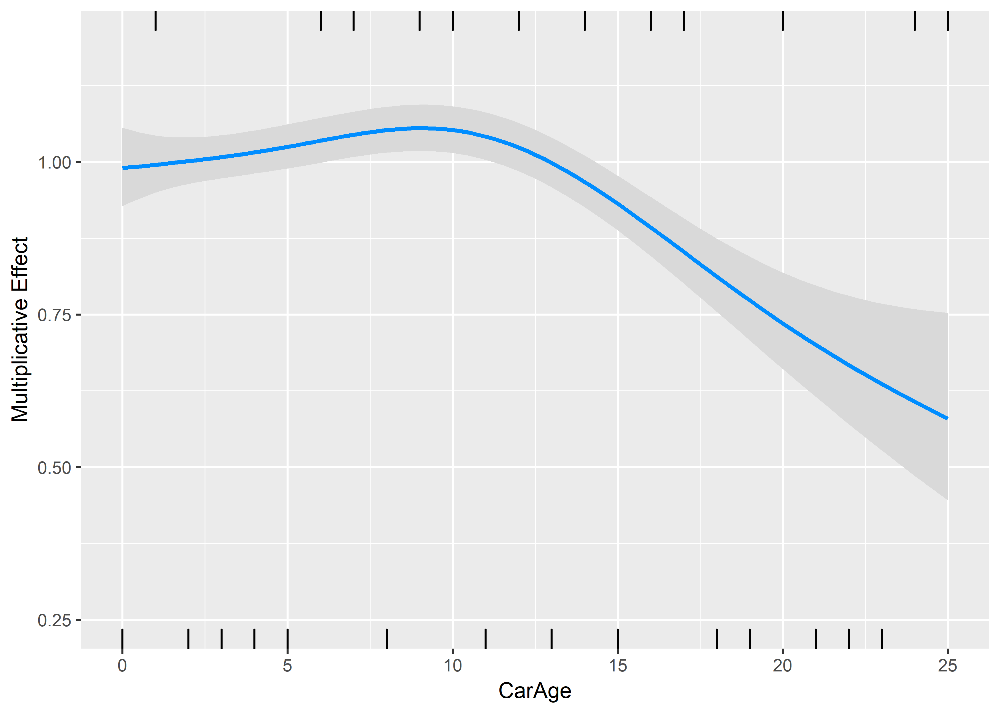

The new prediction of the claim frequency is now given by the old one times the correction due to CarAge.

``` r
autofit$fit2<-autofit$fit1*predict(fit2, newdata=autofit, type="response")
```

The total number of predicted claim remains unchanged:

``` r
c(sum(autofit$fit1), sum(autofit$fit2))
```

    ## [1] 8040 8040

-   Let us now consider the other continuous covariate: DriverAge

``` r
mm <- ddply(autofit, .(DriverAge), summarise, totalExposure = sum(Exposure), 
                totalClaimObs=sum(ClaimNb), totalClaimExp=sum(fit2))    
head(mm)
```

    ##   DriverAge totalExposure totalClaimObs totalClaimExp
    ## 1        18      78.37283            23      5.307971
    ## 2        19     314.15292            90     21.322317
    ## 3        20     492.48215           112     33.597201
    ## 4        21     637.27959           105     43.492350
    ## 5        22     794.63598           122     55.058065
    ## 6        23     923.72693           124     65.246611

``` r
fit3<-gam(totalClaimObs ~ s(DriverAge), 
              offset=log(totalClaimExp), 
              family=poisson(), 
              data=mm)
```

-   Let us now consider the other continuous covariate: DriverAge

``` r
require(visreg)
visreg(fit3, xvar="DriverAge", gg=TRUE, scale = "response") + ylim(c(0,5)) + ylab("Multiplicative Effect")+
  scale_x_continuous(name="Age of Driver", limits=c(18, 99), breaks = c(18, seq(20,95,5),99))
```

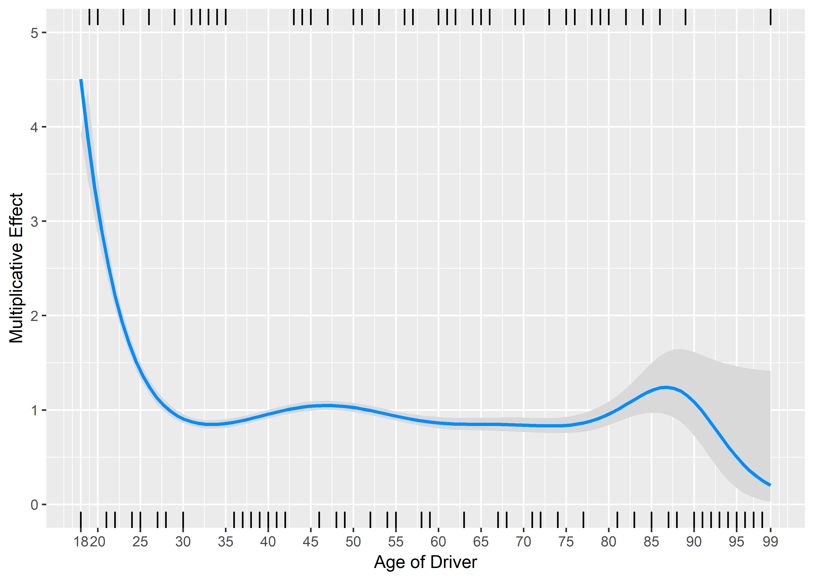

The new prediction of the claim frequency is now given by the old one times the correction due to DriverAge.

``` r
autofit$fit3<-autofit$fit2*predict(fit3, newdata=autofit, type="response")
```

The total expected number of claims remains unchanged.

``` r
c(sum(autofit$fit2),sum(autofit$fit3))
```

    ## [1] 8040 8040

Let us compute the log-likelihood

``` r
LL0=sum(dpois(x=autofit$ClaimNb, lambda = autofit$fit0, log=TRUE))
LLi=sum(dpois(x=autofit$ClaimNb, lambda = autofit$fit3, log=TRUE))
c(LL0, LLi)
```

    ## [1] -34021.71 -33587.21

Further iterations
------------------

Let us now iterate, and fit again the discrete variables, then CarAge, then DriverAge, and let us stop when the log-likelihood change is smaller than some small epsilon. When we fit the model, everything that has been fitted before and is unrelated to the current variable is put in the offset.

``` r
    epsilon=1e-8
    i=0
    fit_it_discr=list(fit1)
    fit_it_CarAge=list(fit2)
    fit_it_DriverAge=list(fit3)

    while (abs(LL0/LLi-1)>epsilon){
      i=i+1
      LL0=LLi
        #Discrete variables
      autofit$logoffset=    predict(fit_it_CarAge[[i]], newdata=autofit)+
                            predict(fit_it_DriverAge[[i]], newdata=autofit)+
                            log(autofit$Exposure)
      fit_it_discr[[i+1]]<-gam(ClaimNb~ Power_merged  * Region_merged +  Brand_merged + Gas+Region_merged* Brand_merged, 
                               autofit, family=poisson(), offset = logoffset)

      #CarAge
      autofit$logoffset=predict(fit_it_discr[[i+1]], newdata=autofit)+
                            predict(fit_it_DriverAge[[i]], newdata=autofit)+
                            log(autofit$Exposure)
      mm <- ddply(autofit, .(CarAge), summarise,  
                  totalClaimObs=sum(ClaimNb), totalClaimExp=sum(exp(logoffset)))    
      fit_it_CarAge[[i+1]]<-gam(totalClaimObs ~ s(CarAge), 
                               offset=log(totalClaimExp), family=poisson(), data=mm)
      
      #DriverAge
        autofit$logoffset=predict(fit_it_discr[[i+1]], newdata=autofit)+
                            predict(fit_it_CarAge[[i+1]], newdata=autofit)+
                            log(autofit$Exposure)
        mm <- ddply(autofit, .(DriverAge), summarise, totalClaimObs=sum(ClaimNb), 
                    totalClaimExp=sum(exp(logoffset)))  
        fit_it_DriverAge[[i+1]]<-gam(totalClaimObs ~ s(DriverAge), 
                                  offset=log(totalClaimExp), family=poisson(), data=mm)
      ## Compute the new estimates
      
      autofit$currentfit=   predict(fit_it_discr[[i+1]], newdata=autofit, type="response")*
                            predict(fit_it_CarAge[[i+1]], newdata=autofit, type="response")*
                            predict(fit_it_DriverAge[[i+1]], newdata=autofit, type="response")*
                            (autofit$Exposure)


      LLi=sum(dpois(x=autofit$ClaimNb, lambda = autofit$currentfit, log=TRUE))
      print(c(i, LL0, LLi))
    }
```

    ## [1]      1.00 -33587.21 -33584.91
    ## [1]      2.00 -33584.91 -33584.79
    ## [1]      3.00 -33584.79 -33584.78
    ## [1]      4.00 -33584.78 -33584.78
    ## [1]      5.00 -33584.78 -33584.78

Results
-------

Let us now see the betas at each iteration.

### Discrete variables

``` r
res_discr=matrix(NA, ncol=41, nrow=i+1)
colnames(res_discr)=names(fit_it_discr[[1]]$coefficients)
res_discr[1,]=fit_it_discr[[1]]$coefficients
res_discr[2,]=fit_it_discr[[2]]$coefficients
res_discr[3,]=fit_it_discr[[3]]$coefficients
res_discr[4,]=fit_it_discr[[4]]$coefficients
res_discr[5,]=fit_it_discr[[5]]$coefficients
res_discr[6,]=fit_it_discr[[6]]$coefficients
```

For instance, the 9 first variables:

``` r
require("gridExtra")
p1= lapply(2:10, function(i){
  ggplot() + geom_point(aes(y=res_discr[,i], x=1:6)) + xlab("Iteration") + ylab("beta") + ggtitle(names(fit_it_discr[[1]]$coefficients)[i]) + scale_x_continuous(breaks=1:6)
  })
do.call(grid.arrange, p1)
```

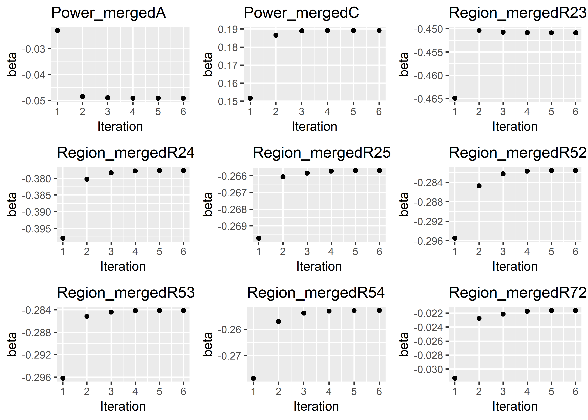

### CarAge

``` r
CarAge=matrix(NA, ncol=6, nrow=26)
CarAge[,1]=predict(fit_it_CarAge[[1]], 
                  data.frame(CarAge=seq(from=0, to=25, by=1)),  type="response")
CarAge[,2]=predict(fit_it_CarAge[[2]], 
                  data.frame(CarAge=seq(from=0, to=25, by=1)),  type="response")
CarAge[,3]=predict(fit_it_CarAge[[3]], 
                  data.frame(CarAge=seq(from=0, to=25, by=1)),  type="response")
CarAge[,4]=predict(fit_it_CarAge[[4]], 
                  data.frame(CarAge=seq(from=0, to=25, by=1)),  type="response")
CarAge[,5]=predict(fit_it_CarAge[[5]], 
                  data.frame(CarAge=seq(from=0, to=25, by=1)),  type="response")
CarAge[,6]=predict(fit_it_CarAge[[6]], 
                  data.frame(CarAge=seq(from=0, to=25, by=1)),  type="response")                  

x = as.data.frame(CarAge)
names(x) = sapply(1:6, function(i){ paste("it",i)})
x = stack(as.data.frame(x))
names(x)[2] ="Iteration"

ggplot(x) + geom_line(aes(x = rep(0:25, 6),y=values, color=Iteration)) + xlab("Age of the Car") +ylab("Multiplicative Effect")
```

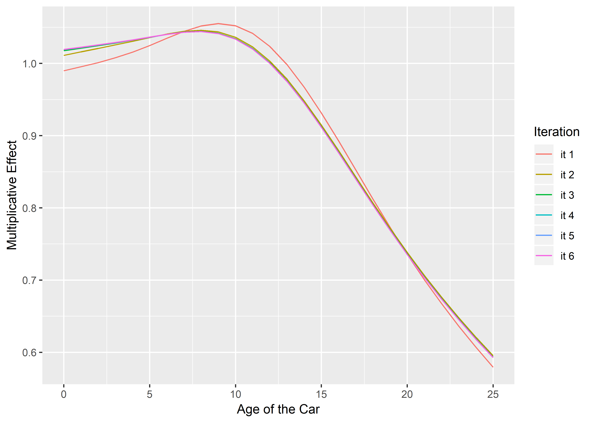

### DriverAge

``` r
DriverAge=matrix(NA, ncol=6, nrow=82)
DriverAge[,1]=predict(fit_it_DriverAge[[1]], 
                  data.frame(DriverAge=seq(from=18, to=99, by=1)),  type="response")
DriverAge[,2]=predict(fit_it_DriverAge[[2]], 
                  data.frame(DriverAge=seq(from=18, to=99, by=1)),  type="response")
DriverAge[,3]=predict(fit_it_DriverAge[[3]], 
                  data.frame(DriverAge=seq(from=18, to=99, by=1)),  type="response")
DriverAge[,4]=predict(fit_it_DriverAge[[4]], 
                  data.frame(DriverAge=seq(from=18, to=99, by=1)),  type="response")
DriverAge[,5]=predict(fit_it_DriverAge[[5]], 
                  data.frame(DriverAge=seq(from=18, to=99, by=1)),  type="response")
DriverAge[,6]=predict(fit_it_DriverAge[[6]], 
                  data.frame(DriverAge=seq(from=18, to=99, by=1)),  type="response")                  

x = as.data.frame(DriverAge)
names(x) = sapply(1:6, function(i){ paste("it",i)})
x = stack(as.data.frame(x))
names(x)[2] ="Iteration"

ggplot(x) + geom_line(aes(x = rep(18:99, 6),y=values, color=Iteration)) + xlab("Age of the Driver") +ylab("Multiplicative Effect")
```

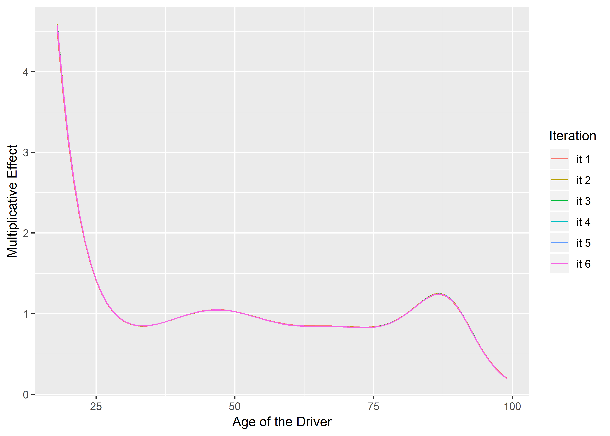

Comparison with GAM
-------------------

Let us now compare with the GAM directly

``` r
m0_gam = gam(ClaimNb ~ offset(log(Exposure)) + Power_merged  * Region_merged +  Brand_merged + Gas+Region_merged* Brand_merged+
               s(DriverAge)+s(CarAge),
         data = autofit,
         family=poisson(link = log))

ggplot() + geom_point(aes(x=autofit$currentfit, y=m0_gam$fitted.values))+xlab("Manual backfitting") + ylab("GAM from mgcv")
```

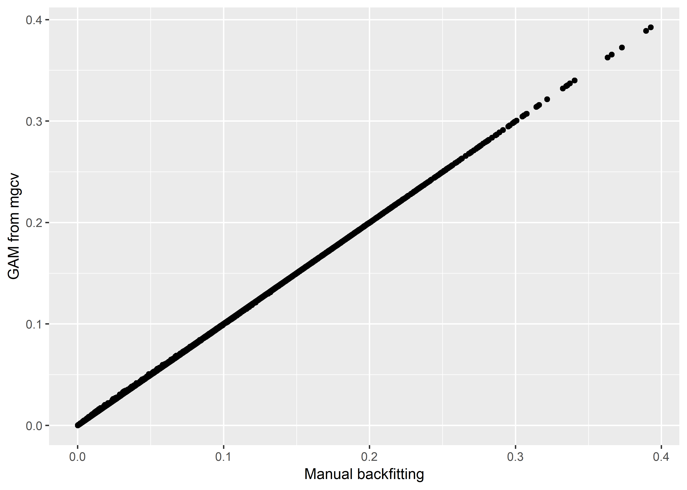

Use of the mgcv package
=======================

First, let us retrieve the training and testing set we used before (in the GLM session).

``` r
set.seed(21)
in_training = createDataPartition(dataset$ClaimNb, times = 1, p = 0.8, list=FALSE)
training_set = dataset[in_training,]
testing_set  = dataset[-in_training,]
```

The gam function works very similarly to the glm function. The continuous covariate have to be specified using for instance the function s(.). Interaction with respect to a discrete variable can be done by specifying the variable in the 'by' argument (see below).

First try with gam
------------------

Let us start with the model we created above.

``` r
# Same as above..
# ptn_0 = Sys.time()
# m0_gam = gam(ClaimNb ~ offset(log(Exposure)) + Power_merged  * Region_merged +  Brand_merged + Gas+Region_merged* Brand_merged + s(DriverAge)+s(CarAge),
#          data = training_set,
#          family=poisson(link = log))
# print(Sys.time()-ptn_0)
```

Comparison with bam
-------------------

We see that the computational time is already long, especially if we wanted to use cross-validation. There is also the function *bam*, which is optimized for very large datasets and allows parallel computing.

``` r
require(parallel)
cl = makeCluster(detectCores()-1) # Number of cores to use, for parallel computing.
ptn_0 = Sys.time()
m0_bam = bam(ClaimNb ~ offset(log(Exposure)) + Power_merged  * Region_merged +  Brand_merged + Gas+Region_merged* Brand_merged+s(DriverAge)+s(CarAge),
         data = training_set,
         family=poisson(link = log),
         cluster = cl)
stopCluster(cl)
print(Sys.time()-ptn_0)
```

    ## Time difference of 15.19073 secs

We can see the fitted function using *plot*,

``` r
par(mfrow=c(1,2))
plot(m0_bam, trans=exp, scale=0, shade=TRUE)
```

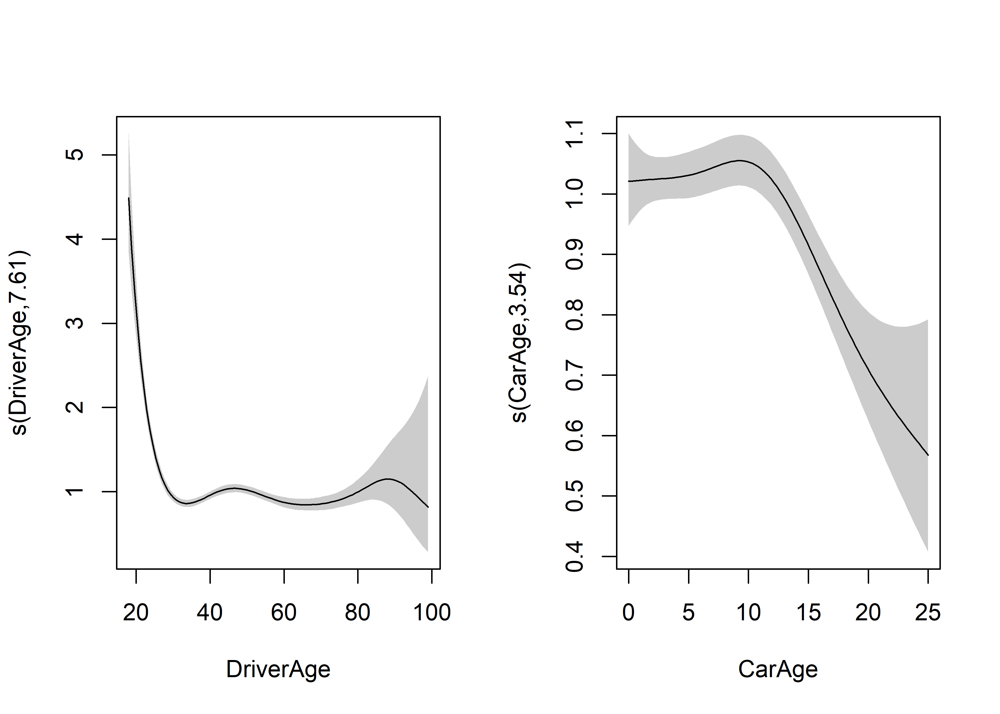

Bivariate function
------------------

We can also include interactions between the two continuous variables. We simply estimate a bivariate function.

``` r
cl = makeCluster(detectCores()-1) # Number of cores to use
m1_bam = bam(ClaimNb ~ offset(log(Exposure)) + Power_merged  * Region_merged +  Brand_merged + Gas+Region_merged* Brand_merged+ s(DriverAge) + s(CarAge) + s(DriverAge, CarAge),
         data = training_set,
         family=poisson(link = log),
         cluster = cl)
stopCluster(cl)
summary(m1_bam)
```

    ## 
    ## Family: poisson 
    ## Link function: log 
    ## 
    ## Formula:
    ## ClaimNb ~ offset(log(Exposure)) + Power_merged * Region_merged + 
    ##     Brand_merged + Gas + Region_merged * Brand_merged + s(DriverAge) + 
    ##     s(CarAge) + s(DriverAge, CarAge)
    ## 
    ## Parametric coefficients:
    ##                                 Estimate Std. Error z value Pr(>|z|)    
    ## (Intercept)                    -2.364911   0.045491 -51.986  < 2e-16 ***
    ## Power_mergedA                  -0.018991   0.070753  -0.268  0.78838    
    ## Power_mergedC                   0.174838   0.071326   2.451  0.01424 *  
    ## Region_mergedR23               -0.455445   0.182747  -2.492  0.01269 *  
    ## Region_mergedR24               -0.388894   0.051080  -7.613 2.67e-14 ***
    ## Region_mergedR25               -0.228129   0.113230  -2.015  0.04393 *  
    ## Region_mergedR52               -0.287544   0.072918  -3.943 8.03e-05 ***
    ## Region_mergedR53               -0.292157   0.067188  -4.348 1.37e-05 ***
    ## Region_mergedR54               -0.303824   0.094621  -3.211  0.00132 ** 
    ## Region_mergedR72               -0.073237   0.088453  -0.828  0.40768    
    ## Brand_mergedA                   0.065915   0.063741   1.034  0.30108    
    ## Brand_mergedB                  -0.267388   0.065477  -4.084 4.43e-05 ***
    ## GasRegular                     -0.107876   0.026512  -4.069 4.72e-05 ***
    ## Power_mergedA:Region_mergedR23  0.149898   0.330970   0.453  0.65062    
    ## Power_mergedC:Region_mergedR23  0.084463   0.359926   0.235  0.81447    
    ## Power_mergedA:Region_mergedR24 -0.148958   0.092228  -1.615  0.10629    
    ## Power_mergedC:Region_mergedR24 -0.126556   0.096449  -1.312  0.18947    
    ## Power_mergedA:Region_mergedR25  0.215174   0.203538   1.057  0.29043    
    ## Power_mergedC:Region_mergedR25 -0.172551   0.248037  -0.696  0.48664    
    ## Power_mergedA:Region_mergedR52 -0.132798   0.138436  -0.959  0.33742    
    ## Power_mergedC:Region_mergedR52 -0.005224   0.138936  -0.038  0.97001    
    ## Power_mergedA:Region_mergedR53 -0.274086   0.136839  -2.003  0.04518 *  
    ## Power_mergedC:Region_mergedR53  0.214867   0.128566   1.671  0.09467 .  
    ## Power_mergedA:Region_mergedR54 -0.152925   0.183663  -0.833  0.40505    
    ## Power_mergedC:Region_mergedR54  0.157281   0.178904   0.879  0.37933    
    ## Power_mergedA:Region_mergedR72 -0.198482   0.154631  -1.284  0.19929    
    ## Power_mergedC:Region_mergedR72 -0.454243   0.183563  -2.475  0.01334 *  
    ## Region_mergedR23:Brand_mergedA  0.145421   0.263924   0.551  0.58164    
    ## Region_mergedR24:Brand_mergedA  0.138892   0.076675   1.811  0.07007 .  
    ## Region_mergedR25:Brand_mergedA -0.156403   0.180084  -0.868  0.38512    
    ## Region_mergedR52:Brand_mergedA  0.148061   0.108189   1.369  0.17114    
    ## Region_mergedR53:Brand_mergedA -0.062306   0.101283  -0.615  0.53845    
    ## Region_mergedR54:Brand_mergedA -0.064755   0.141668  -0.457  0.64760    
    ## Region_mergedR72:Brand_mergedA -0.090724   0.130026  -0.698  0.48534    
    ## Region_mergedR23:Brand_mergedB -0.076967   0.349267  -0.220  0.82559    
    ## Region_mergedR24:Brand_mergedB  0.365937   0.127847   2.862  0.00421 ** 
    ## Region_mergedR25:Brand_mergedB -0.158194   0.269787  -0.586  0.55763    
    ## Region_mergedR52:Brand_mergedB  0.120934   0.157045   0.770  0.44126    
    ## Region_mergedR53:Brand_mergedB  0.050966   0.188574   0.270  0.78695    
    ## Region_mergedR54:Brand_mergedB  0.055987   0.217903   0.257  0.79723    
    ## Region_mergedR72:Brand_mergedB -0.115950   0.150826  -0.769  0.44203    
    ## ---
    ## Signif. codes:  0 '***' 0.001 '**' 0.01 '*' 0.05 '.' 0.1 ' ' 1
    ## 
    ## Approximate significance of smooth terms:
    ##                       edf Ref.df Chi.sq  p-value    
    ## s(DriverAge)        7.294  7.933 112.50  < 2e-16 ***
    ## s(CarAge)           3.370  4.215  21.50 0.000359 ***
    ## s(DriverAge,CarAge) 4.731 27.000  10.16 0.011841 *  
    ## ---
    ## Signif. codes:  0 '***' 0.001 '**' 0.01 '*' 0.05 '.' 0.1 ' ' 1
    ## 
    ## R-sq.(adj) =  0.00743   Deviance explained = 2.99%
    ## fREML = 2.9728e+05  Scale est. = 1         n = 164346

The likelihood ratio test still works like in the GLM framework.

``` r
anova(m0_bam, m1_bam, test="Chisq")
```

    ## Analysis of Deviance Table
    ## 
    ## Model 1: ClaimNb ~ offset(log(Exposure)) + Power_merged * Region_merged + 
    ##     Brand_merged + Gas + Region_merged * Brand_merged + s(DriverAge) + 
    ##     s(CarAge)
    ## Model 2: ClaimNb ~ offset(log(Exposure)) + Power_merged * Region_merged + 
    ##     Brand_merged + Gas + Region_merged * Brand_merged + s(DriverAge) + 
    ##     s(CarAge) + s(DriverAge, CarAge)
    ##   Resid. Df Resid. Dev    Df Deviance Pr(>Chi)  
    ## 1    164292      41347                          
    ## 2    164284      41333 7.517   14.207  0.06141 .
    ## ---
    ## Signif. codes:  0 '***' 0.001 '**' 0.01 '*' 0.05 '.' 0.1 ' ' 1

Interaction between a continuous and a discrete variable
--------------------------------------------------------

To include an interaction with a discrete variable, we can use the *by* argument. For example, between CarAge and Gas:

``` r
cl = makeCluster(detectCores()-1) # Number of cores to use
m2_bam = bam(ClaimNb ~ offset(log(Exposure)) + Power_merged  * Region_merged +  Brand_merged + Gas+Region_merged* Brand_merged+s(DriverAge) + s(CarAge, by=Gas),
         data = training_set,
         family=poisson(link = log),
         cluster = cl)
stopCluster(cl)
summary(m2_bam)
```

    ## 
    ## Family: poisson 
    ## Link function: log 
    ## 
    ## Formula:
    ## ClaimNb ~ offset(log(Exposure)) + Power_merged * Region_merged + 
    ##     Brand_merged + Gas + Region_merged * Brand_merged + s(DriverAge) + 
    ##     s(CarAge, by = Gas)
    ## 
    ## Parametric coefficients:
    ##                                Estimate Std. Error z value Pr(>|z|)    
    ## (Intercept)                    -2.35601    0.04543 -51.860  < 2e-16 ***
    ## Power_mergedA                  -0.02123    0.07075  -0.300  0.76414    
    ## Power_mergedC                   0.17331    0.07131   2.430  0.01508 *  
    ## Region_mergedR23               -0.45350    0.18271  -2.482  0.01306 *  
    ## Region_mergedR24               -0.38727    0.05109  -7.580 3.44e-14 ***
    ## Region_mergedR25               -0.22544    0.11318  -1.992  0.04639 *  
    ## Region_mergedR52               -0.28617    0.07293  -3.924 8.71e-05 ***
    ## Region_mergedR53               -0.29032    0.06719  -4.321 1.55e-05 ***
    ## Region_mergedR54               -0.30499    0.09464  -3.223  0.00127 ** 
    ## Region_mergedR72               -0.07320    0.08846  -0.827  0.40798    
    ## Brand_mergedA                   0.06355    0.06373   0.997  0.31868    
    ## Brand_mergedB                  -0.27419    0.06530  -4.199 2.68e-05 ***
    ## GasRegular                     -0.11632    0.02687  -4.330 1.49e-05 ***
    ## Power_mergedA:Region_mergedR23  0.15396    0.33100   0.465  0.64182    
    ## Power_mergedC:Region_mergedR23  0.08058    0.35986   0.224  0.82282    
    ## Power_mergedA:Region_mergedR24 -0.14676    0.09235  -1.589  0.11201    
    ## Power_mergedC:Region_mergedR24 -0.13316    0.09644  -1.381  0.16732    
    ## Power_mergedA:Region_mergedR25  0.21967    0.20354   1.079  0.28046    
    ## Power_mergedC:Region_mergedR25 -0.17348    0.24805  -0.699  0.48432    
    ## Power_mergedA:Region_mergedR52 -0.12897    0.13847  -0.931  0.35163    
    ## Power_mergedC:Region_mergedR52 -0.01119    0.13889  -0.081  0.93581    
    ## Power_mergedA:Region_mergedR53 -0.27581    0.13688  -2.015  0.04390 *  
    ## Power_mergedC:Region_mergedR53  0.21162    0.12856   1.646  0.09974 .  
    ## Power_mergedA:Region_mergedR54 -0.14771    0.18372  -0.804  0.42140    
    ## Power_mergedC:Region_mergedR54  0.14827    0.17883   0.829  0.40702    
    ## Power_mergedA:Region_mergedR72 -0.19461    0.15464  -1.259  0.20821    
    ## Power_mergedC:Region_mergedR72 -0.45794    0.18352  -2.495  0.01258 *  
    ## Region_mergedR23:Brand_mergedA  0.14751    0.26394   0.559  0.57624    
    ## Region_mergedR24:Brand_mergedA  0.13997    0.07667   1.826  0.06791 .  
    ## Region_mergedR25:Brand_mergedA -0.15782    0.18010  -0.876  0.38088    
    ## Region_mergedR52:Brand_mergedA  0.14911    0.10818   1.378  0.16809    
    ## Region_mergedR53:Brand_mergedA -0.06381    0.10128  -0.630  0.52869    
    ## Region_mergedR54:Brand_mergedA -0.06087    0.14162  -0.430  0.66734    
    ## Region_mergedR72:Brand_mergedA -0.09216    0.13003  -0.709  0.47849    
    ## Region_mergedR23:Brand_mergedB -0.07544    0.34924  -0.216  0.82897    
    ## Region_mergedR24:Brand_mergedB  0.37239    0.12783   2.913  0.00358 ** 
    ## Region_mergedR25:Brand_mergedB -0.14917    0.26971  -0.553  0.58020    
    ## Region_mergedR52:Brand_mergedB  0.12888    0.15701   0.821  0.41174    
    ## Region_mergedR53:Brand_mergedB  0.05643    0.18854   0.299  0.76472    
    ## Region_mergedR54:Brand_mergedB  0.06831    0.21777   0.314  0.75377    
    ## Region_mergedR72:Brand_mergedB -0.10734    0.15080  -0.712  0.47658    
    ## ---
    ## Signif. codes:  0 '***' 0.001 '**' 0.01 '*' 0.05 '.' 0.1 ' ' 1
    ## 
    ## Approximate significance of smooth terms:
    ##                        edf Ref.df  Chi.sq  p-value    
    ## s(DriverAge)         7.610  8.313 539.082  < 2e-16 ***
    ## s(CarAge):GasDiesel  1.740  2.198   3.582    0.219    
    ## s(CarAge):GasRegular 3.525  4.408  36.940 4.44e-07 ***
    ## ---
    ## Signif. codes:  0 '***' 0.001 '**' 0.01 '*' 0.05 '.' 0.1 ' ' 1
    ## 
    ## R-sq.(adj) =  0.00742   Deviance explained = 2.96%
    ## fREML = 2.9757e+05  Scale est. = 1         n = 164346

When we now plot the functions, we obtain **two** functions for *CarAge*.

``` r
par(mfrow=c(1,2))
plot(m2_bam, shade=TRUE, trans=exp, scale=0, select=2)
plot(m2_bam, shade=TRUE, trans=exp, scale=0, select=3)
```

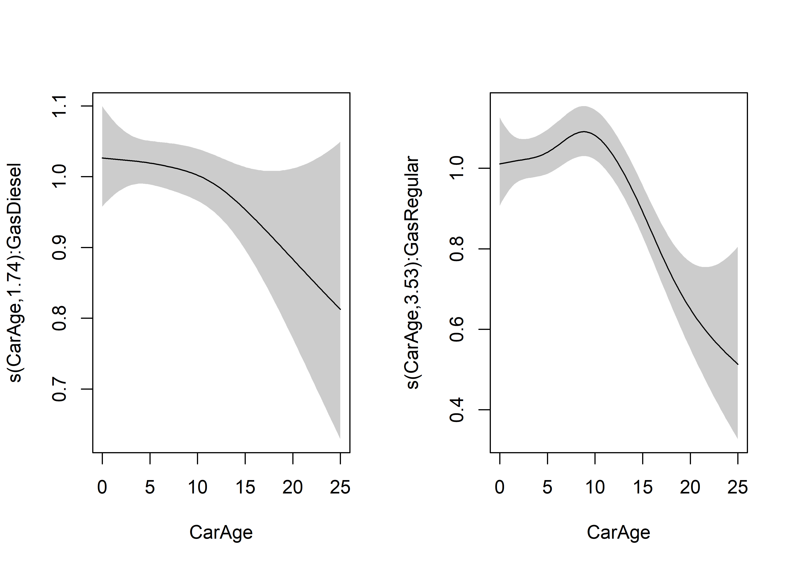

We can test if the interaction improves our model.

``` r
anova(m0_bam, m2_bam, test="Chisq")
```

    ## Analysis of Deviance Table
    ## 
    ## Model 1: ClaimNb ~ offset(log(Exposure)) + Power_merged * Region_merged + 
    ##     Brand_merged + Gas + Region_merged * Brand_merged + s(DriverAge) + 
    ##     s(CarAge)
    ## Model 2: ClaimNb ~ offset(log(Exposure)) + Power_merged * Region_merged + 
    ##     Brand_merged + Gas + Region_merged * Brand_merged + s(DriverAge) + 
    ##     s(CarAge, by = Gas)
    ##   Resid. Df Resid. Dev     Df Deviance Pr(>Chi)
    ## 1    164292      41347                         
    ## 2    164289      41343 3.1834   4.6809   0.2182

``` r
cl = makeCluster(detectCores()-1) # Number of cores to use
m3_bam = bam(ClaimNb ~ offset(log(Exposure)) + Power_merged  * Region_merged +  Brand_merged + Gas+Region_merged* Brand_merged+s(DriverAge, by=Gas)+ s(CarAge),
         data = training_set,
         family=poisson(link = log),
         cluster = cl)
stopCluster(cl)
anova(m0_bam, m3_bam, test="Chisq")
```

    ## Analysis of Deviance Table
    ## 
    ## Model 1: ClaimNb ~ offset(log(Exposure)) + Power_merged * Region_merged + 
    ##     Brand_merged + Gas + Region_merged * Brand_merged + s(DriverAge) + 
    ##     s(CarAge)
    ## Model 2: ClaimNb ~ offset(log(Exposure)) + Power_merged * Region_merged + 
    ##     Brand_merged + Gas + Region_merged * Brand_merged + s(DriverAge, 
    ##     by = Gas) + s(CarAge)
    ##   Resid. Df Resid. Dev     Df Deviance Pr(>Chi)  
    ## 1    164292      41347                           
    ## 2    164284      41334 7.5821   13.224  0.08737 .
    ## ---
    ## Signif. codes:  0 '***' 0.001 '**' 0.01 '*' 0.05 '.' 0.1 ' ' 1

``` r
par(mfrow=c(1,2))
plot(m3_bam, shade=TRUE, trans=exp, scale=-1, select=1)
plot(m3_bam, shade=TRUE, trans=exp, scale=-1, select=2)
```

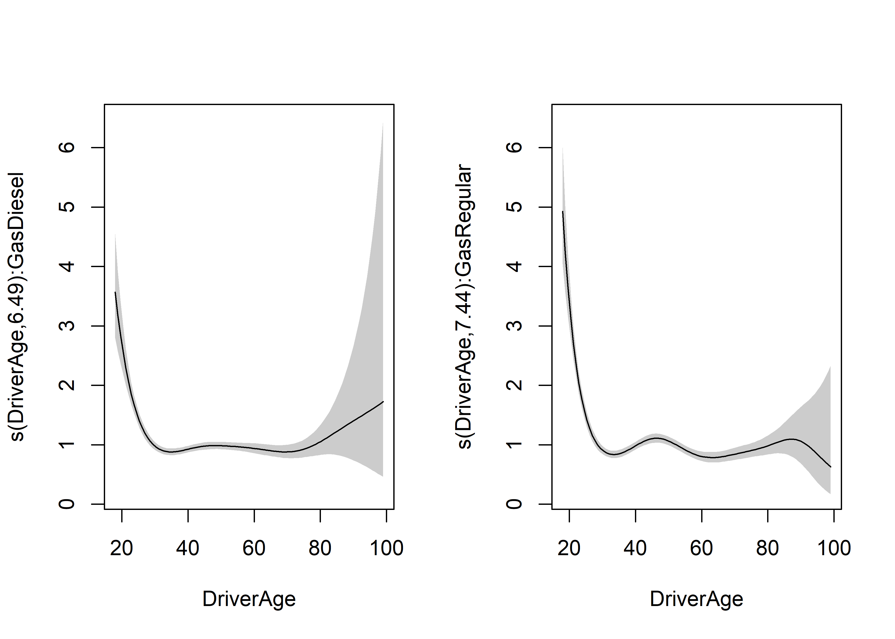

Cross-validation
----------------

We can also use cross-validation to check whether or not to include this variable. First we need to create the folds, let's say 5.

``` r
require(caret)
set.seed(41)
folds = createFolds(training_set$ClaimNb, k=5)
res0= lapply(folds, function(X){
  cl = makeCluster(detectCores()-1) # Number of cores to use
  m3_bam = bam(ClaimNb ~ offset(log(Exposure)) + Power_merged  * Region_merged +  Brand_merged + Gas+Region_merged* Brand_merged+ s(DriverAge)+ s(CarAge),
         data = training_set[-X,],
         family=poisson(link = log),
         cluster = cl)
  stopCluster(cl)
  pred = predict(m3_bam, training_set[X,], type="response")
  sum(dpois(x=training_set[X,]$ClaimNb, lambda=pred, log=TRUE))
  #sum(-pred + training_set[X,]$ClaimNb*log(pred)-log(factorial(training_set[X,]$ClaimNb)))
})

res3= lapply(folds, function(X){
  cl = makeCluster(detectCores()-1) # Number of cores to use
  m3_bam = bam(ClaimNb ~ offset(log(Exposure)) + Power_merged  * Region_merged + Brand_merged + Gas + Region_merged * Brand_merged+s(DriverAge, by=Gas)+ s(CarAge),
         data = training_set[-X,],
         family=poisson(link = log),
         cluster = cl)
  stopCluster(cl)
  pred = predict(m3_bam, training_set[X,], type="response")
  sum(dpois(x=training_set[X,]$ClaimNb, lambda=pred, log=TRUE))
  #sum(-pred + training_set[X,]$ClaimNb*log(pred)-log(factorial(training_set[X,]$ClaimNb)))
})

cbind(unlist(res0), unlist(res3))
```

    ##            [,1]      [,2]
    ## Fold1 -5442.928 -5440.618
    ## Fold2 -5209.166 -5208.223
    ## Fold3 -5331.296 -5331.131
    ## Fold4 -5536.849 -5538.923
    ## Fold5 -5444.838 -5446.366

``` r
apply(cbind(unlist(res0), unlist(res3)), 2, mean)
```

    ## [1] -5393.015 -5393.052

There is no improvement with the interaction.

``` r
res4= lapply(folds, function(X){
  cl = makeCluster(detectCores()-1) # Number of cores to use
  m3_bam = bam(ClaimNb ~ offset(log(Exposure)) + Power_merged  * Region_merged + Brand_merged + Gas + Region_merged * Brand_merged+
               s(DriverAge)+ s(CarAge, by=Power_merged),
         data = training_set[-X,],
         family=poisson(link = log),
         cluster = cl)
  stopCluster(cl)
  pred = predict(m3_bam, training_set[X,], type="response")
  sum(dpois(x=training_set[X,]$ClaimNb, lambda=pred, log=TRUE))
  #sum(-pred + training_set[X,]$ClaimNb*log(pred)-log(factorial(training_set[X,]$ClaimNb)))
})
apply(cbind(unlist(res0), unlist(res3), unlist(res4)), 2, mean)
```

    ## [1] -5393.015 -5393.052 -5393.236

We conclude here, we did not find any further interactions. We can compute the deviance on the validation set

``` r
2*(sum(dpois(x = testing_set$ClaimNb, lambda = testing_set$ClaimNb,log=TRUE))-
  sum(dpois(x = testing_set$ClaimNb, lambda = predict(m0_bam,testing_set,offset=testing_set$Exposure, type="response"),
            log=TRUE)))
```

    ## [1] 10294.36

Comparison with best GLM model
------------------------------

Let us compare the predictions between the GLM and the GAM.

``` r
m.glm.5.6 = glm(ClaimNb ~ offset(log(Exposure)) + Power_merged  * Region_merged +  Brand_merged + Gas+Region_merged* Brand_merged,
         data = training_set,
         family=poisson(link = log))

testing_set$GLM_pred = predict(m.glm.5.6, testing_set, type="response")
testing_set$GAM_pred = predict(m0_bam, testing_set, type="response")
head(testing_set[,c("GLM_pred", "GAM_pred")], n=25)
```

    ##        GLM_pred    GAM_pred
    ## 1   0.005348927 0.005700679
    ## 9   0.071511984 0.137176127
    ## 14  0.012342084 0.010749148
    ## 18  0.004547084 0.003906955
    ## 53  0.037067517 0.033490659
    ## 96  0.046141369 0.048881119
    ## 108 0.003721078 0.003760615
    ## 120 0.046225588 0.041703124
    ## 180 0.011983857 0.012313310
    ## 190 0.030530418 0.029131250
    ## 191 0.012991667 0.013393149
    ## 210 0.031977994 0.027467359
    ## 215 0.043575800 0.040456502
    ## 233 0.004637820 0.003985587
    ## 236 0.006541326 0.006855201
    ## 239 0.002052588 0.001749064
    ## 244 0.033204296 0.033771068
    ## 245 0.035323163 0.031042553
    ## 252 0.006495556 0.006000336
    ## 257 0.045531437 0.051306106
    ## 273 0.001744354 0.001560150
    ## 280 0.022085834 0.019951478
    ## 282 0.017861175 0.015965232
    ## 291 0.028445314 0.030415298
    ## 294 0.005953725 0.006342110

If we plot the prediction of GLM vs GAM

``` r
ggplot(testing_set) + geom_point(aes(x=testing_set$GLM_pred, y=testing_set$GAM_pred))+ylab("GAM")+xlab("GLM")+geom_abline(slope=1, intercept=0, color="red")
```

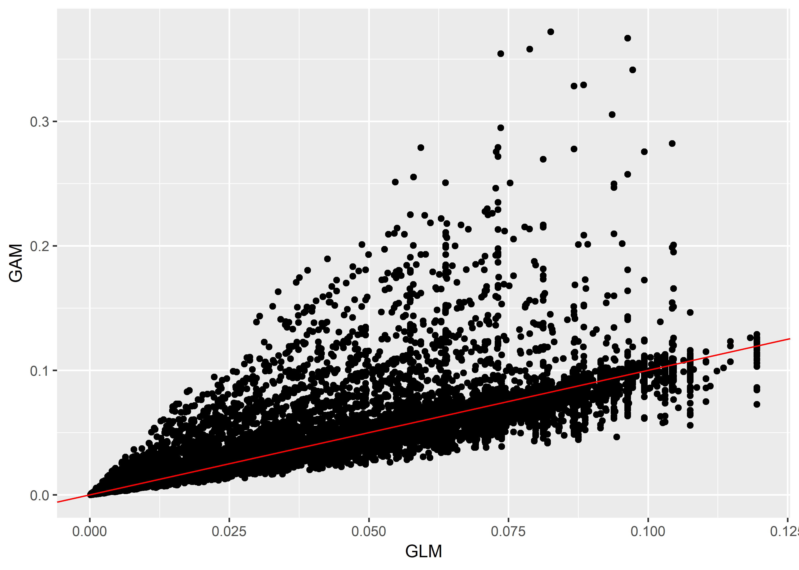

However, the total amount of expected claims are still close.

``` r
sum(testing_set$GLM_pred) #GLM
```

    ## [1] 1606

``` r
sum(testing_set$GAM_pred) #GAM
```

    ## [1] 1608.861

'Manual' backfitting
====================

In some cases, calling the *gam* function can be slow, due to the size of the dataset. If the continuous variable has actually only a few values (e.g. ZIP, Age of Driver), it is possible to use some kind of manual backfitting to speed up the computation.

Let us consider this model below:

``` r
manual_back_0 = gam(ClaimNb ~ offset(log(Exposure)) + Power_merged  * Region_merged +  Brand_merged + Gas+Region_merged* Brand_merged,
         data = training_set,
         family=poisson(link = log))
```

We wish to add the continuous covariate DriverAge For each value of DriverAge, we can compute the observed number of claims and the expected number of claims.

``` r
require(plyr)
manual = training_set
manual$pred = predict(manual_back_0, manual, type="response")
mm = ddply(manual, .(DriverAge), summarise,  
                  totalClaimObs=sum(ClaimNb), totalClaimExp=sum(pred))
head(mm)
```

    ##   DriverAge totalClaimObs totalClaimExp
    ## 1        18            19      3.936964
    ## 2        19            74     17.074688
    ## 3        20            89     26.779985
    ## 4        21            89     34.971329
    ## 5        22            92     44.488845
    ## 6        23            90     50.426543

``` r
dim(mm)
```

    ## [1] 82  3

``` r
ptn_0 = Sys.time()
manual_back_1 = gam(ClaimNb ~ offset(log(pred)) + s(DriverAge),
         data = manual,
         family=poisson(link = log))
ptn_1 = Sys.time() - ptn_0
plot(manual_back_1, shade=TRUE, trans=exp, scale=0)
```

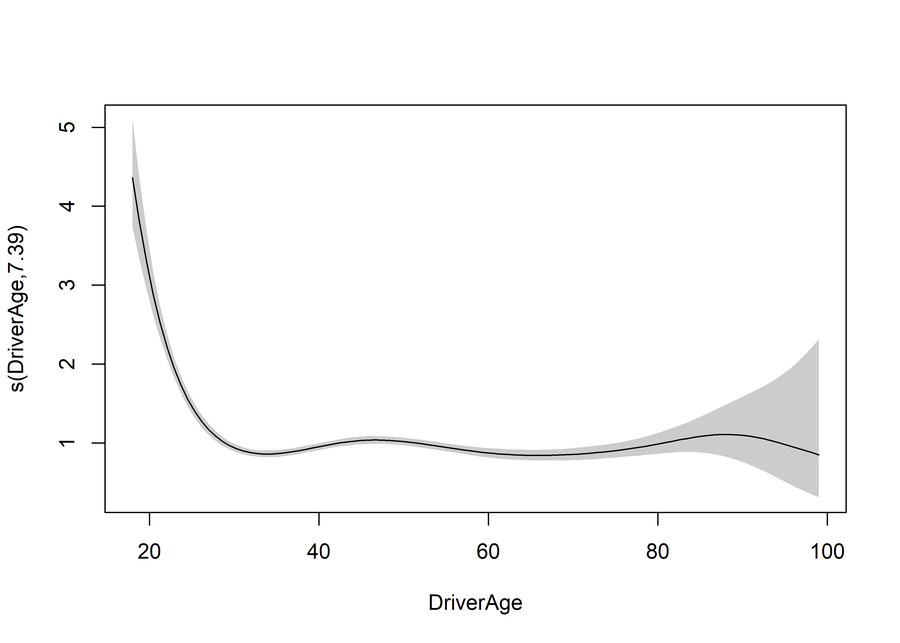

We can compare to the regular computational time.

``` r
ptn_2 = Sys.time()
manual_back_2 = bam(ClaimNb ~ offset(log(Exposure)) + Power_merged  * Region_merged +  Brand_merged + Gas+Region_merged* Brand_merged + s(DriverAge),
         data = training_set,
         family=poisson(link = log))
ptn_3 = Sys.time() - ptn_2

c(ptn_1, ptn_3)
```

    ## Time differences in secs
    ## [1]  7.560319 11.819052
