Generalized Additive Models
================

-   [Loading the data and the
    packages](#loading-the-data-and-the-packages)
-   [Outline of this session.](#outline-of-this-session)
-   [Illustration of the backfitting
    algorithm](#illustration-of-the-backfitting-algorithm)
    -   [First iteration](#first-iteration)
    -   [Further iterations](#further-iterations)
    -   [Results](#results)
        -   [Discrete variables](#discrete-variables)
        -   [CarAge](#carage)
        -   [DriverAge](#driverage)
    -   [Comparison with GAM](#comparison-with-gam)
-   [Use of the mgcv package](#use-of-the-mgcv-package)
    -   [First try with gam](#first-try-with-gam)
    -   [Comparison with bam](#comparison-with-bam)
    -   [Bivariate function](#bivariate-function)
    -   [Interaction between a continuous and a discrete
        variable](#interaction-between-a-continuous-and-a-discrete-variable)
    -   [Cross-validation](#cross-validation)
    -   [Comparison with best GLM
        model](#comparison-with-best-glm-model)

# Loading the data and the packages

First, the packages

``` r
require("CASdatasets") #Not needed if use of dataset.RData
require("mgcv")
require("caret")
require("plyr")
require("ggplot2")
require("gridExtra")
if (!require("parallel")) install.packages("parallel")
require("parallel")
```

then, the data

``` r
# data("freMTPLfreq")
# freMTPLfreq = subset(freMTPLfreq, Exposure<=1 & Exposure >= 0 & CarAge<=25)
# 
# set.seed(85)
# folds = createDataPartition(freMTPLfreq$ClaimNb, 0.5)
# dataset = freMTPLfreq[folds[[1]], ]

dataset = readRDS("../dataset.RDS")
```

Checking that the data is loaded.

``` r
str(dataset)
```

    ## 'data.frame':    410864 obs. of  10 variables:
    ##  $ PolicyID : Factor w/ 413169 levels "1","2","3","4",..: 1 2 3 4 5 6 7 8 9 10 ...
    ##  $ ClaimNb  : int  0 0 0 0 0 0 0 0 0 0 ...
    ##  $ Exposure : num  0.09 0.84 0.52 0.45 0.15 0.75 0.81 0.05 0.76 0.34 ...
    ##  $ Power    : Factor w/ 12 levels "d","e","f","g",..: 4 4 3 3 4 4 1 1 1 6 ...
    ##  $ CarAge   : int  0 0 2 2 0 0 1 0 9 0 ...
    ##  $ DriverAge: int  46 46 38 38 41 41 27 27 23 44 ...
    ##  $ Brand    : Factor w/ 7 levels "Fiat","Japanese (except Nissan) or Korean",..: 2 2 2 2 2 2 2 2 1 2 ...
    ##  $ Gas      : Factor w/ 2 levels "Diesel","Regular": 1 1 2 2 1 1 2 2 2 2 ...
    ##  $ Region   : Factor w/ 10 levels "Aquitaine","Basse-Normandie",..: 1 1 8 8 9 9 1 1 8 6 ...
    ##  $ Density  : int  76 76 3003 3003 60 60 695 695 7887 27000 ...

Restore data from GLM session (the variables with the merged levels).

``` r
# Variable Power
dataset$Power_merged = dataset$Power
levels(dataset$Power_merged) = list(A = "d", B = c("e", "f", "g", "h"), C = c("i",
    "j", "k", "l", "m", "n", "o"))
dataset$Power_merged = relevel(dataset$Power_merged, ref = "B")
# Variable Region
dataset$Region_merged = dataset$Region
levels(dataset$Region_merged)[c(1, 5, 10)] = "R11-31-74"

# Variable Brand
dataset$Brand_merged = dataset$Brand
levels(dataset$Brand_merged) <- list(A = c("Fiat", "Mercedes, Chrysler or BMW", "Opel, General Motors or Ford",
    "other", "Volkswagen, Audi, Skoda or Seat"), B = "Japanese (except Nissan) or Korean",
    C = "Renault, Nissan or Citroen")
dataset$Brand_merged = relevel(dataset$Brand_merged, ref = "C")
```

# Outline of this session.

-   Illustration of the backfitting algorithm
-   Use of mgcv package
-   When using ‘manual backfitting’ can be useful

# Illustration of the backfitting algorithm

## First iteration

-   First we start with a Poisson regression with only an intercept.

``` r
autofit=dataset #Copy the data

#Model with only an intercept
require(mgcv) # Load package if not loaded yet.
fit0<-gam(ClaimNb~1, data=autofit, family=poisson(), offset=log(Exposure))

autofit$fit0=fit0$fitted.values
head(autofit$fit0)
```

    ## [1] 0.006308301 0.058877475 0.036447961 0.031541504 0.010513835 0.052569174

-   We fit a model with the discrete variables. (e.g. model from the GLM
    session)

``` r
fit1<-gam(ClaimNb ~ offset(log(Exposure)) + Power_merged  * Region_merged +  Brand_merged + Gas+Region_merged* Brand_merged,
         data = autofit,
         family=poisson(link = log))
autofit$fit1 = fit1$fitted.values
```

-   Let us now consider a continuous covariate: CarAge

``` r
require(plyr)
mm <- ddply(autofit, .(CarAge), summarise, totalExposure = sum(Exposure), 
                totalClaimObs=sum(ClaimNb), totalClaimExp=sum(fit1))    
head(mm)
```

    ##   CarAge totalExposure totalClaimObs totalClaimExp
    ## 1      0      8710.903           618       616.626
    ## 2      1     18137.929          1311      1281.056
    ## 3      2     17347.019          1234      1225.108
    ## 4      3     15818.469          1101      1117.744
    ## 5      4     14966.334          1086      1057.211
    ## 6      5     14445.505          1019      1023.487

``` r
fit2<-gam(totalClaimObs ~ s(CarAge), 
              offset=log(totalClaimExp), 
              family=poisson(), 
              data=mm)
```

-   Let us visualize the estimated function.

``` r
require(visreg)
visreg(fit2, xvar = "CarAge", gg = TRUE, scale = "response") + ylim(c(0.25, 1.2)) +
    ylab("Multiplicative Effect")
```

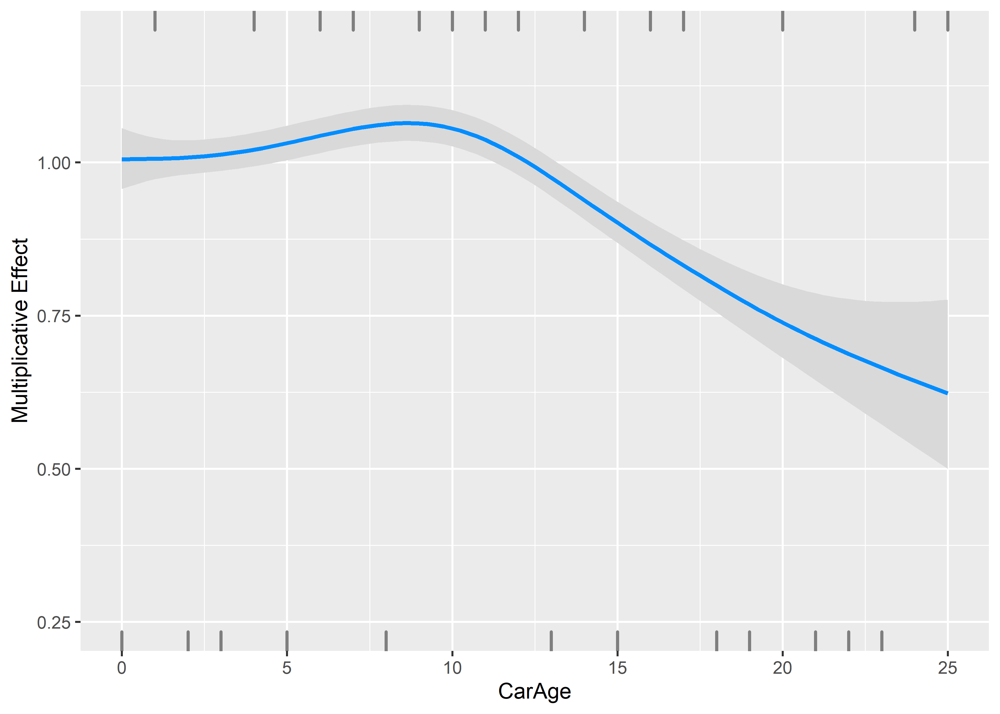

The new prediction of the claim frequency is now given by the old one
times the correction due to CarAge.

``` r
autofit$fit2<-autofit$fit1*predict(fit2, newdata=autofit, type="response")
```

The total number of predicted claim remains unchanged:

``` r
c(sum(autofit$fit1), sum(autofit$fit2))
```

    ## [1] 16127 16127

-   Let us now consider the other continuous covariate: DriverAge

``` r
mm <- ddply(autofit, .(DriverAge), summarise, totalExposure = sum(Exposure), totalClaimObs = sum(ClaimNb),
    totalClaimExp = sum(fit2))
head(mm)
```

    ##   DriverAge totalExposure totalClaimObs totalClaimExp
    ## 1        18      148.4220            46      9.940048
    ## 2        19      636.9296           171     42.215967
    ## 3        20     1020.8744           216     69.316891
    ## 4        21     1277.9390           207     86.832338
    ## 5        22     1562.9872           239    107.520143
    ## 6        23     1830.1058           230    128.292922

``` r
fit3 <- gam(totalClaimObs ~ s(DriverAge), offset = log(totalClaimExp), family = poisson(),
    data = mm)
```

-   Let us now consider the other continuous covariate: DriverAge

``` r
require(visreg)
visreg(fit3, xvar = "DriverAge", gg = TRUE, scale = "response") + ylim(c(0, 5)) +
    ylab("Multiplicative Effect") + scale_x_continuous(name = "Age of Driver", limits = c(18,
    99), breaks = c(18, seq(20, 95, 5), 99))
```

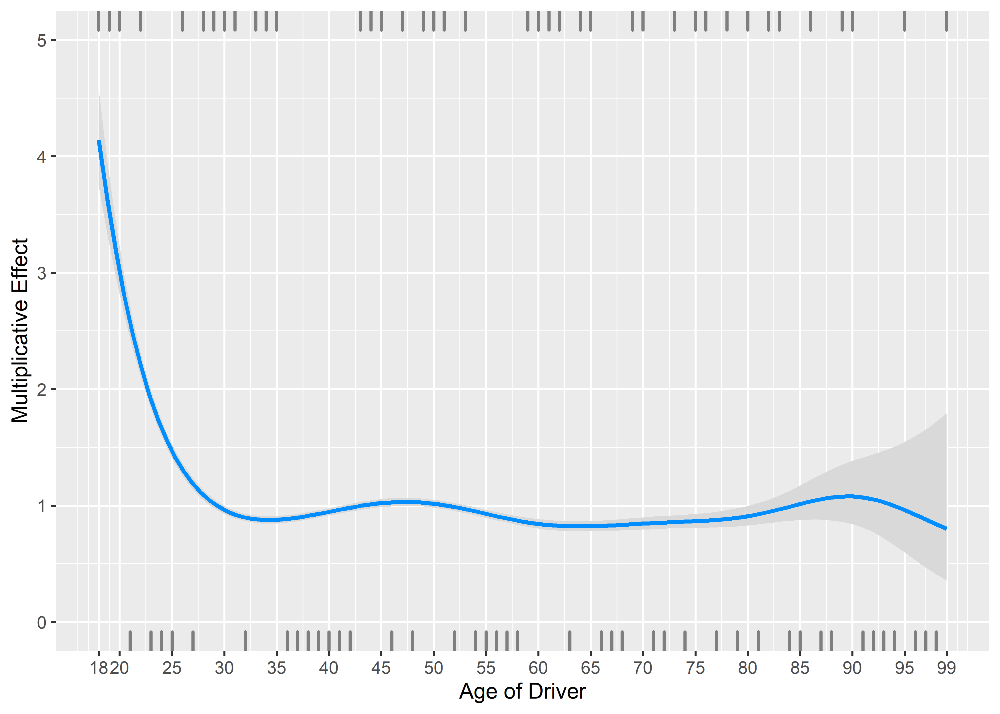

The new prediction of the claim frequency is now given by the old one
times the correction due to DriverAge.

``` r
autofit$fit3 <- autofit$fit2 * predict(fit3, newdata = autofit, type = "response")
```

The total expected number of claims remains unchanged.

``` r
c(sum(autofit$fit2), sum(autofit$fit3))
```

    ## [1] 16127 16127

Let us compute the log-likelihood

``` r
LL0 = sum(dpois(x = autofit$ClaimNb, lambda = autofit$fit0, log = TRUE))
LLi = sum(dpois(x = autofit$ClaimNb, lambda = autofit$fit3, log = TRUE))
c(LL0, LLi)
```

    ## [1] -68153.74 -67334.93

## Further iterations

Let us now iterate, and fit again the discrete variables, then CarAge,
then DriverAge, and let us stop when the log-likelihood change is
smaller than some small epsilon. When we fit the model, everything that
has been fitted before and is unrelated to the current variable is put
in the offset.

``` r
epsilon = 1e-08
i = 0
fit_it_discr = list(fit1)
fit_it_CarAge = list(fit2)
fit_it_DriverAge = list(fit3)

while (abs(LL0/LLi - 1) > epsilon & (i < 20)) {
    i = i + 1
    LL0 = LLi
    # Discrete variables
    autofit$logoffset = predict(fit_it_CarAge[[i]], newdata = autofit) + predict(fit_it_DriverAge[[i]],
        newdata = autofit) + log(autofit$Exposure)
    fit_it_discr[[i + 1]] <- gam(ClaimNb ~ Power_merged * Region_merged + Brand_merged +
        Gas + Region_merged * Brand_merged, autofit, family = poisson(), offset = logoffset)

    # CarAge
    autofit$logoffset = predict(fit_it_discr[[i + 1]], newdata = autofit) + predict(fit_it_DriverAge[[i]],
        newdata = autofit) + log(autofit$Exposure)
    mm <- ddply(autofit, .(CarAge), summarise, totalClaimObs = sum(ClaimNb), totalClaimExp = sum(exp(logoffset)))
    fit_it_CarAge[[i + 1]] <- gam(totalClaimObs ~ s(CarAge), offset = log(totalClaimExp),
        family = poisson(), data = mm)

    # DriverAge
    autofit$logoffset = predict(fit_it_discr[[i + 1]], newdata = autofit) + predict(fit_it_CarAge[[i +
        1]], newdata = autofit) + log(autofit$Exposure)
    mm <- ddply(autofit, .(DriverAge), summarise, totalClaimObs = sum(ClaimNb), totalClaimExp = sum(exp(logoffset)))
    fit_it_DriverAge[[i + 1]] <- gam(totalClaimObs ~ s(DriverAge), offset = log(totalClaimExp),
        family = poisson(), data = mm)
    ## Compute the new estimates

    autofit$currentfit = predict(fit_it_discr[[i + 1]], newdata = autofit, type = "response") *
        predict(fit_it_CarAge[[i + 1]], newdata = autofit, type = "response") * predict(fit_it_DriverAge[[i +
        1]], newdata = autofit, type = "response") * (autofit$Exposure)

    LLi = sum(dpois(x = autofit$ClaimNb, lambda = autofit$currentfit, log = TRUE))
    print(c(i, LL0, LLi))
}
```

    ## [1]      1.00 -67334.93 -67328.66
    ## [1]      2.00 -67328.66 -67328.28
    ## [1]      3.00 -67328.28 -67328.26
    ## [1]      4.00 -67328.26 -67328.26
    ## [1]      5.00 -67328.26 -67328.26

## Results

Let us now see the betas at each iteration.

### Discrete variables

``` r
res_discr = matrix(NA, ncol = 41, nrow = i + 1)
colnames(res_discr) = names(fit_it_discr[[1]]$coefficients)
res_discr[1, ] = fit_it_discr[[1]]$coefficients
res_discr[2, ] = fit_it_discr[[2]]$coefficients
res_discr[3, ] = fit_it_discr[[3]]$coefficients
res_discr[4, ] = fit_it_discr[[4]]$coefficients
res_discr[5, ] = fit_it_discr[[5]]$coefficients
res_discr[6, ] = fit_it_discr[[6]]$coefficients
```

For instance, the 9 first variables:

``` r
require("gridExtra")
p1 = lapply(2:10, function(i) {
    ggplot() + geom_point(aes(y = res_discr[, i], x = 1:6)) + xlab("Iteration") +
        ylab("beta") + ggtitle(names(fit_it_discr[[1]]$coefficients)[i]) + scale_x_continuous(breaks = 1:6)
})
do.call(grid.arrange, p1)
```

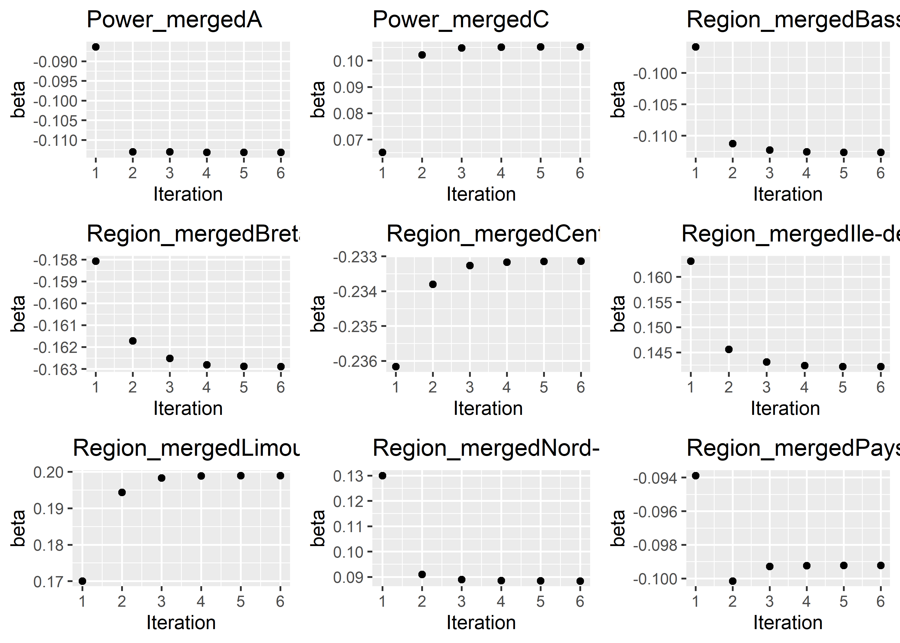

### CarAge

``` r
CarAge = matrix(NA, ncol = 6, nrow = 26)
CarAge[, 1] = predict(fit_it_CarAge[[1]], data.frame(CarAge = seq(from = 0, to = 25,
    by = 1)), type = "response")
CarAge[, 2] = predict(fit_it_CarAge[[2]], data.frame(CarAge = seq(from = 0, to = 25,
    by = 1)), type = "response")
CarAge[, 3] = predict(fit_it_CarAge[[3]], data.frame(CarAge = seq(from = 0, to = 25,
    by = 1)), type = "response")
CarAge[, 4] = predict(fit_it_CarAge[[4]], data.frame(CarAge = seq(from = 0, to = 25,
    by = 1)), type = "response")
CarAge[, 5] = predict(fit_it_CarAge[[5]], data.frame(CarAge = seq(from = 0, to = 25,
    by = 1)), type = "response")
CarAge[, 6] = predict(fit_it_CarAge[[6]], data.frame(CarAge = seq(from = 0, to = 25,
    by = 1)), type = "response")

x = as.data.frame(CarAge)
names(x) = sapply(1:6, function(i) {
    paste("it", i)
})
x = stack(as.data.frame(x))
names(x)[2] = "Iteration"

ggplot(x) + geom_line(aes(x = rep(0:25, 6), y = values, color = Iteration)) + xlab("Age of the Car") +
    ylab("Multiplicative Effect")
```

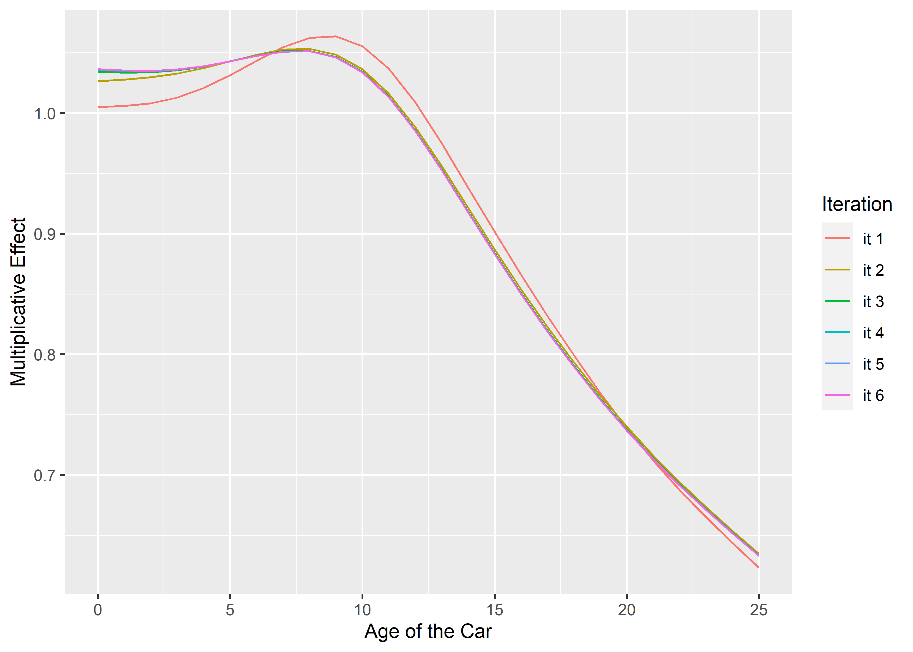

### DriverAge

``` r
DriverAge = matrix(NA, ncol = 6, nrow = 82)
DriverAge[, 1] = predict(fit_it_DriverAge[[1]], data.frame(DriverAge = seq(from = 18,
    to = 99, by = 1)), type = "response")
DriverAge[, 2] = predict(fit_it_DriverAge[[2]], data.frame(DriverAge = seq(from = 18,
    to = 99, by = 1)), type = "response")
DriverAge[, 3] = predict(fit_it_DriverAge[[3]], data.frame(DriverAge = seq(from = 18,
    to = 99, by = 1)), type = "response")
DriverAge[, 4] = predict(fit_it_DriverAge[[4]], data.frame(DriverAge = seq(from = 18,
    to = 99, by = 1)), type = "response")
DriverAge[, 5] = predict(fit_it_DriverAge[[5]], data.frame(DriverAge = seq(from = 18,
    to = 99, by = 1)), type = "response")
DriverAge[, 6] = predict(fit_it_DriverAge[[6]], data.frame(DriverAge = seq(from = 18,
    to = 99, by = 1)), type = "response")

x = as.data.frame(DriverAge)
names(x) = sapply(1:6, function(i) {
    paste("it", i)
})
x = stack(as.data.frame(x))
names(x)[2] = "Iteration"

ggplot(x) + geom_line(aes(x = rep(18:99, 6), y = values, color = Iteration)) + xlab("Age of the Driver") +
    ylab("Multiplicative Effect")
```

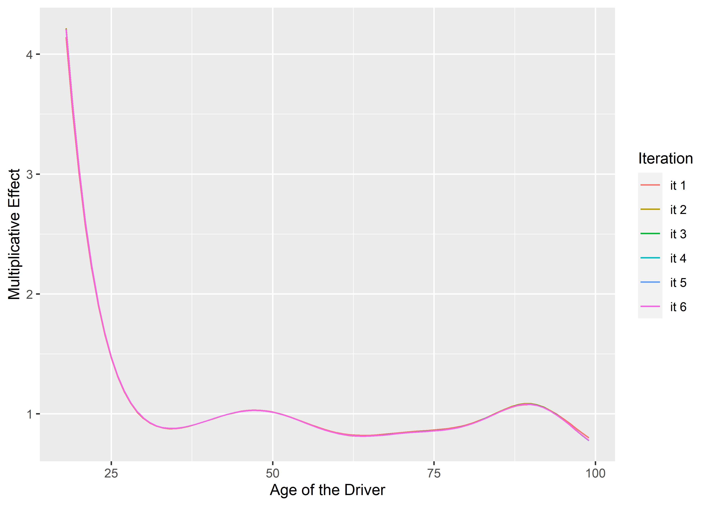

## Comparison with GAM

Let us now compare with the GAM directly

``` r
m0_gam = gam(ClaimNb ~ offset(log(Exposure)) + Power_merged * Region_merged + Brand_merged +
    Gas + Region_merged * Brand_merged + s(DriverAge) + s(CarAge), data = autofit,
    family = poisson(link = log))

ggplot() + geom_point(aes(x = autofit$currentfit, y = m0_gam$fitted.values)) + xlab("Manual backfitting") +
    ylab("GAM from mgcv")
```

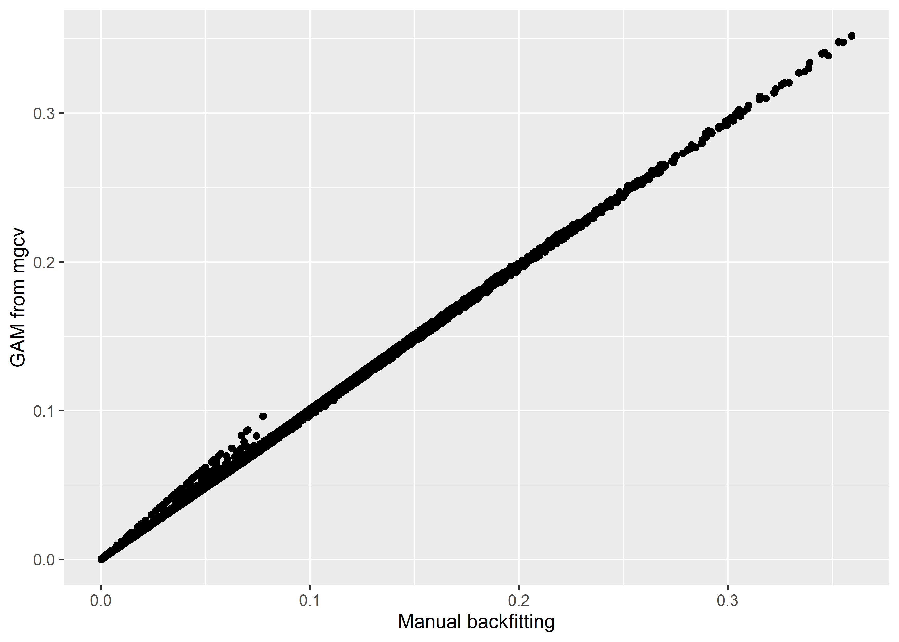

# Use of the mgcv package

First, let us retrieve the training and testing set we used before (in
the GLM session).

``` r
set.seed(21)
in_training = createDataPartition(dataset$ClaimNb, times = 1, p = 0.8, list = FALSE)
training_set = dataset[in_training, ]
testing_set = dataset[-in_training, ]
```

The gam function works very similarly to the glm function. The
continuous covariate have to be specified using for instance the
function s(.). Interaction with respect to a discrete variable can be
done by specifying the variable in the ‘by’ argument (see below).

## First try with gam

Let us start with the model we created above.

``` r
# Same as above..
ptn_0 = Sys.time()
m0_gam = gam(ClaimNb ~ offset(log(Exposure)) + Power_merged * Region_merged + Brand_merged +
    Gas + Region_merged * Brand_merged + s(DriverAge) + s(CarAge), data = training_set,
    family = poisson(link = log))
print(Sys.time() - ptn_0)
```

    ## Time difference of 1.512581 mins

## Comparison with bam

We see that the computational time is already long, especially if we
wanted to use cross-validation. There is also the function *bam*, which
is optimized for very large datasets and allows parallel computing.

``` r
require(parallel)
cl = makeCluster(detectCores() - 1)  # Number of cores to use, for parallel computing.
ptn_0 = Sys.time()
m0_bam = bam(ClaimNb ~ offset(log(Exposure)) + Power_merged * Region_merged + Brand_merged +
    Gas + Region_merged * Brand_merged + s(DriverAge) + s(CarAge), data = training_set,
    family = poisson(link = log), cluster = cl)
stopCluster(cl)
print(Sys.time() - ptn_0)
```

    ## Time difference of 7.90114 secs

We can see the fitted function using *plot*,

``` r
par(mfrow = c(1, 2))
plot(m0_bam, trans = exp, scale = 0, shade = TRUE)
```

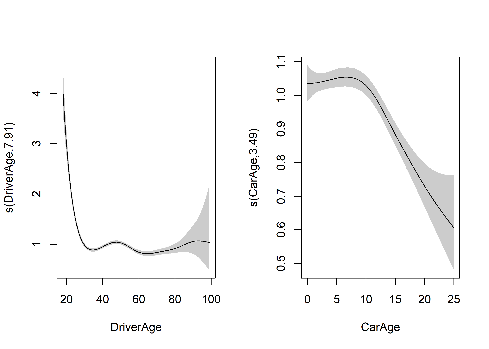
Since 2020, the package mgcViz simplifies greatly the creation of
visuals of GAMs. (Vignette available here:
<https://cran.r-project.org/web/packages/mgcViz/vignettes/mgcviz.html>)

``` r
require(mgcViz)
```

    ## Le chargement a nécessité le package : mgcViz

    ## Warning: le package 'mgcViz' a été compilé avec la version R 4.1.3

    ## Le chargement a nécessité le package : qgam

    ## Warning: le package 'qgam' a été compilé avec la version R 4.1.3

    ## Registered S3 method overwritten by 'GGally':
    ##   method from   
    ##   +.gg   ggplot2

    ## Registered S3 method overwritten by 'mgcViz':
    ##   method from  
    ##   +.gg   GGally

    ## 
    ## Attachement du package : 'mgcViz'

    ## L'objet suivant est masqué depuis 'package:lattice':
    ## 
    ##     qq

    ## Les objets suivants sont masqués depuis 'package:stats':
    ## 
    ##     qqline, qqnorm, qqplot

``` r
viz <- getViz(m0_bam)
print(plot(viz, allTerms = T), pages = 1)
```

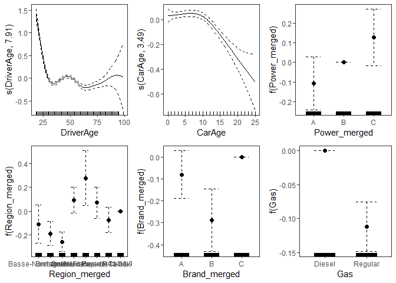<!-- -->

## Bivariate function

We can also include interactions between the two continuous variables.
We simply estimate a bivariate function.

``` r
cl = makeCluster(detectCores()-1) # Number of cores to use
m1_bam = bam(ClaimNb ~ offset(log(Exposure)) + Power_merged  * Region_merged +  Brand_merged + Gas+Region_merged* Brand_merged+ te(DriverAge, CarAge), # or replace te(DriverAge, CarAge) by ti(DriverAge) + ti(CarAge) + ti(DriverAge, CarAge)
         data = training_set,
         family=poisson(link = log),
         cluster = cl)
stopCluster(cl)
m1_bam
```

    ## 
    ## Family: poisson 
    ## Link function: log 
    ## 
    ## Formula:
    ## ClaimNb ~ offset(log(Exposure)) + Power_merged * Region_merged + 
    ##     Brand_merged + Gas + Region_merged * Brand_merged + te(DriverAge, 
    ##     CarAge)
    ## 
    ## Estimated degrees of freedom:
    ## 14.5  total = 55.51 
    ## 
    ## fREML score: 578020.5

``` r
cl = makeCluster(detectCores()-1) # Number of cores to use
m1_bam_b = bam(ClaimNb ~ offset(log(Exposure)) + Power_merged  * Region_merged +  Brand_merged + Gas+Region_merged* Brand_merged+ s(DriverAge, CarAge),
         data = training_set,
         family=poisson(link = log),
         cluster = cl)
stopCluster(cl)
m1_bam_b
```

    ## 
    ## Family: poisson 
    ## Link function: log 
    ## 
    ## Formula:
    ## ClaimNb ~ offset(log(Exposure)) + Power_merged * Region_merged + 
    ##     Brand_merged + Gas + Region_merged * Brand_merged + s(DriverAge, 
    ##     CarAge)
    ## 
    ## Estimated degrees of freedom:
    ## 23  total = 64 
    ## 
    ## fREML score: 578242.2

To choose between *te* and *s* when adding bivariate functions, Wood
(2017) recommends the following:

” *Tensor product, te* Invariant to linear rescaling of covariates, but
not to rotation of covariate space. Good for smooth interactions of
quantities measured in different units, or where very different degrees
of smoothness appropriate relative to different covariates.
Computationally inexpensive, provided TPRS bases are not used as
marginal bases. Apart from scale invariance, not much supporting theory.

*TPRS, s(…,bs=“tp”)* Invariant to rotation of covariate space
(isotropic), but not to rescaling of covariates. Good for smooth
interactions of quantities measured in same units, such as spatial
co-ordinates, where isotropy is appropriate. Computational cost can be
high as it increases with square of number of data (can be avoided by
approximation). ”

We can visualize the interactions:

``` r
vis.gam(m1_bam, view=c("DriverAge", "CarAge"),  plot.type = 'contour')
```

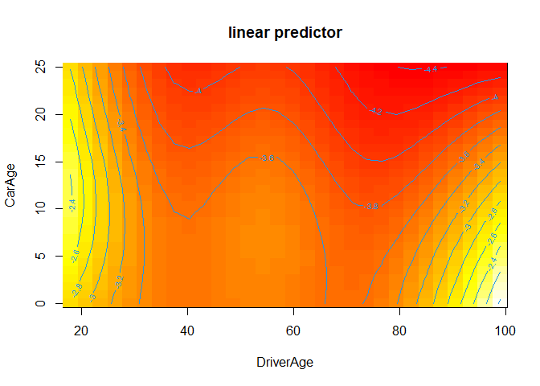<!-- -->

``` r
vis.gam(m1_bam_b, view=c("DriverAge", "CarAge"),  plot.type = 'contour')
```

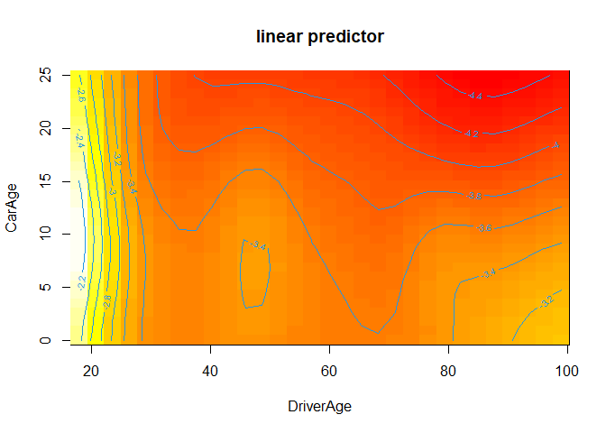<!-- -->

We can compute the log-ikelihood

``` r
logLik.gam(m0_bam)
```

    ## 'log Lik.' -53998.77 (df=52.65046)

``` r
logLik.gam(m1_bam)
```

    ## 'log Lik.' -54063.72 (df=56.18005)

``` r
logLik.gam(m1_bam_b)
```

    ## 'log Lik.' -53985.16 (df=64.23215)

The likelihood ratio test still works like in the GLM framework.

``` r
anova(m0_bam, m1_bam_b, test = "Chisq")
```

    ## Analysis of Deviance Table
    ## 
    ## Model 1: ClaimNb ~ offset(log(Exposure)) + Power_merged * Region_merged + 
    ##     Brand_merged + Gas + Region_merged * Brand_merged + s(DriverAge) + 
    ##     s(CarAge)
    ## Model 2: ClaimNb ~ offset(log(Exposure)) + Power_merged * Region_merged + 
    ##     Brand_merged + Gas + Region_merged * Brand_merged + s(DriverAge, 
    ##     CarAge)
    ##   Resid. Df Resid. Dev     Df Deviance Pr(>Chi)  
    ## 1    328638      82991                           
    ## 2    328624      82964 13.812   27.219  0.01664 *
    ## ---
    ## Signif. codes:  0 '***' 0.001 '**' 0.01 '*' 0.05 '.' 0.1 ' ' 1

## Interaction between a continuous and a discrete variable

To include an interaction with a discrete variable, we can use the *by*
argument. For example, between CarAge and Gas:

``` r
cl = makeCluster(detectCores() - 1)  # Number of cores to use
m2_bam = bam(ClaimNb ~ offset(log(Exposure)) + Power_merged * Region_merged + Brand_merged +
    Gas + Region_merged * Brand_merged + s(DriverAge) + s(CarAge, by = Gas), data = training_set,
    family = poisson(link = log), cluster = cl)
stopCluster(cl)
summary(m2_bam)
```

    ## 
    ## Family: poisson 
    ## Link function: log 
    ## 
    ## Formula:
    ## ClaimNb ~ offset(log(Exposure)) + Power_merged * Region_merged + 
    ##     Brand_merged + Gas + Region_merged * Brand_merged + s(DriverAge) + 
    ##     s(CarAge, by = Gas)
    ## 
    ## Parametric coefficients:
    ##                                                Estimate Std. Error z value
    ## (Intercept)                                   -2.479801   0.037351 -66.392
    ## Power_mergedA                                 -0.105274   0.069147  -1.522
    ## Power_mergedC                                  0.119822   0.073317   1.634
    ## Region_mergedBasse-Normandie                  -0.105797   0.080986  -1.306
    ## Region_mergedBretagne                         -0.183824   0.051885  -3.543
    ## Region_mergedCentre                           -0.254532   0.041022  -6.205
    ## Region_mergedIle-de-France                     0.090732   0.054594   1.662
    ## Region_mergedLimousin                          0.279641   0.117140   2.387
    ## Region_mergedNord-Pas-de-Calais                0.072344   0.067018   1.079
    ## Region_mergedPays-de-la-Loire                 -0.073433   0.053941  -1.361
    ## Brand_mergedA                                 -0.078994   0.055591  -1.421
    ## Brand_mergedB                                 -0.290637   0.072490  -4.009
    ## GasRegular                                    -0.122471   0.019059  -6.426
    ## Power_mergedA:Region_mergedBasse-Normandie     0.076747   0.162314   0.473
    ## Power_mergedC:Region_mergedBasse-Normandie    -0.010322   0.177287  -0.058
    ## Power_mergedA:Region_mergedBretagne           -0.069826   0.104753  -0.667
    ## Power_mergedC:Region_mergedBretagne            0.146693   0.108033   1.358
    ## Power_mergedA:Region_mergedCentre             -0.005417   0.080152  -0.068
    ## Power_mergedC:Region_mergedCentre             -0.055937   0.086778  -0.645
    ## Power_mergedA:Region_mergedIle-de-France       0.127791   0.091736   1.393
    ## Power_mergedC:Region_mergedIle-de-France       0.030039   0.093268   0.322
    ## Power_mergedA:Region_mergedLimousin            0.059167   0.231441   0.256
    ## Power_mergedC:Region_mergedLimousin           -0.003270   0.247404  -0.013
    ## Power_mergedA:Region_mergedNord-Pas-de-Calais  0.109583   0.117930   0.929
    ## Power_mergedC:Region_mergedNord-Pas-de-Calais  0.034385   0.140615   0.245
    ## Power_mergedA:Region_mergedPays-de-la-Loire   -0.084607   0.108287  -0.781
    ## Power_mergedC:Region_mergedPays-de-la-Loire    0.071475   0.111703   0.640
    ## Region_mergedBasse-Normandie:Brand_mergedA     0.100278   0.129988   0.771
    ## Region_mergedBretagne:Brand_mergedA            0.096996   0.078885   1.230
    ## Region_mergedCentre:Brand_mergedA              0.223135   0.063383   3.520
    ## Region_mergedIle-de-France:Brand_mergedA       0.248834   0.079527   3.129
    ## Region_mergedLimousin:Brand_mergedA            0.082568   0.182454   0.453
    ## Region_mergedNord-Pas-de-Calais:Brand_mergedA  0.116621   0.099851   1.168
    ## Region_mergedPays-de-la-Loire:Brand_mergedA    0.171915   0.082724   2.078
    ## Region_mergedBasse-Normandie:Brand_mergedB    -0.229480   0.208532  -1.100
    ## Region_mergedBretagne:Brand_mergedB            0.399017   0.130201   3.065
    ## Region_mergedCentre:Brand_mergedB              0.349757   0.107201   3.263
    ## Region_mergedIle-de-France:Brand_mergedB       0.084895   0.088806   0.956
    ## Region_mergedLimousin:Brand_mergedB           -0.257662   0.221578  -1.163
    ## Region_mergedNord-Pas-de-Calais:Brand_mergedB -0.127131   0.122456  -1.038
    ## Region_mergedPays-de-la-Loire:Brand_mergedB    0.081736   0.123857   0.660
    ##                                               Pr(>|z|)    
    ## (Intercept)                                    < 2e-16 ***
    ## Power_mergedA                                 0.127893    
    ## Power_mergedC                                 0.102197    
    ## Region_mergedBasse-Normandie                  0.191427    
    ## Region_mergedBretagne                         0.000396 ***
    ## Region_mergedCentre                           5.48e-10 ***
    ## Region_mergedIle-de-France                    0.096522 .  
    ## Region_mergedLimousin                         0.016976 *  
    ## Region_mergedNord-Pas-de-Calais               0.280375    
    ## Region_mergedPays-de-la-Loire                 0.173401    
    ## Brand_mergedA                                 0.155323    
    ## Brand_mergedB                                 6.09e-05 ***
    ## GasRegular                                    1.31e-10 ***
    ## Power_mergedA:Region_mergedBasse-Normandie    0.636335    
    ## Power_mergedC:Region_mergedBasse-Normandie    0.953571    
    ## Power_mergedA:Region_mergedBretagne           0.505040    
    ## Power_mergedC:Region_mergedBretagne           0.174510    
    ## Power_mergedA:Region_mergedCentre             0.946118    
    ## Power_mergedC:Region_mergedCentre             0.519188    
    ## Power_mergedA:Region_mergedIle-de-France      0.163610    
    ## Power_mergedC:Region_mergedIle-de-France      0.747398    
    ## Power_mergedA:Region_mergedLimousin           0.798225    
    ## Power_mergedC:Region_mergedLimousin           0.989454    
    ## Power_mergedA:Region_mergedNord-Pas-de-Calais 0.352777    
    ## Power_mergedC:Region_mergedNord-Pas-de-Calais 0.806817    
    ## Power_mergedA:Region_mergedPays-de-la-Loire   0.434614    
    ## Power_mergedC:Region_mergedPays-de-la-Loire   0.522261    
    ## Region_mergedBasse-Normandie:Brand_mergedA    0.440447    
    ## Region_mergedBretagne:Brand_mergedA           0.218852    
    ## Region_mergedCentre:Brand_mergedA             0.000431 ***
    ## Region_mergedIle-de-France:Brand_mergedA      0.001754 ** 
    ## Region_mergedLimousin:Brand_mergedA           0.650877    
    ## Region_mergedNord-Pas-de-Calais:Brand_mergedA 0.242825    
    ## Region_mergedPays-de-la-Loire:Brand_mergedA   0.037692 *  
    ## Region_mergedBasse-Normandie:Brand_mergedB    0.271134    
    ## Region_mergedBretagne:Brand_mergedB           0.002179 ** 
    ## Region_mergedCentre:Brand_mergedB             0.001104 ** 
    ## Region_mergedIle-de-France:Brand_mergedB      0.339094    
    ## Region_mergedLimousin:Brand_mergedB           0.244891    
    ## Region_mergedNord-Pas-de-Calais:Brand_mergedB 0.299186    
    ## Region_mergedPays-de-la-Loire:Brand_mergedB   0.509306    
    ## ---
    ## Signif. codes:  0 '***' 0.001 '**' 0.01 '*' 0.05 '.' 0.1 ' ' 1
    ## 
    ## Approximate significance of smooth terms:
    ##                        edf Ref.df Chi.sq p-value    
    ## s(DriverAge)         7.904  8.553 978.97 < 2e-16 ***
    ## s(CarAge):GasDiesel  1.712  2.158  14.21 0.00104 ** 
    ## s(CarAge):GasRegular 3.822  4.756  74.33 < 2e-16 ***
    ## ---
    ## Signif. codes:  0 '***' 0.001 '**' 0.01 '*' 0.05 '.' 0.1 ' ' 1
    ## 
    ## R-sq.(adj) =  0.00736   Deviance explained = 2.96%
    ## fREML = 5.7912e+05  Scale est. = 1         n = 328692

When we now plot the functions, we obtain **two** functions for
*CarAge*. Note that *sm*

``` r
b <- getViz(m2_bam)
gridPrint(plot(sm(b, 2)) + theme_bw() +l_ciPoly()+ l_fitLine(colour = "red"),
          plot(sm(b, 3)) + theme_bw() +l_ciPoly()+ l_fitLine(colour = "red"), ncol=2)
```

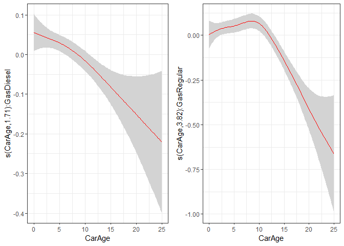<!-- -->

We can test if the interaction improves our model.

``` r
anova(m0_bam, m2_bam, test = "Chisq")
```

    ## Analysis of Deviance Table
    ## 
    ## Model 1: ClaimNb ~ offset(log(Exposure)) + Power_merged * Region_merged + 
    ##     Brand_merged + Gas + Region_merged * Brand_merged + s(DriverAge) + 
    ##     s(CarAge)
    ## Model 2: ClaimNb ~ offset(log(Exposure)) + Power_merged * Region_merged + 
    ##     Brand_merged + Gas + Region_merged * Brand_merged + s(DriverAge) + 
    ##     s(CarAge, by = Gas)
    ##   Resid. Df Resid. Dev     Df Deviance Pr(>Chi)  
    ## 1    328638      82991                           
    ## 2    328634      82978 3.5516   12.383  0.01021 *
    ## ---
    ## Signif. codes:  0 '***' 0.001 '**' 0.01 '*' 0.05 '.' 0.1 ' ' 1

``` r
cl = makeCluster(detectCores() - 1)  # Number of cores to use
m3_bam = bam(ClaimNb ~ offset(log(Exposure)) + Power_merged * Region_merged + Brand_merged +
    Gas + Region_merged * Brand_merged + s(DriverAge, by = Gas) + s(CarAge), data = training_set,
    family = poisson(link = log), cluster = cl)
stopCluster(cl)
anova(m0_bam, m3_bam, test = "Chisq")
```

    ## Analysis of Deviance Table
    ## 
    ## Model 1: ClaimNb ~ offset(log(Exposure)) + Power_merged * Region_merged + 
    ##     Brand_merged + Gas + Region_merged * Brand_merged + s(DriverAge) + 
    ##     s(CarAge)
    ## Model 2: ClaimNb ~ offset(log(Exposure)) + Power_merged * Region_merged + 
    ##     Brand_merged + Gas + Region_merged * Brand_merged + s(DriverAge, 
    ##     by = Gas) + s(CarAge)
    ##   Resid. Df Resid. Dev     Df Deviance Pr(>Chi)  
    ## 1    328638      82991                           
    ## 2    328630      82974 8.0576   17.142  0.02953 *
    ## ---
    ## Signif. codes:  0 '***' 0.001 '**' 0.01 '*' 0.05 '.' 0.1 ' ' 1

``` r
par(mfrow = c(1, 2))
plot(m3_bam, shade = TRUE, trans = exp, scale = -1, select = 1)
plot(m3_bam, shade = TRUE, trans = exp, scale = -1, select = 2)
```

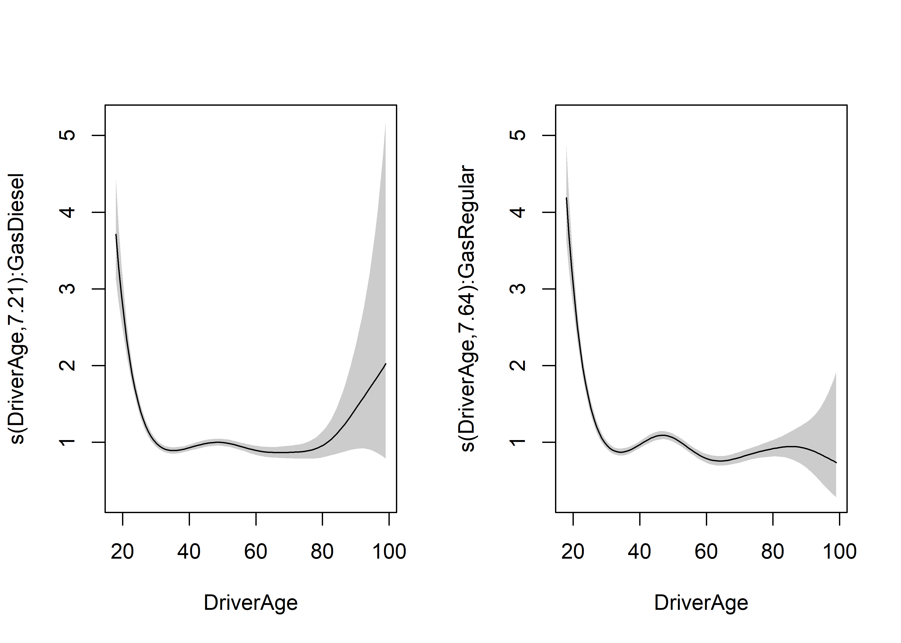

Or with mgcViz:

``` r
b <- getViz(m3_bam)
gridPrint(plot(sm(b, 1)) + theme_bw() +l_ciPoly()+ l_fitLine(colour = "red"),
          plot(sm(b, 2)) + theme_bw() +l_ciPoly()+ l_fitLine(colour = "red"), ncol=2)
```

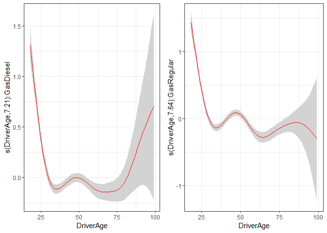<!-- -->

## Cross-validation

We can also use cross-validation to check whether or not to include this
variable. First we need to create the folds, let’s say 5.

``` r
require(caret)
set.seed(41)
folds = createFolds(training_set$ClaimNb, k = 5)
res0 = lapply(folds, function(X) {
    cl = makeCluster(detectCores() - 1)  # Number of cores to use
    m3_bam = bam(ClaimNb ~ offset(log(Exposure)) + Power_merged * Region_merged +
        Brand_merged + Gas + Region_merged * Brand_merged + s(DriverAge) + s(CarAge),
        data = training_set[-X, ], family = poisson(link = log), cluster = cl)
    stopCluster(cl)
    pred = predict(m3_bam, training_set[X, ], type = "response")
    sum(dpois(x = training_set[X, ]$ClaimNb, lambda = pred, log = TRUE))
    # sum(-pred +
    # training_set[X,]$ClaimNb*log(pred)-log(factorial(training_set[X,]$ClaimNb)))
})

res3 = lapply(folds, function(X) {
    cl = makeCluster(detectCores() - 1)  # Number of cores to use
    m3_bam = bam(ClaimNb ~ offset(log(Exposure)) + Power_merged * Region_merged +
        Brand_merged + Gas + Region_merged * Brand_merged + s(DriverAge, by = Gas) +
        s(CarAge), data = training_set[-X, ], family = poisson(link = log), cluster = cl)
    stopCluster(cl)
    pred = predict(m3_bam, training_set[X, ], type = "response")
    sum(dpois(x = training_set[X, ]$ClaimNb, lambda = pred, log = TRUE))
    # sum(-pred +
    # training_set[X,]$ClaimNb*log(pred)-log(factorial(training_set[X,]$ClaimNb)))
})

cbind(unlist(res0), unlist(res3))
```

    ##            [,1]      [,2]
    ## Fold1 -10963.95 -10965.42
    ## Fold2 -10516.53 -10515.82
    ## Fold3 -10873.05 -10876.58
    ## Fold4 -10901.49 -10900.15
    ## Fold5 -10800.18 -10799.15

``` r
apply(cbind(unlist(res0), unlist(res3)), 2, mean)
```

    ## [1] -10811.04 -10811.42

There is no improvement with the interaction.

``` r
res4 = lapply(folds, function(X) {
    cl = makeCluster(detectCores() - 1)  # Number of cores to use
    m3_bam = bam(ClaimNb ~ offset(log(Exposure)) + Power_merged * Region_merged +
        Brand_merged + Gas + Region_merged * Brand_merged + s(DriverAge) + s(CarAge,
        by = Power_merged), data = training_set[-X, ], family = poisson(link = log),
        cluster = cl)
    stopCluster(cl)
    pred = predict(m3_bam, training_set[X, ], type = "response")
    sum(dpois(x = training_set[X, ]$ClaimNb, lambda = pred, log = TRUE))
    # sum(-pred +
    # training_set[X,]$ClaimNb*log(pred)-log(factorial(training_set[X,]$ClaimNb)))
})
apply(cbind(unlist(res0), unlist(res3), unlist(res4)), 2, mean)
```

    ## [1] -10811.04 -10811.42 -10811.33

We conclude here, we did not find any further interactions. We can
compute the deviance on the validation set

``` r
2 * (sum(dpois(x = testing_set$ClaimNb, lambda = testing_set$ClaimNb, log = TRUE)) -
    sum(dpois(x = testing_set$ClaimNb, lambda = predict(m0_bam, testing_set, offset = testing_set$Exposure,
        type = "response"), log = TRUE)))
```

    ## [1] 20524.88

## Comparison with best GLM model

Let us compare the predictions between the GLM and the GAM.

``` r
m.glm.5.6 = glm(ClaimNb ~ offset(log(Exposure)) + Power_merged  * Region_merged +  Brand_merged + Gas+Region_merged* Brand_merged,
         data = training_set,
         family=poisson(link = log))

testing_set$GLM_pred = predict(m.glm.5.6, testing_set, type="response")
testing_set$GAM_pred = predict(m0_bam, testing_set, type="response")
head(testing_set[,c("GLM_pred", "GAM_pred")], n=25)
```

    ##        GLM_pred    GAM_pred
    ## 1   0.005625541 0.006009235
    ## 8   0.002546311 0.003116539
    ## 9   0.069652836 0.126605122
    ## 14  0.012681264 0.011632115
    ## 19  0.008980572 0.009598121
    ## 24  0.053135051 0.056198981
    ## 28  0.039700946 0.042648009
    ## 30  0.059770852 0.054598843
    ## 33  0.050057622 0.042714717
    ## 34  0.055622832 0.047338012
    ## 38  0.011811500 0.012611832
    ## 49  0.006111146 0.005156995
    ## 53  0.043287286 0.039693014
    ## 55  0.001100546 0.001046832
    ## 59  0.012716614 0.011763468
    ## 60  0.009325517 0.008375493
    ## 62  0.024695093 0.022652013
    ## 63  0.006006915 0.005973104
    ## 65  0.014666749 0.015473295
    ## 79  0.062115623 0.053714376
    ## 94  0.024511823 0.021838582
    ## 97  0.014683569 0.015309589
    ## 98  0.032893745 0.035189397
    ## 104 0.044288414 0.045088722
    ## 117 0.054062232 0.057794032

If we plot the prediction of GLM vs GAM

``` r
ggplot(testing_set) + geom_point(aes(x=GLM_pred, y=GAM_pred))+ylab("GAM")+xlab("GLM")+geom_abline(slope=1, intercept=0, color="red")+
  scale_x_continuous(labels = scales::percent_format(accuracy = 0.01))+
  scale_y_continuous(labels = scales::percent_format(accuracy = 0.01))
```

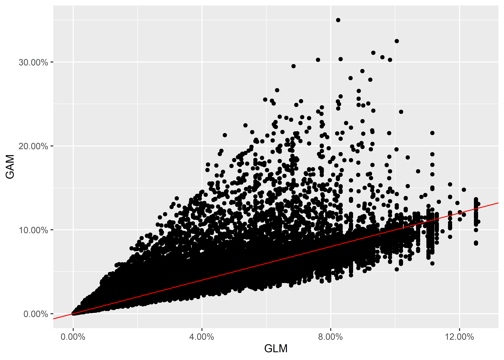

However, the total amount of expected claims are still close.

``` r
sum(testing_set$GLM_pred) #GLM
```

    ## [1] 3221.12

``` r
sum(testing_set$GAM_pred) #GAM
```

    ## [1] 3216.071
