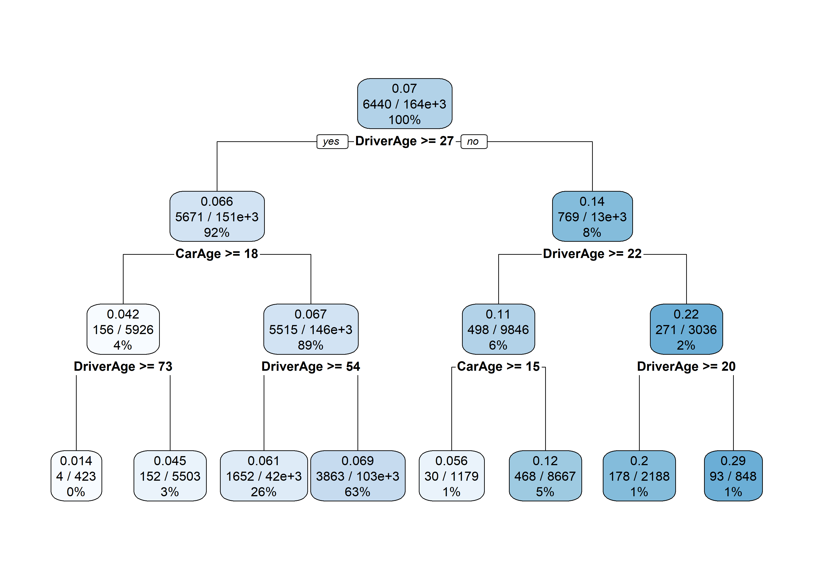
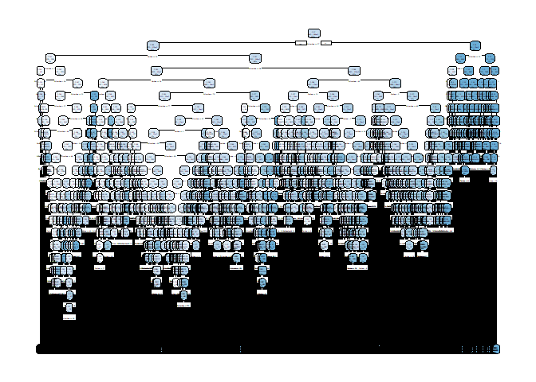
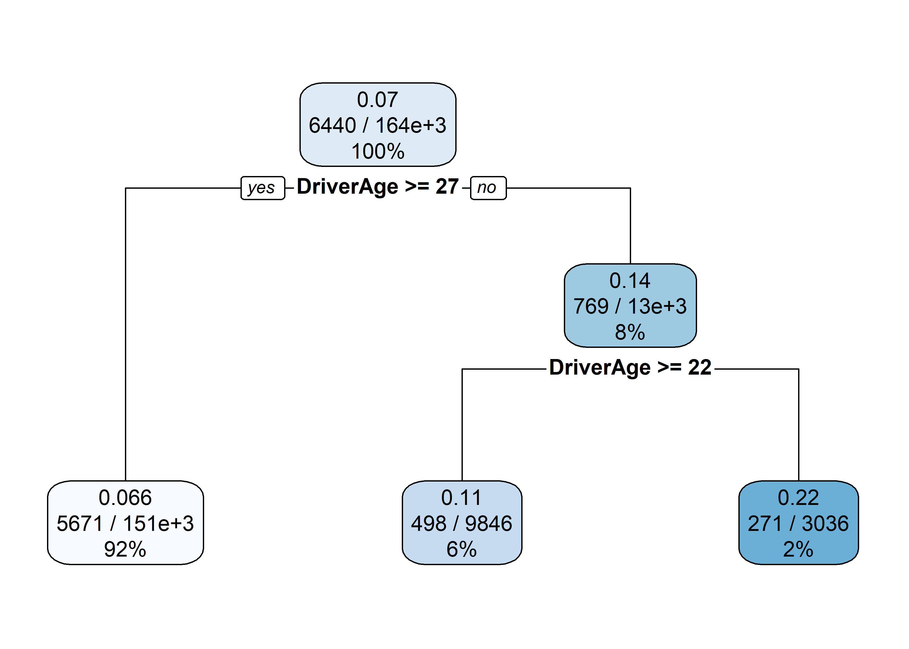
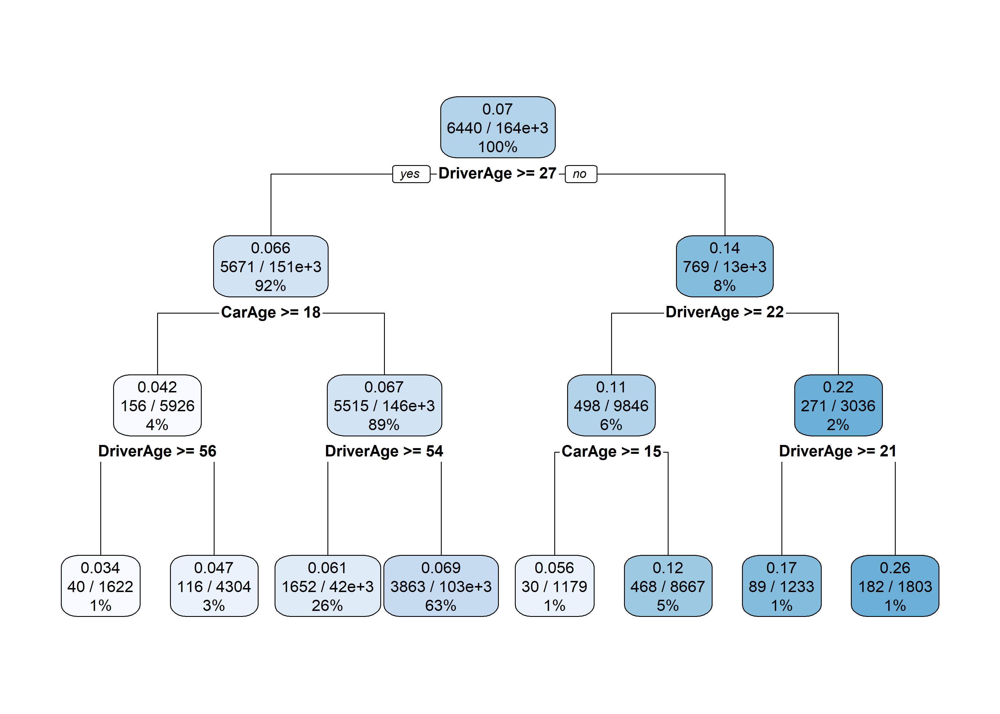
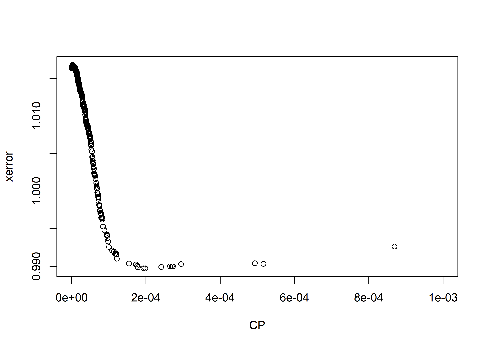
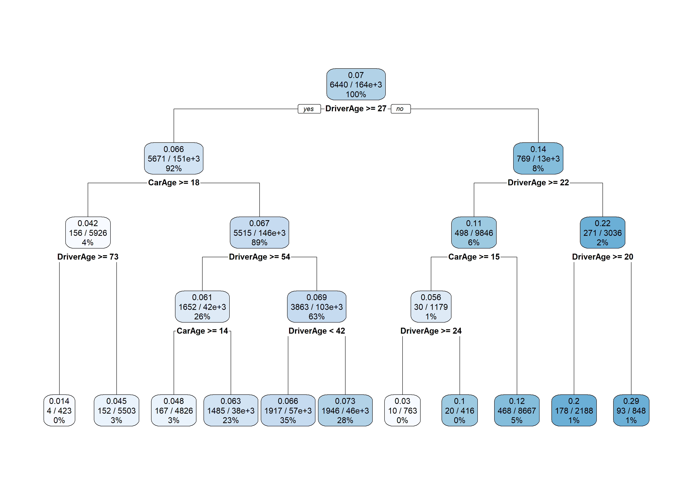
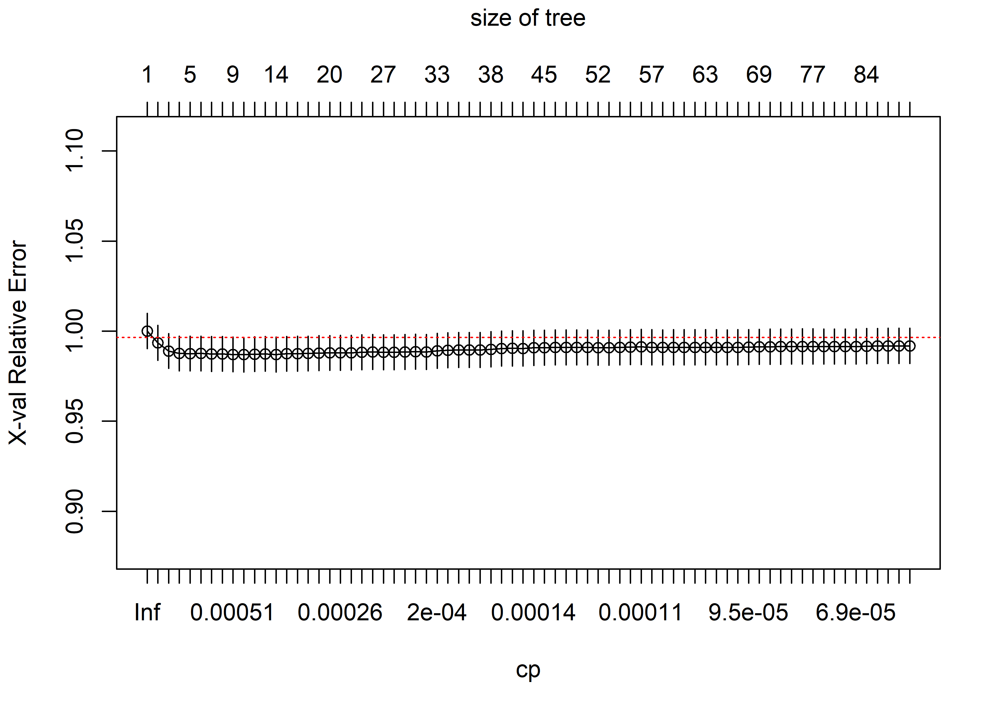
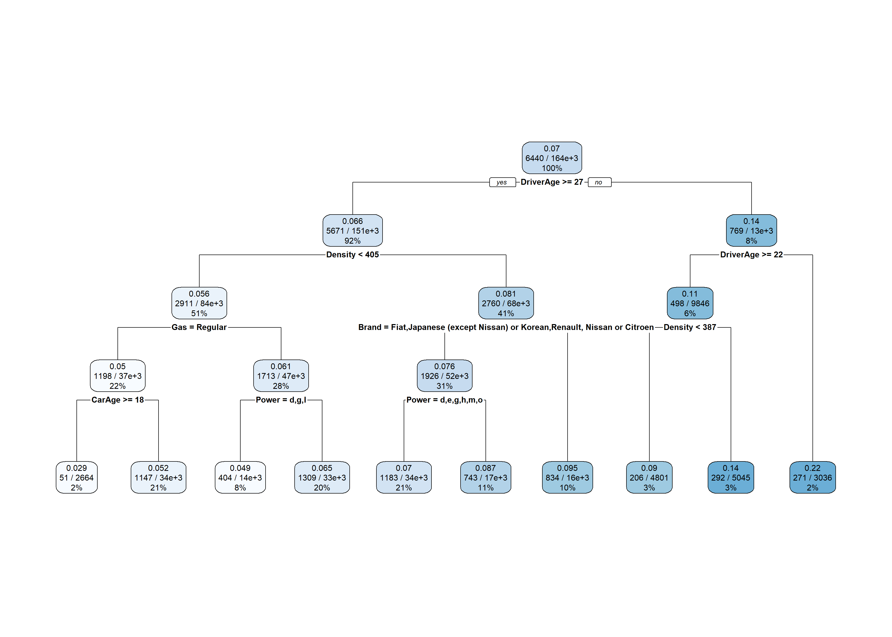

Tree-based models
================

-   [Loading the data and the packages](#loading-the-data-and-the-packages)
-   [CART](#cart)
    -   [Example](#example)
    -   [Cross-Validation](#cross-validation)
    -   [All covariates](#all-covariates)
-   [Bagging of trees](#bagging-of-trees)

Loading the data and the packages
=================================

First, the packages

``` r
require("CASdatasets")
require("rpart")
require("rpart.plot")
require("caret")
```

then, the data

``` r
# data("freMTPLfreq")
# freMTPLfreq = subset(freMTPLfreq, Exposure<=1 & Exposure >= 0 & CarAge<=25)
# 
# set.seed(85)
# folds = createDataPartition(freMTPLfreq$ClaimNb, 0.5)
# dataset = freMTPLfreq[folds[[1]], ]
load("dataset.RData")
```

Let us first split out dataset in two parts: a training set and a testing set.

``` r
set.seed(21)
in_training = createDataPartition(dataset$ClaimNb, times = 1, p = 0.8, list=FALSE)
training_set = dataset[in_training,]
testing_set  = dataset[-in_training,]
```

CART
====

The package *rpart* allows to compute regression trees. *rpart* can be used for regression and classification. It also implements a method for **poisson** data.

Example
-------

Let us start with a simple example:

``` r
m0_rpart = rpart(cbind(Exposure, ClaimNb)~ DriverAge + CarAge,
                 data=training_set,
                 method="poisson")
summary(m0_rpart)
```

    ## Call:
    ## rpart(formula = cbind(Exposure, ClaimNb) ~ DriverAge + CarAge, 
    ##     data = training_set, method = "poisson")
    ##   n= 164346 
    ## 
    ##            CP nsplit rel error xerror xstd
    ## 1 0.007291066      0         1      0    0
    ## 
    ## Node number 1: 164346 observations
    ##   events=6440,  estimated rate=0.06993893 , mean deviance=0.2560171

It appears that the tree has a single node and has not been split further. This comes from the complexity parameter which penalizes the splitting. By default, the complexity parameter *c**p* is set to 0.01, which is often too large for Poisson data with low frequencies.

Let us put *c**p* = 0, but to keep a small tree we will also impose a maximum depth of 3.

``` r
m0_rpart = rpart(cbind(Exposure, ClaimNb)~ DriverAge + CarAge,
                 data=training_set,
                 method="poisson",
                 control = rpart.control(cp = 0, maxdepth = 3))
summary(m0_rpart)
```

    ## Call:
    ## rpart(formula = cbind(Exposure, ClaimNb) ~ DriverAge + CarAge, 
    ##     data = training_set, method = "poisson", control = rpart.control(cp = 0, 
    ##         maxdepth = 3))
    ##   n= 164346 
    ## 
    ##             CP nsplit rel error    xerror        xstd
    ## 1 0.0072910657      0 1.0000000 1.0000947 0.009761534
    ## 2 0.0017755017      1 0.9927089 0.9939987 0.009678228
    ## 3 0.0008692125      2 0.9909334 0.9929020 0.009672146
    ## 4 0.0005163174      3 0.9900642 0.9909126 0.009652092
    ## 5 0.0004932740      4 0.9895479 0.9908982 0.009651163
    ## 6 0.0002693544      5 0.9890546 0.9905951 0.009648972
    ## 7 0.0002409219      6 0.9887853 0.9907275 0.009649443
    ## 8 0.0000000000      7 0.9885444 0.9908074 0.009651133
    ## 
    ## Variable importance
    ## DriverAge    CarAge 
    ##        88        12 
    ## 
    ## Node number 1: 164346 observations,    complexity param=0.007291066
    ##   events=6440,  estimated rate=0.06993893 , mean deviance=0.2560171 
    ##   left son=2 (151464 obs) right son=3 (12882 obs)
    ##   Primary splits:
    ##       DriverAge < 26.5 to the right, improve=306.77560, (0 missing)
    ##       CarAge    < 17.5 to the right, improve= 44.55588, (0 missing)
    ## 
    ## Node number 2: 151464 observations,    complexity param=0.0008692125
    ##   events=5671,  estimated rate=0.0655778 , mean deviance=0.2453646 
    ##   left son=4 (5926 obs) right son=5 (145538 obs)
    ##   Primary splits:
    ##       CarAge    < 17.5 to the right, improve=36.57344, (0 missing)
    ##       DriverAge < 53.5 to the right, improve=23.06150, (0 missing)
    ## 
    ## Node number 3: 12882 observations,    complexity param=0.001775502
    ##   events=769,  estimated rate=0.1371023 , mean deviance=0.3574526 
    ##   left son=6 (9846 obs) right son=7 (3036 obs)
    ##   Primary splits:
    ##       DriverAge < 21.5 to the right, improve=74.72201, (0 missing)
    ##       CarAge    < 14.5 to the right, improve=14.40992, (0 missing)
    ## 
    ## Node number 4: 5926 observations,    complexity param=0.0002693544
    ##   events=156,  estimated rate=0.04232996 , mean deviance=0.1952838 
    ##   left son=8 (423 obs) right son=9 (5503 obs)
    ##   Primary splits:
    ##       DriverAge < 72.5 to the right, improve=11.474520, (0 missing)
    ##       CarAge    < 23.5 to the left,  improve= 1.969211, (0 missing)
    ## 
    ## Node number 5: 145538 observations,    complexity param=0.000493274
    ##   events=5515,  estimated rate=0.06661995 , mean deviance=0.2471525 
    ##   left son=10 (42343 obs) right son=11 (103195 obs)
    ##   Primary splits:
    ##       DriverAge < 53.5 to the right, improve=20.75470, (0 missing)
    ##       CarAge    < 12.5 to the right, improve=13.35384, (0 missing)
    ## 
    ## Node number 6: 9846 observations,    complexity param=0.0005163174
    ##   events=498,  estimated rate=0.1132733 , mean deviance=0.3182285 
    ##   left son=12 (1179 obs) right son=13 (8667 obs)
    ##   Primary splits:
    ##       CarAge    < 14.5 to the right, improve=21.725950, (0 missing)
    ##       DriverAge < 23.5 to the right, improve= 7.424345, (0 missing)
    ## 
    ## Node number 7: 3036 observations,    complexity param=0.0002409219
    ##   events=271,  estimated rate=0.2219925 , mean deviance=0.4600535 
    ##   left son=14 (2188 obs) right son=15 (848 obs)
    ##   Primary splits:
    ##       DriverAge < 19.5 to the right, improve=10.246780, (0 missing)
    ##       CarAge    < 5.5  to the left,  improve= 3.551826, (0 missing)
    ## 
    ## Node number 8: 423 observations
    ##   events=4,  estimated rate=0.01396801 , mean deviance=0.08591919 
    ## 
    ## Node number 9: 5503 observations
    ##   events=152,  estimated rate=0.04546408 , mean deviance=0.2016309 
    ## 
    ## Node number 10: 42343 observations
    ##   events=1652,  estimated rate=0.06082192 , mean deviance=0.2540509 
    ## 
    ## Node number 11: 103195 observations
    ##   events=3863,  estimated rate=0.06945315 , mean deviance=0.2441208 
    ## 
    ## Node number 12: 1179 observations
    ##   events=30,  estimated rate=0.05602265 , mean deviance=0.193547 
    ## 
    ## Node number 13: 8667 observations
    ##   events=468,  estimated rate=0.121307 , mean deviance=0.3326828 
    ## 
    ## Node number 14: 2188 observations
    ##   events=178,  estimated rate=0.1954661 , mean deviance=0.4254648 
    ## 
    ## Node number 15: 848 observations
    ##   events=93,  estimated rate=0.2902984 , mean deviance=0.5373451

The easiest way to interpret a CART is probably to plot it (if it is not too large, though!). This can be achieved with the function *rpart.plot* from the package *rpart.plot*.

``` r
rpart.plot(m0_rpart)
```



If the tree is too large, we will probably have some overfitting. To prevent overfitting, we can play with the complexity parameter *cp*. A good approach is to compute the whole tree, without any penalty (i.e. complexity parameter is set to 0) and afterwards *prune* to tree.

``` r
m0_rpart = rpart(cbind(Exposure, ClaimNb)~ DriverAge + CarAge,
                 data=training_set,
                 method="poisson",
                 control = rpart.control(cp = 0))
rpart.plot(m0_rpart)
```

    ## Warning: labs do not fit even at cex 0.15, there may be some overplotting



The trees becomes too large. We can prune the tree using the function *prune*. For instance, if we set *c**p* = 0.0009,

``` r
rpart.plot(prune(m0_rpart, cp=0.0009))
```



We also see that in some terminal nodes (i.e. leaves), the number of observations (and of claims) is very low. We can set a minimum number of observation in any terminal node using *minbucket*

``` r
m0_rpart = rpart(cbind(Exposure, ClaimNb)~ DriverAge + CarAge,
                 data=training_set,
                 method="poisson",
                 control = rpart.control(cp = 0, maxdepth = 3, minbucket = 1000))
rpart.plot(m0_rpart)
```



Cross-Validation
----------------

Let us now find the *optimal* tree, by using cross-validation. We will again only use the variable *DriverAge* and *CarAge* in this section. By default, rpart will perform 10-fold cross-validation, using the option xval = 10.

``` r
m0_rpart = rpart(cbind(Exposure, ClaimNb)~ DriverAge + CarAge,
                 data=training_set,
                 method="poisson",
                 control = rpart.control(cp = 0, xval = 10))
printcp(m0_rpart)
```

    ## 
    ## Rates regression tree:
    ## rpart(formula = cbind(Exposure, ClaimNb) ~ DriverAge + CarAge, 
    ##     data = training_set, method = "poisson", control = rpart.control(cp = 0, 
    ##         xval = 10))
    ## 
    ## Variables actually used in tree construction:
    ## [1] CarAge    DriverAge
    ## 
    ## Root node error: 42075/164346 = 0.25602
    ## 
    ## n= 164346 
    ## 
    ##             CP nsplit rel error  xerror      xstd
    ## 1   7.2911e-03      0   1.00000 1.00003 0.0097610
    ## 2   1.7755e-03      1   0.99271 0.99402 0.0096787
    ## 3   8.6921e-04      2   0.99093 0.99263 0.0096691
    ## 4   5.1632e-04      3   0.99006 0.99033 0.0096442
    ## 5   4.9327e-04      4   0.98955 0.99041 0.0096450
    ## 6   2.9455e-04      5   0.98905 0.99030 0.0096419
    ## 7   2.7243e-04      6   0.98876 0.98999 0.0096401
    ## 8   2.6935e-04      7   0.98849 0.98999 0.0096402
    ## 9   2.6520e-04      8   0.98822 0.99000 0.0096397
    ## 10  2.4092e-04      9   0.98795 0.98991 0.0096392
    ## 11  1.9846e-04     10   0.98771 0.98973 0.0096373
    ## 12  1.9348e-04     11   0.98751 0.98973 0.0096380
    ## 13  1.7816e-04     12   0.98732 0.98988 0.0096446
    ## 14  1.7661e-04     13   0.98714 0.99007 0.0096489
    ## 15  1.7231e-04     15   0.98679 0.99024 0.0096513
    ## 16  1.5411e-04     17   0.98644 0.99037 0.0096527
    ## 17  1.2138e-04     19   0.98614 0.99102 0.0096594
    ## 18  1.2052e-04     20   0.98601 0.99165 0.0096753
    ## 19  1.1963e-04     23   0.98565 0.99161 0.0096748
    ## 20  1.1704e-04     25   0.98541 0.99168 0.0096764
    ## 21  1.1392e-04     27   0.98518 0.99191 0.0096818
    ## 22  1.1297e-04     29   0.98495 0.99198 0.0096844
    ## 23  1.0920e-04     33   0.98450 0.99210 0.0096866
    ## 24  1.0034e-04     36   0.98417 0.99257 0.0096952
    ## 25  9.8327e-05     38   0.98397 0.99331 0.0097072
    ## 26  9.6339e-05     42   0.98356 0.99372 0.0097154
    ## 27  9.5145e-05     46   0.98317 0.99402 0.0097219
    ## 28  9.4845e-05     48   0.98298 0.99421 0.0097251
    ## 29  9.4760e-05     49   0.98289 0.99413 0.0097240
    ## 30  8.8055e-05     50   0.98279 0.99479 0.0097330
    ## 31  8.4263e-05     51   0.98271 0.99525 0.0097517
    ## 32  8.2453e-05     55   0.98237 0.99622 0.0097634
    ## 33  8.2064e-05     56   0.98229 0.99648 0.0097758
    ## 34  8.1953e-05     57   0.98220 0.99649 0.0097760
    ## 35  8.1321e-05     58   0.98212 0.99645 0.0097754
    ## 36  8.1028e-05     59   0.98204 0.99637 0.0097735
    ## 37  7.9678e-05     62   0.98180 0.99646 0.0097755
    ## 38  7.9014e-05     64   0.98164 0.99694 0.0097846
    ## 39  7.9005e-05     65   0.98156 0.99704 0.0097849
    ## 40  7.8608e-05     75   0.98074 0.99700 0.0097839
    ## 41  7.8565e-05     77   0.98059 0.99708 0.0097880
    ## 42  7.7100e-05     78   0.98051 0.99709 0.0097899
    ## 43  7.6702e-05     79   0.98043 0.99736 0.0097931
    ## 44  7.6583e-05     81   0.98028 0.99748 0.0097954
    ## 45  7.4991e-05     87   0.97981 0.99806 0.0098039
    ## 46  7.4968e-05     91   0.97950 0.99811 0.0098042
    ## 47  7.3551e-05     93   0.97936 0.99816 0.0098070
    ## 48  7.2275e-05     95   0.97921 0.99861 0.0098140
    ## 49  7.2046e-05     98   0.97899 0.99899 0.0098243
    ## 50  7.2000e-05     99   0.97892 0.99913 0.0098269
    ## 51  7.1303e-05    101   0.97878 0.99924 0.0098298
    ## 52  7.0581e-05    102   0.97870 0.99958 0.0098372
    ## 53  6.9908e-05    104   0.97856 0.99973 0.0098396
    ## 54  6.9112e-05    110   0.97814 0.99982 0.0098392
    ## 55  6.8240e-05    123   0.97721 1.00034 0.0098456
    ## 56  6.7850e-05    138   0.97607 1.00039 0.0098463
    ## 57  6.7378e-05    140   0.97593 1.00058 0.0098487
    ## 58  6.6852e-05    141   0.97586 1.00074 0.0098513
    ## 59  6.5990e-05    142   0.97580 1.00105 0.0098559
    ## 60  6.4397e-05    143   0.97573 1.00162 0.0098633
    ## 61  6.2781e-05    144   0.97567 1.00205 0.0098665
    ## 62  6.2351e-05    146   0.97554 1.00207 0.0098675
    ## 63  6.2257e-05    150   0.97529 1.00203 0.0098661
    ## 64  6.2075e-05    151   0.97523 1.00218 0.0098676
    ## 65  6.1982e-05    154   0.97504 1.00215 0.0098676
    ## 66  6.1787e-05    158   0.97480 1.00227 0.0098693
    ## 67  6.1241e-05    162   0.97455 1.00231 0.0098701
    ## 68  6.0337e-05    163   0.97449 1.00235 0.0098706
    ## 69  5.9564e-05    164   0.97443 1.00297 0.0098819
    ## 70  5.9397e-05    166   0.97431 1.00319 0.0098847
    ## 71  5.9046e-05    168   0.97419 1.00329 0.0098858
    ## 72  5.8231e-05    169   0.97413 1.00356 0.0098895
    ## 73  5.8173e-05    172   0.97396 1.00370 0.0098927
    ## 74  5.7809e-05    173   0.97390 1.00371 0.0098930
    ## 75  5.7589e-05    176   0.97372 1.00375 0.0098937
    ## 76  5.6754e-05    177   0.97367 1.00402 0.0098959
    ## 77  5.6492e-05    178   0.97361 1.00425 0.0098994
    ## 78  5.6212e-05    180   0.97350 1.00438 0.0099017
    ## 79  5.5075e-05    183   0.97333 1.00455 0.0099063
    ## 80  5.4844e-05    185   0.97322 1.00531 0.0099169
    ## 81  5.4384e-05    186   0.97316 1.00529 0.0099172
    ## 82  5.2792e-05    187   0.97311 1.00552 0.0099214
    ## 83  5.2347e-05    189   0.97300 1.00609 0.0099295
    ## 84  5.2256e-05    190   0.97295 1.00622 0.0099306
    ## 85  5.2207e-05    193   0.97279 1.00640 0.0099329
    ## 86  5.2061e-05    200   0.97242 1.00645 0.0099336
    ## 87  5.1513e-05    207   0.97206 1.00661 0.0099375
    ## 88  5.0497e-05    214   0.97170 1.00689 0.0099409
    ## 89  5.0462e-05    216   0.97160 1.00699 0.0099429
    ## 90  5.0440e-05    219   0.97144 1.00699 0.0099429
    ## 91  5.0341e-05    228   0.97098 1.00717 0.0099439
    ## 92  5.0307e-05    232   0.97078 1.00719 0.0099462
    ## 93  5.0244e-05    233   0.97073 1.00719 0.0099462
    ## 94  4.9958e-05    242   0.97024 1.00713 0.0099456
    ## 95  4.9786e-05    243   0.97019 1.00715 0.0099461
    ## 96  4.9469e-05    246   0.97004 1.00717 0.0099472
    ## 97  4.9124e-05    253   0.96967 1.00719 0.0099490
    ## 98  4.9063e-05    258   0.96943 1.00717 0.0099489
    ## 99  4.9018e-05    260   0.96933 1.00718 0.0099491
    ## 100 4.8514e-05    261   0.96928 1.00718 0.0099498
    ## 101 4.8456e-05    265   0.96909 1.00735 0.0099541
    ## 102 4.8383e-05    266   0.96904 1.00757 0.0099574
    ## 103 4.8077e-05    268   0.96894 1.00755 0.0099576
    ## 104 4.8012e-05    269   0.96889 1.00757 0.0099576
    ## 105 4.7318e-05    271   0.96880 1.00752 0.0099573
    ## 106 4.7091e-05    272   0.96875 1.00779 0.0099612
    ## 107 4.6972e-05    275   0.96861 1.00785 0.0099623
    ## 108 4.6497e-05    278   0.96847 1.00767 0.0099612
    ## 109 4.4848e-05    279   0.96842 1.00838 0.0099714
    ## 110 4.4691e-05    282   0.96829 1.00841 0.0099714
    ## 111 4.4605e-05    283   0.96824 1.00843 0.0099726
    ## 112 4.3967e-05    292   0.96781 1.00834 0.0099711
    ## 113 4.3612e-05    296   0.96763 1.00827 0.0099702
    ## 114 4.3529e-05    298   0.96754 1.00835 0.0099705
    ## 115 4.3523e-05    300   0.96746 1.00858 0.0099754
    ## 116 4.3327e-05    302   0.96737 1.00857 0.0099749
    ## 117 4.3081e-05    303   0.96732 1.00857 0.0099748
    ## 118 4.3003e-05    306   0.96720 1.00858 0.0099753
    ## 119 4.2460e-05    307   0.96715 1.00860 0.0099754
    ## 120 4.2144e-05    310   0.96703 1.00872 0.0099810
    ## 121 4.1561e-05    312   0.96694 1.00865 0.0099815
    ## 122 4.1341e-05    313   0.96690 1.00883 0.0099827
    ## 123 4.1239e-05    314   0.96686 1.00882 0.0099827
    ## 124 4.1233e-05    315   0.96682 1.00882 0.0099827
    ## 125 4.0436e-05    316   0.96678 1.00880 0.0099835
    ## 126 4.0424e-05    318   0.96669 1.00884 0.0099847
    ## 127 4.0278e-05    319   0.96665 1.00896 0.0099846
    ## 128 4.0117e-05    320   0.96661 1.00897 0.0099849
    ## 129 4.0062e-05    323   0.96649 1.00897 0.0099847
    ## 130 3.9795e-05    325   0.96641 1.00899 0.0099837
    ## 131 3.9689e-05    326   0.96637 1.00905 0.0099844
    ## 132 3.9655e-05    327   0.96633 1.00908 0.0099846
    ## 133 3.9644e-05    328   0.96629 1.00910 0.0099850
    ## 134 3.9527e-05    329   0.96625 1.00909 0.0099846
    ## 135 3.9114e-05    336   0.96597 1.00908 0.0099851
    ## 136 3.8422e-05    340   0.96581 1.00923 0.0099871
    ## 137 3.7915e-05    341   0.96577 1.00942 0.0099894
    ## 138 3.7903e-05    343   0.96569 1.00947 0.0099906
    ## 139 3.7763e-05    344   0.96566 1.00963 0.0099960
    ## 140 3.7190e-05    349   0.96546 1.00973 0.0099958
    ## 141 3.6588e-05    350   0.96542 1.01015 0.0100023
    ## 142 3.6529e-05    358   0.96512 1.01052 0.0100107
    ## 143 3.6434e-05    359   0.96508 1.01049 0.0100107
    ## 144 3.6418e-05    362   0.96497 1.01051 0.0100109
    ## 145 3.5667e-05    363   0.96493 1.01056 0.0100113
    ## 146 3.5620e-05    367   0.96479 1.01058 0.0100122
    ## 147 3.5530e-05    372   0.96460 1.01069 0.0100145
    ## 148 3.5524e-05    374   0.96453 1.01072 0.0100143
    ## 149 3.5416e-05    376   0.96446 1.01076 0.0100150
    ## 150 3.5404e-05    377   0.96442 1.01079 0.0100153
    ## 151 3.5228e-05    378   0.96439 1.01084 0.0100156
    ## 152 3.5211e-05    379   0.96435 1.01091 0.0100163
    ## 153 3.5184e-05    382   0.96424 1.01092 0.0100167
    ## 154 3.5158e-05    383   0.96421 1.01094 0.0100168
    ## 155 3.5040e-05    384   0.96417 1.01090 0.0100162
    ## 156 3.4912e-05    385   0.96414 1.01096 0.0100175
    ## 157 3.4319e-05    386   0.96410 1.01100 0.0100189
    ## 158 3.3683e-05    387   0.96407 1.01091 0.0100186
    ## 159 3.3420e-05    388   0.96404 1.01117 0.0100214
    ## 160 3.3209e-05    390   0.96397 1.01120 0.0100216
    ## 161 3.2948e-05    395   0.96380 1.01119 0.0100217
    ## 162 3.2818e-05    397   0.96374 1.01113 0.0100211
    ## 163 3.2613e-05    398   0.96371 1.01145 0.0100247
    ## 164 3.2547e-05    405   0.96348 1.01147 0.0100241
    ## 165 3.2186e-05    410   0.96331 1.01156 0.0100250
    ## 166 3.2112e-05    414   0.96318 1.01156 0.0100244
    ## 167 3.2065e-05    415   0.96314 1.01151 0.0100234
    ## 168 3.1722e-05    416   0.96311 1.01154 0.0100248
    ## 169 3.1607e-05    417   0.96308 1.01139 0.0100229
    ## 170 3.1504e-05    418   0.96305 1.01145 0.0100244
    ## 171 3.1327e-05    419   0.96302 1.01158 0.0100256
    ## 172 3.1308e-05    421   0.96295 1.01150 0.0100251
    ## 173 3.0787e-05    422   0.96292 1.01156 0.0100258
    ## 174 3.0763e-05    423   0.96289 1.01157 0.0100258
    ## 175 3.0561e-05    425   0.96283 1.01150 0.0100246
    ## 176 3.0214e-05    427   0.96277 1.01140 0.0100243
    ## 177 3.0145e-05    428   0.96274 1.01148 0.0100270
    ## 178 3.0082e-05    430   0.96268 1.01151 0.0100275
    ## 179 2.9748e-05    432   0.96262 1.01156 0.0100287
    ## 180 2.9623e-05    433   0.96259 1.01189 0.0100355
    ## 181 2.9391e-05    438   0.96244 1.01194 0.0100366
    ## 182 2.9363e-05    445   0.96222 1.01211 0.0100416
    ## 183 2.9180e-05    447   0.96216 1.01231 0.0100462
    ## 184 2.9033e-05    448   0.96213 1.01258 0.0100499
    ## 185 2.8792e-05    454   0.96196 1.01263 0.0100510
    ## 186 2.8698e-05    461   0.96175 1.01267 0.0100515
    ## 187 2.8498e-05    462   0.96172 1.01275 0.0100526
    ## 188 2.8486e-05    463   0.96169 1.01269 0.0100521
    ## 189 2.8245e-05    465   0.96163 1.01260 0.0100501
    ## 190 2.8195e-05    466   0.96160 1.01264 0.0100511
    ## 191 2.8010e-05    467   0.96158 1.01258 0.0100503
    ## 192 2.7803e-05    468   0.96155 1.01267 0.0100511
    ## 193 2.7766e-05    472   0.96144 1.01269 0.0100516
    ## 194 2.7676e-05    473   0.96141 1.01273 0.0100524
    ## 195 2.7624e-05    474   0.96138 1.01279 0.0100531
    ## 196 2.7612e-05    475   0.96135 1.01281 0.0100532
    ## 197 2.7525e-05    476   0.96133 1.01281 0.0100531
    ## 198 2.7488e-05    477   0.96130 1.01278 0.0100530
    ## 199 2.7486e-05    481   0.96118 1.01278 0.0100529
    ## 200 2.7051e-05    485   0.96107 1.01277 0.0100534
    ## 201 2.7039e-05    489   0.96096 1.01285 0.0100572
    ## 202 2.6937e-05    490   0.96094 1.01277 0.0100569
    ## 203 2.6847e-05    491   0.96091 1.01281 0.0100571
    ## 204 2.6784e-05    493   0.96085 1.01279 0.0100569
    ## 205 2.6412e-05    495   0.96080 1.01283 0.0100572
    ## 206 2.6340e-05    496   0.96077 1.01276 0.0100563
    ## 207 2.6207e-05    497   0.96075 1.01280 0.0100563
    ## 208 2.6168e-05    498   0.96072 1.01288 0.0100586
    ## 209 2.6065e-05    499   0.96070 1.01292 0.0100588
    ## 210 2.5956e-05    501   0.96064 1.01298 0.0100596
    ## 211 2.5771e-05    502   0.96062 1.01300 0.0100585
    ## 212 2.5665e-05    503   0.96059 1.01300 0.0100588
    ## 213 2.5495e-05    505   0.96054 1.01306 0.0100596
    ## 214 2.5372e-05    507   0.96049 1.01308 0.0100597
    ## 215 2.5346e-05    508   0.96046 1.01309 0.0100598
    ## 216 2.5040e-05    509   0.96044 1.01307 0.0100606
    ## 217 2.4811e-05    510   0.96041 1.01312 0.0100609
    ## 218 2.4712e-05    511   0.96039 1.01315 0.0100616
    ## 219 2.4681e-05    514   0.96032 1.01322 0.0100623
    ## 220 2.4649e-05    516   0.96027 1.01321 0.0100621
    ## 221 2.4599e-05    517   0.96024 1.01313 0.0100613
    ## 222 2.4400e-05    519   0.96019 1.01320 0.0100619
    ## 223 2.4248e-05    520   0.96017 1.01327 0.0100625
    ## 224 2.3806e-05    524   0.96007 1.01331 0.0100629
    ## 225 2.3748e-05    527   0.96000 1.01336 0.0100629
    ## 226 2.3636e-05    528   0.95997 1.01321 0.0100612
    ## 227 2.3627e-05    530   0.95992 1.01322 0.0100612
    ## 228 2.3614e-05    532   0.95988 1.01322 0.0100612
    ## 229 2.3566e-05    533   0.95985 1.01323 0.0100614
    ## 230 2.3226e-05    539   0.95969 1.01329 0.0100623
    ## 231 2.3098e-05    540   0.95966 1.01325 0.0100614
    ## 232 2.2615e-05    542   0.95962 1.01336 0.0100618
    ## 233 2.2562e-05    545   0.95955 1.01341 0.0100620
    ## 234 2.2410e-05    546   0.95953 1.01339 0.0100623
    ## 235 2.2228e-05    547   0.95950 1.01339 0.0100623
    ## 236 2.2199e-05    548   0.95948 1.01345 0.0100630
    ## 237 2.2168e-05    551   0.95941 1.01349 0.0100634
    ## 238 2.1965e-05    552   0.95939 1.01353 0.0100637
    ## 239 2.1785e-05    553   0.95937 1.01359 0.0100651
    ## 240 2.1772e-05    557   0.95927 1.01364 0.0100657
    ## 241 2.1673e-05    558   0.95925 1.01365 0.0100657
    ## 242 2.1021e-05    560   0.95921 1.01368 0.0100653
    ## 243 2.0929e-05    562   0.95917 1.01386 0.0100680
    ## 244 2.0898e-05    563   0.95915 1.01393 0.0100690
    ## 245 2.0687e-05    564   0.95913 1.01400 0.0100695
    ## 246 2.0600e-05    567   0.95906 1.01400 0.0100696
    ## 247 2.0511e-05    568   0.95904 1.01401 0.0100697
    ## 248 2.0496e-05    569   0.95902 1.01400 0.0100697
    ## 249 2.0409e-05    570   0.95900 1.01401 0.0100697
    ## 250 2.0380e-05    571   0.95898 1.01403 0.0100699
    ## 251 2.0021e-05    572   0.95895 1.01412 0.0100712
    ## 252 1.9892e-05    573   0.95893 1.01427 0.0100737
    ## 253 1.9826e-05    574   0.95891 1.01426 0.0100728
    ## 254 1.9710e-05    576   0.95888 1.01429 0.0100731
    ## 255 1.9691e-05    577   0.95886 1.01426 0.0100728
    ## 256 1.9607e-05    580   0.95880 1.01423 0.0100719
    ## 257 1.9519e-05    581   0.95878 1.01417 0.0100713
    ## 258 1.9320e-05    582   0.95876 1.01419 0.0100717
    ## 259 1.9243e-05    583   0.95874 1.01413 0.0100714
    ## 260 1.9192e-05    584   0.95872 1.01411 0.0100713
    ## 261 1.8971e-05    586   0.95868 1.01416 0.0100721
    ## 262 1.8902e-05    587   0.95866 1.01417 0.0100723
    ## 263 1.8761e-05    590   0.95860 1.01416 0.0100712
    ## 264 1.8751e-05    591   0.95859 1.01421 0.0100721
    ## 265 1.8713e-05    593   0.95855 1.01423 0.0100722
    ## 266 1.8653e-05    595   0.95851 1.01418 0.0100719
    ## 267 1.8639e-05    598   0.95846 1.01417 0.0100714
    ## 268 1.8454e-05    599   0.95844 1.01418 0.0100720
    ## 269 1.8303e-05    601   0.95840 1.01437 0.0100748
    ## 270 1.8186e-05    602   0.95838 1.01441 0.0100756
    ## 271 1.8180e-05    603   0.95836 1.01440 0.0100756
    ## 272 1.8159e-05    604   0.95834 1.01440 0.0100756
    ## 273 1.8117e-05    605   0.95833 1.01440 0.0100755
    ## 274 1.7922e-05    606   0.95831 1.01441 0.0100757
    ## 275 1.7861e-05    608   0.95827 1.01453 0.0100766
    ## 276 1.7838e-05    609   0.95825 1.01453 0.0100766
    ## 277 1.7815e-05    610   0.95824 1.01453 0.0100767
    ## 278 1.7783e-05    611   0.95822 1.01456 0.0100789
    ## 279 1.7582e-05    614   0.95817 1.01455 0.0100787
    ## 280 1.7577e-05    615   0.95815 1.01456 0.0100789
    ## 281 1.7142e-05    618   0.95809 1.01472 0.0100792
    ## 282 1.7076e-05    620   0.95805 1.01484 0.0100796
    ## 283 1.7056e-05    621   0.95804 1.01482 0.0100793
    ## 284 1.6959e-05    622   0.95802 1.01484 0.0100793
    ## 285 1.6914e-05    625   0.95797 1.01482 0.0100793
    ## 286 1.6905e-05    628   0.95792 1.01482 0.0100793
    ## 287 1.6869e-05    629   0.95790 1.01482 0.0100793
    ## 288 1.6771e-05    630   0.95788 1.01489 0.0100804
    ## 289 1.6750e-05    631   0.95787 1.01493 0.0100808
    ## 290 1.6542e-05    632   0.95785 1.01502 0.0100826
    ## 291 1.6452e-05    634   0.95782 1.01488 0.0100807
    ## 292 1.6410e-05    635   0.95780 1.01495 0.0100817
    ## 293 1.6336e-05    636   0.95778 1.01495 0.0100819
    ## 294 1.6191e-05    637   0.95777 1.01499 0.0100821
    ## 295 1.6162e-05    638   0.95775 1.01508 0.0100836
    ## 296 1.6115e-05    640   0.95772 1.01510 0.0100841
    ## 297 1.6023e-05    641   0.95770 1.01512 0.0100843
    ## 298 1.5969e-05    642   0.95769 1.01513 0.0100844
    ## 299 1.5934e-05    643   0.95767 1.01513 0.0100844
    ## 300 1.5784e-05    644   0.95765 1.01514 0.0100843
    ## 301 1.5618e-05    645   0.95764 1.01523 0.0100861
    ## 302 1.5422e-05    647   0.95761 1.01531 0.0100872
    ## 303 1.5411e-05    648   0.95759 1.01532 0.0100872
    ## 304 1.5407e-05    650   0.95756 1.01533 0.0100872
    ## 305 1.5397e-05    651   0.95755 1.01534 0.0100873
    ## 306 1.5393e-05    653   0.95752 1.01534 0.0100873
    ## 307 1.5359e-05    656   0.95747 1.01534 0.0100873
    ## 308 1.5327e-05    657   0.95745 1.01536 0.0100879
    ## 309 1.5309e-05    658   0.95744 1.01535 0.0100879
    ## 310 1.5281e-05    661   0.95739 1.01535 0.0100878
    ## 311 1.5227e-05    662   0.95738 1.01544 0.0100891
    ## 312 1.5155e-05    663   0.95736 1.01547 0.0100898
    ## 313 1.5143e-05    666   0.95732 1.01547 0.0100898
    ## 314 1.5142e-05    672   0.95721 1.01547 0.0100898
    ## 315 1.5051e-05    673   0.95720 1.01547 0.0100898
    ## 316 1.4986e-05    674   0.95718 1.01544 0.0100899
    ## 317 1.4979e-05    676   0.95715 1.01538 0.0100880
    ## 318 1.4904e-05    677   0.95714 1.01533 0.0100875
    ## 319 1.4847e-05    678   0.95712 1.01526 0.0100870
    ## 320 1.4750e-05    680   0.95710 1.01542 0.0100900
    ## 321 1.4726e-05    681   0.95708 1.01541 0.0100902
    ## 322 1.4644e-05    682   0.95707 1.01544 0.0100903
    ## 323 1.4588e-05    684   0.95704 1.01546 0.0100903
    ## 324 1.4555e-05    685   0.95702 1.01554 0.0100910
    ## 325 1.4534e-05    686   0.95701 1.01556 0.0100912
    ## 326 1.4414e-05    687   0.95699 1.01562 0.0100918
    ## 327 1.4407e-05    688   0.95698 1.01565 0.0100922
    ## 328 1.4384e-05    690   0.95695 1.01564 0.0100921
    ## 329 1.4361e-05    691   0.95694 1.01568 0.0100925
    ## 330 1.4246e-05    693   0.95691 1.01567 0.0100924
    ## 331 1.4239e-05    696   0.95686 1.01562 0.0100917
    ## 332 1.4178e-05    697   0.95685 1.01561 0.0100917
    ## 333 1.4125e-05    699   0.95682 1.01566 0.0100921
    ## 334 1.3874e-05    700   0.95680 1.01565 0.0100918
    ## 335 1.3842e-05    701   0.95679 1.01577 0.0100943
    ## 336 1.3690e-05    702   0.95678 1.01577 0.0100944
    ## 337 1.3688e-05    703   0.95676 1.01581 0.0100949
    ## 338 1.3686e-05    704   0.95675 1.01581 0.0100949
    ## 339 1.3655e-05    705   0.95673 1.01581 0.0100948
    ## 340 1.3629e-05    707   0.95671 1.01579 0.0100954
    ## 341 1.3607e-05    708   0.95669 1.01581 0.0100955
    ## 342 1.3504e-05    709   0.95668 1.01581 0.0100951
    ## 343 1.3372e-05    710   0.95667 1.01590 0.0100959
    ## 344 1.3277e-05    711   0.95665 1.01581 0.0100944
    ## 345 1.3264e-05    712   0.95664 1.01581 0.0100947
    ## 346 1.3195e-05    713   0.95663 1.01576 0.0100941
    ## 347 1.3179e-05    714   0.95661 1.01577 0.0100940
    ## 348 1.3123e-05    715   0.95660 1.01580 0.0100943
    ## 349 1.3089e-05    716   0.95659 1.01577 0.0100940
    ## 350 1.3040e-05    717   0.95657 1.01585 0.0100997
    ## 351 1.2911e-05    718   0.95656 1.01587 0.0100999
    ## 352 1.2877e-05    719   0.95655 1.01587 0.0101003
    ## 353 1.2795e-05    721   0.95652 1.01587 0.0101006
    ## 354 1.2768e-05    722   0.95651 1.01588 0.0101005
    ## 355 1.2724e-05    726   0.95646 1.01592 0.0101009
    ## 356 1.2703e-05    727   0.95645 1.01592 0.0101011
    ## 357 1.2674e-05    728   0.95643 1.01594 0.0101012
    ## 358 1.2599e-05    729   0.95642 1.01600 0.0101019
    ## 359 1.2350e-05    730   0.95641 1.01593 0.0101013
    ## 360 1.2285e-05    731   0.95640 1.01590 0.0101004
    ## 361 1.2222e-05    732   0.95638 1.01592 0.0101008
    ## 362 1.2214e-05    733   0.95637 1.01590 0.0101005
    ## 363 1.2172e-05    734   0.95636 1.01589 0.0101005
    ## 364 1.2157e-05    736   0.95633 1.01592 0.0101009
    ## 365 1.2134e-05    737   0.95632 1.01592 0.0101009
    ## 366 1.2017e-05    738   0.95631 1.01593 0.0101012
    ## 367 1.1986e-05    739   0.95630 1.01597 0.0101024
    ## 368 1.1896e-05    740   0.95629 1.01597 0.0101024
    ## 369 1.1889e-05    741   0.95627 1.01598 0.0101027
    ## 370 1.1878e-05    742   0.95626 1.01598 0.0101027
    ## 371 1.1697e-05    744   0.95624 1.01597 0.0101025
    ## 372 1.1689e-05    746   0.95622 1.01596 0.0101017
    ## 373 1.1678e-05    747   0.95620 1.01596 0.0101017
    ## 374 1.1623e-05    748   0.95619 1.01595 0.0101016
    ## 375 1.1609e-05    749   0.95618 1.01594 0.0101016
    ## 376 1.1593e-05    750   0.95617 1.01594 0.0101015
    ## 377 1.1487e-05    751   0.95616 1.01597 0.0101016
    ## 378 1.1333e-05    752   0.95615 1.01593 0.0101012
    ## 379 1.1309e-05    753   0.95613 1.01586 0.0101006
    ## 380 1.1230e-05    755   0.95611 1.01587 0.0101007
    ## 381 1.1213e-05    756   0.95610 1.01590 0.0101011
    ## 382 1.1151e-05    757   0.95609 1.01594 0.0101020
    ## 383 1.1140e-05    760   0.95606 1.01593 0.0101019
    ## 384 1.1105e-05    761   0.95604 1.01593 0.0101019
    ## 385 1.1021e-05    762   0.95603 1.01591 0.0101016
    ## 386 1.1019e-05    765   0.95600 1.01588 0.0101009
    ## 387 1.0945e-05    766   0.95599 1.01588 0.0101010
    ## 388 1.0918e-05    767   0.95598 1.01589 0.0101014
    ## 389 1.0917e-05    768   0.95597 1.01591 0.0101018
    ## 390 1.0836e-05    771   0.95593 1.01589 0.0101019
    ## 391 1.0802e-05    773   0.95591 1.01591 0.0101020
    ## 392 1.0797e-05    774   0.95590 1.01593 0.0101022
    ## 393 1.0765e-05    775   0.95589 1.01595 0.0101027
    ## 394 1.0720e-05    776   0.95588 1.01603 0.0101043
    ## 395 1.0674e-05    777   0.95587 1.01606 0.0101045
    ## 396 1.0657e-05    778   0.95586 1.01608 0.0101045
    ## 397 1.0653e-05    779   0.95585 1.01608 0.0101045
    ## 398 1.0639e-05    780   0.95584 1.01608 0.0101046
    ## 399 1.0619e-05    781   0.95583 1.01607 0.0101045
    ## 400 1.0537e-05    782   0.95582 1.01604 0.0101041
    ## 401 1.0530e-05    783   0.95581 1.01604 0.0101041
    ## 402 1.0528e-05    784   0.95580 1.01604 0.0101041
    ## 403 1.0520e-05    785   0.95579 1.01604 0.0101041
    ## 404 1.0474e-05    786   0.95577 1.01603 0.0101039
    ## 405 1.0362e-05    787   0.95576 1.01613 0.0101059
    ## 406 1.0286e-05    788   0.95575 1.01616 0.0101065
    ## 407 1.0260e-05    789   0.95574 1.01617 0.0101066
    ## 408 1.0249e-05    790   0.95573 1.01615 0.0101065
    ## 409 1.0119e-05    791   0.95572 1.01617 0.0101065
    ## 410 1.0105e-05    792   0.95571 1.01617 0.0101059
    ## 411 1.0050e-05    793   0.95570 1.01620 0.0101062
    ## 412 9.8889e-06    794   0.95569 1.01628 0.0101069
    ## 413 9.8646e-06    795   0.95568 1.01637 0.0101079
    ## 414 9.8248e-06    802   0.95561 1.01634 0.0101076
    ## 415 9.8245e-06    803   0.95560 1.01630 0.0101072
    ## 416 9.8173e-06    806   0.95557 1.01630 0.0101073
    ## 417 9.8128e-06    808   0.95555 1.01630 0.0101073
    ## 418 9.7764e-06    809   0.95554 1.01626 0.0101061
    ## 419 9.7041e-06    810   0.95553 1.01626 0.0101061
    ## 420 9.6574e-06    812   0.95551 1.01626 0.0101062
    ## 421 9.6521e-06    813   0.95550 1.01627 0.0101063
    ## 422 9.5770e-06    814   0.95549 1.01627 0.0101062
    ## 423 9.5695e-06    815   0.95548 1.01627 0.0101062
    ## 424 9.5513e-06    816   0.95548 1.01627 0.0101062
    ## 425 9.4896e-06    817   0.95547 1.01627 0.0101062
    ## 426 9.4583e-06    821   0.95543 1.01628 0.0101064
    ## 427 9.3966e-06    822   0.95542 1.01625 0.0101062
    ## 428 9.3827e-06    825   0.95539 1.01624 0.0101057
    ## 429 9.3241e-06    828   0.95536 1.01626 0.0101056
    ## 430 9.1542e-06    829   0.95535 1.01627 0.0101058
    ## 431 8.9957e-06    831   0.95533 1.01629 0.0101062
    ## 432 8.9710e-06    834   0.95531 1.01628 0.0101062
    ## 433 8.8888e-06    836   0.95529 1.01629 0.0101062
    ## 434 8.8374e-06    838   0.95527 1.01630 0.0101066
    ## 435 8.8326e-06    839   0.95526 1.01633 0.0101071
    ## 436 8.5850e-06    840   0.95525 1.01631 0.0101058
    ## 437 8.5843e-06    841   0.95525 1.01630 0.0101063
    ## 438 8.5595e-06    842   0.95524 1.01630 0.0101063
    ## 439 8.5529e-06    843   0.95523 1.01630 0.0101063
    ## 440 8.5503e-06    844   0.95522 1.01630 0.0101063
    ## 441 8.5251e-06    846   0.95520 1.01631 0.0101063
    ## 442 8.4636e-06    847   0.95519 1.01626 0.0101055
    ## 443 8.4559e-06    848   0.95519 1.01632 0.0101068
    ## 444 8.4450e-06    849   0.95518 1.01632 0.0101068
    ## 445 8.3680e-06    851   0.95516 1.01636 0.0101073
    ## 446 8.3475e-06    852   0.95515 1.01633 0.0101073
    ## 447 8.3428e-06    853   0.95514 1.01633 0.0101073
    ## 448 8.3400e-06    854   0.95513 1.01633 0.0101073
    ## 449 8.3056e-06    856   0.95512 1.01632 0.0101073
    ## 450 8.1457e-06    857   0.95511 1.01631 0.0101070
    ## 451 8.1012e-06    859   0.95509 1.01635 0.0101078
    ## 452 8.0838e-06    860   0.95509 1.01641 0.0101091
    ## 453 8.0333e-06    861   0.95508 1.01642 0.0101090
    ## 454 7.9854e-06    864   0.95505 1.01644 0.0101092
    ## 455 7.9320e-06    865   0.95505 1.01648 0.0101097
    ## 456 7.8968e-06    866   0.95504 1.01647 0.0101098
    ## 457 7.8877e-06    868   0.95502 1.01649 0.0101103
    ## 458 7.7561e-06    869   0.95501 1.01644 0.0101099
    ## 459 7.6444e-06    870   0.95501 1.01639 0.0101092
    ## 460 7.5736e-06    871   0.95500 1.01639 0.0101094
    ## 461 7.5549e-06    873   0.95498 1.01643 0.0101098
    ## 462 7.5314e-06    874   0.95498 1.01649 0.0101107
    ## 463 7.5292e-06    875   0.95497 1.01649 0.0101107
    ## 464 7.5004e-06    876   0.95496 1.01650 0.0101107
    ## 465 7.3501e-06    877   0.95495 1.01645 0.0101098
    ## 466 7.3006e-06    878   0.95495 1.01642 0.0101093
    ## 467 7.2726e-06    880   0.95493 1.01641 0.0101085
    ## 468 7.2417e-06    881   0.95492 1.01642 0.0101087
    ## 469 7.1403e-06    882   0.95492 1.01643 0.0101092
    ## 470 7.1351e-06    884   0.95490 1.01650 0.0101107
    ## 471 7.1312e-06    885   0.95490 1.01650 0.0101107
    ## 472 7.1283e-06    886   0.95489 1.01650 0.0101107
    ## 473 7.0416e-06    887   0.95488 1.01650 0.0101110
    ## 474 7.0005e-06    890   0.95486 1.01651 0.0101121
    ## 475 6.9990e-06    891   0.95485 1.01651 0.0101122
    ## 476 6.9850e-06    892   0.95485 1.01649 0.0101119
    ## 477 6.8134e-06    894   0.95483 1.01650 0.0101123
    ## 478 6.8032e-06    895   0.95483 1.01644 0.0101116
    ## 479 6.7829e-06    896   0.95482 1.01644 0.0101116
    ## 480 6.7371e-06    900   0.95479 1.01648 0.0101119
    ## 481 6.7037e-06    901   0.95478 1.01646 0.0101115
    ## 482 6.6462e-06    902   0.95477 1.01643 0.0101110
    ## 483 6.6440e-06    903   0.95477 1.01643 0.0101108
    ## 484 6.5955e-06    904   0.95476 1.01647 0.0101114
    ## 485 6.5734e-06    905   0.95475 1.01651 0.0101119
    ## 486 6.5570e-06    906   0.95475 1.01652 0.0101120
    ## 487 6.5239e-06    908   0.95473 1.01651 0.0101118
    ## 488 6.5122e-06    909   0.95473 1.01651 0.0101119
    ## 489 6.4679e-06    911   0.95471 1.01651 0.0101118
    ## 490 6.4167e-06    912   0.95471 1.01647 0.0101112
    ## 491 6.4122e-06    913   0.95470 1.01645 0.0101110
    ## 492 6.3689e-06    914   0.95469 1.01644 0.0101106
    ## 493 6.3510e-06    915   0.95469 1.01642 0.0101105
    ## 494 6.3308e-06    917   0.95468 1.01641 0.0101104
    ## 495 6.3188e-06    918   0.95467 1.01641 0.0101106
    ## 496 6.3175e-06    919   0.95466 1.01640 0.0101105
    ## 497 6.2880e-06    920   0.95466 1.01640 0.0101104
    ## 498 5.9459e-06    921   0.95465 1.01646 0.0101110
    ## 499 5.8722e-06    922   0.95464 1.01659 0.0101129
    ## 500 5.8368e-06    924   0.95463 1.01661 0.0101135
    ## 501 5.8292e-06    925   0.95463 1.01661 0.0101136
    ## 502 5.7827e-06    926   0.95462 1.01659 0.0101133
    ## 503 5.6506e-06    927   0.95462 1.01660 0.0101129
    ## 504 5.6071e-06    928   0.95461 1.01659 0.0101128
    ## 505 5.5875e-06    929   0.95460 1.01659 0.0101128
    ## 506 5.4194e-06    930   0.95460 1.01658 0.0101120
    ## 507 5.4030e-06    931   0.95459 1.01656 0.0101115
    ## 508 5.3822e-06    932   0.95459 1.01655 0.0101114
    ## 509 5.3769e-06    935   0.95457 1.01656 0.0101114
    ## 510 5.3552e-06    936   0.95457 1.01656 0.0101114
    ## 511 5.3459e-06    937   0.95456 1.01655 0.0101111
    ## 512 5.2851e-06    938   0.95456 1.01654 0.0101105
    ## 513 5.1883e-06    939   0.95455 1.01648 0.0101103
    ## 514 5.1687e-06    941   0.95454 1.01648 0.0101099
    ## 515 5.1249e-06    942   0.95453 1.01649 0.0101101
    ## 516 5.1045e-06    943   0.95453 1.01637 0.0101073
    ## 517 5.1037e-06    944   0.95452 1.01638 0.0101074
    ## 518 5.0790e-06    945   0.95452 1.01638 0.0101074
    ## 519 5.0133e-06    946   0.95451 1.01643 0.0101077
    ## 520 4.9829e-06    947   0.95451 1.01642 0.0101078
    ## 521 4.7069e-06    950   0.95449 1.01644 0.0101078
    ## 522 4.7052e-06    951   0.95449 1.01646 0.0101080
    ## 523 4.6384e-06    953   0.95448 1.01650 0.0101083
    ## 524 4.5861e-06    954   0.95447 1.01649 0.0101083
    ## 525 4.5321e-06    955   0.95447 1.01653 0.0101086
    ## 526 4.5266e-06    956   0.95446 1.01654 0.0101085
    ## 527 4.5201e-06    957   0.95446 1.01654 0.0101085
    ## 528 4.5197e-06    958   0.95445 1.01654 0.0101085
    ## 529 4.4636e-06    959   0.95445 1.01661 0.0101096
    ## 530 4.4113e-06    960   0.95445 1.01664 0.0101097
    ## 531 4.3985e-06    961   0.95444 1.01664 0.0101097
    ## 532 4.3898e-06    962   0.95444 1.01663 0.0101096
    ## 533 4.3863e-06    963   0.95443 1.01662 0.0101095
    ## 534 4.3670e-06    965   0.95442 1.01662 0.0101094
    ## 535 4.3536e-06    967   0.95442 1.01663 0.0101095
    ## 536 4.2226e-06    968   0.95441 1.01660 0.0101097
    ## 537 4.1748e-06    971   0.95440 1.01661 0.0101098
    ## 538 4.0876e-06    973   0.95439 1.01658 0.0101096
    ## 539 4.0873e-06    974   0.95439 1.01659 0.0101098
    ## 540 4.0419e-06    975   0.95438 1.01658 0.0101098
    ## 541 4.0147e-06    976   0.95438 1.01661 0.0101102
    ## 542 3.9934e-06    977   0.95437 1.01663 0.0101104
    ## 543 3.9915e-06    978   0.95437 1.01665 0.0101105
    ## 544 3.9458e-06    979   0.95437 1.01663 0.0101102
    ## 545 3.9088e-06    980   0.95436 1.01665 0.0101103
    ## 546 3.8950e-06    981   0.95436 1.01667 0.0101107
    ## 547 3.8520e-06    982   0.95435 1.01667 0.0101107
    ## 548 3.8325e-06    983   0.95435 1.01674 0.0101113
    ## 549 3.8217e-06    985   0.95434 1.01675 0.0101113
    ## 550 3.8038e-06    986   0.95434 1.01674 0.0101112
    ## 551 3.7757e-06    987   0.95433 1.01674 0.0101112
    ## 552 3.7173e-06    989   0.95433 1.01675 0.0101113
    ## 553 3.7151e-06    991   0.95432 1.01676 0.0101113
    ## 554 3.7051e-06    993   0.95431 1.01676 0.0101114
    ## 555 3.6763e-06    996   0.95430 1.01677 0.0101116
    ## 556 3.6713e-06    999   0.95429 1.01676 0.0101118
    ## 557 3.6514e-06   1000   0.95429 1.01675 0.0101116
    ## 558 3.6479e-06   1001   0.95428 1.01675 0.0101116
    ## 559 3.6312e-06   1002   0.95428 1.01675 0.0101116
    ## 560 3.6267e-06   1005   0.95427 1.01675 0.0101116
    ## 561 3.5636e-06   1006   0.95426 1.01673 0.0101115
    ## 562 3.5612e-06   1007   0.95426 1.01671 0.0101115
    ## 563 3.5338e-06   1008   0.95426 1.01672 0.0101116
    ## 564 3.4795e-06   1009   0.95425 1.01672 0.0101117
    ## 565 3.4271e-06   1010   0.95425 1.01663 0.0101106
    ## 566 3.4180e-06   1011   0.95425 1.01666 0.0101109
    ## 567 3.4043e-06   1013   0.95424 1.01666 0.0101109
    ## 568 3.3814e-06   1014   0.95424 1.01666 0.0101109
    ## 569 3.3741e-06   1015   0.95423 1.01667 0.0101109
    ## 570 3.3659e-06   1016   0.95423 1.01667 0.0101109
    ## 571 3.3621e-06   1017   0.95423 1.01669 0.0101112
    ## 572 3.2979e-06   1018   0.95422 1.01669 0.0101111
    ## 573 3.2375e-06   1019   0.95422 1.01670 0.0101115
    ## 574 3.2154e-06   1020   0.95422 1.01669 0.0101103
    ## 575 3.2118e-06   1021   0.95421 1.01669 0.0101101
    ## 576 3.2029e-06   1022   0.95421 1.01669 0.0101101
    ## 577 3.1599e-06   1023   0.95421 1.01667 0.0101100
    ## 578 3.1478e-06   1025   0.95420 1.01669 0.0101104
    ## 579 3.1055e-06   1026   0.95420 1.01674 0.0101110
    ## 580 3.1052e-06   1027   0.95419 1.01675 0.0101111
    ## 581 3.1044e-06   1029   0.95419 1.01675 0.0101111
    ## 582 3.0057e-06   1030   0.95419 1.01678 0.0101114
    ## 583 2.9856e-06   1031   0.95418 1.01679 0.0101119
    ## 584 2.9656e-06   1032   0.95418 1.01679 0.0101120
    ## 585 2.8887e-06   1033   0.95418 1.01675 0.0101113
    ## 586 2.8408e-06   1034   0.95417 1.01674 0.0101109
    ## 587 2.8350e-06   1035   0.95417 1.01674 0.0101109
    ## 588 2.8145e-06   1037   0.95416 1.01673 0.0101110
    ## 589 2.7021e-06   1039   0.95416 1.01668 0.0101100
    ## 590 2.6975e-06   1040   0.95416 1.01665 0.0101094
    ## 591 2.6415e-06   1041   0.95415 1.01666 0.0101095
    ## 592 2.6173e-06   1042   0.95415 1.01667 0.0101096
    ## 593 2.5785e-06   1043   0.95415 1.01668 0.0101096
    ## 594 2.5634e-06   1044   0.95415 1.01670 0.0101099
    ## 595 2.5555e-06   1045   0.95414 1.01670 0.0101099
    ## 596 2.4943e-06   1046   0.95414 1.01670 0.0101099
    ## 597 2.4582e-06   1047   0.95414 1.01668 0.0101098
    ## 598 2.4480e-06   1048   0.95414 1.01669 0.0101098
    ## 599 2.3943e-06   1049   0.95413 1.01669 0.0101098
    ## 600 2.3745e-06   1050   0.95413 1.01670 0.0101099
    ## 601 2.2457e-06   1051   0.95413 1.01667 0.0101094
    ## 602 2.2251e-06   1052   0.95413 1.01669 0.0101096
    ## 603 2.2158e-06   1054   0.95412 1.01671 0.0101098
    ## 604 2.2033e-06   1055   0.95412 1.01671 0.0101098
    ## 605 2.1392e-06   1056   0.95412 1.01672 0.0101102
    ## 606 2.1150e-06   1057   0.95412 1.01672 0.0101096
    ## 607 2.0265e-06   1058   0.95411 1.01676 0.0101100
    ## 608 2.0221e-06   1059   0.95411 1.01677 0.0101098
    ## 609 1.9878e-06   1060   0.95411 1.01676 0.0101096
    ## 610 1.9843e-06   1061   0.95411 1.01675 0.0101094
    ## 611 1.9780e-06   1062   0.95411 1.01674 0.0101093
    ## 612 1.9639e-06   1063   0.95410 1.01675 0.0101094
    ## 613 1.9217e-06   1064   0.95410 1.01677 0.0101095
    ## 614 1.8899e-06   1065   0.95410 1.01676 0.0101097
    ## 615 1.8514e-06   1066   0.95410 1.01666 0.0101091
    ## 616 1.8477e-06   1067   0.95410 1.01662 0.0101083
    ## 617 1.8276e-06   1068   0.95409 1.01663 0.0101084
    ## 618 1.8122e-06   1069   0.95409 1.01664 0.0101085
    ## 619 1.8060e-06   1070   0.95409 1.01663 0.0101085
    ## 620 1.7232e-06   1071   0.95409 1.01666 0.0101088
    ## 621 1.7188e-06   1072   0.95409 1.01664 0.0101086
    ## 622 1.6816e-06   1073   0.95408 1.01660 0.0101084
    ## 623 1.6167e-06   1074   0.95408 1.01657 0.0101081
    ## 624 1.6037e-06   1075   0.95408 1.01659 0.0101084
    ## 625 1.5854e-06   1077   0.95408 1.01658 0.0101084
    ## 626 1.5740e-06   1078   0.95408 1.01659 0.0101085
    ## 627 1.5678e-06   1079   0.95408 1.01660 0.0101086
    ## 628 1.5542e-06   1080   0.95407 1.01660 0.0101085
    ## 629 1.5300e-06   1081   0.95407 1.01658 0.0101083
    ## 630 1.5144e-06   1082   0.95407 1.01657 0.0101084
    ## 631 1.4835e-06   1083   0.95407 1.01656 0.0101084
    ## 632 1.4507e-06   1084   0.95407 1.01658 0.0101087
    ## 633 1.4435e-06   1085   0.95407 1.01656 0.0101086
    ## 634 1.4159e-06   1086   0.95406 1.01657 0.0101087
    ## 635 1.3936e-06   1088   0.95406 1.01656 0.0101086
    ## 636 1.3452e-06   1089   0.95406 1.01657 0.0101088
    ## 637 1.3354e-06   1090   0.95406 1.01658 0.0101087
    ## 638 1.3301e-06   1091   0.95406 1.01657 0.0101087
    ## 639 1.2813e-06   1092   0.95406 1.01647 0.0101073
    ## 640 1.2740e-06   1093   0.95406 1.01646 0.0101072
    ## 641 1.2118e-06   1094   0.95405 1.01645 0.0101070
    ## 642 1.2025e-06   1095   0.95405 1.01646 0.0101073
    ## 643 1.1985e-06   1096   0.95405 1.01646 0.0101074
    ## 644 1.1837e-06   1097   0.95405 1.01646 0.0101073
    ## 645 1.1739e-06   1098   0.95405 1.01646 0.0101074
    ## 646 1.1189e-06   1099   0.95405 1.01645 0.0101072
    ## 647 1.1003e-06   1101   0.95405 1.01645 0.0101077
    ## 648 1.0877e-06   1102   0.95404 1.01646 0.0101079
    ## 649 1.0866e-06   1103   0.95404 1.01645 0.0101079
    ## 650 1.0865e-06   1105   0.95404 1.01645 0.0101079
    ## 651 1.0789e-06   1106   0.95404 1.01645 0.0101079
    ## 652 1.0593e-06   1107   0.95404 1.01645 0.0101079
    ## 653 9.8972e-07   1108   0.95404 1.01647 0.0101079
    ## 654 9.5559e-07   1111   0.95403 1.01646 0.0101076
    ## 655 9.2998e-07   1112   0.95403 1.01644 0.0101070
    ## 656 8.6389e-07   1113   0.95403 1.01643 0.0101069
    ## 657 8.4989e-07   1114   0.95403 1.01640 0.0101066
    ## 658 8.3215e-07   1115   0.95403 1.01639 0.0101063
    ## 659 8.2266e-07   1116   0.95403 1.01639 0.0101063
    ## 660 7.6430e-07   1117   0.95403 1.01637 0.0101060
    ## 661 7.6326e-07   1118   0.95403 1.01637 0.0101060
    ## 662 7.6324e-07   1119   0.95403 1.01637 0.0101060
    ## 663 7.6122e-07   1120   0.95403 1.01637 0.0101060
    ## 664 7.5885e-07   1121   0.95403 1.01637 0.0101059
    ## 665 7.5877e-07   1123   0.95403 1.01637 0.0101059
    ## 666 7.3962e-07   1124   0.95402 1.01634 0.0101056
    ## 667 7.3351e-07   1125   0.95402 1.01636 0.0101057
    ## 668 7.1373e-07   1126   0.95402 1.01636 0.0101057
    ## 669 7.1191e-07   1127   0.95402 1.01636 0.0101058
    ## 670 7.0841e-07   1128   0.95402 1.01636 0.0101059
    ## 671 6.7300e-07   1129   0.95402 1.01633 0.0101056
    ## 672 6.5995e-07   1130   0.95402 1.01635 0.0101059
    ## 673 6.5757e-07   1131   0.95402 1.01634 0.0101059
    ## 674 6.4036e-07   1132   0.95402 1.01635 0.0101060
    ## 675 6.3530e-07   1133   0.95402 1.01634 0.0101059
    ## 676 6.1866e-07   1134   0.95402 1.01634 0.0101059
    ## 677 6.0943e-07   1135   0.95402 1.01635 0.0101060
    ## 678 5.9369e-07   1136   0.95402 1.01636 0.0101062
    ## 679 5.9312e-07   1137   0.95402 1.01636 0.0101062
    ## 680 5.7425e-07   1138   0.95402 1.01635 0.0101061
    ## 681 5.7424e-07   1139   0.95401 1.01635 0.0101060
    ## 682 5.5930e-07   1140   0.95401 1.01634 0.0101058
    ## 683 5.2954e-07   1141   0.95401 1.01634 0.0101058
    ## 684 5.0927e-07   1142   0.95401 1.01635 0.0101060
    ## 685 4.8484e-07   1143   0.95401 1.01637 0.0101061
    ## 686 4.7725e-07   1144   0.95401 1.01637 0.0101062
    ## 687 4.7156e-07   1145   0.95401 1.01637 0.0101061
    ## 688 4.6285e-07   1146   0.95401 1.01637 0.0101061
    ## 689 4.6100e-07   1147   0.95401 1.01638 0.0101063
    ## 690 4.5842e-07   1148   0.95401 1.01637 0.0101063
    ## 691 4.5502e-07   1149   0.95401 1.01638 0.0101063
    ## 692 4.4877e-07   1150   0.95401 1.01638 0.0101063
    ## 693 4.4038e-07   1151   0.95401 1.01638 0.0101063
    ## 694 4.3712e-07   1152   0.95401 1.01639 0.0101063
    ## 695 4.1946e-07   1153   0.95401 1.01638 0.0101062
    ## 696 4.1814e-07   1154   0.95401 1.01639 0.0101063
    ## 697 4.1721e-07   1156   0.95401 1.01639 0.0101063
    ## 698 4.1522e-07   1157   0.95401 1.01639 0.0101063
    ## 699 3.9583e-07   1158   0.95401 1.01639 0.0101063
    ## 700 3.7078e-07   1159   0.95401 1.01640 0.0101064
    ## 701 3.6954e-07   1160   0.95400 1.01642 0.0101066
    ## 702 3.6058e-07   1161   0.95400 1.01642 0.0101065
    ## 703 3.1961e-07   1163   0.95400 1.01641 0.0101064
    ## 704 3.1492e-07   1164   0.95400 1.01641 0.0101065
    ## 705 2.7853e-07   1165   0.95400 1.01640 0.0101065
    ## 706 2.5540e-07   1166   0.95400 1.01639 0.0101063
    ## 707 2.5514e-07   1167   0.95400 1.01638 0.0101062
    ## 708 2.4123e-07   1168   0.95400 1.01639 0.0101063
    ## 709 2.3869e-07   1169   0.95400 1.01639 0.0101063
    ## 710 2.3797e-07   1170   0.95400 1.01639 0.0101063
    ## 711 2.2586e-07   1171   0.95400 1.01639 0.0101063
    ## 712 2.2166e-07   1172   0.95400 1.01639 0.0101064
    ## 713 1.9000e-07   1173   0.95400 1.01639 0.0101064
    ## 714 1.5415e-07   1174   0.95400 1.01640 0.0101067
    ## 715 1.5085e-07   1175   0.95400 1.01641 0.0101067
    ## 716 1.4196e-07   1176   0.95400 1.01641 0.0101067
    ## 717 1.3557e-07   1178   0.95400 1.01638 0.0101056
    ## 718 1.3414e-07   1179   0.95400 1.01637 0.0101055
    ## 719 1.2495e-07   1180   0.95400 1.01636 0.0101054
    ## 720 1.1478e-07   1182   0.95400 1.01636 0.0101054
    ## 721 1.0872e-07   1184   0.95400 1.01636 0.0101054
    ## 722 1.0314e-07   1185   0.95400 1.01636 0.0101053
    ## 723 9.2557e-08   1186   0.95400 1.01636 0.0101053
    ## 724 8.6474e-08   1188   0.95400 1.01636 0.0101052
    ## 725 8.3211e-08   1189   0.95400 1.01636 0.0101053
    ## 726 7.9607e-08   1190   0.95400 1.01636 0.0101053
    ## 727 7.9471e-08   1191   0.95400 1.01637 0.0101053
    ## 728 7.5845e-08   1192   0.95400 1.01637 0.0101053
    ## 729 5.8589e-08   1193   0.95400 1.01637 0.0101053
    ## 730 5.6947e-08   1194   0.95400 1.01637 0.0101053
    ## 731 4.4922e-08   1195   0.95400 1.01637 0.0101053
    ## 732 4.2453e-08   1196   0.95400 1.01637 0.0101053
    ## 733 4.1586e-08   1197   0.95400 1.01637 0.0101053
    ## 734 2.6870e-08   1198   0.95400 1.01637 0.0101053
    ## 735 2.6263e-08   1199   0.95400 1.01635 0.0101051
    ## 736 2.4402e-08   1201   0.95400 1.01635 0.0101051
    ## 737 2.1248e-08   1202   0.95400 1.01635 0.0101050
    ## 738 1.7800e-08   1203   0.95400 1.01635 0.0101050
    ## 739 1.6096e-08   1204   0.95400 1.01635 0.0101050
    ## 740 1.5832e-08   1205   0.95400 1.01635 0.0101050
    ## 741 5.6681e-09   1207   0.95400 1.01634 0.0101050
    ## 742 5.4882e-09   1208   0.95400 1.01634 0.0101050
    ## 743 4.6971e-09   1209   0.95400 1.01634 0.0101050
    ## 744 2.8927e-09   1210   0.95400 1.01633 0.0101048
    ## 745 1.2189e-09   1211   0.95400 1.01633 0.0101048
    ## 746 0.0000e+00   1212   0.95400 1.01633 0.0101048

We extract the optimal complexity parameter.

``` r
plot(m0_rpart$cptable[,c(1,4)], xlim=c(0,0.001))
```



``` r
cp_star = m0_rpart$cptable[which.min(m0_rpart$cptable[,4]),1]
```

Let us see the optimal tree.

``` r
rpart.plot(prune(m0_rpart,cp=cp_star))
```



All covariates
--------------

Let us now include all the covariates.

``` r
m1_rpart = rpart(cbind(Exposure, ClaimNb)~ Power+ CarAge+DriverAge+Brand+Gas+Region+Density,
                 data=training_set,
                 method="poisson",
                 control = rpart.control(cp = 0, xval = 10, minbucket = 1000))
printcp(m1_rpart)
```

    ## 
    ## Rates regression tree:
    ## rpart(formula = cbind(Exposure, ClaimNb) ~ Power + CarAge + DriverAge + 
    ##     Brand + Gas + Region + Density, data = training_set, method = "poisson", 
    ##     control = rpart.control(cp = 0, xval = 10, minbucket = 1000))
    ## 
    ## Variables actually used in tree construction:
    ## [1] Brand     CarAge    Density   DriverAge Gas       Power     Region   
    ## 
    ## Root node error: 42075/164346 = 0.25602
    ## 
    ## n= 164346 
    ## 
    ##            CP nsplit rel error  xerror      xstd
    ## 1  7.2911e-03      0   1.00000 1.00004 0.0097609
    ## 2  4.5597e-03      1   0.99271 0.99357 0.0096725
    ## 3  1.7755e-03      2   0.98815 0.98897 0.0096101
    ## 4  7.3360e-04      3   0.98637 0.98764 0.0096010
    ## 5  6.1473e-04      4   0.98564 0.98755 0.0096122
    ## 6  5.9205e-04      5   0.98503 0.98758 0.0096151
    ## 7  5.5886e-04      6   0.98443 0.98733 0.0096119
    ## 8  5.4769e-04      7   0.98387 0.98741 0.0096145
    ## 9  4.7538e-04      8   0.98333 0.98705 0.0096148
    ## 10 3.9095e-04      9   0.98285 0.98694 0.0096171
    ## 11 3.6769e-04     10   0.98246 0.98724 0.0096263
    ## 12 3.0787e-04     11   0.98209 0.98737 0.0096299
    ## 13 2.9261e-04     13   0.98148 0.98701 0.0096339
    ## 14 2.7230e-04     14   0.98118 0.98744 0.0096431
    ## 15 2.6851e-04     15   0.98091 0.98753 0.0096459
    ## 16 2.6453e-04     16   0.98064 0.98757 0.0096469
    ## 17 2.5844e-04     17   0.98038 0.98782 0.0096498
    ## 18 2.5688e-04     19   0.97986 0.98790 0.0096505
    ## 19 2.5393e-04     20   0.97961 0.98800 0.0096513
    ## 20 2.5362e-04     22   0.97910 0.98804 0.0096519
    ## 21 2.3820e-04     23   0.97884 0.98828 0.0096550
    ## 22 2.3469e-04     24   0.97861 0.98842 0.0096626
    ## 23 2.2816e-04     26   0.97814 0.98832 0.0096628
    ## 24 2.2258e-04     28   0.97768 0.98825 0.0096614
    ## 25 2.1524e-04     29   0.97746 0.98839 0.0096647
    ## 26 2.1444e-04     30   0.97724 0.98858 0.0096646
    ## 27 2.0262e-04     31   0.97703 0.98850 0.0096669
    ## 28 2.0025e-04     32   0.97683 0.98909 0.0096768
    ## 29 1.8958e-04     33   0.97662 0.98934 0.0096825
    ## 30 1.7733e-04     34   0.97644 0.98951 0.0096878
    ## 31 1.7464e-04     35   0.97626 0.98957 0.0096915
    ## 32 1.6918e-04     36   0.97608 0.98954 0.0096913
    ## 33 1.5903e-04     37   0.97591 0.98994 0.0096964
    ## 34 1.5444e-04     39   0.97560 0.99035 0.0097027
    ## 35 1.5392e-04     41   0.97529 0.99044 0.0097039
    ## 36 1.4565e-04     42   0.97513 0.99040 0.0097046
    ## 37 1.3900e-04     43   0.97499 0.99076 0.0097097
    ## 38 1.3554e-04     44   0.97485 0.99086 0.0097103
    ## 39 1.3163e-04     46   0.97458 0.99094 0.0097121
    ## 40 1.3111e-04     47   0.97445 0.99095 0.0097125
    ## 41 1.3049e-04     48   0.97431 0.99098 0.0097127
    ## 42 1.2864e-04     50   0.97405 0.99098 0.0097127
    ## 43 1.2282e-04     51   0.97393 0.99086 0.0097153
    ## 44 1.2118e-04     52   0.97380 0.99081 0.0097161
    ## 45 1.1691e-04     53   0.97368 0.99095 0.0097184
    ## 46 1.1605e-04     54   0.97356 0.99112 0.0097207
    ## 47 1.1358e-04     55   0.97345 0.99124 0.0097224
    ## 48 1.1021e-04     56   0.97333 0.99104 0.0097203
    ## 49 1.1012e-04     57   0.97322 0.99101 0.0097201
    ## 50 1.0580e-04     59   0.97300 0.99102 0.0097189
    ## 51 1.0507e-04     60   0.97290 0.99103 0.0097194
    ## 52 1.0375e-04     61   0.97279 0.99103 0.0097194
    ## 53 1.0286e-04     62   0.97269 0.99105 0.0097194
    ## 54 1.0178e-04     63   0.97259 0.99103 0.0097197
    ## 55 1.0090e-04     64   0.97248 0.99098 0.0097191
    ## 56 9.6719e-05     65   0.97238 0.99103 0.0097201
    ## 57 9.3258e-05     67   0.97219 0.99116 0.0097219
    ## 58 9.1683e-05     68   0.97210 0.99128 0.0097245
    ## 59 9.1587e-05     69   0.97201 0.99133 0.0097249
    ## 60 9.0038e-05     70   0.97191 0.99140 0.0097257
    ## 61 8.2881e-05     72   0.97173 0.99144 0.0097282
    ## 62 7.9999e-05     75   0.97149 0.99149 0.0097291
    ## 63 7.7731e-05     76   0.97141 0.99150 0.0097300
    ## 64 7.4140e-05     78   0.97125 0.99147 0.0097302
    ## 65 7.2613e-05     79   0.97118 0.99144 0.0097294
    ## 66 6.9146e-05     80   0.97110 0.99144 0.0097304
    ## 67 6.8256e-05     82   0.97096 0.99146 0.0097307
    ## 68 6.4365e-05     83   0.97090 0.99168 0.0097347
    ## 69 5.2552e-05     84   0.97083 0.99177 0.0097365
    ## 70 4.9960e-05     86   0.97073 0.99179 0.0097368
    ## 71 4.7599e-05     88   0.97063 0.99181 0.0097371
    ## 72 0.0000e+00     89   0.97058 0.99182 0.0097380

We can plot the errors

``` r
require(ggplot2)
plotcp(x = m1_rpart,minline = TRUE, col="red")
```



``` r
ggplot() + geom_line(aes(x = m1_rpart$cptable[,1], y=m1_rpart$cptable[,4]))
```


If we take the value of cp that minimizes the error, we find

``` r
cp_star = m1_rpart$cptable[which.min(m1_rpart$cptable[,4]),1]
cp_star
```

    ## [1] 0.0003909519

Let us plot the optimal tree

``` r
m2_rpart = prune(m1_rpart, cp=cp_star)
rpart.plot(m2_rpart)
```



Finally, let us compute the deviance on the testing\_set.

``` r
2*(sum(dpois(x = testing_set$ClaimNb, lambda = testing_set$ClaimNb,log=TRUE))-
  sum(dpois(x = testing_set$ClaimNb, lambda = predict(m2_rpart,testing_set)*testing_set$Exposure,
            log=TRUE)))
```

    ## [1] 10304.12

If we compute the deviance on the full tree (not the pruned tree), we obtain

``` r
2*(sum(dpois(x = testing_set$ClaimNb, lambda = testing_set$ClaimNb,log=TRUE))-
  sum(dpois(x = testing_set$ClaimNb, lambda = predict(m1_rpart,testing_set)*testing_set$Exposure,
            log=TRUE)))
```

    ## [1] 10353.51

Bagging of trees
================

Let us create the bootstrap samples.

``` r
set.seed(85)
bootstrap_samples = createResample(training_set$ClaimNb, times=50)
```

For each sample, we estimate a CART with the optimal complexity parameter found previously. Each tree, gives us an estimation of the claim frequency, which we average.

``` r
bagg_cart = lapply(bootstrap_samples, function(X){
  rpart(cbind(Exposure, ClaimNb)~ Power+ CarAge+DriverAge+Brand+Gas+Region+Density,
                 data=training_set[X,],
                 method="poisson",
                 control = rpart.control(cp = cp_star, xval = 0))
})
```

``` r
pred = lapply(bagg_cart, function(X){
                    predict(X,testing_set)*testing_set$Exposure})

pred = do.call(cbind, pred)
pred = apply(pred, 1, mean)
```

``` r
2*(sum(dpois(x = testing_set$ClaimNb, lambda = testing_set$ClaimNb,log=TRUE))-
  sum(dpois(x = testing_set$ClaimNb, lambda = pred,
            log=TRUE)))
```

    ## [1] 10258.92
