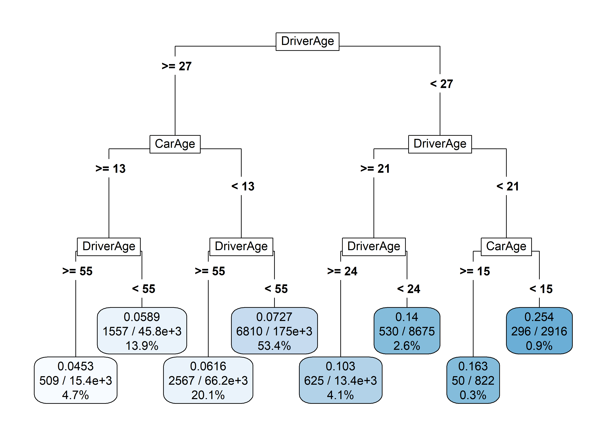
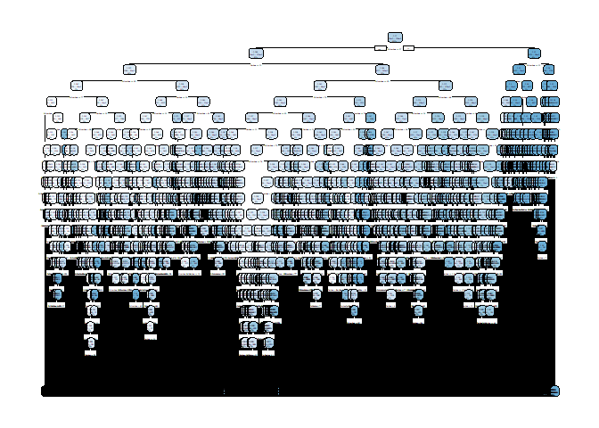
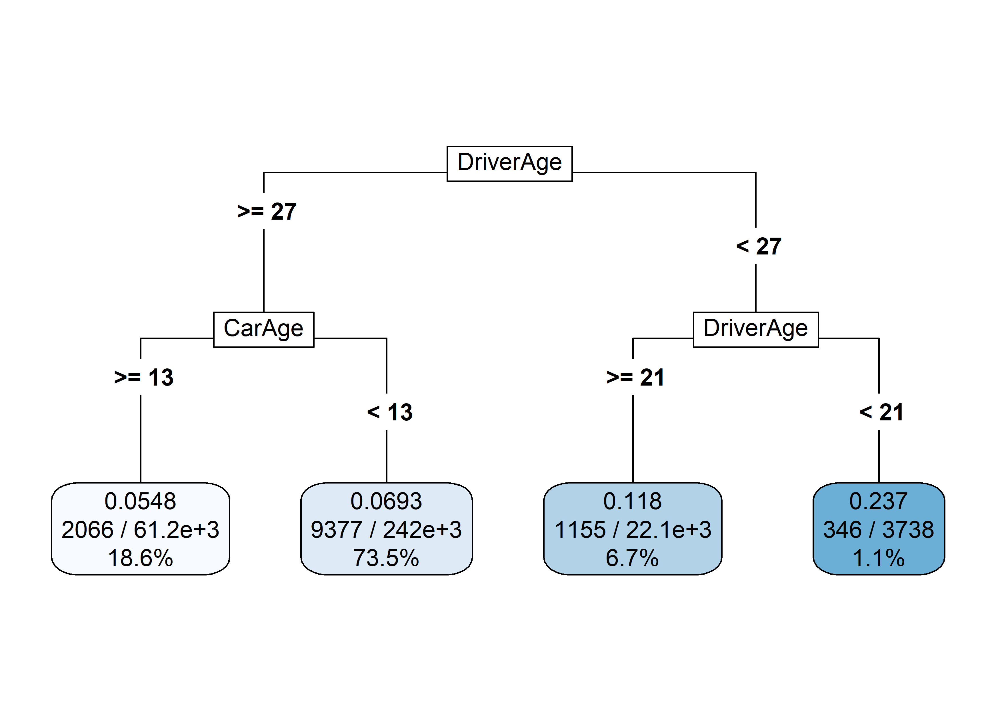
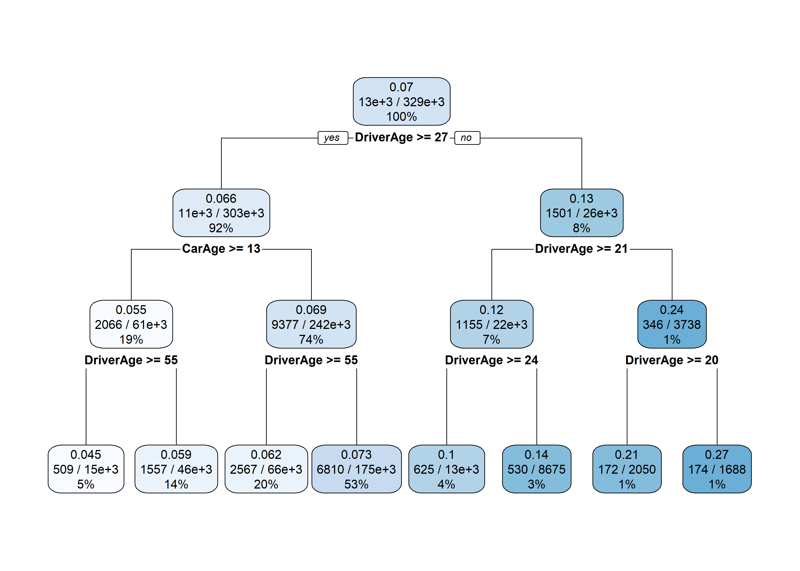
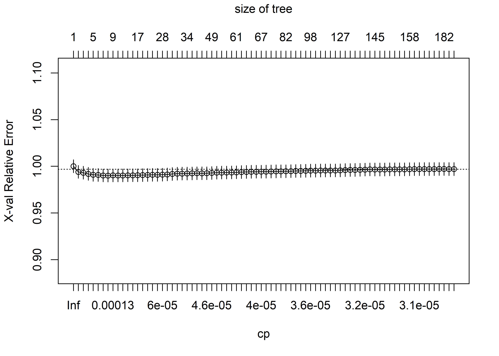
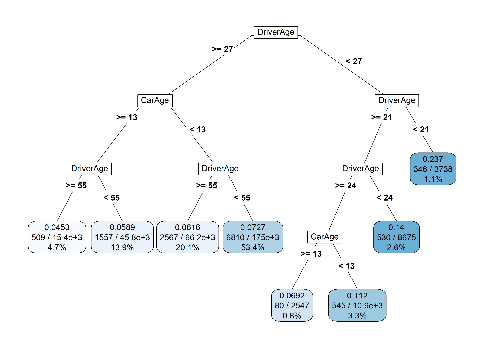
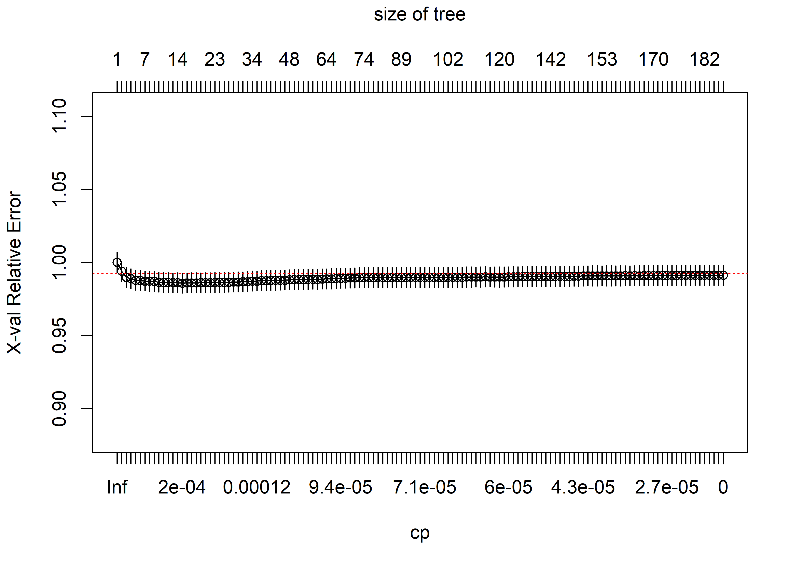
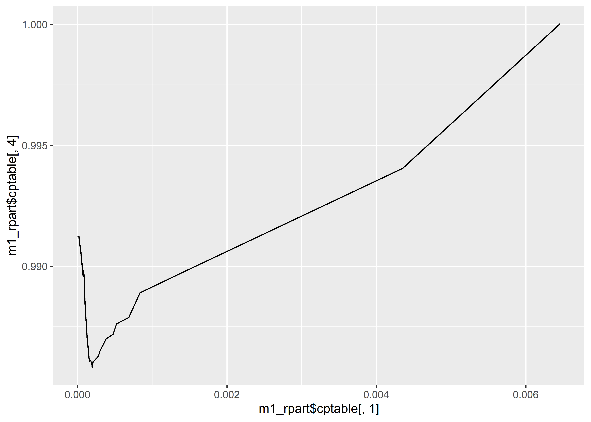
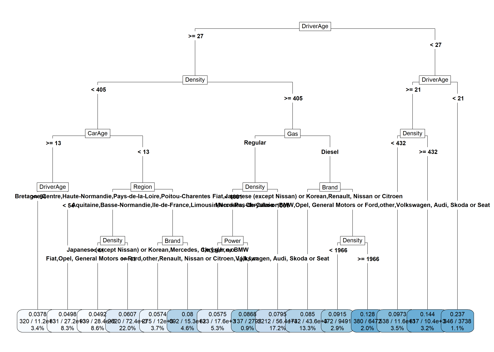
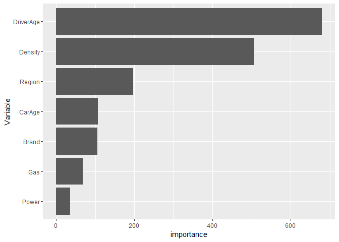

Tree-based models
================

-   [Loading the data and the
    packages](#loading-the-data-and-the-packages)
-   [CART](#cart)
    -   [Example](#example)
    -   [Cross-Validation](#cross-validation)
    -   [All covariates](#all-covariates)
-   [Bagging of trees](#bagging-of-trees)

# Loading the data and the packages

First, the packages

``` r
require("CASdatasets")
require("rpart")
require("rpart.plot")
require("caret")
```

then, the data

``` r
# data('freMTPLfreq') freMTPLfreq = subset(freMTPLfreq, Exposure<=1 & Exposure
# >= 0 & CarAge<=25) set.seed(85) folds =
# createDataPartition(freMTPLfreq$ClaimNb, 0.5) dataset =
# freMTPLfreq[folds[[1]], ]
dataset = readRDS("../dataset.RDS")
```

Let us first split out dataset in two parts: a training set and a
testing set.

``` r
set.seed(21)
in_training = createDataPartition(dataset$ClaimNb, times = 1, p = 0.8, list = FALSE)
training_set = dataset[in_training, ]
testing_set = dataset[-in_training, ]
```

# CART

The package *rpart* allows to compute regression trees. *rpart* can be
used for regression and classification. It also implements a method for
**poisson** data.

## Example

Let us start with a simple example:

``` r
m0_rpart = rpart(cbind(Exposure, ClaimNb) ~ DriverAge + CarAge, data = training_set,
    method = "poisson", control = rpart.control(cp = 0.01))
summary(m0_rpart)
```

    ## Call:
    ## rpart(formula = cbind(Exposure, ClaimNb) ~ DriverAge + CarAge, 
    ##     data = training_set, method = "poisson", control = rpart.control(cp = 0.01))
    ##   n= 328692 
    ## 
    ##            CP nsplit rel error xerror xstd
    ## 1 0.006462633      0         1      0    0
    ## 
    ## Node number 1: 328692 observations
    ##   events=12944,  estimated rate=0.07025564 , mean deviance=0.256468

It appears that the tree has a single node and has not been split
further. This comes from the complexity parameter which penalizes the
splitting. By default, the complexity parameter

is set to
,
which is often too large for Poisson data with low frequencies.

Let us put
,
but to keep a small tree we will also impose a maximum depth of
.

``` r
m0_rpart = rpart(cbind(Exposure, ClaimNb) ~ DriverAge + CarAge, data = training_set,
    method = "poisson", control = rpart.control(cp = 0, maxdepth = 3))
summary(m0_rpart)
```

    ## Call:
    ## rpart(formula = cbind(Exposure, ClaimNb) ~ DriverAge + CarAge, 
    ##     data = training_set, method = "poisson", control = rpart.control(cp = 0, 
    ##         maxdepth = 3))
    ##   n= 328692 
    ## 
    ##             CP nsplit rel error    xerror        xstd
    ## 1 0.0064626327      0 1.0000000 1.0000165 0.006849924
    ## 2 0.0013751350      1 0.9935374 0.9941993 0.006790180
    ## 3 0.0011573505      2 0.9921622 0.9930955 0.006786100
    ## 4 0.0006268552      3 0.9910049 0.9918054 0.006778356
    ## 5 0.0003327416      4 0.9903780 0.9911298 0.006771821
    ## 6 0.0003102204      5 0.9900453 0.9910272 0.006771428
    ## 7 0.0001005746      6 0.9897351 0.9906720 0.006766914
    ## 8 0.0000000000      7 0.9896345 0.9905635 0.006767021
    ## 
    ## Variable importance
    ## DriverAge    CarAge 
    ##        88        12 
    ## 
    ## Node number 1: 328692 observations,    complexity param=0.006462633
    ##   events=12944,  estimated rate=0.07025564 , mean deviance=0.256468 
    ##   left son=2 (302869 obs) right son=3 (25823 obs)
    ##   Primary splits:
    ##       DriverAge < 26.5 to the right, improve=544.79390, (0 missing)
    ##       CarAge    < 12.5 to the right, improve= 94.27821, (0 missing)
    ## 
    ## Node number 2: 302869 observations,    complexity param=0.001157351
    ##   events=11443,  estimated rate=0.06615313 , mean deviance=0.2471847 
    ##   left son=4 (61175 obs) right son=5 (241694 obs)
    ##   Primary splits:
    ##       CarAge    < 12.5 to the right, improve=97.56350, (0 missing)
    ##       DriverAge < 54.5 to the right, improve=76.38098, (0 missing)
    ## 
    ## Node number 3: 25823 observations,    complexity param=0.001375135
    ##   events=1501,  estimated rate=0.1331876 , mean deviance=0.3442522 
    ##   left son=6 (22085 obs) right son=7 (3738 obs)
    ##   Primary splits:
    ##       DriverAge < 20.5 to the right, improve=115.93870, (0 missing)
    ##       CarAge    < 4.5  to the left,  improve= 14.68241, (0 missing)
    ## 
    ## Node number 4: 61175 observations,    complexity param=0.0003327416
    ##   events=2066,  estimated rate=0.0548382 , mean deviance=0.2365854 
    ##   left son=8 (15400 obs) right son=9 (45775 obs)
    ##   Primary splits:
    ##       DriverAge < 54.5 to the right, improve=28.05002, (0 missing)
    ##       CarAge    < 17.5 to the right, improve=15.18412, (0 missing)
    ## 
    ## Node number 5: 241694 observations,    complexity param=0.0006268552
    ##   events=9377,  estimated rate=0.06930542 , mean deviance=0.2494638 
    ##   left son=10 (66211 obs) right son=11 (175483 obs)
    ##   Primary splits:
    ##       DriverAge < 54.5 to the right, improve=52.843270, (0 missing)
    ##       CarAge    < 10.5 to the right, improve= 1.787395, (0 missing)
    ## 
    ## Node number 6: 22085 observations,    complexity param=0.0003102204
    ##   events=1155,  estimated rate=0.1176422 , mean deviance=0.31826 
    ##   left son=12 (13410 obs) right son=13 (8675 obs)
    ##   Primary splits:
    ##       DriverAge < 23.5 to the right, improve=26.15309, (0 missing)
    ##       CarAge    < 13.5 to the right, improve=14.77670, (0 missing)
    ##   Surrogate splits:
    ##       CarAge < 22.5 to the left,  agree=0.608, adj=0.001, (0 split)
    ## 
    ## Node number 7: 3738 observations,    complexity param=0.0001005746
    ##   events=346,  estimated rate=0.236835 , mean deviance=0.4668084 
    ##   left son=14 (822 obs) right son=15 (2916 obs)
    ##   Primary splits:
    ##       CarAge    < 14.5 to the right, improve=8.521172, (0 missing)
    ##       DriverAge < 19.5 to the right, improve=6.852553, (0 missing)
    ## 
    ## Node number 8: 15400 observations
    ##   events=509,  estimated rate=0.04525469 , mean deviance=0.2331214 
    ## 
    ## Node number 9: 45775 observations
    ##   events=1557,  estimated rate=0.05893169 , mean deviance=0.237138 
    ## 
    ## Node number 10: 66211 observations
    ##   events=2567,  estimated rate=0.06159574 , mean deviance=0.2504668 
    ## 
    ## Node number 11: 175483 observations
    ##   events=6810,  estimated rate=0.07273823 , mean deviance=0.2487842 
    ## 
    ## Node number 12: 13410 observations
    ##   events=625,  estimated rate=0.103481 , mean deviance=0.2901859 
    ## 
    ## Node number 13: 8675 observations
    ##   events=530,  estimated rate=0.1400605 , mean deviance=0.358643 
    ## 
    ## Node number 14: 822 observations
    ##   events=50,  estimated rate=0.1634128 , mean deviance=0.3731759 
    ## 
    ## Node number 15: 2916 observations
    ##   events=296,  estimated rate=0.2544343 , mean deviance=0.4902952

The easiest way to interpret a CART is probably to plot it (if it is not
too large, though!). This can be achieved with the function *rpart.plot*
from the package *rpart.plot*.

``` r
rpart.plot(m0_rpart, type = 5, extra = 101, under = FALSE, fallen.leaves = TRUE,
    digits = 3)
```



If the tree is too large, we will probably have some overfitting. To
prevent overfitting, we can play with the complexity parameter *cp*. A
good approach is to compute the whole tree, without any penalty
(i.e. complexity parameter is set to 0) and afterwards *prune* to tree.

``` r
m0_rpart = rpart(cbind(Exposure, ClaimNb) ~ DriverAge + CarAge, data = training_set,
    method = "poisson", control = rpart.control(cp = 0))
rpart.plot(m0_rpart)
```

    ## Warning: labs do not fit even at cex 0.15, there may be some overplotting



The trees becomes too large. We can prune the tree using the function
*prune*. For instance, if we set
,

``` r
rpart.plot(prune(m0_rpart, cp = 9e-04), type = 5, extra = 101, under = FALSE, fallen.leaves = TRUE,
    digits = 3)
```



We also see that in some terminal nodes (i.e. leaves), the number of
observations (and of claims) is very low. We can set a minimum number of
observation in any terminal node using *minbucket*

``` r
m0_rpart = rpart(cbind(Exposure, ClaimNb) ~ DriverAge + CarAge, data = training_set,
    method = "poisson", control = rpart.control(cp = 0, maxdepth = 3, minbucket = 1000))
rpart.plot(m0_rpart)
```



## Cross-Validation

Let us now find the *optimal* tree, by using cross-validation. We will
again only use the variable *DriverAge* and *CarAge* in this section. By
default, rpart will perform 10-fold cross-validation, using the option
xval = 10. (Remark: The whole process of how the cross-validation is
operated in described in Section 4.2 of rpart’s vignette:
<https://cran.r-project.org/web/packages/rpart/vignettes/longintro.pdf>)

``` r
m0_rpart = rpart(cbind(Exposure, ClaimNb) ~ DriverAge + CarAge, data = training_set,
    method = "poisson", control = rpart.control(cp = 3e-05, xval = 10))
printcp(m0_rpart)
```

    ## 
    ## Rates regression tree:
    ## rpart(formula = cbind(Exposure, ClaimNb) ~ DriverAge + CarAge, 
    ##     data = training_set, method = "poisson", control = rpart.control(cp = 3e-05, 
    ##         xval = 10))
    ## 
    ## Variables actually used in tree construction:
    ## [1] CarAge    DriverAge
    ## 
    ## Root node error: 84299/328692 = 0.25647
    ## 
    ## n= 328692 
    ## 
    ##            CP nsplit rel error  xerror      xstd
    ## 1  6.4626e-03      0   1.00000 1.00003 0.0068500
    ## 2  1.3751e-03      1   0.99354 0.99402 0.0067905
    ## 3  1.1574e-03      2   0.99216 0.99309 0.0067880
    ## 4  6.2686e-04      3   0.99100 0.99191 0.0067806
    ## 5  3.3274e-04      4   0.99038 0.99091 0.0067695
    ## 6  3.1022e-04      5   0.99005 0.99070 0.0067675
    ## 7  2.1284e-04      6   0.98974 0.99015 0.0067614
    ## 8  1.4038e-04      7   0.98952 0.99005 0.0067608
    ## 9  1.2139e-04      8   0.98938 0.99025 0.0067632
    ## 10 1.2074e-04      9   0.98926 0.99020 0.0067630
    ## 11 1.0057e-04     11   0.98902 0.99020 0.0067631
    ## 12 9.6270e-05     12   0.98892 0.99030 0.0067644
    ## 13 8.4053e-05     15   0.98863 0.99037 0.0067651
    ## 14 8.1808e-05     16   0.98855 0.99042 0.0067666
    ## 15 7.8559e-05     17   0.98846 0.99055 0.0067680
    ## 16 7.0412e-05     19   0.98831 0.99075 0.0067700
    ## 17 6.6283e-05     20   0.98824 0.99085 0.0067713
    ## 18 6.1079e-05     24   0.98797 0.99088 0.0067717
    ## 19 5.8268e-05     27   0.98779 0.99106 0.0067743
    ## 20 5.4058e-05     28   0.98773 0.99126 0.0067783
    ## 21 5.1288e-05     29   0.98768 0.99181 0.0067839
    ## 22 5.0273e-05     30   0.98762 0.99210 0.0067886
    ## 23 4.9925e-05     31   0.98757 0.99217 0.0067894
    ## 24 4.8073e-05     33   0.98747 0.99223 0.0067902
    ## 25 4.7714e-05     35   0.98738 0.99240 0.0067921
    ## 26 4.6502e-05     36   0.98733 0.99256 0.0067949
    ## 27 4.6344e-05     40   0.98713 0.99252 0.0067961
    ## 28 4.6192e-05     42   0.98703 0.99258 0.0067971
    ## 29 4.5242e-05     48   0.98674 0.99289 0.0068004
    ## 30 4.4525e-05     53   0.98652 0.99319 0.0068040
    ## 31 4.4492e-05     55   0.98643 0.99329 0.0068046
    ## 32 4.3932e-05     57   0.98634 0.99331 0.0068052
    ## 33 4.3542e-05     59   0.98625 0.99343 0.0068061
    ## 34 4.2898e-05     60   0.98621 0.99357 0.0068079
    ## 35 4.2262e-05     61   0.98616 0.99384 0.0068107
    ## 36 4.0081e-05     62   0.98612 0.99399 0.0068122
    ## 37 4.0055e-05     63   0.98608 0.99415 0.0068144
    ## 38 3.9998e-05     65   0.98600 0.99418 0.0068146
    ## 39 3.9919e-05     66   0.98596 0.99422 0.0068148
    ## 40 3.9307e-05     67   0.98592 0.99430 0.0068158
    ## 41 3.8898e-05     72   0.98570 0.99442 0.0068168
    ## 42 3.8644e-05     74   0.98563 0.99456 0.0068181
    ## 43 3.8431e-05     80   0.98540 0.99462 0.0068186
    ## 44 3.7872e-05     81   0.98536 0.99469 0.0068187
    ## 45 3.7232e-05     89   0.98504 0.99480 0.0068204
    ## 46 3.6437e-05     90   0.98501 0.99500 0.0068231
    ## 47 3.6379e-05     93   0.98490 0.99505 0.0068236
    ## 48 3.5700e-05     94   0.98486 0.99523 0.0068255
    ## 49 3.5516e-05     97   0.98475 0.99538 0.0068268
    ## 50 3.5412e-05     99   0.98468 0.99537 0.0068267
    ## 51 3.5039e-05    103   0.98454 0.99546 0.0068281
    ## 52 3.4827e-05    104   0.98451 0.99549 0.0068291
    ## 53 3.4762e-05    109   0.98433 0.99554 0.0068300
    ## 54 3.4528e-05    117   0.98405 0.99557 0.0068303
    ## 55 3.3898e-05    126   0.98371 0.99569 0.0068320
    ## 56 3.3539e-05    130   0.98357 0.99598 0.0068360
    ## 57 3.3366e-05    131   0.98354 0.99605 0.0068366
    ## 58 3.3340e-05    133   0.98347 0.99613 0.0068373
    ## 59 3.2688e-05    134   0.98344 0.99630 0.0068395
    ## 60 3.2282e-05    137   0.98334 0.99647 0.0068423
    ## 61 3.2223e-05    141   0.98320 0.99666 0.0068447
    ## 62 3.2012e-05    144   0.98311 0.99662 0.0068443
    ## 63 3.1876e-05    145   0.98308 0.99662 0.0068446
    ## 64 3.1862e-05    147   0.98301 0.99662 0.0068445
    ## 65 3.1779e-05    149   0.98295 0.99667 0.0068449
    ## 66 3.1665e-05    150   0.98292 0.99667 0.0068449
    ## 67 3.1632e-05    151   0.98288 0.99666 0.0068452
    ## 68 3.1239e-05    152   0.98285 0.99671 0.0068455
    ## 69 3.0696e-05    157   0.98269 0.99682 0.0068487
    ## 70 3.0644e-05    161   0.98257 0.99696 0.0068505
    ## 71 3.0455e-05    165   0.98245 0.99697 0.0068505
    ## 72 3.0231e-05    167   0.98239 0.99704 0.0068513
    ## 73 3.0230e-05    168   0.98236 0.99703 0.0068510
    ## 74 3.0207e-05    175   0.98214 0.99704 0.0068511
    ## 75 3.0110e-05    179   0.98201 0.99710 0.0068519
    ## 76 3.0072e-05    181   0.98195 0.99710 0.0068519
    ## 77 3.0020e-05    189   0.98171 0.99707 0.0068516
    ## 78 3.0000e-05    191   0.98165 0.99707 0.0068516

We extract the optimal complexity parameter.

``` r
plotcp(m0_rpart)
```



Let us see the optimal tree.

``` r
cp_star = m0_rpart$cptable[which.min(m0_rpart$cptable[, 4]), 1]

rpart.plot(prune(m0_rpart, cp = cp_star), type = 5, extra = 101, under = FALSE, fallen.leaves = FALSE,
    digits = 3)
```



## All covariates

Let us now include all the covariates.

``` r
m1_rpart = rpart(cbind(Exposure, ClaimNb) ~ Power + CarAge + DriverAge + Brand +
    Gas + Region + Density, data = training_set, method = "poisson", control = rpart.control(cp = 0,
    xval = 10, minbucket = 1000))
printcp(m1_rpart)
```

    ## 
    ## Rates regression tree:
    ## rpart(formula = cbind(Exposure, ClaimNb) ~ Power + CarAge + DriverAge + 
    ##     Brand + Gas + Region + Density, data = training_set, method = "poisson", 
    ##     control = rpart.control(cp = 0, xval = 10, minbucket = 1000))
    ## 
    ## Variables actually used in tree construction:
    ## [1] Brand     CarAge    Density   DriverAge Gas       Power     Region   
    ## 
    ## Root node error: 84299/328692 = 0.25647
    ## 
    ## n= 328692 
    ## 
    ##             CP nsplit rel error  xerror      xstd
    ## 1   6.4626e-03      0   1.00000 1.00003 0.0068502
    ## 2   4.3514e-03      1   0.99354 0.99405 0.0067910
    ## 3   1.3751e-03      2   0.98919 0.98970 0.0067493
    ## 4   8.3749e-04      3   0.98781 0.98890 0.0067456
    ## 5   6.8456e-04      4   0.98697 0.98788 0.0067426
    ## 6   5.2298e-04      5   0.98629 0.98762 0.0067413
    ## 7   4.7610e-04      6   0.98577 0.98718 0.0067388
    ## 8   4.4572e-04      7   0.98529 0.98713 0.0067375
    ## 9   3.8233e-04      8   0.98484 0.98700 0.0067337
    ## 10  2.9440e-04      9   0.98446 0.98646 0.0067313
    ## 11  2.8062e-04     10   0.98417 0.98628 0.0067344
    ## 12  2.7166e-04     11   0.98389 0.98625 0.0067347
    ## 13  2.1860e-04     12   0.98361 0.98607 0.0067342
    ## 14  2.0751e-04     13   0.98340 0.98607 0.0067351
    ## 15  1.9694e-04     14   0.98319 0.98581 0.0067342
    ## 16  1.8989e-04     15   0.98299 0.98601 0.0067367
    ## 17  1.8985e-04     17   0.98261 0.98598 0.0067371
    ## 18  1.8601e-04     18   0.98242 0.98598 0.0067371
    ## 19  1.7769e-04     19   0.98224 0.98612 0.0067375
    ## 20  1.6268e-04     20   0.98206 0.98609 0.0067373
    ## 21  1.6045e-04     21   0.98190 0.98605 0.0067384
    ## 22  1.5352e-04     22   0.98174 0.98618 0.0067405
    ## 23  1.4807e-04     24   0.98143 0.98641 0.0067445
    ## 24  1.4659e-04     25   0.98128 0.98631 0.0067455
    ## 25  1.4407e-04     26   0.98113 0.98641 0.0067472
    ## 26  1.4228e-04     27   0.98099 0.98656 0.0067490
    ## 27  1.4202e-04     30   0.98056 0.98657 0.0067487
    ## 28  1.3842e-04     31   0.98042 0.98672 0.0067497
    ## 29  1.3315e-04     32   0.98028 0.98674 0.0067503
    ## 30  1.2456e-04     33   0.98015 0.98723 0.0067568
    ## 31  1.2273e-04     34   0.98002 0.98725 0.0067596
    ## 32  1.2066e-04     35   0.97990 0.98745 0.0067639
    ## 33  1.1524e-04     36   0.97978 0.98750 0.0067646
    ## 34  1.1474e-04     37   0.97967 0.98768 0.0067662
    ## 35  1.1243e-04     40   0.97932 0.98778 0.0067693
    ## 36  1.1229e-04     42   0.97909 0.98784 0.0067706
    ## 37  1.1198e-04     43   0.97898 0.98784 0.0067706
    ## 38  1.0714e-04     47   0.97853 0.98808 0.0067729
    ## 39  1.0319e-04     49   0.97832 0.98831 0.0067763
    ## 40  1.0257e-04     51   0.97811 0.98830 0.0067764
    ## 41  1.0219e-04     52   0.97801 0.98826 0.0067764
    ## 42  1.0154e-04     56   0.97759 0.98836 0.0067771
    ## 43  1.0035e-04     57   0.97749 0.98848 0.0067777
    ## 44  9.9123e-05     58   0.97739 0.98848 0.0067783
    ## 45  9.8518e-05     60   0.97719 0.98862 0.0067796
    ## 46  9.8385e-05     63   0.97689 0.98866 0.0067805
    ## 47  9.5185e-05     64   0.97679 0.98873 0.0067813
    ## 48  9.4716e-05     65   0.97670 0.98897 0.0067859
    ## 49  9.3310e-05     66   0.97660 0.98912 0.0067881
    ## 50  9.2161e-05     67   0.97651 0.98925 0.0067887
    ## 51  9.2131e-05     68   0.97642 0.98933 0.0067893
    ## 52  9.0483e-05     69   0.97633 0.98938 0.0067909
    ## 53  8.8080e-05     70   0.97623 0.98950 0.0067938
    ## 54  8.7574e-05     73   0.97597 0.98963 0.0067955
    ## 55  8.7510e-05     74   0.97588 0.98964 0.0067954
    ## 56  8.4752e-05     76   0.97571 0.98963 0.0067961
    ## 57  8.2477e-05     77   0.97562 0.98975 0.0067980
    ## 58  7.9693e-05     78   0.97554 0.98963 0.0067983
    ## 59  7.9347e-05     81   0.97530 0.98957 0.0067984
    ## 60  7.8490e-05     85   0.97498 0.98962 0.0067979
    ## 61  7.5804e-05     86   0.97491 0.98967 0.0067983
    ## 62  7.3352e-05     88   0.97475 0.98963 0.0067983
    ## 63  7.2257e-05     89   0.97468 0.98972 0.0067990
    ## 64  7.1960e-05     90   0.97461 0.98981 0.0068000
    ## 65  7.1906e-05     93   0.97439 0.98980 0.0068000
    ## 66  7.1651e-05     94   0.97432 0.98983 0.0068000
    ## 67  7.1248e-05     96   0.97418 0.98981 0.0067997
    ## 68  7.1161e-05     97   0.97411 0.98983 0.0068003
    ## 69  6.9819e-05     98   0.97404 0.98969 0.0067983
    ## 70  6.9739e-05     99   0.97397 0.98974 0.0067986
    ## 71  6.8798e-05    100   0.97390 0.98973 0.0067993
    ## 72  6.7536e-05    101   0.97383 0.98974 0.0067997
    ## 73  6.6512e-05    102   0.97376 0.98983 0.0068010
    ## 74  6.6462e-05    103   0.97369 0.98986 0.0068010
    ## 75  6.3150e-05    104   0.97363 0.98985 0.0068009
    ## 76  6.2602e-05    106   0.97350 0.98996 0.0068029
    ## 77  6.2347e-05    107   0.97344 0.98998 0.0068030
    ## 78  6.1860e-05    108   0.97338 0.99000 0.0068032
    ## 79  6.1721e-05    111   0.97319 0.99001 0.0068034
    ## 80  6.1719e-05    112   0.97313 0.99010 0.0068043
    ## 81  6.1004e-05    114   0.97300 0.99004 0.0068035
    ## 82  6.0959e-05    117   0.97282 0.99002 0.0068033
    ## 83  6.0768e-05    119   0.97270 0.99002 0.0068033
    ## 84  6.0606e-05    121   0.97258 0.99002 0.0068033
    ## 85  5.9010e-05    124   0.97240 0.99007 0.0068043
    ## 86  5.8816e-05    126   0.97228 0.99009 0.0068043
    ## 87  5.6879e-05    127   0.97222 0.99021 0.0068054
    ## 88  5.6175e-05    129   0.97211 0.99035 0.0068063
    ## 89  5.4762e-05    131   0.97199 0.99036 0.0068063
    ## 90  5.4274e-05    133   0.97188 0.99031 0.0068063
    ## 91  5.3731e-05    135   0.97177 0.99029 0.0068064
    ## 92  5.2445e-05    139   0.97156 0.99024 0.0068066
    ## 93  5.1946e-05    140   0.97151 0.99032 0.0068073
    ## 94  5.1429e-05    141   0.97146 0.99029 0.0068072
    ## 95  5.0994e-05    142   0.97140 0.99040 0.0068086
    ## 96  4.7702e-05    143   0.97135 0.99044 0.0068089
    ## 97  4.7492e-05    144   0.97131 0.99045 0.0068090
    ## 98  4.7079e-05    145   0.97126 0.99044 0.0068084
    ## 99  4.4908e-05    146   0.97121 0.99055 0.0068097
    ## 100 4.4137e-05    147   0.97117 0.99061 0.0068111
    ## 101 4.1810e-05    148   0.97112 0.99070 0.0068113
    ## 102 4.1082e-05    149   0.97108 0.99078 0.0068125
    ## 103 4.0846e-05    150   0.97104 0.99077 0.0068126
    ## 104 4.0451e-05    151   0.97100 0.99073 0.0068123
    ## 105 4.0295e-05    152   0.97096 0.99073 0.0068123
    ## 106 3.7460e-05    155   0.97084 0.99081 0.0068135
    ## 107 3.7366e-05    157   0.97076 0.99080 0.0068136
    ## 108 3.7302e-05    158   0.97072 0.99080 0.0068136
    ## 109 3.7234e-05    159   0.97069 0.99080 0.0068136
    ## 110 3.5867e-05    161   0.97061 0.99084 0.0068139
    ## 111 3.5196e-05    163   0.97054 0.99080 0.0068141
    ## 112 3.4799e-05    164   0.97051 0.99084 0.0068148
    ## 113 3.3286e-05    165   0.97047 0.99083 0.0068150
    ## 114 3.2114e-05    166   0.97044 0.99089 0.0068158
    ## 115 2.9743e-05    167   0.97041 0.99090 0.0068164
    ## 116 2.9719e-05    169   0.97035 0.99097 0.0068172
    ## 117 2.9135e-05    170   0.97032 0.99099 0.0068174
    ## 118 2.6928e-05    171   0.97029 0.99101 0.0068179
    ## 119 2.6240e-05    173   0.97023 0.99103 0.0068186
    ## 120 2.4691e-05    174   0.97021 0.99106 0.0068188
    ## 121 2.0154e-05    175   0.97018 0.99113 0.0068198
    ## 122 1.9880e-05    176   0.97016 0.99121 0.0068208
    ## 123 1.9549e-05    177   0.97014 0.99122 0.0068209
    ## 124 1.8139e-05    178   0.97012 0.99122 0.0068209
    ## 125 1.7866e-05    179   0.97010 0.99123 0.0068210
    ## 126 1.7171e-05    180   0.97009 0.99123 0.0068210
    ## 127 1.3957e-05    181   0.97007 0.99122 0.0068209
    ## 128 1.3164e-05    182   0.97006 0.99121 0.0068209
    ## 129 1.0606e-05    183   0.97004 0.99121 0.0068209
    ## 130 5.0082e-06    184   0.97003 0.99122 0.0068209
    ## 131 0.0000e+00    185   0.97003 0.99122 0.0068209

We can plot the errors

``` r
require(ggplot2)
plotcp(x = m1_rpart, minline = TRUE, col = "red")
```



``` r
ggplot() + geom_line(aes(x = m1_rpart$cptable[, 1], y = m1_rpart$cptable[, 4]))
```



If we take the value of cp that minimizes the error, we find

``` r
cp_star = m1_rpart$cptable[which.min(m1_rpart$cptable[, 4]), 1]
cp_star
```

    ## [1] 0.0001969433

Let us plot the optimal tree

``` r
m2_rpart = prune(m1_rpart, cp = cp_star)
rpart.plot(m2_rpart, type = 5, extra = 101, under = FALSE, fallen.leaves = TRUE,
    digits = 3, cex = 0.5)
```



There is a possibility to extract a variable importance metric.

``` r
plotdata = data.frame(m2_rpart$variable.importance)
names(plotdata) = 'importance'
plotdata$var = rownames(plotdata)

ggplot(plotdata,aes(x =reorder(var,importance), y=importance)) + geom_bar(stat='identity')+coord_flip()+
  scale_x_discrete(name="Variable")
```

<!-- -->

Finally, let us compute the deviance on the testing_set.

``` r
deviance_poisson = function(x_obs, x_pred) {
    2 * (sum(dpois(x = x_obs, lambda = x_obs, log = TRUE)) - sum(dpois(x = x_obs,
        lambda = x_pred, log = TRUE)))
}

deviance_poisson(x_obs = testing_set$ClaimNb, x_pred = predict(m2_rpart, testing_set) *
    testing_set$Exposure)
```

    ## [1] 20511.47

If we compute the deviance on the full tree (not the pruned tree), we
obtain

``` r
deviance_poisson(x_obs = testing_set$ClaimNb, x_pred = predict(m1_rpart, testing_set) *
    testing_set$Exposure)
```

    ## [1] 20661.82

# Bagging of trees

Let us create the bootstrap samples.

``` r
set.seed(85)
bootstrap_samples = createResample(training_set$ClaimNb, times = 50)
```

For each sample, we estimate a CART with the optimal complexity
parameter found previously. Each tree, gives us an estimation of the
claim frequency, which we average.

``` r
bagg_cart = lapply(bootstrap_samples, function(X) {
    rpart(cbind(Exposure, ClaimNb) ~ Power + CarAge + DriverAge + Brand + Gas + Region +
        Density, data = training_set[X, ], method = "poisson", control = rpart.control(cp = cp_star,
        xval = 0))
})
```

``` r
pred = lapply(bagg_cart, function(X) {
    predict(X, testing_set) * testing_set$Exposure
})

pred = do.call(cbind, pred)
pred = apply(pred, 1, mean)
```

``` r
deviance_poisson(x_obs = testing_set$ClaimNb, x_pred = pred)
```

    ## [1] 20448.69
