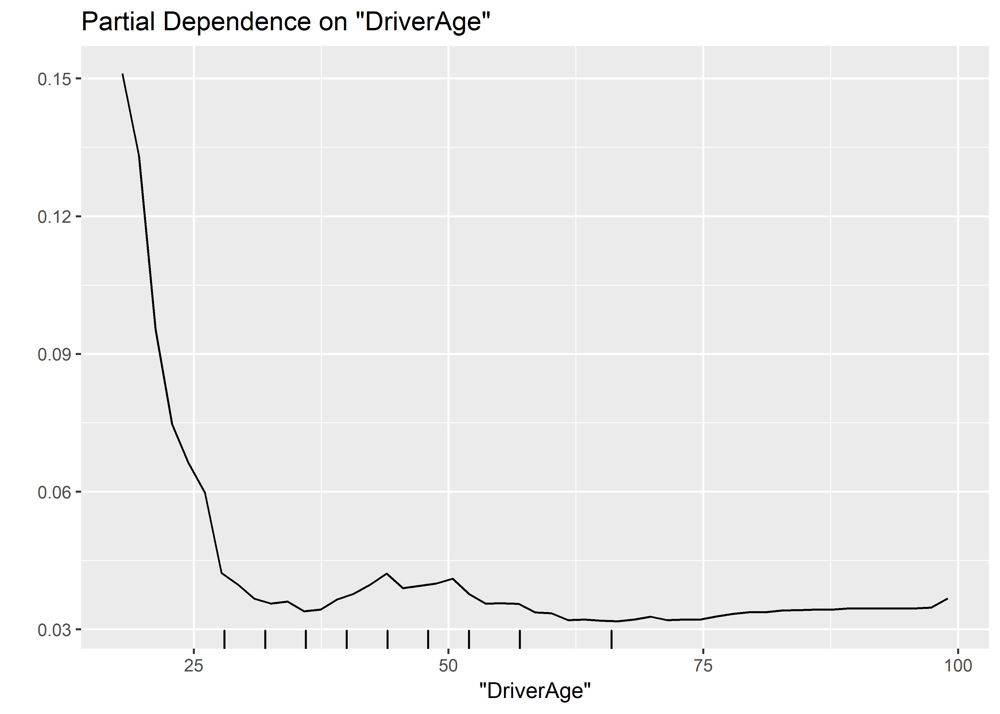
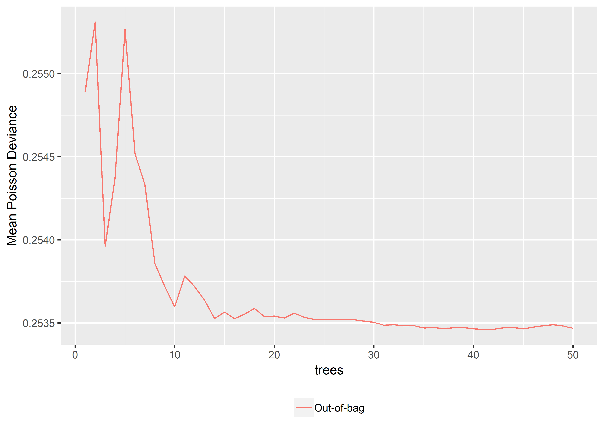
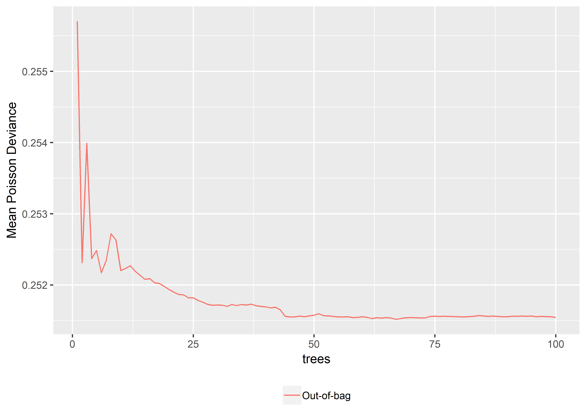
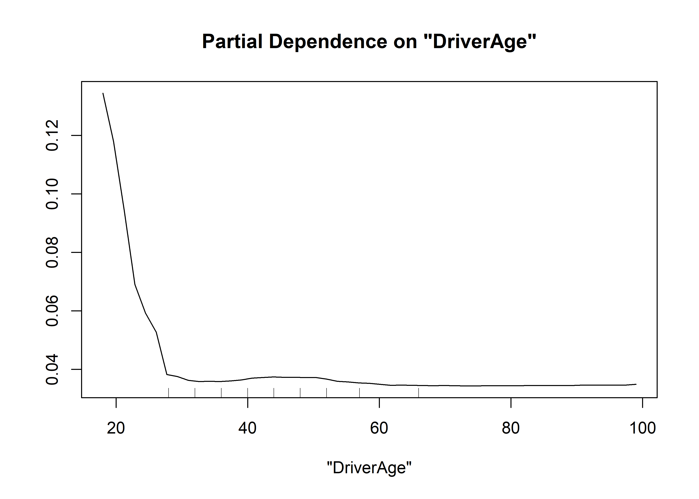
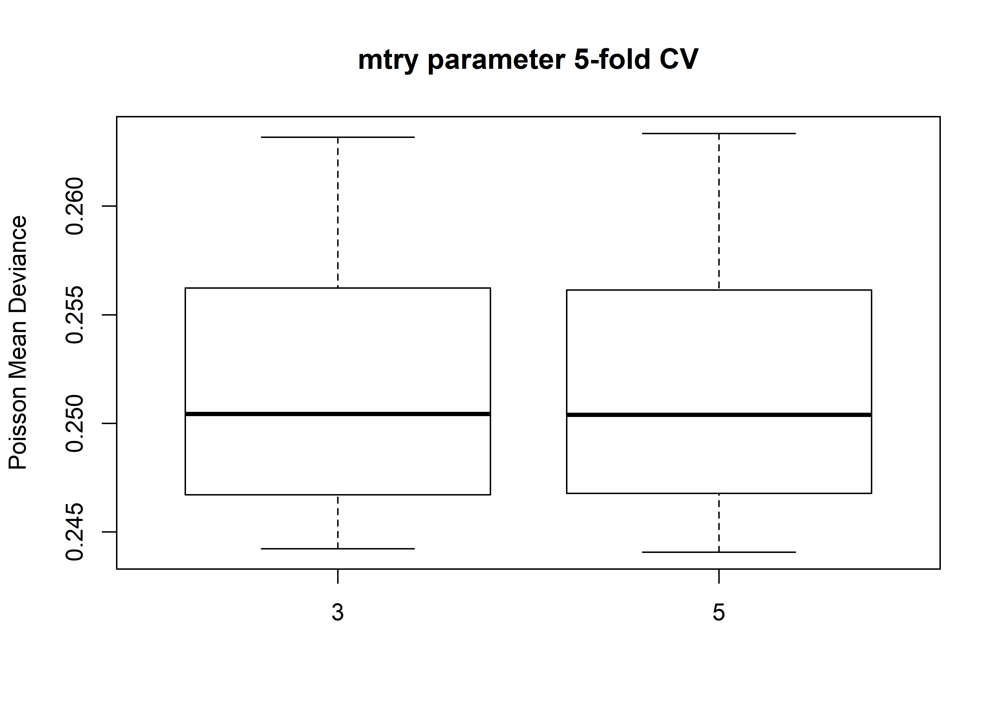
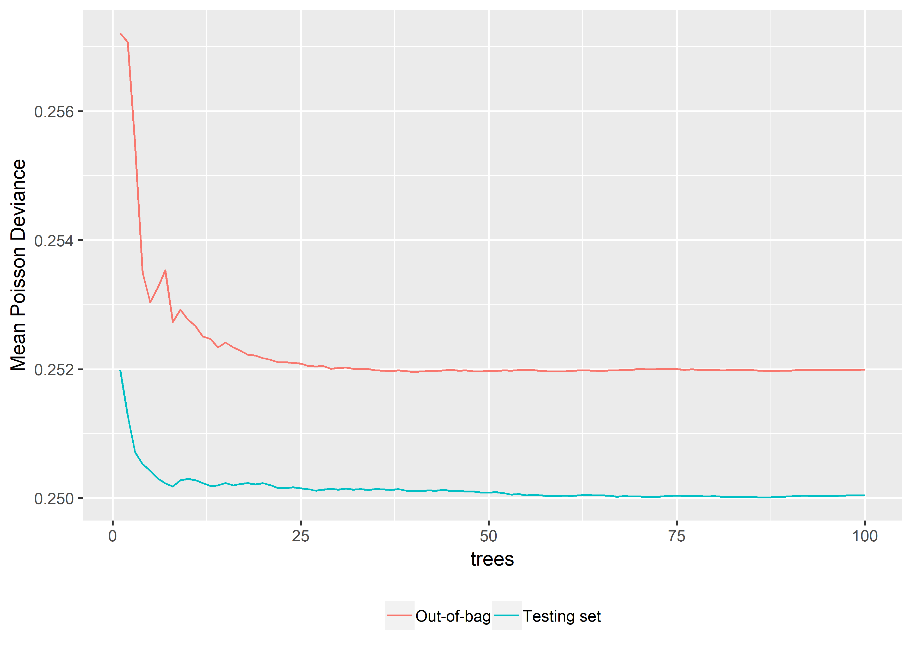
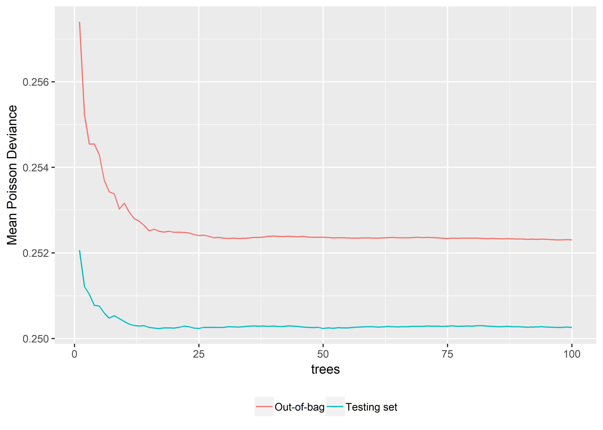
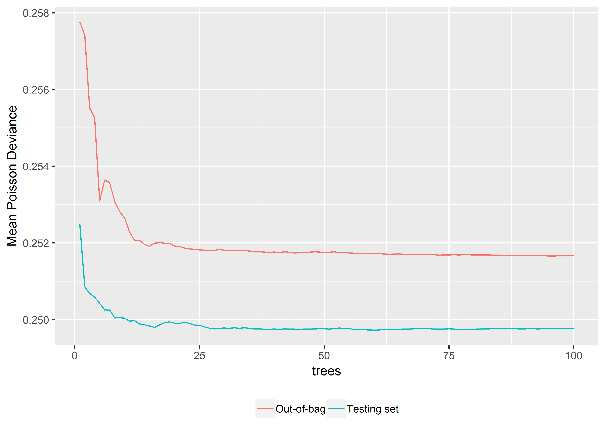

Random Forest
================

-   [Loading the data and the packages](#loading-the-data-and-the-packages)

Loading the data and the packages
=================================

First, the packages

``` r
require("CASdatasets")
require("rfCountData")
require("caret")
```

then, the data

``` r
# data("freMTPLfreq")
# freMTPLfreq = subset(freMTPLfreq, Exposure<=1 & Exposure >= 0 & CarAge<=25)
# 
# set.seed(85)
# folds = createDataPartition(freMTPLfreq$ClaimNb, 0.5)
# dataset = freMTPLfreq[folds[[1]], ]
load("../dataset.RData")
```

Let us first split out dataset in two parts: a training set and a testing set.

``` r
set.seed(21)
in_training = createDataPartition(dataset$ClaimNb, times = 1, p = 0.8, list=FALSE)
training_set = dataset[in_training,]
testing_set  = dataset[-in_training,]
```

The package *randomForest* allows to perform regression and classification. However, the split criterion in the regression case is based on the MSE, which may not be relevant for count data. Moreover, it did not allow the inclusion of an offset to take into account the different exposures of the policyholders.

The package *rfCountData* tries to correct these issues. It is to be used only on count data.

``` r
require(rfCountData)
```

The use of the package is similar to the randomForest. Here, the main function is called *rfPoisson*.

``` r
set.seed(5)
m0_rf = rfPoisson(x = training_set[, c("DriverAge", "CarAge")], offset = log(training_set$Exposure), 
    y = training_set$ClaimNb, ntree = 50, nodesize = 4000, mtry = 2, importance = TRUE)
importance(m0_rf)
```

    ##           %IncLossFunction
    ## DriverAge      0.002597522
    ## CarAge         0.000278877

If we want some idea of the marginal effect of the variables, we can use the partial dependence plots

``` r
par(mfrow = c(1, 2))
partialPlot(m0_rf, training_set, offset = log(training_set$Exposure), x.var = "DriverAge")
partialPlot(m0_rf, training_set, offset = log(training_set$Exposure), x.var = "CarAge")
```



We can see the deviance (on the training\_set) as a function of the number of trees

``` r
plot(m0_rf)
```



With only very few trees, we clearly have overfitting. After a few iterations, the error will stabilize.

Let's use all the variables and decrease the nodesize to 2500.

``` r
set.seed(5)
m1_rf = rfPoisson(x = training_set[, 4:10], offset = log(training_set$Exposure), 
    y = training_set$ClaimNb, ntree = 100, nodesize = 2500, mtry = 3, importance = TRUE, 
    do.trace = TRUE)
```

    ##      |      Out-of-bag   |
    ## Tree |Loss Function  |
    ##    1 |  0.06028 |
    ##    2 |  0.09762 |
    ##    3 |   0.1223 |
    ##    4 |   0.1367 |
    ##    5 |   0.1462 |
    ##    6 |   0.1521 |
    ##    7 |   0.1561 |
    ##    8 |   0.1588 |
    ##    9 |   0.1602 |
    ##   10 |   0.1609 |
    ##   11 |   0.1616 |
    ##   12 |    0.162 |
    ##   13 |   0.1622 |
    ##   14 |   0.1623 |
    ##   15 |   0.1624 |
    ##   16 |   0.1624 |
    ##   17 |   0.1625 |
    ##   18 |   0.1625 |
    ##   19 |   0.1625 |
    ##   20 |   0.1625 |
    ##   21 |   0.1624 |
    ##   22 |   0.1624 |
    ##   23 |   0.1624 |
    ##   24 |   0.1624 |
    ##   25 |   0.1624 |
    ##   26 |   0.1624 |
    ##   27 |   0.1624 |
    ##   28 |   0.1624 |
    ##   29 |   0.1624 |
    ##   30 |   0.1624 |
    ##   31 |   0.1624 |
    ##   32 |   0.1624 |
    ##   33 |   0.1624 |
    ##   34 |   0.1624 |
    ##   35 |   0.1624 |
    ##   36 |   0.1624 |
    ##   37 |   0.1624 |
    ##   38 |   0.1624 |
    ##   39 |   0.1624 |
    ##   40 |   0.1624 |
    ##   41 |   0.1623 |
    ##   42 |   0.1623 |
    ##   43 |   0.1623 |
    ##   44 |   0.1623 |
    ##   45 |   0.1623 |
    ##   46 |   0.1623 |
    ##   47 |   0.1623 |
    ##   48 |   0.1623 |
    ##   49 |   0.1623 |
    ##   50 |   0.1623 |
    ##   51 |   0.1623 |
    ##   52 |   0.1623 |
    ##   53 |   0.1623 |
    ##   54 |   0.1623 |
    ##   55 |   0.1623 |
    ##   56 |   0.1623 |
    ##   57 |   0.1623 |
    ##   58 |   0.1623 |
    ##   59 |   0.1623 |
    ##   60 |   0.1623 |
    ##   61 |   0.1623 |
    ##   62 |   0.1623 |
    ##   63 |   0.1623 |
    ##   64 |   0.1623 |
    ##   65 |   0.1623 |
    ##   66 |   0.1623 |
    ##   67 |   0.1623 |
    ##   68 |   0.1623 |
    ##   69 |   0.1623 |
    ##   70 |   0.1623 |
    ##   71 |   0.1623 |
    ##   72 |   0.1623 |
    ##   73 |   0.1623 |
    ##   74 |   0.1623 |
    ##   75 |   0.1623 |
    ##   76 |   0.1623 |
    ##   77 |   0.1623 |
    ##   78 |   0.1623 |
    ##   79 |   0.1623 |
    ##   80 |   0.1623 |
    ##   81 |   0.1623 |
    ##   82 |   0.1623 |
    ##   83 |   0.1623 |
    ##   84 |   0.1623 |
    ##   85 |   0.1623 |
    ##   86 |   0.1623 |
    ##   87 |   0.1623 |
    ##   88 |   0.1623 |
    ##   89 |   0.1623 |
    ##   90 |   0.1623 |
    ##   91 |   0.1623 |
    ##   92 |   0.1623 |
    ##   93 |   0.1623 |
    ##   94 |   0.1623 |
    ##   95 |   0.1623 |
    ##   96 |   0.1623 |
    ##   97 |   0.1623 |
    ##   98 |   0.1623 |
    ##   99 |   0.1623 |
    ##  100 |   0.1623 |

We can again see the error as a function of the number of trees

``` r
plot(m1_rf, ylim=c(0.16,0.17))
```



We can also plot the variable importance.

``` r
importance(m1_rf)
```

    ##           %IncLossFunction
    ## Power         2.429051e-04
    ## CarAge        1.827826e-04
    ## DriverAge     2.168070e-03
    ## Brand         9.462613e-05
    ## Gas           1.658425e-04
    ## Region       -6.395475e-05
    ## Density       1.105911e-03

and the partial dependences, for instance, for the Age of the Driver.

``` r
partialPlot(x = m1_rf, pred.data = training_set[, 4:10], offset = log(training_set$Exposure), 
    x.var = "DriverAge")
```



``` r
2*(sum(dpois(x = testing_set$ClaimNb, lambda = testing_set$ClaimNb,log=TRUE))-
  sum(dpois(x = testing_set$ClaimNb, lambda = predict(m1_rf, testing_set[,4:10], log(testing_set$Exposure)),
            log=TRUE)))
```

    ## [1] 10262.27

We could rely on cross-validation to find the optimal mtry parameter. We are only going to compare two different mtry parameter (due to the time limitation).

For mtry = 3,

``` r
set.seed(6)
folds = createFolds(training_set$ClaimNb, k = 5)
require(parallel)
```

    ## Loading required package: parallel

``` r
cl = makeCluster(5)
clusterExport(cl, "training_set")
set.seed(859)
res0 = parLapply(cl, folds, function(X) {
    require(rfCountData)
    m_cv = rfPoisson(x = training_set[-X, 4:10], offset = log(training_set[-X, 
        ]$Exposure), y = training_set[-X, ]$ClaimNb, xtest = training_set[X, 
        4:10], offsettest = log(training_set[X, ]$Exposure), ytest = training_set[X, 
        ]$ClaimNb, ntree = 100, nodesize = 10000, mtry = 3, importance = TRUE, 
        do.trace = FALSE, keep.forest = FALSE)
    pred = m_cv$test$predicted
    2 * (sum(dpois(x = training_set[X, ]$ClaimNb, lambda = training_set[X, ]$ClaimNb, 
        log = TRUE)) - sum(dpois(x = training_set[X, ]$ClaimNb, lambda = pred, 
        log = TRUE)))/nrow(training_set[X, ])
})
stopCluster(cl)
```

For mtry = 5,

``` r
set.seed(6)
folds = createFolds(training_set$ClaimNb, k = 5)
require(parallel)
cl = makeCluster(5)
clusterExport(cl, "training_set")
set.seed(256)
res1 = parLapply(cl, folds, function(X) {
    require(rfCountData)
    m_cv = rfPoisson(x = training_set[-X, 4:10], offset = log(training_set[-X, 
        ]$Exposure), y = training_set[-X, ]$ClaimNb, xtest = training_set[X, 
        4:10], offsettest = log(training_set[X, ]$Exposure), ytest = training_set[X, 
        ]$ClaimNb, ntree = 100, nodesize = 10000, mtry = 5, importance = TRUE, 
        do.trace = FALSE, keep.forest = FALSE)
    pred = m_cv$test$predicted
    2 * (sum(dpois(x = training_set[X, ]$ClaimNb, lambda = training_set[X, ]$ClaimNb, 
        log = TRUE)) - sum(dpois(x = training_set[X, ]$ClaimNb, lambda = pred, 
        log = TRUE)))/nrow(training_set[X, ])
})
stopCluster(cl)
```

We obtain the following results:

``` r
boxplot(cbind(unlist(res0), unlist(res1)), names=c(3,5), main="mtry parameter 5-fold CV", ylab="Poisson Mean Deviance")
```



``` r
apply(cbind(unlist(res0), unlist(res1)), 2,mean)
```

    ## [1] 0.2521383 0.2521279

Let us now construct the whole forest on the whole training\_set with the optimal mtry = 3.

``` r
set.seed(43)
m_final_1 = rfPoisson(x = training_set[, 4:10], offset = log(training_set$Exposure), 
    y = training_set$ClaimNb, xtest = testing_set[, 4:10], offsettest = log(testing_set$Exposure), 
    ytest = testing_set$ClaimNb, ntree = 100, nodesize = 10000, mtry = 3, importance = TRUE, 
    do.trace = TRUE, keep.forest = TRUE)
```

    ##      |      Out-of-bag   | Test set    |
    ## Tree |Loss Function  |Loss Function  |
    ##    1 |  0.06111 |   0.1624 |
    ##    2 |  0.09967 |   0.1621 |
    ##    3 |   0.1231 |   0.1618 |
    ##    4 |   0.1374 |   0.1617 |
    ##    5 |   0.1469 |   0.1616 |
    ##    6 |   0.1529 |   0.1616 |
    ##    7 |   0.1569 |   0.1615 |
    ##    8 |   0.1589 |   0.1615 |
    ##    9 |   0.1605 |   0.1616 |
    ##   10 |   0.1613 |   0.1616 |
    ##   11 |   0.1619 |   0.1616 |
    ##   12 |   0.1622 |   0.1615 |
    ##   13 |   0.1624 |   0.1615 |
    ##   14 |   0.1624 |   0.1615 |
    ##   15 |   0.1626 |   0.1615 |
    ##   16 |   0.1626 |   0.1615 |
    ##   17 |   0.1626 |   0.1615 |
    ##   18 |   0.1626 |   0.1615 |
    ##   19 |   0.1626 |   0.1615 |
    ##   20 |   0.1626 |   0.1615 |
    ##   21 |   0.1626 |   0.1615 |
    ##   22 |   0.1626 |   0.1615 |
    ##   23 |   0.1626 |   0.1615 |
    ##   24 |   0.1626 |   0.1615 |
    ##   25 |   0.1625 |   0.1615 |
    ##   26 |   0.1625 |   0.1615 |
    ##   27 |   0.1625 |   0.1615 |
    ##   28 |   0.1625 |   0.1615 |
    ##   29 |   0.1625 |   0.1615 |
    ##   30 |   0.1625 |   0.1615 |
    ##   31 |   0.1625 |   0.1615 |
    ##   32 |   0.1625 |   0.1615 |
    ##   33 |   0.1625 |   0.1615 |
    ##   34 |   0.1625 |   0.1615 |
    ##   35 |   0.1625 |   0.1615 |
    ##   36 |   0.1625 |   0.1615 |
    ##   37 |   0.1625 |   0.1615 |
    ##   38 |   0.1625 |   0.1615 |
    ##   39 |   0.1625 |   0.1615 |
    ##   40 |   0.1625 |   0.1615 |
    ##   41 |   0.1625 |   0.1615 |
    ##   42 |   0.1625 |   0.1615 |
    ##   43 |   0.1625 |   0.1615 |
    ##   44 |   0.1625 |   0.1615 |
    ##   45 |   0.1625 |   0.1615 |
    ##   46 |   0.1625 |   0.1615 |
    ##   47 |   0.1625 |   0.1615 |
    ##   48 |   0.1625 |   0.1615 |
    ##   49 |   0.1625 |   0.1615 |
    ##   50 |   0.1625 |   0.1615 |
    ##   51 |   0.1625 |   0.1615 |
    ##   52 |   0.1625 |   0.1615 |
    ##   53 |   0.1625 |   0.1615 |
    ##   54 |   0.1625 |   0.1615 |
    ##   55 |   0.1625 |   0.1615 |
    ##   56 |   0.1625 |   0.1615 |
    ##   57 |   0.1625 |   0.1615 |
    ##   58 |   0.1625 |   0.1614 |
    ##   59 |   0.1625 |   0.1614 |
    ##   60 |   0.1625 |   0.1614 |
    ##   61 |   0.1625 |   0.1614 |
    ##   62 |   0.1625 |   0.1615 |
    ##   63 |   0.1625 |   0.1615 |
    ##   64 |   0.1625 |   0.1615 |
    ##   65 |   0.1625 |   0.1615 |
    ##   66 |   0.1625 |   0.1614 |
    ##   67 |   0.1625 |   0.1614 |
    ##   68 |   0.1625 |   0.1614 |
    ##   69 |   0.1625 |   0.1614 |
    ##   70 |   0.1625 |   0.1614 |
    ##   71 |   0.1625 |   0.1614 |
    ##   72 |   0.1625 |   0.1614 |
    ##   73 |   0.1625 |   0.1614 |
    ##   74 |   0.1625 |   0.1614 |
    ##   75 |   0.1625 |   0.1614 |
    ##   76 |   0.1625 |   0.1614 |
    ##   77 |   0.1625 |   0.1614 |
    ##   78 |   0.1625 |   0.1614 |
    ##   79 |   0.1625 |   0.1614 |
    ##   80 |   0.1625 |   0.1614 |
    ##   81 |   0.1625 |   0.1614 |
    ##   82 |   0.1625 |   0.1614 |
    ##   83 |   0.1625 |   0.1614 |
    ##   84 |   0.1625 |   0.1614 |
    ##   85 |   0.1625 |   0.1614 |
    ##   86 |   0.1625 |   0.1614 |
    ##   87 |   0.1625 |   0.1614 |
    ##   88 |   0.1625 |   0.1614 |
    ##   89 |   0.1625 |   0.1614 |
    ##   90 |   0.1625 |   0.1614 |
    ##   91 |   0.1625 |   0.1614 |
    ##   92 |   0.1625 |   0.1614 |
    ##   93 |   0.1625 |   0.1614 |
    ##   94 |   0.1625 |   0.1614 |
    ##   95 |   0.1625 |   0.1614 |
    ##   96 |   0.1625 |   0.1614 |
    ##   97 |   0.1625 |   0.1614 |
    ##   98 |   0.1625 |   0.1615 |
    ##   99 |   0.1625 |   0.1615 |
    ##  100 |   0.1625 |   0.1614 |

``` r
plot(m_final_1, ylim = c(0.16, 0.17))
```



We can compare with a higher nodesize..

``` r
set.seed(43)
m_final_2 = rfPoisson(x = training_set[, 4:10], offset = log(training_set$Exposure), 
    y = training_set$ClaimNb, xtest = testing_set[, 4:10], offsettest = log(testing_set$Exposure), 
    ytest = testing_set$ClaimNb, ntree = 100, nodesize = 15000, mtry = 3, importance = TRUE, 
    do.trace = TRUE, keep.forest = TRUE)
```

    ##      |      Out-of-bag   | Test set    |
    ## Tree |Loss Function  |Loss Function  |
    ##    1 |  0.06114 |   0.1625 |
    ##    2 |   0.0989 |    0.162 |
    ##    3 |   0.1227 |   0.1619 |
    ##    4 |    0.138 |   0.1618 |
    ##    5 |   0.1473 |   0.1618 |
    ##    6 |    0.153 |   0.1617 |
    ##    7 |   0.1568 |   0.1617 |
    ##    8 |   0.1592 |   0.1617 |
    ##    9 |   0.1605 |   0.1617 |
    ##   10 |   0.1615 |   0.1616 |
    ##   11 |    0.162 |   0.1616 |
    ##   12 |   0.1623 |   0.1616 |
    ##   13 |   0.1625 |   0.1616 |
    ##   14 |   0.1626 |   0.1616 |
    ##   15 |   0.1626 |   0.1616 |
    ##   16 |   0.1627 |   0.1615 |
    ##   17 |   0.1627 |   0.1615 |
    ##   18 |   0.1627 |   0.1616 |
    ##   19 |   0.1627 |   0.1616 |
    ##   20 |   0.1627 |   0.1615 |
    ##   21 |   0.1627 |   0.1616 |
    ##   22 |   0.1627 |   0.1616 |
    ##   23 |   0.1627 |   0.1616 |
    ##   24 |   0.1627 |   0.1615 |
    ##   25 |   0.1627 |   0.1615 |
    ##   26 |   0.1627 |   0.1616 |
    ##   27 |   0.1627 |   0.1616 |
    ##   28 |   0.1627 |   0.1616 |
    ##   29 |   0.1627 |   0.1616 |
    ##   30 |   0.1627 |   0.1616 |
    ##   31 |   0.1627 |   0.1616 |
    ##   32 |   0.1627 |   0.1616 |
    ##   33 |   0.1627 |   0.1616 |
    ##   34 |   0.1627 |   0.1616 |
    ##   35 |   0.1627 |   0.1616 |
    ##   36 |   0.1627 |   0.1616 |
    ##   37 |   0.1627 |   0.1616 |
    ##   38 |   0.1627 |   0.1616 |
    ##   39 |   0.1627 |   0.1616 |
    ##   40 |   0.1627 |   0.1616 |
    ##   41 |   0.1627 |   0.1616 |
    ##   42 |   0.1627 |   0.1616 |
    ##   43 |   0.1627 |   0.1616 |
    ##   44 |   0.1627 |   0.1616 |
    ##   45 |   0.1627 |   0.1616 |
    ##   46 |   0.1627 |   0.1616 |
    ##   47 |   0.1627 |   0.1616 |
    ##   48 |   0.1627 |   0.1616 |
    ##   49 |   0.1627 |   0.1616 |
    ##   50 |   0.1627 |   0.1615 |
    ##   51 |   0.1627 |   0.1616 |
    ##   52 |   0.1627 |   0.1615 |
    ##   53 |   0.1627 |   0.1616 |
    ##   54 |   0.1627 |   0.1616 |
    ##   55 |   0.1627 |   0.1616 |
    ##   56 |   0.1627 |   0.1616 |
    ##   57 |   0.1627 |   0.1616 |
    ##   58 |   0.1627 |   0.1616 |
    ##   59 |   0.1627 |   0.1616 |
    ##   60 |   0.1627 |   0.1616 |
    ##   61 |   0.1627 |   0.1616 |
    ##   62 |   0.1627 |   0.1616 |
    ##   63 |   0.1627 |   0.1616 |
    ##   64 |   0.1627 |   0.1616 |
    ##   65 |   0.1627 |   0.1616 |
    ##   66 |   0.1627 |   0.1616 |
    ##   67 |   0.1627 |   0.1616 |
    ##   68 |   0.1627 |   0.1616 |
    ##   69 |   0.1627 |   0.1616 |
    ##   70 |   0.1627 |   0.1616 |
    ##   71 |   0.1627 |   0.1616 |
    ##   72 |   0.1627 |   0.1616 |
    ##   73 |   0.1627 |   0.1616 |
    ##   74 |   0.1627 |   0.1616 |
    ##   75 |   0.1627 |   0.1616 |
    ##   76 |   0.1627 |   0.1616 |
    ##   77 |   0.1627 |   0.1616 |
    ##   78 |   0.1627 |   0.1616 |
    ##   79 |   0.1627 |   0.1616 |
    ##   80 |   0.1627 |   0.1616 |
    ##   81 |   0.1627 |   0.1616 |
    ##   82 |   0.1627 |   0.1616 |
    ##   83 |   0.1627 |   0.1616 |
    ##   84 |   0.1627 |   0.1616 |
    ##   85 |   0.1627 |   0.1616 |
    ##   86 |   0.1627 |   0.1616 |
    ##   87 |   0.1627 |   0.1616 |
    ##   88 |   0.1627 |   0.1616 |
    ##   89 |   0.1627 |   0.1616 |
    ##   90 |   0.1627 |   0.1616 |
    ##   91 |   0.1627 |   0.1616 |
    ##   92 |   0.1627 |   0.1616 |
    ##   93 |   0.1627 |   0.1616 |
    ##   94 |   0.1627 |   0.1616 |
    ##   95 |   0.1627 |   0.1616 |
    ##   96 |   0.1627 |   0.1616 |
    ##   97 |   0.1627 |   0.1616 |
    ##   98 |   0.1627 |   0.1616 |
    ##   99 |   0.1627 |   0.1616 |
    ##  100 |   0.1627 |   0.1616 |

``` r
plot(m_final_2, ylim = c(0.16, 0.17))
```



... and with a lower nodesize.

``` r
set.seed(43)
m_final_3 = rfPoisson(x = training_set[, 4:10], offset = log(training_set$Exposure), 
    y = training_set$ClaimNb, xtest = testing_set[, 4:10], offsettest = log(testing_set$Exposure), 
    ytest = testing_set$ClaimNb, ntree = 100, nodesize = 5000, mtry = 3, importance = TRUE, 
    do.trace = TRUE, keep.forest = TRUE)
```

    ##      |      Out-of-bag   | Test set    |
    ## Tree |Loss Function  |Loss Function  |
    ##    1 |  0.06121 |   0.1627 |
    ##    2 |  0.09977 |   0.1619 |
    ##    3 |   0.1231 |   0.1618 |
    ##    4 |   0.1382 |   0.1617 |
    ##    5 |   0.1466 |   0.1616 |
    ##    6 |    0.153 |   0.1616 |
    ##    7 |   0.1568 |   0.1616 |
    ##    8 |   0.1589 |   0.1615 |
    ##    9 |   0.1604 |   0.1615 |
    ##   10 |   0.1612 |   0.1614 |
    ##   11 |   0.1616 |   0.1614 |
    ##   12 |   0.1619 |   0.1614 |
    ##   13 |   0.1621 |   0.1614 |
    ##   14 |   0.1622 |   0.1614 |
    ##   15 |   0.1623 |   0.1613 |
    ##   16 |   0.1624 |   0.1613 |
    ##   17 |   0.1624 |   0.1614 |
    ##   18 |   0.1625 |   0.1614 |
    ##   19 |   0.1625 |   0.1614 |
    ##   20 |   0.1625 |   0.1614 |
    ##   21 |   0.1625 |   0.1614 |
    ##   22 |   0.1624 |   0.1614 |
    ##   23 |   0.1624 |   0.1614 |
    ##   24 |   0.1624 |   0.1614 |
    ##   25 |   0.1624 |   0.1614 |
    ##   26 |   0.1624 |   0.1613 |
    ##   27 |   0.1624 |   0.1613 |
    ##   28 |   0.1624 |   0.1613 |
    ##   29 |   0.1624 |   0.1613 |
    ##   30 |   0.1624 |   0.1613 |
    ##   31 |   0.1624 |   0.1613 |
    ##   32 |   0.1624 |   0.1613 |
    ##   33 |   0.1624 |   0.1613 |
    ##   34 |   0.1624 |   0.1613 |
    ##   35 |   0.1624 |   0.1613 |
    ##   36 |   0.1624 |   0.1613 |
    ##   37 |   0.1624 |   0.1613 |
    ##   38 |   0.1624 |   0.1613 |
    ##   39 |   0.1624 |   0.1613 |
    ##   40 |   0.1624 |   0.1613 |
    ##   41 |   0.1624 |   0.1613 |
    ##   42 |   0.1624 |   0.1613 |
    ##   43 |   0.1624 |   0.1613 |
    ##   44 |   0.1624 |   0.1613 |
    ##   45 |   0.1624 |   0.1613 |
    ##   46 |   0.1624 |   0.1613 |
    ##   47 |   0.1624 |   0.1613 |
    ##   48 |   0.1624 |   0.1613 |
    ##   49 |   0.1624 |   0.1613 |
    ##   50 |   0.1624 |   0.1613 |
    ##   51 |   0.1624 |   0.1613 |
    ##   52 |   0.1624 |   0.1613 |
    ##   53 |   0.1624 |   0.1613 |
    ##   54 |   0.1624 |   0.1613 |
    ##   55 |   0.1624 |   0.1613 |
    ##   56 |   0.1624 |   0.1613 |
    ##   57 |   0.1624 |   0.1613 |
    ##   58 |   0.1624 |   0.1613 |
    ##   59 |   0.1624 |   0.1613 |
    ##   60 |   0.1624 |   0.1613 |
    ##   61 |   0.1624 |   0.1613 |
    ##   62 |   0.1624 |   0.1613 |
    ##   63 |   0.1624 |   0.1613 |
    ##   64 |   0.1624 |   0.1613 |
    ##   65 |   0.1624 |   0.1613 |
    ##   66 |   0.1624 |   0.1613 |
    ##   67 |   0.1624 |   0.1613 |
    ##   68 |   0.1624 |   0.1613 |
    ##   69 |   0.1624 |   0.1613 |
    ##   70 |   0.1624 |   0.1613 |
    ##   71 |   0.1624 |   0.1613 |
    ##   72 |   0.1624 |   0.1613 |
    ##   73 |   0.1623 |   0.1613 |
    ##   74 |   0.1623 |   0.1613 |
    ##   75 |   0.1623 |   0.1613 |
    ##   76 |   0.1624 |   0.1613 |
    ##   77 |   0.1623 |   0.1613 |
    ##   78 |   0.1624 |   0.1613 |
    ##   79 |   0.1623 |   0.1613 |
    ##   80 |   0.1623 |   0.1613 |
    ##   81 |   0.1623 |   0.1613 |
    ##   82 |   0.1623 |   0.1613 |
    ##   83 |   0.1623 |   0.1613 |
    ##   84 |   0.1623 |   0.1613 |
    ##   85 |   0.1623 |   0.1613 |
    ##   86 |   0.1623 |   0.1613 |
    ##   87 |   0.1623 |   0.1613 |
    ##   88 |   0.1623 |   0.1613 |
    ##   89 |   0.1623 |   0.1613 |
    ##   90 |   0.1623 |   0.1613 |
    ##   91 |   0.1623 |   0.1613 |
    ##   92 |   0.1623 |   0.1613 |
    ##   93 |   0.1623 |   0.1613 |
    ##   94 |   0.1623 |   0.1613 |
    ##   95 |   0.1623 |   0.1613 |
    ##   96 |   0.1623 |   0.1613 |
    ##   97 |   0.1623 |   0.1613 |
    ##   98 |   0.1623 |   0.1613 |
    ##   99 |   0.1623 |   0.1613 |
    ##  100 |   0.1623 |   0.1613 |

``` r
plot(m_final_3, ylim = c(0.16, 0.17))
```



We conclude with the usual mean deviance on the testing\_set

``` r
pred = predict(m_final_1, testing_set[,4:10], offset = log(testing_set$Exposure))
2*(sum(dpois(x = testing_set$ClaimNb, lambda = testing_set$ClaimNb,log=TRUE))-
  sum(dpois(x = testing_set$ClaimNb, lambda = pred,
            log=TRUE)))
```

    ## [1] 10273.23

``` r
pred = predict(m_final_2, testing_set[,4:10], offset = log(testing_set$Exposure))
2*(sum(dpois(x = testing_set$ClaimNb, lambda = testing_set$ClaimNb,log=TRUE))-
  sum(dpois(x = testing_set$ClaimNb, lambda = pred,
            log=TRUE)))
```

    ## [1] 10282.12

``` r
pred = predict(m_final_3, testing_set[,4:10], offset = log(testing_set$Exposure))
2*(sum(dpois(x = testing_set$ClaimNb, lambda = testing_set$ClaimNb,log=TRUE))-
  sum(dpois(x = testing_set$ClaimNb, lambda = pred,
            log=TRUE)))
```

    ## [1] 10262.09
