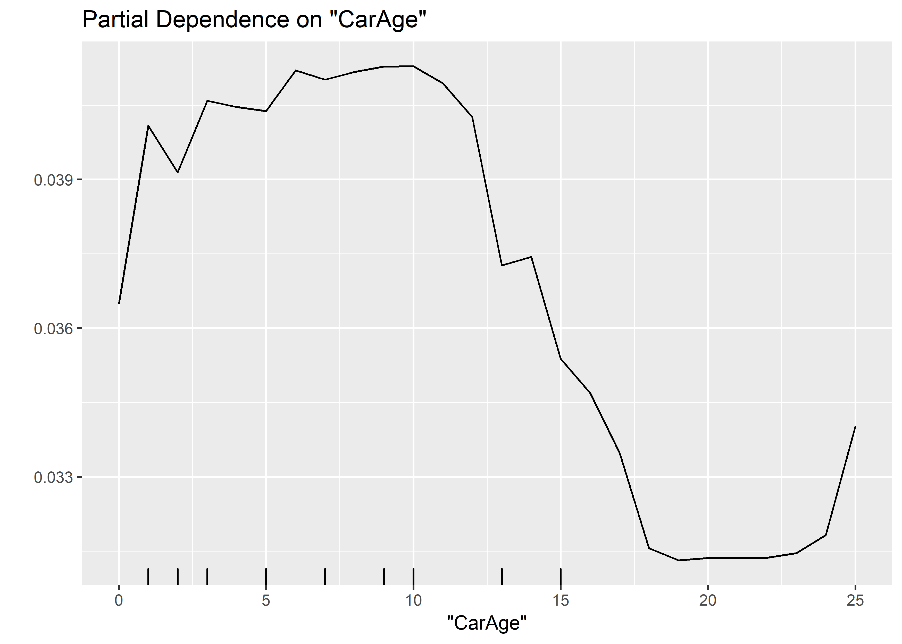

Random Forest
================

-   [Loading the data and the packages](#loading-the-data-and-the-packages)
-   [Random Forest on Count Data](#random-forest-on-count-data)
-   [Cross-Validation](#cross-validation)

EDIT: Please note that this file has been updated on 16/10/2018. No code has been changed. However, this script has been run on the new version (0.3.0) of the rfCountData package, which corrects some errors (related to OOB error) and uses ggplot2.

Loading the data and the packages
=================================

First, the packages

``` r
require("CASdatasets")
require("rfCountData")
require("caret")
```

then, the data

``` r
# data("freMTPLfreq")
# freMTPLfreq = subset(freMTPLfreq, Exposure<=1 & Exposure >= 0 & CarAge<=25)
# 
# set.seed(85)
# folds = createDataPartition(freMTPLfreq$ClaimNb, 0.5)
# dataset = freMTPLfreq[folds[[1]], ]
load("../dataset.RData")
```

Let us first split out dataset in two parts: a training set and a testing set.

``` r
set.seed(21)
in_training = createDataPartition(dataset$ClaimNb, times = 1, p = 0.8, list=FALSE)
training_set = dataset[in_training,]
testing_set  = dataset[-in_training,]
```

Random Forest on Count Data
===========================

The package *randomForest* allows to perform regression and classification. However, the split criterion in the regression case is based on the MSE, which may not be relevant for count data. Moreover, it did not allow the inclusion of an offset to take into account the different exposures of the policyholders.

The package *rfCountData* tries to correct these issues. It is to be used only on count data.

``` r
require(rfCountData)
```

The use of the package is similar to the randomForest. Here, the main function is called *rfPoisson*.

``` r
set.seed(5)
m0_rf = rfPoisson(x = training_set[,c("DriverAge", "CarAge")],
                  offset = log(training_set$Exposure),
                  y = training_set$ClaimNb,
                  ntree = 50,
                  nodesize = 4000,
                  mtry=2,
                  importance=TRUE)
importance(m0_rf)
```

    ##           %IncLossFunction
    ## DriverAge     0.0051950441
    ## CarAge        0.0005577539

If we want some idea of the marginal effect of the variables, we can use the partial dependence plots

``` r
par(mfrow=c(1,2))
partialPlot(m0_rf, training_set, offset = log(training_set$Exposure), x.var="DriverAge")
```


``` r
partialPlot(m0_rf, training_set, offset = log(training_set$Exposure), x.var="CarAge")
```



We can see the deviance (on the training\_set) as a function of the number of trees

``` r
plot(m0_rf)
```


With only very few trees, we clearly have overfitting. After a few iterations, the error will stabilize.

Let's use all the variables and decrease the nodesize to 2500.

``` r
set.seed(5)
m1_rf = rfPoisson(x = training_set[,4:10],
                  offset = log(training_set$Exposure),
                  y = training_set$ClaimNb,
                  ntree = 100,
                  nodesize = 2500,
                  mtry=3,
                  importance=TRUE,
                  do.trace=TRUE)
```

    ##      | OOB (1 tree) | OOB (forest) |
    ## Tree |Loss Function |Loss Function |
    ##    1 |     0.255704 |     0.255704 |
    ##    2 |     0.250312 |     0.252312 |
    ##    3 |     0.258767 |     0.253989 |
    ##    4 |     0.252948 |     0.252372 |
    ##    5 |     0.251997 |     0.252484 |
    ##    6 |     0.256712 |     0.252172 |
    ##    7 |      0.24902 |     0.252346 |
    ##    8 |     0.259988 |     0.252718 |
    ##    9 |     0.253937 |     0.252631 |
    ##   10 |       0.2531 |     0.252202 |
    ##   11 |     0.253611 |     0.252233 |
    ##   12 |      0.25698 |     0.252271 |
    ##   13 |     0.256308 |     0.252193 |
    ##   14 |     0.255469 |     0.252137 |
    ##   15 |     0.248335 |      0.25208 |
    ##   16 |     0.253983 |     0.252089 |
    ##   17 |     0.254301 |     0.252031 |
    ##   18 |     0.252356 |      0.25202 |
    ##   19 |     0.254173 |      0.25198 |
    ##   20 |     0.251483 |     0.251936 |
    ##   21 |      0.25941 |       0.2519 |
    ##   22 |     0.255731 |     0.251866 |
    ##   23 |     0.249577 |     0.251861 |
    ##   24 |     0.254574 |     0.251819 |
    ##   25 |     0.252356 |     0.251819 |
    ##   26 |     0.247024 |     0.251784 |
    ##   27 |     0.253284 |     0.251759 |
    ##   28 |     0.251133 |     0.251729 |
    ##   29 |     0.255103 |     0.251716 |
    ##   30 |     0.256373 |     0.251719 |
    ##   31 |     0.256514 |     0.251716 |
    ##   32 |     0.251773 |     0.251698 |
    ##   33 |     0.259758 |     0.251725 |
    ##   34 |     0.249527 |      0.25171 |
    ##   35 |     0.252176 |     0.251725 |
    ##   36 |     0.250143 |     0.251718 |
    ##   37 |     0.247386 |      0.25173 |
    ##   38 |     0.257424 |     0.251709 |
    ##   39 |      0.24858 |     0.251699 |
    ##   40 |     0.259747 |     0.251692 |
    ##   41 |     0.252972 |     0.251678 |
    ##   42 |     0.256625 |     0.251687 |
    ##   43 |     0.247953 |     0.251651 |
    ##   44 |     0.256796 |     0.251562 |
    ##   45 |     0.255268 |     0.251552 |
    ##   46 |     0.251703 |     0.251551 |
    ##   47 |     0.253002 |     0.251563 |
    ##   48 |     0.256506 |     0.251554 |
    ##   49 |     0.256046 |     0.251566 |
    ##   50 |     0.253349 |     0.251575 |
    ##   51 |     0.258928 |     0.251596 |
    ##   52 |     0.248153 |     0.251568 |
    ##   53 |     0.253452 |     0.251566 |
    ##   54 |     0.256445 |     0.251557 |
    ##   55 |     0.254205 |     0.251552 |
    ##   56 |     0.252913 |      0.25155 |
    ##   57 |     0.250492 |     0.251555 |
    ##   58 |     0.255653 |     0.251543 |
    ##   59 |     0.255652 |     0.251544 |
    ##   60 |     0.256531 |     0.251553 |
    ##   61 |     0.259386 |     0.251544 |
    ##   62 |     0.256447 |     0.251529 |
    ##   63 |     0.254278 |     0.251541 |
    ##   64 |     0.252948 |     0.251534 |
    ##   65 |     0.255479 |     0.251541 |
    ##   66 |     0.257115 |     0.251535 |
    ##   67 |     0.256682 |     0.251517 |
    ##   68 |     0.253019 |      0.25153 |
    ##   69 |     0.250528 |     0.251539 |
    ##   70 |      0.25029 |     0.251541 |
    ##   71 |     0.257712 |      0.25154 |
    ##   72 |     0.257588 |     0.251538 |
    ##   73 |     0.254444 |     0.251537 |
    ##   74 |     0.253458 |     0.251559 |
    ##   75 |     0.254855 |     0.251562 |
    ##   76 |      0.25381 |     0.251559 |
    ##   77 |     0.257128 |     0.251562 |
    ##   78 |      0.25034 |     0.251558 |
    ##   79 |     0.250008 |     0.251555 |
    ##   80 |     0.253766 |     0.251554 |
    ##   81 |     0.254942 |     0.251552 |
    ##   82 |     0.251261 |     0.251557 |
    ##   83 |     0.252306 |     0.251558 |
    ##   84 |      0.25898 |     0.251569 |
    ##   85 |     0.249505 |     0.251565 |
    ##   86 |     0.253373 |     0.251558 |
    ##   87 |     0.256823 |     0.251563 |
    ##   88 |     0.256715 |     0.251558 |
    ##   89 |     0.260255 |     0.251555 |
    ##   90 |     0.249374 |     0.251553 |
    ##   91 |      0.25069 |      0.25156 |
    ##   92 |     0.253437 |     0.251562 |
    ##   93 |     0.252107 |     0.251564 |
    ##   94 |     0.246154 |      0.25156 |
    ##   95 |     0.250299 |     0.251563 |
    ##   96 |      0.25182 |     0.251555 |
    ##   97 |     0.249599 |     0.251557 |
    ##   98 |     0.247986 |     0.251555 |
    ##   99 |     0.253188 |     0.251554 |
    ##  100 |     0.252073 |     0.251543 |

We can again see the error as a function of the number of trees

``` r
plot(m1_rf)
```


We can also plot the variable importance.

``` r
importance(m1_rf)
```

    ##           %IncLossFunction
    ## Power         0.0004858102
    ## CarAge        0.0003655651
    ## DriverAge     0.0043361408
    ## Brand         0.0001892523
    ## Gas           0.0003316849
    ## Region       -0.0001279095
    ## Density       0.0022118216

and the partial dependences, for instance, for the Age of the Driver.

``` r
partialPlot(x=m1_rf, pred.data=training_set[,4:10], offset=log(training_set$Exposure), x.var="DriverAge")
```


``` r
2*(sum(dpois(x = testing_set$ClaimNb, lambda = testing_set$ClaimNb,log=TRUE))-
  sum(dpois(x = testing_set$ClaimNb, lambda = predict(m1_rf, testing_set[,4:10], log(testing_set$Exposure)),
            log=TRUE)))
```

    ## [1] 10262.27

Cross-Validation
================

We could rely on cross-validation to find the optimal mtry parameter. We are only going to compare two different mtry parameter (due to the time limitation).

For mtry = 3,

``` r
set.seed(6)
folds = createFolds(training_set$ClaimNb, k = 5)
require(parallel)
```

    ## Loading required package: parallel

``` r
cl = makeCluster(5)
clusterExport(cl, "training_set")
set.seed(859)
res0 = parLapply(cl, folds, function(X) {
  require(rfCountData)
    m_cv = rfPoisson(x = training_set[-X,4:10],
              offset = log(training_set[-X,]$Exposure),
              y = training_set[-X,]$ClaimNb,
              xtest = training_set[X,4:10],
              offsettest = log(training_set[X,]$Exposure),
              ytest = training_set[X,]$ClaimNb,
              ntree = 100,
              nodesize = 10000,
              mtry=3,
              importance=TRUE,
              do.trace=FALSE,
              keep.forest=FALSE)
    pred = m_cv$test$predicted
   2*(sum(dpois(x = training_set[X, ]$ClaimNb, lambda = training_set[X, ]$ClaimNb,log=TRUE))-
  sum(dpois(x = training_set[X, ]$ClaimNb, lambda = pred, log=TRUE))) / nrow(training_set[X,])
})
stopCluster(cl)
```

For mtry = 5,

``` r
set.seed(6)
folds = createFolds(training_set$ClaimNb, k = 5)
require(parallel)
cl = makeCluster(5)
clusterExport(cl, "training_set")
set.seed(256)
res1 = parLapply(cl, folds, function(X) {
  require(rfCountData)
    m_cv = rfPoisson(x = training_set[-X,4:10],
              offset = log(training_set[-X,]$Exposure),
              y = training_set[-X,]$ClaimNb,
              xtest = training_set[X,4:10],
              offsettest = log(training_set[X,]$Exposure),
              ytest = training_set[X,]$ClaimNb,
              ntree = 100,
              nodesize = 10000,
              mtry=5,
              importance=TRUE,
              do.trace=FALSE,
              keep.forest=FALSE)
    pred = m_cv$test$predicted
    2*(sum(dpois(x = training_set[X, ]$ClaimNb, lambda = training_set[X, ]$ClaimNb,log=TRUE))-
  sum(dpois(x = training_set[X, ]$ClaimNb, lambda = pred, log=TRUE))) / nrow(training_set[X,])
})
stopCluster(cl)
```

We obtain the following results:

``` r
boxplot(cbind(unlist(res0), unlist(res1)), names=c(3,5), main="mtry parameter 5-fold CV", ylab="Poisson Mean Deviance")
```


``` r
apply(cbind(unlist(res0), unlist(res1)), 2,mean)
```

    ## [1] 0.2521563 0.2521438

Let us now construct the whole forest on the whole training\_set with the optimal mtry = 3.

``` r
set.seed(43)
m_final_1 = rfPoisson(x = training_set[,4:10],
              offset = log(training_set$Exposure),
              y = training_set$ClaimNb,
              xtest = testing_set[,4:10],
              offsettest = log(testing_set$Exposure),
              ytest = testing_set$ClaimNb,
              ntree = 100,
              nodesize = 10000,
              mtry=3,
              importance=TRUE,
              do.trace=TRUE,
              keep.forest=TRUE)
```

    ##      | OOB (1 tree) | OOB (forest) |   Test set   |
    ## Tree |Loss Function |Loss Function |Loss Function |
    ##    1 |     0.257211 |     0.257211 |     0.251986 |
    ##    2 |     0.257626 |     0.257068 |     0.251281 |
    ##    3 |     0.250684 |     0.255483 |     0.250714 |
    ##    4 |     0.248391 |     0.253497 |      0.25053 |
    ##    5 |     0.247983 |      0.25304 |     0.250429 |
    ##    6 |     0.256089 |     0.253263 |     0.250304 |
    ##    7 |     0.256832 |     0.253532 |      0.25023 |
    ##    8 |     0.251356 |     0.252735 |     0.250183 |
    ##    9 |     0.253281 |     0.252924 |      0.25028 |
    ##   10 |     0.257259 |      0.25277 |     0.250298 |
    ##   11 |     0.247535 |     0.252672 |     0.250282 |
    ##   12 |     0.246964 |     0.252507 |     0.250232 |
    ##   13 |     0.258306 |     0.252472 |     0.250187 |
    ##   14 |     0.253653 |     0.252337 |     0.250196 |
    ##   15 |     0.253275 |     0.252415 |     0.250237 |
    ##   16 |     0.255294 |     0.252342 |     0.250199 |
    ##   17 |     0.254597 |     0.252285 |     0.250222 |
    ##   18 |       0.2529 |     0.252223 |     0.250235 |
    ##   19 |     0.259096 |     0.252213 |     0.250215 |
    ##   20 |      0.25554 |     0.252173 |     0.250235 |
    ##   21 |      0.24856 |     0.252149 |     0.250202 |
    ##   22 |     0.260675 |     0.252107 |     0.250156 |
    ##   23 |     0.252246 |     0.252106 |     0.250156 |
    ##   24 |      0.25318 |     0.252099 |     0.250168 |
    ##   25 |     0.254574 |     0.252088 |     0.250154 |
    ##   26 |     0.255145 |     0.252049 |     0.250141 |
    ##   27 |     0.255964 |     0.252041 |     0.250116 |
    ##   28 |     0.253284 |     0.252051 |     0.250133 |
    ##   29 |     0.254669 |     0.252008 |     0.250147 |
    ##   30 |     0.250926 |     0.252017 |     0.250131 |
    ##   31 |     0.256336 |     0.252026 |     0.250147 |
    ##   32 |     0.260775 |     0.252008 |     0.250135 |
    ##   33 |     0.254887 |     0.252004 |     0.250143 |
    ##   34 |      0.25764 |     0.252003 |     0.250127 |
    ##   35 |     0.255061 |     0.251982 |     0.250141 |
    ##   36 |     0.258335 |     0.251977 |     0.250136 |
    ##   37 |     0.253576 |      0.25197 |     0.250129 |
    ##   38 |     0.252568 |     0.251982 |     0.250141 |
    ##   39 |     0.256586 |     0.251972 |     0.250119 |
    ##   40 |     0.252737 |     0.251959 |     0.250113 |
    ##   41 |     0.252866 |     0.251965 |     0.250113 |
    ##   42 |     0.251106 |      0.25197 |     0.250122 |
    ##   43 |     0.251351 |     0.251974 |     0.250116 |
    ##   44 |         0.25 |     0.251981 |      0.25013 |
    ##   45 |     0.253198 |     0.251989 |     0.250113 |
    ##   46 |     0.252433 |      0.25198 |     0.250114 |
    ##   47 |     0.249327 |      0.25198 |     0.250105 |
    ##   48 |     0.249674 |     0.251966 |     0.250106 |
    ##   49 |     0.252342 |     0.251968 |      0.25009 |
    ##   50 |     0.251956 |     0.251972 |     0.250088 |
    ##   51 |      0.24976 |     0.251973 |     0.250091 |
    ##   52 |     0.255751 |      0.25198 |     0.250079 |
    ##   53 |     0.258322 |     0.251978 |     0.250057 |
    ##   54 |     0.246194 |     0.251984 |     0.250064 |
    ##   55 |     0.249348 |     0.251985 |     0.250045 |
    ##   56 |     0.258252 |     0.251987 |     0.250051 |
    ##   57 |     0.253041 |     0.251975 |     0.250044 |
    ##   58 |     0.252089 |     0.251964 |      0.25003 |
    ##   59 |     0.251779 |     0.251965 |     0.250031 |
    ##   60 |     0.252984 |     0.251964 |     0.250038 |
    ##   61 |     0.251202 |     0.251976 |     0.250035 |
    ##   62 |     0.258085 |     0.251982 |     0.250043 |
    ##   63 |     0.253149 |     0.251981 |     0.250053 |
    ##   64 |     0.255999 |     0.251977 |     0.250045 |
    ##   65 |     0.249108 |     0.251971 |     0.250045 |
    ##   66 |     0.252654 |     0.251983 |     0.250041 |
    ##   67 |     0.255939 |     0.251982 |     0.250023 |
    ##   68 |     0.256523 |     0.251988 |     0.250032 |
    ##   69 |     0.252612 |     0.251988 |     0.250029 |
    ##   70 |     0.260815 |     0.252004 |     0.250028 |
    ##   71 |     0.243776 |        0.252 |     0.250021 |
    ##   72 |     0.253644 |     0.251998 |     0.250018 |
    ##   73 |     0.258241 |     0.252004 |     0.250027 |
    ##   74 |     0.255622 |     0.252005 |     0.250036 |
    ##   75 |     0.251859 |     0.252001 |     0.250038 |
    ##   76 |     0.246795 |     0.251992 |     0.250035 |
    ##   77 |     0.251151 |     0.251998 |     0.250034 |
    ##   78 |     0.252551 |     0.251991 |     0.250033 |
    ##   79 |     0.258395 |     0.251991 |     0.250028 |
    ##   80 |     0.250548 |     0.251991 |     0.250032 |
    ##   81 |     0.247567 |     0.251984 |     0.250025 |
    ##   82 |     0.253961 |     0.251986 |     0.250017 |
    ##   83 |     0.253023 |     0.251987 |     0.250019 |
    ##   84 |     0.252528 |     0.251985 |     0.250017 |
    ##   85 |     0.255991 |     0.251987 |      0.25002 |
    ##   86 |     0.255011 |     0.251976 |     0.250013 |
    ##   87 |      0.25899 |     0.251975 |     0.250012 |
    ##   88 |     0.249752 |      0.25197 |     0.250017 |
    ##   89 |     0.250169 |     0.251979 |     0.250022 |
    ##   90 |     0.254753 |      0.25198 |     0.250029 |
    ##   91 |     0.259996 |     0.251984 |     0.250035 |
    ##   92 |     0.249866 |     0.251989 |      0.25004 |
    ##   93 |     0.249715 |     0.251991 |     0.250036 |
    ##   94 |     0.251532 |     0.251986 |     0.250034 |
    ##   95 |     0.254035 |     0.251987 |     0.250037 |
    ##   96 |     0.252558 |     0.251988 |     0.250035 |
    ##   97 |     0.252073 |     0.251989 |      0.25004 |
    ##   98 |     0.246855 |      0.25199 |     0.250043 |
    ##   99 |      0.25443 |     0.251988 |     0.250043 |
    ##  100 |     0.253771 |     0.251992 |     0.250042 |

``` r
plot(m_final_1)
```


We can compare with a higher nodesize..

``` r
set.seed(43)
m_final_2 = rfPoisson(x = training_set[,4:10],
              offset = log(training_set$Exposure),
              y = training_set$ClaimNb,
              xtest = testing_set[,4:10],
              offsettest = log(testing_set$Exposure),
              ytest = testing_set$ClaimNb,
              ntree = 100,
              nodesize = 15000,
              mtry=3,
              importance=TRUE,
              do.trace=TRUE,
              keep.forest=TRUE)
```

    ##      | OOB (1 tree) | OOB (forest) |   Test set   |
    ## Tree |Loss Function |Loss Function |Loss Function |
    ##    1 |     0.257398 |     0.257398 |     0.252062 |
    ##    2 |     0.254832 |     0.255227 |     0.251214 |
    ##    3 |     0.250076 |     0.254541 |      0.25103 |
    ##    4 |     0.251196 |     0.254543 |     0.250772 |
    ##    5 |     0.258486 |     0.254292 |     0.250759 |
    ##    6 |     0.253878 |      0.25369 |     0.250594 |
    ##    7 |     0.257815 |     0.253426 |     0.250477 |
    ##    8 |     0.255296 |     0.253378 |     0.250532 |
    ##    9 |     0.251749 |     0.253025 |     0.250464 |
    ##   10 |     0.256032 |     0.253162 |     0.250398 |
    ##   11 |      0.26014 |     0.252957 |     0.250334 |
    ##   12 |     0.246241 |     0.252803 |     0.250302 |
    ##   13 |     0.246388 |     0.252738 |      0.25029 |
    ##   14 |     0.254394 |     0.252644 |     0.250298 |
    ##   15 |     0.249056 |     0.252515 |     0.250258 |
    ##   16 |     0.251581 |     0.252555 |     0.250242 |
    ##   17 |     0.251798 |     0.252506 |     0.250232 |
    ##   18 |     0.251589 |     0.252486 |     0.250247 |
    ##   19 |     0.251926 |     0.252504 |     0.250245 |
    ##   20 |     0.249185 |      0.25248 |     0.250242 |
    ##   21 |     0.256787 |     0.252483 |      0.25026 |
    ##   22 |     0.248126 |     0.252477 |     0.250287 |
    ##   23 |     0.250989 |     0.252466 |     0.250275 |
    ##   24 |     0.253312 |      0.25243 |     0.250243 |
    ##   25 |     0.252073 |     0.252407 |     0.250235 |
    ##   26 |     0.256917 |     0.252412 |     0.250259 |
    ##   27 |     0.255291 |     0.252388 |     0.250261 |
    ##   28 |     0.253987 |     0.252354 |     0.250259 |
    ##   29 |     0.255001 |      0.25236 |     0.250259 |
    ##   30 |     0.248814 |     0.252345 |     0.250258 |
    ##   31 |     0.248772 |     0.252339 |     0.250274 |
    ##   32 |      0.25598 |     0.252344 |      0.25027 |
    ##   33 |     0.250913 |     0.252336 |     0.250268 |
    ##   34 |     0.254582 |     0.252342 |     0.250275 |
    ##   35 |     0.250872 |     0.252345 |     0.250287 |
    ##   36 |     0.254042 |      0.25236 |      0.25029 |
    ##   37 |     0.250118 |     0.252363 |     0.250286 |
    ##   38 |     0.250673 |     0.252368 |     0.250291 |
    ##   39 |     0.252495 |     0.252391 |     0.250284 |
    ##   40 |     0.257057 |     0.252394 |      0.25029 |
    ##   41 |     0.260516 |     0.252385 |      0.25028 |
    ##   42 |     0.250471 |     0.252383 |      0.25028 |
    ##   43 |     0.255784 |     0.252388 |     0.250294 |
    ##   44 |     0.252353 |      0.25238 |     0.250286 |
    ##   45 |      0.25043 |     0.252376 |     0.250278 |
    ##   46 |     0.253512 |     0.252386 |     0.250265 |
    ##   47 |     0.246674 |     0.252371 |      0.25026 |
    ##   48 |     0.252863 |     0.252366 |     0.250255 |
    ##   49 |     0.258522 |     0.252365 |     0.250258 |
    ##   50 |     0.250789 |     0.252365 |     0.250236 |
    ##   51 |      0.25352 |     0.252363 |     0.250246 |
    ##   52 |     0.251075 |      0.25235 |     0.250241 |
    ##   53 |      0.25179 |     0.252352 |     0.250251 |
    ##   54 |     0.255231 |     0.252354 |     0.250247 |
    ##   55 |     0.251042 |     0.252347 |     0.250247 |
    ##   56 |     0.255214 |     0.252345 |     0.250258 |
    ##   57 |     0.253616 |     0.252343 |     0.250268 |
    ##   58 |     0.250148 |     0.252351 |     0.250273 |
    ##   59 |     0.250203 |      0.25235 |     0.250274 |
    ##   60 |     0.247227 |     0.252346 |     0.250275 |
    ##   61 |     0.248595 |     0.252347 |     0.250267 |
    ##   62 |     0.254532 |     0.252349 |      0.25027 |
    ##   63 |       0.2619 |     0.252358 |     0.250279 |
    ##   64 |     0.252334 |      0.25236 |     0.250276 |
    ##   65 |     0.249762 |     0.252354 |      0.25027 |
    ##   66 |     0.248988 |     0.252352 |     0.250276 |
    ##   67 |     0.251153 |     0.252353 |     0.250276 |
    ##   68 |     0.258359 |     0.252357 |     0.250284 |
    ##   69 |     0.259851 |     0.252364 |     0.250285 |
    ##   70 |     0.252683 |     0.252357 |     0.250282 |
    ##   71 |     0.254203 |      0.25236 |     0.250289 |
    ##   72 |     0.247935 |     0.252359 |     0.250289 |
    ##   73 |      0.24698 |     0.252355 |     0.250289 |
    ##   74 |     0.258111 |     0.252342 |     0.250282 |
    ##   75 |     0.254834 |     0.252338 |     0.250286 |
    ##   76 |     0.250705 |     0.252344 |     0.250295 |
    ##   77 |     0.256571 |     0.252341 |     0.250284 |
    ##   78 |     0.256964 |     0.252345 |     0.250286 |
    ##   79 |     0.254319 |     0.252346 |     0.250292 |
    ##   80 |     0.255069 |     0.252343 |     0.250286 |
    ##   81 |     0.255892 |     0.252346 |       0.2503 |
    ##   82 |     0.256505 |     0.252339 |     0.250298 |
    ##   83 |     0.253008 |     0.252335 |     0.250286 |
    ##   84 |      0.25221 |     0.252336 |     0.250283 |
    ##   85 |      0.25028 |     0.252331 |     0.250275 |
    ##   86 |     0.251839 |     0.252328 |     0.250276 |
    ##   87 |     0.258486 |     0.252333 |     0.250282 |
    ##   88 |      0.25797 |     0.252331 |     0.250276 |
    ##   89 |      0.24835 |     0.252324 |     0.250274 |
    ##   90 |     0.253071 |     0.252324 |     0.250271 |
    ##   91 |     0.254734 |     0.252318 |     0.250264 |
    ##   92 |     0.252631 |     0.252321 |     0.250269 |
    ##   93 |     0.249289 |     0.252318 |     0.250271 |
    ##   94 |     0.253655 |     0.252321 |     0.250276 |
    ##   95 |     0.254721 |     0.252315 |     0.250269 |
    ##   96 |     0.252501 |      0.25231 |     0.250265 |
    ##   97 |     0.252463 |     0.252305 |      0.25026 |
    ##   98 |      0.25405 |     0.252306 |     0.250259 |
    ##   99 |     0.250888 |     0.252308 |     0.250267 |
    ##  100 |     0.252808 |     0.252303 |     0.250258 |

``` r
plot(m_final_2)
```


... and with a lower nodesize.

``` r
set.seed(43)
m_final_3 = rfPoisson(x = training_set[,4:10],
              offset = log(training_set$Exposure),
              y = training_set$ClaimNb,
              xtest = testing_set[,4:10],
              offsettest = log(testing_set$Exposure),
              ytest = testing_set$ClaimNb,
              ntree = 100,
              nodesize = 5000,
              mtry=3,
              importance=TRUE,
              do.trace=TRUE,
              keep.forest=TRUE)
```

    ##      | OOB (1 tree) | OOB (forest) |   Test set   |
    ## Tree |Loss Function |Loss Function |Loss Function |
    ##    1 |      0.25776 |      0.25776 |     0.252503 |
    ##    2 |     0.258648 |     0.257416 |     0.250855 |
    ##    3 |     0.248114 |     0.255518 |     0.250682 |
    ##    4 |     0.250921 |     0.255257 |     0.250588 |
    ##    5 |     0.255787 |     0.253095 |     0.250423 |
    ##    6 |     0.260718 |     0.253635 |     0.250253 |
    ##    7 |     0.252548 |     0.253576 |     0.250249 |
    ##    8 |      0.25312 |      0.25308 |     0.250047 |
    ##    9 |     0.253918 |     0.252816 |      0.25005 |
    ##   10 |     0.253683 |     0.252645 |     0.250037 |
    ##   11 |     0.254744 |     0.252283 |     0.249962 |
    ##   12 |     0.253475 |     0.252065 |     0.249974 |
    ##   13 |     0.254059 |     0.252066 |     0.249887 |
    ##   14 |     0.252152 |      0.25196 |     0.249867 |
    ##   15 |     0.254342 |     0.251914 |     0.249836 |
    ##   16 |     0.250222 |     0.251993 |     0.249794 |
    ##   17 |     0.253647 |     0.252009 |     0.249862 |
    ##   18 |     0.257543 |     0.251993 |     0.249922 |
    ##   19 |     0.254637 |     0.251992 |     0.249942 |
    ##   20 |     0.252088 |     0.251921 |     0.249905 |
    ##   21 |     0.250092 |     0.251904 |     0.249901 |
    ##   22 |     0.253899 |     0.251868 |     0.249933 |
    ##   23 |     0.254237 |     0.251846 |     0.249903 |
    ##   24 |     0.251698 |     0.251836 |     0.249858 |
    ##   25 |     0.256512 |     0.251817 |     0.249854 |
    ##   26 |     0.252212 |     0.251813 |     0.249814 |
    ##   27 |     0.256716 |       0.2518 |     0.249777 |
    ##   28 |     0.257085 |      0.25181 |     0.249759 |
    ##   29 |      0.25423 |     0.251829 |     0.249777 |
    ##   30 |       0.2512 |      0.25181 |     0.249779 |
    ##   31 |      0.25131 |     0.251798 |     0.249773 |
    ##   32 |     0.252182 |     0.251806 |     0.249791 |
    ##   33 |     0.249109 |     0.251798 |     0.249771 |
    ##   34 |     0.252626 |     0.251803 |     0.249789 |
    ##   35 |     0.261423 |      0.25179 |     0.249772 |
    ##   36 |     0.252227 |     0.251769 |     0.249759 |
    ##   37 |     0.251507 |     0.251767 |     0.249757 |
    ##   38 |     0.251831 |     0.251761 |      0.24975 |
    ##   39 |     0.252854 |     0.251751 |     0.249738 |
    ##   40 |      0.25111 |     0.251761 |     0.249759 |
    ##   41 |     0.255228 |     0.251751 |     0.249739 |
    ##   42 |     0.259596 |     0.251766 |     0.249758 |
    ##   43 |     0.253009 |      0.25176 |     0.249752 |
    ##   44 |     0.256433 |     0.251736 |     0.249756 |
    ##   45 |      0.24361 |      0.25175 |     0.249739 |
    ##   46 |     0.257035 |     0.251753 |     0.249752 |
    ##   47 |     0.254056 |     0.251757 |     0.249753 |
    ##   48 |     0.254925 |     0.251768 |     0.249756 |
    ##   49 |     0.254216 |     0.251762 |     0.249762 |
    ##   50 |     0.256589 |     0.251755 |     0.249764 |
    ##   51 |     0.250701 |     0.251758 |     0.249752 |
    ##   52 |     0.252145 |     0.251766 |     0.249766 |
    ##   53 |     0.253139 |     0.251752 |     0.249779 |
    ##   54 |     0.263331 |     0.251744 |     0.249773 |
    ##   55 |     0.248964 |      0.25174 |     0.249769 |
    ##   56 |     0.244928 |     0.251731 |      0.24974 |
    ##   57 |     0.255484 |     0.251723 |     0.249739 |
    ##   58 |     0.249482 |     0.251719 |     0.249736 |
    ##   59 |     0.264826 |      0.25173 |     0.249731 |
    ##   60 |     0.257993 |     0.251725 |     0.249727 |
    ##   61 |     0.255617 |     0.251717 |      0.24973 |
    ##   62 |     0.251548 |     0.251713 |     0.249745 |
    ##   63 |     0.251375 |     0.251704 |     0.249736 |
    ##   64 |      0.25494 |     0.251711 |     0.249746 |
    ##   65 |     0.258054 |     0.251713 |      0.24975 |
    ##   66 |     0.260693 |     0.251703 |     0.249756 |
    ##   67 |     0.256341 |     0.251699 |     0.249755 |
    ##   68 |     0.260822 |     0.251702 |     0.249763 |
    ##   69 |     0.254793 |       0.2517 |     0.249762 |
    ##   70 |     0.252116 |     0.251702 |     0.249765 |
    ##   71 |     0.253546 |     0.251699 |     0.249767 |
    ##   72 |      0.26111 |     0.251694 |     0.249755 |
    ##   73 |     0.251095 |     0.251683 |     0.249753 |
    ##   74 |     0.253728 |     0.251685 |     0.249755 |
    ##   75 |     0.254836 |     0.251688 |     0.249763 |
    ##   76 |     0.257696 |     0.251692 |     0.249756 |
    ##   77 |     0.250471 |     0.251688 |     0.249744 |
    ##   78 |     0.252439 |     0.251691 |      0.24975 |
    ##   79 |      0.25015 |     0.251689 |     0.249745 |
    ##   80 |     0.249353 |     0.251687 |     0.249748 |
    ##   81 |     0.251967 |     0.251688 |     0.249755 |
    ##   82 |     0.252041 |     0.251687 |     0.249758 |
    ##   83 |     0.255325 |     0.251686 |     0.249756 |
    ##   84 |     0.249646 |     0.251683 |     0.249766 |
    ##   85 |     0.249098 |     0.251681 |     0.249765 |
    ##   86 |     0.254679 |     0.251677 |     0.249767 |
    ##   87 |     0.251468 |     0.251673 |     0.249764 |
    ##   88 |     0.258246 |     0.251668 |     0.249765 |
    ##   89 |     0.259238 |     0.251662 |      0.24976 |
    ##   90 |     0.256109 |     0.251667 |     0.249758 |
    ##   91 |     0.254764 |     0.251672 |     0.249761 |
    ##   92 |     0.249902 |     0.251675 |     0.249762 |
    ##   93 |     0.252898 |     0.251674 |      0.24976 |
    ##   94 |     0.252566 |     0.251666 |     0.249771 |
    ##   95 |     0.250258 |     0.251659 |     0.249775 |
    ##   96 |     0.251987 |     0.251661 |     0.249767 |
    ##   97 |     0.252382 |     0.251663 |     0.249767 |
    ##   98 |     0.249395 |     0.251666 |     0.249766 |
    ##   99 |     0.256714 |     0.251669 |     0.249766 |
    ##  100 |     0.251636 |     0.251667 |     0.249771 |

``` r
plot(m_final_3)
```


We conclude with the usual mean deviance on the testing\_set

``` r
pred = predict(m_final_1, testing_set[,4:10], offset = log(testing_set$Exposure))
2*(sum(dpois(x = testing_set$ClaimNb, lambda = testing_set$ClaimNb,log=TRUE))-
  sum(dpois(x = testing_set$ClaimNb, lambda = pred,
            log=TRUE)))
```

    ## [1] 10273.23

``` r
pred = predict(m_final_2, testing_set[,4:10], offset = log(testing_set$Exposure))
2*(sum(dpois(x = testing_set$ClaimNb, lambda = testing_set$ClaimNb,log=TRUE))-
  sum(dpois(x = testing_set$ClaimNb, lambda = pred,
            log=TRUE)))
```

    ## [1] 10282.12

``` r
pred = predict(m_final_3, testing_set[,4:10], offset = log(testing_set$Exposure))
2*(sum(dpois(x = testing_set$ClaimNb, lambda = testing_set$ClaimNb,log=TRUE))-
  sum(dpois(x = testing_set$ClaimNb, lambda = pred,
            log=TRUE)))
```

    ## [1] 10262.09
