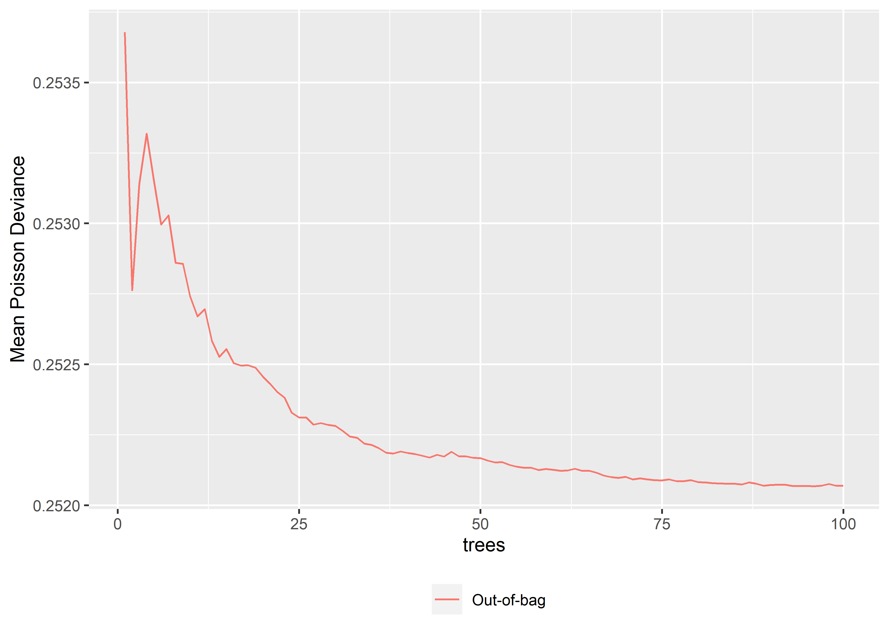

Random Forest
================

-   [Loading the data and the
    packages](#loading-the-data-and-the-packages)
-   [Random Forest on Count Data](#random-forest-on-count-data)
    -   [A note on OOB](#a-note-on-oob)
    -   [Dependence plot](#dependence-plot)
-   [Use all the variables](#use-all-the-variables)
-   [Cross-Validation](#cross-validation)

EDIT: Please note that this file has been updated on 16/10/2018. No code
has been changed. However, this script has been run on the new version
(0.3.0) of the rfCountData package, which corrects some errors (related
to OOB error) and uses ggplot2.

# Loading the data and the packages

First, the packages

``` r
if (!require(devtools)) install.packages("devtools")
require(devtools)
install_github("fpechon/rfCountData")


require("CASdatasets")
require("rfCountData")
require("caret")
require("tidyr")
```

then, the data

``` r
# data('freMTPLfreq') freMTPLfreq = subset(freMTPLfreq, Exposure<=1 & Exposure
# >= 0 & CarAge<=25) set.seed(85) folds =
# createDataPartition(freMTPLfreq$ClaimNb, 0.5) dataset =
# freMTPLfreq[folds[[1]], ]
dataset = readRDS("../dataset.RDS")
```

Let us first split out dataset in two parts: a training set and a
testing set.

``` r
set.seed(21)
in_training = createDataPartition(dataset$ClaimNb, times = 1, p = 0.8, list = FALSE)
training_set = dataset[in_training, ]
testing_set = dataset[-in_training, ]
```

# Random Forest on Count Data

The package *randomForest* allows to perform regression and
classification. However, the split criterion in the regression case is
based on the MSE, which may not be relevant for count data. Moreover, it
did not allow the inclusion of an offset to take into account the
different exposures of the policyholders.

The package *rfCountData* tries to correct these issues. It is to be
used only on count data.

``` r
require(rfCountData)
```

The use of the package is similar to the randomForest. Here, the main
function is called *rfPoisson*.

``` r
set.seed(5)
m0_rf = rfPoisson(x = training_set[,c("DriverAge", "CarAge")],
                  offset = log(training_set$Exposure),
                  y = training_set$ClaimNb,
                  ntree = 50, # Number of trees in the forest
                  nodesize = 4000, # Minimum number of observations in each leaf
                  mtry=2, # Number of variables drawn at each node
                  importance=TRUE,
                  keep.inbag = TRUE,
                  do.trace=TRUE)
```

    ##      | OOB (1 tree) | OOB (forest) |
    ## Tree |Loss Function |Loss Function |
    ##    1 |     0.254973 |     0.254973 |
    ##    2 |     0.258401 |     0.255019 |
    ##    3 |     0.251483 |     0.254255 |
    ##    4 |     0.254614 |     0.254435 |
    ##    5 |     0.254218 |     0.254314 |
    ##    6 |     0.252501 |     0.254248 |
    ##    7 |     0.256266 |     0.254309 |
    ##    8 |     0.252822 |      0.25431 |
    ##    9 |     0.256663 |     0.254329 |
    ##   10 |     0.255303 |     0.254301 |
    ##   11 |      0.25503 |     0.254225 |
    ##   12 |     0.254794 |     0.254125 |
    ##   13 |     0.255032 |     0.254155 |
    ##   14 |      0.25252 |     0.254125 |
    ##   15 |     0.257642 |     0.254151 |
    ##   16 |     0.255552 |     0.254158 |
    ##   17 |     0.254268 |     0.254183 |
    ##   18 |     0.252687 |     0.254151 |
    ##   19 |     0.255848 |     0.254156 |
    ##   20 |     0.253972 |     0.254148 |
    ##   21 |     0.254031 |     0.254133 |
    ##   22 |     0.250106 |     0.254113 |
    ##   23 |     0.256625 |     0.254104 |
    ##   24 |     0.255553 |       0.2541 |
    ##   25 |     0.256271 |     0.254098 |
    ##   26 |     0.252102 |     0.254097 |
    ##   27 |     0.256593 |     0.254094 |
    ##   28 |     0.253519 |     0.254085 |
    ##   29 |     0.249068 |     0.254084 |
    ##   30 |     0.253884 |     0.254089 |
    ##   31 |      0.26052 |     0.254085 |
    ##   32 |     0.259369 |     0.254087 |
    ##   33 |     0.255713 |     0.254071 |
    ##   34 |     0.256941 |     0.254066 |
    ##   35 |     0.252201 |     0.254069 |
    ##   36 |     0.252465 |     0.254061 |
    ##   37 |     0.255849 |     0.254063 |
    ##   38 |     0.259079 |     0.254063 |
    ##   39 |     0.253001 |     0.254053 |
    ##   40 |     0.253127 |     0.254049 |
    ##   41 |     0.251338 |     0.254046 |
    ##   42 |     0.255071 |     0.254038 |
    ##   43 |     0.252882 |     0.254032 |
    ##   44 |      0.25723 |     0.254029 |
    ##   45 |     0.258332 |     0.254024 |
    ##   46 |      0.25365 |      0.25403 |
    ##   47 |     0.255825 |     0.254031 |
    ##   48 |     0.254643 |     0.254032 |
    ##   49 |     0.257209 |     0.254026 |
    ##   50 |     0.256454 |     0.254017 |

## A note on OOB

In average, we expect more or loss 36.788% observations to be OOB. We
can check if we obtained similar number of OOB. Let us compute on tree
number 1, how many times each observation has been drawn.

``` r
m0_rf$inbag[,1] %>% 
  table() %>% 
  prop.table %>% 
  round(3)
```

    ## .
    ##     0     1     2     3     4     5     6     7     8 
    ## 0.368 0.367 0.185 0.061 0.015 0.003 0.001 0.000 0.000

Similarly on tree number 2:

``` r
m0_rf$inbag[,2] %>% 
  table() %>% 
  prop.table %>% 
  round(3)
```

    ## .
    ##     0     1     2     3     4     5     6     7     8 
    ## 0.367 0.370 0.183 0.061 0.015 0.003 0.001 0.000 0.000

At which point has every observation been OOB in at least one tree ?

``` r
# Cumulative product (will be 0 once the policy has been OOB for the first time)
OOB_analysis = apply(m0_rf$inbag, 1, cumprod) 
# OOB_analysis is a 50 x n matrix. On each row, we take the sum. The first row
# with a sum = 0 means that all observations have been OOB at least once.
which.min(apply(OOB_analysis, 1, sum))
```

    ## [1] 29

It can even be showed that for lim B-\>the OOBE converges to the LOO-CV
error estimate (leave one out cross validation) which is unbiased but
with higher variance with respect to k-fold CV with k\<n. (see Hastie,
T., Tibshirani, R., Friedman, J. (2001). The Elements of Statistical
Learning.)

## Dependence plot

If we want some idea of the marginal effect of the variables, we can use
the partial dependence plots

``` r
par(mfrow = c(1, 2))
partialPlot(m0_rf, training_set, offset = log(training_set$Exposure), x.var = "DriverAge")
```


``` r
partialPlot(m0_rf, training_set, offset = log(training_set$Exposure), x.var = "CarAge")
```


We can see the deviance (on the training_set) as a function of the
number of trees

``` r
plot(m0_rf)
```


With only very few trees, we clearly have overfitting. After a few
iterations, the error will stabilize.

Let’s decrease the nodesize to 2500, and let mtry to 2 and increase the
number of trees.

``` r
set.seed(5)
m1_rf = rfPoisson(x = training_set[, c("DriverAge", "CarAge")], offset = log(training_set$Exposure),
    y = training_set$ClaimNb, ntree = 100, nodesize = 2500, mtry = 2, importance = TRUE,
    do.trace = TRUE)
```

    ##      | OOB (1 tree) | OOB (forest) |
    ## Tree |Loss Function |Loss Function |
    ##    1 |     0.255425 |     0.255425 |
    ##    2 |     0.258837 |     0.255434 |
    ##    3 |     0.251976 |     0.254612 |
    ##    4 |     0.255408 |     0.254765 |
    ##    5 |     0.254517 |     0.254574 |
    ##    6 |     0.253401 |     0.254543 |
    ##    7 |     0.257201 |     0.254582 |
    ##    8 |     0.253392 |       0.2546 |
    ##    9 |     0.256922 |     0.254564 |
    ##   10 |     0.255514 |     0.254499 |
    ##   11 |     0.255216 |     0.254406 |
    ##   12 |     0.255001 |     0.254289 |
    ##   13 |     0.255943 |     0.254361 |
    ##   14 |     0.253414 |     0.254324 |
    ##   15 |      0.25776 |     0.254338 |
    ##   16 |     0.256643 |     0.254348 |
    ##   17 |     0.254443 |     0.254327 |
    ##   18 |      0.25273 |     0.254295 |
    ##   19 |     0.256177 |     0.254302 |
    ##   20 |     0.254574 |     0.254287 |
    ##   21 |     0.254419 |     0.254258 |
    ##   22 |     0.250441 |     0.254246 |
    ##   23 |     0.256611 |     0.254242 |
    ##   24 |      0.25671 |      0.25424 |
    ##   25 |     0.257349 |     0.254238 |
    ##   26 |     0.253257 |     0.254226 |
    ##   27 |     0.257355 |     0.254221 |
    ##   28 |     0.255009 |     0.254227 |
    ##   29 |     0.249279 |     0.254216 |
    ##   30 |     0.254891 |     0.254213 |
    ##   31 |     0.260842 |     0.254205 |
    ##   32 |      0.25975 |     0.254204 |
    ##   33 |     0.256421 |     0.254193 |
    ##   34 |     0.257794 |     0.254189 |
    ##   35 |     0.252417 |     0.254188 |
    ##   36 |      0.25279 |     0.254184 |
    ##   37 |     0.256463 |     0.254183 |
    ##   38 |     0.259105 |     0.254186 |
    ##   39 |     0.252912 |     0.254172 |
    ##   40 |     0.253559 |     0.254168 |
    ##   41 |     0.252687 |     0.254167 |
    ##   42 |     0.256185 |     0.254164 |
    ##   43 |     0.253619 |      0.25416 |
    ##   44 |     0.257458 |     0.254159 |
    ##   45 |     0.259795 |     0.254158 |
    ##   46 |     0.254444 |     0.254161 |
    ##   47 |     0.256104 |     0.254157 |
    ##   48 |     0.254562 |     0.254157 |
    ##   49 |       0.2582 |     0.254151 |
    ##   50 |     0.256553 |     0.254137 |
    ##   51 |     0.255702 |     0.254135 |
    ##   52 |     0.256003 |      0.25413 |
    ##   53 |     0.254251 |     0.254124 |
    ##   54 |     0.256149 |     0.254131 |
    ##   55 |       0.2507 |     0.254137 |
    ##   56 |     0.253072 |      0.25414 |
    ##   57 |     0.250638 |     0.254136 |
    ##   58 |     0.250953 |     0.254133 |
    ##   59 |     0.255249 |     0.254124 |
    ##   60 |     0.252897 |     0.254123 |
    ##   61 |     0.253346 |     0.254121 |
    ##   62 |     0.255994 |     0.254121 |
    ##   63 |      0.25418 |      0.25412 |
    ##   64 |      0.25274 |     0.254116 |
    ##   65 |     0.253679 |     0.254117 |
    ##   66 |     0.253035 |     0.254121 |
    ##   67 |     0.257514 |     0.254119 |
    ##   68 |     0.253406 |     0.254113 |
    ##   69 |     0.250956 |     0.254115 |
    ##   70 |     0.256815 |     0.254115 |
    ##   71 |     0.256614 |     0.254117 |
    ##   72 |      0.25535 |     0.254119 |
    ##   73 |     0.254979 |     0.254117 |
    ##   74 |     0.254287 |     0.254116 |
    ##   75 |     0.253254 |     0.254116 |
    ##   76 |     0.254716 |     0.254116 |
    ##   77 |     0.259042 |     0.254116 |
    ##   78 |     0.255438 |     0.254118 |
    ##   79 |     0.252617 |     0.254117 |
    ##   80 |     0.254706 |     0.254115 |
    ##   81 |     0.257212 |     0.254116 |
    ##   82 |     0.257351 |     0.254117 |
    ##   83 |     0.253211 |     0.254115 |
    ##   84 |     0.257929 |     0.254115 |
    ##   85 |     0.257271 |     0.254114 |
    ##   86 |     0.253895 |     0.254114 |
    ##   87 |     0.256018 |     0.254115 |
    ##   88 |     0.257323 |     0.254114 |
    ##   89 |      0.25529 |     0.254113 |
    ##   90 |     0.255199 |     0.254112 |
    ##   91 |     0.251921 |     0.254112 |
    ##   92 |     0.252816 |     0.254112 |
    ##   93 |     0.254084 |      0.25411 |
    ##   94 |     0.253852 |     0.254111 |
    ##   95 |     0.256022 |     0.254109 |
    ##   96 |     0.253559 |      0.25411 |
    ##   97 |      0.25743 |     0.254112 |
    ##   98 |     0.255646 |     0.254113 |
    ##   99 |     0.256371 |      0.25411 |
    ##  100 |     0.255045 |      0.25411 |

We can again see the error as a function of the number of trees

``` r
plot(m1_rf)
```


We can also plot the variable importance.

``` r
importance(m1_rf)
```

    ##           %IncLossFunction
    ## DriverAge     0.0048666932
    ## CarAge        0.0008093661

and the partial dependences, for instance, for the Age of the Driver.

``` r
partialPlot(x = m1_rf, pred.data = training_set[, c("DriverAge", "CarAge")], offset = log(training_set$Exposure),
    x.var = "DriverAge")
```


``` r
2 * (sum(dpois(x = testing_set$ClaimNb, lambda = testing_set$ClaimNb, log = TRUE)) -
    sum(dpois(x = testing_set$ClaimNb, lambda = predict(m1_rf, testing_set[, c("DriverAge",
        "CarAge")], log(testing_set$Exposure)), log = TRUE)))
```

    ## [1] 20611.33

At this point, we only used two variables, and the mtry parameter was
set to 2. This means, that for each tree, and for each node, we drew 2
variables … out of 2: the random sampling did not really take place.
When mtry = \# variables, we are essentially constructing bagged trees …

If we had set mtry to 1, we would have constructed each node with one of
the variables and this one would have been chosen randomly. The ‘split’
point would however been selected using the loss function.

We can give it go and try with mtry = 1 (and nodesize = 4000 which
seemed to provide better performance).

``` r
set.seed(5)
m2_rf = rfPoisson(x = training_set[, c("DriverAge", "CarAge")], offset = log(training_set$Exposure),
    y = training_set$ClaimNb, ntree = 100, nodesize = 2500, mtry = 1, importance = TRUE,
    do.trace = TRUE)
```

    ##      | OOB (1 tree) | OOB (forest) |
    ## Tree |Loss Function |Loss Function |
    ##    1 |     0.255712 |     0.255712 |
    ##    2 |     0.258898 |     0.255489 |
    ##    3 |     0.252076 |     0.254745 |
    ##    4 |      0.25493 |     0.254848 |
    ##    5 |     0.254382 |      0.25459 |
    ##    6 |     0.252302 |     0.254471 |
    ##    7 |     0.256605 |     0.254449 |
    ##    8 |     0.253642 |      0.25446 |
    ##    9 |     0.256676 |     0.254413 |
    ##   10 |     0.255088 |     0.254378 |
    ##   11 |     0.255123 |     0.254272 |
    ##   12 |     0.255611 |     0.254212 |
    ##   13 |     0.255495 |     0.254246 |
    ##   14 |      0.25286 |     0.254196 |
    ##   15 |     0.257397 |     0.254187 |
    ##   16 |     0.255467 |     0.254177 |
    ##   17 |     0.254437 |     0.254187 |
    ##   18 |     0.252756 |     0.254139 |
    ##   19 |     0.255821 |     0.254133 |
    ##   20 |     0.254543 |     0.254132 |
    ##   21 |     0.254565 |     0.254121 |
    ##   22 |     0.250699 |      0.25411 |
    ##   23 |     0.257251 |     0.254098 |
    ##   24 |     0.255727 |     0.254092 |
    ##   25 |     0.256864 |     0.254102 |
    ##   26 |      0.25206 |     0.254099 |
    ##   27 |     0.256524 |     0.254074 |
    ##   28 |     0.253464 |     0.254067 |
    ##   29 |     0.248994 |     0.254058 |
    ##   30 |     0.254296 |     0.254056 |
    ##   31 |     0.260745 |     0.254057 |
    ##   32 |     0.259485 |     0.254051 |
    ##   33 |     0.255897 |     0.254036 |
    ##   34 |     0.256816 |      0.25402 |
    ##   35 |     0.252407 |     0.254025 |
    ##   36 |     0.252536 |     0.254021 |
    ##   37 |     0.256085 |     0.254017 |
    ##   38 |     0.259376 |     0.254013 |
    ##   39 |      0.25412 |     0.254014 |
    ##   40 |     0.252944 |     0.254006 |
    ##   41 |     0.251475 |     0.254001 |
    ##   42 |     0.255233 |     0.253994 |
    ##   43 |     0.253425 |     0.253993 |
    ##   44 |     0.257833 |     0.253995 |
    ##   45 |     0.258457 |     0.253992 |
    ##   46 |     0.254034 |     0.253992 |
    ##   47 |     0.255763 |     0.253993 |
    ##   48 |     0.254625 |     0.253994 |
    ##   49 |     0.257257 |     0.253985 |
    ##   50 |      0.25686 |      0.25398 |
    ##   51 |     0.255167 |     0.253978 |
    ##   52 |     0.255626 |     0.253974 |
    ##   53 |     0.253775 |     0.253973 |
    ##   54 |     0.254821 |     0.253964 |
    ##   55 |     0.250786 |     0.253966 |
    ##   56 |     0.253287 |     0.253964 |
    ##   57 |     0.250487 |     0.253959 |
    ##   58 |     0.250747 |     0.253952 |
    ##   59 |     0.255441 |     0.253953 |
    ##   60 |     0.253147 |     0.253953 |
    ##   61 |     0.253261 |     0.253955 |
    ##   62 |     0.257042 |     0.253958 |
    ##   63 |     0.253863 |     0.253958 |
    ##   64 |      0.25253 |     0.253953 |
    ##   65 |     0.254414 |     0.253949 |
    ##   66 |     0.253949 |     0.253953 |
    ##   67 |     0.256868 |      0.25395 |
    ##   68 |     0.251904 |     0.253943 |
    ##   69 |     0.251012 |     0.253949 |
    ##   70 |     0.257431 |     0.253951 |
    ##   71 |     0.255842 |     0.253954 |
    ##   72 |     0.255103 |     0.253953 |
    ##   73 |     0.253456 |      0.25395 |
    ##   74 |     0.253799 |      0.25395 |
    ##   75 |     0.252699 |     0.253952 |
    ##   76 |     0.254457 |     0.253951 |
    ##   77 |     0.260612 |     0.253956 |
    ##   78 |     0.254832 |     0.253955 |
    ##   79 |     0.252182 |     0.253956 |
    ##   80 |     0.254744 |     0.253954 |
    ##   81 |     0.256788 |     0.253951 |
    ##   82 |     0.257027 |     0.253954 |
    ##   83 |     0.252728 |     0.253955 |
    ##   84 |     0.256983 |     0.253954 |
    ##   85 |     0.256738 |     0.253955 |
    ##   86 |     0.253451 |     0.253953 |
    ##   87 |     0.256927 |     0.253953 |
    ##   88 |     0.258587 |     0.253952 |
    ##   89 |     0.255289 |     0.253951 |
    ##   90 |     0.254921 |     0.253951 |
    ##   91 |     0.251685 |     0.253951 |
    ##   92 |     0.253029 |     0.253951 |
    ##   93 |     0.253304 |     0.253949 |
    ##   94 |     0.252807 |     0.253944 |
    ##   95 |     0.255835 |     0.253943 |
    ##   96 |     0.253796 |     0.253941 |
    ##   97 |     0.255194 |     0.253943 |
    ##   98 |     0.256454 |     0.253943 |
    ##   99 |     0.256117 |     0.253943 |
    ##  100 |     0.254549 |     0.253941 |

We obtain a better OOB error with mtry = 1. One of possible reasons is
that choosing randomly the splitting variable will be able to construct
“less similar” trees.

``` r
plot(m2_rf)
```


Let us take a look at the variable importance.

``` r
importance(m2_rf)
```

    ##           %IncLossFunction
    ## DriverAge     0.0046259989
    ## CarAge        0.0007566294

``` r
2 * (sum(dpois(x = testing_set$ClaimNb, lambda = testing_set$ClaimNb, log = TRUE)) -
    sum(dpois(x = testing_set$ClaimNb, lambda = predict(m2_rf, testing_set[, c("DriverAge",
        "CarAge")], log(testing_set$Exposure)), log = TRUE)))
```

    ## [1] 20599.13

# Use all the variables

Some variables are factors, others are numerical variables.

``` r
set.seed(5)
m4_rf = rfPoisson(x = training_set[, c("Power", "CarAge", "DriverAge", "Brand", "Gas",
    "Region", "Density")], offset = log(training_set$Exposure), y = training_set$ClaimNb,
    ntree = 100, nodesize = 2500, mtry = 2, importance = TRUE, do.trace = TRUE)
```

    ##      | OOB (1 tree) | OOB (forest) |
    ## Tree |Loss Function |Loss Function |
    ##    1 |     0.253678 |     0.253678 |
    ##    2 |     0.250882 |     0.252763 |
    ##    3 |     0.253752 |      0.25314 |
    ##    4 |     0.254749 |     0.253318 |
    ##    5 |     0.252189 |     0.253149 |
    ##    6 |     0.254484 |     0.252996 |
    ##    7 |     0.254361 |     0.253028 |
    ##    8 |     0.251722 |      0.25286 |
    ##    9 |     0.254173 |     0.252857 |
    ##   10 |     0.256132 |     0.252742 |
    ##   11 |     0.254712 |      0.25267 |
    ##   12 |       0.2563 |     0.252695 |
    ##   13 |     0.252418 |     0.252583 |
    ##   14 |     0.250281 |     0.252526 |
    ##   15 |     0.252693 |     0.252554 |
    ##   16 |     0.257495 |     0.252504 |
    ##   17 |     0.255899 |     0.252496 |
    ##   18 |     0.253853 |     0.252497 |
    ##   19 |     0.257495 |     0.252488 |
    ##   20 |     0.252996 |     0.252457 |
    ##   21 |      0.25576 |     0.252431 |
    ##   22 |     0.256235 |     0.252402 |
    ##   23 |     0.256207 |     0.252381 |
    ##   24 |     0.256501 |     0.252329 |
    ##   25 |      0.25488 |     0.252312 |
    ##   26 |     0.250068 |     0.252311 |
    ##   27 |     0.253308 |     0.252286 |
    ##   28 |      0.25085 |     0.252292 |
    ##   29 |     0.256819 |     0.252286 |
    ##   30 |     0.253138 |     0.252281 |
    ##   31 |     0.254759 |     0.252264 |
    ##   32 |     0.254524 |     0.252244 |
    ##   33 |     0.256254 |     0.252239 |
    ##   34 |     0.249563 |     0.252219 |
    ##   35 |     0.254658 |     0.252214 |
    ##   36 |     0.252596 |     0.252203 |
    ##   37 |      0.24944 |     0.252186 |
    ##   38 |     0.252983 |     0.252183 |
    ##   39 |      0.25635 |     0.252191 |
    ##   40 |     0.253785 |     0.252185 |
    ##   41 |     0.252247 |     0.252182 |
    ##   42 |     0.250562 |     0.252175 |
    ##   43 |     0.252855 |     0.252169 |
    ##   44 |     0.255397 |     0.252179 |
    ##   45 |     0.253664 |     0.252173 |
    ##   46 |      0.25959 |      0.25219 |
    ##   47 |     0.250661 |     0.252173 |
    ##   48 |     0.252929 |     0.252174 |
    ##   49 |     0.257483 |     0.252168 |
    ##   50 |     0.252355 |     0.252167 |
    ##   51 |     0.252834 |     0.252158 |
    ##   52 |     0.256102 |     0.252152 |
    ##   53 |     0.251658 |     0.252153 |
    ##   54 |     0.251964 |     0.252143 |
    ##   55 |     0.255898 |     0.252137 |
    ##   56 |     0.257761 |     0.252133 |
    ##   57 |     0.256498 |     0.252133 |
    ##   58 |     0.252212 |     0.252125 |
    ##   59 |     0.253976 |     0.252129 |
    ##   60 |     0.249746 |     0.252126 |
    ##   61 |     0.254497 |     0.252123 |
    ##   62 |     0.255959 |     0.252124 |
    ##   63 |     0.257654 |     0.252129 |
    ##   64 |     0.254015 |     0.252122 |
    ##   65 |     0.256094 |     0.252122 |
    ##   66 |     0.251778 |     0.252115 |
    ##   67 |     0.253783 |     0.252106 |
    ##   68 |      0.25599 |       0.2521 |
    ##   69 |     0.257423 |     0.252097 |
    ##   70 |     0.256096 |     0.252101 |
    ##   71 |     0.253913 |     0.252092 |
    ##   72 |     0.254295 |     0.252095 |
    ##   73 |     0.252626 |     0.252092 |
    ##   74 |     0.253072 |     0.252089 |
    ##   75 |     0.256212 |     0.252089 |
    ##   76 |     0.254962 |     0.252092 |
    ##   77 |     0.248311 |     0.252086 |
    ##   78 |     0.252447 |     0.252085 |
    ##   79 |     0.258181 |     0.252089 |
    ##   80 |     0.253802 |     0.252082 |
    ##   81 |     0.254612 |     0.252081 |
    ##   82 |     0.254412 |     0.252079 |
    ##   83 |     0.254769 |     0.252077 |
    ##   84 |     0.251126 |     0.252076 |
    ##   85 |     0.254519 |     0.252077 |
    ##   86 |     0.254522 |     0.252074 |
    ##   87 |     0.254689 |     0.252081 |
    ##   88 |     0.256365 |     0.252077 |
    ##   89 |     0.254923 |      0.25207 |
    ##   90 |     0.253133 |     0.252072 |
    ##   91 |     0.250892 |     0.252073 |
    ##   92 |     0.253058 |     0.252073 |
    ##   93 |     0.251615 |     0.252068 |
    ##   94 |     0.249735 |     0.252068 |
    ##   95 |     0.257793 |     0.252068 |
    ##   96 |     0.256009 |     0.252067 |
    ##   97 |     0.252526 |     0.252069 |
    ##   98 |     0.257823 |     0.252076 |
    ##   99 |     0.253102 |      0.25207 |
    ##  100 |     0.253947 |      0.25207 |

When a variable is a factor (not ordered), at each node, the average
claim frequency for each level will be computed. Then, the levels will
be sorted based on these claim frequencies, and a splitting among these
sorted levels will be identified. If a variable a an ordered factor, the
splitting point will be done on the ‘natural’ ordering of the levels,
similarly to how a numerical variable is split.

``` r
plot(m4_rf)
```



``` r
require(ggplot2)
plotdata = as.data.frame(importance(m4_rf))
names(plotdata) = "importance"
plotdata$var = rownames(plotdata)

ggplot(plotdata,aes(x =reorder(var,importance), y=importance)) + geom_bar(stat='identity')+coord_flip()+
  scale_x_discrete(name="Variable")
```

<!-- -->

Let us set the power variable as being ordered (Power will therefore be
treated like a numerical variable) and reduce to 25 trees, only to allow
a live demonstration.

``` r
training_set$Power_ordered = as.ordered(training_set$Power)
testing_set$Power_ordered = as.ordered(testing_set$Power)


set.seed(5)
m5_rf = rfPoisson(x = training_set[,c("Power_ordered","CarAge","DriverAge","Brand","Gas","Region","Density")],
                  offset = log(training_set$Exposure),
                  y = training_set$ClaimNb,
                  ntree = 25,
                  nodesize = 2500,
                  mtry=2,
                  importance=TRUE,
                  do.trace=TRUE)
```

    ##      | OOB (1 tree) | OOB (forest) |
    ## Tree |Loss Function |Loss Function |
    ##    1 |     0.252944 |     0.252944 |
    ##    2 |     0.250967 |     0.252326 |
    ##    3 |     0.254465 |     0.252911 |
    ##    4 |     0.254149 |     0.253392 |
    ##    5 |     0.252165 |     0.253336 |
    ##    6 |      0.25252 |     0.252949 |
    ##    7 |     0.253915 |     0.252975 |
    ##    8 |      0.25127 |     0.252687 |
    ##    9 |     0.254466 |     0.252746 |
    ##   10 |     0.256558 |     0.252748 |
    ##   11 |     0.253905 |     0.252633 |
    ##   12 |     0.256715 |     0.252561 |
    ##   13 |     0.252875 |     0.252432 |
    ##   14 |     0.250058 |     0.252395 |
    ##   15 |     0.253584 |     0.252405 |
    ##   16 |      0.25761 |     0.252356 |
    ##   17 |     0.255958 |     0.252334 |
    ##   18 |      0.25315 |     0.252336 |
    ##   19 |     0.257933 |     0.252325 |
    ##   20 |     0.253017 |     0.252307 |
    ##   21 |     0.255431 |     0.252281 |
    ##   22 |     0.255845 |     0.252255 |
    ##   23 |     0.256721 |     0.252257 |
    ##   24 |     0.257061 |     0.252246 |
    ##   25 |     0.255371 |      0.25222 |

``` r
plotdata = as.data.frame(importance(m5_rf))
names(plotdata) = "importance"
plotdata$var = rownames(plotdata)

ggplot(plotdata,aes(x =reorder(var,importance), y=importance)) + geom_bar(stat='identity')+coord_flip()+
  scale_x_discrete(name="Variable")
```

<!-- -->

The Power variable now appears to have some importance (to be checked,
though, with more trees).

# Cross-Validation

We could rely on cross-validation to find the optimal mtry parameter. We
are only going to compare two different mtry parameter (due to the time
limitation).

For mtry = 3,

``` r
set.seed(6)
folds = createFolds(training_set$ClaimNb, k = 5)
require(parallel)
```

    ## Le chargement a nécessité le package : parallel

``` r
cl = makeCluster(5)
clusterExport(cl, "training_set")
set.seed(859)
res0 = parLapply(cl, folds, function(X) {
    require(rfCountData)
    m_cv = rfPoisson(x = training_set[-X, c("Power_ordered", "CarAge", "DriverAge",
        "Brand", "Gas", "Region", "Density")], offset = log(training_set[-X, ]$Exposure),
        y = training_set[-X, ]$ClaimNb, xtest = training_set[X, c("Power_ordered",
            "CarAge", "DriverAge", "Brand", "Gas", "Region", "Density")], offsettest = log(training_set[X,
            ]$Exposure), ytest = training_set[X, ]$ClaimNb, ntree = 100, nodesize = 10000,
        mtry = 3, importance = TRUE, do.trace = FALSE, keep.forest = FALSE)
    pred = m_cv$test$predicted
    2 * (sum(dpois(x = training_set[X, ]$ClaimNb, lambda = training_set[X, ]$ClaimNb,
        log = TRUE)) - sum(dpois(x = training_set[X, ]$ClaimNb, lambda = pred, log = TRUE)))/nrow(training_set[X,
        ])
})
stopCluster(cl)
```

For mtry = 5,

``` r
set.seed(6)
folds = createFolds(training_set$ClaimNb, k = 5)
require(parallel)
cl = makeCluster(5)
clusterExport(cl, "training_set")
set.seed(256)
res1 = parLapply(cl, folds, function(X) {
    require(rfCountData)
    m_cv = rfPoisson(x = training_set[-X, c("Power_ordered", "CarAge", "DriverAge",
        "Brand", "Gas", "Region", "Density")], offset = log(training_set[-X, ]$Exposure),
        y = training_set[-X, ]$ClaimNb, xtest = training_set[X, c("Power_ordered",
            "CarAge", "DriverAge", "Brand", "Gas", "Region", "Density")], offsettest = log(training_set[X,
            ]$Exposure), ytest = training_set[X, ]$ClaimNb, ntree = 100, nodesize = 10000,
        mtry = 5, importance = TRUE, do.trace = FALSE, keep.forest = FALSE)
    pred = m_cv$test$predicted
    2 * (sum(dpois(x = training_set[X, ]$ClaimNb, lambda = training_set[X, ]$ClaimNb,
        log = TRUE)) - sum(dpois(x = training_set[X, ]$ClaimNb, lambda = pred, log = TRUE)))/nrow(training_set[X,
        ])
})
stopCluster(cl)
```

We obtain the following results:

``` r
boxplot(cbind(unlist(res0), unlist(res1)), names = c(3, 5), main = "mtry parameter 5-fold CV",
    ylab = "Poisson Mean Deviance")
```


``` r
apply(cbind(unlist(res0), unlist(res1)), 2, mean)
```

    ## [1] 0.2523599 0.2523256

Let us now construct the whole forest on the whole training_set with the
optimal mtry = 3.

``` r
set.seed(43)
m_final_1 = rfPoisson(x = training_set[, c("Power_ordered", "CarAge", "DriverAge",
    "Brand", "Gas", "Region", "Density")], offset = log(training_set$Exposure), y = training_set$ClaimNb,
    xtest = testing_set[, c("Power_ordered", "CarAge", "DriverAge", "Brand", "Gas",
        "Region", "Density")], offsettest = log(testing_set$Exposure), ytest = testing_set$ClaimNb,
    ntree = 100, nodesize = 10000, mtry = 3, importance = TRUE, do.trace = TRUE,
    keep.forest = TRUE)
```

    ##      | OOB (1 tree) | OOB (forest) |   Test set   |
    ## Tree |Loss Function |Loss Function |Loss Function |
    ##    1 |     0.251576 |     0.251576 |     0.250529 |
    ##    2 |     0.253316 |       0.2528 |     0.249736 |
    ##    3 |     0.257191 |     0.253251 |     0.249471 |
    ##    4 |     0.251813 |     0.253115 |     0.249375 |
    ##    5 |      0.25794 |     0.253314 |      0.24922 |
    ##    6 |     0.256251 |     0.253157 |     0.249222 |
    ##    7 |     0.254984 |     0.253222 |     0.249155 |
    ##    8 |     0.254975 |     0.253428 |     0.249183 |
    ##    9 |     0.251809 |     0.253186 |     0.249101 |
    ##   10 |     0.251829 |     0.252963 |     0.249084 |
    ##   11 |     0.253822 |     0.252864 |     0.249108 |
    ##   12 |      0.25576 |     0.252755 |     0.249086 |
    ##   13 |     0.251545 |     0.252716 |     0.249085 |
    ##   14 |     0.251005 |     0.252541 |     0.249066 |
    ##   15 |     0.254899 |     0.252581 |     0.249084 |
    ##   16 |     0.250148 |     0.252538 |      0.24908 |
    ##   17 |     0.258254 |      0.25247 |      0.24908 |
    ##   18 |      0.24968 |     0.252458 |     0.249043 |
    ##   19 |     0.254269 |     0.252461 |     0.249054 |
    ##   20 |     0.254354 |      0.25243 |     0.249052 |
    ##   21 |     0.253298 |     0.252405 |     0.249031 |
    ##   22 |      0.25146 |     0.252383 |     0.249037 |
    ##   23 |     0.253074 |      0.25238 |     0.249031 |
    ##   24 |     0.256621 |     0.252388 |     0.249039 |
    ##   25 |     0.253466 |     0.252382 |     0.249051 |
    ##   26 |     0.248913 |     0.252396 |     0.249054 |
    ##   27 |     0.257236 |     0.252394 |     0.249045 |
    ##   28 |     0.254123 |     0.252388 |     0.249049 |
    ##   29 |     0.253353 |     0.252379 |     0.249036 |
    ##   30 |     0.253825 |     0.252386 |     0.249046 |
    ##   31 |     0.254321 |     0.252396 |      0.24905 |
    ##   32 |     0.249316 |     0.252368 |     0.249035 |
    ##   33 |     0.254432 |     0.252362 |     0.249041 |
    ##   34 |     0.254096 |     0.252348 |      0.24904 |
    ##   35 |     0.253127 |     0.252352 |     0.249039 |
    ##   36 |     0.254215 |     0.252344 |     0.249052 |
    ##   37 |     0.257404 |     0.252348 |     0.249046 |
    ##   38 |     0.251476 |     0.252355 |     0.249058 |
    ##   39 |     0.253681 |     0.252343 |     0.249057 |
    ##   40 |     0.253885 |     0.252338 |     0.249035 |
    ##   41 |     0.249585 |     0.252328 |     0.249043 |
    ##   42 |     0.251552 |     0.252324 |     0.249038 |
    ##   43 |     0.255635 |     0.252329 |     0.249028 |
    ##   44 |     0.252636 |     0.252329 |     0.249021 |
    ##   45 |     0.259647 |     0.252326 |     0.249017 |
    ##   46 |      0.25373 |     0.252321 |      0.24902 |
    ##   47 |     0.257763 |     0.252315 |      0.24902 |
    ##   48 |     0.253179 |     0.252304 |     0.249009 |
    ##   49 |     0.248581 |      0.25231 |     0.249005 |
    ##   50 |     0.250709 |     0.252306 |     0.248999 |
    ##   51 |     0.253185 |     0.252308 |     0.248992 |
    ##   52 |     0.253858 |     0.252314 |     0.248992 |
    ##   53 |     0.258357 |      0.25231 |      0.24899 |
    ##   54 |     0.250164 |     0.252307 |     0.248994 |
    ##   55 |     0.250371 |     0.252298 |     0.248985 |
    ##   56 |     0.252385 |     0.252296 |     0.248989 |
    ##   57 |     0.250401 |      0.25229 |     0.248986 |
    ##   58 |     0.255715 |     0.252284 |     0.248982 |
    ##   59 |     0.254109 |      0.25228 |     0.248977 |
    ##   60 |     0.252146 |     0.252275 |     0.248967 |
    ##   61 |     0.246936 |     0.252277 |     0.248967 |
    ##   62 |     0.252865 |     0.252277 |     0.248969 |
    ##   63 |     0.255394 |     0.252284 |     0.248975 |
    ##   64 |     0.250547 |     0.252285 |     0.248984 |
    ##   65 |     0.253127 |     0.252285 |     0.248989 |
    ##   66 |     0.254565 |     0.252288 |     0.248993 |
    ##   67 |     0.255252 |     0.252285 |     0.248994 |
    ##   68 |     0.253307 |     0.252288 |     0.249005 |
    ##   69 |     0.255058 |     0.252287 |     0.249009 |
    ##   70 |     0.253653 |     0.252284 |     0.249007 |
    ##   71 |     0.250006 |     0.252282 |     0.249003 |
    ##   72 |      0.25252 |     0.252285 |     0.248997 |
    ##   73 |     0.257539 |     0.252284 |     0.248997 |
    ##   74 |     0.251575 |     0.252287 |     0.248993 |
    ##   75 |     0.256603 |     0.252282 |     0.248988 |
    ##   76 |     0.253501 |     0.252276 |     0.248983 |
    ##   77 |     0.253394 |     0.252281 |     0.248983 |
    ##   78 |     0.254358 |      0.25228 |     0.248978 |
    ##   79 |     0.249085 |     0.252281 |     0.248978 |
    ##   80 |     0.260866 |     0.252285 |     0.248974 |
    ##   81 |     0.251798 |     0.252286 |     0.248974 |
    ##   82 |     0.254853 |      0.25228 |     0.248975 |
    ##   83 |      0.25264 |      0.25228 |     0.248977 |
    ##   84 |     0.252977 |     0.252279 |     0.248974 |
    ##   85 |     0.253947 |      0.25228 |     0.248974 |
    ##   86 |     0.249918 |     0.252277 |      0.24897 |
    ##   87 |     0.255531 |     0.252275 |     0.248972 |
    ##   88 |     0.252098 |     0.252271 |     0.248975 |
    ##   89 |     0.251677 |     0.252267 |     0.248977 |
    ##   90 |     0.253643 |     0.252265 |     0.248972 |
    ##   91 |     0.252664 |     0.252261 |     0.248974 |
    ##   92 |     0.251424 |     0.252258 |     0.248977 |
    ##   93 |      0.25579 |     0.252258 |     0.248982 |
    ##   94 |       0.2541 |     0.252258 |     0.248982 |
    ##   95 |     0.253264 |     0.252256 |     0.248981 |
    ##   96 |     0.255602 |     0.252257 |     0.248979 |
    ##   97 |     0.251689 |      0.25226 |     0.248982 |
    ##   98 |      0.25009 |     0.252259 |     0.248983 |
    ##   99 |     0.252007 |     0.252261 |     0.248986 |
    ##  100 |      0.25444 |     0.252263 |     0.248988 |

``` r
plot(m_final_1)
```


We can compare with a higher nodesize..

``` r
set.seed(43)
m_final_2 = rfPoisson(x = training_set[, c("Power_ordered", "CarAge", "DriverAge",
    "Brand", "Gas", "Region", "Density")], offset = log(training_set$Exposure), y = training_set$ClaimNb,
    xtest = testing_set[, c("Power_ordered", "CarAge", "DriverAge", "Brand", "Gas",
        "Region", "Density")], offsettest = log(testing_set$Exposure), ytest = testing_set$ClaimNb,
    ntree = 100, nodesize = 15000, mtry = 3, importance = TRUE, do.trace = TRUE,
    keep.forest = TRUE)
```

    ##      | OOB (1 tree) | OOB (forest) |   Test set   |
    ## Tree |Loss Function |Loss Function |Loss Function |
    ##    1 |     0.251886 |     0.251886 |     0.251133 |
    ##    2 |     0.253126 |     0.252785 |     0.249883 |
    ##    3 |     0.257479 |     0.253368 |     0.249676 |
    ##    4 |     0.251614 |     0.253143 |      0.24962 |
    ##    5 |     0.260599 |     0.252911 |     0.249343 |
    ##    6 |     0.254547 |     0.252996 |     0.249314 |
    ##    7 |     0.253893 |     0.252944 |     0.249225 |
    ##    8 |     0.251638 |     0.252817 |     0.249221 |
    ##    9 |     0.251182 |     0.252852 |     0.249191 |
    ##   10 |     0.251417 |     0.252864 |     0.249195 |
    ##   11 |     0.253968 |     0.252823 |      0.24924 |
    ##   12 |     0.254901 |     0.252856 |     0.249236 |
    ##   13 |     0.252157 |     0.252733 |      0.24925 |
    ##   14 |     0.252668 |     0.252745 |      0.24928 |
    ##   15 |      0.25399 |     0.252669 |      0.24928 |
    ##   16 |      0.25186 |     0.252648 |     0.249259 |
    ##   17 |     0.258936 |     0.252685 |     0.249285 |
    ##   18 |     0.252113 |     0.252652 |      0.24929 |
    ##   19 |     0.252426 |     0.252646 |     0.249271 |
    ##   20 |     0.251668 |     0.252633 |     0.249283 |
    ##   21 |      0.25851 |     0.252674 |     0.249247 |
    ##   22 |     0.254237 |     0.252656 |     0.249238 |
    ##   23 |     0.253252 |     0.252647 |     0.249241 |
    ##   24 |     0.257009 |     0.252625 |     0.249252 |
    ##   25 |     0.252553 |     0.252619 |     0.249261 |
    ##   26 |     0.252213 |     0.252609 |     0.249248 |
    ##   27 |     0.254516 |     0.252602 |     0.249241 |
    ##   28 |     0.254442 |     0.252595 |     0.249239 |
    ##   29 |     0.254707 |     0.252599 |     0.249243 |
    ##   30 |     0.252834 |     0.252579 |     0.249226 |
    ##   31 |     0.253473 |     0.252584 |     0.249234 |
    ##   32 |     0.254572 |     0.252571 |      0.24924 |
    ##   33 |     0.249403 |     0.252561 |     0.249236 |
    ##   34 |     0.253061 |     0.252545 |     0.249222 |
    ##   35 |      0.25503 |     0.252538 |     0.249232 |
    ##   36 |     0.253388 |     0.252533 |     0.249242 |
    ##   37 |     0.253114 |     0.252534 |     0.249249 |
    ##   38 |     0.254656 |     0.252537 |     0.249256 |
    ##   39 |     0.247839 |     0.252523 |     0.249248 |
    ##   40 |     0.256067 |     0.252523 |     0.249238 |
    ##   41 |     0.252224 |     0.252528 |     0.249253 |
    ##   42 |     0.252815 |     0.252514 |     0.249263 |
    ##   43 |     0.255772 |     0.252505 |     0.249253 |
    ##   44 |     0.256837 |     0.252512 |     0.249272 |
    ##   45 |     0.252172 |     0.252516 |      0.24927 |
    ##   46 |      0.25565 |     0.252518 |     0.249278 |
    ##   47 |     0.252005 |      0.25252 |      0.24929 |
    ##   48 |     0.251793 |     0.252522 |     0.249293 |
    ##   49 |     0.253576 |     0.252517 |     0.249286 |
    ##   50 |     0.256785 |     0.252519 |     0.249286 |
    ##   51 |     0.252195 |     0.252516 |     0.249285 |
    ##   52 |     0.256147 |     0.252515 |     0.249292 |
    ##   53 |     0.254208 |     0.252513 |     0.249294 |
    ##   54 |     0.254607 |     0.252513 |     0.249294 |
    ##   55 |     0.253036 |     0.252513 |     0.249295 |
    ##   56 |     0.253231 |     0.252504 |     0.249285 |
    ##   57 |     0.250612 |       0.2525 |     0.249281 |
    ##   58 |     0.252317 |     0.252497 |     0.249286 |
    ##   59 |     0.252004 |     0.252494 |     0.249278 |
    ##   60 |     0.254915 |     0.252498 |     0.249278 |
    ##   61 |     0.253731 |     0.252488 |     0.249271 |
    ##   62 |     0.252477 |     0.252486 |     0.249261 |
    ##   63 |     0.248306 |     0.252486 |     0.249263 |
    ##   64 |     0.252824 |     0.252481 |     0.249259 |
    ##   65 |     0.256352 |     0.252486 |     0.249262 |
    ##   66 |     0.252051 |     0.252486 |     0.249264 |
    ##   67 |     0.251481 |     0.252491 |     0.249271 |
    ##   68 |     0.256635 |     0.252494 |     0.249277 |
    ##   69 |     0.253693 |     0.252494 |     0.249277 |
    ##   70 |     0.253855 |     0.252494 |     0.249282 |
    ##   71 |     0.259145 |     0.252499 |     0.249278 |
    ##   72 |     0.253437 |       0.2525 |     0.249277 |
    ##   73 |     0.253344 |     0.252498 |     0.249272 |
    ##   74 |     0.250617 |     0.252499 |     0.249269 |
    ##   75 |     0.256355 |     0.252498 |     0.249269 |
    ##   76 |      0.25222 |     0.252498 |     0.249269 |
    ##   77 |     0.253562 |     0.252499 |      0.24927 |
    ##   78 |     0.253212 |     0.252495 |      0.24927 |
    ##   79 |     0.255911 |     0.252495 |     0.249273 |
    ##   80 |     0.251098 |     0.252492 |      0.24927 |
    ##   81 |     0.256556 |     0.252491 |     0.249278 |
    ##   82 |     0.254536 |     0.252494 |     0.249284 |
    ##   83 |     0.250076 |     0.252488 |     0.249283 |
    ##   84 |     0.257786 |     0.252489 |     0.249279 |
    ##   85 |     0.253769 |     0.252487 |     0.249281 |
    ##   86 |     0.254267 |     0.252488 |     0.249279 |
    ##   87 |     0.251744 |     0.252483 |     0.249272 |
    ##   88 |     0.256225 |     0.252483 |     0.249274 |
    ##   89 |     0.256893 |      0.25248 |     0.249268 |
    ##   90 |      0.25307 |     0.252488 |     0.249278 |
    ##   91 |     0.253685 |     0.252484 |     0.249273 |
    ##   92 |     0.252977 |     0.252479 |     0.249269 |
    ##   93 |     0.255728 |     0.252482 |     0.249268 |
    ##   94 |     0.254504 |     0.252481 |     0.249267 |
    ##   95 |     0.255003 |     0.252477 |     0.249264 |
    ##   96 |     0.249979 |     0.252474 |     0.249263 |
    ##   97 |     0.250788 |     0.252472 |     0.249263 |
    ##   98 |     0.251404 |     0.252474 |     0.249265 |
    ##   99 |     0.249957 |     0.252472 |     0.249263 |
    ##  100 |     0.254902 |     0.252472 |     0.249256 |

``` r
plot(m_final_2)
```


… and with a lower nodesize.

``` r
set.seed(43)
m_final_3 = rfPoisson(x = training_set[, c("Power_ordered", "CarAge", "DriverAge",
    "Brand", "Gas", "Region", "Density")], offset = log(training_set$Exposure), y = training_set$ClaimNb,
    xtest = testing_set[, c("Power_ordered", "CarAge", "DriverAge", "Brand", "Gas",
        "Region", "Density")], offsettest = log(testing_set$Exposure), ytest = testing_set$ClaimNb,
    ntree = 100, nodesize = 5000, mtry = 3, importance = TRUE, do.trace = TRUE, keep.forest = TRUE)
```

    ##      | OOB (1 tree) | OOB (forest) |   Test set   |
    ## Tree |Loss Function |Loss Function |Loss Function |
    ##    1 |     0.252022 |     0.252022 |     0.250815 |
    ##    2 |      0.25376 |     0.253335 |     0.250591 |
    ##    3 |     0.257685 |     0.253645 |     0.250088 |
    ##    4 |      0.25104 |     0.253176 |     0.249703 |
    ##    5 |     0.257808 |     0.253199 |     0.249435 |
    ##    6 |     0.256514 |     0.253074 |     0.249265 |
    ##    7 |     0.254637 |     0.253118 |     0.249118 |
    ##    8 |     0.255074 |     0.253313 |     0.249117 |
    ##    9 |     0.252071 |     0.253217 |     0.249069 |
    ##   10 |     0.253328 |      0.25305 |     0.249052 |
    ##   11 |     0.252583 |     0.252918 |     0.249097 |
    ##   12 |     0.253055 |     0.252864 |     0.249112 |
    ##   13 |     0.252531 |     0.252708 |     0.249101 |
    ##   14 |     0.251127 |      0.25254 |     0.249096 |
    ##   15 |     0.254285 |     0.252538 |     0.249095 |
    ##   16 |     0.251453 |     0.252497 |     0.249053 |
    ##   17 |     0.257876 |     0.252434 |      0.24902 |
    ##   18 |     0.252899 |     0.252398 |     0.249017 |
    ##   19 |     0.255527 |     0.252376 |     0.248988 |
    ##   20 |     0.252829 |     0.252332 |     0.248967 |
    ##   21 |     0.249572 |     0.252275 |     0.248931 |
    ##   22 |     0.251612 |     0.252264 |     0.248937 |
    ##   23 |     0.254398 |      0.25228 |       0.2489 |
    ##   24 |     0.254414 |     0.252256 |     0.248896 |
    ##   25 |     0.253647 |     0.252244 |     0.248913 |
    ##   26 |      0.24834 |     0.252231 |     0.248925 |
    ##   27 |     0.257387 |     0.252209 |     0.248925 |
    ##   28 |     0.253171 |     0.252207 |      0.24892 |
    ##   29 |     0.255362 |     0.252185 |     0.248897 |
    ##   30 |       0.2521 |     0.252188 |     0.248868 |
    ##   31 |     0.258441 |     0.252163 |     0.248869 |
    ##   32 |     0.252537 |     0.252155 |     0.248852 |
    ##   33 |     0.254213 |     0.252151 |     0.248854 |
    ##   34 |     0.254862 |     0.252165 |     0.248849 |
    ##   35 |      0.25597 |     0.252169 |     0.248846 |
    ##   36 |     0.254958 |     0.252147 |     0.248853 |
    ##   37 |     0.255117 |     0.252138 |      0.24884 |
    ##   38 |     0.252473 |     0.252123 |     0.248827 |
    ##   39 |     0.256205 |     0.252121 |     0.248824 |
    ##   40 |     0.252378 |     0.252123 |     0.248824 |
    ##   41 |     0.255045 |     0.252124 |     0.248827 |
    ##   42 |     0.254665 |     0.252118 |     0.248831 |
    ##   43 |     0.251531 |     0.252126 |     0.248845 |
    ##   44 |     0.250597 |     0.252116 |     0.248844 |
    ##   45 |      0.25043 |     0.252123 |     0.248845 |
    ##   46 |     0.251343 |     0.252131 |     0.248847 |
    ##   47 |     0.252169 |     0.252132 |     0.248847 |
    ##   48 |     0.257428 |     0.252131 |     0.248858 |
    ##   49 |     0.253215 |     0.252139 |     0.248859 |
    ##   50 |     0.255452 |     0.252136 |     0.248862 |
    ##   51 |     0.253079 |     0.252127 |     0.248863 |
    ##   52 |     0.253999 |     0.252124 |     0.248869 |
    ##   53 |     0.250864 |     0.252117 |     0.248867 |
    ##   54 |     0.257803 |     0.252118 |     0.248863 |
    ##   55 |     0.254791 |     0.252114 |     0.248856 |
    ##   56 |     0.255509 |     0.252112 |     0.248857 |
    ##   57 |     0.253138 |     0.252107 |     0.248846 |
    ##   58 |     0.252269 |     0.252098 |     0.248835 |
    ##   59 |     0.254782 |     0.252095 |     0.248832 |
    ##   60 |     0.253356 |     0.252092 |     0.248831 |
    ##   61 |     0.252584 |     0.252085 |     0.248828 |
    ##   62 |     0.252088 |     0.252079 |     0.248821 |
    ##   63 |     0.250096 |     0.252075 |     0.248817 |
    ##   64 |     0.257376 |     0.252071 |     0.248811 |
    ##   65 |     0.253081 |     0.252076 |     0.248808 |
    ##   66 |     0.249972 |     0.252076 |     0.248803 |
    ##   67 |     0.250634 |     0.252068 |       0.2488 |
    ##   68 |     0.254519 |     0.252074 |     0.248811 |
    ##   69 |     0.251586 |     0.252071 |     0.248814 |
    ##   70 |     0.251075 |     0.252073 |     0.248817 |
    ##   71 |      0.25315 |     0.252072 |     0.248808 |
    ##   72 |     0.251393 |     0.252073 |     0.248802 |
    ##   73 |     0.251345 |     0.252073 |     0.248797 |
    ##   74 |     0.253342 |     0.252063 |     0.248796 |
    ##   75 |     0.253117 |     0.252063 |     0.248796 |
    ##   76 |     0.254793 |     0.252059 |     0.248794 |
    ##   77 |     0.253865 |      0.25206 |       0.2488 |
    ##   78 |     0.253593 |     0.252057 |     0.248798 |
    ##   79 |     0.253049 |     0.252059 |     0.248798 |
    ##   80 |     0.251903 |     0.252057 |     0.248799 |
    ##   81 |     0.252041 |     0.252056 |     0.248794 |
    ##   82 |     0.251321 |     0.252057 |     0.248795 |
    ##   83 |     0.253593 |     0.252063 |     0.248797 |
    ##   84 |     0.249622 |     0.252066 |     0.248801 |
    ##   85 |     0.255822 |     0.252064 |     0.248795 |
    ##   86 |     0.253343 |     0.252058 |     0.248793 |
    ##   87 |     0.250391 |     0.252056 |     0.248797 |
    ##   88 |     0.254307 |     0.252054 |     0.248792 |
    ##   89 |     0.252345 |     0.252053 |     0.248792 |
    ##   90 |     0.254746 |     0.252051 |     0.248794 |
    ##   91 |     0.253154 |     0.252049 |     0.248798 |
    ##   92 |     0.253585 |     0.252047 |     0.248795 |
    ##   93 |     0.252664 |     0.252041 |     0.248789 |
    ##   94 |     0.255564 |     0.252044 |     0.248781 |
    ##   95 |     0.252927 |     0.252044 |     0.248778 |
    ##   96 |     0.252334 |     0.252044 |     0.248781 |
    ##   97 |      0.25336 |     0.252044 |     0.248782 |
    ##   98 |      0.24961 |     0.252042 |     0.248783 |
    ##   99 |     0.254343 |     0.252045 |     0.248781 |
    ##  100 |     0.256108 |     0.252042 |     0.248782 |

``` r
plot(m_final_3)
```


We conclude with the usual mean deviance on the testing_set

``` r
pred = predict(m_final_1, testing_set[,c("Power_ordered","CarAge","DriverAge","Brand","Gas","Region","Density")], offset = log(testing_set$Exposure))
2*(sum(dpois(x = testing_set$ClaimNb, lambda = testing_set$ClaimNb,log=TRUE))-
  sum(dpois(x = testing_set$ClaimNb, lambda = pred,
            log=TRUE)))
```

    ## [1] 20459.87

``` r
pred = predict(m_final_2, testing_set[,c("Power_ordered","CarAge","DriverAge","Brand","Gas","Region","Density")], offset = log(testing_set$Exposure))
2*(sum(dpois(x = testing_set$ClaimNb, lambda = testing_set$ClaimNb,log=TRUE))-
  sum(dpois(x = testing_set$ClaimNb, lambda = pred,
            log=TRUE)))
```

    ## [1] 20481.85

``` r
pred = predict(m_final_3, testing_set[,c("Power_ordered","CarAge","DriverAge","Brand","Gas","Region","Density")], offset = log(testing_set$Exposure))
2*(sum(dpois(x = testing_set$ClaimNb, lambda = testing_set$ClaimNb,log=TRUE))-
  sum(dpois(x = testing_set$ClaimNb, lambda = pred,
            log=TRUE)))
```

    ## [1] 20442.94
