GBM
================

-   [GBM3](#gbm3)
    -   [Small Example with two
        variables.](#small-example-with-two-variables)
    -   [Using all the variables](#using-all-the-variables)
    -   [Tweaking the model](#tweaking-the-model)
-   [Comparison with GAM](#comparison-with-gam)
    -   [GAM vs GBM3](#gam-vs-gbm3)
    -   [Final Remark](#final-remark)

\#Introduction

We can start by loading the packages.

``` r
require(devtools)
install_github("gbm-developers/gbm3")

library(gbm3)
library(caret)
library(mgcv)
library(reshape2)
library(ggplot2)
library(dplyr)
```

We can also load the data (same as in the previous sessions).

``` r
## Loading the dataset require('CASdatasets') data('freMTPLfreq') freMTPLfreq =
## subset(freMTPLfreq, Exposure<=1 & Exposure >= 0 & CarAge<=25) set.seed(85)
## folds = createDataPartition(freMTPLfreq$ClaimNb, 0.5) dataset =
## freMTPLfreq[folds[[1]], ]
dataset = readRDS("../dataset.RDS")

set.seed(21)
in_training = createDataPartition(dataset$ClaimNb, times = 1, p = 0.8, list = FALSE)
training_set = dataset[in_training, ]
testing_set = dataset[-in_training, ]
```

# GBM3

The *gbm3* package is very similar to the package *gbm* available on
CRAN. However, the gbm package is now an orphan, while the gbm3 package
is basically an enhanced version of the *gbm* package and is maintained.

We have several distributions available in the *gbm3* packages:

``` r
available_distributions()
```

    ##  [1] "AdaBoost"  "Bernoulli" "CoxPH"     "Gamma"     "Gaussian"  "Huberized"
    ##  [7] "Laplace"   "Pairwise"  "Poisson"   "Quantile"  "TDist"     "Tweedie"

## Small Example with two variables.

The main function is *gbmt*.

``` r
set.seed(1)
m0 = gbmt(ClaimNb ~ offset(log(Exposure)) + CarAge + DriverAge,
         data = training_set,
         distribution = gbm_dist("Poisson"),
         train_params = training_params(num_trees = 100,
                                        shrinkage = 0.01, #Default is 0.001
                                        interaction_depth = 5,  #the max number of non-terminal nodes in each tree 
                                        min_num_obs_in_node = 1000,
                                        bag_fraction = 0.5, # At each tree, only 50% of the data is considered
                                        num_train = 0.5*nrow(training_set)), #50% of the training set will be used in the learning process
         is_verbose = TRUE,
         keep_gbm_data = TRUE,
         par_details = gbmParallel(num_threads = 3)) #Parallel computing
```

    ## Iter   TrainDeviance   ValidDeviance   StepSize   Improve
    ##      1        0.3796             nan     0.0100    0.0000
    ##      2        0.3796             nan     0.0100    0.0000
    ##      3        0.3795             nan     0.0100    0.0000
    ##      4        0.3795             nan     0.0100    0.0000
    ##      5        0.3794             nan     0.0100    0.0000
    ##      6        0.3794             nan     0.0100    0.0000
    ##      7        0.3793             nan     0.0100    0.0000
    ##      8        0.3793             nan     0.0100    0.0000
    ##      9        0.3792             nan     0.0100    0.0000
    ##     10        0.3792             nan     0.0100    0.0000
    ##     20        0.3788             nan     0.0100    0.0000
    ##     40        0.3783             nan     0.0100    0.0000
    ##     60        0.3778             nan     0.0100    0.0000
    ##     80        0.3775             nan     0.0100    0.0000
    ##    100        0.3772             nan     0.0100    0.0000

``` r
m0
```

    ## gbmt(formula = ClaimNb ~ offset(log(Exposure)) + CarAge + DriverAge, 
    ##     distribution = gbm_dist("Poisson"), data = training_set, 
    ##     train_params = training_params(num_trees = 100, shrinkage = 0.01, 
    ##         interaction_depth = 5, min_num_obs_in_node = 1000, bag_fraction = 0.5, 
    ##         num_train = 0.5 * nrow(training_set)), keep_gbm_data = TRUE, 
    ##     par_details = gbmParallel(num_threads = 3), is_verbose = TRUE)
    ## A gradient boosted model with Poisson loss function.
    ##  100 iterations were performed.
    ## There were 2 predictors of which 2 had non-zero influence.

We can find the optimal number of trees using gbmt_performance.

``` r
gbmt_performance(m0, method = "OOB")
```

    ## OOB generally underestimates the optimal number of iterations although predictive performance is reasonably competitive.
    ##             Using cv_folds>1 when calling gbm usually results in improved predictive performance.

    ## The best out-of-bag iteration was 100.

Sometimes the GBM won’t have enough trees. This can be seen when the
optimal number of trees equals to total number of trees. No need to
rerun everything, we can just add some new trees.

``` r
set.seed(2)
m1 = gbm_more(m0, num_new_trees = 400, is_verbose = TRUE)
```

    ## Iter   TrainDeviance   ValidDeviance   StepSize   Improve
    ##    101        0.3772             nan     0.0100    0.0000
    ##    102        0.3772             nan     0.0100    0.0000
    ##    103        0.3772             nan     0.0100    0.0000
    ##    104        0.3772             nan     0.0100    0.0000
    ##    105        0.3771             nan     0.0100    0.0000
    ##    106        0.3771             nan     0.0100    0.0000
    ##    107        0.3771             nan     0.0100    0.0000
    ##    108        0.3771             nan     0.0100    0.0000
    ##    109        0.3771             nan     0.0100    0.0000
    ##    110        0.3771             nan     0.0100    0.0000
    ##    120        0.3770             nan     0.0100    0.0000
    ##    140        0.3768             nan     0.0100    0.0000
    ##    160        0.3767             nan     0.0100    0.0000
    ##    180        0.3766             nan     0.0100   -0.0000
    ##    200        0.3765             nan     0.0100    0.0000
    ##    220        0.3764             nan     0.0100   -0.0000
    ##    240        0.3764             nan     0.0100    0.0000
    ##    260        0.3763             nan     0.0100   -0.0000
    ##    280        0.3763             nan     0.0100   -0.0000
    ##    300        0.3763             nan     0.0100   -0.0000
    ##    320        0.3762             nan     0.0100   -0.0000
    ##    340        0.3762             nan     0.0100   -0.0000
    ##    360        0.3762             nan     0.0100   -0.0000
    ##    380        0.3762             nan     0.0100   -0.0000
    ##    400        0.3761             nan     0.0100   -0.0000
    ##    420        0.3761             nan     0.0100   -0.0000
    ##    440        0.3761             nan     0.0100   -0.0000
    ##    460        0.3761             nan     0.0100   -0.0000
    ##    480        0.3761             nan     0.0100   -0.0000
    ##    500        0.3761             nan     0.0100   -0.0000

We can check the optimal number of trees based on the out-of-bag
observations.

``` r
gbmt_performance(m1, method="OOB")
```

    ## OOB generally underestimates the optimal number of iterations although predictive performance is reasonably competitive.
    ##             Using cv_folds>1 when calling gbm usually results in improved predictive performance.

    ## The best out-of-bag iteration was 250.

It is however better to perform cross-validation to find the optimal
number of boosting iterations.

``` r
set.seed(1)
m0 = gbmt(ClaimNb ~ offset(log(Exposure)) + CarAge + DriverAge,
         data = training_set,
         distribution = gbm_dist("Poisson"),
         train_params = training_params(num_trees = 400,
                                        shrinkage = 0.01, #Default is 0.001
                                        interaction_depth = 5,  #the max number of non-terminal nodes in each tree 
                                        min_num_obs_in_node = 1000,
                                        bag_fraction = 0.5,
                                        num_train = 1*nrow(training_set)),
         is_verbose = TRUE,
         keep_gbm_data = TRUE,
         cv_folds = 5,
         par_details = gbmParallel(num_threads = 3)) #Parallel computing
```

    ## Fitting Final Model

    ## Iter   TrainDeviance   ValidDeviance   StepSize   Improve
    ##      1        0.3298             nan     0.0100    0.0000
    ##      2        0.3297             nan     0.0100    0.0000
    ##      3        0.3297             nan     0.0100    0.0000
    ##      4        0.3297             nan     0.0100    0.0000
    ##      5        0.3296             nan     0.0100    0.0000
    ##      6        0.3296             nan     0.0100    0.0000
    ##      7        0.3296             nan     0.0100    0.0000
    ##      8        0.3295             nan     0.0100    0.0000
    ##      9        0.3295             nan     0.0100    0.0000
    ##     10        0.3294             nan     0.0100    0.0000
    ##     20        0.3291             nan     0.0100    0.0000
    ##     40        0.3286             nan     0.0100    0.0000
    ##     60        0.3283             nan     0.0100    0.0000
    ##     80        0.3280             nan     0.0100    0.0000
    ##    100        0.3278             nan     0.0100    0.0000
    ##    120        0.3275             nan     0.0100    0.0000
    ##    140        0.3274             nan     0.0100    0.0000
    ##    160        0.3273             nan     0.0100    0.0000
    ##    180        0.3272             nan     0.0100    0.0000
    ##    200        0.3271             nan     0.0100    0.0000
    ##    220        0.3271             nan     0.0100    0.0000
    ##    240        0.3270             nan     0.0100    0.0000
    ##    260        0.3270             nan     0.0100    0.0000
    ##    280        0.3270             nan     0.0100   -0.0000
    ##    300        0.3269             nan     0.0100    0.0000
    ##    320        0.3269             nan     0.0100   -0.0000
    ##    340        0.3269             nan     0.0100   -0.0000
    ##    360        0.3269             nan     0.0100   -0.0000
    ##    380        0.3269             nan     0.0100   -0.0000
    ##    400        0.3268             nan     0.0100   -0.0000

    ## CV:1

    ## Iter   TrainDeviance   ValidDeviance   StepSize   Improve
    ##      1        0.3309          0.3256     0.0100    0.0000
    ##      2        0.3308          0.3255     0.0100    0.0000
    ##      3        0.3308          0.3255     0.0100    0.0000
    ##      4        0.3307          0.3255     0.0100    0.0000
    ##      5        0.3307          0.3254     0.0100    0.0000
    ##      6        0.3307          0.3254     0.0100    0.0000
    ##      7        0.3306          0.3253     0.0100    0.0000
    ##      8        0.3306          0.3253     0.0100    0.0000
    ##      9        0.3306          0.3253     0.0100    0.0000
    ##     10        0.3305          0.3252     0.0100    0.0000
    ##     20        0.3302          0.3249     0.0100    0.0000
    ##     40        0.3297          0.3243     0.0100    0.0000
    ##     60        0.3293          0.3239     0.0100    0.0000
    ##     80        0.3290          0.3236     0.0100    0.0000
    ##    100        0.3287          0.3233     0.0100    0.0000
    ##    120        0.3286          0.3232     0.0100    0.0000
    ##    140        0.3284          0.3230     0.0100    0.0000
    ##    160        0.3283          0.3229     0.0100    0.0000
    ##    180        0.3283          0.3228     0.0100    0.0000
    ##    200        0.3282          0.3228     0.0100    0.0000
    ##    220        0.3281          0.3227     0.0100   -0.0000
    ##    240        0.3281          0.3227     0.0100    0.0000
    ##    260        0.3281          0.3227     0.0100    0.0000
    ##    280        0.3280          0.3227     0.0100   -0.0000
    ##    300        0.3280          0.3227     0.0100   -0.0000
    ##    320        0.3280          0.3227     0.0100   -0.0000
    ##    340        0.3280          0.3227     0.0100    0.0000
    ##    360        0.3279          0.3226     0.0100   -0.0000
    ##    380        0.3279          0.3226     0.0100   -0.0000
    ##    400        0.3279          0.3226     0.0100   -0.0000

    ## CV:2

    ## Iter   TrainDeviance   ValidDeviance   StepSize   Improve
    ##      1        0.3294          0.3313     0.0100    0.0000
    ##      2        0.3293          0.3313     0.0100    0.0000
    ##      3        0.3293          0.3313     0.0100    0.0000
    ##      4        0.3293          0.3312     0.0100    0.0000
    ##      5        0.3292          0.3312     0.0100    0.0000
    ##      6        0.3292          0.3312     0.0100    0.0000
    ##      7        0.3292          0.3311     0.0100    0.0000
    ##      8        0.3292          0.3311     0.0100    0.0000
    ##      9        0.3291          0.3311     0.0100    0.0000
    ##     10        0.3291          0.3311     0.0100    0.0000
    ##     20        0.3289          0.3309     0.0100    0.0000
    ##     40        0.3283          0.3303     0.0100    0.0000
    ##     60        0.3278          0.3300     0.0100    0.0000
    ##     80        0.3275          0.3297     0.0100    0.0000
    ##    100        0.3273          0.3295     0.0100    0.0000
    ##    120        0.3271          0.3294     0.0100    0.0000
    ##    140        0.3269          0.3292     0.0100    0.0000
    ##    160        0.3268          0.3292     0.0100    0.0000
    ##    180        0.3267          0.3291     0.0100    0.0000
    ##    200        0.3266          0.3291     0.0100    0.0000
    ##    220        0.3266          0.3290     0.0100    0.0000
    ##    240        0.3265          0.3290     0.0100    0.0000
    ##    260        0.3265          0.3290     0.0100   -0.0000
    ##    280        0.3264          0.3290     0.0100   -0.0000
    ##    300        0.3264          0.3290     0.0100   -0.0000
    ##    320        0.3264          0.3290     0.0100   -0.0000
    ##    340        0.3264          0.3290     0.0100    0.0000
    ##    360        0.3264          0.3290     0.0100   -0.0000
    ##    380        0.3263          0.3290     0.0100   -0.0000
    ##    400        0.3263          0.3290     0.0100   -0.0000

    ## CV:3

    ## Iter   TrainDeviance   ValidDeviance   StepSize   Improve
    ##      1        0.3297          0.3302     0.0100    0.0000
    ##      2        0.3296          0.3302     0.0100    0.0000
    ##      3        0.3296          0.3301     0.0100    0.0000
    ##      4        0.3296          0.3301     0.0100    0.0000
    ##      5        0.3295          0.3300     0.0100    0.0000
    ##      6        0.3295          0.3300     0.0100    0.0000
    ##      7        0.3294          0.3299     0.0100    0.0000
    ##      8        0.3294          0.3299     0.0100    0.0000
    ##      9        0.3294          0.3299     0.0100    0.0000
    ##     10        0.3293          0.3298     0.0100    0.0000
    ##     20        0.3290          0.3295     0.0100    0.0000
    ##     40        0.3284          0.3290     0.0100    0.0000
    ##     60        0.3280          0.3286     0.0100    0.0000
    ##     80        0.3278          0.3283     0.0100    0.0000
    ##    100        0.3275          0.3281     0.0100    0.0000
    ##    120        0.3274          0.3279     0.0100    0.0000
    ##    140        0.3272          0.3278     0.0100    0.0000
    ##    160        0.3271          0.3277     0.0100    0.0000
    ##    180        0.3271          0.3276     0.0100    0.0000
    ##    200        0.3270          0.3276     0.0100    0.0000
    ##    220        0.3269          0.3275     0.0100    0.0000
    ##    240        0.3269          0.3275     0.0100    0.0000
    ##    260        0.3269          0.3275     0.0100    0.0000
    ##    280        0.3268          0.3274     0.0100   -0.0000
    ##    300        0.3268          0.3274     0.0100   -0.0000
    ##    320        0.3268          0.3274     0.0100   -0.0000
    ##    340        0.3268          0.3274     0.0100    0.0000
    ##    360        0.3268          0.3274     0.0100   -0.0000
    ##    380        0.3267          0.3274     0.0100   -0.0000
    ##    400        0.3267          0.3274     0.0100   -0.0000

    ## CV:4

    ## Iter   TrainDeviance   ValidDeviance   StepSize   Improve
    ##      1        0.3293          0.3317     0.0100    0.0000
    ##      2        0.3293          0.3317     0.0100    0.0000
    ##      3        0.3292          0.3316     0.0100    0.0000
    ##      4        0.3292          0.3316     0.0100    0.0000
    ##      5        0.3292          0.3316     0.0100    0.0000
    ##      6        0.3291          0.3315     0.0100    0.0000
    ##      7        0.3291          0.3315     0.0100    0.0000
    ##      8        0.3290          0.3315     0.0100    0.0000
    ##      9        0.3290          0.3314     0.0100    0.0000
    ##     10        0.3290          0.3314     0.0100    0.0000
    ##     20        0.3286          0.3311     0.0100    0.0000
    ##     40        0.3281          0.3305     0.0100    0.0000
    ##     60        0.3277          0.3302     0.0100    0.0000
    ##     80        0.3274          0.3299     0.0100    0.0000
    ##    100        0.3272          0.3297     0.0100    0.0000
    ##    120        0.3270          0.3295     0.0100    0.0000
    ##    140        0.3269          0.3294     0.0100   -0.0000
    ##    160        0.3268          0.3293     0.0100    0.0000
    ##    180        0.3267          0.3292     0.0100    0.0000
    ##    200        0.3266          0.3292     0.0100    0.0000
    ##    220        0.3266          0.3291     0.0100   -0.0000
    ##    240        0.3265          0.3291     0.0100    0.0000
    ##    260        0.3265          0.3291     0.0100   -0.0000
    ##    280        0.3265          0.3291     0.0100   -0.0000
    ##    300        0.3264          0.3290     0.0100   -0.0000
    ##    320        0.3264          0.3290     0.0100   -0.0000
    ##    340        0.3264          0.3290     0.0100   -0.0000
    ##    360        0.3264          0.3290     0.0100   -0.0000
    ##    380        0.3264          0.3290     0.0100    0.0000
    ##    400        0.3263          0.3290     0.0100    0.0000

    ## CV:5

    ## Iter   TrainDeviance   ValidDeviance   StepSize   Improve
    ##      1        0.3297          0.3301     0.0100    0.0000
    ##      2        0.3296          0.3301     0.0100    0.0000
    ##      3        0.3296          0.3300     0.0100    0.0000
    ##      4        0.3296          0.3300     0.0100    0.0000
    ##      5        0.3295          0.3300     0.0100    0.0000
    ##      6        0.3295          0.3299     0.0100    0.0000
    ##      7        0.3295          0.3299     0.0100    0.0000
    ##      8        0.3294          0.3299     0.0100    0.0000
    ##      9        0.3294          0.3298     0.0100    0.0000
    ##     10        0.3294          0.3298     0.0100    0.0000
    ##     20        0.3291          0.3296     0.0100    0.0000
    ##     40        0.3285          0.3291     0.0100    0.0000
    ##     60        0.3281          0.3287     0.0100    0.0000
    ##     80        0.3278          0.3285     0.0100    0.0000
    ##    100        0.3275          0.3283     0.0100    0.0000
    ##    120        0.3273          0.3281     0.0100    0.0000
    ##    140        0.3272          0.3280     0.0100    0.0000
    ##    160        0.3270          0.3279     0.0100    0.0000
    ##    180        0.3270          0.3279     0.0100    0.0000
    ##    200        0.3269          0.3279     0.0100    0.0000
    ##    220        0.3268          0.3278     0.0100    0.0000
    ##    240        0.3268          0.3278     0.0100    0.0000
    ##    260        0.3267          0.3278     0.0100    0.0000
    ##    280        0.3267          0.3278     0.0100   -0.0000
    ##    300        0.3267          0.3278     0.0100    0.0000
    ##    320        0.3267          0.3278     0.0100   -0.0000
    ##    340        0.3267          0.3278     0.0100   -0.0000
    ##    360        0.3266          0.3278     0.0100   -0.0000
    ##    380        0.3266          0.3278     0.0100    0.0000
    ##    400        0.3266          0.3278     0.0100   -0.0000

``` r
m0
```

    ## gbmt(formula = ClaimNb ~ offset(log(Exposure)) + CarAge + DriverAge, 
    ##     distribution = gbm_dist("Poisson"), data = training_set, 
    ##     train_params = training_params(num_trees = 400, shrinkage = 0.01, 
    ##         interaction_depth = 5, min_num_obs_in_node = 1000, bag_fraction = 0.5, 
    ##         num_train = 1 * nrow(training_set)), cv_folds = 5, keep_gbm_data = TRUE, 
    ##     par_details = gbmParallel(num_threads = 3), is_verbose = TRUE)
    ## A gradient boosted model with Poisson loss function.
    ##  400 iterations were performed.
    ## The best cross-validation iteration was 365.
    ## There were 2 predictors of which 2 had non-zero influence.

Here, with cv, unfortunately, we cannot add more trees. We can plot the
deviance as a function of the number of trees.

``` r
plot(gbmt_performance(m0, method = "cv"))
```

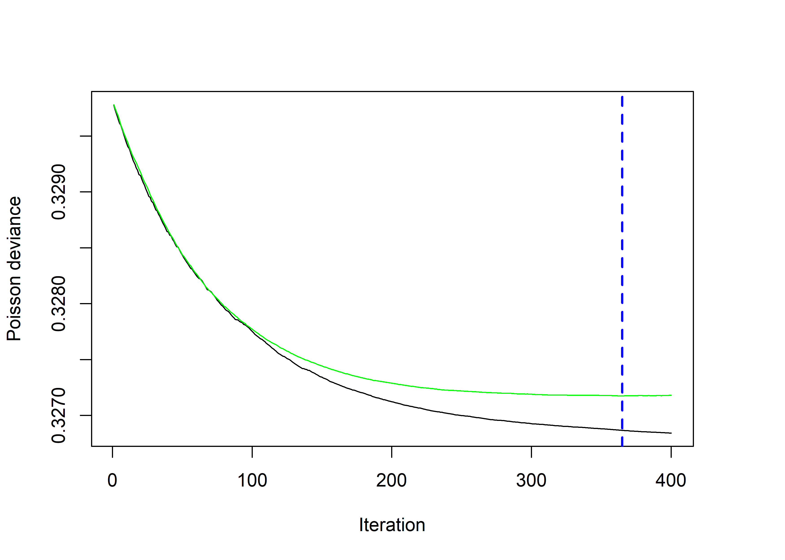

To get the numerical value,

``` r
best_iter = gbmt_performance(m0, method = "cv")
best_iter
```

    ## The best cross-validation iteration was 365.

The cross-validation error can be retrieved.

``` r
m0$cv_error[gbmt_performance(m0, method="cv")] # or m0$cv_error[best_iter]
```

    ## [1] 0.3271756

Let’s see the variable influence.

``` r
summary(m0, num_trees = best_iter)
```

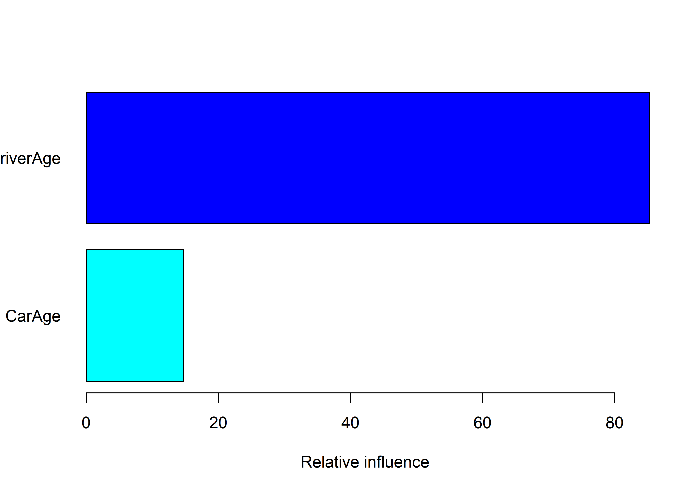

    ##                 var  rel_inf
    ## DriverAge DriverAge 85.29163
    ## CarAge       CarAge 14.70837

We can plot the partial dependencies of the variables.

``` r
par(mfrow = c(1, 2))
plot(m0, var_index = 1, num_trees = best_iter, type = "response")
plot(m0, var_index = 2, num_trees = best_iter, type = "response")
```

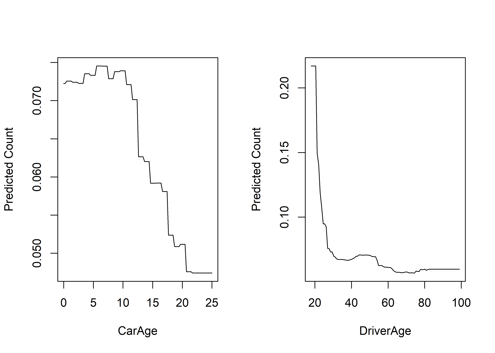

When we are finished, we can evaluate the performance of the model on
the validation set.

``` r
2 * (sum(dpois(x = testing_set$ClaimNb, lambda = testing_set$ClaimNb, log = TRUE)) -
    sum(dpois(x = testing_set$ClaimNb, lambda = predict(m0, newdata = testing_set,
        n.trees = best_iter, type = "response") * testing_set$Exposure, log = TRUE)))
```

    ## Warning in predict.GBMFit(m0, newdata = testing_set, n.trees = best_iter, :
    ## predict.GBMFit does not add the offset to the predicted values.

    ## [1] 20592.45

We can take a look at the first tree, using the *pretty_gbm_tree*
function.

``` r
pretty_gbm_tree(m0, tree_index =1) %>% 
  filter(SplitVar != -1) # Only keep non terminal nodes
```

    ##   SplitVar SplitCodePred LeftNode RightNode MissingNode ErrorReduction Weight
    ## 1        1          26.5        1         5          15     10.3689908 164346
    ## 2        1          21.5        2         3           4      2.5599754  13077
    ## 3        1          54.5        6        13          14      1.6810709 151269
    ## 4        1          43.5        7         8          12      0.4837179 110602
    ## 5        0          15.5        9        10          11      0.8530792  43680
    ##    Prediction
    ## 1 -0.16169634
    ## 2 -0.09202991
    ## 3 -0.13696844
    ## 4 -0.11400078
    ## 5 -0.09487140

## Using all the variables

``` r
set.seed(89)
m0_gbm = gbmt(ClaimNb ~ offset(log(Exposure)) + CarAge + DriverAge + Power + Brand + Gas + Region + Density,
         data = training_set,
         distribution = gbm_dist("Poisson"),
         train_params = training_params(num_trees = 500,
                                        shrinkage = 0.01, #Default is 0.001
                                        interaction_depth = 5,  #the max number of non - terminal nodes in each tree 
                                        min_num_obs_in_node = 1000,
                                        num_train = 1*nrow(training_set)),
         is_verbose = TRUE,
         keep_gbm_data = TRUE,
         par_details = gbmParallel(num_threads = 3)) #Parallel computing
```

    ## Fitting Final Model

    ## Iter   TrainDeviance   ValidDeviance   StepSize   Improve
    ##      1        0.3298             nan     0.0100    0.0000
    ##      2        0.3298             nan     0.0100    0.0000
    ##      3        0.3297             nan     0.0100    0.0000
    ##      4        0.3297             nan     0.0100    0.0000
    ##      5        0.3297             nan     0.0100    0.0000
    ##      6        0.3297             nan     0.0100    0.0000
    ##      7        0.3296             nan     0.0100    0.0000
    ##      8        0.3296             nan     0.0100    0.0000
    ##      9        0.3295             nan     0.0100    0.0000
    ##     10        0.3295             nan     0.0100    0.0000
    ##     20        0.3292             nan     0.0100    0.0000
    ##     40        0.3287             nan     0.0100    0.0000
    ##     60        0.3282             nan     0.0100    0.0000
    ##     80        0.3278             nan     0.0100    0.0000
    ##    100        0.3275             nan     0.0100    0.0000
    ##    120        0.3272             nan     0.0100    0.0000
    ##    140        0.3269             nan     0.0100    0.0000
    ##    160        0.3266             nan     0.0100    0.0000
    ##    180        0.3264             nan     0.0100    0.0000
    ##    200        0.3262             nan     0.0100    0.0000
    ##    220        0.3261             nan     0.0100    0.0000
    ##    240        0.3259             nan     0.0100    0.0000
    ##    260        0.3258             nan     0.0100    0.0000
    ##    280        0.3257             nan     0.0100    0.0000
    ##    300        0.3255             nan     0.0100   -0.0000
    ##    320        0.3254             nan     0.0100    0.0000
    ##    340        0.3253             nan     0.0100    0.0000
    ##    360        0.3252             nan     0.0100    0.0000
    ##    380        0.3251             nan     0.0100    0.0000
    ##    400        0.3251             nan     0.0100    0.0000
    ##    420        0.3250             nan     0.0100    0.0000
    ##    440        0.3249             nan     0.0100    0.0000
    ##    460        0.3249             nan     0.0100    0.0000
    ##    480        0.3248             nan     0.0100    0.0000
    ##    500        0.3247             nan     0.0100    0.0000

``` r
m0_gbm
```

    ## gbmt(formula = ClaimNb ~ offset(log(Exposure)) + CarAge + DriverAge + 
    ##     Power + Brand + Gas + Region + Density, distribution = gbm_dist("Poisson"), 
    ##     data = training_set, train_params = training_params(num_trees = 500, 
    ##         shrinkage = 0.01, interaction_depth = 5, min_num_obs_in_node = 1000, 
    ##         num_train = 1 * nrow(training_set)), keep_gbm_data = TRUE, 
    ##     par_details = gbmParallel(num_threads = 3), is_verbose = TRUE)
    ## A gradient boosted model with Poisson loss function.
    ##  500 iterations were performed.
    ## There were 7 predictors of which 7 had non-zero influence.

We can, using the OOB, find the optimal number of iterations.

``` r
gbmt_performance(m0_gbm)
```

    ## Using OOB method...

    ## OOB generally underestimates the optimal number of iterations although predictive performance is reasonably competitive.
    ##             Using cv_folds>1 when calling gbm usually results in improved predictive performance.

    ## The best out-of-bag iteration was 500.

``` r
m1_gbm = gbm_more(m0_gbm, num_new_trees = 500, is_verbose = TRUE)
```

    ## Iter   TrainDeviance   ValidDeviance   StepSize   Improve
    ##    501        0.3247             nan     0.0100    0.0000
    ##    502        0.3247             nan     0.0100    0.0000
    ##    503        0.3247             nan     0.0100    0.0000
    ##    504        0.3247             nan     0.0100    0.0000
    ##    505        0.3247             nan     0.0100    0.0000
    ##    506        0.3247             nan     0.0100   -0.0000
    ##    507        0.3247             nan     0.0100   -0.0000
    ##    508        0.3247             nan     0.0100   -0.0000
    ##    509        0.3247             nan     0.0100    0.0000
    ##    510        0.3247             nan     0.0100    0.0000
    ##    520        0.3247             nan     0.0100    0.0000
    ##    540        0.3246             nan     0.0100    0.0000
    ##    560        0.3246             nan     0.0100    0.0000
    ##    580        0.3246             nan     0.0100    0.0000
    ##    600        0.3245             nan     0.0100   -0.0000
    ##    620        0.3245             nan     0.0100   -0.0000
    ##    640        0.3245             nan     0.0100    0.0000
    ##    660        0.3244             nan     0.0100    0.0000
    ##    680        0.3244             nan     0.0100    0.0000
    ##    700        0.3244             nan     0.0100    0.0000
    ##    720        0.3243             nan     0.0100   -0.0000
    ##    740        0.3243             nan     0.0100    0.0000
    ##    760        0.3243             nan     0.0100   -0.0000
    ##    780        0.3242             nan     0.0100   -0.0000
    ##    800        0.3242             nan     0.0100   -0.0000
    ##    820        0.3242             nan     0.0100   -0.0000
    ##    840        0.3242             nan     0.0100   -0.0000
    ##    860        0.3241             nan     0.0100   -0.0000
    ##    880        0.3241             nan     0.0100   -0.0000
    ##    900        0.3241             nan     0.0100   -0.0000
    ##    920        0.3241             nan     0.0100   -0.0000
    ##    940        0.3240             nan     0.0100   -0.0000
    ##    960        0.3240             nan     0.0100   -0.0000
    ##    980        0.3240             nan     0.0100   -0.0000
    ##   1000        0.3240             nan     0.0100   -0.0000

Checking the performance now..

``` r
gbmt_performance(m1_gbm)
```

    ## Using OOB method...

    ## OOB generally underestimates the optimal number of iterations although predictive performance is reasonably competitive.
    ##             Using cv_folds>1 when calling gbm usually results in improved predictive performance.

    ## The best out-of-bag iteration was 709.

Let’s now perform the cross-validation with 1000 trees. (\~ 6 minutes)

``` r
set.seed(89)
m0_gbm = gbmt(ClaimNb ~ offset(log(Exposure)) + CarAge + DriverAge + Power + Brand + Gas + Region + Density,
         data = training_set,
         distribution = gbm_dist("Poisson"),
         train_params = training_params(num_trees = 1000,
                                        shrinkage = 0.01, #Default is 0.001
                                        interaction_depth = 5,  #the max number of non - terminal nodes in each tree 
                                        min_num_obs_in_node = 1000,
                                        bag_fraction = 0.5,
                                        num_train = 1*nrow(training_set)),
         is_verbose = TRUE,
         cv_folds = 5,
         keep_gbm_data = TRUE,
         par_details = gbmParallel(num_threads = 3)) #Parallel computing
```

    ## Fitting Final Model

    ## Iter   TrainDeviance   ValidDeviance   StepSize   Improve
    ##      1        0.3298             nan     0.0100    0.0000
    ##      2        0.3298             nan     0.0100    0.0000
    ##      3        0.3297             nan     0.0100    0.0000
    ##      4        0.3297             nan     0.0100    0.0000
    ##      5        0.3297             nan     0.0100    0.0000
    ##      6        0.3297             nan     0.0100    0.0000
    ##      7        0.3296             nan     0.0100    0.0000
    ##      8        0.3296             nan     0.0100    0.0000
    ##      9        0.3295             nan     0.0100    0.0000
    ##     10        0.3295             nan     0.0100    0.0000
    ##     20        0.3292             nan     0.0100    0.0000
    ##     40        0.3287             nan     0.0100    0.0000
    ##     60        0.3282             nan     0.0100    0.0000
    ##     80        0.3278             nan     0.0100    0.0000
    ##    100        0.3275             nan     0.0100    0.0000
    ##    120        0.3272             nan     0.0100    0.0000
    ##    140        0.3269             nan     0.0100    0.0000
    ##    160        0.3266             nan     0.0100    0.0000
    ##    180        0.3264             nan     0.0100    0.0000
    ##    200        0.3262             nan     0.0100    0.0000
    ##    220        0.3261             nan     0.0100    0.0000
    ##    240        0.3259             nan     0.0100    0.0000
    ##    260        0.3258             nan     0.0100    0.0000
    ##    280        0.3257             nan     0.0100    0.0000
    ##    300        0.3255             nan     0.0100   -0.0000
    ##    320        0.3254             nan     0.0100    0.0000
    ##    340        0.3253             nan     0.0100    0.0000
    ##    360        0.3252             nan     0.0100    0.0000
    ##    380        0.3251             nan     0.0100    0.0000
    ##    400        0.3251             nan     0.0100    0.0000
    ##    420        0.3250             nan     0.0100    0.0000
    ##    440        0.3249             nan     0.0100    0.0000
    ##    460        0.3249             nan     0.0100    0.0000
    ##    480        0.3248             nan     0.0100    0.0000
    ##    500        0.3247             nan     0.0100    0.0000
    ##    520        0.3247             nan     0.0100    0.0000
    ##    540        0.3246             nan     0.0100    0.0000
    ##    560        0.3246             nan     0.0100    0.0000
    ##    580        0.3246             nan     0.0100    0.0000
    ##    600        0.3245             nan     0.0100   -0.0000
    ##    620        0.3245             nan     0.0100   -0.0000
    ##    640        0.3245             nan     0.0100    0.0000
    ##    660        0.3244             nan     0.0100    0.0000
    ##    680        0.3244             nan     0.0100    0.0000
    ##    700        0.3244             nan     0.0100    0.0000
    ##    720        0.3243             nan     0.0100   -0.0000
    ##    740        0.3243             nan     0.0100    0.0000
    ##    760        0.3243             nan     0.0100   -0.0000
    ##    780        0.3242             nan     0.0100   -0.0000
    ##    800        0.3242             nan     0.0100   -0.0000
    ##    820        0.3242             nan     0.0100   -0.0000
    ##    840        0.3242             nan     0.0100   -0.0000
    ##    860        0.3241             nan     0.0100   -0.0000
    ##    880        0.3241             nan     0.0100   -0.0000
    ##    900        0.3241             nan     0.0100   -0.0000
    ##    920        0.3241             nan     0.0100   -0.0000
    ##    940        0.3240             nan     0.0100   -0.0000
    ##    960        0.3240             nan     0.0100   -0.0000
    ##    980        0.3240             nan     0.0100   -0.0000
    ##   1000        0.3240             nan     0.0100   -0.0000

    ## CV:1

    ## Iter   TrainDeviance   ValidDeviance   StepSize   Improve
    ##      1        0.3308          0.3257     0.0100    0.0000
    ##      2        0.3308          0.3257     0.0100    0.0000
    ##      3        0.3308          0.3257     0.0100    0.0000
    ##      4        0.3307          0.3257     0.0100    0.0000
    ##      5        0.3307          0.3256     0.0100    0.0000
    ##      6        0.3306          0.3256     0.0100    0.0000
    ##      7        0.3306          0.3255     0.0100    0.0000
    ##      8        0.3306          0.3255     0.0100    0.0000
    ##      9        0.3305          0.3255     0.0100    0.0000
    ##     10        0.3305          0.3255     0.0100    0.0000
    ##     20        0.3303          0.3253     0.0100    0.0000
    ##     40        0.3297          0.3247     0.0100    0.0000
    ##     60        0.3293          0.3243     0.0100    0.0000
    ##     80        0.3289          0.3239     0.0100    0.0000
    ##    100        0.3285          0.3235     0.0100    0.0000
    ##    120        0.3282          0.3232     0.0100    0.0000
    ##    140        0.3279          0.3230     0.0100    0.0000
    ##    160        0.3276          0.3227     0.0100    0.0000
    ##    180        0.3274          0.3225     0.0100    0.0000
    ##    200        0.3272          0.3224     0.0100    0.0000
    ##    220        0.3270          0.3222     0.0100    0.0000
    ##    240        0.3269          0.3221     0.0100    0.0000
    ##    260        0.3267          0.3219     0.0100    0.0000
    ##    280        0.3266          0.3218     0.0100    0.0000
    ##    300        0.3264          0.3217     0.0100   -0.0000
    ##    320        0.3263          0.3217     0.0100    0.0000
    ##    340        0.3262          0.3216     0.0100    0.0000
    ##    360        0.3262          0.3215     0.0100    0.0000
    ##    380        0.3261          0.3215     0.0100    0.0000
    ##    400        0.3260          0.3214     0.0100    0.0000
    ##    420        0.3259          0.3214     0.0100   -0.0000
    ##    440        0.3258          0.3213     0.0100   -0.0000
    ##    460        0.3258          0.3213     0.0100   -0.0000
    ##    480        0.3257          0.3212     0.0100    0.0000
    ##    500        0.3256          0.3212     0.0100   -0.0000
    ##    520        0.3256          0.3212     0.0100    0.0000
    ##    540        0.3255          0.3212     0.0100    0.0000
    ##    560        0.3255          0.3211     0.0100   -0.0000
    ##    580        0.3254          0.3211     0.0100   -0.0000
    ##    600        0.3254          0.3211     0.0100   -0.0000
    ##    620        0.3254          0.3211     0.0100    0.0000
    ##    640        0.3253          0.3210     0.0100   -0.0000
    ##    660        0.3253          0.3210     0.0100   -0.0000
    ##    680        0.3253          0.3210     0.0100   -0.0000
    ##    700        0.3252          0.3210     0.0100    0.0000
    ##    720        0.3252          0.3210     0.0100    0.0000
    ##    740        0.3251          0.3210     0.0100   -0.0000
    ##    760        0.3251          0.3210     0.0100    0.0000
    ##    780        0.3251          0.3210     0.0100    0.0000
    ##    800        0.3251          0.3210     0.0100   -0.0000
    ##    820        0.3250          0.3210     0.0100   -0.0000
    ##    840        0.3250          0.3210     0.0100   -0.0000
    ##    860        0.3250          0.3210     0.0100   -0.0000
    ##    880        0.3249          0.3209     0.0100   -0.0000
    ##    900        0.3249          0.3209     0.0100   -0.0000
    ##    920        0.3249          0.3209     0.0100   -0.0000
    ##    940        0.3249          0.3209     0.0100   -0.0000
    ##    960        0.3248          0.3209     0.0100   -0.0000
    ##    980        0.3248          0.3209     0.0100   -0.0000
    ##   1000        0.3248          0.3209     0.0100   -0.0000

    ## CV:2

    ## Iter   TrainDeviance   ValidDeviance   StepSize   Improve
    ##      1        0.3294          0.3314     0.0100    0.0000
    ##      2        0.3294          0.3314     0.0100    0.0000
    ##      3        0.3293          0.3314     0.0100    0.0000
    ##      4        0.3293          0.3313     0.0100    0.0000
    ##      5        0.3292          0.3313     0.0100    0.0000
    ##      6        0.3292          0.3313     0.0100    0.0000
    ##      7        0.3292          0.3312     0.0100    0.0000
    ##      8        0.3292          0.3312     0.0100    0.0000
    ##      9        0.3291          0.3312     0.0100    0.0000
    ##     10        0.3291          0.3312     0.0100    0.0000
    ##     20        0.3288          0.3309     0.0100    0.0000
    ##     40        0.3283          0.3304     0.0100    0.0000
    ##     60        0.3278          0.3300     0.0100    0.0000
    ##     80        0.3275          0.3297     0.0100    0.0000
    ##    100        0.3271          0.3294     0.0100    0.0000
    ##    120        0.3268          0.3291     0.0100    0.0000
    ##    140        0.3265          0.3288     0.0100    0.0000
    ##    160        0.3263          0.3286     0.0100    0.0000
    ##    180        0.3261          0.3284     0.0100    0.0000
    ##    200        0.3259          0.3283     0.0100    0.0000
    ##    220        0.3257          0.3281     0.0100    0.0000
    ##    240        0.3255          0.3280     0.0100    0.0000
    ##    260        0.3254          0.3279     0.0100    0.0000
    ##    280        0.3252          0.3278     0.0100    0.0000
    ##    300        0.3251          0.3277     0.0100    0.0000
    ##    320        0.3250          0.3276     0.0100    0.0000
    ##    340        0.3249          0.3275     0.0100   -0.0000
    ##    360        0.3248          0.3274     0.0100    0.0000
    ##    380        0.3247          0.3274     0.0100    0.0000
    ##    400        0.3246          0.3273     0.0100    0.0000
    ##    420        0.3245          0.3273     0.0100    0.0000
    ##    440        0.3244          0.3272     0.0100    0.0000
    ##    460        0.3244          0.3272     0.0100    0.0000
    ##    480        0.3243          0.3271     0.0100    0.0000
    ##    500        0.3243          0.3271     0.0100    0.0000
    ##    520        0.3242          0.3270     0.0100    0.0000
    ##    540        0.3241          0.3270     0.0100   -0.0000
    ##    560        0.3241          0.3270     0.0100    0.0000
    ##    580        0.3241          0.3270     0.0100   -0.0000
    ##    600        0.3240          0.3270     0.0100    0.0000
    ##    620        0.3240          0.3270     0.0100    0.0000
    ##    640        0.3239          0.3270     0.0100   -0.0000
    ##    660        0.3239          0.3270     0.0100   -0.0000
    ##    680        0.3239          0.3269     0.0100    0.0000
    ##    700        0.3238          0.3269     0.0100    0.0000
    ##    720        0.3238          0.3269     0.0100   -0.0000
    ##    740        0.3238          0.3269     0.0100   -0.0000
    ##    760        0.3237          0.3269     0.0100    0.0000
    ##    780        0.3237          0.3269     0.0100    0.0000
    ##    800        0.3237          0.3269     0.0100   -0.0000
    ##    820        0.3236          0.3269     0.0100    0.0000
    ##    840        0.3236          0.3269     0.0100   -0.0000
    ##    860        0.3236          0.3269     0.0100   -0.0000
    ##    880        0.3236          0.3269     0.0100   -0.0000
    ##    900        0.3235          0.3269     0.0100    0.0000
    ##    920        0.3235          0.3269     0.0100   -0.0000
    ##    940        0.3235          0.3269     0.0100    0.0000
    ##    960        0.3234          0.3269     0.0100   -0.0000
    ##    980        0.3234          0.3268     0.0100   -0.0000
    ##   1000        0.3234          0.3268     0.0100   -0.0000

    ## CV:3

    ## Iter   TrainDeviance   ValidDeviance   StepSize   Improve
    ##      1        0.3297          0.3301     0.0100    0.0000
    ##      2        0.3297          0.3301     0.0100    0.0000
    ##      3        0.3297          0.3300     0.0100    0.0000
    ##      4        0.3297          0.3300     0.0100    0.0000
    ##      5        0.3296          0.3300     0.0100    0.0000
    ##      6        0.3296          0.3300     0.0100    0.0000
    ##      7        0.3296          0.3300     0.0100    0.0000
    ##      8        0.3296          0.3299     0.0100    0.0000
    ##      9        0.3295          0.3299     0.0100    0.0000
    ##     10        0.3295          0.3299     0.0100    0.0000
    ##     20        0.3292          0.3296     0.0100    0.0000
    ##     40        0.3287          0.3291     0.0100    0.0000
    ##     60        0.3282          0.3287     0.0100    0.0000
    ##     80        0.3279          0.3284     0.0100    0.0000
    ##    100        0.3275          0.3281     0.0100    0.0000
    ##    120        0.3272          0.3278     0.0100    0.0000
    ##    140        0.3269          0.3276     0.0100    0.0000
    ##    160        0.3266          0.3273     0.0100    0.0000
    ##    180        0.3265          0.3272     0.0100    0.0000
    ##    200        0.3263          0.3270     0.0100    0.0000
    ##    220        0.3261          0.3268     0.0100    0.0000
    ##    240        0.3259          0.3267     0.0100    0.0000
    ##    260        0.3258          0.3266     0.0100    0.0000
    ##    280        0.3256          0.3264     0.0100    0.0000
    ##    300        0.3255          0.3263     0.0100    0.0000
    ##    320        0.3254          0.3262     0.0100    0.0000
    ##    340        0.3253          0.3261     0.0100    0.0000
    ##    360        0.3252          0.3261     0.0100    0.0000
    ##    380        0.3251          0.3260     0.0100    0.0000
    ##    400        0.3250          0.3259     0.0100    0.0000
    ##    420        0.3249          0.3259     0.0100    0.0000
    ##    440        0.3248          0.3258     0.0100    0.0000
    ##    460        0.3247          0.3257     0.0100    0.0000
    ##    480        0.3247          0.3257     0.0100    0.0000
    ##    500        0.3246          0.3257     0.0100    0.0000
    ##    520        0.3246          0.3256     0.0100    0.0000
    ##    540        0.3245          0.3256     0.0100   -0.0000
    ##    560        0.3245          0.3256     0.0100    0.0000
    ##    580        0.3244          0.3255     0.0100    0.0000
    ##    600        0.3244          0.3255     0.0100    0.0000
    ##    620        0.3243          0.3255     0.0100    0.0000
    ##    640        0.3243          0.3255     0.0100    0.0000
    ##    660        0.3243          0.3254     0.0100    0.0000
    ##    680        0.3242          0.3254     0.0100    0.0000
    ##    700        0.3242          0.3254     0.0100   -0.0000
    ##    720        0.3242          0.3254     0.0100   -0.0000
    ##    740        0.3241          0.3254     0.0100   -0.0000
    ##    760        0.3241          0.3254     0.0100    0.0000
    ##    780        0.3241          0.3253     0.0100   -0.0000
    ##    800        0.3240          0.3253     0.0100    0.0000
    ##    820        0.3240          0.3253     0.0100   -0.0000
    ##    840        0.3240          0.3253     0.0100    0.0000
    ##    860        0.3240          0.3253     0.0100   -0.0000
    ##    880        0.3239          0.3253     0.0100   -0.0000
    ##    900        0.3239          0.3253     0.0100    0.0000
    ##    920        0.3239          0.3253     0.0100    0.0000
    ##    940        0.3239          0.3253     0.0100   -0.0000
    ##    960        0.3238          0.3253     0.0100   -0.0000
    ##    980        0.3238          0.3253     0.0100   -0.0000
    ##   1000        0.3238          0.3253     0.0100   -0.0000

    ## CV:4

    ## Iter   TrainDeviance   ValidDeviance   StepSize   Improve
    ##      1        0.3297          0.3301     0.0100    0.0000
    ##      2        0.3297          0.3301     0.0100    0.0000
    ##      3        0.3296          0.3300     0.0100    0.0000
    ##      4        0.3296          0.3300     0.0100    0.0000
    ##      5        0.3296          0.3300     0.0100    0.0000
    ##      6        0.3296          0.3300     0.0100    0.0000
    ##      7        0.3295          0.3299     0.0100    0.0000
    ##      8        0.3295          0.3299     0.0100    0.0000
    ##      9        0.3295          0.3299     0.0100    0.0000
    ##     10        0.3295          0.3299     0.0100    0.0000
    ##     20        0.3292          0.3297     0.0100    0.0000
    ##     40        0.3287          0.3292     0.0100    0.0000
    ##     60        0.3282          0.3287     0.0100    0.0000
    ##     80        0.3279          0.3285     0.0100    0.0000
    ##    100        0.3275          0.3281     0.0100    0.0000
    ##    120        0.3272          0.3279     0.0100    0.0000
    ##    140        0.3269          0.3276     0.0100    0.0000
    ##    160        0.3266          0.3274     0.0100    0.0000
    ##    180        0.3264          0.3272     0.0100    0.0000
    ##    200        0.3261          0.3270     0.0100    0.0000
    ##    220        0.3259          0.3268     0.0100    0.0000
    ##    240        0.3258          0.3267     0.0100    0.0000
    ##    260        0.3256          0.3266     0.0100    0.0000
    ##    280        0.3255          0.3265     0.0100    0.0000
    ##    300        0.3253          0.3264     0.0100    0.0000
    ##    320        0.3252          0.3263     0.0100    0.0000
    ##    340        0.3251          0.3262     0.0100    0.0000
    ##    360        0.3250          0.3262     0.0100    0.0000
    ##    380        0.3249          0.3261     0.0100    0.0000
    ##    400        0.3249          0.3260     0.0100    0.0000
    ##    420        0.3248          0.3260     0.0100    0.0000
    ##    440        0.3247          0.3259     0.0100   -0.0000
    ##    460        0.3246          0.3259     0.0100    0.0000
    ##    480        0.3246          0.3259     0.0100    0.0000
    ##    500        0.3245          0.3259     0.0100    0.0000
    ##    520        0.3245          0.3258     0.0100    0.0000
    ##    540        0.3244          0.3258     0.0100    0.0000
    ##    560        0.3243          0.3257     0.0100    0.0000
    ##    580        0.3243          0.3257     0.0100    0.0000
    ##    600        0.3243          0.3257     0.0100   -0.0000
    ##    620        0.3242          0.3257     0.0100    0.0000
    ##    640        0.3242          0.3257     0.0100    0.0000
    ##    660        0.3242          0.3257     0.0100   -0.0000
    ##    680        0.3241          0.3256     0.0100   -0.0000
    ##    700        0.3241          0.3257     0.0100    0.0000
    ##    720        0.3241          0.3256     0.0100   -0.0000
    ##    740        0.3240          0.3256     0.0100    0.0000
    ##    760        0.3240          0.3256     0.0100    0.0000
    ##    780        0.3240          0.3256     0.0100   -0.0000
    ##    800        0.3239          0.3256     0.0100   -0.0000
    ##    820        0.3239          0.3256     0.0100   -0.0000
    ##    840        0.3239          0.3256     0.0100   -0.0000
    ##    860        0.3238          0.3256     0.0100    0.0000
    ##    880        0.3238          0.3256     0.0100   -0.0000
    ##    900        0.3238          0.3255     0.0100   -0.0000
    ##    920        0.3238          0.3255     0.0100   -0.0000
    ##    940        0.3237          0.3255     0.0100   -0.0000
    ##    960        0.3237          0.3255     0.0100   -0.0000
    ##    980        0.3237          0.3255     0.0100   -0.0000
    ##   1000        0.3236          0.3255     0.0100   -0.0000

    ## CV:5

    ## Iter   TrainDeviance   ValidDeviance   StepSize   Improve
    ##      1        0.3293          0.3316     0.0100    0.0000
    ##      2        0.3293          0.3316     0.0100    0.0000
    ##      3        0.3293          0.3316     0.0100    0.0000
    ##      4        0.3293          0.3316     0.0100    0.0000
    ##      5        0.3292          0.3315     0.0100    0.0000
    ##      6        0.3292          0.3315     0.0100    0.0000
    ##      7        0.3292          0.3315     0.0100    0.0000
    ##      8        0.3291          0.3314     0.0100    0.0000
    ##      9        0.3291          0.3314     0.0100    0.0000
    ##     10        0.3291          0.3314     0.0100    0.0000
    ##     20        0.3287          0.3311     0.0100    0.0000
    ##     40        0.3282          0.3306     0.0100    0.0000
    ##     60        0.3278          0.3302     0.0100    0.0000
    ##     80        0.3274          0.3298     0.0100    0.0000
    ##    100        0.3270          0.3295     0.0100    0.0000
    ##    120        0.3267          0.3292     0.0100    0.0000
    ##    140        0.3265          0.3290     0.0100    0.0000
    ##    160        0.3262          0.3288     0.0100    0.0000
    ##    180        0.3260          0.3286     0.0100    0.0000
    ##    200        0.3258          0.3284     0.0100    0.0000
    ##    220        0.3256          0.3282     0.0100    0.0000
    ##    240        0.3254          0.3280     0.0100    0.0000
    ##    260        0.3253          0.3279     0.0100    0.0000
    ##    280        0.3252          0.3278     0.0100    0.0000
    ##    300        0.3250          0.3277     0.0100    0.0000
    ##    320        0.3249          0.3276     0.0100    0.0000
    ##    340        0.3248          0.3275     0.0100    0.0000
    ##    360        0.3247          0.3274     0.0100    0.0000
    ##    380        0.3246          0.3273     0.0100    0.0000
    ##    400        0.3245          0.3273     0.0100    0.0000
    ##    420        0.3245          0.3272     0.0100    0.0000
    ##    440        0.3244          0.3272     0.0100    0.0000
    ##    460        0.3243          0.3271     0.0100   -0.0000
    ##    480        0.3243          0.3271     0.0100   -0.0000
    ##    500        0.3242          0.3270     0.0100   -0.0000
    ##    520        0.3242          0.3270     0.0100    0.0000
    ##    540        0.3241          0.3270     0.0100    0.0000
    ##    560        0.3241          0.3269     0.0100   -0.0000
    ##    580        0.3240          0.3269     0.0100   -0.0000
    ##    600        0.3240          0.3269     0.0100   -0.0000
    ##    620        0.3240          0.3269     0.0100   -0.0000
    ##    640        0.3239          0.3269     0.0100    0.0000
    ##    660        0.3239          0.3268     0.0100   -0.0000
    ##    680        0.3238          0.3268     0.0100   -0.0000
    ##    700        0.3238          0.3268     0.0100   -0.0000
    ##    720        0.3238          0.3268     0.0100    0.0000
    ##    740        0.3237          0.3268     0.0100   -0.0000
    ##    760        0.3237          0.3268     0.0100   -0.0000
    ##    780        0.3237          0.3268     0.0100    0.0000
    ##    800        0.3236          0.3267     0.0100   -0.0000
    ##    820        0.3236          0.3267     0.0100   -0.0000
    ##    840        0.3236          0.3267     0.0100   -0.0000
    ##    860        0.3236          0.3267     0.0100    0.0000
    ##    880        0.3235          0.3267     0.0100    0.0000
    ##    900        0.3235          0.3267     0.0100   -0.0000
    ##    920        0.3235          0.3267     0.0100   -0.0000
    ##    940        0.3235          0.3267     0.0100   -0.0000
    ##    960        0.3234          0.3267     0.0100    0.0000
    ##    980        0.3234          0.3267     0.0100   -0.0000
    ##   1000        0.3234          0.3267     0.0100    0.0000

``` r
m0_gbm
```

    ## gbmt(formula = ClaimNb ~ offset(log(Exposure)) + CarAge + DriverAge + 
    ##     Power + Brand + Gas + Region + Density, distribution = gbm_dist("Poisson"), 
    ##     data = training_set, train_params = training_params(num_trees = 1000, 
    ##         shrinkage = 0.01, interaction_depth = 5, min_num_obs_in_node = 1000, 
    ##         bag_fraction = 0.5, num_train = 1 * nrow(training_set)), 
    ##     cv_folds = 5, keep_gbm_data = TRUE, par_details = gbmParallel(num_threads = 3), 
    ##     is_verbose = TRUE)
    ## A gradient boosted model with Poisson loss function.
    ##  1000 iterations were performed.
    ## The best cross-validation iteration was 996.
    ## There were 7 predictors of which 7 had non-zero influence.

Let’s now plot the performance.

``` r
plot(gbmt_performance(m0_gbm), method = "cv")
```

    ## Using cv method...

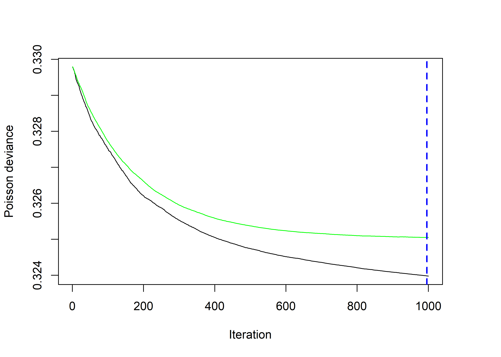

``` r
best_iter = gbmt_performance(m0_gbm, "cv")
best_iter
```

    ## The best cross-validation iteration was 996.

We can see the variable importance.

``` r
summary(m0_gbm)
```

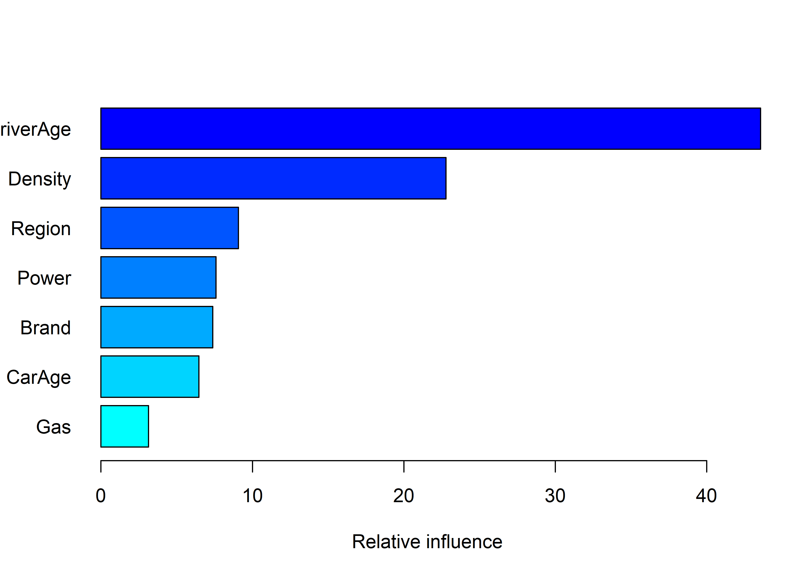

    ##                 var   rel_inf
    ## DriverAge DriverAge 43.554801
    ## Density     Density 22.784335
    ## Region       Region  9.077612
    ## Power         Power  7.591321
    ## Brand         Brand  7.387304
    ## CarAge       CarAge  6.459741
    ## Gas             Gas  3.144885

We can take a look at the partial dependencies.

``` r
par(mfrow = c(2, 4))
for (i in 1:7) {
    plot(m0_gbm, var_index = i, num_trees = best_iter, type = "response")
}
```

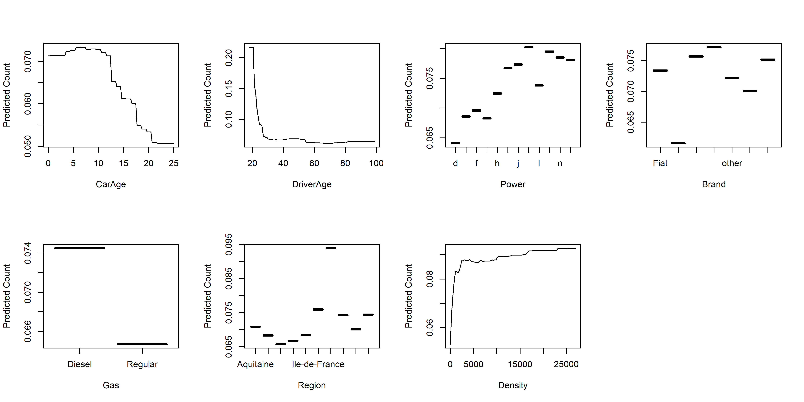

Let’s compute Friedman’s H statistic for interaction, for all the
possible couple of variable.

``` r
var_names = c("CarAge", "DriverAge", "Power", "Brand", "Gas", "Region", "Density")

res = matrix(NA, 7, 7)
for (i in 1:6) {
    for (j in (i + 1):7) {
        res[i, j] = interact(gbm_fit_obj = m0_gbm, data = training_set, var_indices = c(i,
            j), best_iter)
    }
}
diag(res) = 0
row.names(res) = var_names
colnames(res) = row.names(res)

interact_melt <- melt(res, na.rm = TRUE)

ggplot(data = interact_melt, aes(x = Var1, y = Var2, fill = value)) + geom_tile(color = "white") +
    scale_fill_gradient2(low = "white", mid = "gray", high = "blue", name = "Friedman's\nH-statistic") +
    theme(axis.text.x = element_text(angle = 45, vjust = 1, size = 12, hjust = 1)) +
    coord_fixed()
```

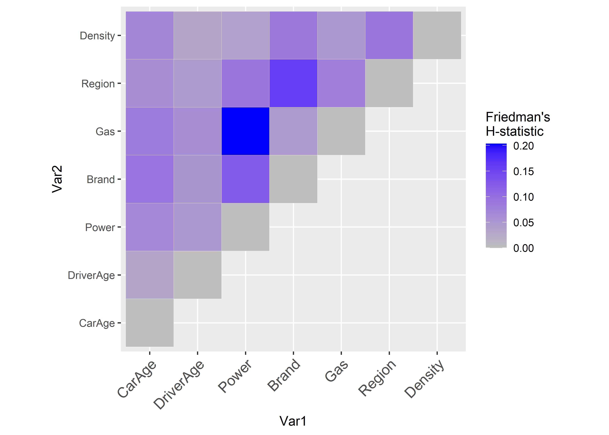
Let us plot the partial dependencies of some of these variables.

``` r
plot(m0_gbm, var_index = c(which(var_names == "Gas"), which(var_names == "Power")),
    num_trees = best_iter, type = "response")  #Power, Gas
```

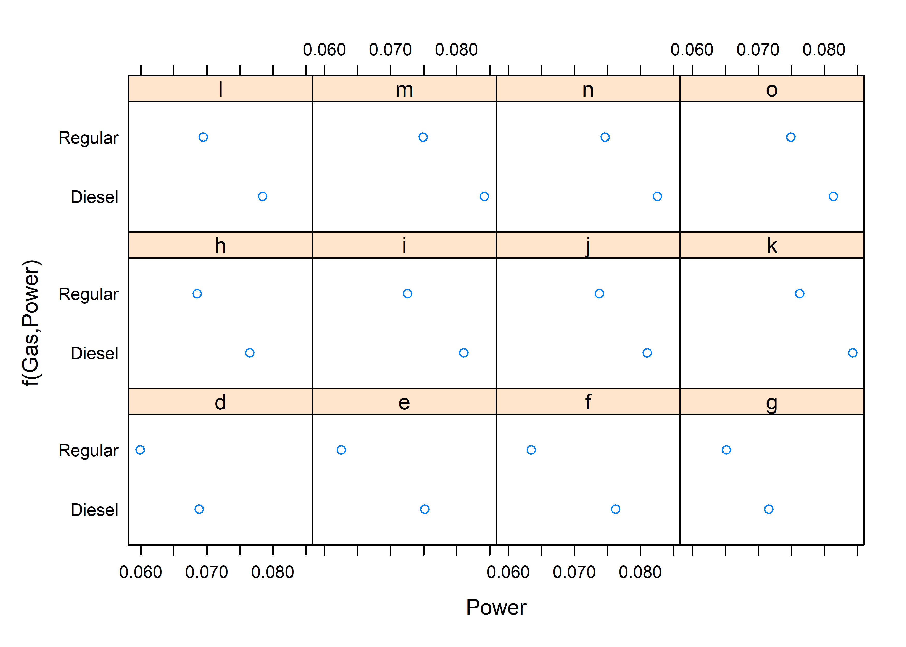

``` r
plot(m0_gbm, var_index = c(which(var_names == "Gas"), which(var_names == "Region")),
    num_trees = best_iter, type = "response")  # Gas, Region
```

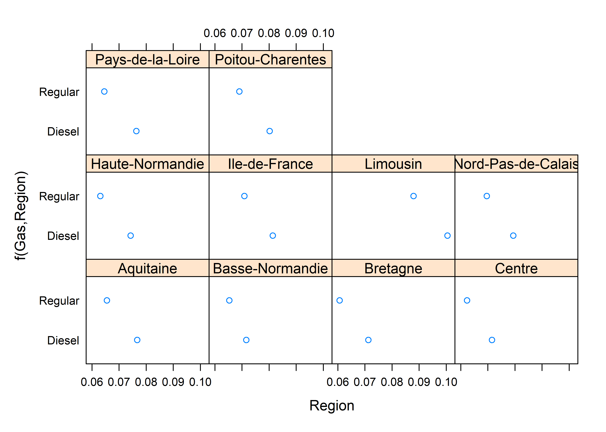

``` r
plot(m0_gbm, var_index = c(which(var_names == "Brand"), which(var_names == "CarAge")),
    num_trees = best_iter, type = "response")
```

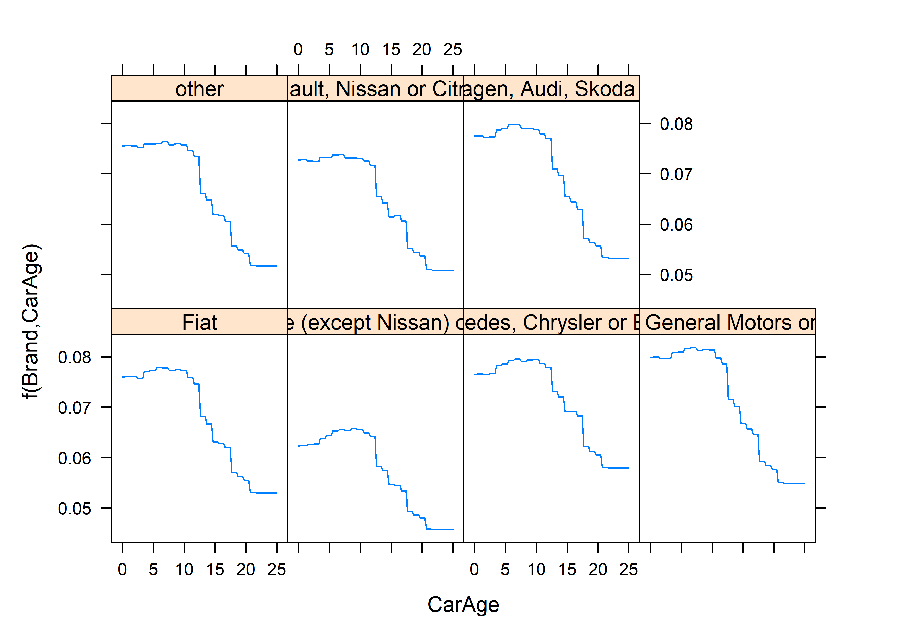

``` r
plot(m0_gbm, var_index = c(which(var_names == "Power"), which(var_names == "Brand")),
    num_trees = best_iter, type = "response")  # Gas, Region
```

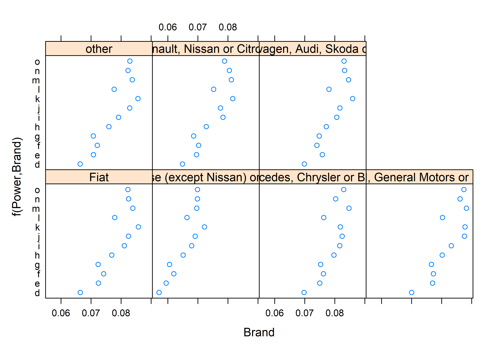

``` r
plot(m0_gbm, var_index = c(which(var_names == "CarAge"), which(var_names == "DriverAge")),
    num_trees = best_iter, type = "response")  # Gas, Region
```

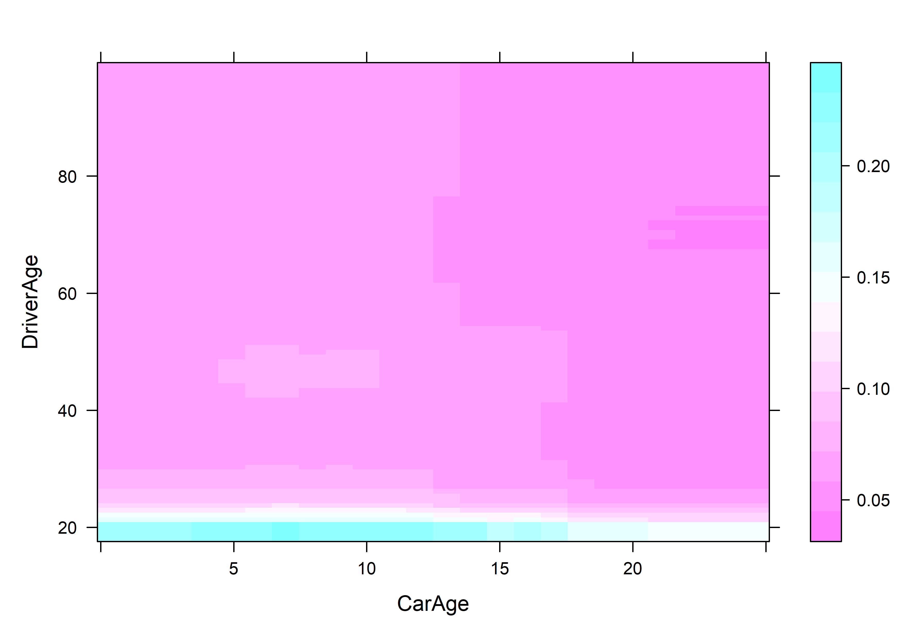

We can check the power of prediction of the model.

``` r
2 * (sum(dpois(x = testing_set$ClaimNb, lambda = testing_set$ClaimNb, log = TRUE)) -
    sum(dpois(x = testing_set$ClaimNb, lambda = predict(m0_gbm, newdata = testing_set,
        n.trees = best_iter, type = "response") * testing_set$Exposure, log = TRUE)))
```

    ## [1] 20413.93

## Tweaking the model

We would have to tweak the parameters. We should define a grid of
parameters and perform cross-validation to choose the optimal
parameters. Due to time restriction, we will only show one example, for
instance :

``` r
set.seed(89)
m1_gbm = gbmt(ClaimNb ~ offset(log(Exposure)) + CarAge + DriverAge + Power + Brand + Gas + Region + Density,
         data = training_set,
         distribution = gbm_dist("Poisson"),
         train_params = training_params(num_trees = 1000,
                                        shrinkage = 0.01, #Default is 0.001
                                        interaction_depth = 10,  #the max number of non-terminal nodes in each tree 
                                        min_num_obs_in_node = 1000,
                                        num_train = 1*nrow(training_set)),
         is_verbose = FALSE,
         cv_folds = 5,
         par_details = gbmParallel(num_threads = 3)) #Parallel computing
m1_gbm
```

    ## gbmt(formula = ClaimNb ~ offset(log(Exposure)) + CarAge + DriverAge + 
    ##     Power + Brand + Gas + Region + Density, distribution = gbm_dist("Poisson"), 
    ##     data = training_set, train_params = training_params(num_trees = 1000, 
    ##         shrinkage = 0.01, interaction_depth = 10, min_num_obs_in_node = 1000, 
    ##         num_train = 1 * nrow(training_set)), cv_folds = 5, par_details = gbmParallel(num_threads = 3), 
    ##     is_verbose = FALSE)
    ## A gradient boosted model with Poisson loss function.
    ##  1000 iterations were performed.
    ## The best cross-validation iteration was 999.
    ## There were 7 predictors of which 7 had non-zero influence.

Let’s take a look at the performance.

``` r
plot(gbmt_performance(m1_gbm, method = "cv"))
```

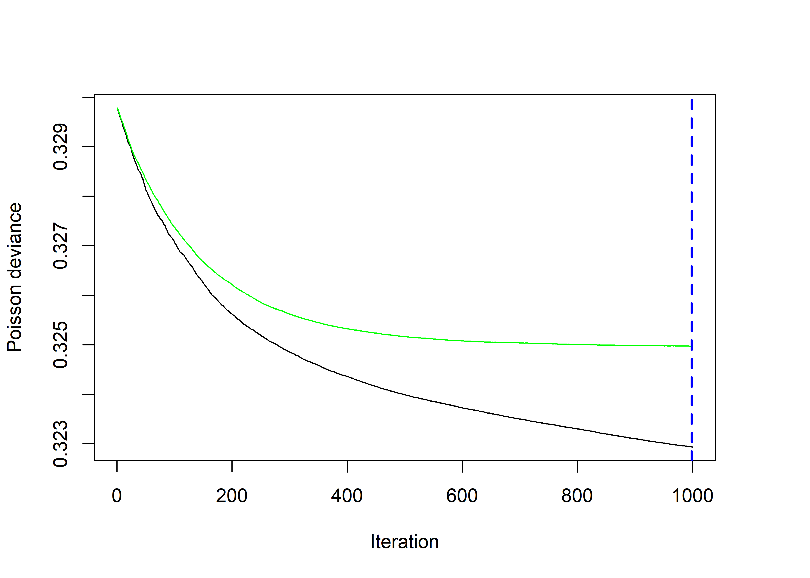

Let’s compare both cross-validation errors.

``` r
c(min(m0_gbm$cv_error),min(m1_gbm$cv_error))
```

    ## [1] 0.3250483 0.3249722

The difference seems small… however, if we look at the predictions..

``` r
require(ggplot2)
ggplot() + 
  geom_histogram(aes(x=predict(m0_gbm,newdata = training_set,n.trees=best_iter, type="response") / 
                       predict(m1_gbm,newdata = training_set,n.trees=best_iter, type="response") -1),
                 bins=60) + 
  xlab("Relative Difference") + ggtitle("Relative Difference between both models")
```

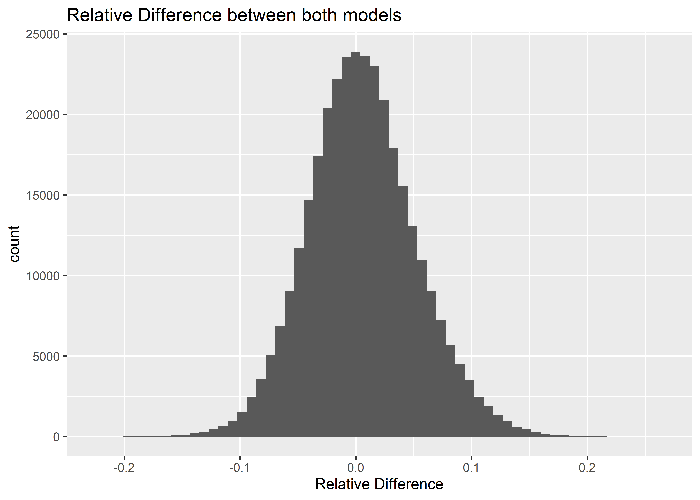

# Comparison with GAM

``` r
## Group levels Variable Power
training_set$Power_merged = training_set$Power
levels(training_set$Power_merged) = list(A = "d", B = c("e", "f", "g", "h"), C = c("i",
    "j", "k", "l", "m", "n", "o"))

# Variable Region
training_set$Region_merged = training_set$Region
levels(training_set$Region_merged)[c(1, 5, 10)] = "R11-31-74"

# Variable Brand
training_set$Brand_merged = training_set$Brand
levels(training_set$Brand_merged) <- list(A = c("Fiat", "Mercedes, Chrysler or BMW",
    "Opel, General Motors or Ford", "other", "Volkswagen, Audi, Skoda or Seat"),
    B = "Japanese (except Nissan) or Korean", C = "Renault, Nissan or Citroen")

require(parallel)
require(mgcv)
cl = makeCluster(3)  # Number of cores to use
m0_bam = bam(ClaimNb ~ offset(log(Exposure)) + Power_merged * Region_merged + Brand_merged +
    Gas + Region_merged * Brand_merged + s(DriverAge) + s(CarAge), data = training_set,
    family = poisson(link = log), cluster = cl)
stopCluster(cl)
ggplot() + geom_point(aes(x = predict(m0_bam, head(training_set, 500), type = "response"),
    y = predict(m0_gbm, newdata = head(training_set, 500), n.trees = best_iter, type = "response") *
        head(training_set$Exposure, 500))) + geom_abline(slope = 1, intercept = 0) +
    xlab("GAM") + ylab("GBM") + coord_fixed()
```

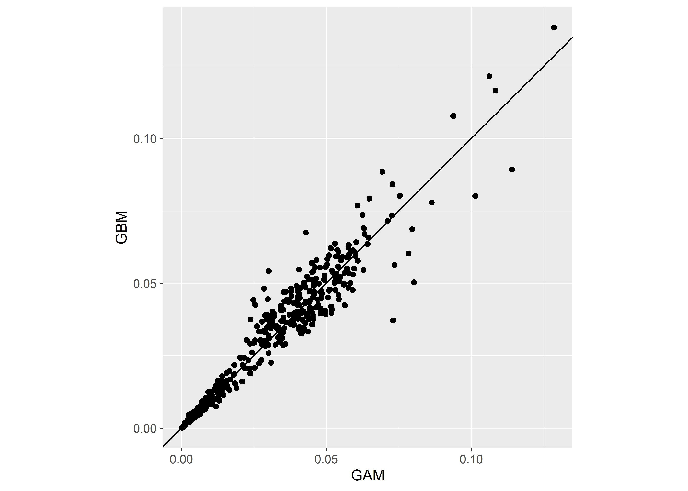

## GAM vs GBM3

Assume that customers always choose the cheapest insurance price. Let’s
compare two insurance companies, one using GAM and one using GBM. We
assume that the average cost of claim is equal for all policyholders.

``` r
pred = data.frame(gam = predict(m0_bam, training_set, type = "response"), gbm = predict(m0_gbm,
    newdata = training_set, n.trees = best_iter, type = "response") * training_set$Exposure)

pred$company = 1 * apply(pred, 1, function(x) {
    x[1] == min(x[1], x[2])
})

# Totals expected claims for company A and total observed claims
c(sum(pred$gam * pred$company), sum(pred$company * training_set$ClaimNb))
```

    ## [1] 5597.842 6724.000

``` r
# Total expected claims for company B and total observed claims
c(sum(pred$gbm * (1 - pred$company)), sum((1 - pred$company) * training_set$ClaimNb))
```

    ## [1] 6380.658 6220.000

## Final Remark

It may be required to correct the “intercept” of a gbm. Indeed, let us
take at look at the total expected number of claims and compare it to
the observed one. Let us do the same comparison with the GAM from above.

``` r
# GAM
print(paste(c("GAM predicted ", "GAM  obs"),c(sum(pred$gam), sum(training_set$ClaimNb))))
```

    ## [1] "GAM predicted  12944.0000413596" "GAM  obs 12944"

``` r
print(paste(c("GBM predicted ", "GBM  obs"),c(sum(pred$gbm), sum(training_set$ClaimNb))))
```

    ## [1] "GBM predicted  12914.7334734928" "GBM  obs 12944"

GBM tend to underestimate the total number of claims. We could correct
the claim frequency with

``` r
intercept_correction = sum(training_set$ClaimNb)/sum(pred$gbm)
intercept_correction
```

    ## [1] 1.002266

Let us do it, and recompute the error on the testing set, first without
correction, then with correction.

``` r
# Without correction

2*(sum(dpois(x = testing_set$ClaimNb, lambda = testing_set$ClaimNb,log=TRUE))-
  sum(dpois(x = testing_set$ClaimNb, lambda = predict(m0_gbm,newdata = testing_set,n.trees=best_iter, type="response") * testing_set$Exposure,
            log=TRUE)))
```

    ## Warning in predict.GBMFit(m0_gbm, newdata = testing_set, n.trees = best_iter, :
    ## predict.GBMFit does not add the offset to the predicted values.

    ## [1] 20413.93

``` r
# With correction

2*(sum(dpois(x = testing_set$ClaimNb, lambda = testing_set$ClaimNb,log=TRUE))-
  sum(dpois(x = testing_set$ClaimNb, lambda = intercept_correction * predict(m0_gbm,newdata = testing_set,n.trees=best_iter, type="response") * testing_set$Exposure,
            log=TRUE)))
```

    ## Warning in predict.GBMFit(m0_gbm, newdata = testing_set, n.trees = best_iter, :
    ## predict.GBMFit does not add the offset to the predicted values.

    ## [1] 20414.05
