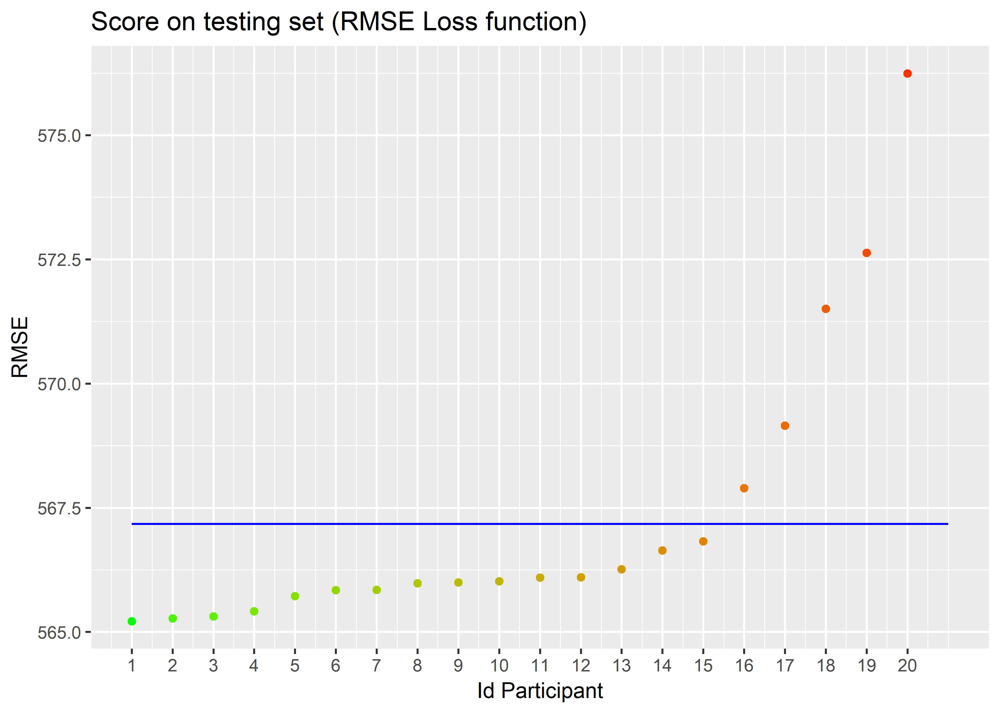
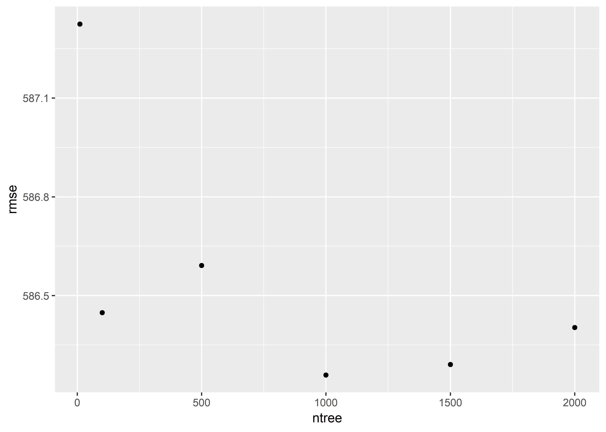
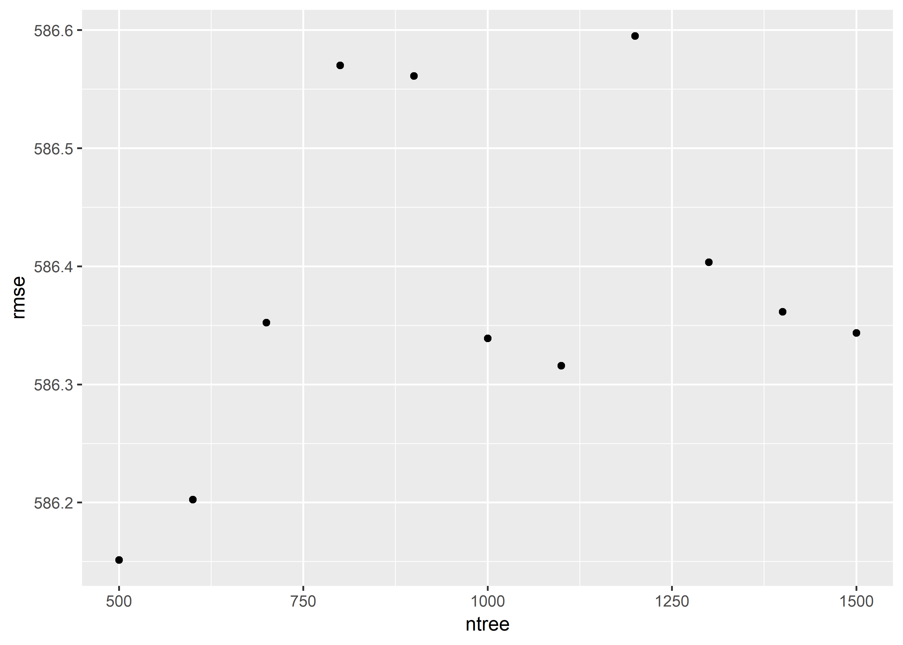

Results Pricing Game
================

-   [Winning model](#winning-model)

Please find below the results of the Pricing Game. The blue line corresponds to the null model (average claim cost of the training set as predictor on the testing set.).

``` r
library(ggplot2)
ggplot(leaderboard) + geom_point(aes(x=Letter, y=RMSE, color=RMSE)) + xlab("Id Participant") + geom_line(aes(x=Letter, y=NullModel), color="blue")+scale_x_continuous(breaks=(1:20))+
  scale_color_gradient(low="green", high="red")+theme(legend.position = "none")+ggtitle("Score on testing set (RMSE Loss function)")
```



The best model reached an RMSE as low as 565.21408 on the testing set.

Winning model
=============

Iegor Rudnytskyi kindly send us his winning solution.

``` r
library(ranger)
library(caret)
library(tidyverse)
library(magrittr)
library(here)
load("training_set.RData")

head(training_set)
```

    ##   PolicyID Power CarAge DriverAge                              Brand
    ## 1        1     g      5        50         Renault, Nissan or Citroen
    ## 2        2     d      1        43 Japanese (except Nissan) or Korean
    ## 3        3     f      4        76         Renault, Nissan or Citroen
    ## 4        4     j      2        24         Renault, Nissan or Citroen
    ## 5        5     g      5        70          Mercedes, Chrysler or BMW
    ## 6        6     i     16        59          Mercedes, Chrysler or BMW
    ##       Gas Region Density AvClaimAmount
    ## 1  Diesel    R24      97      955.7940
    ## 2 Regular    R31     483     1445.4214
    ## 3  Diesel    R24    3866      630.9743
    ## 4 Regular    R31     817      309.3372
    ## 5  Diesel    R24      43     1361.2230
    ## 6 Regular    R23     102     1444.5142

``` r
# Tune parameters
#-------------------------------------------------------------------------------
model_formula <- AvClaimAmount ~ Power + CarAge + DriverAge + Brand + Gas +
    Region + Density

p <- model.matrix(model_formula, training_set) %>% ncol() %>% subtract(1)

parameters <- expand.grid(
    mtry = seq(from = 1, to = p, length.out = 6),
    splitrule = c("variance", "extratrees", "maxstat"),
    min.node.size = c(100, 500, 1000, 2000)
    
)

control <- trainControl(method = "cv", number = 3, search = "grid",
                        allowParallel = TRUE)


model_fit <- train(
    model_formula,
    data = training_set,
    method = "ranger",
    trControl = control,
    tuneGrid = parameters
)

model_fit %>%
    extract2("results") %>%
    ggplot() +
    geom_point(aes(x = mtry, y = RMSE, color = splitrule))
```


``` r
# Tune the number of trees
#-------------------------------------------------------------------------------


parameters <- expand.grid(
    mtry = 18,
    splitrule = "maxstat",
    min.node.size = 100
    
)

ntrees <- data.frame(ntree = c(10, 100, 500, 1000, 1500, 2000), 
                     rmse = NA_real_)

for(i in 1:nrow(ntrees)) {
    fit <- train(
        model_formula,
        data = training_set,
        method = "ranger",
        trControl = control,
        tuneGrid = parameters,
        num.trees = ntrees[i, 1]
    )
    ntrees[i, 2] <- fit$results$RMSE
}
```

    ## Growing trees.. Progress: 94%. Estimated remaining time: 1 seconds.

``` r
ggplot(ntrees) + geom_point(aes(ntree, rmse))
```



``` r
parameters <- expand.grid(
    mtry = 18,
    splitrule = "maxstat",
    min.node.size = 100
    
)

# refine ntrees

ntrees <- data.frame(ntree = seq(from = 500, to = 1500, by = 100), 
                     rmse = NA_real_)

for(i in 1:nrow(ntrees)) {
    fit <- train(
        model_formula,
        data = training_set,
        method = "ranger",
        trControl = control,
        tuneGrid = parameters,
        num.trees = ntrees[i, 1]
    )
    ntrees[i, 2] <- fit$results$RMSE
}

ggplot(ntrees) + geom_point(aes(ntree, rmse))
```



``` r
# around 1000 should be file 

model_fit <- train(
    model_formula,
    data = training_set,
    method = "ranger",
    trControl = control,
    tuneGrid = parameters,
    num.trees = 1000
)

# RMSE 
model_fit$results
```

    ##   mtry splitrule min.node.size     RMSE    Rsquared      MAE   RMSESD
    ## 1   18   maxstat           100 586.3436 0.004750066 477.5951 3.816473
    ##    RsquaredSD    MAESD
    ## 1 0.001395324 1.629623

``` r
sqrt(mean((predict.train(model_fit) - training_set$AvClaimAmount) ^ 2))
```

    ## [1] 577.9231


